# Activity 生命周期与启动模式

> Activity 是 Android 四大组件之首，也是用户交互的直接载体。本文从源码层面系统梳理 Activity 的生命周期状态机、启动模式、任务栈管理以及各类边界场景，是面试和实战开发的核心参考。

---

## 一、生命周期总览

### 1.1 七大核心回调

Activity 的生命周期由 AMS/ATMS 通过 `ClientTransaction` 机制驱动（详见 [app启动流程](app启动流程.md)），最终在 `ActivityThread` 中通过 `TransactionExecutor` 依次执行。七大核心回调按顺序为：

| 回调 | 状态 | 含义 | 可见性 | 可交互 |
|------|------|------|:------:|:------:|
| `onCreate()` | Created | Activity 被创建，执行一次性初始化（setContentView、绑定数据） | 不可见 | 不可交互 |
| `onStart()` | Started | Activity 即将可见，但还未到前台 | **可见** | 不可交互 |
| `onResume()` | Resumed | Activity 到达前台，获得焦点，可以接收用户输入 | 可见 | **可交互** |
| `onPause()` | Paused | Activity 正在失去焦点（另一个 Activity 正在进入前台） | 部分可见 | 不可交互 |
| `onStop()` | Stopped | Activity 完全不可见（被另一个 Activity 完全遮挡或进入后台） | 不可见 | 不可交互 |
| `onRestart()` | — | 从 Stopped 状态重新回到前台时调用，紧接着调用 onStart() | — | — |
| `onDestroy()` | Destroyed | Activity 即将被销毁（用户按返回键、调用 finish()、系统回收） | — | — |

### 1.2 生命周期状态机



> **"对称性"记忆法**：`onCreate` ↔ `onDestroy`（创建/销毁），`onStart` ↔ `onStop`（可见/不可见），`onResume` ↔ `onPause`（前台/后台）。三组对称回调分别管理不同粒度的资源。

### 1.3 各回调的职责边界

| 回调 | 应该做什么 | 不应该做什么 |
|------|-----------|-------------|
| `onCreate` | setContentView、ViewModel 初始化、绑定 LiveData/Flow 观察者、恢复 savedInstanceState | 不要做耗时操作（影响启动速度） |
| `onStart` | 注册与可见性相关的监听（如 BroadcastReceiver）、启动动画 | 不要在此获取焦点相关资源 |
| `onResume` | 打开相机/传感器、恢复播放器、注册生命周期感知组件 | 不要在此做首次初始化（已有 onCreate） |
| `onPause` | 暂停动画/播放器、提交未保存的轻量数据 | **不要做耗时操作**（会阻塞下一个 Activity 的显示） |
| `onStop` | 释放与可见性相关的资源、保存草稿数据到数据库 | 不要做 UI 更新（此时不可见） |
| `onDestroy` | 释放所有资源（线程、连接、Bitmap） | 不要依赖此回调一定被执行（进程被杀时不会调用） |

> **关键认知**：`onPause()` 必须快速返回。在 Android 系统中，旧 Activity 的 `onPause()` 执行完毕后，新 Activity 才会开始创建和显示。如果 `onPause()` 卡顿，直接影响用户感知到的页面跳转速度。

---

## 二、生命周期源码分析

### 2.1 ClientTransaction 驱动机制

Android 9+ 引入 `ClientTransaction` 统一管理生命周期状态转换（替代之前离散的 Binder 调用）。核心流程：

```
ATMS 决定 Activity 状态变更
  → 构建 ClientTransaction {
       callback: LaunchActivityItem / PauseActivityItem / ...
       lifecycleRequest: ResumeActivityItem / StopActivityItem / ...
     }
  → 通过 Binder 发送到 App 进程
  → ApplicationThread.scheduleTransaction()
  → 投递到主线程 MessageQueue
  → TransactionExecutor.execute()
```

### 2.2 TransactionExecutor 状态推进

`TransactionExecutor` 是生命周期状态推进的核心执行器，它维护了一个状态推进路径：

```java
// TransactionExecutor.java（简化）
private void cycleToPath(ActivityClientRecord r, int finish) {
    final int start = r.getLifecycleState();  // 当前状态
    // 计算从 start 到 finish 需要经过的中间状态
    final IntArray path = mHelper.getLifecyclePath(start, finish);
    // 依次执行中间状态的回调
    for (int i = 0; i < path.size(); i++) {
        final int state = path.get(i);
        switch (state) {
            case ON_CREATE:
                mTransactionHandler.handleLaunchActivity(r, ...);
                break;
            case ON_START:
                mTransactionHandler.handleStartActivity(r, ...);
                break;
            case ON_RESUME:
                mTransactionHandler.handleResumeActivity(r, ...);
                break;
            case ON_PAUSE:
                mTransactionHandler.handlePauseActivity(r, ...);
                break;
            case ON_STOP:
                mTransactionHandler.handleStopActivity(r, ...);
                break;
            case ON_DESTROY:
                mTransactionHandler.handleDestroyActivity(r, ...);
                break;
        }
    }
}
```

> **核心设计**：`TransactionExecutor` 保证了生命周期的**顺序完整性** — 即使目标状态是 `ON_STOP`，也会确保先经过 `ON_PAUSE`，不会跳过任何中间状态。这就是为什么生命周期回调总是成对、有序出现。

### 2.3 Activity 状态常量定义

```java
// ActivityLifecycleItem.java
public static final int ON_CREATE  = 1;
public static final int ON_START   = 2;
public static final int ON_RESUME  = 3;
public static final int ON_PAUSE   = 4;
public static final int ON_STOP    = 5;
public static final int ON_DESTROY = 6;
// 注意：ON_RESTART 不在状态机编号中，它是 ON_STOP→ON_START 路径上的附加回调
```

### 2.4 onSaveInstanceState 调用时机

`onSaveInstanceState` 的调用时机在 Android 版本间有重要变化：

| Android 版本 | 调用时机 | 说明 |
|-------------|---------|------|
| Android 9 (P) 之前 | `onPause()` 之前 | 在 `onStop()` 之前、`onPause()` 之前/之后都可能 |
| Android 9 (P) 及之后 | `onStop()` 之后 | 明确在 `onStop()` 之后调用，保证数据已完全持久化 |

```
Android 9+ 的调用顺序：
onPause() → onStop() → onSaveInstanceState()
```

> **为什么改到 onStop 之后？** 因为 `onSaveInstanceState` 的目的是保存 UI 状态以备系统回收后恢复。在 Android 9 的 `ClientTransaction` 机制下，将其放在 `onStop` 之后更符合"Activity 已完全不可见、状态可以安全快照"的语义。同时也避免了 Fragment 事务在 `onSaveInstanceState` 之后执行却在 `onStop` 之前执行的混乱问题。

---

## 三、生命周期边界场景

这一节是面试重灾区，考察对生命周期的**精确**理解。

### 3.1 Activity 之间的跳转

**场景：Activity A 启动 Activity B**

```
A.onPause()
  → B.onCreate()
  → B.onStart()
  → B.onResume()
    → A.onStop()      ← 注意：A 的 onStop 在 B 完全可见之后才调用
```

**为什么 A.onStop() 在 B.onResume() 之后？**

从系统角度看，ATMS 需要保证用户始终能看到可交互的界面。如果 A 先 stop（不可见），B 还没 resume（还不可见），用户就会看到空白。因此系统的策略是：

1. 先让 A 让出焦点（`onPause`）
2. 让 B 完成创建并进入前台（`onCreate` → `onStart` → `onResume`）
3. 最后让 A 完全退出可见区域（`onStop`）

**场景：从 B 按返回键回到 A**

```
B.onPause()
  → A.onRestart()
  → A.onStart()
  → A.onResume()
    → B.onStop()
    → B.onDestroy()
```

### 3.2 Dialog 与透明 Activity

**普通 Dialog（AlertDialog 等）**

弹出 Dialog **不会**触发宿主 Activity 的任何生命周期回调。

原因：Dialog 使用的是 Activity 的 Window（通过 `WindowManager.addView()` 添加），它是 Activity Window 之上的一个子窗口，并不是一个新的 Activity。Activity 仍然处于 Resumed 状态。

**DialogTheme 的 Activity / 透明 Activity**

```
A.onPause()
  → B.onCreate() → B.onStart() → B.onResume()
  // 注意：A 的 onStop() 不会被调用！
```

当 B 是一个透明主题或 Dialog 样式的 Activity 时，A **仍然可见**（在 B 的背后），因此 A 只会走到 `onPause()`，不会执行 `onStop()`。

> **面试高频坑**：很多候选人会回答"A 会 onStop"。判断标准是：**旧 Activity 是否被完全遮挡**。如果新 Activity 是透明/半透明/Dialog 样式，旧 Activity 仍然可见，则旧 Activity 只 `onPause` 不 `onStop`。

### 3.3 Fragment 与 Activity 的生命周期联动

Fragment 的生命周期与宿主 Activity **绑定但不完全同步**：

```
Activity.onCreate()
  → Fragment.onAttach()
  → Fragment.onCreate()
  → Fragment.onCreateView()
  → Fragment.onViewCreated()
  → Fragment.onActivityCreated()  // 已废弃，用 onViewCreated + Activity.onCreate 中的回调替代
Activity.onStart()
  → Fragment.onStart()
Activity.onResume()
  → Fragment.onResume()

--- 退出时反序 ---

Activity.onPause()
  → Fragment.onPause()
Activity.onStop()
  → Fragment.onStop()
Activity.onDestroy()
  → Fragment.onDestroyView()
  → Fragment.onDestroy()
  → Fragment.onDetach()
```

**Fragment 生命周期的关键注意点**：

| 场景 | 说明 |
|------|------|
| `replace` vs `add` + `hide` | `replace` 会触发旧 Fragment 的 `onDestroyView()`，`add/hide` 则不会 |
| `addToBackStack` | 按返回键时 Fragment 回到 `onCreateView()`，而非重新 `onCreate()` |
| ViewPager2 + Fragment | 离屏 Fragment 会走到 `onDestroyView()` 但 Fragment 实例仍存活 |
| `setMaxLifecycle()` | 可手动限制 Fragment 的最大生命周期状态（ViewPager2 用此实现懒加载） |

### 3.4 多窗口模式（Multi-Window）

Android 7.0+ 支持分屏模式，这对生命周期产生了重要影响：

**Android 9 之前**：只有获得焦点的 Activity 处于 `Resumed` 状态，另一个窗口的 Activity 处于 `Paused` 状态。

**Android 10+**：所有可见的 Activity 都可以处于 `Resumed` 状态（**Multi-Resume** 特性）。用户切换焦点时，失去焦点的 Activity 会收到 `onTopResumedActivityChanged(false)` 回调，但仍保持 `Resumed` 状态。

```kotlin
// Android 10+ 判断是否是最顶层可交互 Activity
override fun onTopResumedActivityChanged(isTopResumedActivity: Boolean) {
    if (isTopResumedActivity) {
        // 获得焦点，可以独占相机等资源
    } else {
        // 失去焦点（但仍可见、仍 Resumed），应释放独占资源
    }
}
```

> **关键影响**：在多窗口模式下，不能再用 `onPause`/`onResume` 来判断"用户是否正在看我"。应使用 `onTopResumedActivityChanged` 或 `Lifecycle.Event`。

### 3.5 Configuration 变更

当设备配置发生变化（旋转屏幕、语言切换、深色模式切换等），默认行为是**销毁并重建 Activity**：

```
onPause() → onStop() → onSaveInstanceState() → onDestroy()
  → onCreate(savedInstanceState) → onStart() → onResume()
```

**阻止重建**：在 `AndroidManifest.xml` 中声明 `configChanges`：

```xml
<activity
    android:name=".MainActivity"
    android:configChanges="orientation|screenSize|uiMode" />
```

声明后，对应的配置变化不再触发重建，改为回调 `onConfigurationChanged()`：

```kotlin
override fun onConfigurationChanged(newConfig: Configuration) {
    super.onConfigurationChanged(newConfig)
    // 自行处理配置变化，如切换深色模式主题
}
```

| 常用 configChanges 值 | 含义 |
|----------------------|------|
| `orientation` | 屏幕方向变化 |
| `screenSize` | 屏幕尺寸变化（Android 3.2+ 旋转时也会触发） |
| `smallestScreenSize` | 物理屏幕尺寸变化（如折叠屏展开） |
| `uiMode` | 深色/浅色模式切换 |
| `locale` | 语言切换 |
| `keyboard` | 键盘类型变化 |
| `keyboardHidden` | 软键盘弹出/收起 |

> **最佳实践**：除非有明确理由（如视频播放器不希望旋转中断播放），否则不要滥用 `configChanges`。让系统重建 Activity 配合 `ViewModel` + `SavedStateHandle` 是 Google 推荐的标准做法，可以确保 UI 正确适配新配置。

### 3.6 进程被杀与状态恢复

当 App 进入后台，系统可能因内存不足杀死进程。用户通过最近任务切回时，系统会**重建整个 Activity 栈**：

```
进程被杀前的栈：         重建后：
   C (top)                C.onCreate(savedState)
   B                      B （暂不创建，等用户返回到 B 时才创建）
   A (bottom)             A （暂不创建）
```

**状态保存与恢复的层次结构**：

| 层次 | 机制 | 数据类型 | 生存范围 |
|------|------|---------|---------|
| View 层 | 自动保存（需设置 `android:id`） | ScrollView 滚动位置、EditText 文本、CheckBox 选中状态 | onSaveInstanceState/onRestoreInstanceState |
| Activity 层 | `onSaveInstanceState(outState: Bundle)` | 开发者手动保存的 UI 状态（如搜索关键词、Tab 选中位置） | Bundle，有大小限制（约 1MB） |
| ViewModel 层 | `SavedStateHandle` | 需要跨进程死亡保存的关键数据（如列表的筛选条件） | 序列化到 Bundle |
| 持久化层 | Room / DataStore / 文件 | 业务数据 | 永久保存 |

---

## 四、启动模式（Launch Mode）

### 4.1 五种启动模式

启动模式决定了 Activity 实例的创建方式和任务栈归属。在 `AndroidManifest.xml` 中通过 `android:launchMode` 声明：

#### standard（默认）

**行为**：每次启动都创建新实例，压入启动者所在的 Task 栈顶。

```
启动前 Task:  A → B
启动 B (standard):   A → B → B'    ← 新建了一个 B 实例
```

- 这是默认模式，绝大多数 Activity 使用此模式
- 同一个 Activity 可以有多个实例同时存在于同一个 Task 中
- Android 12+ 变化：如果从非 Activity 的 Context（如 Service、BroadcastReceiver）启动 standard Activity，不再默认创建新 Task，而是放入调用者的 Task（如果可以确定的话）

#### singleTop

**行为**：如果目标 Activity 已经在**当前 Task 的栈顶**，则不创建新实例，而是调用已有实例的 `onNewIntent()`。如果不在栈顶，则与 standard 相同。

```
启动前 Task:  A → B
启动 B (singleTop):  A → B          ← B 在栈顶，不新建，调用 B.onNewIntent()

启动前 Task:  A → B → C
启动 B (singleTop):  A → B → C → B' ← B 不在栈顶，新建实例
```

**onNewIntent 的生命周期**：

```
onPause() → onNewIntent(intent) → onResume()
```

> **注意**：`onNewIntent()` 中收到的 Intent 不会自动成为 `getIntent()` 的返回值。如果需要更新，必须手动调用 `setIntent(intent)`。

**典型场景**：消息通知页、搜索结果页 — 避免连续点击通知创建多个相同页面。

#### singleTask

**行为**：系统在整个系统中查找是否存在匹配 `taskAffinity` 的 Task：
- 如果目标 Task 存在且其中有目标 Activity 的实例：将该 Task 调到前台，清除目标 Activity 之上的所有 Activity（**clearTop 效果**），调用 `onNewIntent()`
- 如果目标 Task 存在但没有目标 Activity：在该 Task 中创建新实例
- 如果目标 Task 不存在：创建新 Task 并在其中创建新实例

```
Task 1:  A → B → C          Task 2:  D → E
启动 D (singleTask, taskAffinity=Task2):
  → Task 2 调到前台
  → E 被销毁（clearTop）
  → D.onNewIntent()
  
结果 Task 2:  D              Task 1:  A → B → C (后台)
```

> **关键点**：singleTask 的 clearTop 行为是隐含的 — 启动一个已存在的 singleTask Activity 时，它上面的所有 Activity 都会被 pop 并 destroy。这在面试中常被忽略。

**典型场景**：App 首页 — 从任何地方回到首页时，清除首页之上的所有页面。

#### singleInstance

**行为**：与 singleTask 类似，但更严格 — 目标 Activity 独占一个 Task，该 Task 中**不允许有任何其他 Activity**。

```
Task 1:  A → B
启动 C (singleInstance):
  → 新建 Task 2，C 是唯一成员
  → 如果从 C 启动 D(standard)，D 会进入 Task 1 而非 Task 2

Task 1:  A → B → D          Task 2:  C (独占)
```

**典型场景**：来电界面、系统级悬浮窗 — 全局唯一且独占。

#### singleInstancePerTask（Android 12+）

**行为**：在每个 Task 中最多存在一个实例。不同 Task 可以各自拥有一个实例。同一 Task 内如果已存在，则 clearTop + `onNewIntent()`。

```
Task 1:  A → B → C(singleInstancePerTask)
启动 C (从 Task 1):  clearTop → A → C.onNewIntent()

Task 2:  D → E
启动 C (从 Task 2，带 FLAG_ACTIVITY_NEW_TASK + FLAG_ACTIVITY_MULTIPLE_TASK):
  → 新建 Task 3，创建 C 的新实例
```

**典型场景**：多窗口模式下支持同一 Activity 在不同窗口各一个实例（如文档编辑器）。

### 4.2 五种模式对比总结

| 模式 | 实例限制 | Task 限制 | clearTop | onNewIntent |
|------|---------|----------|:--------:|:-----------:|
| standard | 无限制 | 跟随启动者 | 否 | 否 |
| singleTop | 栈顶复用 | 跟随启动者 | 否 | 在栈顶时触发 |
| singleTask | 全局唯一 | 按 taskAffinity | **是** | 已存在时触发 |
| singleInstance | 全局唯一 | **独占 Task** | 是 | 已存在时触发 |
| singleInstancePerTask | **每个 Task** 唯一 | 按 Task 隔离 | **是** | 同 Task 内存在时触发 |

### 4.3 源码中的启动模式解析

ATMS 通过 `ActivityStarter` 处理启动模式逻辑，核心在 `startActivityUnchecked()` 方法中：

```java
// ActivityStarter.java（简化）
private int startActivityUnchecked(...) {
    // 1. 计算 launch flags
    computeLaunchingTaskFlags();
    
    // 2. 计算源 Task
    computeSourceRootTask();
    
    // 3. 根据 launch mode 和 flags 决定复用行为
    final Task reusedTask = getReusableTask();
    
    if (reusedTask != null) {
        // 找到可复用的 Task
        if (mMovedToFront) {
            // 将 Task 移到前台
            reusedTask.moveToFront("startActivityUnchecked");
        }
    }
    
    // 4. 处理 clearTop
    final ActivityRecord top = reusedTask.getTopNonFinishingActivity();
    if (top != null && top.getTask() == reusedTask) {
        if ((mLaunchFlags & FLAG_ACTIVITY_CLEAR_TOP) != 0
                || isLaunchModeOneOf(LAUNCH_SINGLE_TASK, LAUNCH_SINGLE_INSTANCE)) {
            // 清除目标 Activity 之上的所有 Activity
            top.finishIfSameAffinity(r);
        }
    }
    
    // 5. 决定是 deliverNewIntent 还是创建新实例
    if (dontStart) {
        deliverNewIntent(top);  // → 触发 onNewIntent()
    } else {
        mTargetRootTask.startActivityLocked(r, ...);  // 创建新实例
    }
}
```

---

## 五、任务栈与 Intent Flags

### 5.1 Task 与 taskAffinity

**Task 的本质**：Task 是一组 Activity 的栈结构，用户通过"最近任务"看到的每一个卡片就是一个 Task。在系统内部，Task 由 `TaskRecord`（Android 12+ 改名为 `Task`）表示。

**taskAffinity**：每个 Activity 都有一个 taskAffinity 属性，默认值为 App 的包名。它决定了 Activity"倾向于"归属哪个 Task。

```xml
<!-- 默认：taskAffinity = 包名（所有 Activity 归入同一个 Task） -->
<activity android:name=".MainActivity" />

<!-- 自定义 taskAffinity：与主 Task 分离 -->
<activity
    android:name=".SettingsActivity"
    android:taskAffinity="com.example.settings"
    android:launchMode="singleTask" />
```

> **重要**：taskAffinity 单独设置**不会**改变 Activity 的 Task 归属。它只在以下两种情况下生效：
> 1. 启动模式为 `singleTask` 或 `singleInstance` 时
> 2. Intent 中设置了 `FLAG_ACTIVITY_NEW_TASK` 时

### 5.2 allowTaskReparenting

当 `allowTaskReparenting="true"` 时，Activity 可以从启动它的 Task 迁移到 taskAffinity 匹配的 Task。

**经典场景**：

```
1. App A 启动了 App B 的 Activity X（例如浏览器打开邮件中的链接）
   → X 进入 App A 的 Task

2. 用户按 Home 键，然后从 Launcher 点击 App B 的图标
   → App B 的 Task 被调到前台
   → Activity X 从 App A 的 Task 迁移到 App B 的 Task（因为 X 的 taskAffinity 匹配 App B）
```

### 5.3 常用 Intent Flags

Intent Flags 提供了比 `launchMode` 更灵活的运行时控制。当两者冲突时，**Intent Flags 的优先级高于 Manifest 中的 launchMode**。

| Flag | 效果 | 等价/配合 |
|------|------|----------|
| `FLAG_ACTIVITY_NEW_TASK` | 在匹配 taskAffinity 的 Task 中启动。如果没有匹配的 Task，创建新 Task | singleTask 的 Task 选择行为（但不含 clearTop） |
| `FLAG_ACTIVITY_CLEAR_TOP` | 如果目标 Activity 已在 Task 中，清除其上方的所有 Activity | 常与 NEW_TASK 配合实现 singleTask 效果 |
| `FLAG_ACTIVITY_SINGLE_TOP` | 如果目标 Activity 在栈顶，不新建，调用 onNewIntent | 等价于 singleTop |
| `FLAG_ACTIVITY_CLEAR_TASK` | 清空目标 Task 中的所有 Activity，然后创建目标 Activity（必须配合 NEW_TASK） | 比 CLEAR_TOP 更彻底 |
| `FLAG_ACTIVITY_EXCLUDE_FROM_RECENTS` | 不在"最近任务"中显示 | — |
| `FLAG_ACTIVITY_NO_HISTORY` | Activity 不保留在栈中，一旦离开就销毁 | — |
| `FLAG_ACTIVITY_REORDER_TO_FRONT` | 如果 Activity 已在 Task 中，将其移到栈顶（不销毁其上方的 Activity） | — |
| `FLAG_ACTIVITY_MULTIPLE_TASK` | 配合 NEW_TASK 使用，强制创建新 Task（即使已有匹配 taskAffinity 的 Task） | — |

### 5.4 常见组合模式

**回到首页并清除中间页面**（类似 singleTask）：

```kotlin
val intent = Intent(this, MainActivity::class.java).apply {
    flags = Intent.FLAG_ACTIVITY_CLEAR_TOP or Intent.FLAG_ACTIVITY_SINGLE_TOP
}
startActivity(intent)
// 效果：MainActivity 之上的所有 Activity 被清除，MainActivity.onNewIntent() 被调用
```

> **注意 clearTop + standard 的"坑"**：如果 MainActivity 是 standard 模式，`FLAG_ACTIVITY_CLEAR_TOP` 会**先销毁旧的 MainActivity，再创建一个新的**（而不是复用旧实例）。要想复用旧实例并触发 `onNewIntent`，需要同时加上 `FLAG_ACTIVITY_SINGLE_TOP`。

**从通知/外部启动并全新打开**：

```kotlin
val intent = Intent(this, DetailActivity::class.java).apply {
    flags = Intent.FLAG_ACTIVITY_NEW_TASK or Intent.FLAG_ACTIVITY_CLEAR_TASK
}
startActivity(intent)
// 效果：清空 Task 中所有现有 Activity，创建全新的 DetailActivity
```

**从非 Activity Context 启动**：

```kotlin
// 从 Service / BroadcastReceiver 启动 Activity
// 必须加 FLAG_ACTIVITY_NEW_TASK，否则会抛异常
val intent = Intent(context, SomeActivity::class.java).apply {
    flags = Intent.FLAG_ACTIVITY_NEW_TASK
}
context.startActivity(intent)
```

### 5.5 Manifest 声明 vs Intent Flags 对照

| 能力 | Manifest launchMode | Intent Flag |
|------|-------------------|-------------|
| 创建新 Task | singleTask / singleInstance | FLAG_ACTIVITY_NEW_TASK |
| 栈顶复用 | singleTop | FLAG_ACTIVITY_SINGLE_TOP |
| 清除上方 Activity | singleTask（隐含） | FLAG_ACTIVITY_CLEAR_TOP |
| 独占 Task | singleInstance | 无直接等价 |
| 清空整个 Task | 无 | FLAG_ACTIVITY_CLEAR_TASK |
| 不进入最近任务 | `android:excludeFromRecents="true"` | FLAG_ACTIVITY_EXCLUDE_FROM_RECENTS |

> **优先级规则**：当 Manifest 和 Intent Flags 冲突时，Intent Flags 优先。例如，Manifest 声明 `standard`，但 Intent 设置了 `FLAG_ACTIVITY_SINGLE_TOP`，则按 `singleTop` 行为处理。

---

## 六、常见面试题与解答

### Q1：Activity A 启动 Activity B，两者的生命周期回调顺序是什么？

**答**：

```
A.onPause() → B.onCreate() → B.onStart() → B.onResume() → A.onStop()
```

关键点：A 的 `onStop()` 在 B 的 `onResume()` 之后才执行。这是因为系统要保证用户始终能看到一个可交互的界面 — A 先 pause 让出焦点，B 完成显示后，A 才完全退到后台。

如果 B 是透明/Dialog 样式的 Activity，A 的 `onStop()` 不会被调用（因为 A 仍然可见）。

---

### Q2：弹出一个 AlertDialog 会影响 Activity 的生命周期吗？

**答**：不会。AlertDialog 是通过 `WindowManager.addView()` 添加的一个窗口层级较高的子窗口，它属于 Activity 所拥有的 Window 体系内。Activity 仍然处于 Resumed 状态，不会触发任何生命周期回调。

只有当启动一个新的 Activity（即使它的主题是 Dialog 样式）时，才会触发当前 Activity 的 `onPause()`。**判断标准不是"视觉上是否像 Dialog"，而是"是否启动了一个新的 Activity 组件"。**

---

### Q3：说说 onSaveInstanceState 和 onRestoreInstanceState 的调用时机

**答**：

**onSaveInstanceState**：
- Android 9 之前：在 `onPause()` 前后调用（时机不确定）
- Android 9+：在 `onStop()` 之后调用
- 只在"系统可能回收 Activity"的场景调用（按 Home、旋转屏幕、启动新 Activity 等），**用户主动按返回键时不会调用**（因为这是用户明确意图要销毁）

**onRestoreInstanceState**：
- 在 `onStart()` 之后、`onResume()` 之前调用
- 只有 `savedInstanceState` 不为 null 时才调用
- 也可以在 `onCreate(savedInstanceState)` 中处理恢复逻辑（`savedInstanceState` 参数不为 null 时）

> 两者的区别：`onCreate` 需要判空 `savedInstanceState`，`onRestoreInstanceState` 不需要（系统只在有数据恢复时才调用它）。

---

### Q4：singleTask 和 singleInstance 的区别是什么？

**答**：

| 维度 | singleTask | singleInstance |
|------|-----------|---------------|
| Task 共享 | 可以与其他 Activity 共处同一个 Task | **独占 Task**，不允许其他 Activity 进入 |
| 从该 Activity 启动新 Activity | 新 Activity 进入同一个 Task | 新 Activity 进入**其他 Task** |
| 实例数 | 全局唯一 | 全局唯一 |
| clearTop | 有（隐含） | 有 |

singleInstance 更严格：它的 Task 中永远只有它一个 Activity。如果从 singleInstance Activity 启动一个新的 standard Activity，新 Activity 会进入其他 Task（通常是之前的 Task 或新建 Task）。

---

### Q5：FLAG_ACTIVITY_CLEAR_TOP 和 singleTask 有什么区别？

**答**：

- `FLAG_ACTIVITY_CLEAR_TOP` 单独使用时，如果目标 Activity 是 standard 模式，系统会**先销毁旧实例及其上方所有 Activity，再创建新实例**（destroy + recreate）
- `singleTask` 的 clearTop 行为是**复用已有实例**并调用 `onNewIntent()`（不销毁目标 Activity 自身）
- 如果想用 Flag 实现与 singleTask 完全相同的效果，需要 `FLAG_ACTIVITY_CLEAR_TOP | FLAG_ACTIVITY_SINGLE_TOP`

```
FLAG_ACTIVITY_CLEAR_TOP (alone, standard):
  栈 A → B → C → D，启动 B
  → C、D 被销毁，旧 B 被销毁
  → 创建新 B
  → A → B (new)

singleTask 或 CLEAR_TOP + SINGLE_TOP:
  栈 A → B → C → D，启动 B
  → C、D 被销毁
  → 复用旧 B，调用 B.onNewIntent()
  → A → B (same instance)
```

---

### Q6：如何判断 Activity 是否在前台？onResume 就代表可见了吗？

**答**：

`onResume()` 表示 Activity 处于前台获得焦点，但不代表用户已能看到画面。实际上 `onResume` 之后还需要：
1. `WindowManager.addView()` 添加 DecorView
2. `ViewRootImpl` 注册窗口到 WMS
3. 等待 Vsync 触发 measure/layout/draw
4. SurfaceFlinger 合成上屏

因此 `onResume` 到用户真正看到画面之间至少有 1-2 帧的延迟。

判断 Activity "正在被用户看到"的推荐方式：
- **生命周期感知**：用 `Lifecycle.State.isAtLeast(STARTED)` 判断可见，`RESUMED` 判断前台
- **多窗口场景**：用 `onTopResumedActivityChanged()` 判断是否是最顶层可交互的 Activity
- **首帧渲染完成**：用 `ViewTreeObserver.OnGlobalLayoutListener` 或 `View.post {}` 确认视图已绘制

---

### Q7：onCreate 的 setContentView 和 onResume 后的 addView 是什么关系？

**答**：

两者职责完全不同，分别负责"构建"和"显示"：

**`setContentView()` — 内存中组装 View 树（onCreate 阶段）**

```
Activity.setContentView(R.layout.xxx)
  -> PhoneWindow.setContentView()
      -> 1. 创建 DecorView（如果还没有）
      -> 2. LayoutInflater.inflate() 解析 XML -> 生成 View 对象树
      -> 3. 将 View 树 add 到 DecorView 内部的 content 区域（id/content FrameLayout）
```

此时只是在内存中创建了 Java 对象并建立了父子关系，没有 ViewRootImpl、没有注册到 WMS、没有触发 measure/layout/draw，屏幕上什么都看不到。

**`WindowManager.addView()` — 真正显示到屏幕（onResume 之后）**

```
ActivityThread.handleResumeActivity()
  -> WindowManager.addView(decorView)
      -> 创建 ViewRootImpl
          -> ViewRootImpl.setView()
              -> Session.addToDisplayAsUser() -> 注册到 WMS，分配 Surface
              -> requestLayout() -> 等 Vsync -> measure/layout/draw -> 上屏
```

**为什么 setContentView 要放在 onCreate 而不是 onResume：**

1. **保证后续生命周期能操作 View**：`setContentView` 之后才能 `findViewById`，如果延后到 `onResume`，`onCreate`/`onStart` 中所有 View 操作都会空指针
2. **只需执行一次**：`onCreate` 只调用一次，而 `onResume` 会多次调用（从后台回来、对话框关闭等），View 树只需构建一次
3. **职责分离**：`onCreate` 负责"准备什么要显示"，系统在 `onResume` 后负责"执行显示"

> 一句话：`setContentView()` 是在内存中"组装零件"，`addView` 才是"通电开机"。

---

### Q8：什么场景下 Activity 的 onDestroy 不会被调用？

**答**：

当进程被系统直接杀死时（如 LMK 低内存杀进程、用户在设置中强制停止、`kill -9` 等），进程中所有未销毁的 Activity 的 `onDestroy()` 都不会被调用。

因此：
- **不要在 `onDestroy()` 中做关键数据的持久化**，应在 `onStop()` 中完成
- 资源清理应优先使用 `LifecycleObserver` 或 `ViewModel.onCleared()` 等机制
- 需要持久化的重要数据，应使用 Room/DataStore 在适当的时机（如 `onStop`）保存

---

### Q9：Activity 重建时，如何保证 ViewModel 中的数据不丢失？

**答**：

ViewModel 的数据保持依赖两个机制：

1. **Configuration Change（旋转等）**：ViewModel 实例存储在 `ViewModelStore` 中，而 `ViewModelStore` 挂载在 Activity 的 `NonConfigurationInstance` 上。当 Activity 因配置变更重建时，`NonConfigurationInstance` 通过 `ActivityThread.performDestroyActivity()` 保留，新 Activity 在 `attach()` 时获取旧的 `ViewModelStore`，因此 ViewModel 实例不变、数据不丢失。

2. **进程被杀**：ViewModel 实例会随进程一起消亡。此时需要 `SavedStateHandle` — 它将数据序列化到 Bundle 中，跨进程死亡保存。

```kotlin
class MyViewModel(private val savedState: SavedStateHandle) : ViewModel() {
    // 跨配置变更：ViewModel 实例保持，数据自然不丢
    val list = mutableListOf<Item>()
    
    // 跨进程死亡：通过 SavedStateHandle 保存关键状态
    val searchQuery = savedState.getStateFlow("query", "")
}
```

---

### Q10：taskAffinity 设置后什么时候生效？

**答**：

taskAffinity 单独设置**不会产生任何效果**。它必须配合以下条件之一才能生效：

1. **launchMode 为 singleTask / singleInstance**：系统根据 taskAffinity 选择或创建 Task
2. **Intent 包含 FLAG_ACTIVITY_NEW_TASK**：系统根据 taskAffinity 匹配已有 Task 或创建新 Task
3. **allowTaskReparenting = true**：Activity 可以从当前 Task 迁移到 taskAffinity 匹配的 Task

默认情况下（standard 模式、无特殊 Flag），Activity 跟随启动者所在的 Task，taskAffinity 的值被忽略。

---

### Q11：Android 12 对启动模式有什么变化？为什么引入 singleInstancePerTask？

**答**：

Android 12 的主要变化：

1. **从非 Activity Context 启动行为放宽**：不再强制必须加 `FLAG_ACTIVITY_NEW_TASK`（在某些场景下系统可以推断目标 Task）

2. **引入 singleInstancePerTask**：解决了 singleInstance 的局限性。在多窗口/ 多屏场景下，用户可能需要同一个 Activity 在不同窗口各有一个实例（如文档编辑器同时编辑两个文件）。singleInstance 全局唯一的限制阻碍了这种用法。singleInstancePerTask 允许在不同 Task 中各有一个实例，同一 Task 内保持唯一。

3. **后台启动限制更严格**：限制从后台启动前台 Activity 的能力，需要使用 `SYSTEM_ALERT_WINDOW` 权限或通知的 PendingIntent 等合规方式。
