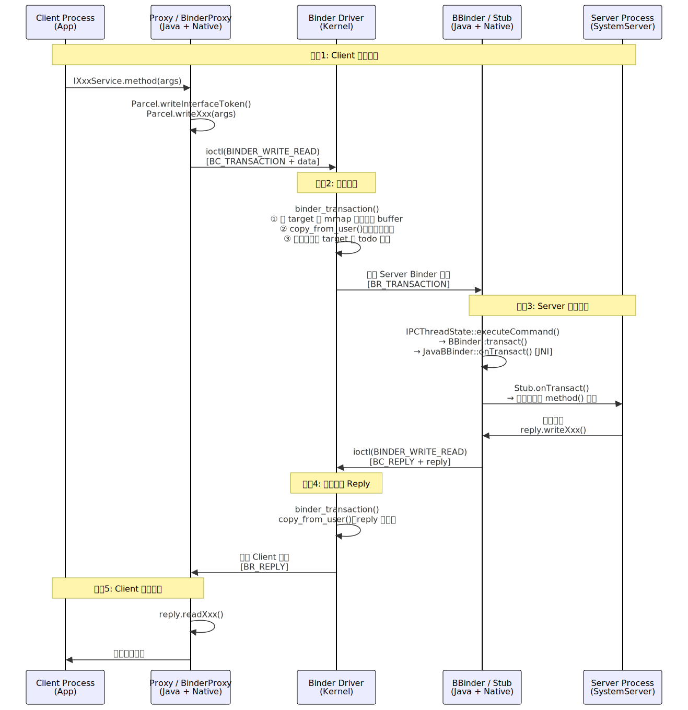
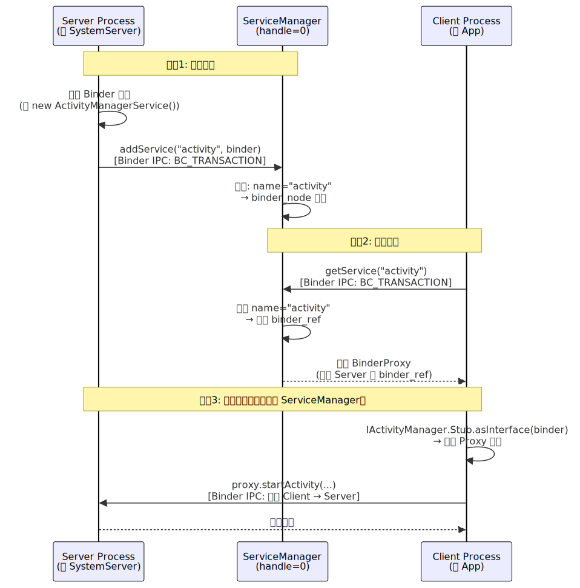

# Binder 机制深度解析

> 基于 AOSP Android 13（android-13.0.0_r81）源码分析。Binder 是 Android 最核心的 IPC（进程间通信）机制，四大组件的跨进程通信、SystemServer 与 App 进程的交互、AIDL 接口调用——底层都是 Binder。理解 Binder 是深入 Android Framework 的必经之路。

---

## 一、概述与设计动机

### 1.1 为什么需要 IPC

Android 基于 Linux 内核，每个 App 运行在独立的进程中，进程之间的虚拟地址空间完全隔离。一个进程无法直接访问另一个进程的内存。但 Android 的架构设计高度依赖跨进程协作：

- App 调用系统服务（AMS、WMS、PMS 等），需要跨进程到 SystemServer
- 系统服务回调 App（如通知 Activity 生命周期变化），也需要跨进程
- App 之间共享数据（ContentProvider），同样涉及跨进程

因此，一个高效、安全、易用的 IPC 机制是 Android 系统架构的基石。

### 1.2 Linux 传统 IPC 的不足

Linux 内核提供了多种 IPC 机制，但都不完全满足 Android 的需求：

| IPC 方式 | 拷贝次数 | 安全性（身份校验） | 易用性 | 不足 |
|----------|---------|-----------------|--------|------|
| **管道（Pipe）** | 2 次 | 无 | 低 | 单向通信，仅适用于父子进程 |
| **Socket** | 2 次 | 需自行实现 | 中 | 通用但开销大，无内核级身份校验 |
| **共享内存** | 0 次 | 无 | 低 | 性能最好但需自行处理同步，无安全机制 |
| **信号（Signal）** | 0 次 | 无 | 低 | 只能传递信号编号，无法携带数据 |
| **消息队列** | 2 次 | 无 | 中 | 不适合大数据量和频繁通信 |

### 1.3 Binder 的核心优势

Android 基于 OpenBinder 设计了 Binder 机制，专门为移动操作系统的 C/S 架构优化：

| 维度 | Binder 的设计 | 优势 |
|------|-------------|------|
| **性能** | mmap 实现一次拷贝 | 比管道/Socket 的两次拷贝快，仅次于共享内存 |
| **安全** | 内核驱动校验调用方 UID/PID | 不可伪造，无需应用层自行校验身份 |
| **易用** | AIDL 自动生成 Stub/Proxy 代码 | 开发者像调用本地方法一样调用远程服务 |
| **架构** | 天然的 C/S 模型 | 完美匹配 Android 的 App ↔ SystemServer 架构 |

> **核心认知**：Binder 不是某一种 IPC 的简单替代，而是在性能、安全、易用性三个维度上取得了最佳平衡。共享内存性能更好（零拷贝），但缺乏安全性和易用性；Socket 通用性强，但性能差且无内核级安全。Binder 是 Android 场景下的最优解。

---

## 二、Binder 架构分层

Binder 体系从上到下分为四层，每层有明确的职责：



### 2.1 四层架构

| 层级 | 关键类/组件 | 职责 |
|------|-----------|------|
| **Application** | AIDL 接口、Client/Server 业务代码 | 定义接口，实现业务逻辑 |
| **Java Framework** | `Binder`、`BinderProxy`、`Stub`、`Proxy`、`ServiceManager` | 提供 Java 层的 Binder 抽象，AIDL 代码生成的目标层 |
| **Native (C++)** | `ProcessState`、`IPCThreadState`、`BpBinder`、`BBinder` | 管理进程/线程级 Binder 状态，执行实际的 ioctl 通信 |
| **Kernel** | `/dev/binder` 驱动、`binder_proc`、`binder_node`、`binder_ref` | 实现 mmap、数据拷贝、线程唤醒、引用计数 |

### 2.2 关键类速查

**Client 端调用链（从上到下）：**

```
AIDL Proxy（Java）
  → BinderProxy（Java）
    → BpBinder（Native C++）
      → IPCThreadState::transact()
        → ioctl(fd, BINDER_WRITE_READ, &bwr)
          → Binder 驱动
```

**Server 端处理链（从下到上）：**

```
Binder 驱动
  → IPCThreadState::executeCommand(BR_TRANSACTION)
    → BBinder::transact()
      → JavaBBinder::onTransact()  [JNI 桥接]
        → Binder.execTransact()（Java）
          → Stub.onTransact()
            → 具体方法实现
```

**进程级单例 ProcessState：**

```cpp
// frameworks/native/libs/binder/ProcessState.cpp
sp<ProcessState> ProcessState::self() {
    // 每个进程只有一个 ProcessState 实例
    if (gProcess != nullptr) return gProcess;

    gProcess = new ProcessState(kDefaultDriver); // kDefaultDriver = "/dev/binder"
    return gProcess;
}

ProcessState::ProcessState(const char* driver)
    : mDriverFD(open_driver(driver)) // 打开 /dev/binder
{
    // mmap: 映射 ~1MB 的接收缓冲区
    mVMStart = mmap(nullptr, BINDER_VM_SIZE,
                    PROT_READ, MAP_PRIVATE | MAP_NORESERVE,
                    mDriverFD, 0);
}
```

> **关键认知**：`ProcessState` 是进程级单例，负责打开 `/dev/binder` 设备和建立 mmap 映射。`IPCThreadState` 是线程级单例（TLS），负责实际的 ioctl 读写。这种分离设计确保了 Binder 通信的线程安全。

---

## 三、Binder 驱动与 mmap 一次拷贝原理

这是 Binder 最核心的设计，也是面试最高频的考点。

### 3.1 传统 IPC 的两次拷贝问题

以管道或 Socket 为例，一次跨进程数据传输需要两次内存拷贝：

```
Process A（发送方）                    Process B（接收方）
用户空间数据                            用户空间缓冲区
    │                                      ▲
    │ ① copy_from_user()                   │ ② copy_to_user()
    ▼                                      │
────────────── Kernel Space ──────────────
         内核缓冲区（中转站）
```

- **第 1 次拷贝**：`copy_from_user()` -- 从发送方用户空间拷贝到内核缓冲区
- **第 2 次拷贝**：`copy_to_user()` -- 从内核缓冲区拷贝到接收方用户空间

数据经历了三块内存：发送方用户空间 → 内核空间 → 接收方用户空间。

### 3.2 Binder 的 mmap 魔法

Binder 通过 `mmap` 在接收方进程建立了一个巧妙的共享映射，将两次拷贝减少为一次：



**核心原理：**

当接收方进程打开 `/dev/binder` 时，Binder 驱动通过 `binder_mmap()` 做了一件关键的事：分配物理页，然后将这些物理页**同时映射**到内核虚拟地址空间和接收方的用户虚拟地址空间。

```
Process A（发送方）                    Process B（接收方）
用户空间数据                            mmap 映射区（用户空间）
    │                                      ▲
    │ ① copy_from_user()                   │ 无需拷贝！
    ▼                                      │ 同一物理页
────────────── Kernel Space ──────────────
         binder_alloc 缓冲区 ─── 同一物理页
```

- **唯一一次拷贝**：`copy_from_user()` 将数据从发送方用户空间拷贝到内核的 `binder_alloc` 缓冲区
- **零拷贝读取**：由于内核缓冲区和接收方 mmap 区域映射到**同一物理页**，接收方直接读取即可，无需 `copy_to_user()`

### 3.3 关键源码分析

**`binder_mmap()` -- 建立共享映射：**

```c
// drivers/android/binder.c
static int binder_mmap(struct file *filp, struct vm_area_struct *vma) {
    struct binder_proc *proc = filp->private_data;

    // 限制映射大小不超过 4MB（实际 ProcessState 请求约 1MB）
    if ((vma->vm_end - vma->vm_start) > SZ_4M)
        vma->vm_end = vma->vm_start + SZ_4M;

    // 初始化 binder_alloc，记录映射的虚拟地址范围
    // 注意：此时不分配物理页，只保留虚拟地址空间
    binder_alloc_mmap_handler(&proc->alloc, vma);

    return 0;
}
```

**`binder_transaction()` -- 执行一次拷贝：**

```c
// drivers/android/binder.c
static void binder_transaction(struct binder_proc *proc,
                                struct binder_thread *thread,
                                struct binder_transaction_data *tr, int reply) {
    struct binder_transaction *t;
    struct binder_proc *target_proc;

    // 1. 在目标进程的 mmap 区域分配 buffer（按需分配物理页）
    t->buffer = binder_alloc_new_buf(&target_proc->alloc,
                                      tr->data_size, tr->offsets_size, ...);

    // 2. 【唯一一次拷贝】从发送方用户空间拷贝到目标进程的 mmap buffer
    if (copy_from_user(t->buffer->user_data,
                       (const void __user *)(uintptr_t)tr->data.ptr.buffer,
                       tr->data_size)) {
        // 拷贝失败处理
        return_error = BR_FAILED_REPLY;
        goto err_copy_data_failed;
    }

    // 3. 将事务挂到目标线程的 todo 队列
    list_add_tail(&t->work.entry, &target_thread->todo);

    // 4. 唤醒目标线程
    wake_up_interruptible(&target_thread->wait);
}
```

**`binder_alloc_new_buf()` -- 按需分配物理页：**

```c
// drivers/android/binder_alloc.c
static struct binder_buffer *binder_alloc_new_buf_locked(
        struct binder_alloc *alloc, size_t data_size, ...) {

    // 从空闲 buffer 列表找到合适大小的空间
    buffer = binder_alloc_find_free_buffer(alloc, size);

    // 按需分配物理页（之前 mmap 只分配了虚拟地址空间）
    for (page_addr = buffer_start_page; page_addr <= buffer_end_page; page_addr += PAGE_SIZE) {
        // 分配物理页
        page = alloc_page(GFP_KERNEL);
        // 映射到内核虚拟地址
        // 同时映射到用户空间虚拟地址（通过 vma）
        binder_alloc_install_single_page(alloc, page, page_addr);
    }

    return buffer;
}
```

> **关键认知**：物理页不是在 `mmap()` 时预分配的，而是在每次 `binder_transaction()` 需要 buffer 时**按需分配**。这种懒分配策略使得 mmap 1MB 的虚拟地址空间不会浪费实际物理内存。事务完成后，buffer 通过 `BC_FREE_BUFFER` 释放，物理页归还。

### 3.4 mmap 区域大小与 1MB 限制

```cpp
// frameworks/native/libs/binder/ProcessState.cpp
#define BINDER_VM_SIZE ((1 * 1024 * 1024) - sysconf(_SC_PAGE_SIZE) * 2)
// = 1MB - 8KB ≈ 1016KB
```

这个值决定了 Binder 单次传输的数据上限：

| 调用类型 | 可用缓冲区 | 说明 |
|----------|-----------|------|
| **同步调用** | ~1016 KB | 接收方 mmap 区域的全部空间 |
| **oneway 异步调用** | ~508 KB | 限制为 mmap 区域的一半，防止异步调用占满缓冲区 |

超出限制时，内核抛出错误，Java 层表现为 `TransactionTooLargeException`。

> **为什么不是零拷贝？** 因为发送方的用户空间没有被 mmap 映射到内核。内核不能假设发送方的数据在内存中是稳定的（发送方可能随时修改），所以必须通过 `copy_from_user()` 将数据安全地拷贝到内核管理的 buffer 中。只有接收方侧做了 mmap 优化，省掉了 `copy_to_user()` 这一步。

---

## 四、Binder 通信全流程

从 Client 发起调用到收到结果的完整链路。



### 4.1 完整调用链

```
Client Process                                Server Process
    │                                              │
    │  IXxxService.Stub.Proxy.method(args)         │
    │    → Parcel data = Parcel.obtain()           │
    │    → data.writeInterfaceToken(DESCRIPTOR)    │
    │    → data.writeXxx(args)                     │
    │    → mRemote.transact(TRANSACTION_method,    │
    │                       data, reply, 0)        │
    │      → BinderProxy.transactNative() [JNI]   │
    │        → BpBinder::transact()               │
    │          → IPCThreadState::transact()        │
    │            → writeTransactionData()          │
    │            → waitForResponse()               │
    │              → talkWithDriver()              │
    │                → ioctl(BINDER_WRITE_READ)    │
    │                                              │
    │  ═══════ Kernel: binder_transaction() ═══════│
    │    → 分配 target mmap buffer                  │
    │    → copy_from_user() [一次拷贝]              │
    │    → 挂到 target todo 队列                    │
    │    → wake_up_interruptible()                 │
    │                                              │
    │                                IPCThreadState::joinThreadPool()
    │                                  → getAndExecuteCommand()
    │                                    → talkWithDriver() [ioctl]
    │                                    → executeCommand(BR_TRANSACTION)
    │                                      → BBinder::transact()
    │                                        → JavaBBinder::onTransact() [JNI]
    │                                          → Binder.execTransact()
    │                                            → Stub.onTransact(code, data, reply)
    │                                              → method(args) [业务实现]
    │                                              → reply.writeXxx(result)
    │                                  → sendReply()
    │                                    → talkWithDriver() [ioctl]
    │                                              │
    │  ═══════ Kernel: binder_transaction() ═══════│
    │    → copy_from_user() [reply 拷贝]            │
    │    → wake_up sender thread                   │
    │                                              │
    │  ← waitForResponse() 返回                    │
    │  ← reply.readXxx() 读取结果                  │
    │  ← 返回给调用方                              │
```

### 4.2 关键源码走读

**IPCThreadState::transact() -- Client 发起调用：**

```cpp
// frameworks/native/libs/binder/IPCThreadState.cpp
status_t IPCThreadState::transact(int32_t handle,
                                   uint32_t code,
                                   const Parcel& data,
                                   Parcel* reply,
                                   uint32_t flags) {
    // 1. 将数据打包为 binder_transaction_data
    err = writeTransactionData(BC_TRANSACTION, flags, handle, code, data, nullptr);

    // 2. 如果是同步调用（非 oneway），等待 Server 回复
    if ((flags & TF_ONE_WAY) == 0) {
        err = waitForResponse(reply);
    } else {
        // oneway: 不等待回复，直接返回
        err = waitForResponse(nullptr, nullptr);
    }
    return err;
}
```

**IPCThreadState::talkWithDriver() -- 与内核通信：**

```cpp
// frameworks/native/libs/binder/IPCThreadState.cpp
status_t IPCThreadState::talkWithDriver(bool doReceive) {
    binder_write_read bwr;

    bwr.write_size = outAvail;           // 要发送的数据大小
    bwr.write_buffer = (uintptr_t)mOut.data();  // 发送缓冲区
    bwr.read_size = mIn.dataCapacity();  // 接收缓冲区大小
    bwr.read_buffer = (uintptr_t)mIn.data();    // 接收缓冲区

    // 核心: 通过 ioctl 与 Binder 驱动通信
    // 这是用户空间与内核空间的唯一交互点
    do {
        err = ioctl(mProcess->mDriverFD, BINDER_WRITE_READ, &bwr);
    } while (err == -EINTR);

    return err;
}
```

**Server 端处理 -- executeCommand：**

```cpp
// frameworks/native/libs/binder/IPCThreadState.cpp
status_t IPCThreadState::executeCommand(int32_t cmd) {
    switch (cmd) {
    case BR_TRANSACTION: {
        binder_transaction_data tr;
        result = mIn.read(&tr, sizeof(tr));

        Parcel buffer;
        // 将内核传来的数据包装为 Parcel
        buffer.ipcSetDataReference(
            reinterpret_cast<const uint8_t*>(tr.data.ptr.buffer),
            tr.data_size,
            reinterpret_cast<const binder_size_t*>(tr.data.ptr.offsets),
            tr.offsets_size / sizeof(binder_size_t));

        Parcel reply;
        // 调用 BBinder::transact()，最终到达 Java 层的 Stub.onTransact()
        error = reinterpret_cast<BBinder*>(tr.cookie)->transact(tr.code, buffer, &reply, tr.flags);

        // 发送 reply
        if ((tr.flags & TF_ONE_WAY) == 0) {
            sendReply(reply, 0);
        }
        break;
    }
    }
    return result;
}
```

**JNI 桥接 -- 从 Native 到 Java：**

```cpp
// frameworks/base/core/jni/android_util_Binder.cpp
class JavaBBinder : public BBinder {
    virtual status_t onTransact(uint32_t code, const Parcel& data,
                                 Parcel* reply, uint32_t flags = 0) {
        JNIEnv* env = javavm_to_jnienv(mVM);
        // 调用 Java 层的 Binder.execTransact()
        jboolean res = env->CallBooleanMethod(mObject,
                gBinderOffsets.mExecTransact,
                code, reinterpret_cast<jlong>(&data),
                reinterpret_cast<jlong>(reply), flags);
        return res ? NO_ERROR : UNKNOWN_TRANSACTION;
    }
};
```

```java
// frameworks/base/core/java/android/os/Binder.java
private boolean execTransact(int code, long dataObj, long replyObj, int flags) {
    Parcel data = Parcel.obtain(dataObj);
    Parcel reply = Parcel.obtain(replyObj);
    // 调用子类（Stub）的 onTransact()
    res = onTransact(code, data, reply, flags);
    reply.recycle();
    data.recycle();
    return res;
}
```

### 4.3 同步调用 vs oneway 异步调用

AIDL 中可以用 `oneway` 关键字声明异步方法：

```aidl
interface ICallback {
    oneway void onResult(in String data); // 异步，不阻塞调用方
}
```

| 维度 | 同步调用 | oneway 异步调用 |
|------|---------|---------------|
| **调用方行为** | 阻塞，等待 Server 返回 reply | 不阻塞，立即返回 |
| **返回值** | 支持任意返回值 | 只能是 `void` |
| **内核行为** | 唤醒 Server 线程 → Server 处理 → 唤醒 Client 线程 | 唤醒 Server 线程 → Client 立即返回 |
| **缓冲区限制** | ~1016 KB | ~508 KB（mmap 区域的一半） |
| **典型场景** | `getService()`、`startActivity()` | AMS → App 的回调（如 `scheduleTransaction()`） |

> **为什么 oneway 限制为一半缓冲区？** 异步调用不需要等待返回，Client 可以连续快速发送多个请求。如果允许每个请求占满整个缓冲区，后续请求将因为前面的请求尚未处理完而被阻塞。限制为一半可以保证同步调用始终有空间可用。

---

## 五、AIDL 生成代码分析

AIDL（Android Interface Definition Language）是 Binder 在应用层的抽象，让开发者像调用本地方法一样调用远程服务。

### 5.1 AIDL 示例

```aidl
// IBookManager.aidl
package com.example;

import com.example.Book;

interface IBookManager {
    List<Book> getBookList();
    void addBook(in Book book);
}
```

编译后自动生成 `IBookManager.java`，包含三个核心部分。

### 5.2 生成代码结构

**IBookManager 接口：**

```java
// 自动生成的 IBookManager.java
public interface IBookManager extends android.os.IInterface {

    // 事务编码（每个方法一个唯一 int）
    static final int TRANSACTION_getBookList = IBinder.FIRST_CALL_TRANSACTION + 0;
    static final int TRANSACTION_addBook = IBinder.FIRST_CALL_TRANSACTION + 1;

    // 接口描述符（用于安全校验）
    static final String DESCRIPTOR = "com.example.IBookManager";

    // 业务方法声明
    List<Book> getBookList() throws RemoteException;
    void addBook(Book book) throws RemoteException;

    // 内部类: Stub（Server 端）和 Proxy（Client 端）
}
```

**Stub -- Server 端骨架（继承自 Binder）：**

```java
public static abstract class Stub extends android.os.Binder implements IBookManager {

    public Stub() {
        // 将自身注册为本地接口实现
        this.attachInterface(this, DESCRIPTOR);
    }

    // ★ 核心工厂方法：判断同进程还是跨进程
    public static IBookManager asInterface(android.os.IBinder obj) {
        if (obj == null) return null;
        // 尝试查找本地接口（同进程优化）
        android.os.IInterface iin = obj.queryLocalInterface(DESCRIPTOR);
        if (iin != null && iin instanceof IBookManager) {
            return (IBookManager) iin; // 同进程: 直接返回 Stub 本身，零开销
        }
        return new IBookManager.Stub.Proxy(obj); // 跨进程: 返回 Proxy
    }

    @Override
    public boolean onTransact(int code, Parcel data, Parcel reply, int flags) {
        switch (code) {
            case TRANSACTION_getBookList: {
                data.enforceInterface(DESCRIPTOR); // 安全校验
                List<Book> result = this.getBookList(); // 调用具体实现
                reply.writeNoException();
                reply.writeTypedList(result);
                return true;
            }
            case TRANSACTION_addBook: {
                data.enforceInterface(DESCRIPTOR);
                Book book = data.readTypedObject(Book.CREATOR);
                this.addBook(book);
                reply.writeNoException();
                return true;
            }
        }
        return super.onTransact(code, data, reply, flags);
    }
}
```

**Proxy -- Client 端代理：**

```java
private static class Proxy implements IBookManager {
    private android.os.IBinder mRemote; // 持有远程 Binder 引用

    Proxy(android.os.IBinder remote) {
        mRemote = remote;
    }

    @Override
    public List<Book> getBookList() throws RemoteException {
        Parcel data = Parcel.obtain();
        Parcel reply = Parcel.obtain();
        try {
            data.writeInterfaceToken(DESCRIPTOR);
            // ★ 通过 mRemote 发起 Binder IPC
            mRemote.transact(TRANSACTION_getBookList, data, reply, 0);
            reply.readException();
            // 反序列化返回值
            List<Book> result = reply.createTypedArrayList(Book.CREATOR);
            return result;
        } finally {
            reply.recycle();
            data.recycle();
        }
    }

    @Override
    public void addBook(Book book) throws RemoteException {
        Parcel data = Parcel.obtain();
        Parcel reply = Parcel.obtain();
        try {
            data.writeInterfaceToken(DESCRIPTOR);
            data.writeTypedObject(book, 0); // 序列化参数
            mRemote.transact(TRANSACTION_addBook, data, reply, 0);
            reply.readException();
        } finally {
            reply.recycle();
            data.recycle();
        }
    }
}
```

### 5.3 asInterface() -- 同进程优化

`asInterface()` 是 AIDL 生成代码中最精妙的设计：

```
Client 调用 asInterface(binder)
    │
    ├── binder 是本地对象（同进程）
    │   → queryLocalInterface() 返回非 null
    │   → 直接返回 Stub 实例（普通 Java 方法调用，零 IPC 开销）
    │
    └── binder 是 BinderProxy（跨进程）
        → queryLocalInterface() 返回 null
        → 创建 Proxy 对象包装 BinderProxy
        → 每次方法调用都通过 Binder IPC
```

> **关键认知**：从调用方视角看，无论同进程还是跨进程，使用方式完全一致：`IBookManager manager = IBookManager.Stub.asInterface(binder)`。这就是 Binder "面向对象的 IPC" 的含义——透明的位置无关性（Location Transparency）。

### 5.4 Parcel 序列化

Binder 传输的数据必须通过 `Parcel` 序列化。`Parcel` 是一块连续的内存缓冲区，按写入顺序存储数据：

| 序列化方式 | 机制 | 性能 | Binder 兼容 |
|-----------|------|------|------------|
| **Parcelable** | 手动编写序列化/反序列化代码 | 快（无反射） | 是 |
| **Serializable** | Java 反射自动序列化 | 慢（反射 + 大量临时对象） | 否（需转换） |

Binder IPC 要求使用 `Parcelable`，因为：
1. `Parcel` 按偏移量顺序读写，与 `Parcelable` 的 `writeToParcel()`/`createFromParcel()` 模式匹配
2. 无反射开销，适合高频 IPC 调用
3. 支持传递特殊对象：`IBinder`（Binder 引用）、`FileDescriptor`（文件描述符）

---

## 六、ServiceManager -- Binder 的 "DNS"

### 6.1 角色与职责

ServiceManager 在 Binder 体系中扮演**服务注册中心**的角色，类似于网络中的 DNS：

- **Server** 将自己注册到 ServiceManager（`addService`）
- **Client** 通过名字从 ServiceManager 查找服务（`getService`）
- 获得服务的 Binder 引用后，Client 直接与 Server 通信，不再经过 ServiceManager



### 6.2 注册与查找

**Server 端注册（以 AMS 为例）：**

```java
// frameworks/base/services/java/com/android/server/SystemServer.java
private void startBootstrapServices() {
    // 创建 ActivityManagerService
    ActivityManagerService ams = ActivityManagerService.Lifecycle.startService(mSystemServiceManager);
    // 注册到 ServiceManager
    ServiceManager.addService(Context.ACTIVITY_SERVICE, ams);
    // "activity" → AMS 的 Binder 实体
}
```

**Client 端查找（以 App 获取 AMS 为例）：**

```java
// App 进程中
IBinder binder = ServiceManager.getService(Context.ACTIVITY_SERVICE);
IActivityManager am = IActivityManager.Stub.asInterface(binder);
// 现在可以调用 am.startActivity() 等方法
```

```java
// frameworks/base/core/java/android/os/ServiceManager.java
public static IBinder getService(String name) {
    IBinder service = sCache.get(name); // 先查缓存
    if (service != null) return service;

    // 通过 Binder IPC 向 ServiceManager 查询
    return Binder.allowBlocking(
        rawGetService(name));
}
```

### 6.3 Handle 0 -- Bootstrap 机制

这里有一个"鸡生蛋"问题：ServiceManager 本身就是一个 Binder 服务，Client 要找到它，也需要一个 Binder 引用。那第一个 Binder 引用从哪来？

**答案：硬编码 Handle 0。**

```cpp
// frameworks/native/libs/binder/ProcessState.cpp
sp<IBinder> ProcessState::getContextObject(const sp<IBinder>& /*caller*/) {
    // handle = 0 是 ServiceManager 的固定句柄
    sp<IBinder> context = getStrongProxyForHandle(0);
    return context;
}
```

Binder 驱动在初始化时，将 ServiceManager 注册为 `handle = 0` 的特殊节点。任何进程都可以通过 `handle = 0` 直接获取 ServiceManager 的 `BpBinder`，这是整个 Binder 体系的 **bootstrap（引导）机制**。

**ServiceManager 启动流程：**

```
init 进程解析 init.rc
  → 启动 servicemanager 守护进程
    → binder_become_context_manager()  // 向驱动注册为 handle=0
    → binder_loop()                    // 进入消息循环，等待 addService/getService 请求
```

> **关键认知**：ServiceManager 是 Binder 体系中唯一一个不需要"查找"就能获取的服务。它的 handle 是硬编码的 0，这打破了"要通信就得先查找"的循环依赖。所有其他服务都必须先在 ServiceManager 注册，才能被其他进程发现。

---

## 七、Binder 线程池

Binder 通信中，Server 端需要线程来处理 Client 的请求。这些线程由 Binder 线程池统一管理。

### 7.1 线程池初始化

每个进程在打开 `/dev/binder` 后，需要启动 Binder 线程池来接收和处理请求：

```cpp
// frameworks/native/libs/binder/ProcessState.cpp
void ProcessState::startThreadPool() {
    if (!mThreadPoolStarted) {
        mThreadPoolStarted = true;
        // 创建第一个 Binder 线程（isMain = true）
        spawnPooledThread(true);
    }
}

void ProcessState::spawnPooledThread(bool isMain) {
    sp<Thread> t = new PoolThread(isMain);
    t->run(name.string()); // 启动线程
}
```

```cpp
// frameworks/native/libs/binder/ProcessState.cpp
class PoolThread : public Thread {
    virtual bool threadLoop() {
        // 进入 Binder 消息循环，等待并处理请求
        IPCThreadState::self()->joinThreadPool(mIsMain);
        return false; // 返回 false 表示不循环，线程退出
    }
};
```

**Java 层的触发时机：**

```java
// frameworks/base/core/java/android/app/ActivityThread.java
public static void main(String[] args) {
    // ...
    // App 进程启动时，在 Native 层启动 Binder 线程池
    // 实际调用链: ZygoteInit.nativeZygoteInit() → AppRuntime::onZygoteInit()
    //   → ProcessState::self()->startThreadPool()
}
```

### 7.2 线程池工作机制

```cpp
// frameworks/native/libs/binder/IPCThreadState.cpp
void IPCThreadState::joinThreadPool(bool isMain) {
    // 通知驱动：我是一个 Binder 线程，准备好接收请求
    mOut.writeInt32(isMain ? BC_ENTER_LOOPER : BC_REGISTER_LOOPER);

    do {
        // 1. 通过 ioctl 等待新的请求（阻塞）
        result = getAndExecuteCommand();

        // 2. 如果不是主线程且无更多工作，可以退出
        if (result == TIMED_OUT && !isMain) {
            break;
        }
    } while (result != -ECONNREFUSED && result != -EBADF);

    // 通知驱动：我要退出了
    mOut.writeInt32(BC_EXIT_LOOPER);
    talkWithDriver(false);
}
```

### 7.3 线程数量限制

```c
// drivers/android/binder.c
// 默认最大 Binder 线程数
#define DEFAULT_MAX_BINDER_THREADS 15
```

| 线程类型 | 数量 | 说明 |
|----------|------|------|
| **主 Binder 线程** | 1 | `spawnPooledThread(true)` 创建，始终存在 |
| **非主 Binder 线程** | 0 ~ 15 | 内核按需创建，空闲超时后退出 |
| **总上限** | 16 | 1（主）+ 15（非主） |

**内核按需创建线程的机制：**

```c
// drivers/android/binder.c
static void binder_transaction(struct binder_proc *proc, ...) {
    // ...
    // 如果目标进程没有空闲的 Binder 线程，且未达到上限
    if (target_proc->requested_threads == 0 &&
        target_proc->ready_threads == 0 &&
        target_proc->requested_threads_started < target_proc->max_threads) {
        // 向目标进程发送 BR_SPAWN_LOOPER，请求创建新线程
        target_proc->requested_threads++;
        binder_enqueue_work(&proc->todo, BR_SPAWN_LOOPER);
    }
}
```

```cpp
// frameworks/native/libs/binder/IPCThreadState.cpp
status_t IPCThreadState::executeCommand(int32_t cmd) {
    switch (cmd) {
    case BR_SPAWN_LOOPER:
        // 内核请求创建新的 Binder 线程
        mProcess->spawnPooledThread(false); // isMain = false
        break;
    }
}
```

> **关键认知**：Binder 线程不是进程启动时一次性创建的，而是**内核按需触发**。当所有线程都在忙且有新请求到来时，内核通过 `BR_SPAWN_LOOPER` 命令通知进程创建新线程，直到达到上限。这种设计避免了线程资源浪费，同时保证了并发处理能力。

### 7.4 线程池耗尽的后果

当 16 个 Binder 线程全部被占用时，新的请求会被阻塞在内核的等待队列中。如果长时间无法处理：

- **Client 侧**：同步调用超时，可能引起 ANR（如果在主线程发起 Binder 调用）
- **Server 侧**：请求堆积，新请求无法及时响应

**常见导致线程池耗尽的场景：**

1. Server 端在 `onTransact()` 中执行了耗时操作（I/O、数据库查询）
2. Server 端在处理请求时又发起了同步 Binder 调用（嵌套调用，可能导致死锁）
3. 大量 Client 同时请求同一个 Server

> **最佳实践**：Binder 线程中不要执行耗时操作，应将耗时任务投递到工作线程。对于需要回调的场景，使用 `oneway` 避免阻塞 Binder 线程。

---

## 八、TransactionTooLargeException 深度分析

### 8.1 异常产生的根源

`TransactionTooLargeException` 不是 Java 层的简单异常，而是从 Binder 驱动层层传递上来的错误：

```
Kernel: binder_alloc_new_buf() 分配失败
  → 返回 -ENOSPC
    → IPCThreadState 收到 BR_FAILED_REPLY
      → JNI 层转换为 TransactionTooLargeException
```

**核心限制：**

```cpp
// frameworks/native/libs/binder/ProcessState.cpp
#define BINDER_VM_SIZE ((1 * 1024 * 1024) - sysconf(_SC_PAGE_SIZE) * 2)
// 实际大小 = 1,048,576 - 8,192 = 1,040,384 字节 ≈ 1016 KB
```

这 1016 KB 是**接收方**进程的 mmap 缓冲区总大小，注意是**所有并发事务共享**的，不是单次事务的限制。

### 8.2 两种触发场景

| 场景 | 触发条件 | 常见表现 |
|------|---------|---------|
| **单次事务过大** | 一次 `transact()` 的 Parcel 数据 > 可用缓冲区 | Intent 携带大 Bitmap、大 ArrayList |
| **缓冲区累计占满** | 多个并发事务的 buffer 尚未释放，总和 > 1016 KB | 大量 oneway 回调堆积、高频 Binder 调用 |

**单次事务大小分析：**

```java
// Parcel 的实际传输内容
传输大小 = Parcel.dataSize()
        = interfaceToken 大小     // DESCRIPTOR 字符串，通常 20-100 字节
        + 参数序列化大小            // 业务数据
        + 对象偏移数组              // 如果包含 IBinder/FileDescriptor
```

### 8.3 典型踩坑场景与解决方案

**场景一：Intent 传递大数据**

```java
// 错误：通过 Intent extras 传递大 Bitmap
intent.putExtra("image", largeBitmap); // Bitmap 序列化后可能超过 1MB
startActivity(intent); // → TransactionTooLargeException
```

```java
// 正确：通过文件/ContentProvider/共享内存传递
// 方案 1: 写入文件，传递 URI
Uri uri = saveBitmapToFile(bitmap);
intent.setData(uri);

// 方案 2: 使用 SharedMemory (API 27+)
SharedMemory sharedMemory = SharedMemory.create("bitmap", size);
ByteBuffer buffer = sharedMemory.mapReadWrite();
bitmap.copyPixelsToBuffer(buffer);
// 通过 Binder 传递 SharedMemory 的 fd（仅几字节）
```

**场景二：savedInstanceState 过大**

```java
// Activity/Fragment 在 onSaveInstanceState 中保存了大量数据
@Override
protected void onSaveInstanceState(Bundle outState) {
    super.onSaveInstanceState(outState);
    outState.putParcelableArrayList("list", hugeList); // 危险！
}
// 当系统回收 Activity 时，Bundle 通过 Binder 传递给 AMS → 可能超限
```

```java
// 正确：savedInstanceState 只保存轻量 ID/Key，大数据持久化到本地
@Override
protected void onSaveInstanceState(Bundle outState) {
    super.onSaveInstanceState(outState);
    outState.putLong("listId", persistListAndGetId(hugeList)); // 只存 ID
}
```

**场景三：oneway 调用堆积**

oneway 调用的缓冲区限制为 ~508 KB（总缓冲区的一半）。如果 Server 处理慢而 Client 高频发送 oneway 请求，buffer 会累计占满：

```
Client 连续发送 oneway 请求:
  → 请求 1: 占用 50KB (未处理)
  → 请求 2: 占用 50KB (未处理)
  → ...
  → 请求 10: 占用 50KB → 总计 500KB → 接近 508KB 限制
  → 请求 11: → TransactionTooLargeException (或阻塞)
```

> **关键认知**：`TransactionTooLargeException` 的 1MB 限制不是"一次传这么多就挂"，而是"接收方 mmap 缓冲区总共只有这么大"。多个并发事务共享这个缓冲区，所以高并发场景下即使单次传输很小也可能触发。

---

## 九、DeathRecipient -- Binder 死亡通知

当持有 Binder 引用的远程进程意外死亡（crash、被 kill）时，Client 需要感知这个事件并做清理。Binder 提供了 `DeathRecipient` 机制来解决这个问题。

### 9.1 使用方式

```java
// Client 端：监听远程服务的死亡
IBinder binder = ServiceManager.getService("some_service");
binder.linkToDeath(new IBinder.DeathRecipient() {
    @Override
    public void binderDied() {
        // 远程服务进程死亡时回调
        // 注意：此回调在 Binder 线程中执行，不是主线程
        Log.w(TAG, "Remote service died, reconnecting...");
        reconnectService();
    }
}, 0);

// 不再需要时取消监听
binder.unlinkToDeath(deathRecipient, 0);
```

### 9.2 内核层实现原理

当 Client 调用 `linkToDeath()` 时，会在内核中注册一个死亡通知：

```cpp
// frameworks/native/libs/binder/BpBinder.cpp
status_t BpBinder::linkToDeath(const sp<DeathRecipient>& recipient, void* cookie, uint32_t flags) {
    // 1. 将 DeathRecipient 保存到本地列表
    mObituaries->push_back({recipient, cookie, flags});

    // 2. 首次注册时，通知内核驱动
    if (mObituaries->size() == 1) {
        IPCThreadState* self = IPCThreadState::self();
        // 发送 BC_REQUEST_DEATH_NOTIFICATION 给驱动
        self->requestDeathNotification(mHandle, this);
        self->flushCommands();
    }
    return NO_ERROR;
}
```

**内核处理：**

```c
// drivers/android/binder.c
static int binder_thread_write(struct binder_proc *proc, ...) {
    switch (cmd) {
    case BC_REQUEST_DEATH_NOTIFICATION: {
        // 在目标 binder_ref 上注册死亡通知
        ref->death = death;
        // 如果目标节点已经死亡，立即通知
        if (ref->node->proc == NULL) {
            // 发送 BR_DEAD_BINDER 给请求方
        }
        break;
    }
    }
}
```

### 9.3 死亡检测与通知流程

```
Server 进程异常退出
    │
    ▼
Kernel: binder_release() / binder_deferred_release()
    → 遍历该进程的所有 binder_node
    → 对每个 node 的所有 binder_ref 检查是否注册了 death notification
    → 找到注册方，发送 BR_DEAD_BINDER
    │
    ▼
Client 进程的 Binder 线程:
    IPCThreadState::executeCommand(BR_DEAD_BINDER)
    → BpBinder::sendObituary()
    → 遍历 mObituaries 列表
    → 回调每个 DeathRecipient::binderDied()
```

```cpp
// frameworks/native/libs/binder/BpBinder.cpp
void BpBinder::sendObituary() {
    Vector<Obituary>* obits = mObituaries;
    for (size_t i = 0; i < obits->size(); i++) {
        // 回调所有注册的 DeathRecipient
        obits->itemAt(i).recipient->binderDied(this);
    }
}
```

### 9.4 实际应用场景

| 场景 | 说明 |
|------|------|
| **AMS 监控 App 进程** | AMS 对每个 App 进程的 `IApplicationThread` 注册 DeathRecipient。App crash 时立即感知，执行进程清理 |
| **bindService 断连** | Client 通过 `bindService` 绑定远程 Service，Service 所在进程死亡时触发 `ServiceConnection.onServiceDisconnected()` -- 底层就是 DeathRecipient |
| **ContentProvider 引用管理** | AMS 跟踪 ContentProvider 的引用方进程，进程死亡时自动释放引用 |
| **WindowManager 窗口清理** | WMS 监控 App 进程，进程死亡时自动清理其所有 Window |

> **关键认知**：`binderDied()` 回调在 **Binder 线程**中执行，不是主线程。如果需要更新 UI 或执行需要主线程的操作，必须通过 Handler 切换线程。另外，`linkToDeath()` 只能监控**远程**进程的 Binder，对同进程的 Binder 调用无效（同进程不存在"死亡"的概念）。

---

## 十、Android IPC 方式对比

| 维度 | Binder | Messenger | ContentProvider | Socket | SharedMemory |
|------|--------|-----------|----------------|--------|-------------|
| **底层机制** | Binder 驱动 | Binder + Handler 封装 | Binder + CRUD 接口 | TCP/UDP | mmap / ashmem |
| **数据拷贝** | 1 次 | 1 次 | 1 次（小数据）/ 0 次（CursorWindow） | 2 次 | 0 次 |
| **传输限制** | ~1 MB | ~1 MB | ~1 MB（Binder）/ ~2 MB（CursorWindow） | 无硬限制 | 无硬限制 |
| **安全性** | 内核校验 UID/PID | 同 Binder | 同 Binder + URI 权限 | 需自行实现 | 需自行实现 |
| **并发能力** | 多线程（Binder 线程池） | 单线程（Handler 串行） | 多线程 | 取决于实现 | 需自行同步 |
| **双向通信** | 支持 | 支持（双向 Messenger） | 单向（query/insert） | 支持 | 需额外信号机制 |
| **复杂度** | 中（AIDL 自动生成） | 低（Message 封装） | 中（CRUD 接口） | 高（协议设计） | 高（同步控制） |
| **典型场景** | 系统服务调用、跨进程 API | 简单跨进程消息传递 | 数据共享、权限控制 | Zygote 通信、跨设备 | 大数据（视频帧、图片） |

**选型建议：**

- **大多数场景**：使用 Binder（通过 AIDL 或 Messenger），这是 Android 默认且最成熟的方案
- **简单消息传递**：Messenger 比 AIDL 更轻量，但只能串行处理
- **结构化数据共享**：ContentProvider，天然支持 URI 权限控制
- **大数据传输**：SharedMemory（如 GraphicBuffer 跨进程传递像素数据，参见 [Android页面绘制](../UI与渲染/Android页面绘制.md)）
- **Zygote 通信**：Socket（原因参见 [app启动流程](app启动流程.md)：Zygote fork 时 Binder 线程池状态不可继承）

> **本质**：除了 Socket 和 SharedMemory，Android 中的绝大部分 IPC 机制底层都是 Binder。Messenger 是 Binder + Handler 的封装，ContentProvider 是 Binder + CRUD 接口的封装。理解了 Binder，就理解了 Android IPC 的根基。

---

## 十一、常见面试题与解答

### Q1：为什么 Android 使用 Binder 而不是传统的 Linux IPC？

**答**：Android 选择 Binder 是基于四个维度的综合考量：

1. **性能**：Binder 通过 mmap 实现一次拷贝，优于管道和 Socket 的两次拷贝。虽然共享内存是零拷贝，但它需要复杂的同步机制，且缺乏安全性。
2. **安全**：Binder 驱动在内核层自动为每次调用附加发送方的 UID 和 PID，接收方可以据此做权限校验。这个身份信息不可伪造（由内核提供），而 Socket 等方式需要应用层自行实现身份验证，容易被绕过。
3. **易用性**：通过 AIDL，开发者只需定义接口，编译器自动生成 Stub/Proxy 代码。从调用方视角看，跨进程调用与本地方法调用无异。
4. **C/S 架构匹配**：Android 的设计本质是 Client-Server 架构（App 是 Client，SystemServer 是 Server），Binder 天然适配这种模型。

---

### Q2：Binder 的一次拷贝原理是什么？为什么不是零拷贝？

**答**：

**一次拷贝原理**：接收方进程在打开 `/dev/binder` 时，驱动通过 `binder_mmap()` 分配物理页，并将这些物理页同时映射到内核虚拟地址空间和接收方的用户虚拟地址空间。发送数据时，只需 `copy_from_user()` 将数据从发送方用户空间拷贝到内核缓冲区（1 次拷贝）。由于内核缓冲区和接收方 mmap 区域指向同一物理页，接收方可以直接读取，无需第二次拷贝。

**为什么不是零拷贝**：发送方的用户空间数据没有被 mmap 到内核。内核不能直接读取发送方的用户空间内存（安全隔离），也不能假设数据在传输期间不被修改，所以必须通过 `copy_from_user()` 进行一次安全拷贝。只有接收方侧通过 mmap 省掉了 `copy_to_user()`。

如果要实现真正的零拷贝，可以使用 `SharedMemory`（ashmem），但它缺乏 Binder 的安全性和 RPC 语义。

---

### Q3：描述一次完整的 Binder IPC 调用过程

**答**：以 Client 调用 Server 的 `getBookList()` 为例：

1. **Client 序列化**：Proxy 将方法参数写入 Parcel（`data.writeInterfaceToken()` + `data.writeXxx()`）
2. **Client 发送**：`BinderProxy.transact()` → JNI → `BpBinder::transact()` → `IPCThreadState::transact()` → `ioctl(BINDER_WRITE_READ)`，Client 线程阻塞等待
3. **内核转发**：`binder_transaction()` 在目标进程的 mmap 区域分配 buffer，执行 `copy_from_user()` 一次拷贝，将事务挂到目标线程的 todo 队列并唤醒目标线程
4. **Server 处理**：Binder 线程从 `ioctl` 返回，`executeCommand(BR_TRANSACTION)` → `BBinder::transact()` → JNI → `Binder.execTransact()` → `Stub.onTransact()` → 分发到 `getBookList()` 具体实现
5. **Server 回复**：将结果写入 reply Parcel，通过 `sendReply()` → `ioctl` 传回内核
6. **内核回传**：内核将 reply 数据拷贝到 Client 的 mmap 区域，唤醒 Client 线程
7. **Client 反序列化**：`waitForResponse()` 返回，从 reply Parcel 读取结果

整个过程经历了两次内核切换（Client→Kernel→Server 和 Server→Kernel→Client），数据各拷贝一次。

---

### Q4：AIDL 的 Stub 和 Proxy 分别是什么角色？asInterface() 做了什么？

**答**：

- **Stub**：Server 端骨架，继承自 `android.os.Binder`。它实现了 `onTransact()` 方法，根据事务编码（`TRANSACTION_xxx`）将请求分发到具体的业务方法。Server 需要继承 Stub 并实现抽象方法。
- **Proxy**：Client 端代理，实现了 AIDL 定义的接口。它持有一个 `IBinder`（`mRemote`）引用，每次方法调用都通过 `mRemote.transact()` 发起 Binder IPC。

**asInterface()** 是工厂方法，根据调用方和服务方是否在同一进程，返回不同的实现：
- **同进程**：`queryLocalInterface()` 找到本地 Stub 实例，直接返回（普通方法调用，零开销）
- **跨进程**：创建 Proxy 对象包装 BinderProxy（每次调用经过 Binder IPC）

这种设计实现了**位置透明性** -- 调用方无需关心服务在哪个进程。

---

### Q5：Binder 传输数据大小为什么限制在 1MB？超出怎么办？

**答**：

**限制来源**：`ProcessState` 在 `mmap` 时请求的虚拟地址空间大小为 `1MB - 8KB`（约 1016KB）。这是接收方的缓冲区上限。如果单次事务的数据超过这个大小，内核无法分配足够的 buffer，会返回错误，Java 层表现为 `TransactionTooLargeException`。

**为什么是 1MB**：这是一个权衡——足够满足绝大多数 RPC 场景（方法参数、返回值），又不会占用过多进程虚拟地址空间。同时 oneway 调用限制为约 508KB（一半），防止异步调用堆积占满缓冲区。

**超出限制的解决方案**：

1. **减小数据量**：只传必要的字段，避免传递完整的大对象
2. **分批传输**：将大数据拆分为多次 Binder 调用
3. **使用 ContentProvider + CursorWindow**：CursorWindow 有独立的约 2MB 共享内存
4. **使用 SharedMemory（ashmem）**：通过 Binder 传递 fd，实际数据走共享内存，无大小限制
5. **使用 Bundle + transact**：`Bundle` 内部有延迟序列化优化

---

### Q6：ServiceManager 在 Binder 体系中的作用是什么？第一个 Binder 引用怎么获取？

**答**：

ServiceManager 是 Binder 体系的**服务注册中心**，类似 DNS。所有系统服务（AMS、WMS、PMS 等）启动后将自己注册到 ServiceManager（`addService`），App 进程通过 `getService(name)` 查找服务获取其 Binder 引用，之后直接与服务通信。

**Bootstrap 问题**：ServiceManager 自身也是 Binder 服务，Client 要与它通信也需要 Binder 引用。这个"先有鸡还是先有蛋"的问题通过**硬编码 Handle 0** 解决：

- `servicemanager` 守护进程启动时，调用 `binder_become_context_manager()` 向驱动注册自己为 handle = 0 的特殊节点
- 任何进程通过 `ProcessState::getContextObject()` 获取 handle 为 0 的 `BpBinder`，就是 ServiceManager 的代理
- 这是整个 Binder 生态的引导点，所有其他服务的发现都依赖于此

---

### Q7：oneway 关键字的作用是什么？什么场景使用？

**答**：

`oneway` 修饰 AIDL 方法表示**异步调用**：

- 调用方发送请求后**立即返回**，不等待 Server 处理完成
- 方法返回值必须是 `void`（没有回复数据）
- 如果 Server 端抛出异常，Client 端不会感知
- 缓冲区限制为同步调用的一半（~508KB），防止堆积

**典型场景**：

1. **AMS → App 的回调**：如 `IApplicationThread.scheduleTransaction()`，AMS 通知 App 执行生命周期变更，不需要等待 App 处理完。这是 Android 中最常见的 oneway 使用场景。
2. **事件通知类接口**：如注册监听后，Server 通过 oneway 回调通知 Client 事件发生
3. **日志上报**：Client 向 Server 上报数据，不关心 Server 是否处理成功

**注意**：oneway 调用虽然 Client 不阻塞，但 Server 端仍然是串行处理的（对于同一个 Binder 对象）。多个 oneway 请求会在 Server 端排队。

---

### Q8：Binder 与共享内存（SharedMemory）的区别和各自适用场景

**答**：

| 维度 | Binder | SharedMemory (ashmem) |
|------|--------|----------------------|
| **拷贝次数** | 1 次 | 0 次 |
| **安全性** | 内核校验 UID/PID | 无身份校验 |
| **使用模型** | RPC（方法调用语义） | 裸内存（需自行管理读写） |
| **同步机制** | 内核管理（阻塞/唤醒） | 需自行实现（信号量/Fence） |
| **大小限制** | ~1 MB | 无硬限制 |
| **适合场景** | 控制指令、方法调用、小数据 | 大数据块（像素、音视频帧） |

**实际中常组合使用**：通过 Binder 传递控制信息和文件描述符（fd），实际大数据通过 SharedMemory 传递。例如 Android 图形系统中，BufferQueue 的元数据（slot ID、时间戳、Fence fd）通过 Binder 传递（~100 字节），而 GraphicBuffer 的像素数据（~4MB/帧）通过 ashmem 共享内存传递。这种"Binder 传控制 + 共享内存传数据"是 Android 高性能 IPC 的经典模式。

---

### Q9：Binder 线程池的工作机制？最多有多少个 Binder 线程？

**答**：

每个进程有一个 Binder 线程池，由 1 个主 Binder 线程和最多 15 个非主 Binder 线程组成，**上限 16 个**。

**工作机制**：
1. 进程启动时，`ProcessState::startThreadPool()` 创建 1 个主 Binder 线程，调用 `joinThreadPool(true)` 进入消息循环
2. 当所有 Binder 线程都在忙，且有新请求到来时，内核通过 `BR_SPAWN_LOOPER` 命令通知进程创建新线程
3. 非主线程在空闲超时后会自动退出，主线程永远不退出
4. 线程数达到 15（+ 1 主线程 = 16）后不再创建

**线程池耗尽的后果**：所有线程被占用时，新请求阻塞在内核等待队列。如果 Client 在主线程发起同步 Binder 调用且长时间无响应，会导致 ANR。因此 Binder 线程中不应执行耗时操作。

---

### Q10：TransactionTooLargeException 是怎么产生的？如何避免？

**答**：

**产生原因**：接收方进程的 Binder mmap 缓冲区总大小约 1016 KB（`1MB - 8KB`）。当单次事务数据过大，或多个并发事务的 buffer 累计占满时，内核无法分配 buffer，返回 `-ENOSPC`，Java 层转换为 `TransactionTooLargeException`。

**常见踩坑场景**：
- Intent extras 中传递 Bitmap 或大集合
- `onSaveInstanceState()` 中保存大量数据（通过 Binder 传给 AMS）
- oneway 高频调用导致缓冲区堆积（oneway 限制为 ~508 KB）

**避免策略**：
1. Intent / Bundle 只传轻量级数据（ID、Key），大数据持久化到本地或通过 ContentProvider / SharedMemory 传递
2. `onSaveInstanceState` 只保存恢复所需的最小信息
3. 通过 `Parcel.dataSize()` 在开发阶段监控传输大小
4. 大数据场景使用 `SharedMemory`（API 27+）或文件 + URI 方案

---

### Q11：什么是 DeathRecipient？它的应用场景有哪些？

**答**：

`DeathRecipient` 是 Binder 提供的**远程进程死亡通知机制**。当 Client 持有的远程 Binder 对应的 Server 进程死亡时，内核检测到进程退出，遍历该进程所有 `binder_node` 的引用方，向注册了死亡通知的 Client 发送 `BR_DEAD_BINDER`，触发 `binderDied()` 回调。

**使用方式**：`binder.linkToDeath(deathRecipient, 0)` 注册，`unlinkToDeath()` 取消。

**核心应用场景**：
1. **AMS 监控 App 进程**：AMS 对每个 App 的 `IApplicationThread` 注册 DeathRecipient，App crash 时立即执行进程清理
2. **bindService 断连通知**：`ServiceConnection.onServiceDisconnected()` 底层就是 DeathRecipient 触发的
3. **WMS 窗口清理**：App 进程死亡时自动清理其所有 Window
4. **自定义跨进程重连**：Client 在 `binderDied()` 中实现自动重连逻辑

**注意事项**：`binderDied()` 在 Binder 线程中回调，不是主线程；只能监控远程进程的 Binder，同进程无效。

---

## 十二、总结

Binder 是 Android 系统最核心的基础设施，理解五个关键机制：

1. **mmap 一次拷贝** -- 接收方 mmap 区域与内核缓冲区共享物理页，省掉 `copy_to_user()`，在性能和安全之间取得平衡
2. **Stub/Proxy 透明代理** -- AIDL 自动生成 Stub（Server 端）和 Proxy（Client 端），`asInterface()` 实现同进程直调和跨进程 IPC 的透明切换
3. **ServiceManager 引导** -- Handle 0 硬编码打破循环依赖，所有服务的发现都从这个引导点开始
4. **Binder 线程池** -- 内核按需创建，上限 16 个（1 主 + 15 非主），耗尽时请求阻塞
5. **DeathRecipient 死亡通知** -- 内核检测进程退出，自动通知所有引用方，是 Android 进程管理的基础

```
开发者视角        AIDL Proxy.method()     ← 像本地调用一样简单
                       │
Java Framework   BinderProxy / Binder      ← 自动序列化/反序列化
                       │
Native           BpBinder / BBinder        ← 管理进程/线程级状态
                       │
Kernel           /dev/binder               ← mmap + copy_from_user + 线程唤醒
                       │
                  安全 + 高效 + 透明
```

掌握 Binder 机制，不仅是应对面试，更是理解 Android 系统"万物皆 Binder"的架构设计的关键。Activity 启动、Service 绑定、ContentProvider 查询、广播分发——这些核心流程的底层都是 Binder 通信。
