# BroadcastReceiver 深度解析

> BroadcastReceiver 是 Android 四大组件中实现**一对多通信**的组件，基于观察者模式，允许应用监听系统事件或应用间自定义事件。本文从注册机制源码出发，深入分析广播分发流程、有序广播与粘性广播的差异、Android 高版本隐式广播限制，以及现代替代方案的选型。

---

## 一、概述：广播机制的设计定位

### 1.1 核心价值

广播机制解决的核心问题是**解耦的事件通知**：

- **系统 → 应用**：网络变化、电量变化、时区变更、开机完成、应用安装/卸载
- **应用 → 应用**：跨进程事件通知
- **应用内部**：组件间松耦合通信（已有更好的替代方案）

### 1.2 广播分类

| 分类维度 | 类型 | 特点 |
|---------|------|------|
| **按发送方式** | 普通广播（Normal） | 异步发送，所有 Receiver 几乎同时收到 |
| | 有序广播（Ordered） | 按优先级串行分发，可拦截/修改数据 |
| | 粘性广播（Sticky） | 系统缓存最后一条，新注册的 Receiver 立即收到（API 21 废弃） |
| **按注册方式** | 静态注册 | AndroidManifest 声明，不需要应用运行 |
| | 动态注册 | 代码中注册，跟随组件生命周期 |
| **按范围** | 全局广播 | 跨进程，所有应用可接收 |
| | 本地广播 | 仅应用内部（`LocalBroadcastManager`，已废弃） |

---

## 二、注册机制源码分析

### 2.1 静态注册原理

静态注册的 BroadcastReceiver 在 **PMS 安装 APK 时解析**，信息存储在 `PackageParser` 解析结果中：

```
APK 安装
  → PMS.installPackageLI()
    → PackageParser.parsePackage(apkFile)
      → parseApplication()
        → parseAllComponents() → parseReceiver()
          // 解析 <receiver> 标签，创建 ParsedActivity 对象
          // 包含 intentFilter、permission、exported 等信息
    → 将 Receiver 信息注册到 PMS 的组件数据库

广播发送时
  → AMS 通过 PMS.queryIntentReceivers() 查询匹配的静态 Receiver
  → 创建目标进程（如果未启动）
  → 实例化 BroadcastReceiver 并调用 onReceive()
```

> **关键认知**：静态注册的 Receiver 即使应用未运行，也能被广播唤起。这是 Android 8.0 之前"全家桶"互相唤醒的根源。

### 2.2 动态注册源码调用链

以 `ContextImpl.registerReceiver()` 为入口：

```
// 客户端进程
ContextImpl.registerReceiver(receiver, intentFilter)
  → registerReceiverInternal(receiver, null, filter, null, handler, ...)
    // 1. 将 BroadcastReceiver 包装为 IIntentReceiver（Binder 对象）
    //    通过 LoadedApk.ReceiverDispatcher 持有 Receiver 引用和 Handler
    → IIntentReceiver rd = mPackageInfo.getReceiverDispatcher(receiver, context, handler, ...)
    → ActivityManager.getService().registerReceiver(
          callerApp, callerPackage, rd, filter, permission, userId, flags)

// system_server 进程（AMS 侧）
AMS.registerReceiverWithFeature(caller, callerPackage, rd, filter, ...)
  → mRegisteredReceivers.put(rd.asBinder(), rl)
    // 将 IIntentReceiver → ReceiverList 映射关系存入 AMS
  → mReceiverResolver.addFilter(bf)
    // 将 IntentFilter 加入全局 IntentResolver
    // 后续广播匹配就是查询这个 Resolver
```

**动态注册与静态注册的本质区别**：

| 维度 | 静态注册 | 动态注册 |
|------|---------|---------|
| 注册时机 | APK 安装时（PMS 解析） | 运行时（AMS 记录） |
| 存储位置 | PMS 组件数据库 | AMS 内存中的 `mRegisteredReceivers` |
| 生命周期 | 永久有效（除非应用被卸载或 disabled） | 跟随注册的 Context（Activity/Service 销毁即失效） |
| 进程状态 | 可唤起未启动的进程 | 必须进程已运行 |

---

## 三、广播分发流程

### 3.1 发送广播的入口

```
ContextImpl.sendBroadcast(intent)
  → AMS.broadcastIntent(caller, intent, ...)
    → AMS.broadcastIntentLocked(callerApp, callerPackage, callerFeatureId,
          intent, resolvedType, resultTo, ...)
```

### 3.2 AMS.broadcastIntentLocked 核心流程



这是广播分发的核心方法，逻辑较长，关键步骤如下：

```
broadcastIntentLocked(intent, ...)
  → // 1. 系统广播权限检查
     // 某些系统广播（如 ACTION_PACKAGE_ADDED）只允许系统发送

  → // 2. 处理特殊系统广播（内联处理）
     // 如 ACTION_PACKAGE_REMOVED：通知 PMS 清理
     // 如 ACTION_UID_REMOVED：清理 AppOps
     // 如 ACTION_TIMEZONE_CHANGED：通知 ContentResolver

  → // 3. 查询匹配的 Receiver
     // 静态 Receiver：通过 PMS.queryIntentReceivers() 查询
     List<ResolveInfo> receivers = collectReceiverComponents(intent, ...)
     // 动态 Receiver：通过 mReceiverResolver.queryIntent() 查询
     List<BroadcastFilter> registeredReceivers = ...

  → // 4. 分发策略
     if (普通广播) {
         // 动态 Receiver 放入并行队列（BroadcastQueue.mParallelBroadcasts）
         // 静态 Receiver 放入串行队列（BroadcastQueue.mOrderedBroadcasts）
         // 注意：即使是普通广播，静态 Receiver 也是串行分发的！
     } else if (有序广播) {
         // 动态 + 静态 Receiver 合并，按 priority 排序
         // 全部放入串行队列
     }

  → // 5. 触发队列处理
     queue.scheduleBroadcastsLocked()
```

### 3.3 Receiver 端执行流程

```
// AMS 分发到目标进程
BroadcastQueue.deliverToRegisteredReceiverLocked(r, filter, ordered, ...)
  → performReceiveLocked(app, receiver, intent, ...)
    → app.thread.scheduleRegisteredReceiver(receiver, intent, ...)

// 客户端进程
ActivityThread.scheduleRegisteredReceiver(...)
  → receiver.performReceive(intent, ...)  // IIntentReceiver
    → ReceiverDispatcher.performReceive(intent, ...)
      → handler.post(new Args(intent, ...) {
            public void run() {
                receiver.onReceive(context, intent);  // 主线程执行
                // 有序广播：通知 AMS 继续分发下一个
            }
         })
```

> **关键认知**：`onReceive()` 在**主线程**执行，且有 **10 秒超时限制**（前台广播 10s，后台广播 60s）。超时会触发 ANR。因此 `onReceive()` 中不能做耗时操作，如需耗时处理，应启动 Service 或使用 `goAsync()` 延长生命周期。

### 3.4 goAsync() 机制

`BroadcastReceiver.goAsync()` 允许在 `onReceive()` 返回后继续异步处理，但有最终超时限制：

```kotlin
class MyReceiver : BroadcastReceiver() {
    override fun onReceive(context: Context, intent: Intent) {
        val pendingResult = goAsync()  // 获取 PendingResult

        CoroutineScope(Dispatchers.IO).launch {
            try {
                // 可以在后台线程处理耗时任务
                doHeavyWork()
            } finally {
                pendingResult.finish()  // 必须调用，否则 ANR
            }
        }
    }
}
```

> `goAsync()` 只是延长了 `onReceive` 的生命周期窗口，并不改变超时时间。系统仍然会在超时后（前台 10s / 后台 60s）触发 ANR。

---

## 四、有序广播与拦截

### 4.1 有序广播机制

```kotlin
// 发送有序广播
sendOrderedBroadcast(intent, null)

// Receiver A（priority=100）
class ReceiverA : BroadcastReceiver() {
    override fun onReceive(context: Context, intent: Intent) {
        // 修改结果数据，传递给下一个 Receiver
        resultData = "来自 A 的数据"
        setResultExtras(Bundle().apply { putString("key", "value") })

        // 拦截广播，后续 Receiver 不再收到
        // abortBroadcast()
    }
}

// Receiver B（priority=50）
class ReceiverB : BroadcastReceiver() {
    override fun onReceive(context: Context, intent: Intent) {
        val data = resultData            // "来自 A 的数据"
        val extras = getResultExtras(true) // 获取 A 设置的 extras
    }
}
```

**有序广播的串行分发实现**（AMS 端）：

```
BroadcastQueue.processNextBroadcastLocked(fromMsg, skipOomAdj)
  → // 取出队列头部的 BroadcastRecord
  → deliverToRegisteredReceiverLocked(r, nextReceiver, ...)
  → // 设置超时定时器（ANR_TIMEOUT）
  → // 等待 Receiver 调用 finishReceiver() 通知 AMS
  → // 收到通知后，继续分发下一个 Receiver
```

### 4.2 有序广播的典型应用

- **短信拦截**（已受高版本权限限制）：高优先级 Receiver 拦截短信广播
- **分层事件处理**：多模块按优先级处理同一事件，高优先级模块可消费事件

---

## 五、高版本隐式广播限制

### 5.1 Android 8.0 (API 26) 的核心变更

Android 8.0 对**静态注册的隐式广播**施加了严格限制——绝大多数隐式广播不再能唤起静态注册的 Receiver。

**什么是隐式广播？** 不指定目标包名/组件名的广播。例如 `ACTION_CONNECTIVITY_CHANGE`。

**限制原因**：大量应用静态注册了如 `CONNECTIVITY_CHANGE`、`ACTION_NEW_PICTURE` 等隐式广播。每次网络变化，系统就要唤起数十个应用的进程来分发广播，导致严重的性能和功耗问题。

**例外清单**（仍允许静态注册的隐式广播）：

| 广播 | 原因 |
|------|------|
| `ACTION_BOOT_COMPLETED` | 开机初始化是合理需求 |
| `ACTION_LOCALE_CHANGED` | 语言变更需全局通知 |
| `ACTION_MY_PACKAGE_REPLACED` | 应用自身升级后的初始化 |
| `ACTION_TIMEZONE_CHANGED` | 时区变更需全局通知 |
| `ACTION_USB_ACCESSORY_ATTACHED` | 硬件事件 |

完整例外清单参见 [官方文档 Implicit Broadcast Exceptions](https://developer.android.com/guide/components/broadcast-exceptions)。

### 5.2 应对方案

```kotlin
// 方案 1：改为动态注册（推荐）
class MyActivity : AppCompatActivity() {
    private val receiver = NetworkChangeReceiver()

    override fun onStart() {
        super.onStart()
        registerReceiver(receiver, IntentFilter(ConnectivityManager.CONNECTIVITY_ACTION))
    }

    override fun onStop() {
        super.onStop()
        unregisterReceiver(receiver)
    }
}

// 方案 2：改为显式广播（指定目标组件）
val intent = Intent(ACTION_CUSTOM).apply {
    component = ComponentName("com.target.app", "com.target.app.MyReceiver")
}
sendBroadcast(intent)

// 方案 3：使用 JobScheduler/WorkManager 替代
val constraints = Constraints.Builder()
    .setRequiredNetworkType(NetworkType.CONNECTED)
    .build()
val request = OneTimeWorkRequestBuilder<SyncWorker>()
    .setConstraints(constraints)
    .build()
WorkManager.getInstance(context).enqueue(request)
```

### 5.3 各版本广播限制汇总

| 版本 | 限制 |
|------|------|
| **Android 7.0** | 移除 `CONNECTIVITY_ACTION` 和 `ACTION_NEW_PICTURE` 的静态注册 |
| **Android 8.0** | 几乎所有隐式广播不再唤起静态 Receiver |
| **Android 9.0** | `NETWORK_STATE_CHANGED_ACTION` 不再包含 SSID/BSSID |
| **Android 13** | 动态注册时必须声明 `RECEIVER_EXPORTED` 或 `RECEIVER_NOT_EXPORTED` |
| **Android 14** | 进一步收紧，`context-registered` receivers 必须明确导出标志 |

### 5.4 Android 13+ exported 标志

Android 13 起，动态注册的 Receiver 必须显式声明是否对外暴露：

```kotlin
// 不接收来自其他应用的广播
registerReceiver(receiver, filter, Context.RECEIVER_NOT_EXPORTED)

// 接收来自其他应用的广播
registerReceiver(receiver, filter, Context.RECEIVER_EXPORTED)
```

不声明此标志会抛出 `SecurityException`。

---

## 六、LocalBroadcastManager 废弃与替代

### 6.1 LocalBroadcastManager 原理

`LocalBroadcastManager`（androidx.localbroadcastmanager）是一个应用内广播方案，底层**不走 AMS，不走 Binder**，而是纯粹的进程内 Handler + ArrayList 实现：

```java
// LocalBroadcastManager.java 核心数据结构
private final HashMap<BroadcastReceiver, ArrayList<ReceiverRecord>> mReceivers;  // Receiver → 其监听的 filter
private final HashMap<String, ArrayList<ReceiverRecord>> mActions;              // action → 订阅者列表
private final ArrayList<BroadcastRecord> mPendingBroadcasts;                    // 待分发队列

// sendBroadcast 流程
public boolean sendBroadcast(Intent intent) {
    // 1. 在 mActions 中查找匹配的 ReceiverRecord
    // 2. 加入 mPendingBroadcasts
    // 3. 通过 Handler.sendMessage 切到主线程执行
    //    → executePendingBroadcasts() → receiver.onReceive()
}
```

### 6.2 废弃原因

Google 在 2018 年废弃了 `LocalBroadcastManager`，原因：

1. **不支持跨进程**，但命名带"Broadcast"容易误导
2. **基于 Intent 传参**，类型不安全，容易出错
3. **不支持 Lifecycle 感知**，需手动管理注册/反注册
4. 有更好的替代方案：LiveData、Flow、EventBus

### 6.3 现代替代方案

| 方案 | 生命周期感知 | 类型安全 | 跨进程 | 推荐度 |
|------|:---------:|:------:|:-----:|:-----:|
| **SharedFlow** | 配合 repeatOnLifecycle | 是 | 否 | 首选 |
| **LiveData** | 内建 | 是 | 否 | 适合简单场景 |
| **EventBus** | 可配置 | 否（Object） | 否 | 不推荐新项目使用 |
| **全局广播** | 否 | 否 | 是 | 仅跨进程时 |

**SharedFlow 替代示例**：

```kotlin
// 事件总线（单例）
object AppEventBus {
    private val _events = MutableSharedFlow<AppEvent>(
        extraBufferCapacity = 1,
        onBufferOverflow = BufferOverflow.DROP_OLDEST
    )
    val events: SharedFlow<AppEvent> = _events.asSharedFlow()

    fun emit(event: AppEvent) {
        _events.tryEmit(event)
    }
}

// 发送事件
AppEventBus.emit(AppEvent.NetworkChanged(isConnected = true))

// 接收事件（Activity/Fragment）
lifecycleScope.launch {
    repeatOnLifecycle(Lifecycle.State.STARTED) {
        AppEventBus.events.collect { event ->
            when (event) {
                is AppEvent.NetworkChanged -> updateUI(event.isConnected)
            }
        }
    }
}
```

---

## 七、常见面试题与解答

### Q1：广播的静态注册和动态注册有什么区别？各有什么优缺点？

**A**：

| 维度 | 静态注册 | 动态注册 |
|------|---------|---------|
| 注册时机 | APK 安装时由 PMS 解析 | 运行时调用 `registerReceiver()` |
| 存储位置 | PMS 组件数据库 | AMS 内存（`mRegisteredReceivers`） |
| 可否唤起进程 | 可以（这也是被限制的原因） | 不可以，进程必须已运行 |
| 生命周期 | 永久有效 | 跟随注册的 Context |
| 高版本限制 | Android 8.0+ 不支持大部分隐式广播 | 不受此限制 |

选型建议：优先使用动态注册。只在需要监听 `BOOT_COMPLETED` 等系统级事件（应用未启动时也需响应）时使用静态注册。

### Q2：广播的发送和接收是同步还是异步的？onReceive 执行在哪个线程？

**A**：

- **普通广播**：异步发送，所有 Receiver 几乎同时收到（动态 Receiver 走并行队列）
- **有序广播**：串行分发，按 priority 排序，前一个处理完才发下一个
- `onReceive()` 默认在**主线程**执行。动态注册时可以指定 Handler 使其运行在其他线程：`registerReceiver(receiver, filter, null, backgroundHandler)`
- `onReceive()` 有超时限制：前台广播 10s，后台广播 60s，超时触发 ANR

### Q3：有序广播是如何实现拦截的？

**A**：有序广播的 Receiver 按 `priority`（-1000 ~ 1000）排序后放入 `BroadcastQueue.mOrderedBroadcasts` 串行队列。AMS 的 `processNextBroadcastLocked()` 方法每次只分发给一个 Receiver，等该 Receiver 调用 `finishReceiver()` 后才继续。

拦截通过 `abortBroadcast()` 实现——它设置 `BroadcastRecord.resultAbort = true`，AMS 在准备分发下一个 Receiver 时检查此标志，如果为 true 则跳过后续所有 Receiver。

> 注意：`sendOrderedBroadcast()` 可以指定一个 `resultReceiver` 作为最终接收者，即使广播被拦截，`resultReceiver` 仍然会被调用。

### Q4：Android 8.0 为什么限制隐式广播的静态注册？

**A**：这是 Google 治理"后台唤醒链"的重要举措。在 Android 8.0 之前，大量应用通过静态注册监听 `CONNECTIVITY_CHANGE`、`ACTION_NEW_PICTURE` 等高频隐式广播。每次事件触发，系统需要：

1. 遍历所有静态注册的 Receiver
2. 为未运行的应用创建进程
3. 实例化 Receiver 并执行 `onReceive()`

一次网络切换可能唤起数十个进程，造成 CPU、内存、电量的严重浪费。这也是国产 ROM "全家桶互相拉活"的技术根源之一。

限制后，开发者必须改用动态注册（需进程已运行）或 WorkManager 等系统调度方案。

### Q5：LocalBroadcastManager 和全局广播有什么区别？为什么被废弃？

**A**：

- **全局广播**：通过 AMS + Binder 跨进程分发，所有应用可接收，有安全风险（数据可被窃取/伪造）
- **LocalBroadcastManager**：纯进程内实现（Handler + ArrayList），不走 Binder，效率高且安全

废弃原因：虽然它解决了安全和效率问题，但仍基于 Intent 传参（类型不安全），不支持 Lifecycle 感知，且有更好的替代方案——LiveData 或 SharedFlow。现代 Android 应用内通信应首选 SharedFlow，它类型安全、支持背压、可配合 repeatOnLifecycle 实现生命周期感知。

### Q6：如何实现一个安全的跨应用广播通信？

**A**：跨应用广播存在安全风险（广播被窃听、恶意广播注入）。保障安全的手段：

1. **发送端限制**：`sendBroadcast(intent, receiverPermission)` 指定接收方必须持有的权限
2. **接收端限制**：`<receiver android:permission="xxx">` 要求发送方必须持有的权限
3. **显式广播**：直接指定目标组件名，避免隐式广播被不相关应用接收
4. **exported=false**：`<receiver android:exported="false">` 仅接收同应用广播
5. **Android 13+**：动态注册时使用 `RECEIVER_NOT_EXPORTED` 标志

> 如果不需要跨进程，应优先使用进程内通信方案（SharedFlow/LiveData），彻底避免安全问题。
