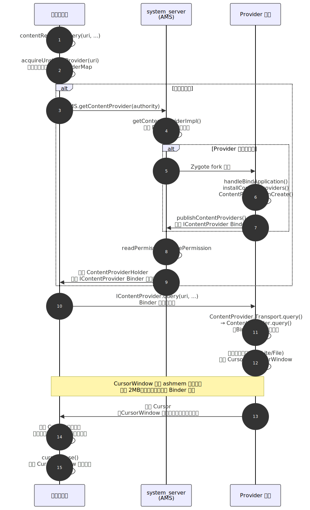

# ContentProvider 深度解析

> ContentProvider 是 Android 四大组件中负责**结构化数据共享**的组件。它通过统一的 URI + CRUD 接口，屏蔽底层数据存储细节（SQLite、文件、网络），实现跨进程、跨应用的数据访问。本文从启动时机出发，深入分析 ContentProvider 的 Binder 通信机制、URI 路由原理、权限模型，以及在 SDK 自动初始化中的巧妙应用（App Startup 替代方案）。

---

## 一、概述：为什么需要 ContentProvider

### 1.1 设计动机

Android 的沙箱机制让每个应用运行在独立进程中，应用之间不能直接访问彼此的数据库或文件。ContentProvider 的设计目标就是在保障安全的前提下，提供一套**标准化的跨进程数据访问协议**。

| 不用 ContentProvider | 用 ContentProvider |
|---------------------|-------------------|
| 数据格式由各应用自定义，调用方需了解底层实现 | 统一的 URI + CRUD 接口，调用方无需知道底层是 SQLite、File 还是内存 |
| 跨进程访问需自行实现 AIDL/Messenger | 底层基于 Binder，透明跨进程 |
| 权限控制需自行实现 | 内建 readPermission / writePermission / URI 级别临时授权 |
| 数据变化通知需自行实现 | `ContentResolver.notifyChange()` + `ContentObserver` |

### 1.2 核心角色

```
ContentProvider（服务端）                ContentResolver（客户端）
┌──────────────────────┐              ┌──────────────────────┐
│  query()             │◄── Binder ──►│  query()             │
│  insert()            │              │  insert()            │
│  update()            │              │  update()            │
│  delete()            │              │  delete()            │
│  getType()           │              │  getType()           │
│  call()              │              │  call()              │
│  openFile()          │              │  openFileDescriptor() │
└──────────────────────┘              └──────────────────────┘
         ▲                                      │
         │                                      │
    底层数据源                           context.contentResolver
  (SQLite/File/...)
```

---

## 二、ContentProvider 的启动时机

### 2.1 极早的初始化时机

ContentProvider 的初始化时机早于 `Application.onCreate()`，这是一个重要的设计特性：

```
App 进程启动（Zygote fork 后）
  → ActivityThread.main()
    → ActivityThread.attach(false)
      → AMS.attachApplication(mAppThread)
        → AMS.attachApplicationLocked(thread, ...)
          → thread.bindApplication(...)

// 回到 App 进程
ActivityThread.handleBindApplication(AppBindData data)
  → // 1. 创建 Application 对象（但不调 onCreate）
     Application app = data.info.makeApplication(...)

  → // 2. 安装所有 ContentProvider（在 Application.onCreate 之前！）
     installContentProviders(app, data.providers)
       → 遍历所有 ProviderInfo
         → installProvider(context, null, info, ...)
           → 通过反射创建 ContentProvider 实例
           → contentProvider.attachInfo(context, info)
             → ContentProvider.onCreate()  // ★ 在这里调用
         → AMS.publishContentProviders(...)  // 将 Provider 的 Binder 注册到 AMS

  → // 3. 调用 Application.onCreate()
     mInstrumentation.callApplicationOnCreate(app)
```

> **关键认知**：`ContentProvider.onCreate()` 在 `Application.onCreate()` **之前**执行。这意味着大量第三方 SDK 利用这个时机做自动初始化（如 Firebase、LeakCanary 早期版本、WorkManager）。

### 2.2 启动时序图

```
进程启动
  │
  ├── Application 构造方法（不要在此做初始化）
  │
  ├── ContentProvider A.onCreate()    ← 按 AndroidManifest 声明顺序
  ├── ContentProvider B.onCreate()
  ├── ContentProvider C.onCreate()
  │
  ├── Application.onCreate()          ← 此时所有 Provider 已就绪
  │
  └── Activity / Service 开始接收回调
```

---

## 三、跨进程通信机制

### 3.1 ContentResolver.query 全流程



以 `contentResolver.query(uri, ...)` 为例，追踪完整的跨进程调用链：

```
// 客户端进程
ContentResolver.query(uri, projection, selection, ...)
  → acquireUnstableProvider(uri)
    → acquireProvider(context, uri.getAuthority(), userId)
      // 1. 先查本进程缓存（mProviderMap）
      // 2. 缓存未命中 → AMS.getContentProvider(caller, authority, ...)

// system_server 进程
AMS.getContentProvider(caller, callingPackage, authority, ...)
  → getContentProviderImpl(caller, authority, ...)
    // 1. 检查 Provider 所在进程是否已启动
    //    → 已启动：从 mProviderMap 中获取 ContentProviderRecord
    //    → 未启动：启动目标进程 → 等待 publishContentProviders
    // 2. 检查权限（read/write permission）
    // 3. 返回 ContentProviderHolder（包含 IContentProvider Binder）

// 回到客户端进程
  → 拿到 IContentProvider（这是 ContentProvider 的 Binder 代理）
  → IContentProvider.query(uri, projection, ...)
    // 通过 Binder 跨进程调用到 Provider 所在进程

// Provider 所在进程（Binder 线程池中执行）
ContentProvider.Transport.query(uri, projection, ...)
  → ContentProvider.query(uri, projection, ...)  // 开发者实现的方法
  → 返回 Cursor（通过 CursorWindow 共享内存传递数据）
```

### 3.2 Cursor 跨进程传递原理

ContentProvider 返回的 Cursor 数据通过 **CursorWindow**（共享内存）高效传递：

```
Provider 进程                          Client 进程
┌─────────────────┐                  ┌─────────────────┐
│ SQLiteCursor     │                  │ CursorWrapper    │
│   ↓              │                  │   ↓              │
│ CursorWindow ────┼── 共享内存(ashmem) ──┼─ CursorWindow   │
│ (2MB 默认大小)   │                  │                  │
└─────────────────┘                  └─────────────────┘
```

- CursorWindow 底层使用 **ashmem（Anonymous Shared Memory）**，类似 Binder 的 mmap 机制
- 默认窗口大小 2MB，超过此大小的查询结果会分窗口加载
- Cursor 本身通过 Binder 传递的是 `IBulkCursor` 接口，实际数据在共享内存中

### 3.3 unstableProvider vs stableProvider

ContentResolver 获取 Provider 引用时有两种模式：

| 模式 | 行为 | 使用场景 |
|------|------|---------|
| **unstableProvider** | Provider 进程崩溃时，客户端**不会**被连带杀死 | `query()`（默认使用） |
| **stableProvider** | Provider 进程崩溃时，客户端会**一起被杀**（维持引用完整性） | `insert()` / `update()` / `delete()` |

`query()` 使用 unstableProvider 的原因：查询是只读操作，Provider 崩溃后可以重试。而写操作使用 stableProvider 是因为需要保证事务完整性。

---

## 四、URI 与路由机制

### 4.1 URI 结构

```
content://com.example.app.provider/users/42
   │              │                  │    │
 scheme       authority            path  id

scheme    → 固定为 "content://"
authority → 在 AndroidManifest 中声明，全局唯一
path      → 标识数据集合（类似表名）
id        → 标识具体记录（可选）
```

### 4.2 UriMatcher 路由

```kotlin
class MyProvider : ContentProvider() {
    companion object {
        private const val USERS = 1
        private const val USER_ID = 2
        private val uriMatcher = UriMatcher(UriMatcher.NO_MATCH).apply {
            addURI("com.example.provider", "users", USERS)       // 匹配集合
            addURI("com.example.provider", "users/#", USER_ID)   // 匹配单条（# 匹配数字）
        }
    }

    override fun query(uri: Uri, ...): Cursor? {
        return when (uriMatcher.match(uri)) {
            USERS -> db.query("users", ...)         // 查询所有用户
            USER_ID -> {
                val id = uri.lastPathSegment        // 取出 "42"
                db.query("users", ..., "id=?", arrayOf(id), ...)
            }
            else -> throw IllegalArgumentException("Unknown URI: $uri")
        }
    }
}
```

### 4.3 MIME 类型

`getType()` 返回 URI 对应的 MIME 类型，用于 Intent 解析和数据类型协商：

```kotlin
override fun getType(uri: Uri): String? {
    return when (uriMatcher.match(uri)) {
        USERS -> "vnd.android.cursor.dir/vnd.com.example.users"    // 集合
        USER_ID -> "vnd.android.cursor.item/vnd.com.example.users" // 单条
        else -> null
    }
}
```

| 类型前缀 | 含义 |
|---------|------|
| `vnd.android.cursor.dir/` | 数据集合（类似 SQL 表） |
| `vnd.android.cursor.item/` | 单条数据（类似 SQL 行） |

---

## 五、权限与安全模型

### 5.1 权限声明

```xml
<provider
    android:name=".MyProvider"
    android:authorities="com.example.provider"
    android:exported="true"
    android:readPermission="com.example.READ_DATA"
    android:writePermission="com.example.WRITE_DATA">

    <!-- URI 级别的精细权限控制 -->
    <path-permission
        android:pathPrefix="/public"
        android:readPermission="android.permission.INTERNET" />

    <!-- 临时 URI 授权 -->
    <grant-uri-permission android:pathPattern="/shared/.*" />
</provider>
```

### 5.2 临时 URI 授权

临时授权允许应用将自己 ContentProvider 中某条数据的访问权限**临时授予**另一个应用，无需对方持有永久权限：

```kotlin
// 发送端：授予临时读取权限
val uri = Uri.parse("content://com.example.provider/files/photo.jpg")
val intent = Intent(Intent.ACTION_VIEW).apply {
    setDataAndType(uri, "image/jpeg")
    addFlags(Intent.FLAG_GRANT_READ_URI_PERMISSION)
}
startActivity(intent)

// 接收端：无需声明任何权限，直接通过 ContentResolver 读取
contentResolver.openInputStream(uri)?.use { stream ->
    // 读取数据
}
```

**底层原理**：AMS 维护了一个 `UriGrantsManagerService`，记录临时授权关系（哪个 UID 对哪个 URI 有什么权限）。权限在以下情况自动回收：
- 接收方 Activity 销毁时
- 调用 `revokeUriPermission()` 时
- 设备重启时

### 5.3 FileProvider

`FileProvider` 是 Android 支持库提供的 ContentProvider 子类，专门用于安全地共享文件：

```xml
<provider
    android:name="androidx.core.content.FileProvider"
    android:authorities="${applicationId}.fileprovider"
    android:exported="false"
    android:grantUriPermissions="true">
    <meta-data
        android:name="android.support.FILE_PROVIDER_PATHS"
        android:resource="@xml/file_paths" />
</provider>
```

```xml
<!-- res/xml/file_paths.xml -->
<paths>
    <files-path name="images" path="images/" />
    <cache-path name="cache" path="cache/" />
    <external-path name="external" path="Pictures/" />
</paths>
```

> **为什么需要 FileProvider？** Android 7.0（API 24）起，应用间共享文件 URI（`file://`）会抛 `FileUriExposedException`。必须使用 `content://` URI + FileProvider。这是出于安全考虑——`file://` 暴露了文件的真实路径，接收方可能通过路径推断应用的内部结构。

---

## 六、ContentProvider 在 SDK 初始化中的应用

### 6.1 利用 ContentProvider 实现自动初始化

由于 ContentProvider 的 `onCreate()` 在 `Application.onCreate()` 之前被系统自动调用，且无需应用开发者手动调用任何初始化代码，大量第三方 SDK 利用这一机制实现"零配置"自动初始化：

```kotlin
// 某 SDK 的自动初始化实现
class SdkInitProvider : ContentProvider() {
    override fun onCreate(): Boolean {
        val context = context ?: return false
        SdkManager.init(context)  // 利用 ContentProvider 的 context 初始化 SDK
        return true
    }

    // 以下 CRUD 方法全部空实现
    override fun query(...) = null
    override fun insert(...) = null
    override fun update(...) = 0
    override fun delete(...) = 0
    override fun getType(...) = null
}
```

**问题**：每个 SDK 注册一个空 ContentProvider，应用依赖十几个 SDK 就有十几个空 ContentProvider。每个 ContentProvider 的创建都有开销（反射实例化 + `onCreate()` 在主线程执行），直接拖慢冷启动速度。

### 6.2 App Startup 库

Jetpack 的 `App Startup` 库正是为解决上述问题而设计的——用**一个** ContentProvider 合并所有 SDK 的初始化：

```
传统方式：
  Provider A.onCreate() → SDK A 初始化
  Provider B.onCreate() → SDK B 初始化
  Provider C.onCreate() → SDK C 初始化
  （3 次反射 + 3 个 Binder 对象 + 3 次 AMS 注册）

App Startup 方式：
  InitializationProvider.onCreate()
    → AppInitializer.discoverAndInitialize()
      → SDK A Initializer.create()
      → SDK B Initializer.create()
      → SDK C Initializer.create()
  （1 次反射 + 1 个 Binder 对象 + 1 次 AMS 注册）
```

**App Startup 核心机制**：

```kotlin
// 定义 Initializer
class WorkManagerInitializer : Initializer<WorkManager> {
    override fun create(context: Context): WorkManager {
        val config = Configuration.Builder().build()
        WorkManager.initialize(context, config)
        return WorkManager.getInstance(context)
    }

    // 声明依赖关系（确保初始化顺序）
    override fun dependencies(): List<Class<out Initializer<*>>> {
        return emptyList()  // 无依赖
    }
}

class MyInitializer : Initializer<MySDK> {
    override fun create(context: Context): MySDK {
        return MySDK.init(context)
    }

    override fun dependencies(): List<Class<out Initializer<*>>> {
        return listOf(WorkManagerInitializer::class.java)  // 依赖 WorkManager 先初始化
    }
}
```

```xml
<!-- AndroidManifest.xml -->
<provider
    android:name="androidx.startup.InitializationProvider"
    android:authorities="${applicationId}.androidx-startup"
    android:exported="false"
    tools:node="merge">
    <meta-data
        android:name="com.example.MyInitializer"
        android:value="androidx.startup" />
</provider>
```

**App Startup 内部原理**：

```
InitializationProvider.onCreate()
  → AppInitializer.getInstance(context).discoverAndInitialize()
    → // 1. 读取 AndroidManifest 中 InitializationProvider 的 <meta-data>
    → // 2. 通过反射获取所有 Initializer 类
    → // 3. 拓扑排序解析依赖关系（DAG）
    → // 4. 按依赖顺序依次调用 Initializer.create()
    → // 5. 缓存已初始化的结果，避免重复初始化
```

---

## 七、ContentObserver 变更通知

### 7.1 观察者模式

ContentProvider 支持数据变更通知机制，底层基于 `ContentService`（system_server 中的服务）：

```kotlin
// Provider 端：数据变更时通知
override fun insert(uri: Uri, values: ContentValues?): Uri? {
    val id = db.insert("users", null, values)
    val newUri = ContentUris.withAppendedId(CONTENT_URI, id)
    context?.contentResolver?.notifyChange(newUri, null)  // 通知变更
    return newUri
}

// Client 端：注册观察者
val observer = object : ContentObserver(Handler(Looper.getMainLooper())) {
    override fun onChange(selfChange: Boolean, uri: Uri?) {
        // 数据变更回调（主线程）
        refreshData()
    }
}
contentResolver.registerContentObserver(
    CONTENT_URI,
    true,  // notifyForDescendants: 子 URI 变更也通知
    observer
)

// 务必在适当时机反注册
contentResolver.unregisterContentObserver(observer)
```

### 7.2 通知流程

```
Provider.insert() → contentResolver.notifyChange(uri)
  → ContentService.notifyChange(uri, observer, ...)  // 跨进程到 system_server
    → 遍历注册在该 URI 上的所有 ContentObserver
    → 通过 IContentObserver Binder 回调到各客户端进程
      → ContentObserver.onChange()
```

---

## 八、常见面试题与解答

### Q1：ContentProvider 的 onCreate 和 Application 的 onCreate 谁先执行？为什么？

**A**：**ContentProvider.onCreate() 先执行**。

原因在 `ActivityThread.handleBindApplication()` 的源码中：系统先调用 `installContentProviders()` 安装所有 ContentProvider（内部会调用每个 Provider 的 `onCreate()`），然后才调用 `mInstrumentation.callApplicationOnCreate(app)`。

这个设计是有道理的——ContentProvider 可能被其他进程在 Application 初始化之前就请求访问，必须先就绪。但这也带来了启动性能问题：大量 SDK 利用 ContentProvider 做自动初始化，直接拖慢冷启动。Jetpack App Startup 就是为解决这个问题而设计的。

### Q2：ContentProvider 的 CRUD 方法运行在哪个线程？是否线程安全？

**A**：

- **同进程调用**：CRUD 方法运行在**调用者的线程**（即调用 `contentResolver.query()` 的线程）
- **跨进程调用**：CRUD 方法运行在 **Binder 线程池**中的某个线程

因此 ContentProvider 的 CRUD 方法**天然面临多线程并发问题**。开发者必须自行保证线程安全：
- 如果底层是 SQLite，`SQLiteDatabase` 本身通过锁机制保证了基本的线程安全
- 如果底层是文件或内存数据，需要使用 `synchronized` 或其他并发机制

### Q3：ContentProvider 和 Binder 是什么关系？

**A**：ContentProvider 的跨进程通信底层**完全基于 Binder**。具体来说：

1. 每个 ContentProvider 内部有一个 `Transport` 类（继承自 `ContentProviderNative`，即 Binder 的服务端实现）
2. 客户端通过 `ContentResolver` 获取的是 `IContentProvider` 接口的 Binder 代理
3. `query/insert/update/delete` 调用都是 Binder 跨进程调用
4. 查询结果（Cursor）通过 `CursorWindow`（ashmem 共享内存）传递，避免大量数据的 Binder 拷贝

可以说 ContentProvider 是 Binder 机制在"结构化数据访问"场景下的上层封装。

### Q4：多个 ContentProvider 的初始化顺序是怎样的？能否控制？

**A**：

默认顺序：按 AndroidManifest 中 `<provider>` 标签的**声明顺序**初始化。

但在实际打包时，来自不同 module/library 的 manifest 会通过 **Manifest Merger** 合并，合并后的顺序不可预测。

如果需要控制顺序，有两种方式：
1. **`android:initOrder` 属性**：数值越大越先初始化（默认为 0），但仅在同一进程内有效
2. **App Startup 的 `dependencies()` 方法**：通过声明依赖关系实现拓扑排序，这是更可靠的方式

### Q5：为什么要用 FileProvider 替代 file:// URI？

**A**：Android 7.0（API 24）引入了 `StrictMode.VmPolicy` 对 `file://` URI 的限制。通过 Intent 传递 `file://` URI 给其他应用会抛出 `FileUriExposedException`。

原因：
1. **安全性**：`file://` URI 暴露了文件的绝对路径（如 `/data/data/com.example/files/photo.jpg`），接收方可推断应用内部目录结构
2. **权限问题**：`file://` URI 要求接收方对文件系统路径有读取权限，但 Android 沙箱机制下应用间不能直接访问彼此的私有目录
3. **可控性**：`content://` URI 通过 ContentProvider 层可以精确控制授权范围和时效（临时授权）

FileProvider 将文件路径映射为 `content://` URI，通过 `FLAG_GRANT_READ_URI_PERMISSION` 临时授权，兼顾安全性和易用性。

### Q6：ContentProvider 的 call() 方法有什么特殊用途？

**A**：`call()` 是 ContentProvider 提供的一个通用 RPC 接口：

```kotlin
override fun call(method: String, arg: String?, extras: Bundle?): Bundle? {
    return when (method) {
        "clearCache" -> { clearCache(); Bundle() }
        "getVersion" -> Bundle().apply { putInt("version", 3) }
        else -> null
    }
}

// 客户端调用
val result = contentResolver.call(AUTHORITY, "getVersion", null, null)
val version = result?.getInt("version")
```

与 CRUD 方法的区别：
- 不受 `readPermission` / `writePermission` 约束（需自行在 `call()` 内部做权限校验）
- 不走 Cursor 机制，直接返回 Bundle，适合非结构化数据的 RPC 调用
- 典型应用：Settings Provider 的 `Settings.System.putString()` 底层就是通过 `call()` 实现的
