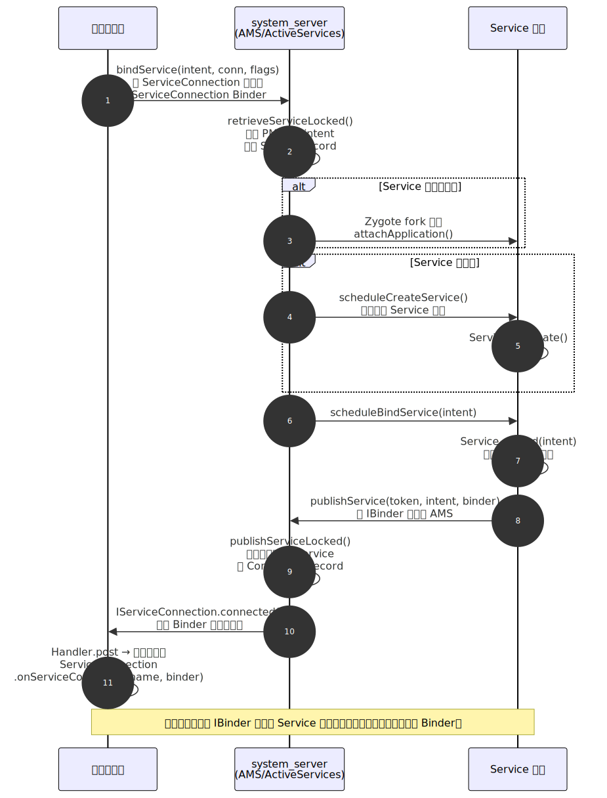

# Service 深度解析

> Service 是 Android 四大组件中用于执行**后台长时间运行操作**的组件。它没有 UI 界面，但拥有独立的生命周期，与 Activity 一样由 AMS 统一管理。本文从设计动机出发，深入源码分析 startService 与 bindService 的启动流程与生命周期差异，系统梳理前台服务限制演进、JobScheduler/WorkManager 替代方案，以及进程保活的技术争议。

---

## 一、概述：为什么需要 Service

### 1.1 设计定位

Service 的核心价值在于：**让没有 UI 的工作能够具备组件级别的生命周期管理**。

不用 Service，直接在 Activity 中开线程做后台任务不行吗？问题在于：

| 场景 | 纯线程方案的问题 | Service 的解决方式 |
|------|----------------|-------------------|
| 用户切后台 | Activity 被回收后线程失去宿主，无法感知任务状态 | Service 拥有独立生命周期，不依赖 Activity |
| 进程优先级 | 仅有后台 Activity 的进程容易被 LMK 杀死 | 持有 Service 的进程优先级更高（尤其前台 Service） |
| 跨组件通信 | 线程引用难以在多个 Activity/Fragment 间共享 | bindService 提供跨组件甚至跨进程的 IBinder 接口 |
| 系统调度 | 系统无法感知"后台任务正在进行"，无法合理调度 | Service 注册到 AMS，纳入系统调度管理 |

### 1.2 三种形态

| 形态 | 启动方式 | 典型场景 | 生命周期归属 |
|------|---------|---------|------------|
| **Started Service** | `startService()` / `startForegroundService()` | 下载文件、上传日志、播放音乐 | 自管理（需主动 `stopSelf()`） |
| **Bound Service** | `bindService()` | 跨组件/跨进程调用接口（如音乐播放器控制面板） | 跟随最后一个 Client 解绑而销毁 |
| **混合模式** | 先 `startService()` 再 `bindService()` | 音乐播放器：既需要后台持续播放，又需要 UI 绑定控制 | 需同时满足两个条件才销毁 |

> **关键认知**：Service 默认运行在**主线程**。如果需要执行耗时操作（网络请求、大量 IO），必须在 Service 内部手动创建工作线程，否则会导致 ANR（前台 Service 20s / 后台 Service 200s）。

---

## 二、生命周期详解

### 2.1 startService 生命周期

```
客户端调用 startService(intent)
  → AMS 判断 Service 是否已创建
    → 未创建：onCreate() → onStartCommand(intent, flags, startId)
    → 已创建：直接 onStartCommand(intent, flags, startId)

客户端多次调用 startService(intent)
  → onCreate() 只执行一次
  → onStartCommand() 每次都执行

Service 调用 stopSelf() 或客户端调用 stopService()
  → onDestroy()
```

**onStartCommand 返回值**决定了系统在 Service 被杀后的重启策略：

| 返回值 | 行为 | 适用场景 |
|--------|------|---------|
| `START_NOT_STICKY` | 被杀后不重建，除非有新的 startService 调用 | 非关键任务（日志上传） |
| `START_STICKY` | 被杀后重建 Service，但 `onStartCommand` 收到的 intent 为 null | 音乐播放器（需持续运行但无需重发命令） |
| `START_REDELIVER_INTENT` | 被杀后重建，并重新投递最后一个 intent | 文件下载（需要恢复上次未完成的任务） |
| `START_STICKY_COMPATIBILITY` | `START_STICKY` 的兼容版本，不保证 `onStartCommand` 被调用 | 已废弃，不推荐 |

### 2.2 bindService 生命周期

```
客户端调用 bindService(intent, conn, flags)
  → AMS 判断 Service 是否已创建
    → 未创建：onCreate() → onBind(intent) → 返回 IBinder
    → 已创建但该 intent 未绑定过：onBind(intent)
    → 已创建且已绑定过同一 intent：直接回调 ServiceConnection.onServiceConnected()

客户端调用 unbindService(conn)
  → 如果是最后一个绑定的客户端：onUnbind(intent) → onDestroy()
  → 如果还有其他客户端绑定：不触发任何回调

如果 onUnbind() 返回 true，下次重新绑定时
  → onRebind(intent)（而非再调 onBind）
```

**bindService 的 flags 参数**：

| Flag | 作用 |
|------|------|
| `BIND_AUTO_CREATE` | 绑定时自动创建 Service（最常用） |
| `BIND_NOT_FOREGROUND` | 不将 Service 提升到前台优先级 |
| `BIND_ABOVE_CLIENT` | Service 优先级高于客户端，系统优先杀客户端 |
| `BIND_IMPORTANT` | 客户端在前台时，将 Service 也视为前台进程 |

### 2.3 混合模式生命周期

当 Service 同时被 `startService()` 和 `bindService()` 启动时，销毁条件变为**两者同时满足**：

```
startService() → onCreate() → onStartCommand()
bindService()  → onBind()
                ↓
    Service 持续运行
                ↓
unbindService() → onUnbind()
    （Service 不销毁，因为还没 stopService）
                ↓
stopService() 或 stopSelf()
    → onDestroy()
```

> **常见坑**：`unbindService()` 必须与 `bindService()` 配对调用，否则会抛出 `IllegalArgumentException: Service not registered`。在 Activity 中绑定时，务必在 `onStop()` 或 `onDestroy()` 中解绑，并用 `isBound` 标志位防止重复解绑。

---

## 三、启动流程源码分析

### 3.1 startService 源码调用链

以 `ContextImpl.startService()` 为入口，追踪完整调用链（基于 Android 13 / API 33 源码）：

```
// 客户端进程
ContextImpl.startService(intent)
  → ContextImpl.startServiceCommon(intent, false, user)
    → ActivityManager.getService().startService(...)  // Binder 跨进程调用 AMS

// system_server 进程（AMS 侧）
ActivityManagerService.startService(caller, intent, ...)
  → ActiveServices.startServiceLocked(caller, intent, ...)
    → ActiveServices.retrieveServiceLocked(intent, ...)
      // 1. 通过 PMS 解析 intent，找到目标 ServiceRecord
      // 2. 如果 ServiceRecord 不存在则创建
    → ActiveServices.startServiceInnerLocked(smap, intent, r, ...)
      → ActiveServices.bringUpServiceLocked(r, ...)
        // 判断 Service 进程是否已启动
        → 进程已存在：realStartServiceLocked(r, app, ...)
        → 进程不存在：先通过 Zygote fork 进程，进程启动后回调 attachApplication
                      → realStartServiceLocked(r, app, ...)

// realStartServiceLocked 核心逻辑
ActiveServices.realStartServiceLocked(ServiceRecord r, ProcessRecord app, ...)
  → app.thread.scheduleCreateService(r, ...)   // Binder 回到 app 进程
  → sendServiceArgsLocked(r, ...)              // 发送 onStartCommand 参数

// 回到客户端进程
ActivityThread.ApplicationThread.scheduleCreateService(...)
  → sendMessage(H.CREATE_SERVICE, ...)
    → ActivityThread.handleCreateService(CreateServiceData data)
      // 1. 通过反射创建 Service 实例
      // 2. 创建 ContextImpl 并 attach
      // 3. 调用 service.onCreate()
      // 4. 将 Service 存入 mServices（ArrayMap<IBinder, Service>）

ActivityThread.handleServiceArgs(ServiceArgsData data)
  → service.onStartCommand(intent, flags, startId)
```

### 3.2 bindService 源码调用链



```
// 客户端进程
ContextImpl.bindService(intent, conn, flags)
  → ContextImpl.bindServiceCommon(intent, conn, flags, ...)
    // 1. 将 ServiceConnection 包装为 IServiceConnection（Binder 对象）
    //    通过 LoadedApk.ServiceDispatcher 持有 ServiceConnection 和 Handler
    → ActivityManager.getService().bindService(
          caller, token, intent, conn.asBinder(), flags, ...)

// system_server 进程
AMS.bindService(...)
  → ActiveServices.bindServiceLocked(caller, intent, conn, flags, ...)
    → retrieveServiceLocked(intent, ...)  // 找到 ServiceRecord
    → bringUpServiceLocked(r, ...)        // 创建 Service（如果未创建）
    → requestServiceBindingLocked(r, intent, ...)
      → app.thread.scheduleBindService(r, intent, rebind, ...)

// 回到客户端进程（Service 所在进程）
ActivityThread.handleBindService(BindServiceData data)
  → Service s = mServices.get(data.token)
  → IBinder binder = s.onBind(data.intent)  // 调用 onBind 获取 IBinder
  → AMS.publishService(data.token, data.intent, binder)  // 将 IBinder 回传给 AMS

// system_server 进程
AMS.publishService(token, intent, binder)
  → ActiveServices.publishServiceLocked(r, intent, binder)
    → ConnectionRecord.conn.connected(componentName, binder)
      // 通过 IServiceConnection Binder 回调到客户端

// 回到客户端进程（调用者所在进程）
LoadedApk.ServiceDispatcher.InnerConnection.connected(name, binder)
  → ServiceDispatcher.connected(name, binder)
    → mActivityThread.post(new RunConnection(name, binder, ...))
      // 切到主线程
      → ServiceConnection.onServiceConnected(name, binder)
```

> **要点**：bindService 的 IBinder 传递经历了三次跨进程调用——客户端 → AMS（bindService）→ Service 进程（scheduleBindService）→ AMS（publishService）→ 客户端（onServiceConnected）。理解这个流程是理解跨进程 Service 通信的基础。

---

## 四、Bound Service 的三种实现方式

### 4.1 扩展 Binder 类（同进程）

最简单的方式，适用于 Service 和客户端在同一进程：

```kotlin
class LocalService : Service() {
    // 直接暴露 Service 引用给客户端
    inner class LocalBinder : Binder() {
        fun getService(): LocalService = this@LocalService
    }

    private val binder = LocalBinder()

    override fun onBind(intent: Intent): IBinder = binder

    fun doWork(): String = "执行本地任务"
}

// 客户端使用
private val connection = object : ServiceConnection {
    override fun onServiceConnected(name: ComponentName, service: IBinder) {
        val binder = service as LocalService.LocalBinder
        val localService = binder.getService()
        localService.doWork()  // 直接调用方法
    }
    override fun onServiceDisconnected(name: ComponentName) {}
}
```

> **原理**：同进程时，`onBind()` 返回的 IBinder 就是原始的 Java 对象引用（不经过 Binder 驱动），客户端直接持有 Service 实例，方法调用是普通的进程内调用。

### 4.2 使用 Messenger（跨进程、低并发）

基于 Handler + AIDL 封装的轻量级 IPC 方案，所有请求排队处理（串行）：

```kotlin
// Service 端
class MessengerService : Service() {
    private val handler = object : Handler(Looper.getMainLooper()) {
        override fun handleMessage(msg: Message) {
            when (msg.what) {
                MSG_SAY_HELLO -> {
                    // 处理客户端请求
                    // 通过 msg.replyTo 回复客户端
                    msg.replyTo?.send(Message.obtain(null, MSG_REPLY))
                }
            }
        }
    }

    private val messenger = Messenger(handler)

    override fun onBind(intent: Intent): IBinder = messenger.binder
}

// 客户端
val msg = Message.obtain(null, MSG_SAY_HELLO).apply {
    replyTo = clientMessenger  // 设置回复通道
}
serviceMessenger.send(msg)
```

> **底层本质**：`Messenger` 内部持有一个 `IMessenger.aidl` 的 Binder 对象。`Messenger.send()` 实际上是跨进程调用 `IMessenger.send(Message)`。由于 Handler 的消息队列天然串行，无需处理线程安全。

### 4.3 使用 AIDL（跨进程、高并发）

直接定义 AIDL 接口，Binder 线程池并发处理请求。详细原理参见 [Binder机制](Binder机制.md)。

**三种方式对比**：

| 维度 | 扩展 Binder | Messenger | AIDL |
|------|-----------|-----------|------|
| 进程 | 同进程 | 跨进程 | 跨进程 |
| 并发 | 同步调用 | 串行（Handler 消息队列） | 并发（Binder 线程池） |
| 复杂度 | 低 | 中 | 高 |
| 数据类型 | 任意 Java 对象 | 仅 Message（Bundle） | 支持 Parcelable |
| 典型场景 | 工具类 Service | 简单 IPC、消息通知 | 复杂业务 IPC |

---

## 五、前台服务与后台限制演进

### 5.1 前台服务基础

前台服务通过展示一个**持续的通知**来告知用户"有任务正在运行"，同时获得更高的进程优先级（几乎不会被 LMK 杀死）：

```kotlin
class MusicService : Service() {
    override fun onStartCommand(intent: Intent?, flags: Int, startId: Int): Int {
        val notification = NotificationCompat.Builder(this, CHANNEL_ID)
            .setContentTitle("正在播放")
            .setContentText("歌曲名称")
            .setSmallIcon(R.drawable.ic_music)
            .build()

        // Android 14+ 需要指定前台服务类型
        if (Build.VERSION.SDK_INT >= Build.VERSION_CODES.UPSIDE_DOWN_CAKE) {
            startForeground(NOTIFICATION_ID, notification,
                ServiceInfo.FOREGROUND_SERVICE_TYPE_MEDIA_PLAYBACK)
        } else {
            startForeground(NOTIFICATION_ID, notification)
        }

        return START_STICKY
    }
}
```

### 5.2 后台限制演进时间线

Android 系统对后台 Service 的限制逐版本收紧，这是理解现代 Android 后台任务方案选型的基础：

| 版本 | 限制内容 | 影响 |
|------|---------|------|
| **Android 6.0 (API 23)** | Doze 模式：设备静止时延迟后台任务 | 后台 Service 受 Doze 约束 |
| **Android 7.0 (API 24)** | 移除部分隐式广播（`CONNECTIVITY_ACTION` 等） | 不能用隐式广播触发后台 Service |
| **Android 8.0 (API 26)** | **后台 Service 限制**：应用进入后台后约 1 分钟，系统自动 `stopService` | 后台 `startService()` 抛 `IllegalStateException` |
| **Android 9.0 (API 28)** | 前台 Service 需要 `FOREGROUND_SERVICE` 权限 | AndroidManifest 必须声明 |
| **Android 10 (API 29)** | 后台启动 Activity 限制；位置信息需要前台服务 | 前台 Service 获取位置需额外权限 |
| **Android 12 (API 31)** | **前台服务启动限制**：后台无法启动前台 Service（少数豁免除外） | 必须使用 `WorkManager` 的加急工作或其他方案 |
| **Android 13 (API 33)** | 通知权限 `POST_NOTIFICATIONS` 需运行时申请 | 前台 Service 的通知不一定能展示 |
| **Android 14 (API 34)** | 前台服务**必须声明类型**（`foregroundServiceType`） | 不声明类型的前台 Service 直接崩溃 |
| **Android 15 (API 35)** | 前台服务超时机制：`dataSync` 类型限 24h，`mediaProcessing` 限 6h | 长时间运行的前台 Service 被强制停止 |

### 5.3 前台服务类型（Android 14+）

Android 14 起，前台服务必须在 AndroidManifest 中声明 `foregroundServiceType`，且需要对应权限：

| 类型 | 用途 | 所需权限 |
|------|------|---------|
| `camera` | 后台使用相机 | `FOREGROUND_SERVICE_CAMERA` |
| `connectedDevice` | 蓝牙、USB 设备交互 | `FOREGROUND_SERVICE_CONNECTED_DEVICE` |
| `dataSync` | 数据同步（限时 24h） | `FOREGROUND_SERVICE_DATA_SYNC` |
| `health` | 健康/运动追踪 | `FOREGROUND_SERVICE_HEALTH` |
| `location` | 后台定位 | `FOREGROUND_SERVICE_LOCATION` + `ACCESS_*_LOCATION` |
| `mediaPlayback` | 音频/视频播放 | `FOREGROUND_SERVICE_MEDIA_PLAYBACK` |
| `mediaProjection` | 屏幕录制/投屏 | `FOREGROUND_SERVICE_MEDIA_PROJECTION` |
| `microphone` | 后台录音 | `FOREGROUND_SERVICE_MICROPHONE` |
| `phoneCall` | 通话/VoIP | `FOREGROUND_SERVICE_PHONE_CALL` |
| `remoteMessaging` | 消息转发（如手表） | `FOREGROUND_SERVICE_REMOTE_MESSAGING` |
| `shortService` | 短时任务（不超过 3 分钟） | 无需额外权限 |
| `specialUse` | 不属于以上类别 | `FOREGROUND_SERVICE_SPECIAL_USE`（需审核） |

---

## 六、IntentService 废弃与替代方案

### 6.1 IntentService 原理

`IntentService` 是对 `Service` + `HandlerThread` 的封装，核心逻辑极简：

```java
// IntentService.java 核心源码（简化）
public abstract class IntentService extends Service {
    private HandlerThread mServiceThread;
    private ServiceHandler mServiceHandler;

    private final class ServiceHandler extends Handler {
        @Override
        public void handleMessage(Message msg) {
            onHandleIntent((Intent) msg.obj);  // 在工作线程执行
            stopSelf(msg.arg1);                // 执行完自动停止
        }
    }

    @Override
    public void onCreate() {
        super.onCreate();
        mServiceThread = new HandlerThread("IntentService[" + mName + "]");
        mServiceThread.start();
        mServiceHandler = new ServiceHandler(mServiceThread.getLooper());
    }

    @Override
    public void onStartCommand(Intent intent, int flags, int startId) {
        Message msg = mServiceHandler.obtainMessage();
        msg.arg1 = startId;
        msg.obj = intent;
        mServiceHandler.sendMessage(msg);  // 将任务投递到工作线程
        return mRedelivery ? START_REDELIVER_INTENT : START_NOT_STICKY;
    }
}
```

**废弃原因**（API 30）：
1. Android 8.0+ 后台 Service 限制使其在后台无法正常启动
2. 不支持 Doze/App Standby 等节能机制
3. 无法处理复杂的约束条件（网络、电量等）
4. Google 推荐使用 `WorkManager` 或 `JobIntentService`（后者也已废弃）

### 6.2 现代替代方案对比

| 方案 | 适用场景 | 是否支持持久化 | 约束能力 | 进程死亡后 |
|------|---------|:----------:|---------|-----------|
| **Kotlin 协程** | UI 相关或与组件生命周期绑定的轻量任务 | 否 | 无 | 任务丢失 |
| **WorkManager** | 需要保证执行的后台任务（日志上传、数据同步） | 是（SQLite） | 网络/电量/存储等 | 自动重试 |
| **JobScheduler** | 系统级延迟任务调度（API 21+） | 是 | 网络/充电/idle | 自动重试 |
| **前台 Service** | 用户可感知的持续任务（音乐、导航、通话） | 否 | 无 | 可通过 START_STICKY 重建 |
| **AlarmManager** | 精确定时任务（闹钟） | 否 | 无 | 需广播重新注册 |

> **最佳实践决策树**：
> - 任务与 UI 绑定？ → 协程（viewModelScope / lifecycleScope）
> - 需要保证执行（即使进程被杀）？ → WorkManager
> - 用户可感知的持续运行？ → 前台 Service
> - 需要精确时间触发？ → AlarmManager + WorkManager

---

## 七、进程优先级与保活

### 7.1 Service 对进程优先级的影响

Android 的 LMK（Low Memory Killer）根据进程优先级（oom_adj）决定杀进程顺序。Service 直接影响宿主进程的优先级：

| 进程状态 | oom_adj | 含义 |
|---------|---------|------|
| 前台进程（前台 Service） | `PERCEPTIBLE_APP_ADJ (200)` | 用户可感知，几乎不会被杀 |
| 可见进程（绑定到前台 Activity 的 Service） | `VISIBLE_APP_ADJ (100)` | 极少被杀 |
| 服务进程（普通后台 Service，启动后 30 分钟内） | `SERVICE_ADJ (500)` | 内存紧张时可能被杀 |
| 后台进程（Service 已运行超 30 分钟） | `SERVICE_B_ADJ (800)` | 容易被杀 |
| 空进程（无任何活跃组件） | `CACHED_APP_*` | 优先被杀 |

### 7.2 保活手段与争议

进程保活是 Android 开发中争议较大的话题。以下列出常见手段及其在现代 Android 中的可行性：

| 手段 | 原理 | 现状 |
|------|------|------|
| 前台 Service | 提升进程优先级 | 合法方式，但 Android 14+ 必须声明类型，15+ 有超时限制 |
| 双进程守护 | A 进程死亡时 B 进程拉起 | Android 8.0+ 基本失效，系统会成组杀进程 |
| JobScheduler 定时唤醒 | 通过定时 Job 保持 Service 活跃 | Doze 模式下不可靠 |
| 账户同步 (AccountSync) | 利用系统同步机制定期拉起 | 高版本限制增多 |
| 1px 透明 Activity | 锁屏时弹出 1px Activity 提升优先级 | 已被各厂商系统封杀 |
| Native 进程 fork | fork 子进程监听主进程死亡 | Android 5.0+ 系统杀进程会杀整个 cgroup |

> **正确认知**：在 Android 8.0+ 的世界中，保活的正确做法是**使用系统提供的机制**（WorkManager、前台 Service），而不是与系统对抗。Google 的设计哲学是：如果任务对用户重要，就用前台 Service 让用户知道；如果任务可以延迟，就用 WorkManager 让系统统一调度。

---

## 八、Service 与其他组件的关系

### 8.1 Service 与 Thread

| 维度 | Service | Thread |
|------|---------|--------|
| 本质 | 四大组件，拥有 Context | Java 线程，无 Context |
| 运行线程 | 默认主线程（需手动创建工作线程） | 独立线程 |
| 生命周期 | AMS 管理，可跨 Activity 存活 | 跟随创建者（易泄漏） |
| 进程优先级 | 影响进程 oom_adj | 不影响 |
| 跨进程 | 支持（Binder） | 不支持 |
| 系统感知 | AMS 可调度管理 | 系统无感知 |

### 8.2 Service 与 WorkManager

WorkManager 底层在 API 23+ 使用 `JobScheduler`，低版本 fallback 到 `AlarmManager + BroadcastReceiver`。它本质上**不是 Service 的替代品**，而是**定义了一套任务调度的上层抽象**：

```
WorkManager.enqueue(WorkRequest)
  → WorkDatabase 持久化任务信息（SQLite）
  → Scheduler 决定执行时机
    → JobScheduler / AlarmManager（根据 API 版本）
  → 满足约束时启动 Worker
    → SystemJobService / SystemAlarmService（内部 Service）
      → Worker.doWork()（在后台线程执行）
```

关键差异：Service 是"我要在后台运行"；WorkManager 是"我有一个任务，系统帮我找合适的时间执行"。

---

## 九、常见面试题与解答

### Q1：startService 和 bindService 的区别是什么？多次调用会怎样？

**A**：核心区别在**生命周期归属**和**通信能力**：

- `startService`：Service 自管理生命周期，需主动 `stopSelf()` 或外部 `stopService()` 才会停止。多次调用 `startService()`，`onCreate()` 只执行一次，`onStartCommand()` 每次都执行。客户端与 Service 之间无直接通信通道。

- `bindService`：Service 生命周期跟随客户端，最后一个客户端 `unbindService()` 后自动销毁。多次用相同的 `ServiceConnection` 调用 `bindService()` 不会重复绑定。通过 `onBind()` 返回的 `IBinder` 建立通信通道。

- 混合模式（先 start 再 bind）：必须同时满足 stop + unbind 两个条件才会销毁。典型场景是音乐播放器。

### Q2：Service 的 onStartCommand 返回值有什么区别？

**A**：返回值决定了 Service 被系统杀死后的重启策略：

- `START_NOT_STICKY`：不自动重建，适用于可丢弃的一次性任务
- `START_STICKY`：自动重建但 intent 为 null，适用于无需恢复参数的长期任务（如音乐播放）
- `START_REDELIVER_INTENT`：自动重建并重发最后一个 intent，适用于需要幂等恢复的任务（如文件下载）

面试加分点：这三个值本质对应 AMS 中 `ServiceRecord` 的 `deliveredStarts` 列表和 `restartDelay` 重启策略。

### Q3：为什么 Android 8.0 要限制后台 Service？怎么解决？

**A**：

**为什么限制**：在 Android 8.0 之前，大量应用滥用后台 Service 长期驻留内存，导致内存占用高、耗电量大、系统卡顿。Google 引入后台执行限制（Background Execution Limits），应用进入后台约 1 分钟后，系统会自动 `stopService()`。此时调用 `startService()` 会抛出 `IllegalStateException`。

**解决方案**：
1. 前台 Service：`startForegroundService()` + 5 秒内调用 `startForeground()` 展示通知
2. WorkManager：适用于可延迟执行的任务
3. JobScheduler：系统级任务调度
4. 将逻辑迁移到前台组件中（如 Activity 的协程 scope）

### Q4：前台 Service 在 Android 12+ 有什么限制？

**A**：Android 12（API 31）引入了**前台服务启动限制**：当应用处于后台时，不能调用 `startForegroundService()` 启动前台 Service（会抛出 `ForegroundServiceStartNotAllowedException`）。

**豁免场景**包括：
- 接收到高优先级 FCM 推送
- 由系统 PendingIntent（如通知点击、BroadcastReceiver）触发
- 用户通过 Widget 交互触发
- `SYSTEM_ALERT_WINDOW` 权限持有者
- Companion device（如手表）

**应对方案**：
- 使用 `WorkManager.enqueue(OneTimeWorkRequest)` 的加急工作（expedited work）替代
- 通过 `setExpedited(OutOfQuotaPolicy.RUN_AS_NON_EXPEDITED_WORK_REQUEST)` 确保降级执行

### Q5：Service 和 IntentService 有什么区别？IntentService 为什么被废弃？

**A**：`IntentService` 是 `Service` + `HandlerThread` 的封装。区别在于：
- Service 默认在主线程运行，需手动管理工作线程；IntentService 自动在工作线程串行处理请求
- Service 需手动调用 `stopSelf()`；IntentService 在所有请求处理完后自动停止
- IntentService 不支持并发处理

**废弃原因**：Android 8.0+ 的后台 Service 限制使其在后台无法正常工作；不支持 Doze/App Standby 节能机制；无法声明任务约束条件（如网络可用时才执行）。推荐使用 `WorkManager` 替代。

### Q6：bindService 的流程中，IBinder 是怎么传递到客户端的？

**A**：这涉及三次跨进程通信：

1. **客户端 → AMS**：`ContextImpl.bindService()` 通过 `AMS.bindService()` 发起绑定，同时将 `ServiceConnection` 包装为 `IServiceConnection` Binder 对象传给 AMS
2. **AMS → Service 进程**：AMS 通过 `ApplicationThread.scheduleBindService()` 通知 Service 进程调用 `onBind()`
3. **Service 进程 → AMS → 客户端**：Service 的 `onBind()` 返回 IBinder 后，通过 `AMS.publishService()` 回传给 AMS，AMS 再通过 `IServiceConnection.connected()` 回调到客户端的 `ServiceConnection.onServiceConnected()`

整个流程体现了 AMS 作为"中间人"的角色——Service 不直接与客户端通信，所有的绑定关系由 AMS 维护。

### Q7：如何在不同 Android 版本中选择后台任务方案？

**A**：

| 场景 | 推荐方案 | 原因 |
|------|---------|------|
| 用户可感知的持续任务（音乐、导航） | 前台 Service + foregroundServiceType | 需要持续运行且用户知情 |
| 必须执行的离线任务（日志同步） | WorkManager | 持久化到 SQLite，进程死亡后恢复 |
| 与 UI 绑定的异步任务 | Kotlin 协程 (viewModelScope) | 跟随 ViewModel 生命周期 |
| 精确定时任务 | AlarmManager (setExactAndAllowWhileIdle) | 即使 Doze 模式也能触发 |
| 高频跨进程调用 | Bound Service (AIDL) | Binder 高效通信 |
| 即时网络请求 | 协程 + OkHttp | 无需 Service 开销 |

核心原则：**能不用 Service 就不用 Service**。现代 Android 开发中，Service 的使用场景已大幅收窄，只在"用户可感知的持续任务"和"跨进程通信"两个场景中不可替代。
