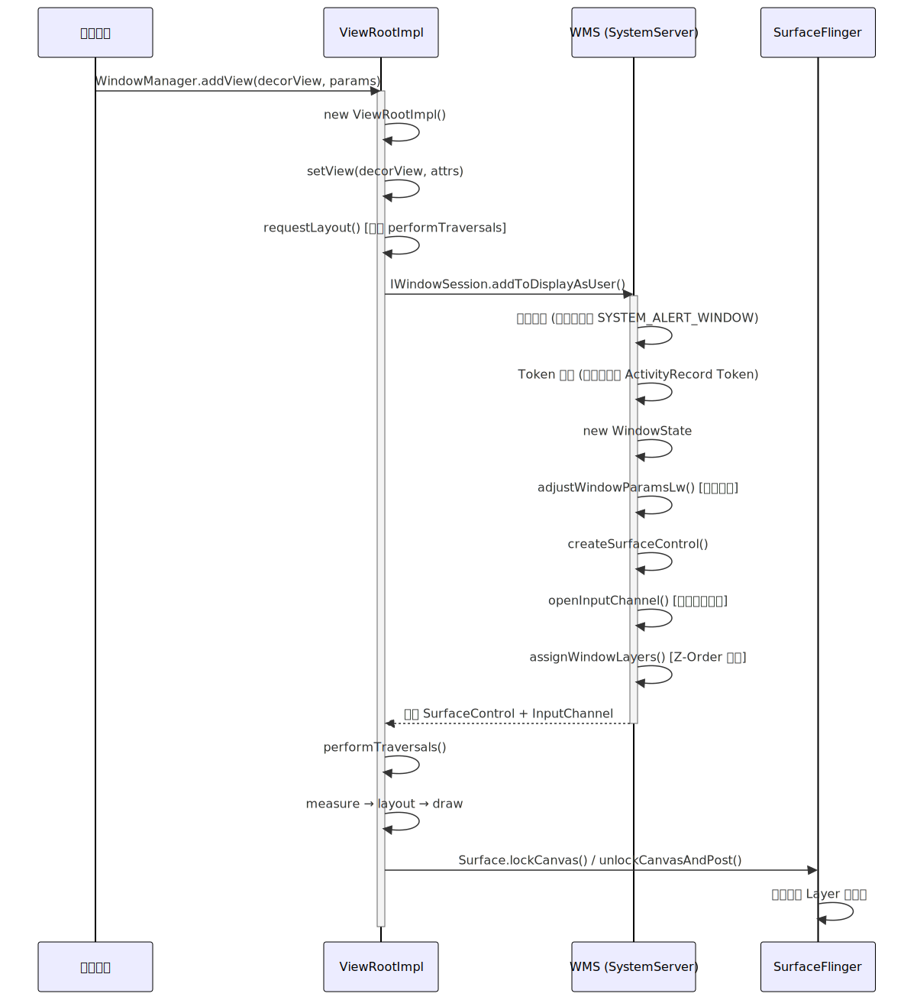

# WMS 与 PMS 核心原理

> WindowManagerService (WMS) 和 PackageManagerService (PMS) 是 Android SystemServer 中最核心的两大系统服务。WMS 管理所有窗口的添加、删除、布局和动画；PMS 管理 APK 的安装、解析、权限和四大组件信息查询。本文从源码层面拆解两者的核心工作机制。

---

## 一、WMS 概述与架构定位

### 1.1 WMS 在窗口系统中的角色

Android 的窗口渲染从应用层到硬件经历了多个层次，WMS 处于核心调度位置：

```
应用进程                    SystemServer                   Native 进程
┌──────────────┐           ┌──────────────┐              ┌──────────────┐
│ View 体系     │           │     WMS      │              │SurfaceFlinger│
│ ┌──────────┐ │  Binder   │ 窗口管理      │   Binder     │ Layer 合成   │
│ │ViewRootImpl│─────────►│ 布局计算      │─────────────►│ 送显         │
│ │ + Surface │ │           │ Z-Order 排列  │              │              │
│ └──────────┘ │           │ 动画调度      │              └──────────────┘
│ DecorView    │           │ 输入事件分发   │
└──────────────┘           └──────────────┘
```

| 职责 | 说明 |
|------|------|
| **窗口管理** | 管理所有窗口（WindowState）的添加、删除、大小、位置 |
| **层级排列** | 确定窗口 Z-Order（谁在上谁在下），管理窗口类型和子窗口关系 |
| **布局计算** | 计算窗口的实际显示区域（考虑状态栏、导航栏、刘海等） |
| **Surface 管理** | 为每个窗口分配 Surface（绘制缓冲区），与 SurfaceFlinger 交互 |
| **动画** | 窗口级动画（进入/退出、旋转过渡）的调度和执行 |
| **输入事件** | 确定触摸事件应分发到哪个窗口（与 InputManagerService 协作） |

### 1.2 窗口系统核心类关系



**关键类说明**：

| 类 | 位置 | 说明 |
|----|------|------|
| `Window` | 应用进程 | 抽象类，具体实现为 `PhoneWindow`。每个 Activity 持有一个，管理 DecorView |
| `ViewRootImpl` | 应用进程 | 连接 View 树与 WMS 的桥梁，管理渲染（measure/layout/draw）和输入事件 |
| `IWindowSession` | Binder 接口 | 应用进程 → WMS 的通信通道（一个进程共享一个 Session） |
| `IWindow` | Binder 接口 | WMS → 应用进程的回调通道（每个窗口一个） |
| `WindowState` | SystemServer | WMS 中每个窗口的完整状态记录，对应应用端的一个 `ViewRootImpl` |
| `DisplayContent` | SystemServer | 表示一块物理/虚拟显示屏，包含该屏上的所有窗口 |
| `WindowToken` | SystemServer | 窗口令牌，标识窗口的归属（如哪个 Activity 的窗口） |

---

## 二、窗口类型与层级

### 2.1 三类窗口

Android 将窗口分为三大类，对应不同的 Z-Order 优先级范围：

| 类型 | type 范围 | 说明 | 示例 |
|------|---------- |------|------|
| **Application Window** | 1~99 | 应用级窗口，依附于 Activity | Activity 的主窗口 (`TYPE_BASE_APPLICATION = 1`) |
| **Sub Window** | 1000~1999 | 子窗口，必须附着在父窗口上 | PopupWindow (`TYPE_APPLICATION_PANEL`)、Dialog 中的子窗口 |
| **System Window** | 2000~2999 | 系统级窗口，需要特殊权限 | 状态栏 (`TYPE_STATUS_BAR`)、导航栏、Toast、悬浮窗 (`TYPE_APPLICATION_OVERLAY`) |

> **Z-Order 规则**：type 值越大的窗口层级越高（越靠近用户）。系统窗口 > 子窗口 > 应用窗口。在同类型窗口中，WMS 根据添加顺序和其他规则进一步排序。

### 2.2 窗口层级树（Android 10+ WindowContainer 体系）

Android 10 对窗口层级管理进行了重构，引入了 `WindowContainer` 层级树：

```
RootWindowContainer
  └── DisplayContent (每块屏幕一个)
        ├── TaskDisplayArea
        │     ├── Task (任务栈)
        │     │     ├── ActivityRecord (Activity 记录)
        │     │     │     └── WindowState (应用窗口)
        │     │     │           └── WindowState (子窗口)
        │     │     └── ActivityRecord
        │     └── Task
        ├── WindowToken (系统窗口：状态栏、导航栏、壁纸等)
        │     └── WindowState
        └── ImeContainer (输入法窗口)
              └── WindowState
```

> **设计意图**：通过树形结构将窗口的层级关系、父子关系、动画继承等逻辑统一抽象。`WindowContainer` 是所有节点的基类，提供 `forAllWindows()`、`prepareSurfaces()` 等遍历操作，简化了窗口管理的复杂度。

---

## 三、窗口添加流程

### 3.1 应用端发起（ViewRootImpl.setView）

当 Activity 进入 `onResume` 后，`ActivityThread.handleResumeActivity()` 触发窗口添加：

```
ActivityThread.handleResumeActivity()
  → WindowManager.addView(decorView, layoutParams)
    → WindowManagerGlobal.addView()
      → new ViewRootImpl(context, display)
      → ViewRootImpl.setView(decorView, attrs, ...)
```

`ViewRootImpl.setView()` 内部的关键步骤：

```java
// ViewRootImpl.java（简化）
public void setView(View view, WindowManager.LayoutParams attrs, ...) {
    // 1. 保存根 View 引用
    mView = view;
    
    // 2. 请求首次布局
    requestLayout();  // 安排 performTraversals()
    
    // 3. 通过 Binder 向 WMS 注册窗口（核心！）
    res = mWindowSession.addToDisplayAsUser(
        mWindow,         // IWindow — WMS 回调应用的通道
        mWindowAttributes,
        getHostVisibility(),
        mDisplay.getDisplayId(),
        userId,
        ...
        outSurfaceControl  // 输出参数：WMS 分配的 SurfaceControl
    );
    
    // 4. 创建 Surface
    mSurfaceControl = outSurfaceControl;
    
    // 5. 注册输入事件接收通道
    mInputChannel = new InputChannel();
    // ...
}
```

### 3.2 WMS 端处理（addWindow）

`Session.addToDisplayAsUser()` 转发到 `WMS.addWindow()`：

```java
// WindowManagerService.java（简化）
public int addWindow(Session session, IWindow client,
        WindowManager.LayoutParams attrs, ...) {
    
    // 1. 权限检查
    // 系统窗口需要 INTERNAL_SYSTEM_WINDOW 或 SYSTEM_ALERT_WINDOW 权限
    if (type >= FIRST_SYSTEM_WINDOW && type <= LAST_SYSTEM_WINDOW) {
        if (!hasSystemAlertWindowPermission(...)) {
            return WindowManagerGlobal.ADD_PERMISSION_DENIED;
        }
    }
    
    // 2. Token 验证
    WindowToken token = displayContent.getWindowToken(attrs.token);
    if (token == null) {
        // 应用窗口必须有对应的 ActivityRecord 作为 Token
        if (type >= FIRST_APPLICATION_WINDOW && type <= LAST_APPLICATION_WINDOW) {
            return WindowManagerGlobal.ADD_BAD_APP_TOKEN;
        }
        // 其他类型的窗口可能需要创建隐式 Token
        token = new WindowToken(this, attrs.token, type, ...);
    }
    
    // 3. 创建 WindowState
    final WindowState win = new WindowState(this, session, client, token, attrs, ...);
    
    // 4. 调整窗口策略（位置、大小、SystemUI 可见性）
    mPolicy.adjustWindowParamsLw(win, attrs);
    
    // 5. 将 WindowState 添加到 WindowToken 的子节点
    win.mToken.addWindow(win);
    
    // 6. 分配 SurfaceControl（用于后续与 SurfaceFlinger 通信）
    win.createSurfaceControl(outSurfaceControl);
    
    // 7. 分配输入通道
    win.openInputChannel(outInputChannel);
    
    // 8. 执行窗口布局
    displayContent.assignWindowLayers(false);
    
    return WindowManagerGlobal.ADD_OKAY;
}
```

### 3.3 窗口添加全流程图



---

## 四、WindowToken 机制

### 4.1 Token 的作用

WindowToken 是 WMS 中验证窗口合法性的核心机制。**每个窗口必须持有合法的 Token 才能被添加到 WMS。**

| 场景 | Token 来源 | 说明 |
|------|-----------|------|
| Activity 窗口 | `ActivityRecord` 自动创建 | Activity 启动时 ATMS 创建 ActivityRecord，其内部包含 Token |
| Dialog | Activity 的 Token | Dialog 使用宿主 Activity 的 Token，因此只有 Activity 的 Context 能创建 Dialog |
| Toast | WMS 创建临时 Token | `NotificationManagerService` 调用 WMS 创建窗口 Token |
| 系统悬浮窗 | WMS 允许无 Token | type = `TYPE_APPLICATION_OVERLAY`，需要 `SYSTEM_ALERT_WINDOW` 权限 |

### 4.2 为什么不能用 Application Context 创建 Dialog？

这是一个经典面试题。根本原因在于 Token 机制：

```kotlin
// 崩溃：BadTokenException
val dialog = AlertDialog.Builder(applicationContext).create()
dialog.show()
// android.view.WindowManager$BadTokenException: 
//   Unable to add window -- token null is not valid; is your activity running?
```

**原因分析**：

1. Dialog 创建时会从 Context 中获取 WindowManager
2. Application Context 的 WindowManager 没有关联任何 Activity Token
3. Dialog 的窗口类型是 `TYPE_APPLICATION`，添加到 WMS 时需要验证 Token
4. WMS 在 `addWindow()` 中查找 `attrs.token` 对应的 `WindowToken`，找不到 → 返回 `ADD_BAD_APP_TOKEN`

```
Activity Context 有 Token：
  Activity.attach() 
    → PhoneWindow.setWindowManager(wm, appToken, ...)
    → Activity 的 WindowManager 持有 appToken

Application Context 无 Token：
  ApplicationContext 的 WindowManager 没有 appToken
  → Dialog.show() → addView → WMS.addWindow() → Token 验证失败
```

**变通方案**：

```kotlin
// 方案一：使用 Activity Context（正常做法）
AlertDialog.Builder(activity).create().show()

// 方案二：创建系统级窗口（需权限，不推荐给普通 Dialog）
val dialog = AlertDialog.Builder(applicationContext).create()
dialog.window?.setType(WindowManager.LayoutParams.TYPE_APPLICATION_OVERLAY)
// 需要 Settings.canDrawOverlays(context) 权限
dialog.show()
```

---

## 五、窗口动画

### 5.1 动画类型

WMS 管理两个层次的窗口动画：

| 类型 | 驱动方 | 说明 |
|------|-------|------|
| **窗口过渡动画** | WMS + WindowAnimator | Activity 进入/退出时的窗口缩放、平移、透明度动画 |
| **屏幕旋转动画** | WMS + DisplayContent | 屏幕方向变化时的旋转过渡动画 |
| **View 动画** | 应用进程 + RenderThread | View 层面的属性动画/补间动画，由 Choreographer 驱动 |

### 5.2 窗口过渡动画流程

```
Activity A → Activity B 的过渡动画：

1. ATMS 通知 WMS：准备 Activity 切换
   → WMS 为 A 的 WindowState 设置退出动画
   → WMS 为 B 的 WindowState 设置进入动画

2. WMS 创建 SurfaceAnimator
   → 基于 SurfaceControl 的 Transaction API 操作窗口属性
   → 缩放/平移/透明度等变化

3. Choreographer 驱动逐帧更新
   → WindowAnimator.animate() 在每个 Vsync 更新动画进度
   → SurfaceFlinger 合成并上屏

4. 动画完成
   → WMS 回调 ATMS，触发 A 的 onStop()
```

> **Android 12+ 的变化**：引入了 `WindowInsetsAnimation` API 和更丰富的窗口过渡（如 Material Motion），但底层仍然是 WMS + SurfaceFlinger 协作。

---

## 六、PMS 概述

### 6.1 PMS 的角色

PackageManagerService 是 Android 包管理的核心，负责所有 APK 的"一生"：

| 职责 | 说明 |
|------|------|
| **开机扫描** | 开机时扫描 `/system/app`、`/data/app` 等目录，解析所有已安装 APK |
| **APK 安装/卸载** | 处理 APK 安装（检查签名、分配权限、优化 dex）和卸载 |
| **组件查询** | 提供四大组件（Activity/Service/BroadcastReceiver/ContentProvider）的查询能力 |
| **权限管理** | 管理权限的声明、授予、撤销 |
| **Intent 解析** | 根据 Intent 的 action/category/data 匹配目标组件 |
| **签名验证** | 验证 APK 的签名完整性，防止篡改 |

### 6.2 PMS 启动与包扫描

PMS 在 SystemServer 启动的早期阶段就被创建，是最早启动的核心服务之一：

```
SystemServer.startBootstrapServices()
  → PackageManagerService.main()
    → new PackageManagerService(context, installer, ...)
      → scanDirTracedLI()  // 扫描已安装的 APK
```

**扫描目录及其优先级**：

| 目录 | 类型 | 说明 |
|------|------|------|
| `/system/framework/` | 系统框架 | framework-res.apk 等核心资源 |
| `/system/app/` | 系统预装应用 | 不可卸载（如设置、电话） |
| `/system/priv-app/` | 特权系统应用 | 拥有特殊签名权限（如 SystemUI） |
| `/data/app/` | 用户安装的应用 | 通过应用商店/adb 安装的 APK |
| `/data/app-private/` | forward-locked 应用 | 较少使用 |
| `/vendor/app/` | 厂商预装 | OEM 定制的应用 |
| `/product/app/` | Product 分区 | Android 9+ 的产品分区应用 |

**扫描过程做了什么**：

```
scanDirTracedLI(dir)
  → 遍历目录下的所有 APK 文件
    → PackageParser.parsePackage(file)
      → 解析 AndroidManifest.xml
      → 提取四大组件、权限声明、签名等信息
      → 转化为 PackageParser.Package 对象
    → scanPackageLI(pkg)
      → 验证签名（与上一次安装的签名比对）
      → 分配 UID（Linux 用户 ID，每个应用独立）
      → 建立组件索引（添加到内存中的查询结构）
      → 记录到 packages.xml（持久化）
```

### 6.3 核心数据结构

| 数据结构 | 用途 | 说明 |
|---------|------|------|
| `PackageSetting` | 应用的持久化设置 | 包名、UID、版本号、安装路径、签名指纹、权限授予状态 |
| `PackageParser.Package` | APK 解析结果 | 四大组件列表、intent-filter、uses-permission 等 |
| `packages.xml` | 持久化文件 | 位于 `/data/system/`，记录所有已安装包的设置信息 |
| `packages.list` | 简化列表 | 每行一个包名+UID，供 Native 层快速查询 |
| `ComponentResolver` | 组件解析器 | 维护 Activity/Service/Provider/Receiver 的 Intent 匹配索引 |

---

## 七、APK 安装流程

### 7.1 安装阶段总览

APK 安装是一个多阶段流程，涉及多个系统组件协作：



### 7.2 关键阶段详解

#### 签名验证

APK 签名机制从 v1 演进到 v4，核心目标是防篡改：

| 版本 | 机制 | 特点 |
|------|------|------|
| **v1 (JAR)** | 对每个文件单独签名（META-INF/MANIFEST.MF） | 兼容性最好，但可以添加无签名文件 |
| **v2 (APK Signature Scheme)** | 对整个 APK 文件签名（在 ZIP Central Directory 前插入签名块） | 防止任何字节修改，安装更快（无需逐文件校验） |
| **v3** | 在 v2 基础上支持密钥轮换（Key Rotation） | 允许换签名密钥并保持信任链 |
| **v4** | 增量安装签名（Merkle Tree） | 支持 ADB 增量安装（仅传输差异部分） |

```
签名验证顺序：v4 → v3 → v2 → v1（优先使用最高版本，向下兼容）
```

#### DEX 优化（dex2oat）

安装时 PMS 调用 `installd`（Native 守护进程）执行 dex2oat 编译：

```
PMS → Installer.dexopt()
  → installd (Native 进程)
    → dex2oat 将 .dex 编译为 .odex（机器码）
```

| 编译模式 | 说明 | 适用场景 |
|---------|------|---------|
| **verify** | 仅验证字节码合法性 | 首次安装快速启动 |
| **speed-profile** | 根据 Profile（热点方法列表）编译部分代码 | **默认模式**（平衡启动速度和存储） |
| **speed** | 编译所有代码为机器码 | 充电空闲时后台优化 |
| **everything** | 编译所有代码并内联 | 系统应用/基准测试 |

> **Profile-Guided Compilation**：ART 在运行时收集热点方法信息保存为 `.prof` 文件，充电空闲时触发 `bg-dexopt-job` 根据 Profile 重新编译。这就是 Android 手机"用越久越快"的原因之一。

---

## 八、权限管理

### 8.1 权限模型演进

| Android 版本 | 模型 | 说明 |
|-------------|------|------|
| 6.0 之前 | **安装时授权** | 安装时一次性授予所有声明的权限 |
| 6.0+ | **运行时权限** | 危险权限（如相机、位置）需要运行时动态申请 |
| 10+ | **后台位置权限** | 后台位置需单独申请（与前台位置分离） |
| 11+ | **一次性权限** | 用户可选择"仅此次允许"，App 退到后台后自动撤销 |
| 12+ | **大致位置** | 用户可选择授予精确或大致位置 |
| 13+ | **通知权限** | `POST_NOTIFICATIONS` 变为运行时权限 |

### 8.2 权限的分类

```xml
<!-- AndroidManifest.xml 中声明权限 -->
<uses-permission android:name="android.permission.CAMERA" />
<uses-permission android:name="android.permission.INTERNET" />
```

| 保护级别 | 说明 | 授权方式 |
|---------|------|---------|
| **normal** | 普通权限，不涉及隐私 | 安装时自动授予（如 `INTERNET`、`VIBRATE`） |
| **dangerous** | 危险权限，涉及用户隐私 | 运行时弹框请求（如 `CAMERA`、`READ_CONTACTS`） |
| **signature** | 签名权限 | 仅与声明该权限的 App 相同签名才能获取 |
| **signatureOrSystem** | 签名或系统权限 | 系统 App 或相同签名 |

### 8.3 运行时权限源码链路

```
Activity.requestPermissions(permissions, requestCode)
  → ActivityCompat.requestPermissions()
    → PackageManager.checkPermission()  // 先检查是否已授予
      → PMS.checkUidPermission()
        → 查询 PermissionManagerService 中的授权记录
    
    // 如果未授予 → 弹出系统权限对话框
    → GrantPermissionsActivity  // 系统级 Activity
      → 用户选择"允许"/"拒绝"
        → PermissionManagerService.grantRuntimePermission()
          → 更新 runtime-permissions.xml
          → 回调 Activity.onRequestPermissionsResult()
```

> **权限持久化**：运行时权限的授予/拒绝状态保存在 `/data/misc_de/<userId>/apexdata/com.android.permission/runtime-permissions.xml` 中（Android 12+），每个用户独立。

---

## 九、Intent 解析机制

### 9.1 显式 Intent vs 隐式 Intent

| 类型 | 匹配方式 | 说明 |
|------|---------|------|
| **显式 Intent** | 指定目标组件类名 | `Intent(this, TargetActivity::class.java)` — 直接定位 |
| **隐式 Intent** | 通过 action/category/data 匹配 | `Intent(Intent.ACTION_VIEW, uri)` — PMS 根据 intent-filter 匹配 |

### 9.2 隐式 Intent 的匹配规则

PMS 内部通过 `ComponentResolver` 维护所有组件的 `IntentFilter` 索引。匹配规则需要同时满足三项：

**action 匹配**：Intent 的 action 必须在 IntentFilter 声明的 action 列表中。

**category 匹配**：Intent 的所有 category 都必须在 IntentFilter 中声明。系统会为 `startActivity` 的 Intent 自动添加 `CATEGORY_DEFAULT`，因此 IntentFilter 必须声明 `CATEGORY_DEFAULT`。

**data 匹配**：如果 IntentFilter 声明了 data（scheme/host/path/mimeType），Intent 必须匹配。

```xml
<!-- 示例：声明可以处理 HTTPS 链接的 Activity -->
<activity android:name=".WebActivity">
    <intent-filter>
        <action android:name="android.intent.action.VIEW" />
        <category android:name="android.intent.category.DEFAULT" />
        <category android:name="android.intent.category.BROWSABLE" />
        <data android:scheme="https" android:host="example.com" />
    </intent-filter>
</activity>
```

### 9.3 解析流程

```
PackageManager.resolveActivity(intent, flags)
  → PMS.resolveIntent()
    → ComponentResolver.queryIntentActivities()
      → 1. 按 action 初筛（从 action→IntentFilter 的索引中查找）
      → 2. 逐个 IntentFilter 执行 match()
           → matchAction() && matchCategories() && matchData()
      → 3. 按优先级排序（priority、preferred 设置）
      → 4. 返回匹配结果列表 (List<ResolveInfo>)
```

> **App Links (Android 6.0+)**：对于 HTTPS 链接，如果 App 在服务端放置了 `/.well-known/assetlinks.json` 验证文件，PMS 会**自动让该 App 成为默认处理者**，跳过消歧义选择框。这就是 Deep Link 升级为 App Link 的本质。

---

## 十、常见面试题与解答

### Q1：为什么不能用 Application Context 创建 Dialog？

**答**：根源是 WMS 的 **WindowToken 机制**。

Dialog 的窗口类型是 `TYPE_APPLICATION`（应用级窗口），WMS 在 `addWindow()` 时要求该类型窗口必须持有合法的 Activity Token。Activity Context 的 WindowManager 关联了 `appToken`（在 `Activity.attach()` 时设置），而 Application Context 的 WindowManager 没有关联任何 Token。

因此用 Application Context 创建 Dialog 并 `show()` 时，WMS 找不到合法 Token → 抛出 `BadTokenException`。

变通方案：将 Dialog 窗口类型改为 `TYPE_APPLICATION_OVERLAY`（系统级悬浮窗），需要 `SYSTEM_ALERT_WINDOW` 权限。但这不推荐用于普通 Dialog。

---

### Q2：WMS 中窗口的三种类型分别是什么？

**答**：

1. **Application Window**（type 1~99）：应用级窗口，如 Activity 的主窗口，必须依附于 Activity Token
2. **Sub Window**（type 1000~1999）：子窗口，必须附着在一个已存在的父窗口上，如 PopupWindow
3. **System Window**（type 2000~2999）：系统级窗口，层级最高，需要特殊权限，如状态栏、导航栏、Toast、悬浮窗

type 值越大层级越高，系统窗口始终在应用窗口之上。

---

### Q3：PMS 开机时做了什么？为什么 Android 首次开机很慢？

**答**：

PMS 开机时执行包扫描（`scanDirTracedLI`），遍历 `/system/app`、`/data/app` 等目录中的所有 APK，对每个 APK：
1. 解析 `AndroidManifest.xml`（提取组件和权限信息）
2. 验证签名
3. 建立组件索引（用于后续 Intent 解析）
4. 首次开机还需要执行 **dex2oat** 编译（将 DEX 编译为机器码）

首次开机慢的主要原因是 dex2oat，需要编译系统中所有 APK 的 DEX 文件。后续开机只需要验证已编译的缓存是否有效，速度快很多。OTA 升级后也会触发大量重编译。

---

### Q4：APK 签名 v1 到 v4 有什么区别？

**答**：

- **v1 (JAR)**：对每个文件单独签名，信息放在 META-INF/ 目录。缺点是可以在 APK 中添加不参与签名的文件（安全漏洞）
- **v2**：对整个 APK 文件块签名（在 ZIP 结构的 Central Directory 前插入签名块）。任何字节修改都能被检测到，且安装时无需解压验证每个文件，速度更快
- **v3**：在 v2 基础上支持密钥轮换，允许更换签名密钥的同时保持与旧签名的信任链
- **v4**：基于 Merkle Tree 的增量签名，支持 ADB 增量安装（只传输 APK 差异部分）

验证顺序：v4 → v3 → v2 → v1，优先使用最高版本，向下兼容。

---

### Q5：ViewRootImpl 的 setView 方法做了哪些关键操作？

**答**：`setView()` 是应用端窗口注册的核心方法，关键操作包括：

1. **保存根 View 引用**：将 DecorView 关联到 ViewRootImpl
2. **requestLayout()**：安排首次 `performTraversals()`（measure → layout → draw）
3. **通过 Binder 向 WMS 注册窗口**：调用 `mWindowSession.addToDisplayAsUser()`，传入 IWindow 回调对象
4. **获取 SurfaceControl**：WMS 分配绘制缓冲区的控制端
5. **创建 InputChannel**：建立输入事件的接收通道

从这一步开始，Window 真正进入 WMS 的管辖范围。

---

### Q6：什么是 dex2oat？speed-profile 模式是怎么工作的？

**答**：

dex2oat 是 ART 虚拟机的 AOT 编译工具，将 DEX 字节码编译为本地机器码（.odex 文件）。

speed-profile 是默认编译模式，工作流程：
1. **安装时**：仅执行 verify（验证字节码合法性），快速完成安装
2. **运行时**：ART 以解释+JIT 方式执行，同时收集热点方法信息保存为 `.prof` 文件
3. **充电空闲时**：系统触发 `bg-dexopt-job`，根据 `.prof` 文件对热点方法进行 AOT 编译
4. **下次启动**：热点代码直接执行机器码，非热点仍走解释+JIT

这种"运行时收集 → 离线编译"的策略平衡了安装速度、存储占用和运行性能。

---

### Q7：WMS 与 SurfaceFlinger 是如何配合工作的？

**答**：WMS 和 SurfaceFlinger 通过 **SurfaceControl** 和 **Transaction** API 协作：

1. **WMS 侧**：为每个窗口创建 `SurfaceControl`（窗口的 Surface 控制句柄），设置窗口的位置、大小、Z-Order、透明度等属性
2. **应用侧**：通过 `Surface`（从 SurfaceControl 获取）将渲染结果（GraphicBuffer）写入 BufferQueue
3. **SurfaceFlinger 侧**：从各窗口的 BufferQueue 消费 Buffer，按 Z-Order 合成所有 Layer，通过 HWC（Hardware Composer）或 GPU 输出到屏幕

WMS 决定"窗口应该在哪里、多大、什么层级"，SurfaceFlinger 负责"把这些窗口的内容合成到一起并送显"。

---

### Q8：隐式 Intent 的匹配规则中，为什么 IntentFilter 必须声明 CATEGORY_DEFAULT？

**答**：因为 `startActivity()` 在内部会为 Intent 自动添加 `CATEGORY_DEFAULT`。PMS 在进行 category 匹配时，要求 Intent 的**所有** category 都必须在 IntentFilter 的 category 列表中存在。如果 IntentFilter 没有声明 `CATEGORY_DEFAULT`，自动添加的 `CATEGORY_DEFAULT` 就会匹配失败。

唯一的例外是 `ACTION_MAIN` + `CATEGORY_LAUNCHER`（Launcher 图标），Launcher 启动时使用的 Intent 不受此限制。

---

### Q9：PMS 是如何做到快速查询四大组件信息的？

**答**：PMS 在开机扫描时将所有 APK 的四大组件信息建立了**内存索引**（`ComponentResolver`）。索引结构是以 action 为 key 的 HashMap，value 是声明了该 action 的所有 IntentFilter 列表。

查询时（如 `resolveActivity()`）：
1. 先通过 Intent 的 action 在索引中快速定位候选 IntentFilter
2. 对候选列表逐一匹配 category 和 data
3. 按优先级排序返回结果

这种预构建索引 + 高效查询的设计，使得 Intent 解析在微秒级完成。

---

### Q10：WMS 和 AMS/ATMS 是如何协作的？

**答**：WMS 和 ATMS 在 SystemServer 进程中共存，协作管理 Activity 的显示：

1. **Activity 启动**：ATMS 创建 `ActivityRecord`（含 WindowToken），通知 WMS 准备接收窗口
2. **窗口添加**：App 进程调用 `WindowManager.addView()`，WMS 通过 Token 验证窗口归属于哪个 Activity
3. **生命周期联动**：Activity `onResume` 后 WMS 才允许窗口可见；Activity `onStop` 后 WMS 可以回收窗口 Surface
4. **窗口动画**：Activity 切换时 ATMS 通知 WMS 执行过渡动画
5. **Configuration 变更**：WMS 检测到屏幕旋转后通知 ATMS，ATMS 决定是否重建 Activity

> 在 Android 10+ 的架构中，`ActivityRecord` 同时作为 `WindowContainer` 层级树的节点，将 ATMS 的 Activity 管理和 WMS 的窗口管理统一在同一棵树上。
