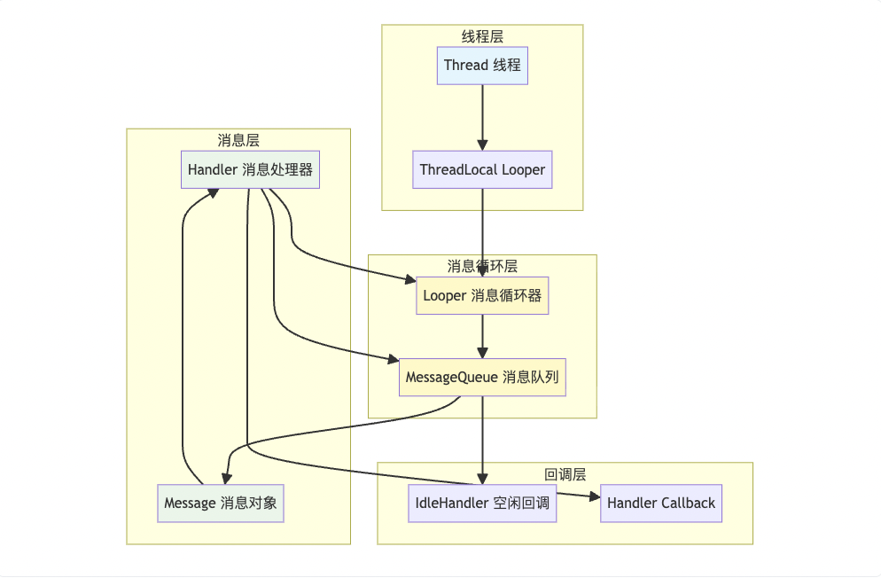
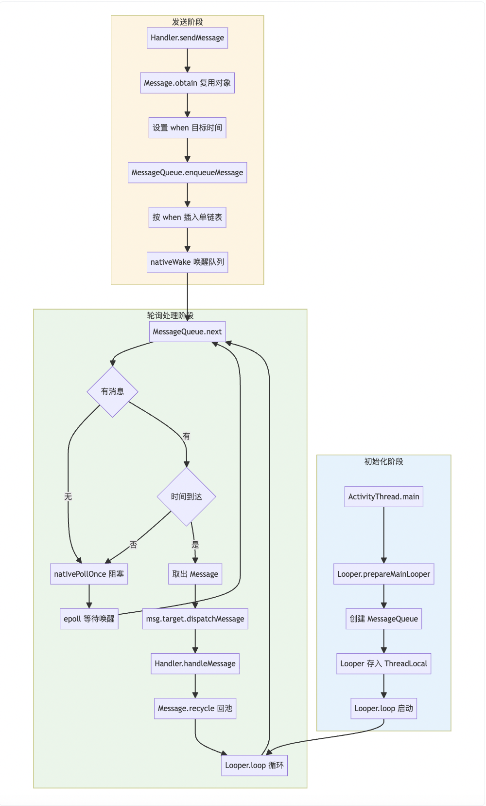
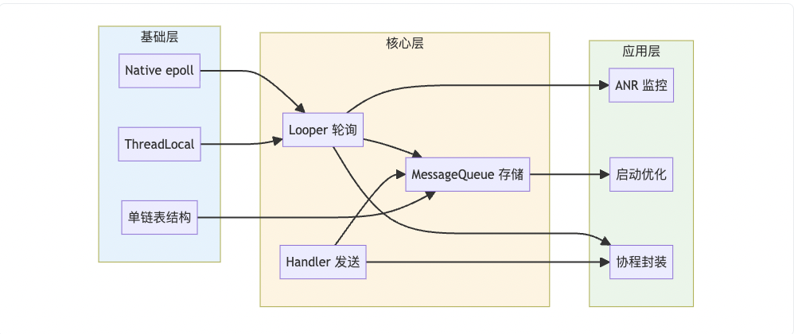

# Android 消息机制深度解析（Handler 机制）

> 基于 AOSP Android 13 源码分析。消息机制是 Android 线程间通信和 UI 刷新的基石，理解它对于理解 Activity 生命周期调度、AsyncTask 底层、协程调度器、ANR 原理至关重要。

---

## 一、概述

Android 的消息机制主要解决两个问题：

1. **子线程如何安全更新 UI**：UI 工具包非线程安全，必须在主线程操作
2. **线程间如何高效通信**：避免直接使用锁带来的复杂性和性能问题

核心设计思想是 **事件驱动 + 消息队列**：所有跨线程操作都封装为 Message，投递到目标线程的消息队列中串行处理。

---

## 二、四大核心组件

| 组件 | 职责 | 关键特性 |
|------|------|---------|
| **Message** | 消息单元 | 携带任务数据（what/arg1/arg2/obj/data），内部维护 `next` 指针构成链表节点，支持对象池复用 |
| **MessageQueue** | 消息队列 | 单链表结构，按执行时间（`when`）排序；底层通过 native epoll 实现阻塞/唤醒 |
| **Looper** | 消息循环器 | 每个线程唯一（通过 ThreadLocal 存储），负责从 MessageQueue 中不断取出消息分发 |
| **Handler** | 消息处理器 | 消息的发送者（`sendMessage`）和处理者（`handleMessage`），关联特定 Looper |

### 辅助概念

- **ThreadLocal**：提供线程隔离的变量存储，确保每个线程获取到自己的 Looper
- **Native Poll（epoll）**：Linux 内核 I/O 多路复用机制，用于 Looper 空闲时阻塞线程，不消耗 CPU
- **Sync Barrier**：同步屏障，用于优先处理异步消息（如 UI 渲染的 VSync 信号）

---

## 三、核心类持有关系



**关键持有关系：**

1. Thread 通过 ThreadLocal 存储 Looper 引用（一对一）
2. Looper 持有 MessageQueue（一对一）
3. Handler 持有 Looper 和 MessageQueue 引用（创建时绑定）
4. Message 持有 Handler 引用（`target` 字段），用于分发时回调
5. MessageQueue 管理 Message 链表和 IdleHandler 列表

> **内存泄漏根源**：Message 持有 Handler 引用（target），如果 Handler 是 Activity 的非静态内部类，则 Handler 持有 Activity 引用。当 Message 在队列中排队等待（如 `postDelayed` 10 秒），Activity 销毁后仍被 Message → Handler → Activity 引用链持有，无法 GC。

---

## 四、事件流转全过程

消息机制的核心流程分为三个阶段：**初始化、发送、轮询处理**。

### 4.1 完整流转流程



### 4.2 流程详细解读

1. **初始化**：主线程启动时，`ActivityThread.main()` 自动调用 `Looper.prepareMainLooper()` 创建主线程的 Looper 和 MessageQueue，然后调用 `Looper.loop()` 进入死循环
2. **发送**：Handler 获取当前时间 + 延迟 = `when`，将 Message 插入 MessageQueue。若插入到链表头部，需要唤醒可能阻塞中的 Looper
3. **轮询**：Looper 不断调用 `next()` 取消息。无消息时线程在 Native 层阻塞（不耗 CPU）；有消息且时间到，取出分发
4. **处理**：通过 Message 持有的 `target`（Handler）回调 `dispatchMessage()`
5. **回收**：消息处理完后，清空所有字段放回对象池，减少 GC 压力

---

## 五、源码关键逻辑分析

### 5.1 Looper.loop() — 消息循环核心

```java
// frameworks/base/core/java/android/os/Looper.java
public static void loop() {
    final Looper me = myLooper();
    if (me == null) throw new RuntimeException("No Looper; Looper.prepare() wasn't called on this thread.");
    final MessageQueue queue = me.mQueue;

    for (;;) {
        // 1. 取消息。若无消息，nativePollOnce 会阻塞线程，不消耗 CPU
        Message msg = queue.next();
        if (msg == null) return; // 调用了 quit()，退出循环

        // 2. 分发前打印日志（可用于 ANR 监控）
        final Printer logging = me.mLogging;
        if (logging != null) {
            logging.println(">>>>> Dispatching to " + msg.target + " " + msg.callback + ": " + msg.what);
        }

        // 3. 分发消息
        msg.target.dispatchMessage(msg);

        // 4. 分发后打印日志
        if (logging != null) {
            logging.println("<<<<< Finished to " + msg.target + " " + msg.callback);
        }

        // 5. 回收消息到对象池
        msg.recycleUnchecked();
    }
}
```

> **为什么需要死循环？** 线程执行完 `run()` 默认会销毁。主线程需要永久存活以响应用户交互，`loop()` 保证线程不退出。无消息时通过 native 层 epoll 阻塞，**不消耗 CPU**（休眠状态），这是事件驱动模型而非忙等待。

### 5.2 Handler.dispatchMessage() — 消息分发优先级

```java
// frameworks/base/core/java/android/os/Handler.java
public void dispatchMessage(Message msg) {
    if (msg.callback != null) {
        // 优先级 1：Message 自带的 Runnable（通过 Handler.post() 发送）
        handleCallback(msg);
    } else {
        if (mCallback != null) {
            // 优先级 2：Handler 构造时传入的 Callback
            if (mCallback.handleMessage(msg)) {
                return; // Callback 返回 true 表示已消费
            }
        }
        // 优先级 3：子类重写的 handleMessage()
        handleMessage(msg);
    }
}
```

**分发优先级：** `Message.callback`（post 的 Runnable）> `Handler.mCallback` > `Handler.handleMessage()`

### 5.3 MessageQueue.enqueueMessage() — 消息入队

```java
// frameworks/base/core/java/android/os/MessageQueue.java
boolean enqueueMessage(Message msg, long when) {
    synchronized (this) {
        msg.markInUse();
        msg.when = when;

        Message p = mMessages; // 链表头
        boolean needWake;

        if (p == null || when == 0 || when < p.when) {
            // 情况 1：队列为空 / 新消息执行时间最早 → 插入头部
            msg.next = p;
            mMessages = msg;
            needWake = mBlocked; // 队列阻塞中则需要唤醒
        } else {
            // 情况 2：遍历链表，找到合适位置（按 when 排序）
            // 特殊情况：有同步屏障 && 新消息是异步消息 → 也需唤醒
            needWake = mBlocked && p.target == null && msg.isAsynchronous();
            Message prev;
            for (;;) {
                prev = p;
                p = p.next;
                if (p == null || when < p.when) {
                    break;
                }
                if (needWake && p.isAsynchronous()) {
                    needWake = false; // 前面已有异步消息，无需唤醒
                }
            }
            msg.next = p;
            prev.next = msg;
        }

        if (needWake) {
            nativeWake(mPtr); // 通过 eventfd 唤醒 epoll_wait
        }
    }
    return true;
}
```

### 5.4 MessageQueue.next() — 消息出队

```java
// frameworks/base/core/java/android/os/MessageQueue.java
Message next() {
    final long ptr = mPtr; // native MessageQueue 指针
    if (ptr == 0) return null; // 已销毁

    int pendingIdleHandlerCount = -1;
    int nextPollTimeoutMillis = 0;

    for (;;) {
        // 1. Native 层阻塞（epoll_wait）
        // timeout = 0 立即返回，-1 无限阻塞，>0 等待指定毫秒
        nativePollOnce(ptr, nextPollTimeoutMillis);

        synchronized (this) {
            final long now = SystemClock.uptimeMillis();
            Message prevMsg = null;
            Message msg = mMessages;

            // 2. 遇到同步屏障（target == null），跳过同步消息，找异步消息
            if (msg != null && msg.target == null) {
                do {
                    prevMsg = msg;
                    msg = msg.next;
                } while (msg != null && !msg.isAsynchronous());
            }

            if (msg != null) {
                if (now < msg.when) {
                    // 3. 最早的消息还没到执行时间，计算需等待的时长
                    nextPollTimeoutMillis = (int) Math.min(msg.when - now, Integer.MAX_VALUE);
                } else {
                    // 4. 取出消息
                    mBlocked = false;
                    if (prevMsg != null) {
                        prevMsg.next = msg.next;
                    } else {
                        mMessages = msg.next;
                    }
                    msg.next = null;
                    msg.markInUse();
                    return msg;
                }
            } else {
                // 5. 没有任何消息，无限阻塞
                nextPollTimeoutMillis = -1;
            }

            // 6. 队列空闲时，执行 IdleHandler
            if (pendingIdleHandlerCount < 0 && (mMessages == null || now < mMessages.when)) {
                pendingIdleHandlerCount = mIdleHandlers.size();
            }
            // ... 执行 IdleHandler 回调 ...
        }
    }
}
```

### 5.5 Message 对象池复用机制

```java
// frameworks/base/core/java/android/os/Message.java
public final class Message implements Parcelable {
    // 对象池：静态单链表，最大缓存 50 个
    private static Message sPool;
    private static int sPoolSize;
    private static final int MAX_POOL_SIZE = 50;
    private static final Object sPoolSync = new Object();

    // 获取消息（优先从池中复用）
    public static Message obtain() {
        synchronized (sPoolSync) {
            if (sPool != null) {
                Message m = sPool;
                sPool = m.next;
                m.next = null;
                m.flags = 0; // 清除 FLAG_IN_USE
                sPoolSize--;
                return m;
            }
        }
        return new Message(); // 池为空则新建
    }

    // 回收消息到池中
    void recycleUnchecked() {
        // 清空所有字段，防止外部引用泄漏
        flags = FLAG_IN_USE;
        what = 0;
        arg1 = 0;
        arg2 = 0;
        obj = null;
        replyTo = null;
        sendingUid = UID_NONE;
        workSourceUid = UID_NONE;
        when = 0;
        target = null;
        callback = null;
        data = null;

        synchronized (sPoolSync) {
            if (sPoolSize < MAX_POOL_SIZE) {
                next = sPool;
                sPool = this; // 头插法
                sPoolSize++;
            }
        }
    }
}
```

> **最佳实践**：始终通过 `Message.obtain()` 或 `Handler.obtainMessage()` 获取 Message，避免频繁 new 对象导致内存抖动。系统内部所有消息都走对象池复用。

---

## 六、设计哲学

### 6.1 为什么 MessageQueue 是单链表而不是 BlockingQueue？

| 维度 | MessageQueue（单链表） | BlockingQueue | 选择原因 |
|------|----------------------|---------------|---------|
| **节点** | Message 本身就是链表节点（`next` 字段） | 需要额外 Node 包装 | **内存优化**：减少对象创建，配合对象池复用 |
| **排序** | 按时间（`when`）有序插入 | 通常 FIFO | 天然支持 `postDelayed`，队头始终是最早要执行的 |
| **阻塞** | Native epoll | Java Lock/Condition | **性能**：epoll 是内核级机制，阻塞/唤醒更高效 |
| **并发** | 单消费者 | 支持多消费者 | 主线程单线程消费，无需复杂的多消费者竞争 |

### 6.2 为什么 Looper.loop() 不会卡死主线程？

因为 `nativePollOnce()`。当队列无消息时，线程在 Native 层通过 `epoll_wait` 进入休眠状态，**释放 CPU 时间片**。只有以下情况线程才会被唤醒：

1. 有新消息入队，触发 `nativeWake()`（通过 `eventfd` 写入事件）
2. 定时消息到期（epoll 的 timeout 机制）

这是**事件驱动模型**，而非忙等待。Android 中所有事件（触摸、绘制、生命周期回调）都是通过消息驱动的，主线程在没有事件需要处理时就是应该"休息"的。

### 6.3 nativePollOnce 底层实现

```cpp
// system/core/libutils/Looper.cpp
int Looper::pollInner(int timeoutMillis) {
    // epoll_wait：等待事件发生或超时
    int eventCount = epoll_wait(mEpollFd, eventItems, EPOLL_MAX_EVENTS, timeoutMillis);

    for (int i = 0; i < eventCount; i++) {
        int fd = eventItems[i].data.fd;
        if (fd == mWakeEventFd) {
            // eventfd 被写入 → 有新消息，跳出阻塞
            awoken();
        } else {
            // 其他 fd 事件（如 InputChannel 的触摸事件）
            pushResponse(events, fd);
        }
    }
    return result;
}
```

> **额外能力**：Native Looper 不仅监听 MessageQueue 的 eventfd，还可以监听其他文件描述符。例如，**输入事件**（触摸、按键）就是通过 InputChannel 的 fd 注册到 epoll 中，与消息机制共享同一个事件循环。这就是为什么触摸事件能及时响应 -- 它直接唤醒了 epoll。

### 6.4 为什么主线程不需要手动 prepare()？

在 `ActivityThread.main()` 中，系统已替我们调用了 `Looper.prepareMainLooper()` 和 `Looper.loop()`：

```java
// frameworks/base/core/java/android/app/ActivityThread.java
public static void main(String[] args) {
    Looper.prepareMainLooper();
    // ... 创建 ActivityThread，注册到 AMS ...
    Looper.loop();
    throw new RuntimeException("Main thread loop unexpectedly exited");
}
```

如果自己创建子线程需要消息循环（如 HandlerThread），则必须手动调用 `Looper.prepare()` 和 `Looper.loop()`。

---

## 七、高级特性

### 7.1 同步屏障（Synchronization Barrier）

同步屏障用于确保**异步消息优先于同步消息执行**。

**原理**：插入一个 `target == null` 的 Message 作为屏障标记。`next()` 遇到屏障时，跳过所有同步消息，只取异步消息处理。

```java
// MessageQueue.java（隐藏 API）
public int postSyncBarrier() {
    synchronized (this) {
        final Message msg = Message.obtain();
        msg.markInUse();
        msg.when = SystemClock.uptimeMillis();
        msg.arg1 = token; // 屏障 token，用于后续移除
        // 注意：不设置 msg.target，这就是屏障的标识
        // ... 插入链表 ...
        return token;
    }
}
```

**核心应用场景**：`ViewRootImpl.scheduleTraversals()` 在请求 UI 绘制时会：
1. 插入同步屏障
2. 通过 Choreographer 发送异步消息（CALLBACK_TRAVERSAL）
3. VSync 信号到来时，异步消息优先被处理，保证 UI 绘制不被其他消息阻塞
4. 绘制完成后移除同步屏障

```java
// frameworks/base/core/java/android/view/ViewRootImpl.java
void scheduleTraversals() {
    if (!mTraversalScheduled) {
        mTraversalScheduled = true;
        mTraversalBarrier = mHandler.getLooper().getQueue().postSyncBarrier(); // 插入屏障
        mChoreographer.postCallback(Choreographer.CALLBACK_TRAVERSAL, mTraversalRunnable, null);
    }
}

void unscheduleTraversals() {
    mHandler.getLooper().getQueue().removeSyncBarrier(mTraversalBarrier); // 移除屏障
}
```

### 7.2 IdleHandler（空闲回调）

当 MessageQueue 中没有待处理消息（或最近的消息还未到执行时间）时，会执行已注册的 IdleHandler。

```java
Looper.myQueue().addIdleHandler(new MessageQueue.IdleHandler() {
    @Override
    public boolean queueIdle() {
        // 执行非关键任务
        // 返回 false：执行一次后自动移除
        // 返回 true：保留，每次空闲都会执行
        return false;
    }
});
```

**常见应用场景：**

| 场景 | 说明 |
|------|------|
| **启动优化** | 将非关键的初始化任务延迟到首帧绘制后的空闲时执行 |
| **GC 触发** | `GcIdler` 在空闲时触发 GC，避免影响用户交互 |
| **Activity 销毁** | `ActivityThread.Idler` 在空闲时通知 AMS Activity 已进入 idle 状态 |
| **View 预加载** | 在空闲时提前 inflate 将要使用的布局 |

> **注意**：不要在 IdleHandler 中执行耗时操作。IdleHandler 仍在主线程执行，过长的任务会导致后续消息延迟处理，影响用户体验。

### 7.3 异步消息

通过 `Handler.createAsync(looper)` 创建的 Handler，其发送的所有消息自动标记为异步（`msg.setAsynchronous(true)`）。异步消息可以穿越同步屏障，不受屏障阻挡。

```java
// Android 11+ 公开 API
Handler asyncHandler = Handler.createAsync(Looper.getMainLooper());
asyncHandler.post(() -> {
    // 这条消息即使遇到同步屏障也能被处理
});
```

### 7.4 HandlerThread

`HandlerThread` 是一个自带 Looper 的线程，简化了"子线程消息循环"的创建：

```java
// 内部实现极简
public class HandlerThread extends Thread {
    Looper mLooper;

    @Override
    public void run() {
        Looper.prepare();
        synchronized (this) {
            mLooper = Looper.myLooper();
            notifyAll(); // 通知 getLooper() 的等待者
        }
        Looper.loop();
    }

    public Looper getLooper() {
        synchronized (this) {
            while (mLooper == null) {
                wait(); // 等待 Looper 创建完成
            }
        }
        return mLooper;
    }
}
```

**典型应用**：`AsyncLayoutInflater` 内部使用 HandlerThread 在后台线程执行布局 inflate；`IntentService`（已废弃）使用 HandlerThread 串行处理任务。

---

## 八、与 Kotlin 协程的关系

Kotlin 协程的 `Dispatchers.Main` 底层就是 Android 的 Handler 机制：

```kotlin
// kotlinx-coroutines-android 源码
internal class HandlerContext(
    private val handler: Handler
) : CoroutineDispatcher() {
    override fun dispatch(context: CoroutineContext, block: Runnable) {
        handler.post(block) // 本质上就是 Handler.post()
    }
}
```

当你在协程中使用 `withContext(Dispatchers.Main)` 切换到主线程时，实际上是将 Runnable 通过 Handler 发送到主线程的 MessageQueue。协程的挂起和恢复，在 Android 主线程上，最终都通过消息机制调度。

---

## 九、常见面试题与解答

### Q1：描述 Handler 消息机制的完整流程

**答**：Handler 消息机制由四个核心组件协作完成：

1. **初始化**：线程通过 `Looper.prepare()` 创建 Looper 和 MessageQueue，`Looper.loop()` 开启消息循环。主线程在 `ActivityThread.main()` 中自动完成。
2. **发送**：Handler 通过 `sendMessage()` 或 `post()` 将消息投递到其关联的 MessageQueue，消息按执行时间（`when`）有序插入单链表。
3. **轮询**：Looper 在死循环中不断调用 `MessageQueue.next()` 取消息。无消息时通过 native epoll 阻塞线程（不耗 CPU），有消息入队时通过 eventfd 唤醒。
4. **分发**：取到消息后，通过 `msg.target.dispatchMessage(msg)` 回调到 Handler，按优先级分发：Message.callback > Handler.mCallback > handleMessage()。
5. **回收**：消息处理完毕后回收到对象池（最大 50 个），供 `Message.obtain()` 复用。

---

### Q2：为什么 Looper.loop() 死循环不会导致 ANR？

**答**：这是两个不同的概念：

- **ANR** 是指主线程在规定时间内没有完成特定操作（如 5 秒内没有处理输入事件、10 秒内没有处理完广播）。ANR 的检测依赖于消息机制本身 -- AMS 发送一个检测消息，超时未被处理则判定 ANR。
- **Looper.loop()** 的死循环在无消息时通过 `nativePollOnce` → `epoll_wait` 进入内核态休眠，**不占用 CPU 时间片**，不影响任何事件处理。

本质上，主线程的所有工作（Activity 生命周期、触摸事件、绘制）都是通过消息驱动的。`loop()` 保证线程存活并响应事件，而不是"卡死"。

---

### Q3：Handler 导致内存泄漏的原因和解决方案

**答**：

**泄漏原因**：
- Handler 作为 Activity 的非静态内部类，隐式持有 Activity 引用
- 发送的 Message 持有 Handler 引用（`target` 字段）
- 延迟消息在 MessageQueue 中排队等待时，形成引用链：MessageQueue → Message → Handler → Activity
- Activity 销毁后，引用链阻止 GC 回收

**解决方案**：

```kotlin
// 方案 1：静态内部类 + WeakReference
class MyHandler(activity: MyActivity) : Handler(Looper.getMainLooper()) {
    private val activityRef = WeakReference(activity)

    override fun handleMessage(msg: Message) {
        val activity = activityRef.get() ?: return // Activity 已回收则直接返回
        // 处理消息
    }
}

// 方案 2：在 onDestroy 中清理
override fun onDestroy() {
    super.onDestroy()
    handler.removeCallbacksAndMessages(null) // 移除所有消息和回调
}

// 方案 3（推荐）：使用 Kotlin 协程替代
lifecycleScope.launch {
    delay(5000)
    // 生命周期感知，Activity 销毁时自动取消
}
```

---

### Q4：同步屏障的作用是什么？在哪里使用？

**答**：同步屏障用于**临时提升异步消息的优先级**，让异步消息绕过队列中排在前面的同步消息优先执行。

**实现原理**：向 MessageQueue 插入一个 `target == null` 的 Message 作为屏障。`next()` 取消息时，遇到屏障会跳过所有同步消息，只取异步消息。

**核心应用**：`ViewRootImpl.scheduleTraversals()` 中，在请求 UI 绘制时插入同步屏障，确保 Choreographer 的 VSync 回调（异步消息）能优先执行，不被其他普通消息阻塞。这是 Android 保证 UI 流畅性（16.6ms 一帧）的关键机制。

> 同步屏障是 @hide API，应用层不能直接使用。它的存在说明了 Android 对 UI 渲染流畅性的重视 -- 宁可延迟普通消息，也要保证绘制帧不丢。

---

### Q5：sendMessageDelayed 的延时是精确的吗？

**答**：**不精确**，只保证"至少延迟这么久"。实际执行时间受以下因素影响：

1. **前方消息阻塞**：如果主线程正在处理一个耗时消息（如大量布局 inflate），延迟消息到时后也要排队等待
2. **系统休眠**：`when` 基于 `SystemClock.uptimeMillis()`（不计深度睡眠时间），设备休眠期间计时暂停
3. **消息队列拥堵**：如果同一时间有大量消息待处理，会产生排队延迟

因此，Handler 的延迟消息不适合做精确定时。需要精确定时应使用 `AlarmManager` 或 `Choreographer.postFrameCallback()`。

---

### Q6：IdleHandler 的使用场景和注意事项

**答**：

**使用场景**：
- **启动优化**：将非首屏必需的初始化延迟到空闲时执行（如预加载数据、初始化非关键 SDK）
- **延迟操作**：在当前消息处理完且无新消息时执行（比 `postDelayed` 更智能 -- 不是固定延迟，而是"有空就做"）
- **系统内部**：GC 触发、Activity idle 通知等

**注意事项**：
1. 仍在主线程执行，不能做耗时操作
2. 只在队列真正空闲时才触发 -- 如果消息不断涌入，IdleHandler 可能永远不执行
3. 返回 `true` 会持续注册，每次空闲都执行；返回 `false` 只执行一次
4. 批量注册多个 IdleHandler 时要注意总耗时，避免阻塞后续消息

---

### Q7：如何监控主线程卡顿？

**答**：利用 `Looper.setMessageLogging(Printer)` 机制。Looper 在分发每条消息前后都会打印日志：

```java
Looper.getMainLooper().setMessageLogging(new Printer() {
    @Override
    public void println(String x) {
        if (x.startsWith(">>>>>")) {
            // 消息开始处理，记录时间
            startTime = SystemClock.elapsedRealtime();
        } else if (x.startsWith("<<<<<")) {
            // 消息处理完毕，计算耗时
            long cost = SystemClock.elapsedRealtime() - startTime;
            if (cost > 200) {
                // 超过 200ms，采集主线程堆栈上报
                Log.w("BlockDetect", "Block " + cost + "ms");
            }
        }
    }
});
```

开源框架 **BlockCanary** 就是基于这个原理实现的。更精确的方案是使用 Choreographer.FrameCallback 监控掉帧。

---

### Q8：子线程可以创建 Handler 吗？需要注意什么？

**答**：可以，但必须先调用 `Looper.prepare()` 为当前线程创建 Looper，否则会抛 RuntimeException。

```kotlin
// 方式 1：手动管理
Thread {
    Looper.prepare()
    val handler = Handler(Looper.myLooper()!!)
    // ... 使用 handler ...
    Looper.loop() // 注意：这之后的代码不会执行，除非调用 Looper.quit()
}.start()

// 方式 2：使用 HandlerThread（推荐）
val handlerThread = HandlerThread("worker")
handlerThread.start()
val handler = Handler(handlerThread.looper)
// 用完后必须退出
handlerThread.quitSafely()
```

**注意事项**：
- 必须在不需要时调用 `Looper.quit()` 或 `Looper.quitSafely()` 退出消息循环，否则线程永远不会结束，造成资源泄漏
- `quit()` 立即移除所有消息；`quitSafely()` 只移除未到执行时间的消息，已到期的消息会处理完
- 推荐使用 `HandlerThread`，它封装了 prepare/loop 的细节，并处理了 Looper 创建的线程同步问题

---

### Q9：Kotlin 协程的 Dispatchers.Main 底层是什么？

**答**：`Dispatchers.Main` 底层就是 Handler。`kotlinx-coroutines-android` 库中的 `HandlerDispatcher` 通过 `Handler.post()` 将协程的恢复操作投递到主线程的 MessageQueue。

所以协程在 Android 主线程上的调度，本质上仍然是消息机制。`withContext(Dispatchers.Main)` = 将 Runnable 通过 Handler 发送到主线程。协程的优势在于结构化并发（自动取消）和更简洁的异步代码，而非底层机制的改变。

---

## 十、知识脉络总结



掌握 Handler 机制不仅是应对面试，更是理解 Android 系统如何调度任务、如何保证 UI 流畅性的关键。Activity 生命周期管理、View 绘制调度、输入事件分发、协程调度器 -- 这些核心机制的底层都是消息驱动的。
