# Java 集合框架：HashMap 深度解析

## 一、概述

HashMap 是 Java 中最常用的数据结构之一，也是面试必考内容。理解 HashMap 的底层实现，不仅是掌握集合框架的基础，更能体现对数据结构和算法的理解深度。

**核心要点：**

- **底层结构**：数组 + 链表 + 红黑树（JDK 8+），解决 Hash 冲突
- **扩容机制**：负载因子 0.75，容量翻倍，元素重哈希
- **线程不安全**：多线程环境下可能导致数据丢失、死循环（JDK 7）
- **替代方案**：ConcurrentHashMap（线程安全）、LinkedHashMap（有序）、TreeMap（排序）

---

## 二、HashMap 数据结构

### 2.1 整体结构



HashMap 内部维护一个 `Node<K,V>[] table` 数组，每个位置称为一个**桶（bucket）**。当多个 key 的 hash 值映射到同一个桶时，形成**链表**。JDK 8 后，当链表长度达到 8 且数组长度达到 64 时，链表转换为**红黑树**。

### 2.2 核心字段

```java
public class HashMap<K,V> extends AbstractMap<K,V> implements Map<K,V> {
    // 默认初始容量 16（必须是 2 的幂）
    static final int DEFAULT_INITIAL_CAPACITY = 1 << 4;

    // 最大容量 2^30
    static final int MAXIMUM_CAPACITY = 1 << 30;

    // 默认负载因子 0.75
    static final float DEFAULT_LOAD_FACTOR = 0.75f;

    // 链表转红黑树的阈值
    static final int TREEIFY_THRESHOLD = 8;

    // 红黑树转链表的阈值
    static final int UNTREEIFY_THRESHOLD = 6;

    // 链表转红黑树时，数组的最小长度
    static final int MIN_TREEIFY_CAPACITY = 64;

    // 哈希桶数组
    transient Node<K,V>[] table;

    // 键值对数量
    transient int size;

    // 扩容阈值 = capacity * loadFactor
    int threshold;

    // 负载因子
    final float loadFactor;
}
```

### 2.3 Node 结构

```java
static class Node<K,V> implements Map.Entry<K,V> {
    final int hash;         // key 的 hash 值（避免重复计算）
    final K key;
    V value;
    Node<K,V> next;         // 链表下一个节点

    Node(int hash, K key, V value, Node<K,V> next) {
        this.hash = hash;
        this.key = key;
        this.value = value;
        this.next = next;
    }
}
```

---

## 三、核心操作流程

### 3.1 put() 操作



```java
public V put(K key, V value) {
    return putVal(hash(key), key, value, false, true);
}

// 计算 hash 值（高 16 位异或低 16 位，减少冲突）
static final int hash(Object key) {
    int h;
    return (key == null) ? 0 : (h = key.hashCode()) ^ (h >>> 16);
}

final V putVal(int hash, K key, V value, boolean onlyIfAbsent, boolean evict) {
    Node<K,V>[] tab; Node<K,V> p; int n, i;

    // 1. 数组为空，初始化（延迟初始化）
    if ((tab = table) == null || (n = tab.length) == 0)
        n = (tab = resize()).length;

    // 2. 计算桶索引：(n-1) & hash，等价于 hash % n（n 是 2 的幂）
    if ((p = tab[i = (n - 1) & hash]) == null)
        // 桶为空，直接插入新节点
        tab[i] = newNode(hash, key, value, null);
    else {
        Node<K,V> e; K k;

        // 3. 桶不为空，检查第一个节点
        if (p.hash == hash &&
            ((k = p.key) == key || (key != null && key.equals(k))))
            e = p;  // key 相同，记录下来后面覆盖 value
        else if (p instanceof TreeNode)
            // 4. 是红黑树节点，调用树插入
            e = ((TreeNode<K,V>)p).putTreeVal(this, tab, hash, key, value);
        else {
            // 5. 遍历链表
            for (int binCount = 0; ; ++binCount) {
                if ((e = p.next) == null) {
                    // 尾插法插入新节点
                    p.next = newNode(hash, key, value, null);

                    // 链表长度达到 8，转红黑树
                    if (binCount >= TREEIFY_THRESHOLD - 1)
                        treeifyBin(tab, hash);
                    break;
                }
                // 找到相同 key，跳出循环
                if (e.hash == hash &&
                    ((k = e.key) == key || (key != null && key.equals(k))))
                    break;
                p = e;
            }
        }

        // 6. 找到已存在的 key，覆盖 value
        if (e != null) {
            V oldValue = e.value;
            if (!onlyIfAbsent || oldValue == null)
                e.value = value;
            afterNodeAccess(e);  // LinkedHashMap 回调
            return oldValue;
        }
    }

    ++modCount;

    // 7. 检查是否需要扩容
    if (++size > threshold)
        resize();

    afterNodeInsertion(evict);  // LinkedHashMap 回调
    return null;
}
```

### 3.2 get() 操作

```java
public V get(Object key) {
    Node<K,V> e;
    return (e = getNode(hash(key), key)) == null ? null : e.value;
}

final Node<K,V> getNode(int hash, Object key) {
    Node<K,V>[] tab; Node<K,V> first, e; int n; K k;

    if ((tab = table) != null && (n = tab.length) > 0 &&
        (first = tab[(n - 1) & hash]) != null) {

        // 1. 检查桶的第一个节点
        if (first.hash == hash &&
            ((k = first.key) == key || (key != null && key.equals(k))))
            return first;

        if ((e = first.next) != null) {
            // 2. 红黑树查找
            if (first instanceof TreeNode)
                return ((TreeNode<K,V>)first).getTreeNode(hash, key);

            // 3. 链表遍历查找
            do {
                if (e.hash == hash &&
                    ((k = e.key) == key || (key != null && key.equals(k))))
                    return e;
            } while ((e = e.next) != null);
        }
    }
    return null;
}
```

### 3.3 桶索引计算

```java
// 为什么用 (n-1) & hash 而不是 hash % n？
// 因为 n 是 2 的幂，(n-1) & hash 等价于 hash % n，但位运算更快

// 例如：n = 16, hash = 15
// hash % 16 = 15
// (16-1) & 15 = 0b1111 & 0b1111 = 15

// hash 扰动函数：高 16 位异或低 16 位
static final int hash(Object key) {
    int h;
    return (key == null) ? 0 : (h = key.hashCode()) ^ (h >>> 16);
}
```

> **为什么需要扰动函数？** 当 n 较小时，只有低几位参与索引计算。扰动函数将高位特征混合到低位，减少碰撞概率。

---

## 四、扩容机制

### 4.1 扩容时机

当 `size > threshold`（threshold = capacity * loadFactor）时触发扩容。

**为什么负载因子是 0.75？**

- 太小（如 0.5）：空间利用率低，频繁扩容
- 太大（如 1.0）：冲突概率高，查询效率下降
- 0.75 是时间和空间的平衡点（泊松分布概率 < 0.0000001 时链表长度达到 8）

### 4.2 扩容流程

```java
final Node<K,V>[] resize() {
    Node<K,V>[] oldTab = table;
    int oldCap = (oldTab == null) ? 0 : oldTab.length;
    int oldThr = threshold;
    int newCap, newThr = 0;

    // 1. 计算新容量
    if (oldCap > 0) {
        if (oldCap >= MAXIMUM_CAPACITY) {
            threshold = Integer.MAX_VALUE;
            return oldTab;  // 达到最大容量，不扩容
        }
        else if ((newCap = oldCap << 1) < MAXIMUM_CAPACITY &&
                 oldCap >= DEFAULT_INITIAL_CAPACITY)
            newThr = oldThr << 1;  // 容量翻倍，阈值翻倍
    }
    // ... 省略其他情况

    // 2. 创建新数组
    @SuppressWarnings({"rawtypes","unchecked"})
    Node<K,V>[] newTab = (Node<K,V>[])new Node[newCap];
    table = newTab;
    threshold = newThr;

    // 3. 迁移数据
    if (oldTab != null) {
        for (int j = 0; j < oldCap; ++j) {
            Node<K,V> e;
            if ((e = oldTab[j]) != null) {
                oldTab[j] = null;  // 帮助 GC
                if (e.next == null)
                    // 单个节点，直接计算新位置
                    newTab[e.hash & (newCap - 1)] = e;
                else if (e instanceof TreeNode)
                    // 红黑树拆分
                    ((TreeNode<K,V>)e).split(this, newTab, j, oldCap);
                else {
                    // 链表拆分
                    Node<K,V> loHead = null, loTail = null;
                    Node<K,V> hiHead = null, hiTail = null;

                    do {
                        // 根据 (e.hash & oldCap) == 0 决定留在原位置还是移动到新位置
                        if ((e.hash & oldCap) == 0) {
                            if (loTail == null)
                                loHead = e;
                            else
                                loTail.next = e;
                            loTail = e;
                        } else {
                            if (hiTail == null)
                                hiHead = e;
                            else
                                hiTail.next = e;
                            hiTail = e;
                        }
                    } while ((e = e.next) != null);

                    if (loTail != null) {
                        loTail.next = null;
                        newTab[j] = loHead;  // 原位置
                    }
                    if (hiTail != null) {
                        hiTail.next = null;
                        newTab[j + oldCap] = hiHead;  // 新位置 = 原位置 + oldCap
                    }
                }
            }
        }
    }
    return newTab;
}
```

### 4.3 扩容时的位置计算

**巧妙的优化**：扩容后，元素要么在原位置，要么在原位置 + oldCap。

```
扩容前：capacity = 16, hash = 15 (0b1111)
index = hash & 15 = 0b1111 & 0b1111 = 15

扩容后：capacity = 32
hash & 31 = 0b011111 & 0b011111 = 15（原位置）
或
hash & 31 = 0b111111 & 0b011111 = 31（原位置 + 16）

判断依据：(hash & oldCap) == 0
- 0：留在原位置
- 非 0：移动到原位置 + oldCap
```

---

## 五、红黑树转换

### 5.1 转换条件

| 条件 | 触发动作 |
|------|---------|
| 链表长度 >= 8 且数组长度 >= 64 | 链表转红黑树 |
| 链表长度 >= 8 但数组长度 < 64 | 优先扩容（不转树） |
| 红黑树节点数 <= 6 | 红黑树转链表 |

### 5.2 为什么是 8？

根据泊松分布，链表长度达到 8 的概率约为 0.00000006，非常罕见。正常情况下链表长度很小，红黑树是应对极端情况的保底方案。

---

## 六、线程安全问题

### 6.1 HashMap 为什么线程不安全？

**JDK 7 死循环问题**：扩容时链表头插法导致倒序，并发扩容时可能形成环形链表，get() 时无限循环。

**JDK 8 数据丢失问题**：并发 put 时可能覆盖其他线程的插入。

```java
// 线程 1 和线程 2 同时 put 到同一个桶
// 两个线程都执行到 p.next == null，同时插入新节点
// 后执行的线程会覆盖先执行的结果
```

### 6.2 线程安全方案

| 方案 | 特点 | 适用场景 |
|------|------|---------|
| **ConcurrentHashMap** | 分段锁（JDK 7） / CAS + synchronized（JDK 8） | 高并发场景 |
| **Collections.synchronizedMap** | 全局锁包装 | 低并发场景 |
| **Hashtable** | 全局锁，性能差 | 不推荐使用 |

---

## 七、HashMap 变体

### 7.1 LinkedHashMap

在 HashMap 基础上维护一个双向链表，实现插入顺序或访问顺序。

```java
// 插入顺序（默认）
LinkedHashMap<String, Integer> map = new LinkedHashMap<>();

// 访问顺序（可用于 LRU 缓存）
LinkedHashMap<String, Integer> lru = new LinkedHashMap<>(16, 0.75f, true);

// 简单 LRU 实现
LinkedHashMap<String, Integer> lru = new LinkedHashMap<>(16, 0.75f, true) {
    @Override
    protected boolean removeEldestEntry(Map.Entry<String, Integer> eldest) {
        return size() > 100;  // 超过 100 个元素时删除最老的
    }
};
```

### 7.2 TreeMap

基于红黑树实现，保证 key 有序（自然排序或自定义比较器）。

```java
TreeMap<String, Integer> treeMap = new TreeMap<>();
treeMap.put("c", 3);
treeMap.put("a", 1);
treeMap.put("b", 2);

// 遍历结果有序：a=1, b=2, c=3

// 自定义排序
TreeMap<String, Integer> custom = new TreeMap<>((s1, s2) -> s2.compareTo(s1));
```

---

## 八、常见面试题与解答

### Q1：HashMap 的底层实现是什么？

**答**：JDK 8 中，HashMap 底层是**数组 + 链表 + 红黑树**。数组是主体，每个位置称为桶。当多个 key 映射到同一个桶时，用链表解决冲突。当链表长度达到 8 且数组长度达到 64 时，链表转为红黑树以提高查询效率（O(n) → O(log n)）。

---

### Q2：为什么 HashMap 的容量必须是 2 的幂？

**答**：

1. **索引计算优化**：`(n-1) & hash` 等价于 `hash % n`，但位运算更快
2. **元素分布均匀**：当 n 是 2 的幂时，n-1 的二进制形式全为 1，与 hash 进行与运算时能充分利用 hash 的所有位，减少冲突
3. **扩容效率**：扩容时只需判断 hash 新增的一位是 0 还是 1，无需重新计算所有位置

---

### Q3：HashMap 的扩容机制是什么？

**答**：

1. **触发条件**：size > threshold（capacity * loadFactor）
2. **扩容操作**：容量翻倍，创建新数组
3. **数据迁移**：
   - 单个节点：直接计算新位置
   - 链表：拆分为两条链表，一条留在原位置，一条移动到原位置 + oldCap
   - 红黑树：拆分为两条链表或两棵树
4. **巧妙优化**：根据 `(hash & oldCap)` 判断元素新位置，无需重新计算 hash

---

### Q4：为什么 JDK 8 用红黑树替代链表？阈值为什么是 8？

**答**：

**为什么用红黑树**：链表查询时间复杂度 O(n)，红黑树 O(log n)。当链表过长时，红黑树效率更高。

**为什么是 8**：根据泊松分布，链表长度达到 8 的概率约为 0.00000006。正常情况下链表长度很小，8 是极端情况的阈值。

**为什么不直接用红黑树**：红黑树节点占用更多内存（需要维护颜色、父节点、左右子节点引用），且维护成本高。链表在长度小时更高效。

---

### Q5：HashMap 和 ConcurrentHashMap 的区别？

**答**：

| 对比项 | HashMap | ConcurrentHashMap |
|--------|---------|-------------------|
| 线程安全 | 不安全 | 安全 |
| 锁机制 | 无 | JDK 7 分段锁，JDK 8 CAS + synchronized |
| null 键值 | 允许 | 不允许 |
| 迭代器 | fail-fast | 弱一致性 |
| 性能 | 高 | 略低（锁开销） |

---

### Q6：HashMap 和 Hashtable 的区别？

**答**：

| 对比项 | HashMap | Hashtable |
|--------|---------|-----------|
| 线程安全 | 不安全 | 安全（全局锁） |
| null 键值 | 允许 | 不允许 |
| 继承类 | AbstractMap | Dictionary |
| 迭代器 | fail-fast | Enumeration |
| 性能 | 高 | 低 |

Hashtable 是遗留类，不推荐使用，推荐 ConcurrentHashMap。

---

### Q7：如何设计一个好的 key？

**答**：

1. **不可变**：key 应该是不可变对象，防止 hash 值变化导致找不到元素
2. **正确实现 hashCode() 和 equals()**：
   - hashCode() 返回一致的值
   - equals() 比较逻辑正确
   - 两个对象 equals() 返回 true，hashCode() 必须相同
3. **String 是最佳选择**：不可变、已正确实现 hashCode/equals

```java
// 错误示例：可变对象作为 key
class BadKey {
    int id;
    // hashCode 和 equals 基于 id
}

BadKey key = new BadKey(1);
map.put(key, "value");
key.id = 2;  // 修改 key
map.get(key);  // 返回 null！hash 值变了
```
