# JVM 内存模型深度解析

## 一、概述

JVM 内存模型描述了 Java 虚拟机在运行时如何划分和管理内存。理解 JVM 内存模型是排查 OOM 问题、理解垃圾回收机制、以及进行性能优化的基础。

**核心要点：**

- **运行时数据区**分为线程私有（程序计数器、虚拟机栈、本地方法栈）和线程共享（堆、方法区）两大类
- **栈**存储方法调用链和局部变量，**堆**存储对象实例，**方法区**存储类信息和常量
- 栈随线程创建销毁，**不存在 GC**；堆和方法区随 JVM 生命周期，是 **GC 的主要区域**
- 线程私有区域**没有线程安全问题**，线程共享区域需要考虑并发访问

---

## 二、运行时数据区总览

JVM 在执行 Java 程序时，将内存划分为以下区域：



| 区域 | 线程归属 | 生命周期 | 存储内容 | 是否 GC |
|------|---------|---------|---------|--------|
| 程序计数器 | 私有 | 随线程 | 当前执行的字节码行号 | 否 |
| 虚拟机栈 | 私有 | 随线程 | 栈帧（局部变量、操作数栈等） | 否 |
| 本地方法栈 | 私有 | 随线程 | Native 方法调用信息 | 否 |
| 堆 | 共享 | 随 JVM | 对象实例、数组 | **是** |
| 方法区 | 共享 | 随 JVM | 类信息、常量、静态变量 | 部分是 |

> **关键认知**：线程私有区域只需要关注栈溢出（StackOverflowError），线程共享区域需要关注内存溢出（OutOfMemoryError）和垃圾回收。

---

## 三、程序计数器（Program Counter Register）

### 3.1 设计动机

程序计数器是一块较小的内存空间，记录当前线程执行的字节码指令位置。

**为什么需要程序计数器？**

1. **多线程切换恢复**：Java 支持多线程，CPU 在线程间轮转执行。当线程被切换回来时，需要知道从哪里继续。
2. **字节码执行控制**：JVM 解释器通过改变计数器的值选取下一条字节码指令，实现分支、循环、跳转等控制流。

### 3.2 核心特性

| 特性 | 说明 |
|------|------|
| 线程私有 | 每个线程独立的计数器，互不干扰 |
| 无 OOM | 唯一一个 JVM 规范中没有规定 OutOfMemoryError 的区域 |
| Native 方法时为空 | 执行本地方法时，计数器值为 undefined（非字节码） |

### 3.3 工作原理

```java
// 源代码
public int add(int a, int b) {
    return a + b;
}

// 字节码
0: iload_1    // 加载局部变量表 slot 1（参数 a）
1: iload_2    // 加载局部变量表 slot 2（参数 b）
2: iadd       // 执行加法，结果压入操作数栈
3: ireturn    // 返回栈顶值

// 程序计数器变化：0 → 1 → 2 → 3
```

---

## 四、虚拟机栈（Java Virtual Machine Stack）

### 4.1 设计动机

虚拟机栈描述 Java 方法执行的内存模型。每个方法调用时创建一个**栈帧（Stack Frame）**，方法结束时销毁。

**为什么用栈而不是堆存储方法调用信息？**

| 原因 | 说明 |
|------|------|
| **LIFO 特性匹配** | 方法调用是嵌套的：A 调 B，B 调 C，返回时 C → B → A，天然符合栈结构 |
| **分配效率** | 栈只需移动指针即可分配/回收，比堆的 GC 快几个数量级 |
| **局部性** | 方法内的局部变量在方法结束后立即失效，栈的生命周期管理更精确 |

### 4.2 栈帧结构

每个栈帧包含四个部分：



#### 4.2.1 局部变量表

存储方法参数和局部变量的数组，以 **Slot（变量槽）** 为单位。

```java
public void example(int a, double b, Object c) {
    int d = 10;
}
```

| Slot 索引 | 变量 | 类型 | 说明 |
|-----------|------|------|------|
| 0 | this | Object | 实例方法隐含参数 |
| 1 | a | int | 方法参数 |
| 2-3 | b | double | double/long 占 2 个 Slot |
| 4 | c | Object | 方法参数 |
| 5 | d | int | 局部变量 |

> **Slot 复用**：局部变量表中的 Slot 可复用。变量超出作用域后，其 Slot 可被后续变量使用。这会影响垃圾回收——变量置 null 可能让对象提前被回收。

#### 4.2.2 操作数栈

后进先出的栈，用于存储计算中间结果。

```java
int a = 1 + 2 * 3;
```

字节码执行过程：

```
iconst_1     → 栈：[1]
iconst_2     → 栈：[1, 2]
iconst_3     → 栈：[1, 2, 3]
imul         → 栈：[1, 6]      （弹出 2 和 3，相乘，压入 6）
iadd         → 栈：[7]         （弹出 1 和 6，相加，压入 7）
istore_1     → 栈：[]          （弹出，存入局部变量表 slot 1）
```

#### 4.2.3 动态链接

指向运行时常量池中该栈帧所属方法的引用，支持方法调用过程中的**动态绑定**。

- **符号引用**：编译时生成，包含类名、方法名、描述符
- **直接引用**：运行时解析为方法在内存中的实际入口地址

#### 4.2.4 方法返回地址

方法退出有两种方式：

| 退出方式 | 返回地址来源 |
|---------|-------------|
| 正常退出 | 调用者的 PC + 1（返回指令后的位置） |
| 异常退出 | 异常表确定（未捕获异常导致方法终止） |

### 4.3 栈溢出与内存不足

| 异常 | 触发条件 | 典型场景 |
|------|---------|---------|
| StackOverflowError | 栈深度超过最大值 | 无限递归、方法调用层级过深 |
| OutOfMemoryError | 无法分配新栈 | 线程过多（每个线程需要独立栈空间） |

**栈深度测试：**

```java
public class StackDepthTest {
    private int depth = 0;

    public void deep() {
        depth++;
        deep();  // 递归直到栈溢出
    }

    public static void main(String[] args) {
        StackDepthTest test = new StackDepthTest();
        try {
            test.deep();
        } catch (StackOverflowError e) {
            System.out.println("栈深度: " + test.depth);
        }
    }
}
// 默认 1MB 栈大小时，深度约 5000-10000
```

**JVM 参数调整：**

```bash
-Xss256k   # 每个线程栈大小 256KB（减少内存占用，降低栈深度）
-Xss2m     # 每个线程栈大小 2MB（增加栈深度，适合递归深度大的场景）
```

---

## 五、本地方法栈

与虚拟机栈类似，区别在于服务对象：

| 对比项 | 虚拟机栈 | 本地方法栈 |
|--------|---------|-----------|
| 服务对象 | Java 方法 | Native 方法（C/C++ 等） |
| 字节码 | Java 字节码 | 无（直接执行本地代码） |
| 异常 | StackOverflowError / OOM | 相同 |

**典型 Native 方法：**

```java
public final native Class<?> getClass();           // Object 类
private native void start0();                       // Thread.start() 底层
public static native long currentTimeMillis();      // System
```

> 在 HotSpot JVM 中，本地方法栈与虚拟机栈合二为一。Android ART 也有类似的 Native 方法支持机制。

---

## 六、堆（Heap）

### 6.1 设计动机

堆是 JVM 中最大的一块内存区域，**所有对象实例和数组都在这里分配**。堆是垃圾回收（GC）的主要区域。

**为什么对象要放在堆中？**

1. **生命周期不确定**：对象可能被多个方法、多个线程共享，无法使用栈的自动清理机制
2. **大小不确定**：对象大小在运行时才能确定，需要灵活的内存管理
3. **动态分配**：程序运行时动态创建，无法在编译时预分配

### 6.2 堆内存结构

现代 JVM 堆通常分为新生代和老年代：



| 区域 | 比例 | 存储内容 | GC 特点 |
|------|------|---------|--------|
| **Eden** | 新生代 80% | 新创建的对象 | Minor GC 主要清理区域 |
| **Survivor 0/1** | 新生代 各 10% | GC 存活的对象 | 拷贝收集，无碎片 |
| **老年代** | 堆的 2/3 | 长期存活对象 | Major GC / Full GC |

### 6.3 对象晋升规则

```
1. new 对象 → Eden 区分配
2. Eden 满 → 触发 Minor GC
3. 存活对象 → 拷贝到 Survivor 区，年龄 +1
4. Survivor 区对象经历多次 GC 后，年龄达到阈值（默认 15）→ 晋升老年代
5. 大对象（超过某个阈值）→ 直接进入老年代（避免 Survivor 区大量拷贝）
```

### 6.4 堆内存参数

```bash
-Xms512m    # 堆初始大小（建议与 -Xmx 相同，避免动态扩容开销）
-Xmx2g      # 堆最大大小
-Xmn256m    # 新生代大小
-XX:NewRatio=2         # 老年代:新生代 = 2:1
-XX:SurvivorRatio=8    # Eden:S0:S1 = 8:1:1
-XX:MaxTenuringThreshold=15  # 对象晋升老年代的年龄阈值
-XX:PretenureSizeThreshold=1m  # 大于该值的对象直接进入老年代
```

---

## 七、方法区（Method Area）

### 7.1 设计动机

方法区存储类的元数据信息，是**类加载的产物**。JVM 规范中方法区是堆的逻辑部分，但不同实现有差异。

### 7.2 存储内容

| 内容 | 说明 |
|------|------|
| 类型信息 | 类名、父类、接口、修饰符 |
| 字段信息 | 字段名、类型、修饰符 |
| 方法信息 | 方法名、返回类型、参数、字节码 |
| 运行时常量池 | 字面量、符号引用 |
| 静态变量 | static 变量（JDK 8 后移到堆中） |
| JIT 编译代码 | 即时编译后的本地代码 |

### 7.3 不同 JVM 版本的实现差异

| 版本 | 实现 | 内存位置 | 参数 |
|------|------|---------|------|
| JDK 7 及之前 | 永久代（PermGen） | JVM 堆的一部分 | `-XX:PermSize` / `-XX:MaxPermSize` |
| JDK 8 及之后 | 元空间（Metaspace） | **本地内存** | `-XX:MetaspaceSize` / `-XX:MaxMetaspaceSize` |

**为什么要用元空间替代永久代？**

1. **永久代大小固定**，容易出现 OOM（尤其是动态生成类的场景，如 Spring、Hibernate）
2. **元空间使用本地内存**，只受系统内存限制，更灵活
3. **便于 GC 优化**，类的卸载更高效

### 7.4 运行时常量池

运行时常量池是方法区的一部分，存储编译期生成的字面量和符号引用。

**Class 文件常量池 vs 运行时常量池：**

```
Class 文件常量池（静态，编译期生成）
        │
        │ 类加载时
        ▼
运行时常量池（动态，运行时可用）
        │
        │ 解析阶段
        ▼
直接引用（方法/字段的实际内存地址）
```

**String.intern() 的作用：** 将字符串添加到常量池，返回常量池中的引用。

```java
String s1 = new String("hello");
String s2 = s1.intern();
String s3 = "hello";

System.out.println(s1 == s2);  // false（s1 是堆中对象，s2 是常量池引用）
System.out.println(s2 == s3);  // true（都指向常量池）
```

---

## 八、直接内存

### 8.1 设计动机

直接内存不是 JVM 运行时数据区的一部分，而是 NIO 中使用的一种堆外内存。

**为什么需要直接内存？**

```
传统 IO 流程：
磁盘数据 → 内核缓冲区 → 用户空间堆内存 → JVM 堆
                      │              │
                      └── 一次拷贝 ──┘

直接内存流程：
磁盘数据 → 内核缓冲区 → 直接内存（堆外）
                      │
                      └── 零拷贝（避免内核到用户空间的拷贝）
```

### 8.2 使用场景

| 场景 | 说明 |
|------|------|
| NIO | `ByteBuffer.allocateDirect()` 分配直接缓冲区 |
| Netty | 默认使用直接内存减少拷贝 |
| 大文件传输 | 避免堆内存与内核缓冲区之间的数据拷贝 |

### 8.3 注意事项

- 直接内存**不受 JVM 堆大小限制**，但受系统内存限制
- 分配和释放成本高（需要系统调用），适合长期复用
- 大量使用可能导致**物理内存不足**，触发 OOM

```bash
-XX:MaxDirectMemorySize=256m  # 限制直接内存最大值
```

---

## 九、内存溢出场景分析

### 9.1 堆溢出（java.lang.OutOfMemoryError: Java heap space）

**原因**：对象太多，GC 回收不掉。

**典型场景**：
- 内存泄漏（对象被引用无法回收）
- 大对象一次性加载（大文件、大集合）
- 堆大小设置不合理

**排查方法**：
```bash
# 导出堆快照
-XX:+HeapDumpOnOutOfMemoryError -XX:HeapDumpPath=/path/to/dump

# 使用 MAT 或 jvisualvm 分析
```

### 9.2 栈溢出（java.lang.StackOverflowError）

**原因**：递归调用层级过深。

**典型场景**：
- 无限递归（缺少终止条件）
- 方法调用链过长（复杂业务逻辑嵌套）

**解决**：优化递归为迭代，或增大栈大小 `-Xss`。

### 9.3 方法区溢出

**原因**：加载的类太多，或常量池太大。

**典型场景**：
- 动态代理生成大量类（Spring AOP、Hibernate）
- JSP 预编译生成大量类
- 大量 String.intern() 调用

**解决**：增大元空间 `-XX:MaxMetaspaceSize`。

---

## 十、与 Android ART 的关系

Android 使用 ART 虚拟机，内存模型与 JVM 有相似之处，也有差异：

| 对比项 | JVM | Android ART |
|--------|-----|-------------|
| 堆划分 | 新生代 + 老年代 | 分配空间（Alloc Space）+ 多个 Zygote Space |
| 方法区 | 元空间（本地内存） | 类信息存储在堆的特定区域 |
| 对象分配 | TLAB（Thread Local Allocation Buffer） | RosAlloc / jemalloc |
| GC 算法 | 分代 GC（CMS/G1/ZGC） | 分代 GC（年轻代用复制算法，老年代用标记-压缩） |

**Android 特有机制：**

1. **Zygote 预分配**：Zygote 进程预加载 Framework 类和资源，App 进程 fork 时继承（COW 共享）
2. **Low Memory Killer**：系统内存不足时，按进程优先级杀进程
3. **内存压缩**：Android 10+ 支持内存压缩（zRAM）

---

## 十一、常见面试题与解答

### Q1：JVM 内存模型分为哪几个部分？各有什么作用？

**答**：

| 区域 | 作用 | 线程归属 |
|------|------|---------|
| 程序计数器 | 记录当前执行的字节码位置 | 私有 |
| 虚拟机栈 | 存储方法调用链、局部变量、操作数栈 | 私有 |
| 本地方法栈 | 存储 Native 方法调用信息 | 私有 |
| 堆 | 存储对象实例和数组，GC 主要区域 | 共享 |
| 方法区 | 存储类信息、常量、静态变量 | 共享 |

---

### Q2：栈和堆的区别是什么？

**答**：

| 对比项 | 栈 | 堆 |
|--------|-----|-----|
| 存储内容 | 基本类型局部变量、对象引用、方法调用链 | 对象实例、数组 |
| 线程归属 | 私有 | 共享 |
| 生命周期 | 随方法调用创建销毁 | 随对象生命周期，由 GC 管理 |
| 空间大小 | 较小，固定（可通过 -Xss 调整） | 较大，可动态扩展 |
| 异常 | StackOverflowError | OutOfMemoryError |
| 访问速度 | 快（指针移动） | 较慢（需要间接访问） |

---

### Q3：为什么 JDK 8 用元空间替代永久代？

**答**：

1. **永久代大小固定**：容易 OOM，特别是动态生成类多的框架（Spring、Hibernate）
2. **元空间使用本地内存**：不受 JVM 堆大小限制，更灵活
3. **GC 优化**：元空间的类卸载更高效，减少 Full GC 频率
4. **与 HotSpot 和 JRockit 统一**：JRockit 本来就没有永久代

---

### Q4：什么情况下会发生 StackOverflowError？如何避免？

**答**：

**发生场景**：
- 无限递归调用
- 方法调用链过深（如复杂的业务逻辑嵌套）

**避免方法**：
- 确保递归有终止条件
- 将递归改为迭代
- 增大栈大小 `-Xss`（治标不治本）

```java
// 错误示例：无限递归
public void recursive() {
    recursive();
}

// 正确示例：有终止条件
public int factorial(int n) {
    if (n <= 1) return 1;
    return n * factorial(n - 1);
}
```

---

### Q5：Java 堆内存是如何划分的？为什么要分新生代和老年代？

**答**：

**堆内存划分**：
- 新生代（1/3）：Eden + Survivor 0 + Survivor 1
- 老年代（2/3）

**为什么要分代**：

1. **垃圾回收效率**：大多数对象"朝生夕死"，新生代 GC 只扫描小区域，效率高
2. **算法优化**：新生代用复制算法（无碎片，效率高），老年代用标记-整理算法（避免内存碎片）
3. **不同策略**：不同生命周期的对象用不同的回收策略，提高整体效率

> **分代假说**：90% 以上的对象都是短命的，集中在新生代回收效率最高。

---

### Q6：什么是直接内存？有什么优势？

**答**：

直接内存是 JVM 堆外的内存区域，通过 `ByteBuffer.allocateDirect()` 分配。

**优势**：
- **零拷贝**：避免数据在内核缓冲区和 JVM 堆之间拷贝
- **适合大文件**：减少内存拷贝开销

**劣势**：
- 分配和释放成本高
- 不受 JVM 堆大小限制，可能导致物理内存不足

**使用场景**：NIO、Netty、大文件传输。

---

### Q7：如何排查 OOM 问题？

**答**：

1. **导出堆快照**：
   ```bash
   -XX:+HeapDumpOnOutOfMemoryError -XX:HeapDumpPath=dump.hprof
   ```

2. **分析工具**：MAT、jvisualvm、JProfiler

3. **排查思路**：
   - 找到占用内存最大的对象
   - 分析对象被谁引用（GC Root）
   - 定位代码位置，修复泄漏或优化内存使用

4. **常见原因**：
   - 内存泄漏（Handler、静态集合、未关闭资源）
   - 大对象一次性加载
   - 堆大小设置不合理
