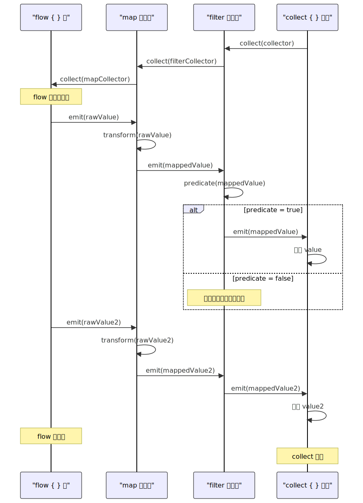

# Kotlin Flow 深度解析

> 本文深入剖析 Kotlin Flow 的设计与实现，涵盖冷流/热流原理、操作符机制、背压策略和 Android 实战。建议先阅读 [Kotlin协程原理](Kotlin协程原理.md) 了解挂起函数和调度器基础。

---

## 一、概述

### 1.1 Flow 的定位

Flow 是 Kotlin 协程生态中的**异步数据流**抽象，用于处理**按时间顺序产生的多个值**。

| 场景 | 适合的抽象 |
|------|-----------|
| 一次性异步操作（如网络请求） | `suspend` 函数 |
| 持续产生多个值的数据流（如数据库监听、传感器数据、UI 事件） | `Flow` |

**设计哲学**：Flow 借鉴了 RxJava 的响应式理念，但完全构建在协程之上，享受结构化并发的全部好处（作用域绑定、自动取消、异常传播）。

### 1.2 与 RxJava、LiveData 的关系

| 维度 | RxJava | LiveData | Kotlin Flow |
|------|--------|----------|-------------|
| **定位** | 通用响应式框架 | Android 生命周期感知数据持有者 | 协程生态的异步数据流 |
| **冷/热** | 冷流（Observable）+ 热流（Subject） | 热流（始终持有最新值） | 冷流（flow）+ 热流（StateFlow/SharedFlow） |
| **线程切换** | `subscribeOn` / `observeOn` | 自动主线程观察 | `flowOn`（上游）/ `collect` 在当前协程 |
| **背压** | Flowable 支持 | 不支持（总是最新值） | `buffer` / `conflate` / `collectLatest` |
| **取消** | Disposable 手动管理 | Lifecycle 自动管理 | 结构化并发自动管理 |
| **学习曲线** | 高（大量操作符） | 低 | 中 |
| **依赖体积** | 大（2MB+） | 小（Jetpack 内置） | 小（协程库内置） |
| **官方推荐** | 不再推荐新项目使用 | ViewModel → UI 层仍可用 | **首选数据流方案** |

> Google 的官方立场：**新项目用 Flow 替代 RxJava**；LiveData 可在简单场景继续使用，但复杂数据流推荐 StateFlow。

---

## 二、冷流原理

### 2.1 Flow 接口

Flow 的核心接口极其简单：

```kotlin
public interface Flow<out T> {
    public suspend fun collect(collector: FlowCollector<T>)
}

public fun interface FlowCollector<in T> {
    public suspend fun emit(value: T)
}
```

整个 Flow 体系就建立在这两个接口上：

- `Flow<T>`：数据流，定义了如何产生值
- `FlowCollector<T>`：收集器，定义了如何消费值
- `collect` 是唯一的末端操作 —— 触发 Flow 的执行

### 2.2 冷流的本质 — "惰性代码块"

`flow { }` 创建的是冷流：**代码不会在创建时执行，而是在每次 `collect` 时重新执行**。

```kotlin
val numbersFlow = flow {
    println("Flow started")
    emit(1)
    delay(100)
    emit(2)
    delay(100)
    emit(3)
}

// 什么都不会打印 — Flow 尚未执行

numbersFlow.collect { value ->
    println("Got $value")
}
// 输出：Flow started, Got 1, Got 2, Got 3

numbersFlow.collect { value ->
    println("Again $value")
}
// 输出：Flow started, Again 1, Again 2, Again 3
// 注意：每次 collect 都重新执行 flow 块！
```

**底层实现**：`flow { }` 构建器创建了一个 `SafeFlow` 对象，它持有 lambda（`block`），`collect` 时在内部调用 `block(collector)`：

```kotlin
// kotlinx.coroutines 源码（简化）
private class SafeFlow<T>(
    private val block: suspend FlowCollector<T>.() -> Unit
) : AbstractFlow<T>() {
    override suspend fun collectSafely(collector: FlowCollector<T>) {
        collector.block()  // 每次 collect 都重新执行 block
    }
}
```

> **冷流的类比**：Flow 就像一个函数定义 —— 定义本身不执行任何操作，每次调用（collect）才执行。这与 RxJava 的 `Observable.create` 是同样的冷流语义。

### 2.3 上下文保持规则（Context Preservation）

Flow 有一个重要的**不变性约束**：`flow { }` 内部的代码**必须在调用 `collect` 的协程上下文中执行**，不允许在内部切换 CoroutineContext。

```kotlin
// 错误！会抛出 IllegalStateException
flow {
    withContext(Dispatchers.IO) {  // 违反上下文保持规则！
        emit(fetchFromNetwork())
    }
}

// 正确做法：使用 flowOn 切换上游上下文
flow {
    emit(fetchFromNetwork())
}.flowOn(Dispatchers.IO)  // 合法：flowOn 负责上游的上下文切换
```

**为什么有这个限制？** 如果允许 `flow` 块内部切换上下文，`emit` 可能在不同的线程上调用，导致收集器的线程安全问题。`flowOn` 通过引入中间 Channel 来安全地桥接不同的上下文。

### 2.4 其他冷流构建器

| 构建器 | 用途 | 示例 |
|--------|------|------|
| `flowOf(vararg values)` | 从固定值创建 Flow | `flowOf(1, 2, 3)` |
| `asFlow()` | 从集合/序列/范围转换 | `(1..10).asFlow()` |
| `channelFlow { }` | 允许多协程并发发射值 | 内部可以 `launch { send(value) }` |
| `callbackFlow { }` | 将回调 API 转换为 Flow | 封装 Listener、BroadcastReceiver 等 |

**`channelFlow` vs `flow`**：

`flow` 中 `emit` 是顺序的，不能在新协程中调用。`channelFlow` 使用 Channel 作为中间缓冲，允许多个协程并发发射：

```kotlin
// 并行请求多个数据源，合并为一个 Flow
channelFlow {
    launch { send(fetchFromApi1()) }
    launch { send(fetchFromApi2()) }
    launch { send(fetchFromApi3()) }
}
```

**`callbackFlow` — 桥接回调 API**：

```kotlin
fun locationUpdates(): Flow<Location> = callbackFlow {
    val callback = object : LocationCallback() {
        override fun onLocationResult(result: LocationResult) {
            trySend(result.lastLocation)  // 非挂起版本的 send
        }
    }
    
    locationClient.requestLocationUpdates(request, callback, Looper.getMainLooper())
    
    awaitClose {  // 必须调用！Flow 收集结束时清理资源
        locationClient.removeLocationUpdates(callback)
    }
}
```

> `callbackFlow` 内部必须调用 `awaitClose { }` 来注册清理逻辑，否则 Flow 会立即完成。

---

## 三、操作符实现原理



### 3.1 操作符分类

| 类型 | 特征 | 示例 |
|------|------|------|
| **中间操作符** | 返回新 Flow，惰性的，不触发执行 | `map`、`filter`、`flatMapConcat`、`take`、`distinctUntilChanged` |
| **末端操作符** | 触发 Flow 执行，返回结果 | `collect`、`toList`、`first`、`reduce`、`launchIn` |

### 3.2 中间操作符的实现 — 套娃结构

中间操作符的本质是**创建一个新的 Flow，在它的 `collect` 中收集上游 Flow 并进行变换**：

```kotlin
// map 操作符的源码实现（简化）
public fun <T, R> Flow<T>.map(transform: suspend (T) -> R): Flow<R> = flow {
    collect { value ->           // 收集上游的每个值
        emit(transform(value))   // 变换后重新发射
    }
}

// filter 操作符
public fun <T> Flow<T>.filter(predicate: suspend (T) -> Boolean): Flow<T> = flow {
    collect { value ->
        if (predicate(value)) {
            emit(value)
        }
    }
}
```

**链式调用的执行过程**（以 `source.map { }.filter { }.collect { }` 为例）：

```
collect 触发 filter 的 collect
    └── filter 的 collect 触发 map 的 collect
            └── map 的 collect 触发 source 的 collect
                    └── source emit(value)
                            └── map 的 collector: emit(transform(value))
                                    └── filter 的 collector: if (predicate) emit(value)
                                            └── 最终 collector: 处理 value
```

> 操作符链是**由内向外展开**的：最终的 `collect` 层层向上触发，数据从最上游向下游传递。每个操作符之间完全是同步的函数调用链（在同一个协程中），没有额外的线程切换。

### 3.3 flatMap 系列 — 平展与并发控制

| 操作符 | 行为 | 并发 |
|--------|------|------|
| `flatMapConcat` | 按顺序依次收集内部 Flow | 无并发（串行） |
| `flatMapMerge` | 并发收集内部 Flow | 并发（默认 16） |
| `flatMapLatest` | 新值到来时取消正在进行的内部 Flow | 始终只有最新的 |

```kotlin
// 搜索框场景：用户输入 → 发起搜索
// flatMapLatest 确保每次新输入到来时取消上一次搜索
searchQueryFlow
    .debounce(300)
    .flatMapLatest { query ->
        if (query.isEmpty()) flowOf(emptyList())
        else searchRepository.search(query)  // 返回 Flow<List<Result>>
    }
    .collect { results -> updateUI(results) }
```

### 3.4 常用操作符速查表

| 操作符 | 作用 | 对标 RxJava |
|--------|------|------------|
| `map` | 变换每个值 | `map` |
| `filter` | 过滤值 | `filter` |
| `take(n)` | 只取前 n 个值 | `take` |
| `drop(n)` | 跳过前 n 个值 | `skip` |
| `distinctUntilChanged` | 去除连续重复值 | `distinctUntilChanged` |
| `debounce(ms)` | 防抖，指定时间内无新值才发射 | `debounce` |
| `combine` | 合并多个 Flow，任一更新则重新计算 | `combineLatest` |
| `zip` | 一对一配对合并 | `zip` |
| `onEach` | 副作用（日志/统计），不改变值 | `doOnNext` |
| `catch` | 捕获上游异常 | `onErrorResumeNext` |
| `onCompletion` | Flow 完成或异常时回调 | `doOnTerminate` |
| `retry(n)` | 异常时重试 | `retry` |
| `scan` | 带累加器的 map，发射每个中间结果 | `scan` |

---

## 四、背压与缓冲策略

### 4.1 背压问题

当**生产者发射速度 > 消费者处理速度**时，就产生了背压（Backpressure）：

```kotlin
flow {
    repeat(100) {
        emit(it)               // 快速产生数据
        println("Emit $it")
    }
}.collect { value ->
    delay(100)                 // 慢速处理
    println("Process $value")
}
// 默认行为：按顺序执行，emit 等待 collect 处理完再继续
// 总耗时 ≈ 100 * 100ms = 10秒（串行！）
```

**默认情况下 Flow 没有背压问题** —— 因为 `emit` 和 `collect` 运行在同一个协程中，`emit` 会挂起直到 `collect` 处理完当前值。但这也意味着**生产和消费是串行的**，可能造成效率低下。

### 4.2 buffer — 并发生产与消费

`buffer()` 在生产者和消费者之间引入一个 Channel 缓冲，让两者在**不同的协程**中并发执行：

```kotlin
flow {
    repeat(100) {
        emit(it)
        println("Emit $it")
    }
}.buffer(capacity = 64)      // 引入缓冲区
 .collect { value ->
    delay(100)
    println("Process $value")
}
// emit 不再等待 collect，两者并发执行
// 总耗时 ≈ 100 * 100ms ≈ 10秒（但 emit 几乎瞬间完成）
```

**`buffer` 的底层原理**：

```
生产者协程                Channel 缓冲区              消费者协程
   │                    ┌──────────┐                  │
   │── emit(1) ──────→  │ [1]      │  ──── collect ──→│ process(1)
   │── emit(2) ──────→  │ [2, 3]   │                  │ delay(100)
   │── emit(3) ──────→  │ [3]      │  ──── collect ──→│ process(2)
   │   ...               │          │                  │   ...
```

1. `buffer()` 在内部创建一个 `ChannelFlowOperator`
2. 上游 Flow 在独立的协程中执行 `emit`，值被发送到 Channel
3. 下游 `collect` 从 Channel 中接收值并处理
4. 缓冲区满时，`emit` 挂起等待消费者腾出空间

### 4.3 conflate — 只保留最新值

当消费者来不及处理时，丢弃中间值，**只保留最新的**：

```kotlin
flow {
    repeat(100) { emit(it) }
}.conflate()              // 消费者处理不过来时，跳过中间值
 .collect { value ->
    delay(100)
    println("Process $value")
}
// 可能输出：Process 0, Process 63, Process 99 ...（中间值被跳过）
```

`conflate()` 等效于 `buffer(capacity = Channel.CONFLATED)` —— 缓冲区大小为 1，新值覆盖旧值。

### 4.4 collectLatest — 取消旧的处理

当新值到来时，**取消当前正在处理的 collect 块**，用新值重新开始：

```kotlin
flow {
    emit("A")
    delay(100)
    emit("B")
    delay(100)
    emit("C")
}.collectLatest { value ->
    println("Start $value")
    delay(200)             // 模拟耗时处理
    println("Done $value") // 只有最后一个值能执行到这里
}
// 输出：Start A, Start B, Start C, Done C
// A 和 B 的处理被取消了，只有 C 完成
```

**适用场景**：搜索框输入 → 实时搜索。每次新输入到来，取消上一次搜索操作。

### 4.5 策略对比

| 策略 | 行为 | 丢数据 | 典型场景 |
|------|------|--------|---------|
| 无策略（默认） | 串行执行，生产等待消费 | 不丢 | 数据完整性要求高 |
| `buffer(n)` | 并发执行，缓冲区满时挂起 | 不丢 | 提高吞吐量，生产消费速度接近 |
| `conflate()` | 只保留最新值 | 丢中间值 | 传感器数据、进度更新 |
| `collectLatest` | 新值取消旧处理 | 取消旧处理 | 搜索、UI 更新 |

### 4.6 flowOn — 切换上游执行上下文

`flowOn` 改变的是上游（它之前的操作符）的 CoroutineContext：

```kotlin
flow {
    // 在 Dispatchers.IO 上执行
    emit(readFromDisk())
}
.map { data ->
    // 也在 Dispatchers.IO 上执行（在 flowOn 之前）
    parseData(data)
}
.flowOn(Dispatchers.IO)     // ← 只影响上游
.filter { item ->
    // 在 collect 所在的协程上下文执行
    item.isValid()
}
.collect { item ->
    // 在 collect 所在的协程上下文执行（通常是主线程）
    updateUI(item)
}
```

**`flowOn` 的原理**：在内部创建一个 Channel，上游在指定 Dispatcher 的协程中执行并发射值到 Channel，下游从 Channel 中接收。这就是为什么 `flowOn` 不违反上下文保持规则 —— 它通过 Channel 隔离了不同上下文。

> **多个 `flowOn`**：每个 `flowOn` 只影响从它到上一个 `flowOn`（或源头）之间的操作符。可以在一条链上使用多个 `flowOn` 为不同段指定不同的 Dispatcher。

---

## 五、热流 — StateFlow 与 SharedFlow



### 5.1 冷流 vs 热流

| 维度 | 冷流（`flow { }`） | 热流（StateFlow / SharedFlow） |
|------|-------------------|-------------------------------|
| **执行时机** | 每次 `collect` 时重新执行 | 独立于收集者，持续活跃 |
| **收集者关系** | 一对一（每个 collector 独立执行） | 一对多（多个 collector 共享同一个源） |
| **有无状态** | 无状态 | 有状态（持有当前值 / 缓存历史值） |
| **典型用途** | 一次性数据转换链 | ViewModel → UI 的状态传递 |

### 5.2 StateFlow — 状态容器

`StateFlow` 是一个特殊的热流，**始终持有一个当前值**，新收集者立即获得最新值：

```kotlin
class SearchViewModel : ViewModel() {
    // 内部用 MutableStateFlow
    private val _uiState = MutableStateFlow(SearchUiState())
    // 对外暴露只读 StateFlow
    val uiState: StateFlow<SearchUiState> = _uiState.asStateFlow()
    
    fun search(query: String) {
        viewModelScope.launch {
            _uiState.value = _uiState.value.copy(isLoading = true)
            val results = repository.search(query)
            _uiState.value = _uiState.value.copy(
                isLoading = false, results = results
            )
        }
    }
}
```

**StateFlow 的核心特性**：

| 特性 | 说明 |
|------|------|
| **始终有值** | 创建时必须提供初始值，`value` 永远非 null |
| **去重** | 连续 emit 相同的值（`equals` 判断），只发射一次 |
| **confluent** | 只保留最新值，慢速消费者自动跳过中间值 |
| **replay = 1** | 新收集者立即获得当前最新值 |

**StateFlow vs LiveData**：

| | StateFlow | LiveData |
|---|---|---|
| 初始值 | **必须有** | 可以没有 |
| 空安全 | 泛型 `T`（可为非空类型） | `T?`（总是可空） |
| 生命周期感知 | 不感知（需配合 `repeatOnLifecycle`） | 自动感知 |
| 多观察者 | 天然支持 | 天然支持 |
| 线程安全 | `value` 的写入是原子的 | `setValue` 必须主线程 |
| 去重 | **内置**（`distinctUntilChanged`） | 不去重 |

### 5.3 SharedFlow — 通用广播流

`SharedFlow` 比 `StateFlow` 更灵活，适合**事件广播**（不需要持有"当前状态"的场景）：

```kotlin
class EventBus {
    private val _events = MutableSharedFlow<AppEvent>(
        replay = 0,           // 不缓存历史事件
        extraBufferCapacity = 64,
        onBufferOverflow = BufferOverflow.DROP_OLDEST
    )
    val events: SharedFlow<AppEvent> = _events.asSharedFlow()
    
    suspend fun emit(event: AppEvent) {
        _events.emit(event)
    }
}
```

**SharedFlow 配置参数**：

| 参数 | 说明 | 默认值 |
|------|------|--------|
| `replay` | 新收集者收到的历史值数量 | 0 |
| `extraBufferCapacity` | 额外缓冲区大小（在 replay 之外） | 0 |
| `onBufferOverflow` | 缓冲区溢出策略 | `SUSPEND`（挂起等待） |

**缓冲区总大小 = `replay` + `extraBufferCapacity`**

| 溢出策略 | 行为 |
|---------|------|
| `BufferOverflow.SUSPEND` | emit 挂起等待消费者 |
| `BufferOverflow.DROP_OLDEST` | 丢弃最旧的值 |
| `BufferOverflow.DROP_LATEST` | 丢弃最新的值（当前要 emit 的） |

### 5.4 StateFlow 就是特殊的 SharedFlow

`StateFlow` 本质上等价于：

```kotlin
// StateFlow 的等效 SharedFlow 配置
MutableSharedFlow<T>(
    replay = 1,                              // 始终缓存最新值
    onBufferOverflow = BufferOverflow.DROP_OLDEST  // 新值覆盖旧值
).also { it.tryEmit(initialValue) }          // 带初始值
// + distinctUntilChanged()                   // 去重
```

### 5.5 一次性事件：SharedFlow vs Channel

处理"一次性事件"（如 Toast、导航、Snackbar）是一个常见场景：

| 方案 | 特点 | 问题 |
|------|------|------|
| `SharedFlow(replay=0)` | 多观察者各收一份 | 没有观察者时事件丢失 |
| `Channel(BUFFERED)` | 缓冲区保证不丢失，但只有一个消费者收到 | 多观察者只有一个收到 |
| `SharedFlow(replay=0, extraBufferCapacity=1)` + `tryEmit` | 缓冲区避免挂起 | 仍然存在没有观察者时丢失的问题 |

> **Android 官方建议**：对于 ViewModel 的一次性 UI 事件，推荐将事件建模为**状态的一部分**（如 `data class UiState(val userMessage: String? = null)`），而非使用事件流。UI 消费事件后调用 ViewModel 方法清除（`clearMessage()`）。这样即使配置变更也不会丢失事件。

---

## 六、Flow 异常处理与完成回调

### 6.1 catch — 捕获上游异常

`catch` 操作符只能捕获**上游**的异常，不能捕获下游（`collect` 块）中的异常：

```kotlin
flow {
    emit(1)
    throw RuntimeException("上游异常")
}
.catch { e ->
    // 捕获上游异常，可以发射兜底值
    emit(-1)
}
.collect { value ->
    println(value)  // 输出：1, -1
    // 这里的异常不会被上面的 catch 捕获！
}
```

**`catch` 的位置很重要**：

```kotlin
// catch 只捕获它上游的异常
flow { emit(1) }
    .map { it / 0 }       // 上游异常！
    .catch { emit(-1) }   // 能捕获 map 中的异常
    .collect { ... }

// 但不能捕获 collect 中的异常
flow { emit(1) }
    .catch { emit(-1) }   // 这个 catch 位于 collect 上游
    .collect {
        throw RuntimeException()  // 不会被 catch 捕获
    }
```

### 6.2 onCompletion — 完成与异常的统一回调

```kotlin
flow {
    emit(1)
    emit(2)
}
.onCompletion { cause ->
    if (cause != null) {
        println("Flow completed with exception: $cause")
    } else {
        println("Flow completed normally")
    }
}
.collect { println(it) }
```

`onCompletion` 类似 `try-finally` 中的 `finally` —— 无论正常完成还是异常，都会执行。但它**不会吞掉异常**，异常仍然会继续传播。

### 6.3 retry 与 retryWhen

```kotlin
// 简单重试
flow { emit(fetchFromNetwork()) }
    .retry(3) { cause ->
        cause is IOException  // 只重试 IO 异常
    }
    .collect { ... }

// 带延迟的指数退避重试
flow { emit(fetchFromNetwork()) }
    .retryWhen { cause, attempt ->
        if (cause is IOException && attempt < 3) {
            delay(1000L * (attempt + 1))  // 1s, 2s, 3s
            true  // 继续重试
        } else {
            false // 不再重试，异常向下传播
        }
    }
    .collect { ... }
```

---

## 七、Android 实战最佳实践

### 7.1 安全收集 Flow — repeatOnLifecycle

在 Activity/Fragment 中收集 Flow 必须感知生命周期，否则后台仍在收集造成资源浪费：

```kotlin
class UserActivity : AppCompatActivity() {
    override fun onCreate(savedInstanceState: Bundle?) {
        super.onCreate(savedInstanceState)
        
        // 正确做法：STARTED 时收集，STOPPED 时自动取消
        lifecycleScope.launch {
            repeatOnLifecycle(Lifecycle.State.STARTED) {
                // 可以在这里启动多个并发收集
                launch {
                    viewModel.uiState.collect { state -> updateUI(state) }
                }
                launch {
                    viewModel.events.collect { event -> handleEvent(event) }
                }
            }
        }
    }
}
```

### 7.2 Compose 中的 Flow 收集

```kotlin
@Composable
fun UserScreen(viewModel: UserViewModel) {
    // collectAsStateWithLifecycle：生命周期感知 + 自动转为 Compose State
    val uiState by viewModel.uiState.collectAsStateWithLifecycle()
    
    // 基于 state 渲染 UI
    when (val state = uiState) {
        is Loading -> CircularProgressIndicator()
        is Success -> UserContent(state.data)
        is Error -> ErrorMessage(state.message)
    }
}
```

> `collectAsStateWithLifecycle()` 来自 `androidx.lifecycle:lifecycle-runtime-compose`，是 Compose 中收集 Flow 的推荐方式。它底层使用 `repeatOnLifecycle`。

### 7.3 典型架构中的 Flow 使用模式

```
 数据源 (Room/Retrofit)           Repository              ViewModel              UI
┌─────────────────────┐    ┌──────────────────┐    ┌──────────────────┐    ┌──────────┐
│ Room DAO             │    │                  │    │                  │    │          │
│ @Query("SELECT ...") │    │  combine(        │    │ _uiState =       │    │ collect  │
│ fun getUsers():      │──→ │    usersFlow,    │──→ │   repository     │──→ │ AsState  │
│   Flow<List<User>>   │    │    settingsFlow  │    │   .getUserData() │    │ WithLife │
│                      │    │  )               │    │   .stateIn(...)  │    │ cycle()  │
└─────────────────────┘    └──────────────────┘    └──────────────────┘    └──────────┘
         冷流                     冷流变换                热流（StateFlow）        UI 消费
```

**关键变换 — `stateIn`**：将冷流转换为 StateFlow，控制共享和缓存策略

```kotlin
class UserRepository(private val dao: UserDao) {
    fun getUserData(): Flow<UserData> = combine(
        dao.getUsers(),
        settingsStore.data
    ) { users, settings ->
        UserData(users, settings)
    }
}

class UserViewModel(private val repository: UserRepository) : ViewModel() {
    val uiState: StateFlow<UiState> = repository.getUserData()
        .map { data -> UiState.Success(data) }
        .catch { emit(UiState.Error(it.message)) }
        .stateIn(
            scope = viewModelScope,
            started = SharingStarted.WhileSubscribed(5000),  // 5秒无订阅者停止
            initialValue = UiState.Loading
        )
}
```

### 7.4 stateIn 的 SharingStarted 策略

| 策略 | 行为 | 适用场景 |
|------|------|---------|
| `Eagerly` | 立即开始收集，永不停止 | 始终需要最新数据 |
| `Lazily` | 第一个收集者出现时开始，永不停止 | 按需启动，但之后保持活跃 |
| `WhileSubscribed(stopTimeout)` | 最后一个收集者消失后等待 timeout 再停止 | **推荐**：配置变更时保持活跃 |

> `WhileSubscribed(5000)` 的 5 秒超时是为了应对**屏幕旋转**：旋转导致 Activity 销毁重建，短暂没有收集者。5 秒足够覆盖旋转过程，避免不必要的重新请求。

### 7.5 常见陷阱

| 陷阱 | 说明 | 正确做法 |
|------|------|---------|
| `lifecycleScope.launch { flow.collect {} }` | 后台仍在收集 | `repeatOnLifecycle(STARTED)` |
| `flow { withContext(IO) { emit(x) } }` | 违反上下文保持规则 | 使用 `flowOn(IO)` |
| 在 `flow {}` 的新协程中 `emit` | emit 不是线程安全的 | 使用 `channelFlow` + `send` |
| `StateFlow` 使用可变对象 | 去重基于 `equals`，同一对象修改后不触发更新 | 使用 data class + `copy()` |
| `stateIn` 不指定 `WhileSubscribed` | 使用 `Eagerly` 导致 ViewModel 清除后仍在运行 | 用 `WhileSubscribed(5000)` |
| `combine` 大量 Flow | N 个 Flow 任一更新都触发重算 | 考虑 `flatMapLatest` 或拆分 |

---

## 八、常见面试题与解答

### Q1：Flow 的冷流和热流有什么区别？举例说明。

**答**：

**冷流**（`flow { }`）的代码在每次 `collect` 时重新执行，每个收集者都是独立的。类比"点播视频" —— 每个观众从头开始看。

**热流**（`StateFlow` / `SharedFlow`）独立于收集者而存在，多个收集者共享同一个数据源。类比"直播" —— 所有观众看到同样的实时画面。

- `StateFlow` 始终持有最新值，新收集者立即获得（replay=1，去重）
- `SharedFlow` 更灵活，可配置 replay 数量、缓冲策略

实际使用中，数据源层（Room、Retrofit）产出冷流，ViewModel 层通过 `stateIn` / `shareIn` 将冷流转换为热流暴露给 UI。

---

### Q2：flowOn 和 withContext 都能切换 Dispatcher，有什么区别？

**答**：

- **`flowOn`** 切换的是 Flow **上游操作符**的执行上下文。它通过在内部引入 Channel 来隔离上下游的 CoroutineContext。
- **`withContext`** 不能在 `flow { }` 构建器内部使用（会违反上下文保持规则，抛出 `IllegalStateException`）

原因：`flow` 构建器要求 emit 和 collect 在同一个 CoroutineContext 中执行，以保证线程安全。`flowOn` 通过 Channel 桥接解决了这个问题，而 `withContext` 会直接改变当前协程的 Context，破坏了这个保证。

如果是在 `channelFlow` 或 `callbackFlow` 中，可以使用 `withContext`，因为它们内部通过 Channel 发送值（`send`），天然支持跨上下文。

---

### Q3：StateFlow 的去重机制是什么？如何处理可变对象？

**答**：

StateFlow 使用 `Any.equals()` 进行去重 —— 如果新值与当前值 `equals` 相等，不会通知收集者。

**可变对象的陷阱**：如果使用同一个可变对象修改属性后再赋值给 `StateFlow.value`，由于引用未变、`equals` 可能返回 `true`（或即使 `equals` 返回 `false`，对象被共享可能导致竞态），UI 不会更新。

```kotlin
// 错误
val list = mutableListOf(1, 2, 3)
_state.value = list
list.add(4)          // 修改了同一个对象
_state.value = list  // 引用相同，可能不触发更新

// 正确：使用不可变 data class + copy()
_state.value = _state.value.copy(items = _state.value.items + newItem)
```

---

### Q4：buffer、conflate 和 collectLatest 分别适合什么场景？

**答**：

三者解决的都是"生产快于消费"的问题，但策略不同：

- **`buffer(n)`**：生产消费并发执行，缓冲区满时生产者挂起。**不丢数据**，适合数据完整性要求高的场景（如日志收集、消息队列）。
- **`conflate()`**：只保留最新值，丢弃中间值。适合**只关心最新状态**的场景（如传感器数据、进度百分比显示）。
- **`collectLatest`**：新值到来时取消当前处理中的旧值。适合**搜索框实时搜索** —— 用户快速输入多个字符，只需要处理最新的查询。

选择原则：数据不能丢用 `buffer`，只要最新值用 `conflate`，最新值且要取消旧处理用 `collectLatest`。

---

### Q5：combine 和 zip 有什么区别？

**答**：

|  | `combine` | `zip` |
|--|-----------|-------|
| 配对方式 | 任一 Flow 发射新值，与其他 Flow 的**最新值**组合 | 严格一对一配对（第1个配第1个，第2个配第2个） |
| 完成条件 | 所有 Flow 都完成 | **任一** Flow 完成 |
| 类比 | `combineLatest`（RxJava） | `zip`（RxJava） |
| 适用场景 | 多个独立状态源合并为一个 UI 状态 | 两个一一对应的数据源配对 |

```kotlin
// combine：搜索关键词 + 排序方式 → 任一变化都重新筛选
combine(searchQuery, sortOrder) { query, sort ->
    repository.search(query, sort)
}

// zip：用户列表 + 对应的头像列表 → 一一配对
users.zip(avatars) { user, avatar ->
    UserWithAvatar(user, avatar)
}
```

---

### Q6：catch 操作符只能捕获上游异常，那 collect 中的异常怎么处理？

**答**：

`catch` 只拦截它上游（之前）的异常。对于 `collect` 块中的异常，有两种处理方式：

1. **在 `collect` 内部用 `try-catch`**（最直接）：
```kotlin
flow.collect { value ->
    try { riskyOperation(value) }
    catch (e: IOException) { handleError(e) }
}
```

2. **将 `collect` 的逻辑移到 `onEach` 中**，然后通过 `catch` 统一处理：
```kotlin
flow
    .onEach { value -> riskyOperation(value) }  // 现在这是"上游"
    .catch { e -> handleError(e) }               // 可以捕获了
    .collect()                                    // 空 collect
```

第二种方式更函数式，适合 `launchIn` 的写法。

---

### Q7：callbackFlow 和 channelFlow 有什么区别？各自适合什么场景？

**答**：

两者底层都使用 Channel 来发射值，但设计意图不同：

| | `channelFlow` | `callbackFlow` |
|--|--------------|----------------|
| 设计目的 | 允许多协程并发发射 | 桥接基于回调的 API |
| `awaitClose` | 可选 | **必须调用**（否则 Flow 立即完成） |
| 发射方式 | `send()`（挂起） | `trySend()`（非挂起，回调中使用）+ `send()` |
| 典型数据源 | 并行 API 请求合并 | Listener / BroadcastReceiver / WebSocket |

核心区别在于 `callbackFlow` 强制要求 `awaitClose`，确保回调注册的资源在 Flow 取消时被正确清理。

---

### Q8：stateIn 和 shareIn 分别什么时候用？WhileSubscribed(5000) 的 5 秒是什么含义？

**答**：

- **`stateIn`**：将冷流转换为 `StateFlow`（始终有值、去重、replay=1）。适合 ViewModel → UI 的状态暴露。
- **`shareIn`**：将冷流转换为 `SharedFlow`（可配置 replay、不强制持有值）。适合事件流、多订阅者共享同一个上游（如多个 Fragment 共享同一个数据流）。

`WhileSubscribed(5000)` 的含义：最后一个收集者取消后，**等待 5 秒再停止上游 Flow**。这个超时专门为**屏幕旋转**设计 —— 旋转时 Activity 销毁重建，短暂没有收集者。5 秒足够覆盖重建过程，避免不必要地重新触发数据请求。如果是真正离开页面（按返回键），ViewModel 被清除、Scope 取消，上游自然停止。

---

### Q9：LiveData 还有必要用吗？什么场景下 StateFlow 可以替代 LiveData？

**答**：

**StateFlow 几乎可以完全替代 LiveData**。Google 也推荐新代码使用 StateFlow。

但 LiveData 在以下场景仍有一点优势：

- **极简场景**：如果只需要在 ViewModel 持有一个状态并通知 UI，LiveData 的 `observe` 自动绑定 Lifecycle，不需要 `repeatOnLifecycle`
- **Java 项目**：LiveData 的 API 更适合 Java 代码

**StateFlow 的优势**：

- 可以使用 Flow 的全部操作符（`map`、`combine`、`debounce` 等）
- 线程安全的 `value` 写入（LiveData 的 `setValue` 必须在主线程）
- 内置去重（LiveData 不去重）
- 强制非空初始值（避免 LiveData 的 `value: T?` 可空问题）
- 与 Compose 的 `collectAsStateWithLifecycle()` 集成更自然

> **迁移建议**：新功能用 StateFlow，旧代码逐步迁移。不需要一次性全部替换。

---

### Q10：Flow 操作符链的性能如何？会不会因为"套娃"而有性能问题？

**答**：

Flow 操作符链的性能**非常好**，在大多数场景下不构成瓶颈：

1. **零分配**：中间操作符只创建了一个新 Flow 对象（lambda 引用），实际执行时是直接的函数调用链，没有装箱/拆箱
2. **同一协程内执行**：整个操作符链在同一个协程中按顺序执行（除非使用 `buffer()` / `flowOn()` 等），没有线程切换开销
3. **无中间集合**：不像 `List.map { }.filter { }` 会创建中间列表，Flow 的操作符是逐元素传递的（类似 Kotlin `Sequence`）

**可能的性能陷阱**：
- `flowOn` 和 `buffer` 会引入 Channel，增加上下文切换和内存分配
- `combine` 合并大量 Flow 时，任一 Flow 更新都触发重算
- `SharedFlow` 的 replay 缓冲区过大导致内存占用

> 实际开发中，Flow 本身的开销远小于网络请求、数据库查询等 IO 操作，可以放心使用操作符链。

