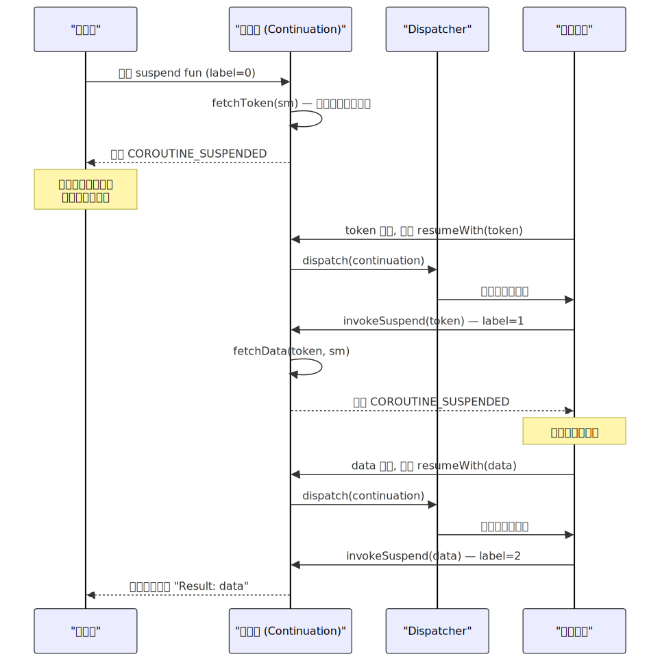

# Kotlin 协程原理

> 本文从源码级别剖析 Kotlin 协程的设计与实现。已有 [并发编程与线程安全](并发编程与线程安全.md) 覆盖了协程的基础概念和调度器对比表，本文在此基础上深入底层机制。

---

## 一、概述

### 1.1 协程的设计动机

Android 异步编程经历了三代演变：

| 时代 | 方案 | 痛点 |
|------|------|------|
| 回调时代 | Thread + Handler / AsyncTask | 回调地狱（Callback Hell）、生命周期泄漏 |
| 响应式时代 | RxJava | 操作符学习成本高、链式调用调试困难、Disposable 管理繁琐 |
| 协程时代 | Kotlin Coroutines | 以同步风格写异步代码、结构化并发自动管理生命周期 |

Google 在 2019 年将协程定为 **Android 官方推荐的异步方案**，核心理由：

1. **代码可读性**：`suspend` 函数让异步逻辑看起来像同步顺序执行
2. **结构化并发**：协程绑定 Scope，Scope 销毁自动取消所有子协程，从根本上解决"页面销毁后台任务还在跑"
3. **与 Jetpack 深度集成**：`viewModelScope`、`lifecycleScope`、`repeatOnLifecycle` 等一等公民支持

### 1.2 协程的本质

> 协程 **不是** 轻量级线程。协程是**编译器变换 + 调度框架**的组合 —— 编译器将 `suspend` 函数变换为状态机，运行时调度框架在合适的线程上恢复执行。

**两个关键层面：**

- **编译期**：Kotlin 编译器将挂起函数通过 **CPS（Continuation Passing Style）变换** 转化为状态机
- **运行时**：`kotlinx.coroutines` 库提供 CoroutineScope、Dispatcher、Job 等调度和生命周期管理能力

协程在 JVM 上并不创建新的执行单元（不像 Java 虚拟线程）。`Dispatchers.IO` 底层仍是线程池，`Dispatchers.Main` 底层是 `Handler.post()`。"轻量级"体现在**调度层面** —— 一个线程可以运行成千上万个协程，通过挂起/恢复切换而非线程上下文切换。

---

## 二、挂起函数的本质

这是理解协程最核心的章节。掌握了挂起函数的编译原理，所有上层 API 的行为都能推导出来。



### 2.1 Continuation 接口

`Continuation` 是挂起函数的核心抽象，定义在 Kotlin 标准库中：

```kotlin
// kotlin.coroutines.Continuation
public interface Continuation<in T> {
    public val context: CoroutineContext
    public fun resumeWith(result: Result<T>)
}
```

- `context`：当前协程的上下文（包含调度器、Job 等）
- `resumeWith(result)`：恢复协程执行，传入上一次挂起点的返回值（或异常）

> **Continuation 就是"续体"**：它封装了挂起点之后的所有剩余代码。调用 `resumeWith` 就是告诉协程"挂起点的结果拿到了，继续执行"。

### 2.2 CPS 变换

编译器对 `suspend` 函数做的核心变换：**在参数列表末尾追加一个 `Continuation` 参数**。

```kotlin
// 源码
suspend fun fetchUser(id: Int): User { ... }

// 编译后的 JVM 签名（伪代码）
fun fetchUser(id: Int, cont: Continuation<User>): Any? { ... }
```

返回值变为 `Any?`，有两种可能：

| 返回值 | 含义 |
|--------|------|
| 实际结果（如 `User` 对象） | 函数没有真正挂起，同步返回了结果 |
| `COROUTINE_SUSPENDED` | 函数真正挂起了，结果将通过 `cont.resumeWith()` 异步回传 |

这个设计允许运行时**按需挂起** —— 如果结果已经准备好（如缓存命中），可以直接返回而不触发线程切换。

### 2.3 状态机反编译分析

下面通过一个实际例子展示编译器的状态机生成过程：

```kotlin
suspend fun loadData(): String {
    val token = fetchToken()       // 挂起点 1
    val data = fetchData(token)    // 挂起点 2
    return "Result: $data"
}
```

编译器将其变换为以下状态机（等效伪代码）：

```java
// 编译器生成的状态机（简化版）
fun loadData(cont: Continuation<String>): Any? {
    // 首次调用时，创建状态机对象；恢复时复用同一个对象
    val sm = cont as? LoadDataContinuation 
        ?: LoadDataContinuation(cont)
    
    when (sm.label) {
        0 -> {
            sm.label = 1  // 设置下一个状态
            val result = fetchToken(sm)  // 传入状态机自身作为续体
            if (result == COROUTINE_SUSPENDED) return COROUTINE_SUSPENDED
            // 没有真正挂起，直接继续
            sm.tokenResult = result as String
        }
        1 -> {
            sm.tokenResult = sm.result as String  // 从恢复结果中取值
            sm.label = 2
            val result = fetchData(sm.tokenResult, sm)
            if (result == COROUTINE_SUSPENDED) return COROUTINE_SUSPENDED
            sm.dataResult = result as String
        }
        2 -> {
            sm.dataResult = sm.result as String
            return "Result: ${sm.dataResult}"
        }
    }
    // 不可达，上面的 when 已经覆盖所有状态
}
```

**关键洞察：**

1. **每个挂起点对应一个 `label` 状态**：`n` 个挂起点生成 `n+1` 个状态
2. **状态机对象存储中间变量**：局部变量 `token`、`data` 被提升为状态机对象的字段，跨挂起点保持
3. **`COROUTINE_SUSPENDED` 是真正挂起的标记**：如果被调用的挂起函数返回了这个标记，当前函数也立即返回它，挂起向上传播
4. **同一个续体对象贯穿始终**：首次调用会创建 `LoadDataContinuation`，后续恢复时复用，通过 `label` 字段跳转到不同分支

### 2.4 suspendCoroutine 与 suspendCancellableCoroutine

这两个函数是将回调式 API 桥接为挂起函数的标准工具：

```kotlin
// 将回调 API 包装为挂起函数
suspend fun awaitCallback(): String = suspendCancellableCoroutine { cont ->
    someApi.request(
        onSuccess = { result -> cont.resume(result) },
        onError = { error -> cont.resumeWithException(error) }
    )
    
    // 协程被取消时，清理资源
    cont.invokeOnCancellation { someApi.cancel() }
}
```

**两者区别**：

| | `suspendCoroutine` | `suspendCancellableCoroutine` |
|---|---|---|
| 取消支持 | 不感知取消 | 支持 `invokeOnCancellation` 回调 |
| 使用场景 | 极少使用 | **Android 中几乎总是用这个** |
| 底层续体 | `SafeContinuation` | `CancellableContinuationImpl` |

> Retrofit 的 `await()` 扩展、Room 的挂起查询、`suspendCancellableCoroutine` 的 Lifecycle 集成，底层全都是 `suspendCancellableCoroutine`。

---

## 三、协程的创建与启动

### 3.1 CoroutineScope 设计哲学

`CoroutineScope` 本身极其简单：

```kotlin
public interface CoroutineScope {
    public val coroutineContext: CoroutineContext
}
```

它只是一个 `CoroutineContext` 的持有者。但这个简单接口承载了**结构化并发**的全部约束 —— 所有协程必须在一个 Scope 中启动，Scope 定义了协程的生命周期边界。

**为什么不让协程随意创建？** 非结构化的协程（如 `GlobalScope.launch`）就像非结构化 goto 语句：控制流难以追踪，资源难以回收。结构化并发确保**协程的生命周期被限定在 Scope 的生命周期之内**。

### 3.2 launch 与 async 的启动流程

`launch` 和 `async` 是两个最常用的协程构建器，核心区别在于返回值：

| 构建器 | 返回值 | 异常行为 | 使用场景 |
|--------|--------|---------|---------|
| `launch` | `Job` | 异常立即向上传播给父协程 | 发射"即发即忘"的协程（Fire-and-forget） |
| `async` | `Deferred<T>` | 异常封装到 `Deferred`，在 `await()` 时抛出 | 需要返回值的异步计算 |

**`launch` 的源码调用链**（简化）：

```
CoroutineScope.launch(context, start, block)
    │
    ├── newCoroutineContext(context)         // 合并 Scope 的 context 与参数 context
    │       → 如果没有指定 Dispatcher，继承 Scope 的
    │       → 如果没有指定 Job，自动创建新 Job 作为 Scope.Job 的子 Job
    │
    ├── new StandaloneCoroutine(newContext)  // 创建协程对象（也是 Job）
    │
    └── coroutine.start(start, coroutine, block)
            │
            ├── CoroutineStart.DEFAULT:
            │       → createCoroutineUnintercepted(receiver, completion)
            │       → intercepted()          // 被 Dispatcher 拦截
            │       → resumeCancellableWith(Result.success(Unit))
            │               → Dispatcher.dispatch()  // 调度到目标线程
            │
            └── CoroutineStart.LAZY:
                    → 不启动，等待 job.start() 或 job.join()
```

### 3.3 CoroutineContext 四要素

`CoroutineContext` 是一个以 `Key` 为索引的不可变集合，支持 `+` 操作符合并：

```kotlin
val context = Job() + Dispatchers.IO + CoroutineName("fetch") + handler
```

四个核心元素：

| 元素 | Key | 作用 | 默认值 |
|------|-----|------|--------|
| **Job** | `Job` | 控制协程生命周期（取消、状态查询） | 自动创建（作为父 Job 的子 Job） |
| **CoroutineDispatcher** | `ContinuationInterceptor` | 决定协程在哪个线程执行 | 继承 Scope 的 Dispatcher |
| **CoroutineName** | `CoroutineName` | 调试用名称（日志、Dump 中显示） | 无 |
| **CoroutineExceptionHandler** | `CoroutineExceptionHandler` | 未捕获异常的兜底处理 | 无（使用默认行为） |

**`+` 合并规则**：右侧覆盖左侧同 Key 的元素。但 `Job` 例外 —— 新协程总是创建自己的 Job 作为父 Job 的子 Job，而非直接替换。

```kotlin
// 常见误区：以为指定了新 Job 就能脱离父子关系
scope.launch(Job()) {  // 危险！这个新 Job 不是 scope.Job 的子 Job
    // 此协程不受 scope 取消的影响 → 打破了结构化并发
}
```

### 3.4 CoroutineStart 启动模式

| 模式 | 行为 | 使用场景 |
|------|------|---------|
| `DEFAULT` | 立即调度执行 | 绝大多数场景 |
| `LAZY` | 不立即启动，需要显式 `start()` / `join()` / `await()` | 按需启动的延迟任务 |
| `ATOMIC` | 立即调度，但启动前不可取消 | 需要保证至少执行到第一个挂起点 |
| `UNDISPATCHED` | 立即在当前线程执行到第一个挂起点，之后才被调度 | 避免不必要的延迟调度 |

> `UNDISPATCHED` 在某些性能敏感场景很有用：`launch(start = CoroutineStart.UNDISPATCHED)` 可以避免多一次 `dispatch` 带来的延迟，代码会同步执行到第一个真正的挂起点。

---

## 四、调度器原理

### 4.1 CoroutineDispatcher 核心接口

所有调度器的基类：

```kotlin
public abstract class CoroutineDispatcher : ContinuationInterceptor {
    // 是否需要调度（如果在目标线程上，可以直接执行）
    public open fun isDispatchNeeded(context: CoroutineContext): Boolean = true
    
    // 将 Runnable 调度到目标线程执行
    public abstract fun dispatch(context: CoroutineContext, block: Runnable)
}
```

调度器通过实现 `ContinuationInterceptor` 接口，在协程恢复时**拦截** Continuation，将其包装为 `DispatchedContinuation`。当 `resumeWith` 被调用时，`DispatchedContinuation` 不会直接执行代码，而是调用 `dispatcher.dispatch()` 将执行调度到目标线程。

### 4.2 Dispatchers.Default — 工作窃取调度器

```
Dispatchers.Default
    └── DefaultScheduler（单例）
            └── CoroutineScheduler（核心调度器）
                    ├── CPU 核心线程（数量 = CPU 核心数，至少 2）
                    └── 工作窃取算法（Work-Stealing）
```

**`CoroutineScheduler` 实现要点**：

- 每个工作线程维护一个**本地双端队列（Work-Stealing Deque）**
- 提交任务时，优先放入当前工作线程的本地队列
- 线程空闲时，从其他线程的队列尾部**窃取**任务
- 比传统线程池（`ThreadPoolExecutor`）更少的锁竞争

### 4.3 Dispatchers.IO — 弹性线程池

```
Dispatchers.IO
    └── DefaultScheduler.IO（同一个 CoroutineScheduler！）
            └── LimitingDispatcher
                    └── 限制最大并发数 = max(64, CPU核心数)
```

**关键设计：`IO` 和 `Default` 共享同一个 `CoroutineScheduler` 线程池！**

为什么这样设计？

- **避免线程爆炸**：如果 IO 和 Default 各自维护线程池，线程总数会翻倍
- **减少线程切换**：从 `withContext(Dispatchers.IO)` 切回 `Dispatchers.Default` 时，底层可能根本不需要切换线程（同一个线程池中的同一个线程）
- **差异化控制**：通过 `LimitingDispatcher` 对 IO 任务限制并发数，防止 IO 密集时饿死 CPU 密集任务

```kotlin
// IO 与 Default 的线程是共享的
// 下面的 withContext 可能不会触发实际的线程切换
launch(Dispatchers.Default) {
    val result = withContext(Dispatchers.IO) {
        // 可能仍在同一个线程上执行！
        networkCall()
    }
    processResult(result)  // 也可能仍在同一个线程
}
```

### 4.4 Dispatchers.Main — Handler 调度器

```
Dispatchers.Main
    └── HandlerContext（Android 平台实现）
            └── Handler(Looper.getMainLooper())
                    └── Handler.post(runnable)  // 投递到主线程 MessageQueue
```

**`Dispatchers.Main` 的加载机制**：

`Dispatchers.Main` 是通过 `ServiceLoader`（Java SPI）在运行时加载的。Android 平台的 `kotlinx-coroutines-android` 提供了 `AndroidDispatcherFactory`，它创建 `HandlerContext` 作为 Main Dispatcher。

**`Dispatchers.Main.immediate`**：

```kotlin
Dispatchers.Main            // 总是通过 Handler.post() 调度（异步）
Dispatchers.Main.immediate  // 如果已经在主线程，直接执行（不走 post）
```

`immediate` 通过覆写 `isDispatchNeeded()` 实现：

```kotlin
override fun isDispatchNeeded(context: CoroutineContext): Boolean {
    return !isOnMainThread()  // 已在主线程时返回 false，跳过 dispatch
}
```

> 在 `lifecycleScope.launch` 和 `viewModelScope.launch` 中，默认 Dispatcher 就是 `Dispatchers.Main.immediate`，这意味着 `launch` 块中的第一段代码是同步执行的（不会延迟到下一个消息循环）。

### 4.5 withContext 的线程切换原理

`withContext` 是协程中切换调度器的核心 API：

```kotlin
public suspend fun <T> withContext(
    context: CoroutineContext,
    block: suspend CoroutineScope.() -> T
): T
```

**执行流程**：

1. 创建 `DispatchedCoroutine` 作为新的子协程
2. 如果新的 Dispatcher 与当前不同，通过 `dispatcher.dispatch()` 将 `block` 调度到目标线程
3. `block` 执行完毕后，通过原 Dispatcher 将结果恢复回调用者所在的线程
4. 如果新旧 Dispatcher 相同（或共享线程池），可能**不会发生线程切换**

> `withContext` 不会创建新协程。它在语义上是"临时切换上下文执行一段代码，然后切回来"。这与 `launch` / `async`（创建新的并发协程）有本质区别。

---

## 五、Job 与结构化并发



### 5.1 Job 状态机

每个协程都关联一个 `Job`，Job 维护协程的生命周期状态：

```
                    ┌─────────────┐
          start()   │   New        │  （LAZY 模式创建时的初始状态）
          ┌────────→│   isActive   │
          │         │   = false    │
          │         └──────┬───────┘
          │                │ start / DEFAULT
          │                ▼
          │         ┌─────────────┐
          │         │   Active     │  （正在执行）
          │         │   isActive   │
          │         │   = true     │
          │         └──┬────────┬──┘
          │   完成中   │        │  cancel()
          │            ▼        ▼
          │  ┌──────────────┐ ┌─────────────┐
          │  │  Completing   │ │  Cancelling  │
          │  │  isActive     │ │  isActive    │
          │  │  = true       │ │  = false     │
          │  └──────┬────────┘ └──────┬───────┘
          │         │ 所有子协程完成   │ 所有子协程取消完成
          │         ▼                 ▼
          │  ┌──────────────┐  ┌─────────────┐
          │  │  Completed    │  │  Cancelled   │
          │  │  isCompleted  │  │  isCancelled │
          │  │  = true       │  │  = true      │
          │  └──────────────┘  └─────────────┘
```

> **`Completing` 状态是关键**：父协程自身执行完毕后，不会立即进入 `Completed`，而是进入 `Completing` 等待所有子协程完成。这就是结构化并发的核心保证。

### 5.2 父子关系与取消传播

结构化并发通过 Job 的父子层级实现：

**取消规则：**

| 方向 | 行为 |
|------|------|
| **父→子** | 父协程取消 → 所有子协程递归取消 |
| **子→父**（普通 Job） | 子协程异常 → 取消父协程 → 取消所有兄弟协程 |
| **子→父**（SupervisorJob） | 子协程异常 → **不**取消父协程，兄弟协程不受影响 |

**取消的本质是抛出 `CancellationException`**：

```kotlin
// cancel() 的等效实现
public fun Job.cancel(cause: CancellationException? = null) {
    // 内部将 Job 状态置为 Cancelling
    // 在下一个挂起点检查取消状态时抛出 CancellationException
}
```

协程的取消是**协作式**的 —— 必须在挂起点才会检查取消状态。如果协程中没有挂起点（如纯 CPU 计算的死循环），取消不会生效：

```kotlin
val job = launch {
    while (true) {  // 没有挂起点，无法取消！
        heavyComputation()
    }
}
job.cancel()  // 无效

// 正确做法：检查 isActive 或使用 yield()
val job2 = launch {
    while (isActive) {  // 主动检查取消状态
        heavyComputation()
    }
}
```

### 5.3 SupervisorJob 与 supervisorScope

**普通 Job** 的行为：一个子协程失败 → 取消父协程 → 取消所有兄弟协程（"一损俱损"）。

**SupervisorJob** 打破了"子失败→取消父"的链路：

```kotlin
// 场景：并行加载多个独立数据，某个失败不影响其他
val scope = CoroutineScope(SupervisorJob() + Dispatchers.Main)

scope.launch { loadUserProfile() }   // 失败不影响下面的协程
scope.launch { loadRecommendations() }
scope.launch { loadNotifications() }
```

**`supervisorScope` vs `coroutineScope`**：

| | `coroutineScope` | `supervisorScope` |
|---|---|---|
| 子协程异常 | 取消所有兄弟协程，异常重新抛出 | 不取消兄弟协程，异常不自动传播 |
| 适用场景 | 多个**互相依赖**的并行任务 | 多个**互相独立**的并行任务 |
| 常见用例 | 并行请求多个 API，任一失败全部取消 | UI 中同时加载多个独立模块 |

```kotlin
// coroutineScope：三个请求互相依赖，一个失败全部取消
suspend fun loadDashboard() = coroutineScope {
    val user = async { fetchUser() }
    val orders = async { fetchOrders() }
    val stats = async { fetchStats() }
    Dashboard(user.await(), orders.await(), stats.await())
}

// supervisorScope：三个独立区域，互不影响
suspend fun loadHomePage() = supervisorScope {
    launch { loadBanner() }       // 失败不影响其他
    launch { loadFeed() }
    launch { loadSidebar() }
}
```

---

## 六、异常处理机制

### 6.1 两条异常传播路径

这是协程异常处理中最重要的认知：

| 构建器 | 异常传播方式 | 处理方式 |
|--------|------------|---------|
| `launch` | **自动向上传播** — 异常立即传递给父协程 | 必须在 `launch` 块内用 `try-catch` 捕获，或通过 `CoroutineExceptionHandler` 兜底 |
| `async` | **封装到 Deferred** — 不自动传播 | 在调用 `await()` 时抛出，可以在调用方 `try-catch` |

```kotlin
// launch：异常自动传播
scope.launch {
    throw RuntimeException("boom")  // 直接传播给父协程
}

// async：异常封装
val deferred = scope.async {
    throw RuntimeException("boom")  // 异常被封装到 Deferred 中
}
deferred.await()  // 异常在这里抛出
```

> **注意**：虽然 `async` 的异常被封装到 Deferred，但如果 `async` 的父协程是普通 Job（不是 SupervisorJob），异常仍然会向上传播导致父协程取消。只是传播的时机不同 —— `async` 会在自身完成时就将异常传播给父协程，不需要等 `await()` 调用。

### 6.2 CoroutineExceptionHandler

`CoroutineExceptionHandler` 是未捕获异常的**最后防线**（类似线程的 `UncaughtExceptionHandler`）：

```kotlin
val handler = CoroutineExceptionHandler { _, exception ->
    Log.e("Coroutine", "Uncaught: ${exception.message}")
}

val scope = CoroutineScope(SupervisorJob() + Dispatchers.Main + handler)
scope.launch {
    throw RuntimeException("boom")  // 被 handler 捕获
}
```

**安装规则（极其重要）**：

1. **只对 `launch` 有效**，对 `async` 无效（async 的异常通过 `await` 传递）
2. **必须安装在根协程或 Scope 上**，安装在子协程上无效

```kotlin
// 错误示范：handler 安装在子协程上，不会生效！
scope.launch {
    launch(handler) {  // handler 在这里无效
        throw RuntimeException("boom")
    }
}

// 正确做法：handler 安装在 Scope 或根协程上
scope.launch(handler) {
    launch {
        throw RuntimeException("boom")  // 向上传播到根协程，被 handler 捕获
    }
}
```

### 6.3 CancellationException 的特殊性

`CancellationException` 是协程取消的信号，有两个特殊行为：

1. **不向上传播**：子协程抛出 `CancellationException` 不会导致父协程取消（取消是正常行为，不视为错误）
2. **不被 CoroutineExceptionHandler 捕获**：handler 只处理非 Cancellation 异常

```kotlin
// 极其常见的错误：吞掉 CancellationException
scope.launch {
    try {
        delay(1000)
        doWork()
    } catch (e: Exception) {  // 这会捕获 CancellationException！
        Log.e("Error", e.message)
        // CancellationException 被吞掉，协程不会正常取消
    }
}

// 正确做法 1：重新抛出
catch (e: Exception) {
    if (e is CancellationException) throw e
    Log.e("Error", e.message)
}

// 正确做法 2：只捕获具体异常
catch (e: IOException) {
    Log.e("Error", e.message)
}

// 正确做法 3：使用 runCatching 时注意
val result = runCatching { suspendFunction() }
result.onFailure { e ->
    if (e is CancellationException) throw e  // 必须重新抛出
}
```

### 6.4 异常处理最佳实践总结

| 场景 | 推荐方案 |
|------|---------|
| 单个协程内的异常 | `try-catch` 包裹（最直观） |
| 多个并行独立任务 | `supervisorScope` + 每个子协程内 `try-catch` |
| 全局兜底（日志/上报） | `CoroutineExceptionHandler` 安装在 Scope 上 |
| async 的异常 | 在 `await()` 调用处 `try-catch` |
| 绝不能做的事 | 吞掉 `CancellationException` |

---

## 七、Android 实战与最佳实践

### 7.1 Scope 选型指南

| Scope | 生命周期绑定 | 默认 Dispatcher | 使用场景 |
|-------|------------|-----------------|---------|
| `viewModelScope` | ViewModel.onCleared() | `Dispatchers.Main.immediate` | 数据层请求、业务逻辑 |
| `lifecycleScope` | Lifecycle（Activity/Fragment） | `Dispatchers.Main.immediate` | UI 层操作、动画、一次性 UI 事件 |
| `rememberCoroutineScope()` | Composition 存活期间 | `Dispatchers.Main` | Compose 中的事件响应 |
| `GlobalScope` | 进程生命周期 | `Dispatchers.Default` | **几乎不应该使用** |
| 自定义 Scope | 自行管理 | 自行指定 | SDK / 后台服务 / WorkManager |

**`viewModelScope` 实现原理**：

```kotlin
// 源码（简化）
public val ViewModel.viewModelScope: CoroutineScope
    get() {
        val scope = getTag("ViewModelCoroutineScope") as? CloseableCoroutineScope
        if (scope != null) return scope
        // 创建新 Scope，挂载到 ViewModel 的 closeables 中
        return setTag("ViewModelCoroutineScope",
            CloseableCoroutineScope(SupervisorJob() + Dispatchers.Main.immediate))
    }
```

> 注意：`viewModelScope` 内部使用的是 `SupervisorJob`，意味着一个子协程失败不会取消其他子协程。

### 7.2 安全收集 Flow — repeatOnLifecycle

在 Activity/Fragment 中收集 Flow 时，必须确保**只在可见时收集，离开前台时暂停**：

```kotlin
// 错误做法：lifecycleScope.launch 在 CREATED 时就开始收集
// 即使 Activity 进入后台（STOPPED），Flow 仍在收集 → 浪费资源
lifecycleScope.launch {
    viewModel.uiState.collect { state ->
        updateUI(state)
    }
}

// 正确做法：repeatOnLifecycle 在 STARTED 时开始，STOPPED 时自动取消
lifecycleScope.launch {
    repeatOnLifecycle(Lifecycle.State.STARTED) {
        viewModel.uiState.collect { state ->
            updateUI(state)
        }
    }
}

// Compose 中的等效写法
val uiState by viewModel.uiState.collectAsStateWithLifecycle()
```

**`repeatOnLifecycle` 的原理**：每次 Lifecycle 进入目标状态时启动一个新协程执行 `block`，离开时取消该协程。Lifecycle 再次进入时重新创建协程。这就是"repeat"的含义。

### 7.3 协程并发原语

#### Mutex — 协程世界的互斥锁

`Mutex` 是协程版的 `synchronized`，区别在于它**挂起而非阻塞**：

```kotlin
val mutex = Mutex()
var counter = 0

// 多个协程并发修改 counter
coroutineScope {
    repeat(1000) {
        launch {
            mutex.withLock {  // 挂起等待，不阻塞线程
                counter++
            }
        }
    }
}
println(counter)  // 1000（线程安全）
```

> 不要在协程中使用 `synchronized`（会阻塞整个线程），用 `Mutex` 代替。

#### Channel — 协程间通信管道

Channel 是协程间传递数据的管道（类似 `BlockingQueue`，但基于挂起而非阻塞）：

```kotlin
val channel = Channel<Int>(capacity = Channel.BUFFERED)

// 生产者
launch {
    for (i in 1..5) {
        channel.send(i)  // 缓冲区满时挂起
    }
    channel.close()
}

// 消费者
launch {
    for (value in channel) {  // 通道关闭后退出循环
        println(value)
    }
}
```

| 容量策略 | 行为 |
|---------|------|
| `Channel.RENDEZVOUS`（0） | 无缓冲，send 和 receive 必须"握手"（默认） |
| `Channel.BUFFERED`（64） | 固定缓冲区，满时 send 挂起 |
| `Channel.CONFLATED` | 缓冲区大小 1，新值覆盖旧值，send 永不挂起 |
| `Channel.UNLIMITED` | 无限缓冲（慎用，可能 OOM） |

#### select — 多路复用

`select` 可以同时等待多个挂起操作，择一执行：

```kotlin
select<Unit> {
    channel1.onReceive { value -> handleFromChannel1(value) }
    channel2.onReceive { value -> handleFromChannel2(value) }
    onTimeout(1000) { handleTimeout() }
}
```

### 7.4 常见陷阱清单

| 陷阱 | 说明 | 正确做法 |
|------|------|---------|
| 使用 `GlobalScope` | 不受任何生命周期管理，协程泄漏 | 使用 `viewModelScope` / `lifecycleScope` |
| 吞掉 `CancellationException` | `catch (e: Exception)` 会捕获取消信号 | 重新抛出 `CancellationException` 或只捕获具体异常 |
| `async` 不调用 `await` | 异常被静默吞掉 | 确保 `await()` 被调用，或使用 `launch` |
| `launch(Job())` | 创建了孤立 Job，打破结构化并发 | 不要手动传 Job 给 `launch` |
| 在 `Dispatchers.Main` 上做 IO | 阻塞主线程导致 ANR | `withContext(Dispatchers.IO)` 包裹 |
| `flow { }` 中切换 Dispatcher | `flow` 构建器必须上下文保持不变 | 使用 `flowOn` 切换上游 Dispatcher |
| 在 `synchronized` 中调用挂起函数 | `synchronized` 阻塞线程，挂起后锁仍被持有 | 使用 `Mutex` 代替 |

---

## 八、常见面试题与解答

### Q1：suspend 关键字做了什么？挂起函数的本质是什么？

**答**：

`suspend` 关键字本身不做任何事 —— 它是一个**编译器标记**。编译器看到 `suspend` 后，会进行 **CPS（Continuation Passing Style）变换**：

1. 在函数签名末尾追加一个 `Continuation<T>` 参数
2. 将函数体重构为**状态机**：每个挂起点（调用其他 suspend 函数的位置）对应一个 `label` 状态
3. 局部变量被提升为状态机对象的字段，以便跨挂起点保存
4. 返回值类型变为 `Any?`：实际值表示同步完成，`COROUTINE_SUSPENDED` 表示真正挂起

挂起函数的本质就是**可以暂停执行并在之后恢复的函数**。暂停时不会阻塞线程 —— 线程被释放可以执行其他协程。恢复时通过 `Continuation.resumeWith()` 从上次的挂起点继续。

---

### Q2：Dispatchers.IO 和 Dispatchers.Default 的关系？

**答**：

两者**共享同一个 `CoroutineScheduler` 线程池**，但通过不同的限制策略区分用途：

- `Default`：线程数 = CPU 核心数（至少 2），用于 CPU 密集型计算
- `IO`：通过 `LimitingDispatcher` 限制最大并发数为 `max(64, CPU核心数)`，用于 IO 密集型操作

共享线程池的好处：
- 避免线程数翻倍导致的资源浪费
- `withContext(Dispatchers.IO)` 切到 IO 再切回 Default 时，底层可能根本不切换线程（同一个线程池中的同一个线程），减少上下文切换开销

---

### Q3：结构化并发是什么？解决了什么问题？

**答**：

结构化并发要求**所有协程必须在一个 `CoroutineScope` 中启动**，形成父子层级关系，并遵守以下规则：

1. **父协程等待子协程**：父协程在所有子协程完成前不会完成
2. **父取消传播到子**：父协程取消时，所有子协程递归取消
3. **子异常传播到父**：子协程未捕获的异常会取消父协程（SupervisorJob 除外）

**解决的核心问题**：协程泄漏。在没有结构化并发的时代（Thread、RxJava），程序员必须手动管理每个异步任务的取消。一旦遗忘，就会出现"页面已销毁但网络请求还在跑、回调试图更新已销毁的 UI"的崩溃。结构化并发通过 Scope 绑定生命周期，从架构层面杜绝了这类问题。

---

### Q4：CoroutineExceptionHandler 为什么在子协程中安装无效？

**答**：

协程的异常传播是**向上**的：子协程异常 → 传播给父协程 → 父协程取消所有子协程。`CoroutineExceptionHandler` 的设计是作为**未捕获异常的最后防线**，只在异常传播到顶层（根协程）时触发。

如果安装在子协程上，异常在到达 handler 之前就已经向上传播给了父协程，handler 根本没有机会执行。

正确做法：安装在根协程或 Scope 的 Context 中。配合 `SupervisorJob` 使用效果最佳 —— `SupervisorJob` 阻止异常向上传播，handler 在当前层级捕获。

---

### Q5：withContext 和 launch 的区别？什么时候用哪个？

**答**：

| 维度 | `withContext` | `launch` |
|------|-------------|---------|
| 是否创建新协程 | **否**，在当前协程中切换上下文 | **是**，创建新的并发协程 |
| 并发性 | **串行** — 会挂起当前协程等待结果 | **并发** — 不等待，立即继续 |
| 返回值 | 返回 `block` 的结果 | 返回 `Job`（无结果） |
| 类比 | 函数调用 | 启动新线程 |

**选择原则**：
- 需要**切换线程执行一段代码并拿回结果**（如在 IO 线程查数据库）→ `withContext`
- 需要**启动独立的并发任务**（如同时发起多个网络请求）→ `launch` / `async`

```kotlin
viewModelScope.launch {
    // withContext：切到 IO 查数据，拿到结果继续
    val user = withContext(Dispatchers.IO) { db.getUser(id) }
    
    // launch：启动独立的并发缓存预热任务
    launch { cacheManager.prefetch(user.id) }
    
    uiState.value = user  // 不需要等 prefetch 完成
}
```

---

### Q6：coroutineScope 和 supervisorScope 有什么区别？

**答**：

两者都会创建一个新的 Scope 并等待所有子协程完成，区别在于**异常传播行为**：

- **`coroutineScope`**：任一子协程异常 → 取消所有兄弟协程 → 异常向外抛出。适合**互相依赖**的并行任务（如并行请求用户数据和订单数据，一个失败都没意义）。
- **`supervisorScope`**：子协程异常**不影响**兄弟协程。适合**互相独立**的并行任务（如 UI 上同时加载 Banner、Feed、侧边栏，一个失败不应影响其他）。

两者都不是 `launch`，不会创建新的并发协程 —— 它们会**挂起**当前协程直到内部所有子协程完成。

---

### Q7：协程的取消为什么是"协作式"的？如何确保协程可取消？

**答**：

协程取消的本质是在挂起点检查 `Job.isActive` 状态，如果已取消则抛出 `CancellationException`。如果协程中没有挂起点（纯 CPU 计算），取消信号无法被检查到。

确保可取消的方法：

1. **自然挂起点**：`delay()`、`withContext()`、`channel.send()` 等标准库函数内部都会检查取消状态
2. **手动检查 `isActive`**：在循环中加 `if (!isActive) return` 或 `ensureActive()`
3. **调用 `yield()`**：让出执行权并检查取消状态，适合 CPU 密集型循环

```kotlin
// ensureActive() 是最简洁的写法
suspend fun processItems(items: List<Item>) {
    for (item in items) {
        ensureActive()  // 如果已取消，立即抛出 CancellationException
        process(item)
    }
}
```

---

### Q8：Dispatchers.Main 和 Dispatchers.Main.immediate 有什么区别？

**答**：

- **`Dispatchers.Main`**：总是通过 `Handler.post()` 将执行调度到主线程消息队列。即使当前已经在主线程，也会被排队到下一个消息循环
- **`Dispatchers.Main.immediate`**：如果当前已在主线程，**直接同步执行**（不走 Handler.post）；不在主线程时才调度

`immediate` 通过覆写 `isDispatchNeeded()` 实现 —— 在主线程上时返回 `false`，跳过 dispatch 环节。

实际影响：`lifecycleScope.launch` 和 `viewModelScope.launch` 默认使用 `Main.immediate`，所以 `launch` 块中第一段代码是同步执行的，不会有一帧的延迟。如果使用 `Dispatchers.Main`，代码会被推迟到下一个消息处理周期。

---

### Q9：async 的异常在什么时候传播？不调用 await 异常会丢失吗？

**答**：

这是一个常见误区。**`async` 的异常不会丢失**。虽然从 API 角度看异常被封装到 Deferred 中等待 `await()` 取出，但在结构化并发下：

1. `async` 协程完成时（无论成功或异常），会通知其父 Job
2. 如果父 Job 是普通 Job，子协程的异常会立即触发父协程取消 → 取消所有兄弟协程
3. 只有在 `SupervisorJob` 下，异常才不会自动传播给父协程

所以即使不调用 `await()`，`async` 中的未捕获异常在普通 Job 下仍然会导致整个 Scope 取消。

```kotlin
val scope = CoroutineScope(Job())  // 普通 Job
scope.async {
    throw RuntimeException("boom")  // 即使没有 await，scope 也会被取消
}
```

---

### Q10：如何调试协程？有哪些实用工具？

**答**：

| 工具 | 用途 | 使用方式 |
|------|------|---------|
| **CoroutineName** | 在日志和线程转储中标识协程 | `launch(CoroutineName("fetchUser")) { ... }` |
| **`-Dkotlinx.coroutines.debug`** | 启用协程调试模式，线程名追加协程 ID | JVM 参数，日志显示 `main @coroutine#42` |
| **Android Studio Coroutine Debugger** | 可视化协程层级、状态、挂起位置 | Debug 模式下 Coroutines 面板 |
| **`Thread.currentThread().name`** | 日志中输出当前调度线程 | `Log.d("TAG", "Running on ${Thread.currentThread().name}")` |
| **`CoroutineExceptionHandler`** | 全局未捕获异常日志 | 安装在 Scope 的 Context 中 |

**实战技巧**：在 `Application.onCreate` 中全局安装 CoroutineExceptionHandler，配合 Crashlytics 上报协程异常：

```kotlin
val globalHandler = CoroutineExceptionHandler { context, throwable ->
    val name = context[CoroutineName]?.name ?: "unnamed"
    Log.e("Coroutine", "Uncaught in [$name]: ${throwable.message}")
    Firebase.crashlytics.recordException(throwable)
}
```

---

### Q11：普通 Job 中，协程内 try-catch 能阻止异常传播给父协程吗？async + await 的 try-catch 应该怎么写？

**答**：

**1. 普通 Job 中，协程内 try-catch 能阻止异常传播给父协程吗？**

**能。** 如果你在协程内部用 `try-catch` **成功捕获了异常**，异常就不会向上传播，因为对于父协程来说这个子协程是**正常完成**的：

```kotlin
val scope = CoroutineScope(Job()) // 普通 Job

scope.launch {
    try {
        throw RuntimeException("boom")
    } catch (e: RuntimeException) {
        Log.e("TAG", "捕获了: ${e.message}")
        // 异常被吞掉了，协程正常完成，父协程不受影响 ✅
    }
}
```

异常传播给父协程的前提是：**异常"逃逸"出了协程体**（即协程以异常状态完成）。`try-catch` 在协程内部把异常拦截住了，等于异常根本没有发生过。

**2. `async` + `await` 的 try-catch 应该放在哪？**

分两种情况：

**情况一：父协程是普通 Job（最常见的坑）**

在普通 Job 下，**在 `await()` 处 try-catch 无法阻止父协程被取消。** 因为异常在 `async` 协程完成的那一刻就已经向上传播给父协程了。

正确做法是 **在 `async` 块内部 try-catch**：

```kotlin
coroutineScope { // 内部是普通 Job
    val deferred = async {
        try {
            riskyOperation()
        } catch (e: RuntimeException) {
            null  // 返回兜底值，异常不会逃逸
        }
    }
    
    val result = deferred.await()  // 安全，拿到 null 或正常值
}
```

**情况二：父协程是 SupervisorJob**

在 `SupervisorJob` 下，异常不会自动传播给父协程，所以在 `await()` 处 try-catch 是有效的、被推荐的做法：

```kotlin
supervisorScope {  // SupervisorJob，子协程异常不传播给父
    val deferred = async {
        throw RuntimeException("boom") // 异常不会向上传播给父协程 ✅
    }

    try {
        deferred.await()  // ✅ 这里 try-catch 完全有效
    } catch (e: RuntimeException) {
        Log.e("TAG", "处理异常: ${e.message}")
    }
}
```

**总结：**

| 场景 | 推荐 try-catch 位置 | 原因 |
|------|-------------------|------|
| **普通 Job + launch** | `launch` 块内部 | 异常立即向上传播，必须在源头拦截 |
| **普通 Job + async** | `async` 块内部 | 异常在 async 完成时就传播了，`await()` 处 catch 来不及 |
| **SupervisorJob + async** | `await()` 调用处 | 异常不向上传播，await 时才抛出，catch 有效 |

