# Java 垃圾回收机制深度解析

## 一、概述

垃圾回收（Garbage Collection，GC）是 Java 语言的核心特性之一，它自动管理内存的分配和回收，让开发者从手动内存管理的负担中解放出来。理解 GC 是排查内存问题、进行性能优化的必备技能。

**核心要点：**

- **可达性分析**是判断对象存活的核心算法，通过 GC Roots 追踪引用链
- **分代假说**是现代 GC 的理论基础：大多数对象朝生夕死，据此将堆分为新生代和老年代
- **GC 算法**各有优劣：标记-清除（简单但有碎片）、复制（高效但空间浪费）、标记-整理（无碎片但效率低）
- **收集器演进**：Serial → Parallel → CMS → G1 → ZGC，追求更低延迟和更大吞吐量

---

## 二、对象存活判定

### 2.1 引用计数法

**原理**：对象被引用时计数器 +1，引用失效时 -1，计数器为 0 则回收。

**问题**：
- **循环引用**：A 引用 B，B 引用 A，计数器永不为 0，无法回收

```java
class A { B b; }
class B { A a; }

A a = new A();
B b = new B();
a.b = b;
b.a = a;
a = null; b = null;  // A 和 B 互相引用，引用计数法无法回收
```

> JVM **不使用**引用计数法，而是使用可达性分析。

### 2.2 可达性分析算法（GC Roots）

**原理**：从 GC Roots 出发，向下搜索引用链。不可达的对象即为垃圾。



**GC Roots 包括：**

| 类型 | 说明 |
|------|------|
| 虚拟机栈中的引用 | 方法中的局部变量、参数 |
| 本地方法栈中的引用 | JNI 调用中的引用 |
| 方法区中静态变量的引用 | `static` 修饰的引用类型变量 |
| 方法区中常量的引用 | `static final` 修饰的引用类型变量 |
| 同步锁持有的引用 | `synchronized` 锁定的对象 |
| JVM 内部引用 | 基本类型的 Class 对象、常驻异常对象、类加载器 |

### 2.3 finalize() 方法

对象被判定为不可达后，如果重写了 `finalize()` 且未被调用过，会被放入 F-Queue 等待执行。在 `finalize()` 中对象可以"自救"：

```java
public class FinalizeEscape {
    private static FinalizeEscape SAVE_ME;

    @Override
    protected void finalize() throws Throwable {
        super.finalize();
        SAVE_ME = this;  // 自救：重新建立引用
    }

    public static void main(String[] args) throws Exception {
        SAVE_ME = new FinalizeEscape();
        SAVE_ME = null;
        System.gc();
        Thread.sleep(500);
        System.out.println(SAVE_ME == null ? "已回收" : "自救成功");  // 自救成功

        SAVE_ME = null;
        System.gc();  // finalize 只会执行一次
        Thread.sleep(500);
        System.out.println(SAVE_ME == null ? "已回收" : "自救成功");  // 已回收
    }
}
```

> **不推荐使用 finalize()**：执行时间不确定、性能差、可能导致对象"复活"。Java 9 已标记为废弃，建议使用 Cleaner 或 PhantomReference 替代。

### 2.4 四种引用类型

JDK 1.2 后将引用分为四种，为 GC 提供更灵活的控制：

| 引用类型 | 回收时机 | 使用场景 |
|---------|---------|---------|
| **强引用**（StrongReference） | 永不回收（除非不可达） | 普通对象引用 |
| **软引用**（SoftReference） | 内存不足时回收 | 缓存 |
| **弱引用**（WeakReference） | 下次 GC 时回收 | WeakHashMap、ThreadLocal |
| **虚引用**（PhantomReference） | 随时可能回收，get() 总返回 null | 跟踪对象回收，堆外内存清理 |

```java
// 软引用示例：内存敏感缓存
SoftReference<byte[]> cache = new SoftReference<>(new byte[1024 * 1024]);
byte[] data = cache.get();  // 可能返回 null（已被 GC）

// 弱引用示例：WeakHashMap
WeakHashMap<Key, Value> map = new WeakHashMap<>();
map.put(key, value);
// 当 key 没有强引用时，下次 GC 会自动清除 entry
```

---

## 三、垃圾收集算法

### 3.1 标记-清除算法（Mark-Sweep）

**流程**：标记所有存活对象 → 清除未标记对象

**问题**：
1. **效率问题**：标记和清除效率都不高
2. **空间问题**：产生大量内存碎片

```
回收前：
┌───┬───┬───┬───┬───┬───┬───┬───┐
│ A │   │ B │   │ C │   │ D │   │
└───┴───┴───┴───┴───┴───┴───┴───┘

回收后：
┌───┬───┬───┬───┬───┬───┬───┬───┐
│ A │   │ B │   │ C │   │ D │   │
└───┴───┴───┴───┴───┴───┴───┴───┘
  ↑       ↑       ↑       ↑
 存活    空闲    存活    空闲
        （碎片）
```

### 3.2 复制算法（Copying）

**流程**：将内存分为两块，每次只用一块。GC 时将存活对象复制到另一块，清空当前块。

**优点**：无碎片，分配高效（指针碰撞）

**缺点**：空间利用率低（浪费一半）

**优化**：新生代采用"Eden : Survivor : Survivor = 8 : 1 : 1"的比例，只浪费 10%。

```
回收前：
┌──────── Eden ────────┬─ S0 ─┬── S1 ──┐
│ A │ B │ C │ D │   │   │   │   │       │
└──────────────────────┴──────┴────────┘

回收后：
┌──────── Eden ────────┬─ S0 ─┬── S1 ──┐
│   │   │   │   │   │   │   │   │ A │ B │
└──────────────────────┴──────┴────────┘
                        清空    存活对象
```

### 3.3 标记-整理算法（Mark-Compact）

**流程**：标记存活对象 → 向一端移动 → 清理边界外内存

**优点**：无碎片

**缺点**：移动对象成本高（需要更新引用）

```
回收前：
┌───┬───┬───┬───┬───┬───┬───┬───┐
│ A │   │ B │   │ C │   │ D │   │
└───┴───┴───┴───┴───┴───┴───┴───┘

回收后：
┌───┬───┬───┬───┬───┬───┬───┬───┐
│ A │ B │ C │ D │   │   │   │   │
└───┴───┴───┴───┴───┴───┴───┴───┘
  ↑   ↑   ↑   ↑
 整理到一端，无碎片
```

### 3.4 分代收集算法

根据**分代假说**（Generational Hypothesis）：**大部分对象都是朝生夕死的**。



| 区域 | 存储对象 | GC 频率 | 算法 |
|------|---------|--------|------|
| 新生代 | 短命对象 | 高频 | 复制算法 |
| 老年代 | 长寿对象 | 低频 | 标记-清除 或 标记-整理 |

**对象晋升规则：**

```
1. 新对象 → Eden 区分配
2. Eden 满 → Minor GC，存活对象复制到 Survivor
3. Survivor 中对象年龄 +1，达到阈值（默认 15）→ 晋升老年代
4. Survivor 空间不足 → 直接晋升老年代（空间分配担保）
5. 大对象（超过阈值）→ 直接进入老年代
```

---

## 四、垃圾收集器

### 4.1 收集器概览

```
新生代收集器：Serial、ParNew、Parallel Scavenge
老年代收集器：Serial Old、Parallel Old、CMS
整堆收集器：G1、ZGC、Shenandoah

组合使用：
Serial + Serial Old
ParNew + CMS
Parallel Scavenge + Parallel Old
G1（不分代收集，但内部仍分代）
```

### 4.2 Serial 收集器

**特点**：单线程，GC 时暂停所有用户线程（Stop-The-World）

**适用**：客户端模式、小内存应用

```
用户线程   ████████░░░░░░░░████████
Serial GC          ░░░░░░░░
                    STW
```

### 4.3 ParNew 收集器

**特点**：Serial 的多线程版本，使用多个线程进行 GC

**适用**：配合 CMS 使用

```
用户线程   ████████░░░░░░░░████████
ParNew GC          ░░░░░░░░
                    STW（多线程并行）
```

### 4.4 Parallel Scavenge / Parallel Old

**特点**：
- 关注**吞吐量**（运行用户代码时间 / 总时间）
- 自适应调节策略（-XX:+UseAdaptiveSizePolicy）

**适用**：后台计算任务、批处理

```bash
-XX:MaxGCPauseMillis=200   # 最大 GC 停顿时间目标
-XX:GCTimeRatio=99         # 吞吐量目标（1/(1+99)=1% 用于 GC）
```

### 4.5 CMS 收集器（Concurrent Mark Sweep）

**特点**：以**最短停顿时间**为目标，大部分工作与用户线程并发执行

**四个阶段**：

| 阶段 | STW | 说明 |
|------|-----|------|
| 1. 初始标记 | 是 | 标记 GC Roots 直接关联的对象 |
| 2. 并发标记 | 否 | 从 GC Roots 遍历引用链 |
| 3. 重新标记 | 是 | 修正并发标记期间变动的对象 |
| 4. 并发清除 | 否 | 清除未标记对象 |

**问题**：
- **CPU 敏感**：并发阶段占用线程，降低吞吐量
- **浮动垃圾**：并发清除期间产生的新垃圾，本次 GC 无法清理
- **内存碎片**：标记-清除算法导致

```bash
-XX:+UseConcMarkSweepGC     # 启用 CMS
-XX:CMSInitiatingOccupancyFraction=75  # 老年代占用 75% 时触发 GC
-XX:+UseCMSCompactAtFullCollection     # Full GC 时压缩整理
```

> **CMS 已废弃**（JDK 9 标记，JDK 14 移除），推荐使用 G1。

### 4.6 G1 收集器（Garbage First）

**设计目标**：面向服务端，取代 CMS，实现可控停顿时间。

**核心思想**：将堆划分为多个大小相等的 Region，优先回收垃圾最多的 Region（Garbage First）。

```
┌────┬────┬────┬────┬────┬────┬────┬────┐
│ E  │ E  │ S  │    │ O  │ O  │ O  │ H  │
└────┴────┴────┴────┴────┴────┴────┴────┘
  E=Eden  S=Survivor  O=Old  H=Humongous（大对象）

每个 Region 可以扮演不同角色，动态调整
```

**特点**：
- **可预测停顿时间**：`-XX:MaxGCPauseMillis=200`，在 200ms 内尽量多回收
- **无内存碎片**：整体看是标记-整理，局部（Region 间）是复制算法
- **并发标记**：SATB（Snapshot-At-The-Beginning）算法

**G1 模式**：
- **Young GC**：Eden 区满时触发，回收新生代
- **Mixed GC**：回收新生代 + 部分老年代（垃圾最多的 Region）
- **Full GC**：回收速度跟不上分配速度时退化（需避免）

```bash
-XX:+UseG1GC                      # 启用 G1
-XX:MaxGCPauseMillis=200          # 目标停顿时间
-XX:G1HeapRegionSize=4m           # Region 大小（1-32MB，2 的幂）
-XX:InitiatingHeapOccupancyPercent=45  # 堆占用 45% 时触发并发标记
```

### 4.7 ZGC（Z Garbage Collector）

**设计目标**：JDK 11 引入，实现 **停顿时间不超过 10ms**，支持 TB 级堆。

**核心技术**：
- **并发整理**：通过**读屏障**和**染色指针**实现并发移动对象
- ** Region-based**：类似 G1，但 Region 大小动态调整
- **染色指针**：在指针中存储标记信息，无需额外的标记位

```
指针格式（64 位）：
┌────────────────────────────────────────┬────┬────┐
│              对象地址                    │ 颜色 │ 0  │
└────────────────────────────────────────┴────┴────┘
                                          ↑
                                   标记状态（Marked0/1, Remapped, Finalizable）
```

**特点**：
- 停顿时间 < 10ms（与堆大小无关）
- 支持 16TB 堆
- 无内存碎片

```bash
-XX:+UseZGC              # 启用 ZGC（JDK 15+ 正式可用）
-XX:ZCollectionInterval=5  # 主动 GC 间隔（秒）
```

### 4.8 收集器对比

| 收集器 | 目标 | 停顿时间 | 适用场景 |
|--------|------|---------|---------|
| Serial | 简单 | 几十~几百 ms | 客户端、小内存 |
| Parallel Scavenge | 吞吐量 | 几十~几百 ms | 批处理、后台任务 |
| CMS | 低延迟 | 几十 ms | Web 服务（已废弃） |
| G1 | 平衡 | 可控（默认 200ms） | 服务端通用 |
| ZGC | 超低延迟 | < 10ms | 大内存、延迟敏感 |

---

## 五、GC 日志分析

### 5.1 启用 GC 日志

```bash
# JDK 8
-XX:+PrintGCDetails -XX:+PrintGCDateStamps -Xloggc:gc.log

# JDK 9+
-Xlog:gc*:file=gc.log:time,level,tags
```

### 5.2 日志示例分析

**Minor GC 日志**：

```
[GC (Allocation Failure) [PSYoungGen: 65536K->8192K(76288K)] 65536K->8296K(251392K), 0.0152345 secs] [Times: user=0.05 sys=0.00, real=0.02 secs]
```

解读：
- `Allocation Failure`：触发原因（Eden 区满）
- `PSYoungGen`：新生代（Parallel Scavenge）
- `65536K->8192K`：GC 前 → GC 后大小
- `76288K`：新生代总大小
- `65536K->8296K(251392K)`：堆总大小变化
- `0.0152345 secs`：GC 耗时

**Full GC 日志**：

```
[Full GC (Allocation Failure) [PSYoungGen: 8192K->0K(76288K)] [ParOldGen: 169304K->169304K(175104K)] 177496K->169304K(251392K), [Metaspace: 34567K->34567K(1079296K)], 0.5234567 secs] [Times: user=1.20 sys=0.00, real=0.52 secs]
```

### 5.3 GC 日志分析工具

- **GCViewer**：可视化 GC 日志
- **GCEasy**：在线分析工具（https://gceasy.io）
- **JVisualVM / JConsole**：实时监控

---

## 六、与 Android ART 的关系

Android ART 虚拟机有自己的 GC 实现：

| 对比项 | JVM | Android ART |
|--------|-----|-------------|
| 收集器 | CMS/G1/ZGC | 分代 GC（年轻代复制、老年代标记-压缩） |
| GC 触发 | 堆满时 | 低内存时系统主动触发 |
| 并发 | 支持并发 GC | 支持并发 GC（Android 5.0+） |
| 碎片处理 | G1/ZGC 无碎片 | 标记-压缩，定期整理 |

**Android 特有机制：**

1. **Low Memory Killer（LMK）**：系统内存不足时，按进程优先级杀进程
2. **内存压力通知**：`ComponentCallbacks2.onTrimMemory()` 回调，应用应主动释放资源
3. **Heap Task**：Android 11+ 支持后台堆整理，减少前台 GC

---

## 七、常见面试题与解答

### Q1：Java 中如何判断对象是否存活？

**答**：使用**可达性分析算法**，从 GC Roots 出发向下搜索引用链。如果一个对象没有任何引用链与 GC Roots 相连，则判定为不可达，可以回收。

GC Roots 包括：虚拟机栈中的引用、本地方法栈中的引用、方法区静态变量引用、方法区常量引用、同步锁持有的引用等。

---

### Q2：强引用、软引用、弱引用、虚引用有什么区别？

**答**：

| 引用类型 | 回收时机 | 使用场景 |
|---------|---------|---------|
| 强引用 | 对象不可达时 | 普通对象 |
| 软引用 | 内存不足时 | 缓存 |
| 弱引用 | 下次 GC 时 | WeakHashMap、ThreadLocal |
| 虚引用 | 随时，get() 返回 null | 跟踪对象回收 |

软引用适合实现内存敏感的缓存；弱引用适合存储可能被随时清除的临时数据。

---

### Q3：CMS 收集器的工作流程是什么？有什么问题？

**答**：

**四个阶段**：
1. 初始标记（STW）：标记 GC Roots 直接关联的对象
2. 并发标记：遍历引用链，与用户线程并发
3. 重新标记（STW）：修正并发标记期间的变动
4. 并发清除：清除未标记对象

**问题**：
- CPU 敏感：并发阶段占用线程
- 浮动垃圾：并发期间产生的新垃圾需下次回收
- 内存碎片：标记-清除算法导致

---

### Q4：G1 收集器相比 CMS 有什么优势？

**答**：

1. **可预测停顿时间**：用户设定目标停顿时间，G1 会选择合适的 Region 数量
2. **无内存碎片**：整体标记-整理，局部复制算法
3. **Region 化**：堆划分为多个 Region，更灵活的内存管理
4. **优先回收垃圾多的 Region**：效率更高

G1 是 CMS 的替代品，更适合大内存、多核服务端场景。

---

### Q5：什么情况下会触发 Full GC？如何避免？

**答**：

**触发原因**：
- 老年代空间不足（大对象、晋升失败）
- 方法区/元空间不足
- System.gc() 被调用
- CMS 出现 Concurrent Mode Failure

**避免方法**：
- 增大堆内存或调整新生代比例
- 降低对象晋升年龄阈值
- 避免大对象直接进老年代
- 使用 G1 替代 CMS
- 禁用显式 GC（`-XX:+DisableExplicitGC`）

---

### Q6：ZGC 为什么能实现 10ms 以内的停顿？

**答**：

核心是**并发整理**技术：

1. **染色指针**：在指针中存储标记信息，无需遍历对象
2. **读屏障**：在读取引用时检查指针状态，必要时修正
3. **并发重定位**：对象移动与用户线程并发执行

ZGC 几乎所有 GC 工作都是并发的，STW 只在初始标记和最终标记的很小时间段内发生，因此停顿时间极短且与堆大小无关。

---

### Q7：什么是内存泄漏？在 Java 中如何产生？

**答**：内存泄漏是指对象不再被使用，但仍被引用导致无法被 GC 回收的情况。

**常见场景**：
- 静态集合持有对象引用
- 未关闭的资源（连接、流）
- 监听器未注销
- ThreadLocal 未清理
- 内部类持有外部类引用

**排查方法**：使用 MAT 分析堆快照，找到 GC Root，定位泄漏代码。
