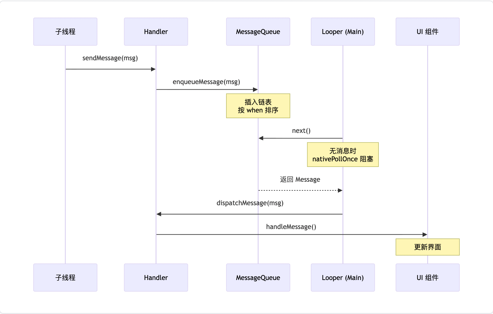
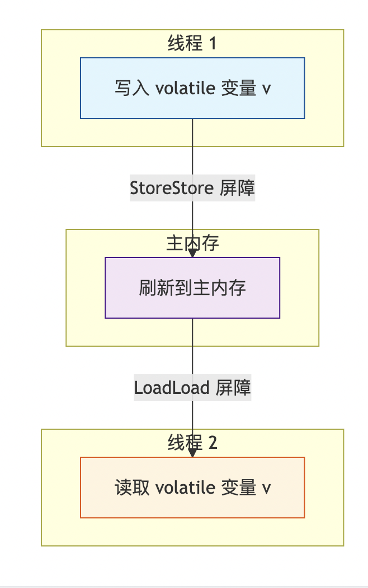
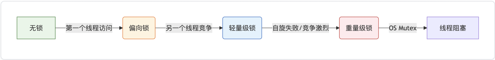

# Android 并发编程与线程安全

> 本文涵盖 Java/Android 并发编程的核心知识体系：从 JMM 理论基础到锁机制底层原理，从线程池调优到 Kotlin 协程实践。

---

## 一、概述

### 1.1 为什么 Android UI 是单线程的？

Android UI 工具包（View 体系）不是线程安全的。如果允许多线程操作 UI，将引入复杂的锁机制，导致：

- **死锁风险增加**：多个线程互相等待锁
- **性能开销大**：锁竞争导致上下文切换频繁
- **调试困难**：竞态条件难以复现

**设计决策**：采用**单线程渲染模型**。所有 UI 操作必须在主线程（Main Thread），耗时操作必须在子线程（Worker Thread）。线程间通过 Handler 消息机制通信。



### 1.2 线程切换的代价

线程不是越多越好。线程上下文切换涉及：

1. 保存当前线程上下文（寄存器、程序计数器、栈指针）
2. 加载新线程上下文
3. 刷新 CPU 缓存（Cache Miss），导致缓存命中率下降

频繁切换导致 CPU 时间片浪费在调度上，而非业务逻辑。Android 设备 CPU 核心有限（通常 4-8 核），过多线程反而劣化性能。

---

## 二、并发理论基础 -- Java 内存模型（JMM）

JMM 定义了线程如何与主内存和工作内存交互。并发问题的三大根源：**原子性、可见性、有序性**。

### 2.1 三大特性

| 特性 | 定义 | 问题示例 | 解决方案 |
|------|------|---------|---------|
| **原子性** | 操作不可中断，要么全做要么全不做 | `i++`（读-改-写三步操作，非原子） | `synchronized`、`Lock`、`AtomicInteger` |
| **可见性** | 线程修改变量后，其他线程能立即看到新值 | 线程 A 修改 flag=true，线程 B 读不到 | `volatile`、`synchronized`、`Lock` |
| **有序性** | 程序执行顺序与代码书写顺序一致 | 指令重排导致对象未初始化就被使用 | `volatile`（禁止重排）、`happens-before` |

### 2.2 Happens-Before 规则

JMM 通过 Happens-Before 规则定义操作之间的可见性保证：

- **程序顺序规则**：一个线程内，按代码顺序，前面的操作 happens-before 后面的操作
- **volatile 变量规则**：对 volatile 变量的写操作 happens-before 后续对该变量的读操作
- **锁规则**：unlock 操作 happens-before 后续对同一个锁的 lock 操作
- **传递性**：如果 A happens-before B，B happens-before C，则 A happens-before C
- **线程启动规则**：`Thread.start()` happens-before 该线程中的任何操作
- **线程终止规则**：线程中的任何操作 happens-before 其他线程检测到该线程已终止

### 2.3 volatile 的内存语义

`volatile` 提供两个保证：

1. **可见性**：写操作会强制刷新到主内存，读操作会从主内存读取
2. **有序性**：通过内存屏障禁止指令重排



**volatile 不保证原子性**：`volatile int count; count++` 仍然不是线程安全的，因为 `count++` 是三步操作（读-改-写）。

### 2.4 双重检查锁定（DCL）与 volatile

经典的单例模式 DCL 问题：

```java
public class Singleton {
    // 必须加 volatile！
    private static volatile Singleton instance;

    public static Singleton getInstance() {
        if (instance == null) {                  // 第一次检查
            synchronized (Singleton.class) {
                if (instance == null) {           // 第二次检查
                    instance = new Singleton();   // 问题所在
                }
            }
        }
        return instance;
    }
}
```

**为什么必须加 volatile？** `instance = new Singleton()` 不是原子操作，实际分三步：
1. 分配内存空间
2. 调用构造函数初始化对象
3. 将引用指向内存地址

指令重排可能导致步骤 2 和 3 互换，其他线程在第一次检查时看到非 null 的 instance，但对象尚未初始化完成，导致使用"半成品"对象。`volatile` 禁止这种重排。

---

## 三、锁机制与底层原理

### 3.1 synchronized 锁升级过程

JVM 为减少锁开销，实现了**偏向锁 → 轻量级锁 → 重量级锁**的升级过程：



| 锁级别 | 适用场景 | 实现机制 | 开销 |
|--------|---------|---------|------|
| **偏向锁** | 始终只有一个线程访问 | 在 Mark Word 中记录线程 ID，后续该线程进入时无需 CAS | 几乎零开销 |
| **轻量级锁** | 两个线程交替访问（低竞争） | 在栈帧中创建 Lock Record，CAS 自旋尝试获取 | 用户态自旋，不阻塞线程 |
| **重量级锁** | 多线程高竞争 | 依赖操作系统 Mutex，未获取锁的线程挂起（park） | 内核态切换，开销大 |

> **注意**：JDK 15 起默认禁用了偏向锁（`-XX:-UseBiasedLocking`），因为现代应用多为多线程场景，偏向锁的撤销开销反而成为负担。Android ART 虚拟机有自己的锁实现，但升级思想类似。

### 3.2 synchronized 底层实现

**代码块**：编译后在前后插入 `monitorenter` 和 `monitorexit` 字节码指令

**方法**：方法的 access_flags 中设置 `ACC_SYNCHRONIZED` 标志

两者最终都依赖 **Monitor（管程/监视器）**：
- 每个 Java 对象关联一个 Monitor
- Monitor 内部维护：Owner（当前持有锁的线程）、EntryList（等待获取锁的线程队列）、WaitSet（调用 `wait()` 后等待的线程集合）

### 3.3 AQS（AbstractQueuedSynchronizer）

`ReentrantLock`、`CountDownLatch`、`Semaphore`、`ReadWriteLock` 的底层基石。

**核心结构：**
- `volatile int state`：同步状态。0 表示无锁，>0 表示有锁（值为重入次数）
- **CLH 变体队列**：FIFO 双向链表，存储等待获取锁的线程节点

**获取锁流程：**

```
线程尝试获取锁
    │
    ▼
CAS 修改 state（0 → 1）
    │
    ├── 成功 → 设为 Owner，执行临界区
    │
    └── 失败 → 封装为 Node 加入 CLH 队列尾部
                │
                ▼
          LockSupport.park() 阻塞当前线程
                │
                ▼（被前驱节点唤醒）
          再次尝试 CAS 获取锁 → 成功则出队执行
```

**释放锁流程：** state 减 1，若 state == 0 表示完全释放，调用 `LockSupport.unpark()` 唤醒队列中下一个等待线程。

### 3.4 ReentrantLock vs synchronized

| 特性 | synchronized | ReentrantLock |
|------|-------------|---------------|
| **锁类型** | 隐式锁（JVM 内置） | 显式锁（API 级） |
| **可中断** | 不可中断 | `lockInterruptibly()` 支持中断 |
| **超时** | 不支持 | `tryLock(timeout)` 支持超时 |
| **公平性** | 非公平 | 可选公平/非公平 |
| **条件变量** | 一个（wait/notify） | 多个 `Condition` |
| **自动释放** | 退出同步块自动释放 | 必须手动 `unlock()`，通常在 finally 中 |
| **性能** | JVM 优化后差距很小 | 高竞争场景略优 |

> **选择建议**：优先使用 `synchronized`（简单、不会忘记释放）。只有需要 tryLock、超时、中断、多条件变量等高级特性时，才用 ReentrantLock。

---

## 四、原子类与 CAS

### 4.1 CAS（Compare-And-Swap）

基于硬件 CPU 指令（如 x86 的 `CMPXCHG`）实现的无锁并发方案。

**三个操作数**：内存位置 V、预期原值 A、新值 B。仅当 V == A 时，原子性地将 V 更新为 B。

```java
// AtomicInteger 的 CAS 操作
public final int incrementAndGet() {
    return U.getAndAddInt(this, VALUE, 1) + 1;
}

// Unsafe.getAndAddInt 底层
public final int getAndAddInt(Object o, long offset, int delta) {
    int v;
    do {
        v = getIntVolatile(o, offset);       // 读取当前值
    } while (!compareAndSwapInt(o, offset, v, v + delta)); // CAS 自旋
    return v;
}
```

**CAS 的问题：**

| 问题 | 说明 | 解决方案 |
|------|------|---------|
| **ABA 问题** | 值从 A → B → A，CAS 误判未被修改 | `AtomicStampedReference`（增加版本号戳） |
| **自旋开销** | 高竞争下 CAS 频繁失败，CPU 空转 | 退避策略 或 改用锁 |
| **只能操作单个变量** | CAS 是针对单个变量的原子操作 | `AtomicReference` 包装多个字段为一个对象 |

### 4.2 常用原子类

| 类 | 用途 | 底层 |
|----|------|------|
| `AtomicInteger` / `AtomicLong` | 整数原子操作 | CAS + volatile |
| `AtomicReference<T>` | 引用类型原子操作 | CAS |
| `AtomicStampedReference<T>` | 带版本号的引用（解决 ABA） | CAS + stamp |
| `LongAdder` | 高并发计数器 | 分段累加 + CAS |

### 4.3 LongAdder -- 高并发计数器

在高并发场景（如统计埋点），`AtomicLong` 的 CAS 竞争成为瓶颈。`LongAdder` 采用**分段累加**策略：

- 内部维护一个 `base` 值和一个 `Cell[]` 数组
- 低竞争时直接 CAS 更新 `base`
- 高竞争时，每个线程映射到不同的 Cell 上累加，减少热点竞争
- 最终求和时，将 `base + sum(cells)` 汇总

> **代价**：`sum()` 不是精确实时值（统计时可能有并发写入），适合最终一致性场景。

---

## 五、线程隔离 -- ThreadLocal

让每个线程拥有独立的变量副本，避免共享竞争。

### 5.1 底层结构

每个 `Thread` 对象内部维护一个 `ThreadLocalMap`：

```
Thread
  └─ ThreadLocalMap threadLocals
       └─ Entry[] table （开放寻址法的哈希表）
            │
            ├── Entry(key=ThreadLocal<Looper>, value=Looper实例)
            ├── Entry(key=ThreadLocal<Context>, value=Context实例)
            └── ...
```

- **Key**：`ThreadLocal` 对象本身，以**弱引用**包装
- **Value**：实际存储的数据，**强引用**

### 5.2 内存泄漏风险

```
ThreadLocal 对象（外部强引用消失）
         │
         │ 弱引用（Key）→ 被 GC 回收 → Key = null
         │
         ▼
Thread（线程池中长期存活）
  └─ ThreadLocalMap
       └─ Entry(key=null, value=仍被强引用)  ← 泄漏！
```

**泄漏原因**：线程池中的线程长期存活，ThreadLocal 外部引用被回收后，Key 变为 null（弱引用被 GC），但 Value 仍被 Entry 强引用，无法回收。

**解决方案**：使用完毕后**必须**调用 `threadLocal.remove()`。

```kotlin
try {
    threadLocal.set(value)
    // 使用 value
} finally {
    threadLocal.remove() // 必须！尤其是线程池场景
}
```

### 5.3 Android 中的 ThreadLocal 应用

- **Looper.sThreadLocal**：确保每个线程只有一个 Looper，实现线程与消息循环的一对一绑定
- **Choreographer.sThreadInstance**：每个线程独立的 Choreographer 实例

---

## 六、线程池最佳实践

### 6.1 ThreadPoolExecutor 核心参数

```java
public ThreadPoolExecutor(
    int corePoolSize,      // 核心线程数：始终存活（除非 allowCoreThreadTimeOut）
    int maximumPoolSize,   // 最大线程数：核心线程 + 临时线程的上限
    long keepAliveTime,    // 临时线程空闲存活时间
    TimeUnit unit,         // 时间单位
    BlockingQueue<Runnable> workQueue,         // 任务队列
    ThreadFactory threadFactory,               // 线程工厂
    RejectedExecutionHandler handler           // 拒绝策略
)
```

**任务提交流程：**

```
提交任务
    │
    ▼
当前线程数 < corePoolSize ?
    ├── 是 → 创建核心线程执行
    └── 否 ↓
         workQueue 未满 ?
         ├── 是 → 加入队列等待
         └── 否 ↓
              当前线程数 < maximumPoolSize ?
              ├── 是 → 创建临时线程执行
              └── 否 → 执行拒绝策略
```

### 6.2 参数调优建议

| 参数 | CPU 密集型 | IO 密集型 | 说明 |
|------|-----------|-----------|------|
| `corePoolSize` | CPU 核数 + 1 | 2 * CPU 核数 | CPU 密集型线程不阻塞，少量线程即可充分利用 CPU |
| `maximumPoolSize` | = corePoolSize | 根据实际情况 | IO 密集型线程频繁等待，需更多线程填补空闲 |
| `workQueue` | `LinkedBlockingQueue`（有界） | `SynchronousQueue` | 有界队列防 OOM，SynchronousQueue 适合快速响应 |

### 6.3 四种拒绝策略

| 策略 | 行为 | 适用场景 |
|------|------|---------|
| `AbortPolicy`（默认） | 抛出 `RejectedExecutionException` | 需要调用者感知并处理 |
| `CallerRunsPolicy` | 由提交任务的线程直接执行 | 需要降速（背压），不丢任务 |
| `DiscardPolicy` | 静默丢弃 | 允许丢失的非关键任务 |
| `DiscardOldestPolicy` | 丢弃队列最老的任务 | 只关心最新数据的场景 |

### 6.4 Android 中的线程池

| 使用方 | 线程池配置 | 说明 |
|--------|-----------|------|
| **AsyncTask**（已废弃） | 核心 1，最大 20，串行执行器 | API 30 废弃，被协程取代 |
| **OkHttp** | 最大 64 并发，每主机 5 连接 | Dispatcher 管理网络请求线程 |
| **Glide** | 固定核心线程数处理图片加载 | 区分源数据加载和磁盘缓存线程 |
| **RxJava Schedulers.io()** | 无上限缓存线程池 | 有 OOM 风险，需注意 |

> **最佳实践**：避免使用 `Executors.newFixedThreadPool()` 等工厂方法（使用 `LinkedBlockingQueue` 无界队列，可能 OOM），手动创建 `ThreadPoolExecutor` 并指定有界队列。在 Android 中推荐使用协程替代手动管理线程池。

---

## 七、Kotlin 协程 -- 现代并发方案

协程是轻量级的"线程"，基于挂起函数实现非阻塞异步，是 Android 官方推荐的并发方案。

### 7.1 核心概念

| 概念 | 说明 |
|------|------|
| **挂起函数**（`suspend fun`） | 可以被挂起和恢复的函数，编译后通过 CPS（续体传递风格）变换为状态机 |
| **CoroutineScope** | 协程作用域，管理协程的生命周期 |
| **CoroutineContext** | 协程上下文，包含 Job（控制生命周期）、Dispatcher（指定执行线程）等 |
| **Job** | 协程的句柄，可用于取消协程、等待完成 |
| **Dispatcher** | 调度器，决定协程在哪个线程执行 |

### 7.2 结构化并发（Structured Concurrency）

协程必须在一个 `CoroutineScope` 中启动。Scope 销毁时，所有子协程**自动取消**。

```kotlin
class MyViewModel : ViewModel() {
    fun loadData() {
        // viewModelScope 在 ViewModel.onCleared() 时自动取消所有子协程
        viewModelScope.launch {
            val data = withContext(Dispatchers.IO) {
                repository.fetchData()
            }
            uiState.value = data
        }
    }
}
```

> **核心优势**：彻底解决"页面销毁了，后台线程还在跑"导致的崩溃和内存泄漏。

### 7.3 调度器（Dispatchers）

| 调度器 | 线程 | 默认线程数 | 适用场景 |
|--------|------|-----------|---------|
| `Dispatchers.Main` | 主线程 | 1 | UI 操作、LiveData 更新 |
| `Dispatchers.IO` | IO 线程池 | 最大 64 | 网络请求、文件读写、数据库操作 |
| `Dispatchers.Default` | 计算线程池 | = CPU 核心数 | JSON 解析、列表排序、加密计算 |
| `Dispatchers.Unconfined` | 不指定线程 | - | 仅用于特殊场景（如测试） |

**底层实现**：
- `Dispatchers.Main` → `Handler.post()` 到主线程 MessageQueue
- `Dispatchers.IO` 和 `Dispatchers.Default` 共享同一个线程池（但 IO 限制不同，允许更多并发）

### 7.4 常见使用模式

```kotlin
// ViewModel 中推荐写法
viewModelScope.launch {
    // 1. 主线程：更新 UI 为加载状态
    uiState.value = Loading

    try {
        // 2. 切换到 IO 线程：网络请求
        val data = withContext(Dispatchers.IO) {
            repository.fetchData()
        }

        // 3. 自动切回主线程：更新结果
        uiState.value = Success(data)
    } catch (e: CancellationException) {
        throw e // 不要吃掉取消异常！
    } catch (e: Exception) {
        // 4. 异常处理
        uiState.value = Error(e.message)
    }
}
```

### 7.5 协程 vs 线程 vs RxJava

| 维度 | Thread / ThreadPool | RxJava | Kotlin 协程 |
|------|--------------------|--------|------------|
| **代码风格** | 回调嵌套 | 链式操作符 | 顺序书写（看起来像同步代码） |
| **取消** | 手动管理 | Disposable | 结构化并发自动取消 |
| **生命周期感知** | 无 | 需手动 CompositeDisposable | lifecycleScope/viewModelScope |
| **异常处理** | try-catch | onError | try-catch（直观） |
| **学习曲线** | 低 | 高（操作符多） | 中 |
| **官方推荐** | 否 | 否 | 是（Android 首选） |

---

## 八、常见陷阱与调试

### 8.1 ANR（Application Not Responding）

| 场景 | 超时时间 | 说明 |
|------|---------|------|
| 输入事件（触摸、按键） | 5 秒 | InputDispatcher 等待 App 处理完成 |
| BroadcastReceiver | 前台 10 秒 / 后台 60 秒 | `onReceive()` 必须在时限内返回 |
| Service | 前台 20 秒 / 后台 200 秒 | `onCreate()` / `onStartCommand()` 超时 |
| ContentProvider | 10 秒 | `publish` 超时 |

**排查方法**：分析 `/data/anr/traces.txt`（或通过 `adb bugreport`），查找主线程堆栈中的阻塞点。

### 8.2 内存泄漏自查清单

| 检查项 | 说明 |
|--------|------|
| Handler 是否为静态内部类？是否 `removeCallbacksAndMessages(null)`？ | 非静态 Handler 持有外部类引用 |
| ThreadLocal 是否调用了 `remove()`？ | 线程池中线程长期存活导致泄漏 |
| 单例是否持有了 Activity Context？ | 应使用 Application Context |
| 协程是否使用了正确的 Scope？ | 用 `lifecycleScope` / `viewModelScope`，不要用 `GlobalScope` |
| 静态集合是否清除了 Activity 引用？ | 静态集合与进程同生命周期 |
| 监听器/回调是否在 onDestroy 中反注册？ | 典型如 EventBus、传感器监听 |

### 8.3 调试工具

| 工具 | 用途 | 使用方式 |
|------|------|---------|
| **Android Profiler** | 查看 CPU 线程活动、方法耗时 | Android Studio → Profiler → CPU |
| **StrictMode** | 检测主线程磁盘/网络操作 | `StrictMode.setThreadPolicy()` |
| **BlockCanary** | 监控主线程卡顿（基于 Looper Printer） | 第三方库，超过阈值自动记录堆栈 |
| **LeakCanary** | 自动检测内存泄漏 | 引入依赖即可，无需代码 |
| **Perfetto / Systrace** | 系统级性能分析 | `adb shell perfetto` |

---

## 九、常见面试题与解答

### Q1：synchronized 和 ReentrantLock 的区别

**答**：
- **实现层面**：synchronized 是 JVM 内置关键字，通过 `monitorenter/monitorexit` 指令实现；ReentrantLock 是 API 级实现，基于 AQS
- **功能特性**：ReentrantLock 支持可中断锁获取（`lockInterruptibly`）、超时尝试（`tryLock`）、公平锁选择、多个 Condition 条件变量
- **使用方式**：synchronized 自动释放锁；ReentrantLock 必须手动在 finally 中释放
- **性能**：JDK 6 之后 synchronized 经过大量优化（锁升级），两者性能差距已很小
- **选择建议**：优先 synchronized（简洁、安全），需要高级特性时用 ReentrantLock

---

### Q2：volatile 能保证线程安全吗？

**答**：**不能完全保证**。volatile 只保证可见性和有序性，不保证原子性。

- `volatile boolean flag`：多线程读写 flag 是安全的（单次读写是原子的）
- `volatile int count; count++`：不安全，`count++` 包含读-改-写三步，volatile 不保证三步整体的原子性

需要原子性时，应使用 `AtomicInteger`、`synchronized` 或 `Lock`。

---

### Q3：ThreadLocal 的内存泄漏是怎么回事？

**答**：

ThreadLocalMap 的 Entry 中，Key（ThreadLocal 本身）是弱引用，Value 是强引用。当 ThreadLocal 对象失去外部强引用后，Key 会被 GC 回收变为 null，但 Value 仍被 Entry 强引用。

在线程池场景中，线程长期存活，这些 key=null 的 Entry 永远不会被主动清理（虽然 ThreadLocal 在 `get/set/remove` 时会顺便清理部分过期 Entry，但不保证及时）。

**解决方案**：使用完毕后显式调用 `threadLocal.remove()`，特别是在线程池环境中。

---

### Q4：CAS 的 ABA 问题是什么？如何解决？

**答**：

**ABA 问题**：线程 1 读取值为 A，在 CAS 之前，线程 2 将值改为 B 再改回 A。线程 1 CAS 时看到值仍为 A，认为没有被修改过，操作"成功"。

**实际影响**：在大多数数值计算场景中 ABA 无害。但在链表/栈等数据结构中，ABA 可能导致节点被错误复用。

**解决方案**：
- `AtomicStampedReference`：增加版本号（stamp），每次修改 stamp +1，CAS 同时比较引用和 stamp
- `AtomicMarkableReference`：增加布尔标记，适合只需关心"是否被改过"的场景

---

### Q5：线程池核心参数如何配置？

**答**：

**CPU 密集型**（JSON 解析、加密计算）：
- `corePoolSize = CPU 核心数 + 1`（+1 应对某线程偶尔阻塞）
- 使用有界队列，最大线程数 = 核心线程数

**IO 密集型**（网络请求、数据库查询）：
- `corePoolSize = 2 * CPU 核心数`（线程频繁等待 IO，需要更多线程利用 CPU）
- 可适当增大最大线程数

**Android 实践**：
- 获取 CPU 核心数：`Runtime.getRuntime().availableProcessors()`
- 必须使用有界队列（防止 OOM）
- 推荐使用协程替代手动管理线程池

---

### Q6：Kotlin 协程相比线程有什么优势？

**答**：

1. **轻量级**：协程是用户态的，创建成本极低（几十字节的对象），可以轻松创建数万个协程
2. **结构化并发**：协程绑定到 Scope，Scope 取消时所有子协程自动取消，避免泄漏
3. **代码可读性**：异步代码以同步方式书写，没有回调嵌套
4. **生命周期感知**：`lifecycleScope`、`viewModelScope` 自动绑定 Android 组件生命周期
5. **异常传播**：协程的异常沿着父子关系传播，支持 `try-catch`，比回调中的异常处理更直观

**底层**：协程在 JVM 上并不创建新线程。`Dispatchers.IO` 底层仍是线程池，`Dispatchers.Main` 底层是 Handler。协程的"轻量级"体现在**调度**层面 -- 一个线程上可以运行成千上万个协程，通过挂起/恢复切换，避免线程切换开销。

---

### Q7：Android 中为什么不能在子线程更新 UI？

**答**：

准确地说，并非"不能在子线程操作 View"，而是 `ViewRootImpl.checkThread()` 会在视图操作（`invalidate`、`requestLayout`）时检查当前线程是否为创建 ViewRootImpl 的线程（主线程）。

- **创建 View 对象**：任何线程都可以（如 `AsyncLayoutInflater` 在后台线程 inflate）
- **操作已挂载到视图树的 View**：必须在主线程，因为会触发 `checkThread()`

这个设计是为了避免多线程操作 UI 带来的同步问题。如果引入 UI 层面的锁机制，会显著增加 UI 渲染的延迟和复杂度，不如单线程模型简单高效。

详细分析参见 [消息机制.md](../Framework/消息机制.md)。

---

## 十、资深开发检查清单

在代码 Review 或提交前，对照此清单检查并发相关代码：

| 检查项 | 标准 |
|--------|------|
| **UI 操作** | 所有 View 操作在主线程 |
| **耗时任务** | 网络、IO、计算必须在子线程 |
| **锁粒度** | 锁范围尽可能小，只锁必要的代码 |
| **死锁风险** | 避免嵌套锁，或固定锁获取顺序 |
| **生命周期** | 异步任务必须感知生命周期，页面销毁即取消 |
| **Context 持有** | 长生命周期对象严禁持有 Activity Context |
| **集合安全** | 多线程共享集合使用 ConcurrentHashMap / CopyOnWriteArrayList |
| **ThreadLocal** | 使用完毕必须 remove()，尤其线程池场景 |
| **协程 Scope** | 使用 lifecycleScope / viewModelScope，避免 GlobalScope |
| **异常处理** | 协程中不要吃掉 CancellationException |
