# MVC -> MVP -> MVVM -> MVI 架构演进

## 一、概述

Android 架构模式的演进史，本质上是一场**关于"职责分离"和"数据流向"的持续优化**。从最初的 MVC 到如今主流的 MVI，每一次演进都在回答同一个核心问题：**如何让 UI 层、业务逻辑层、数据层各司其职，同时保持代码的可测试性和可维护性？**

理解这条演进路径，不是为了记住四个缩写的定义，而是要理解每一次架构升级**解决了前一代的什么痛点，又引入了什么新的问题**。

> 架构模式不存在"最好"，只有"最适合"。MVI 不一定比 MVVM 好，关键在于团队规模、项目复杂度和一致性需求。

## 二、MVC：Android 的"默认架构"

### 2.1 经典 MVC 定义

MVC（Model-View-Controller）是最早的 UI 架构模式，起源于 1970 年代的 Smalltalk：

- **Model**：数据和业务逻辑（数据库、网络请求、实体类）
- **View**：UI 展示（显示数据、接收用户输入）
- **Controller**：协调者，接收用户输入，调用 Model 处理，更新 View

### 2.2 Android 中的 MVC 实态

在 Android 中，MVC 的问题在于**角色边界模糊**。XML 布局文件是纯静态的，不具备 Web 前端 View 那样的动态能力，导致大量 UI 逻辑被迫写在 Activity/Fragment 中：

```kotlin
// 典型的"MVC" Activity -- 实际上 Activity 同时扮演了 View 和 Controller
class OrderListActivity : AppCompatActivity() {

    // ---- Model 层 ----
    private val orderApi = RetrofitClient.create(OrderApi::class.java)
    private val orderDao = AppDatabase.getInstance().orderDao()

    // ---- View 层 (XML 只是静态模板，动态操作全在这里) ----
    private lateinit var recyclerView: RecyclerView
    private lateinit var loadingView: ProgressBar
    private lateinit var errorView: TextView

    override fun onCreate(savedInstanceState: Bundle?) {
        super.onCreate(savedInstanceState)
        setContentView(R.layout.activity_order_list)
        initViews()
        loadOrders()  // Controller 逻辑也在这里
    }

    // ---- Controller 逻辑 ----
    private fun loadOrders() {
        loadingView.visibility = View.VISIBLE
        Thread {
            try {
                val orders = orderApi.getOrders().execute().body()
                orders?.let { orderDao.insertAll(it) }
                runOnUiThread {
                    loadingView.visibility = View.GONE
                    adapter.submitList(orders)
                }
            } catch (e: Exception) {
                runOnUiThread {
                    loadingView.visibility = View.GONE
                    errorView.visibility = View.VISIBLE
                    errorView.text = e.message
                }
            }
        }.start()
    }
}
```

### 2.3 MVC 的核心问题

| 问题 | 表现 |
|------|------|
| **Activity 膨胀** | Activity 承担了 View + Controller 双重职责，千行乃至万行的 Activity 屡见不鲜 |
| **View 和 Controller 耦合** | UI 操作和业务逻辑混在同一个类中，无法单独替换或测试 |
| **不可测试** | 业务逻辑绑定在 Activity 生命周期中，单元测试几乎不可能（需要 Android 框架依赖） |
| **Model 直接通知 View** | 在经典 MVC 中 Model 可以直接更新 View，但在 Android 中这条路径更加混乱 |

> 本质问题：Android 的 Activity/Fragment 天然就不是纯 Controller，它自身就是 View 的一部分（持有 Window、管理 View 树）。MVC 的三角关系在 Android 中退化为"V+C 二合一"。

## 三、MVP：显式分离 View 与逻辑

### 3.1 设计思想

MVP（Model-View-Presenter）的核心改进：**通过接口将 View 和业务逻辑彻底解耦**。

- **Model**：数据层（同 MVC）
- **View**：Activity/Fragment，只负责 UI 操作，通过接口暴露能力
- **Presenter**：持有 View 接口引用和 Model 引用，承担所有业务逻辑

关键区别：**View 和 Model 之间没有任何直接通信**，所有交互必须经过 Presenter。

### 3.2 代码实现

```kotlin
// ---- 契约接口：定义 View 和 Presenter 的能力 ----
interface OrderListContract {
    interface View {
        fun showLoading()
        fun hideLoading()
        fun showOrders(orders: List<Order>)
        fun showError(message: String)
    }

    interface Presenter {
        fun loadOrders()
        fun onDestroy()
    }
}

// ---- Presenter：纯 Kotlin 类，不依赖 Android 框架 ----
class OrderListPresenter(
    private var view: OrderListContract.View?,
    private val repository: OrderRepository
) : OrderListContract.Presenter {

    override fun loadOrders() {
        view?.showLoading()
        repository.getOrders(
            onSuccess = { orders ->
                view?.hideLoading()
                view?.showOrders(orders)
            },
            onError = { error ->
                view?.hideLoading()
                view?.showError(error.message ?: "未知错误")
            }
        )
    }

    override fun onDestroy() {
        view = null  // 防止内存泄漏
    }
}

// ---- View：Activity 只负责 UI 操作 ----
class OrderListActivity : AppCompatActivity(), OrderListContract.View {
    private lateinit var presenter: OrderListContract.Presenter

    override fun onCreate(savedInstanceState: Bundle?) {
        super.onCreate(savedInstanceState)
        setContentView(R.layout.activity_order_list)
        presenter = OrderListPresenter(this, OrderRepository())
        presenter.loadOrders()
    }

    override fun showLoading() { loadingView.visibility = View.VISIBLE }
    override fun hideLoading() { loadingView.visibility = View.GONE }
    override fun showOrders(orders: List<Order>) { adapter.submitList(orders) }
    override fun showError(message: String) { errorView.text = message }

    override fun onDestroy() {
        super.onDestroy()
        presenter.onDestroy()  // 手动解绑
    }
}
```

### 3.3 MVP 的优势与痛点

**优势：**
- Presenter 是纯 Kotlin 类，可以直接用 JUnit 测试，Mock View 接口即可
- View 和逻辑职责清晰分离
- 同一 Presenter 可以适配不同 View 实现（如手机版和平板版）

**痛点：**

| 问题 | 表现 |
|------|------|
| **接口爆炸** | 每个页面至少一对 View/Presenter 接口，复杂页面接口方法多达数十个 |
| **View 引用管理** | Presenter 持有 View 引用，必须手动在 onDestroy 置空，否则内存泄漏 |
| **生命周期不感知** | Presenter 不知道 Activity 是否处于前台，可能在 Activity 销毁后调用 View 方法 |
| **状态难同步** | 多个异步回调可能导致 UI 状态不一致（如 loading 和 error 同时显示） |
| **配置变更丢数据** | 屏幕旋转时 Presenter 被销毁，需要额外处理数据恢复 |

> MVP 最大的贡献是确立了"**逻辑层不依赖 Android 框架**"的原则。但接口契约的维护成本和生命周期问题，为下一代架构的到来埋下了伏笔。

## 四、MVVM：数据驱动 + 生命周期感知

### 4.1 设计思想

MVVM（Model-View-ViewModel）的核心改进：**用观察者模式替代接口回调，ViewModel 不持有 View 的任何引用**。

- **Model**：数据层（同前）
- **View**：Activity/Fragment，观察 ViewModel 中的数据变化并更新 UI
- **ViewModel**：持有 UI 状态数据，暴露为可观察的数据流（LiveData / StateFlow）

关键区别：**ViewModel 完全不知道 View 的存在**，它只管理数据，View 主动订阅数据变化。这是一个根本性的解耦。

### 4.2 代码实现

```kotlin
// ---- ViewModel：不持有任何 View 引用 ----
class OrderListViewModel(
    private val repository: OrderRepository
) : ViewModel() {

    // UI 状态用 LiveData / StateFlow 暴露
    private val _loading = MutableLiveData<Boolean>()
    val loading: LiveData<Boolean> = _loading

    private val _orders = MutableLiveData<List<Order>>()
    val orders: LiveData<List<Order>> = _orders

    private val _error = MutableLiveData<String?>()
    val error: LiveData<String?> = _error

    fun loadOrders() {
        viewModelScope.launch {
            _loading.value = true
            try {
                val result = repository.getOrders()
                _orders.value = result
                _error.value = null
            } catch (e: Exception) {
                _error.value = e.message
            } finally {
                _loading.value = false
            }
        }
    }
}

// ---- View：观察数据变化，被动更新 UI ----
class OrderListActivity : AppCompatActivity() {
    private val viewModel: OrderListViewModel by viewModels()

    override fun onCreate(savedInstanceState: Bundle?) {
        super.onCreate(savedInstanceState)
        setContentView(R.layout.activity_order_list)

        // 观察数据变化
        viewModel.loading.observe(this) { isLoading ->
            loadingView.visibility = if (isLoading) View.VISIBLE else View.GONE
        }
        viewModel.orders.observe(this) { orders ->
            adapter.submitList(orders)
        }
        viewModel.error.observe(this) { message ->
            errorView.visibility = if (message != null) View.VISIBLE else View.GONE
            errorView.text = message
        }

        viewModel.loadOrders()
    }
    // 不需要手动解绑 -- LiveData 自动感知生命周期
}
```

### 4.3 MVVM 相比 MVP 的关键改进

| 维度 | MVP | MVVM |
|------|-----|------|
| View 与逻辑层的关系 | Presenter **持有** View 接口引用 | ViewModel **不知道** View 存在 |
| 通信方式 | 接口回调（命令式） | 数据观察（响应式） |
| 生命周期管理 | 手动解绑 | LiveData 自动感知，ViewModel 跨配置变更存活 |
| 接口数量 | 每个页面至少一对接口 | 无需定义接口 |
| 内存泄漏风险 | 高（忘记置空 View 引用） | 低（ViewModel 不持有 View） |
| 可测试性 | Presenter 需 Mock View 接口 | ViewModel 直接测试，验证 LiveData/Flow 值即可 |

### 4.4 MVVM 仍然存在的问题

MVVM 在 Android 社区被广泛接受，但随着项目复杂度增长，暴露出新的问题：

| 问题 | 表现 |
|------|------|
| **状态分散** | loading、orders、error 是三个独立的 LiveData，它们之间可能出现不一致状态（如 loading=true 且 error!=null） |
| **事件处理模糊** | 一次性事件（Toast、导航）用 LiveData 处理不自然，需要 SingleLiveEvent 等 hack |
| **数据流不可预测** | View 可以随时调用 ViewModel 的多个方法，ViewModel 内部状态变更不可追溯 |
| **多数据源竞争** | 多个 LiveData/Flow 同时变化时，UI 更新的时序难以保证 |

> 核心矛盾：MVVM 的多个独立数据流本质上是在描述**同一个页面状态**的不同碎片。当碎片之间存在关联关系时，分散管理就成了负担。

## 五、MVI：单向数据流 + 不可变状态

### 5.1 设计思想

MVI（Model-View-Intent）是对 MVVM 的进一步约束，核心理念来自前端的 Redux/Elm 架构：

- **Model**：不是传统意义的数据层，而是**不可变的 UI 状态**（State）
- **View**：渲染 State，发射用户意图（Intent/Event）
- **Intent**：用户意图（不是 Android 的 Intent），描述"用户想做什么"



**核心约束——单向数据流（Unidirectional Data Flow, UDF）：**

```
View --[Intent/Event]--> ViewModel --[处理]--> 新 State --[渲染]--> View
```

三条铁律：
1. **单一状态源**（Single Source of Truth）：整个页面只有一个 State 对象
2. **状态不可变**（Immutable State）：每次变更都生成新的 State 实例
3. **单向流动**（Unidirectional Flow）：State 只能从 ViewModel 流向 View，View 只能发射 Intent

### 5.2 代码实现

```kotlin
// ---- 1. 定义不可变状态 ----
data class OrderListState(
    val isLoading: Boolean = false,
    val orders: List<Order> = emptyList(),
    val error: String? = null
)

// ---- 2. 定义用户意图 ----
sealed class OrderListIntent {
    object LoadOrders : OrderListIntent()
    object Refresh : OrderListIntent()
    data class DeleteOrder(val orderId: String) : OrderListIntent()
}

// ---- 3. 定义一次性副作用（不属于 UI 状态的事件） ----
sealed class OrderListEffect {
    data class ShowToast(val message: String) : OrderListEffect()
    data class NavigateToDetail(val orderId: String) : OrderListEffect()
}

// ---- 4. ViewModel：接收 Intent，输出 State ----
class OrderListViewModel(
    private val repository: OrderRepository
) : ViewModel() {

    private val _state = MutableStateFlow(OrderListState())
    val state: StateFlow<OrderListState> = _state.asStateFlow()

    private val _effect = Channel<OrderListEffect>()
    val effect: Flow<OrderListEffect> = _effect.receiveAsFlow()

    fun handleIntent(intent: OrderListIntent) {
        when (intent) {
            is OrderListIntent.LoadOrders -> loadOrders()
            is OrderListIntent.Refresh -> loadOrders()
            is OrderListIntent.DeleteOrder -> deleteOrder(intent.orderId)
        }
    }

    private fun loadOrders() {
        viewModelScope.launch {
            // 每次都生成新的 State 实例，旧 State 不可变
            _state.update { it.copy(isLoading = true, error = null) }
            try {
                val orders = repository.getOrders()
                _state.update { it.copy(isLoading = false, orders = orders) }
            } catch (e: Exception) {
                _state.update { it.copy(isLoading = false, error = e.message) }
            }
        }
    }

    private fun deleteOrder(orderId: String) {
        viewModelScope.launch {
            try {
                repository.deleteOrder(orderId)
                _state.update { current ->
                    current.copy(orders = current.orders.filter { it.id != orderId })
                }
                _effect.send(OrderListEffect.ShowToast("删除成功"))
            } catch (e: Exception) {
                _effect.send(OrderListEffect.ShowToast("删除失败: ${e.message}"))
            }
        }
    }
}

// ---- 5. View：渲染 State + 发射 Intent ----
class OrderListActivity : AppCompatActivity() {
    private val viewModel: OrderListViewModel by viewModels()

    override fun onCreate(savedInstanceState: Bundle?) {
        super.onCreate(savedInstanceState)
        setContentView(R.layout.activity_order_list)

        // 观察唯一状态源
        lifecycleScope.launch {
            repeatOnLifecycle(Lifecycle.State.STARTED) {
                viewModel.state.collect { state -> render(state) }
            }
        }

        // 观察副作用
        lifecycleScope.launch {
            repeatOnLifecycle(Lifecycle.State.STARTED) {
                viewModel.effect.collect { effect ->
                    when (effect) {
                        is OrderListEffect.ShowToast ->
                            Toast.makeText(this@OrderListActivity, effect.message, Toast.LENGTH_SHORT).show()
                        is OrderListEffect.NavigateToDetail ->
                            startActivity(OrderDetailActivity.newIntent(this@OrderListActivity, effect.orderId))
                    }
                }
            }
        }

        // 发射意图
        viewModel.handleIntent(OrderListIntent.LoadOrders)
        swipeRefresh.setOnRefreshListener {
            viewModel.handleIntent(OrderListIntent.Refresh)
        }
    }

    // 纯渲染函数：给定 State，确定性地渲染 UI
    private fun render(state: OrderListState) {
        loadingView.visibility = if (state.isLoading) View.VISIBLE else View.GONE
        recyclerView.visibility = if (state.orders.isNotEmpty()) View.VISIBLE else View.GONE
        errorView.visibility = if (state.error != null) View.VISIBLE else View.GONE
        errorView.text = state.error
        adapter.submitList(state.orders)
    }
}
```

### 5.3 State vs Effect 的划分原则

一个常见疑问：什么放 State，什么放 Effect？

| 类型 | 特征 | 示例 |
|------|------|------|
| **State（状态）** | 持久的、可重复渲染的、屏幕旋转后应恢复的 | loading、列表数据、选中状态、输入框文字 |
| **Effect（副作用）** | 一次性的、消费后即弃的、不属于页面"状态"的 | Toast、Snackbar、导航跳转、Dialog 弹出 |

> 判断标准：如果用户旋转屏幕，这个信息还需要重新展示吗？需要 → State，不需要 → Effect。

### 5.4 MVI 的优势

| 优势 | 说明 |
|------|------|
| **状态一致性** | 单一 State 对象保证不会出现 loading=true 且 error!=null 的矛盾状态 |
| **可追溯** | 每个 Intent 对应一次 State 变更，可以记录完整的 Intent→State 变更日志 |
| **可测试** | 测试变成纯函数验证：给定初始 State + Intent → 断言新 State |
| **时间旅行调试** | 保存 State 快照序列，可以回放任意时刻的 UI 状态 |
| **天然适配 Compose** | Compose 的 `State<T>` + recomposition 机制就是 MVI 的最佳载体 |

### 5.5 MVI 的代价与注意事项

| 代价 | 说明 |
|------|------|
| **State 膨胀** | 复杂页面的 State data class 字段可能多达几十个 |
| **频繁拷贝** | 每次 `copy()` 都创建新对象，理论上有性能开销（实际上 data class 的 copy 非常轻量） |
| **过度仪式感** | 简单页面定义 State/Intent/Effect 三件套显得冗余 |
| **并发 State 更新** | 多个协程同时 `_state.update {}` 需要注意线程安全（StateFlow.update 是原子的） |
| **学习成本** | 团队需要统一理解单向数据流思想 |

## 六、四代架构横向对比



| 维度 | MVC | MVP | MVVM | MVI |
|------|-----|-----|------|-----|
| **View 与逻辑层关系** | 混合 | 接口解耦 | 观察者解耦 | 观察者 + 单向约束 |
| **数据流方向** | 双向/无序 | 双向（通过接口） | 近似单向 | 严格单向 |
| **状态管理** | 散落各处 | 散落在 Presenter | 多个 LiveData/Flow | 单一 State 对象 |
| **生命周期感知** | 无 | 无（需手动处理） | 有（LiveData + ViewModel） | 有 |
| **可测试性** | 极差 | 好（Mock 接口） | 好（观察 LiveData） | 极好（纯函数验证） |
| **一次性事件** | 回调 | 回调 | SingleLiveEvent（hack） | Effect（Channel） |
| **模板代码量** | 少 | 多（接口） | 中等 | 中偏多（State/Intent/Effect） |
| **适合场景** | 极简 Demo | 中小项目 | 大部分项目 | 复杂状态 / Compose 项目 |
| **Android 官方态度** | 不推荐 | 不推荐 | 推荐 | 推荐（UDF） |

## 七、实战选型建议

### 7.1 什么时候该用哪种架构

```
页面简单（设置页、关于页等纯展示）
  → MVVM 足够，甚至直接 ViewModel + State 即可

页面中等复杂（列表+详情、表单+提交）
  → MVVM 或 轻量 MVI（State + Intent，不需要严格 Reducer）

页面高度复杂（多状态联动、多异步源、需要回放调试）
  → 完整 MVI

已有 MVP 项目
  → 逐步迁移到 MVVM，不建议一步跳到 MVI

Compose 项目
  → MVI 天然契合，推荐使用
```

### 7.2 Google 官方推荐的 UDF 架构

Google 在官方架构指南中明确推荐 **UDF（单向数据流）**，这本质上就是 MVI 的核心思想，但 Google 刻意没有使用"MVI"这个术语，而是强调原则：

```
UI Layer        Domain Layer (optional)      Data Layer
  │                    │                         │
  │  ── events ──>     │                         │
  │                    │  ── calls ──>            │
  │                    │  <── data ───            │
  │  <── state ───     │                         │
  │                    │                         │
```

- **UI Layer**：UI elements（Compose/View）+ State holders（ViewModel）
- **Domain Layer**（可选）：Use Cases，封装可复用的业务逻辑
- **Data Layer**：Repositories + Data Sources

### 7.3 与 Jetpack 组件的配合

| Jetpack 组件 | 角色 | 适配的架构 |
|-------------|------|-----------|
| **ViewModel** | State Holder，跨配置变更存活 | MVVM / MVI 均适用。详见 [ViewModel数据保持原理](ViewModel数据保持原理.md) |
| **LiveData** | 生命周期感知的可观察数据 | MVVM（正在被 StateFlow 替代） |
| **StateFlow** | 协程版本的状态流 | MVI 首选（不可变 State 的天然载体） |
| **SavedStateHandle** | 进程死亡恢复 | 配合 ViewModel 使用 |
| **Lifecycle** | 安全的数据观察（repeatOnLifecycle） | MVVM / MVI |
| **Hilt** | 依赖注入 | 为 ViewModel 提供 Repository 等依赖 |

## 八、进阶话题

### 8.1 Reducer 模式（严格 MVI）

借鉴 Redux 的 Reducer 概念，可以让状态变更逻辑更加纯粹：

```kotlin
// Reducer 是一个纯函数：(当前State, Intent) -> 新State
typealias Reducer<S, I> = (state: S, intent: I) -> S

class OrderListViewModel(...) : ViewModel() {
    private val reducer: Reducer<OrderListState, OrderListIntent> = { state, intent ->
        when (intent) {
            is OrderListIntent.LoadOrders -> state.copy(isLoading = true, error = null)
            is OrderListIntent.OrdersLoaded -> state.copy(isLoading = false, orders = intent.orders)
            is OrderListIntent.LoadFailed -> state.copy(isLoading = false, error = intent.message)
            // ...
        }
    }
}
```

Reducer 的好处：
- **纯函数**，极易测试，无副作用
- **集中管理**所有状态变更逻辑，不会在 ViewModel 各方法中散落
- 为时间旅行调试奠定基础

### 8.2 State 膨胀的应对策略

复杂页面的 State 可能非常庞大：

```kotlin
// 问题：字段过多的 State
data class ProfileState(
    val isLoading: Boolean,
    val user: User?,
    val posts: List<Post>,
    val followers: List<User>,
    val isEditing: Boolean,
    val editName: String,
    val editBio: String,
    val isSubmitting: Boolean,
    val submitError: String?,
    // ... 更多字段
)
```

**解决方案：嵌套 State + 局部更新**

```kotlin
// 将 State 按功能域拆分为嵌套结构
data class ProfileState(
    val profileInfo: ProfileInfoState = ProfileInfoState(),
    val posts: PostsState = PostsState(),
    val editForm: EditFormState = EditFormState()
)

data class ProfileInfoState(
    val isLoading: Boolean = false,
    val user: User? = null,
    val error: String? = null
)

data class PostsState(
    val isLoading: Boolean = false,
    val posts: List<Post> = emptyList()
)

data class EditFormState(
    val isEditing: Boolean = false,
    val name: String = "",
    val bio: String = "",
    val isSubmitting: Boolean = false
)
```

### 8.3 从 MVVM 到 MVI 的渐进式迁移

不需要一步到位，可以渐进迁移：

```
阶段 1: 合并多个 LiveData 为单一 StateFlow
  - 将 _loading, _data, _error 合并为一个 UiState data class
  - 改用 StateFlow 替代 LiveData

阶段 2: 抽象用户行为为 Intent
  - 将 ViewModel 的多个 public 方法收敛为 handleIntent(intent)
  - 定义 sealed class Intent

阶段 3: 分离副作用
  - 将 Toast/Navigation 等一次性事件抽为 Effect
  - 使用 Channel 发送

阶段 4: 引入 Reducer（可选）
  - 将状态变更逻辑集中到纯函数 Reducer 中
```

## 九、常见面试题与解答

### Q1：MVC、MVP、MVVM、MVI 的核心区别是什么？

**A：** 四代架构的演进主线是**职责分离的深化**和**数据流向的约束**。MVC 中 Activity 混合了 View 和 Controller 职责；MVP 通过接口将 View 和 Presenter 解耦，但 Presenter 仍持有 View 引用；MVVM 用观察者模式（LiveData/Flow）让 ViewModel 完全不知道 View 的存在；MVI 在 MVVM 基础上进一步约束为严格的单向数据流，用单一不可变 State 替代多个分散的 LiveData。每一代都是对上一代痛点的回应：MVC 的膨胀 → MVP 的解耦 → MVVM 的生命周期感知 → MVI 的状态一致性。

### Q2：MVP 中 Presenter 持有 View 引用会导致什么问题？MVVM 是如何解决的？

**A：** MVP 中 Presenter 持有 View（Activity）的强引用，如果异步操作（如网络请求）回调时 Activity 已销毁，会导致两个问题：1）内存泄漏——Presenter 阻止 Activity 被 GC；2）空指针或状态异常——调用已销毁 Activity 的 UI 方法。传统解决方案是在 `onDestroy()` 中手动置空 View 引用，但容易遗漏。MVVM 的 ViewModel 根本不持有 View 引用，它只暴露 LiveData/StateFlow，View 主动订阅。LiveData 自动感知生命周期，Activity 销毁后不会收到回调；ViewModel 由 ViewModelStore 管理，跨配置变更存活，从根本上消除了这两个问题。

### Q3：MVVM 中为什么会出现状态不一致的问题？MVI 如何解决？

**A：** 在 MVVM 中，页面状态通常被拆成多个独立的 LiveData（如 `_loading`、`_data`、`_error`），它们各自独立变化。当多个协程或回调同时修改这些 LiveData 时，可能出现矛盾状态，比如 `loading=true` 的同时 `error` 也被赋值了。MVI 用单一不可变的 State data class 封装整个页面状态，每次通过 `copy()` 生成新实例。这保证了状态的原子性——所有字段在同一个 `copy()` 调用中一起更新，不会出现中间状态。配合 `StateFlow.update {}` 的原子操作，即使并发也能保证一致性。

### Q4：MVI 中 State 和 Effect 如何区分？举例说明。

**A：** State 是**持久的、可重复渲染的**UI 状态，配置变更后应恢复；Effect 是**一次性的、消费后即弃的**副作用事件。判断标准：屏幕旋转后这个信息还需要重新展示吗？例如，列表数据、loading 状态、输入框文字是 State（旋转后应恢复）；Toast 提示、页面跳转、Snackbar 是 Effect（旋转后不应重复执行）。实现上，State 用 `StateFlow`（热流，有最新值缓存），Effect 用 `Channel` 或 `SharedFlow(replay=0)`（消费一次即丢弃）。

### Q5：Google 官方推荐的 UDF 架构和 MVI 是什么关系？

**A：** Google 推荐的 UDF（Unidirectional Data Flow，单向数据流）本质上就是 MVI 的核心原则，但 Google 刻意使用了更通用的术语。UDF 强调三个原则：1）State 从 ViewModel 单向流向 UI；2）Events/Intents 从 UI 单向流向 ViewModel；3）ViewModel 是唯一的 State 变更者。Google 的架构指南将应用分为 UI Layer、Domain Layer（可选）、Data Layer，其中 UI Layer 的 ViewModel 作为 State Holder，与 MVI 的 ViewModel 角色完全一致。可以说 UDF 是原则，MVI 是这套原则在 Android 上的具体实践模式。

### Q6：如果一个项目目前是 MVP 架构，如何迁移到 MVVM/MVI？

**A：** 建议渐进式迁移，分四步：1）先将 Presenter 改为继承 ViewModel，获得生命周期感知和配置变更存活能力；2）用 LiveData/StateFlow 替代 View 接口回调——将 `view?.showLoading()` 改为 `_loading.value = true`，在 Activity 中 observe 替代实现接口方法；3）合并多个 LiveData 为单一 State data class，引入 sealed class Intent 收敛 public 方法；4）分离 Effect。新页面直接用 MVI 编写，旧页面按优先级逐步迁移。关键原则：每一步迁移后项目都应该是可用的，不要搞大爆炸式重构。

### Q7：MVI 中 Reducer 模式的好处是什么？什么场景下值得引入？

**A：** Reducer 是一个纯函数 `(State, Intent) -> State`，将所有状态变更逻辑集中在一处。好处：1）纯函数极易测试，输入确定输出就确定；2）状态变更逻辑不再散落在 ViewModel 的各个方法中，便于 Review 和维护；3）可以轻松实现时间旅行调试（记录 Intent 序列，重放即可还原任意状态）。适合引入的场景：页面状态复杂（字段多、联动关系多）、需要状态调试能力、团队对函数式编程有一定理解。对于简单页面，直接在 ViewModel 中用 `_state.update {}` 就够了，无需强制引入 Reducer。

### Q8：Jetpack Compose 为什么天然适合 MVI？

**A：** Compose 的核心机制就是 MVI 思想的体现：1）**声明式 UI**——`@Composable` 函数是一个 `State → UI` 的纯函数，给定相同 State 渲染结果相同，这与 MVI 的 `render(state)` 完全一致；2）**Recomposition**——当 State 变化时自动重组，不需要手动 `observe` + `setText/setVisibility`；3）**State hoisting**——状态上提模式天然符合 UDF，子组件通过回调（相当于 Intent）通知父组件变更状态。用传统 View 系统实现 MVI，`render(state)` 需要手动管理每个控件的更新；用 Compose，这一切是框架自动完成的。

### Q9：实际项目中 MVVM 和 MVI 可以混用吗？

**A：** 完全可以，而且很常见。架构选择应该因页面而异：简单页面用 MVVM（几个 StateFlow 足够），复杂页面用 MVI（单一 State + Intent + Effect）。混用的关键是保持统一的基础设施：1）统一使用 ViewModel 作为 State Holder；2）统一使用 StateFlow（而非 LiveData）作为状态流；3）统一使用 `repeatOnLifecycle` 进行安全收集。这样即使一个项目中 MVVM/MVI 并存，整体的代码风格和生命周期处理策略也是一致的。

### Q10：如何评估团队该不该从 MVVM 切换到 MVI？

**A：** 考虑三个维度：1）**痛点驱动**——团队是否频繁遇到状态不一致的 Bug？是否经常在 ViewModel 中难以追踪某个状态是何时被谁修改的？如果是，MVI 的单一状态源和 Intent 记录能直接解决；2）**项目复杂度**——如果大部分页面是简单列表/详情，MVVM 足够；如果有大量多状态联动、实时数据、复杂表单，MVI 的收益更大；3）**团队接受度**——MVI 需要团队理解单向数据流、不可变状态等概念，如果团队 MVVM 用得很顺、代码质量也不错，不必为了"先进"而迁移。
