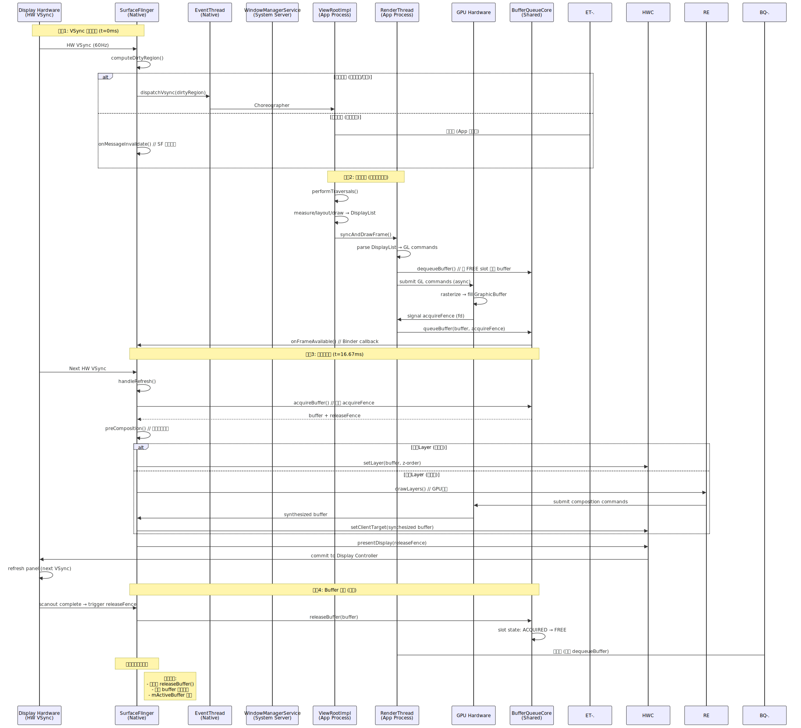

# Android 页面绘制全景解析

> 基于 AOSP Android 13（android-13.0.0_r81）源码。本文从 View 绘制三大流程出发，深入到 Surface/BufferQueue/SurfaceFlinger 的渲染管线，覆盖完整的 Activity → Window → DecorView → ViewRootImpl → Surface → BufferQueue → SurfaceFlinger 链路。

---

## 一、核心结论速览

在深入细节之前，先建立三个关键认知：

> **1. 静态界面持续显示原理 -- Buffer Holding 机制**：SurfaceFlinger 持有已合成的 buffer，每帧重复使用同一帧数据。无新帧 != 无显示，绘制（生产）与显示（消费）完全解耦。

> **2. VSync 按需分发 -- 脏区域驱动**：仅当窗口有脏区域（用户交互/动画/属性变更）时，EventThread 才分发 VSync 信号。静态界面无脏区域 → 不分发 → 应用零绘制（省电 90%+）。

> **3. BufferQueue 跨进程共享**：Producer（App）与 Consumer（SurfaceFlinger）共享同一个 BufferQueueCore 实例，通过 Binder 传递指针实现零拷贝。64 个 slot 是元数据容器，实际 buffer 数量动态分配（2-3 个用于 UI）。

---

## 二、View 绘制三大流程

ViewRootImpl 是整个 View 体系的核心管理者，负责驱动 measure → layout → draw 三大流程。

### 2.1 触发时机

```
Activity.onResume()
  → WindowManager.addView(decorView, layoutParams)
    → WindowManagerGlobal.addView()
      → new ViewRootImpl()
      → ViewRootImpl.setView(decorView)
        → requestLayout()
          → scheduleTraversals()
            → Choreographer.postCallback(CALLBACK_TRAVERSAL, mTraversalRunnable)
              → 等待 VSync 信号
                → doTraversal()
                  → performTraversals()  ← 三大流程的入口
```

### 2.2 performTraversals() -- 三大流程入口

```java
// frameworks/base/core/java/android/view/ViewRootImpl.java
private void performTraversals() {
    // 阶段 1：测量
    if (layoutRequested) {
        performMeasure(childWidthMeasureSpec, childHeightMeasureSpec);
    }

    // 阶段 2：布局
    if (didLayout) {
        performLayout(lp, desiredWindowWidth, desiredWindowHeight);
    }

    // 阶段 3：绘制
    if (!cancelDraw) {
        performDraw();
    }
}
```

### 2.3 Measure -- 测量

**MeasureSpec**（32 位 int）由父 View 传给子 View，包含测量模式和大小：

| 模式 | 含义 | 对应布局参数 |
|------|------|-------------|
| `EXACTLY` | 精确大小 | `match_parent` 或具体 dp 值 |
| `AT_MOST` | 最大不超过给定大小 | `wrap_content` |
| `UNSPECIFIED` | 不限制 | ScrollView 内的子 View |

```java
// View.java
protected void onMeasure(int widthMeasureSpec, int heightMeasureSpec) {
    setMeasuredDimension(
        getDefaultSize(getSuggestedMinimumWidth(), widthMeasureSpec),
        getDefaultSize(getSuggestedMinimumHeight(), heightMeasureSpec)
    );
}

// ViewGroup.java -- 递归测量所有子 View
protected void measureChildren(int widthMeasureSpec, int heightMeasureSpec) {
    for (int i = 0; i < count; i++) {
        final View child = getChildAt(i);
        if (child.getVisibility() != GONE) {
            measureChild(child, widthMeasureSpec, heightMeasureSpec);
        }
    }
}
```

> **关键**：`measure()` 方法是 `final` 的，内部有缓存机制 -- 只有 MeasureSpec 发生变化时才会真正调用 `onMeasure()`。这是 View 系统的性能优化之一。

### 2.4 Layout -- 布局

确定每个 View 在父容器中的位置（left, top, right, bottom）：

```java
// View.java
public void layout(int l, int t, int r, int b) {
    // 判断位置是否变化
    boolean changed = setFrame(l, t, r, b);
    if (changed || (mPrivateFlags & PFLAG_LAYOUT_REQUIRED) != 0) {
        onLayout(changed, l, t, r, b); // 子类重写此方法
    }
}
```

- `View.onLayout()`：空实现，叶子节点无需布局子 View
- `ViewGroup.onLayout()`：抽象方法，由 LinearLayout/ConstraintLayout 等实现，决定子 View 的摆放位置

### 2.5 Draw -- 绘制

绘制遵循固定顺序（后绘制的覆盖先绘制的）：

```java
// View.java
public void draw(Canvas canvas) {
    // 1. 绘制背景
    drawBackground(canvas);

    // 2. 保存 canvas 状态（如果需要绘制 fading edge）
    // 3. 绘制自身内容
    onDraw(canvas);

    // 4. 绘制子 View（ViewGroup 才有）
    dispatchDraw(canvas);

    // 5. 绘制前景（滚动条等装饰）
    onDrawForeground(canvas);

    // 6. 绘制默认焦点高亮
    drawDefaultFocusHighlight(canvas);
}
```

> **硬件加速路径（Android 4.0+ 默认）**：View 的绘制操作不会直接操作 Canvas 上的像素，而是被记录为 **DisplayList**（RenderNode 中的绘制指令序列）。这些指令由 RenderThread 异步提交给 GPU 执行，主线程不必等待 GPU 渲染完成。

---

## 三、类持有关系图 -- 三进程架构

Android 的图形系统跨三个进程协作：



### 关键持有关系说明

**WindowManagerGlobal 全局管理：**

```java
// frameworks/base/core/java/android/view/WindowManagerGlobal.java
public final class WindowManagerGlobal {
    private static WindowManagerGlobal sDefaultWindowManager; // 单例

    // 三个平行列表，管理当前进程所有窗口
    private final ArrayList<View> mViews = new ArrayList<>();          // DecorView 列表
    private final ArrayList<ViewRootImpl> mRoots = new ArrayList<>();  // ViewRootImpl 列表
    private final ArrayList<WindowManager.LayoutParams> mParams = new ArrayList<>();

    public void addView(View view, ViewGroup.LayoutParams params) {
        ViewRootImpl root = new ViewRootImpl(context, display);
        mViews.add(view);
        mRoots.add(root);
        mParams.add(wparams);
        root.setView(view, wparams, panelParentView); // 建立连接
    }
}
```

**ViewRootImpl 与 DecorView 双向关联：**

```java
// frameworks/base/core/java/android/view/ViewRootImpl.java
public final class ViewRootImpl implements ViewParent {
    final View mView; // 持有 DecorView（正向）

    public void setView(View view, WindowManager.LayoutParams attrs) {
        mView = view;               // 保存 DecorView 引用
        view.assignParent(this);    // DecorView.mParent = this（反向）
    }
}
```

**BufferQueue 跨进程共享（核心！）：**

```cpp
// frameworks/native/libs/gui/BufferQueueProducer.cpp
BufferQueueProducer::BufferQueueProducer(const sp<BufferQueueCore>& core)
    : mCore(core) {} // Producer 持有 core 强引用

// frameworks/native/libs/gui/BufferQueueConsumer.cpp
BufferQueueConsumer::BufferQueueConsumer(const sp<BufferQueueCore>& core)
    : mCore(core) {} // Consumer 持有 core 强引用

// 两者指向同一内存地址的 BufferQueueCore，实现零拷贝共享
```

> **关键认知**：BufferQueueProducer 与 BufferQueueConsumer **共享同一个 BufferQueueCore**，通过 Binder 传递指针实现跨进程零拷贝。64 个 slot 是元数据容器（约 6.4KB），实际 GraphicBuffer 通过 ashmem/ION 分配共享内存（约 4MB/个，1080p）。

---

## 四、VSync 驱动的渲染流水线

从 VSync 信号到屏幕刷新的完整事件链，包含四个阶段。



### 4.1 阶段一：VSync 信号分发

```
Display Hardware ──HW VSync 60Hz──► SurfaceFlinger
                                        │
                                        │ computeDirtyRegion()
                                        │
                                   有脏区域?
                                   /        \
                                 是            否
                                /                \
                 EventThread 分发 VSync       SurfaceFlinger 仅自身合成
                        │                    （重复使用旧帧，不通知 App）
                        ▼
              Choreographer.doFrame()
              （App 开始绘制）
```

**脏区域检测源码：**

```cpp
// frameworks/native/services/surfaceflinger/SurfaceFlinger.cpp
Region SurfaceFlinger::computeDirtyRegion(const DisplayDevice& display) {
    Region dirty;
    for (const auto& layer : mDrawingState.layersSortedByZ) {
        if (layer->isVisible()) {
            dirty |= layer->getDirtyRegion(); // 合并所有 Layer 脏区域
        }
    }
    return dirty & display.getBounds();
}
```

> **静态界面省电原理**：无脏区域 → 不分发 VSync → App 零绘制（CPU/GPU 休眠）→ 仅 SurfaceFlinger 合成旧帧（功耗约 1-2mW）。

### 4.2 阶段二：应用绘制

```
Choreographer.doFrame()
    │
    ▼
ViewRootImpl.performTraversals()
    → measure / layout / draw
    → 生成 DisplayList / RenderNode
    │
    ▼
RenderThread.syncAndDrawFrame()
    → 解析 DisplayList → GL 指令
    → dequeueBuffer()     ← 从 BufferQueue 获取空闲 buffer
    → GPU 执行渲染指令     ← 异步光栅化，填充 GraphicBuffer
    → queueBuffer()        ← 渲染完成，提交 buffer 到队列
    │
    ▼
BufferQueue → onFrameAvailable() → 通知 SurfaceFlinger
```

### 4.3 阶段三：合成与显示

```
下一个 HW VSync 到来
    │
    ▼
SurfaceFlinger.handleRefresh()
    → acquireBuffer()           ← 从 BufferQueue 获取已渲染的 buffer
    → preComposition()          ← 计算各 Layer 可见区域
    │
    ├── 简单 Layer（不透明）→ HWComposer 直接合成（硬件 overlay）
    │
    └── 复杂 Layer（半透明）→ RenderEngine GPU 合成
                                │
                                ▼
    → HWComposer.presentDisplay()
    → Display Controller 输出到屏幕
    → 用户看到画面
```

### 4.4 阶段四：Buffer 释放

```
Display 扫描完成（releaseFence 信号）
    │
    ▼
SurfaceFlinger → releaseBuffer()
    → slot 状态: ACQUIRED → FREE
    → App 的 RenderThread 可重新 dequeueBuffer() 使用
```

---

## 五、BufferQueue 核心机制



### 5.1 Buffer 状态流转

BufferQueueCore 内部维护 64 个 slot 的状态数组：

```cpp
// frameworks/native/libs/gui/BufferQueueCore.h
static constexpr int NUM_BUFFER_SLOTS = 64;

enum BufferState { FREE, DEQUEUED, QUEUED, ACQUIRED };

struct BufferSlot {
    sp<GraphicBuffer> mGraphicBuffer; // 指向实际 buffer（可能为 null）
    BufferState mBufferState;
    sp<Fence> mFence;
};
```

**状态流转：**

```
          App (Producer)                     SurfaceFlinger (Consumer)
               │                                     │
    dequeueBuffer()                                   │
     FREE ──────► DEQUEUED                            │
               │                                      │
    GPU 渲染...                                        │
               │                                      │
    queueBuffer()                                     │
     DEQUEUED ──► QUEUED ─── onFrameAvailable() ────► │
               │                              acquireBuffer()
               │                              QUEUED ──► ACQUIRED
               │                                      │
               │                              合成 + 显示...
               │                                      │
               │                              releaseBuffer()
               │         ◄──────────────── ACQUIRED ──► FREE
               │                                      │
    可再次 dequeueBuffer()                              │
```

### 5.2 资源分析

| 资源类型 | 单个大小 | 64 个总量 | 实际分配 | 说明 |
|----------|---------|----------|---------|------|
| **Slot 元数据** | ~100 字节 | ~6.4 KB | 64 个（静态分配） | BufferSlot 结构体数组 |
| **GraphicBuffer** | ~4 MB (1080p) | 256 MB | 2-3 个（动态按需） | ashmem/ION 共享内存 |

> 64 个 slot 仅 6.4 KB（可忽略），实际 GraphicBuffer 按需分配。64 是安全上限，防止资源耗尽。普通 UI 只使用 2-3 个 buffer（双缓冲/三缓冲）。

### 5.3 BufferQueueCore 创建与共享

```cpp
// frameworks/native/services/surfaceflinger/SurfaceFlinger.cpp
status_t SurfaceFlinger::createLayer(...) {
    // 1. 创建唯一的 BufferQueueCore（在 SurfaceFlinger 进程）
    sp<BufferQueueCore> core = new BufferQueueCore();

    // 2. 创建 Producer 和 Consumer，共享同一个 core
    sp<BufferQueueProducer> producer = new BufferQueueProducer(core);
    sp<BufferQueueConsumer> consumer = new BufferQueueConsumer(core);

    // 3. 创建 Layer，持有 Consumer
    sp<Layer> layer = new Layer(..., consumer);

    // 4. 通过 Binder 将 Producer 传递给 App（附带 core 指针）
    outBufferQueueProducer = IGraphicBufferProducer::asBinder(producer);
    return NO_ERROR;
}
```

### 5.4 GraphicBuffer 零拷贝原理

GraphicBuffer 通过 Gralloc HAL 分配共享内存（ashmem 或 ION），Producer 和 Consumer 通过 mmap 映射同一块物理内存，实现像素数据的零拷贝传递：

```cpp
// frameworks/native/libs/ui/GraphicBufferAllocator.cpp
status_t GraphicBufferAllocator::allocate(...) {
    // 通过 Gralloc HAL 分配共享内存
    err = mAllocDev->alloc(..., &handle, &stride);
    // handle 包含 ashmem fd 和物理地址（native_handle_t）
    return err;
}
```

**跨进程传递内容分离：**

| 交互类型 | 传递内容 | 机制 | 数据量 |
|----------|---------|------|--------|
| **元数据** | slot ID、时间戳、Fence fd | Binder IPC | ~100 字节/帧 |
| **像素数据** | GraphicBuffer 内容 | ashmem/ION 共享内存（mmap） | ~4 MB/帧 (1080p) |
| **同步信号** | GPU/Display 完成事件 | Linux Sync Fence (fd) | 4 字节 (fd) |

---

## 六、Fence 同步机制

Fence 是硬件级别的同步原语，确保 GPU/Display 的异步操作与 CPU 正确同步。

### 6.1 两种关键 Fence

| Fence 类型 | 产生方 | 等待方 | 作用 |
|------------|--------|--------|------|
| **acquireFence** | GPU（渲染完成时） | SurfaceFlinger | 确保 GPU 渲染完成后再读取 buffer |
| **releaseFence** | Display Controller（扫描完成时） | App（RenderThread） | 确保 Display 读完后再重用 buffer |

### 6.2 Fence 传递流程

```
App RenderThread                    SurfaceFlinger
    │                                    │
    │ GPU 渲染完成                        │
    │ 生成 acquireFence                  │
    │                                    │
    │── queueBuffer(acquireFence) ──────►│
    │                                    │ acquireBuffer()
    │                                    │ wait(acquireFence) ← 等待 GPU 完成
    │                                    │ 合成
    │                                    │ presentDisplay()
    │                                    │ 生成 releaseFence
    │◄── releaseBuffer(releaseFence) ────│
    │                                    │
    │ dequeueBuffer()                    │
    │ wait(releaseFence) ← 等待显示完成   │
    │ 开始渲染下一帧                      │
```

---

## 七、静态界面持续显示（Buffer Holding）

这是一个常见的认知误区需要澄清。

### 7.1 纠正常见误解

| 误解 | 正确机制 | 源码证据 |
|------|---------|---------|
| "无绘制 = 黑屏" | Buffer Holding：SurfaceFlinger 持有 ACQUIRED buffer 重复合成 | `Layer::getBuffer()` 始终返回 `mActiveBuffer` |
| "每帧需要新 buffer" | 合成引擎接受任意有效 buffer（新旧均可） | `CompositionEngine::present()` 无新旧检查 |
| "buffer 用完即释放" | 仅当 `mActiveBuffer` 变更时才 `releaseBuffer()` | `Layer::releasePendingBuffers()` 条件判断 |

### 7.2 源码分析

```cpp
// frameworks/native/services/surfaceflinger/Layer.cpp
sp<GraphicBuffer> Layer::getBuffer() const {
    return mActiveBuffer; // 始终返回当前持有的 buffer
}

void Layer::onFrameAvailable(const BufferItem& item) {
    mActiveBuffer = item.mGraphicBuffer; // 新帧到来：更新 active buffer
    mDirtyRegion = mVisibleRegion;
}

void Layer::releasePendingBuffers() {
    // 仅当 mActiveBuffer 变更时才 release 旧 buffer
    if (mActiveBuffer != mPreviousBuffer) {
        mConsumer->releaseBuffer(mPreviousBufferSlot, ...);
        mPreviousBuffer = mActiveBuffer;
    }
    // 无新帧时：mActiveBuffer 不变 → 不 release → buffer 保持 ACQUIRED 状态
}
```

> **本质**：绘制（生产）与显示（消费）完全解耦。无新帧时，SurfaceFlinger 重复使用旧帧合成，屏幕持续显示上一次的内容。

---

## 八、不同场景的 Buffer 需求

| 场景 | 典型 buffer 数 | 原因 |
|------|---------------|------|
| **普通 UI** | 2-3（双/三缓冲） | 双缓冲基础，卡顿时动态扩容为三缓冲 |
| **Camera 预览** | 4-8 | HAL3 pipeline depth 要求，多帧在 ISP 中并行处理 |
| **视频播放** | 3-5 | MediaCodec 输出队列需预分配 |
| **分屏/多窗口** | 6+ | 每个窗口独立需要 2-3 个 buffer |

**Camera 需要更多 buffer 的原因：**

```
// ISP 处理延迟 60-100ms > 30fps 帧间隔 33ms
// 必须同时持有多个 request 维持 pipeline 满载
min_buffers = ceil(ISP_latency / frame_interval) + 1

// 30fps (33ms) + 80ms 延迟 → ceil(80/33) + 1 = 4 个
// 60fps (16.67ms) + 80ms 延迟 → ceil(80/16.67) + 1 = 6 个
```

---

## 九、设计哲学总结

### 9.1 生产者-消费者解耦

- **生产者（App）**：按需生产（有脏区域时绘制）
- **消费者（SurfaceFlinger）**：持续消费（无论新旧帧都合成显示）
- 结果：静态界面实现 **零绘制 + 持续显示**

### 9.2 元数据与像素分离

- **Binder 传元数据**：低频，约 100B/帧（slot ID、时间戳、Fence fd）
- **Shared Memory 传像素**：高频，约 4MB/帧（GraphicBuffer 通过 mmap）
- 结果：最小化 IPC 开销

### 9.3 确定性时序

- **VSync 全局时钟**：统一调度应用绘制（app-VSync）与系统合成（sf-VSync）
- **Fence 硬件级同步**：避免 GPU/Display 读写冲突
- 结果：确定性的帧调度，是避免 jank 的根本保障

---

## 十、常见面试题与解答

### Q1：描述 View 绘制的三大流程

**答**：View 绘制由 ViewRootImpl 驱动，经历 measure → layout → draw 三个阶段：

1. **Measure（测量）**：从 DecorView 开始递归测量每个 View 的宽高。父 View 通过 MeasureSpec（包含模式和大小）约束子 View。子 View 在 `onMeasure()` 中计算自身大小并调用 `setMeasuredDimension()` 确定。
2. **Layout（布局）**：从 DecorView 开始递归确定每个 View 的位置（left, top, right, bottom）。ViewGroup 在 `onLayout()` 中决定子 View 的摆放位置。
3. **Draw（绘制）**：按固定顺序绘制 -- 背景 → 自身内容（onDraw）→ 子 View（dispatchDraw）→ 前景装饰。硬件加速模式下，绘制操作被记录为 DisplayList，由 RenderThread 异步提交给 GPU。

三大流程在每次 VSync 信号到来时，由 Choreographer 调度 ViewRootImpl.performTraversals() 触发。

---

### Q2：invalidate() 和 requestLayout() 的区别

**答**：

- **`invalidate()`**：标记 View 需要重绘（脏区域），只触发 `draw()` 流程，不会重新测量和布局。适用于 View 内容变化但大小不变的场景（如颜色改变、文字更新）。
- **`requestLayout()`**：标记 View 需要重新测量和布局，会触发完整的 `measure() → layout() → draw()` 流程。适用于 View 大小可能变化的场景（如设置新文本导致宽度变化）。

两者都会调用 `scheduleTraversals()`，在下一个 VSync 时执行。但 `invalidate` 只设置 `PFLAG_DIRTY`，`requestLayout` 还设置 `PFLAG_FORCE_LAYOUT` 和 `PFLAG_INVALIDATED`。

---

### Q3：硬件加速和软件渲染有什么区别？

**答**：

| 维度 | 软件渲染 | 硬件加速（Android 4.0+ 默认） |
|------|---------|---------------------------|
| **渲染者** | CPU（主线程 Skia 直接绘制到 Bitmap） | GPU（RenderThread 将 DisplayList 提交给 GPU） |
| **线程** | 主线程 | RenderThread（独立线程） |
| **优势** | 兼容性好，所有 Canvas API 都支持 | 性能好，GPU 并行处理大量像素操作 |
| **劣势** | 慢，阻塞主线程 | 部分 Canvas API 不支持（如 `Canvas.drawBitmapMesh` 的部分用法） |
| **局部刷新** | 支持（只重绘 dirty 区域） | DisplayList 机制天然支持，且能利用 RenderNode 缓存 |

硬件加速的核心优化：View 的绘制操作被记录为 DisplayList，存储在 RenderNode 中。只有发生变化的 View 需要更新其 DisplayList，未变化的 View 直接复用。RenderThread 异步执行 GPU 渲染，不阻塞主线程。

---

### Q4：Choreographer 的作用是什么？

**答**：Choreographer（编舞者）是 Android 的帧调度中枢，协调 Input 事件、动画、View 绘制在 VSync 信号驱动下有序执行。

**工作流程**：
1. 注册回调到 Choreographer（如 `scheduleTraversals` 注册 CALLBACK_TRAVERSAL）
2. Choreographer 向 SurfaceFlinger 请求下一个 VSync 信号
3. VSync 到来时，按优先级顺序执行回调：
   - `CALLBACK_INPUT`：处理输入事件
   - `CALLBACK_ANIMATION`：执行属性动画
   - `CALLBACK_INSETS_ANIMATION`：Insets 动画
   - `CALLBACK_TRAVERSAL`：View 的 measure/layout/draw

**VSync 按需请求**：Choreographer 不会持续接收 VSync，只在有回调注册时才请求。静态界面无回调 → 不请求 VSync → 零开销。

---

### Q5：为什么说"静态界面不绘制但仍然显示"？

**答**：这涉及生产者-消费者解耦的设计：

- **绘制（生产）**：App 只在有脏区域（UI 变化）时才绘制新帧，填充 GraphicBuffer 提交到 BufferQueue
- **显示（消费）**：SurfaceFlinger 每个 VSync 周期都会合成显示。无新帧时，Layer 的 `mActiveBuffer` 保持不变（Buffer Holding），SurfaceFlinger 重复使用这个 buffer 合成输出

所以静态界面：
- App 侧：无脏区域 → 不收到 VSync → 不执行任何绘制 → CPU/GPU 空闲
- SurfaceFlinger 侧：持有上一帧的 buffer → 每帧重复合成 → 屏幕持续显示

这是 Android 图形系统低功耗设计的核心。

---

### Q6：什么是 Surface？它与 View 的关系是什么？

**答**：Surface 是 App 与 SurfaceFlinger 之间传递图形数据的接口，代表一块可以被渲染的画布。

**关系链**：
- 每个 `Window`（PhoneWindow）对应一个 `ViewRootImpl`
- 每个 `ViewRootImpl` 持有一个 `Surface`
- `Surface` 内部持有 `BufferQueueProducer`，通过它向 BufferQueue 提交渲染好的 buffer
- SurfaceFlinger 中对应的 `Layer` 通过 `BufferQueueConsumer` 读取 buffer

一个 App 可以有多个 Surface（多个 Window，如 Dialog、PopupWindow），每个 Surface 独立向 SurfaceFlinger 提交帧。

---

### Q7：解释双缓冲和三缓冲

**答**：

**双缓冲（Double Buffering）**：
- 2 个 GraphicBuffer：一个正在被 Display 显示（front buffer），一个正在被 App 渲染（back buffer）
- 渲染完成后交换。问题：如果渲染超过一个 VSync 周期，Display 要显示时新帧还没准备好，导致掉帧

**三缓冲（Triple Buffering）**：
- 3 个 GraphicBuffer：Display 显示一个、SurfaceFlinger 持有一个、App 渲染一个
- 即使上一帧渲染超时，App 仍有空闲 buffer 可以立即开始下一帧渲染，减少连续掉帧
- Android 在检测到持续卡顿时会自动从双缓冲扩容为三缓冲

**代价**：三缓冲增加一帧延迟（从触摸到显示多一帧），但换来更流畅的帧率稳定性。

---

### Q8：DecorView、PhoneWindow、ViewRootImpl 之间的关系

**答**：

- **PhoneWindow**：Activity 的窗口实现，是 Window 抽象类的唯一子类。持有 DecorView 引用（`mDecor`），管理窗口的装饰（标题栏、导航栏等）
- **DecorView**：继承自 FrameLayout，是整个 View 树的根 View。包含系统装饰（状态栏区域、导航栏区域）和用户内容区域（`android.R.id.content`），`setContentView()` 的布局被添加到 content 区域
- **ViewRootImpl**：View 树与 WindowManagerService 之间的桥梁。持有 DecorView 引用（`mView`），负责驱动三大绘制流程、处理输入事件分发、管理 Surface 和与 WMS 的 Binder 通信

**创建时序**：Activity.onCreate() 中 `setContentView()` 创建 PhoneWindow 和 DecorView；`onResume()` 之后 `WindowManager.addView()` 创建 ViewRootImpl 并建立三者的连接。

---

## 十一、总结

Android 图形系统是一个**精密的多级流水线**：

```
View 绘制         RenderThread 渲染       BufferQueue 传递        SurfaceFlinger 合成      Display 显示
measure ──►       DisplayList ──►         dequeue/queue ──►       acquire/compose ──►      refresh
layout             → GL 指令               GraphicBuffer            HWC/GPU                  panel
draw               → GPU 光栅化            共享内存传递              多 Layer 合成
```

理解三个核心机制：
1. **脏区域驱动按需绘制** -- 只有 UI 变化时才绘制，静态界面零开销
2. **Buffer Holding 持续显示** -- 无新帧时复用旧帧，绘制与显示解耦
3. **元数据与像素分离传递** -- Binder 传控制信息，共享内存传像素数据

是掌握 Android 图形系统的关键。
