# RecyclerView 核心原理与缓存机制深度解析

> RecyclerView 是 Android 渲染极其复杂长列表的唯一之选。理解它的四级缓存机制、预取原理以及与 LayoutManager 的交互边界，是资深 Android 工程师进行极限复杂 UI 优化的必经之路。

---

## 一、RecyclerView 的架构哲学

与 ListView 典型的“大包大揽”不同，RecyclerView 的设计核心是**高度解耦**。它本质上只是一个包含滑动逻辑的容器，将具体工作分发给不同的组件：

| 核心组件 | 职责职责 |
|------|------|
| **LayoutManager** | 布局管理器。决定 Item 怎么排列（线性、网格、瀑布流），并在需要时向 Recycler 请求 View |
| **Adapter** | 数据适配器。数据与 UI 的桥梁，负责创建 ViewHolder 并绑定数据 |
| **Recycler** | 缓存管理器。整个缓存体系的核心，负责 View 的回收和复用 |
| **ItemAnimator** | 动画执行器。负责 Item 增删改查时的动画效果 |
| **ItemDecoration** | 装饰器。负责绘制分割线或高亮边框等独立绘制逻辑 |

> **面试关键点**：ListView 的 `getView()` 和缓存是一体的，而 RecyclerView 强制使用 `ViewHolder` 模式，将**视图创建**（`onCreateViewHolder`）和**数据绑定**（`onBindViewHolder`）彻底解耦。

---

## 二、四级缓存机制深度拆解

Recycler 的缓存体系被严格划分为四级。当 LayoutManager 请求一个 View 时，Recycler 会按优先级依次向下层查找。

### 结构总览





```java
public final class Recycler {
    final ArrayList<ViewHolder> mAttachedScrap = new ArrayList<>(); // 一级：mAttachedScrap (配合 mChangedScrap)
    ArrayList<ViewHolder> mCachedViews = new ArrayList<>();         // 二级：mCachedViews (默认大小 2)
    private ViewCacheExtension mViewCacheExtension;                 // 三级：自定义扩展缓存 (默认 null)
    RecycledViewPool mRecyclerPool;                                 // 四级：RecycledViewPool (默认每种类型存 5 个)
}
```

### 2.1 一级缓存：Scrap (mAttachedScrap / mChangedScrap)

*   **特点**：仅仅用于**正在进行布局（Layout）的过程中**。
*   **触发场景**：列表正在滑动，或者调用 `notifyItemXXX()` 引起局部刷新时，屏幕内暂存的 View。
*   **用途**：
    *   `mAttachedScrap`：存储没有被改变，不需要重新绑定数据的 ViewHolder（如单纯的滑动滑出的 View，在 Layout 阶段暂时剥离）。
    *   `mChangedScrap`：存储数据发生了变化，调用了 `notifyItemChanged()` 需要重新绑定的 ViewHolder（并且通常用于动画过渡期的重用）。
*   **命中结果**：如果从 `mAttachedScrap` 拿到了 ViewHolder，**完全不需要重新走 `onBindViewHolder`**。

### 2.2 二级缓存：mCachedViews

*   **特点**：离屏缓存，默认容量**只有 2 个**。
*   **触发场景**：用户滑动列表，刚刚滑出屏幕外的 ViewHolder。
*   **核心逻辑（FIFO）**：当滑出的 ViewHolder 超过 2 个时，采用**先进先出**的原则。最早被放入 `mCachedViews` 的被挤出，清空里面的数据，扔进第四级缓存 `RecycledViewPool` 中。
*   **命中结果**：存放的是带有具体位置（Position）和数据的 ViewHolder。**滑回去时直接命中（位置匹配），不需要重新 `onBindViewHolder`**。
*   **使用建议**：对于来回反复滑动的小范围操作，这层缓存极大提升了流畅度。可通过 `setItemViewCacheSize(int)` 修改容量，但通常没必要。

### 2.3 三级缓存：ViewCacheExtension

*   **特点**：开发者自定义实现的缓存拦截器。
*   **触发场景**：前两级都没命中时，如果开发者设置了，就会向其索要。
*   **实际现状**：**基本没人用**。哪怕是复杂的业务线，系统默认的机制已经足够强大，强行干预大概率会导致显示错乱。这层纯粹为了满足极端场景（如 View 需要跨越多个界面的生命周期保持）。

### 2.4 四级缓存：RecycledViewPool

*   **特点**：终极对象池，按 `viewType` 分类缓存，默认每种类型存放 **5 个**。
*   **触发场景**：从 `mCachedViews` 挤出来的 View，或者主动被移除的 View。
*   **核心逻辑**：存入 Pool 之前会**擦除所有重置状态和数据**（即调用 `ViewHolder.resetInternal()`）。
*   **命中结果**：从 Pool 中取出的 ViewHolder，相当于一个“干净的壳子”，**必须重新调用 `onBindViewHolder` 进行数据绑定**（但省去了 `onCreateViewHolder` 解析 XML 的耗时）。
*   **跨列表复用**：`RecyclerView` 允许调用 `setRecycledViewPool()` 来共享给多个 RecyclerView（典型场景：嵌套的 ViewPager2 或者是多层嵌套相同样式的横向滚动带）。

---

## 三、获取缓存的核心源码流程

当 LayoutManager 通知 Recycler 提供 View（`getViewForPosition`）时，查找顺序源码精简逻辑如下：

```java
// Recycler.getViewForPosition()
View getViewForPosition(int position, boolean dryRun) {
    // 1. 尝试从 mChangedScrap 中获取（针对动画场景）
    if (mState.isPreLayout()) {
        holder = getChangedScrapViewForPosition(position);
    }
    
    // 2. 尝试从 mAttachedScrap 中获取 (位置精准匹配)
    if (holder == null) {
        holder = getScrapOrHiddenOrCachedHolderForPosition(position, dryRun);
    }
    
    // 3. 尝试从 ViewCacheExtension 中自定义获取（极少用到）
    if (holder == null && mViewCacheExtension != null) {
        View view = mViewCacheExtension.getViewForPositionAndType(this, position, type);
    }
    
    // 4. 尝试从终极缓存池 RecycledViewPool 中查找 (依 viewType 匹配)
    if (holder == null) {
        holder = getRecycledViewPool().getRecycledView(type);
        if (holder != null) {
            holder.resetInternal(); // 重置内部状态，所以后续必须 rebind
        }
    }
    
    // 5. 如果所有的四级缓存都没有，只能老老实实 Create 新的
    if (holder == null) {
        holder = mAdapter.onCreateViewHolder(RecyclerView.this, type);
    }
    
    // 6. 是否需要绑定数据？
    if (mState.isPreLayout() && holder.isBound()) {
        // do not update
    } else if (!holder.isBound() || holder.needsUpdate() || holder.isInvalid()) {
        mAdapter.onBindViewHolder(holder, offsetPosition); 
    }
    
    return holder.itemView;
}
```

---

## 四、View 回收流程

当 View 从屏幕滑出或被主动移除时，RecyclerView 会通过 `recycleViewHolderInternal()` 决定它的去向。这个"分流"逻辑是理解缓存体系的另一半拼图。

### 4.1 recycleViewHolderInternal 核心逻辑

```java
// RecyclerView.Recycler
void recycleViewHolderInternal(ViewHolder holder) {
    // 1. 判断是否可以放入 mCachedViews
    //    条件：holder 未被标记为 INVALID、未被移除、非 transient
    if (forceRecycle || holder.isRecyclable()) {
        if (mViewCacheMax > 0
                && !holder.hasAnyOfTheFlags(FLAG_INVALID | FLAG_REMOVED | FLAG_UPDATE)) {
            // 2. mCachedViews 满了 → FIFO 淘汰最老的到 Pool
            int cachedViewSize = mCachedViews.size();
            if (cachedViewSize >= mViewCacheMax && cachedViewSize > 0) {
                recycleCachedViewAt(0); // 将 index=0（最早进入的）移到 Pool
                cachedViewSize--;
            }
            // 3. 将当前 holder 追加到 mCachedViews 末尾
            mCachedViews.add(holder);
            cached = true;
        }
        if (!cached) {
            // 4. 无法进 mCachedViews → 直接进入 RecycledViewPool
            addViewHolderToRecycledViewPool(holder, true);
            recycled = true;
        }
    }
}
```

### 4.2 分流决策总结

| 条件 | 去向 | 数据状态 |
|------|------|---------|
| holder 有效、位置未变、mCachedViews 未满 | mCachedViews 末尾 | 保留 position + 绑定数据 |
| holder 有效、但 mCachedViews 已满 | 先淘汰最老的到 Pool，自身进入 mCachedViews | 同上 |
| holder 被标记 INVALID / REMOVED | 跳过 mCachedViews，直接进入 RecycledViewPool | 调用 `resetInternal()` 清空数据 |
| RecycledViewPool 对应 viewType 已满（默认 5） | **丢弃**，被 GC 回收 | -- |

> **关键认知**：mCachedViews 的 FIFO 淘汰是"挤出"式的 —— 被挤出的旧 holder 并不是被丢弃，而是"降级"到 RecycledViewPool 继续服务。只有连 Pool 都满了，holder 才会被真正回收。

### 4.3 Scrap 的回收时机

Scrap（mAttachedScrap / mChangedScrap）与上述流程不同，它们的生命周期仅存在于一次 `dispatchLayout` 过程中：

1. **Layout 开始**：`dispatchLayoutStep1` / `dispatchLayoutStep2` 阶段，屏幕上当前可见的 View 被 `detachAndScrapAttachedViews()` 临时放入 Scrap。
2. **Layout 过程中**：LayoutManager 在 fill 时从 Scrap 中取回需要的 View。
3. **Layout 结束**：`dispatchLayoutStep3` 阶段，Scrap 中剩余未被取走的 ViewHolder 会被 `removeAndRecycleScrapInt()` 清理 —— 走正常的 `recycleViewHolderInternal` 流程进入 mCachedViews 或 Pool。

---

## 五、LayoutManager 与 Recycler 的交互

LayoutManager 是 RecyclerView 中"指挥布局"的角色，而 Recycler 是"管理 View 供应"的角色。两者的交互贯穿整个滑动和刷新流程。

### 5.1 onLayoutChildren —— 全量布局的起点

以 `LinearLayoutManager` 为例，`onLayoutChildren()` 是核心入口：

```
onLayoutChildren()
  ├── detachAndScrapAttachedViews(recycler)   // 1. 把屏幕上所有 View 暂存到 Scrap
  ├── updateAnchorInfoForLayout()              // 2. 确定锚点（从哪个位置开始布局）
  ├── fill(recycler, layoutState, ...)         // 3. 从锚点向尾部填充
  └── fill(recycler, layoutState, ...)         // 4. 从锚点向头部填充
```

### 5.2 fill 过程 —— 逐个向 Recycler 要 View

`fill()` 是 LayoutManager 消费 View 的核心循环：

```java
int fill(RecyclerView.Recycler recycler, LayoutState layoutState, ...) {
    int remainingSpace = layoutState.mAvailable;
    while (remainingSpace > 0 && layoutState.hasMore(state)) {
        // 1. 向 Recycler 请求一个 View
        View view = layoutState.next(recycler);  // 内部调用 recycler.getViewForPosition()
        
        // 2. 将 View 添加到 RecyclerView
        if (layoutState.mScrapList == null) {
            addView(view);  // 正常添加
        } else {
            addDisappearingView(view);  // 动画中消失的 View
        }
        
        // 3. 测量并布局这个 View
        measureChildWithMargins(view, 0, 0);
        layoutDecoratedWithMargins(view, left, top, right, bottom);
        
        // 4. 更新剩余空间
        remainingSpace -= consumed;
    }
    return start - remainingSpace;  // 返回填充消耗的总空间
}
```

### 5.3 滑动时的回收与填充

用户手指滑动时触发 `scrollBy()`，该方法内部同样调用 `fill()`，但在填充新 View 之前，会先回收滑出屏幕的 View：

```
scrollBy(dy)
  ├── updateLayoutState()                      // 根据滑动方向更新布局状态
  ├── layoutState.mRecycle = true              // 标记需要回收
  ├── recycleByLayoutState(recycler, state)    // 回收滑出屏幕的 View（调用 removeAndRecycleView）
  └── fill(recycler, layoutState, ...)         // 填充即将滑入屏幕的 View
```

> **面试关键点**：理解 LayoutManager 的 `fill()`、Recycler 的 `getViewForPosition()` 和 `recycleViewHolderInternal()` 三者的协作关系，就掌握了 RecyclerView 滑动时"一边回收、一边复用"的核心机制。

---

## 六、渲染性能利器 —— 预取机制 (Prefetch)

Android 21（Lollipop）引入了 **渲染线程 (RenderThread)**。UI 线程负责计算坐标（CPU），RenderThread 负责把指令发给 GPU 同步给屏幕。
但如果某一帧 UI 线程需要计算很重的视图 `onBind`，耗时超过 16.6ms，RenderThread 拿不到数据，就会导致掉帧。

为了压榨最后的一点 CPU 空闲时间，RecyclerView 在 Android v25 引入了 **Prefetch（预取）机制**。

### 6.1 预取原理解析

当用户滑动列表时，如果当前帧的任务（UI 和 Render）很快做完了（比如只用了 10ms），距离 VSync 的 16.6ms 还有 6ms 的空闲：
*   RecyclerView 捕捉到滑动惯性方向，**预测**即将出现在屏幕上的下一个 View。
*   利用剩下的那一点空闲时间，**提前去执行下一个 ViewHolder 的 `onCreateViewHolder` 或 `onBindViewHolder`**。
*   一旦下一个 VSync 信号到来，系统不需要临时抱佛脚，直接能拿到预取好的 View 显示。

### 6.2 配置与局限

*   默认开启：`LinearLayoutManager` 默认预取前方 1 个，`GridLayoutManager` 默认预取一整行。
*   **嵌套场景的坑**：如果在 RecyclerView 中嵌套了横滑的 RecyclerView，内部的滑动预取通常不感知。外层可以调用 `setInitialPrefetchItemCount()` 告知内层去预取。

---

## 七、局部刷新：notifyDataSetChanged 为何被鄙视？

很多开发者由于惯性思维或嫌麻烦，经常一把梭哈 `notifyDataSetChanged()`。在 RecyclerView 中，这是极其危险和低效的行为。

### 7.1 发生了什么？

调用 `notifyDataSetChanged()` 会向系统发送强制标记 `INVALID`：
1. 它认为所有数据都无效。
2. RecyclerView 会把屏幕上所有的 View 强行打入四级缓存池 `RecycledViewPool`。
3. 接着强行从池子中捞出来全部重新执行完整的 `onBindViewHolder`。
4. 更糟糕的是，**连系统自带的 Item 动画（平移、淡入淡出）也会全部失效**。

### 7.2 最佳实践：DiffUtil 的崛起

`DiffUtil` 是 Google 针对局部差量刷新的官方解法，采用 Myers 差分算法计算新老数据集的差异，自动派发最细粒度的 `notifyItemInserted / Removed / Changed`。
现代 Android 开发中，**`ListAdapter` + `DiffUtil`** 已经是列表编写的标准强制准则，能够大幅提升长序列变化的渲染重构性能，且自动带有绚丽的默认动画。

---

## 八、ItemDecoration / ItemAnimator / SnapHelper

### 8.1 ItemDecoration —— 分割线与装饰绘制

ItemDecoration 提供三个核心回调：

| 回调方法 | 绘制时机 | 典型用途 |
|---------|---------|---------|
| `getItemOffsets()` | measure 阶段 | 为 Item 增加额外偏移量（留出分割线空间） |
| `onDraw()` | 在 Item **之前**绘制（底层） | 绘制分割线、背景色（会被 Item 遮挡） |
| `onDrawOver()` | 在 Item **之后**绘制（顶层） | 绘制悬浮吸顶 Header、覆盖式标记 |

> **关键区别**：`onDraw()` 画在 ItemView 下方（先画），`onDrawOver()` 画在 ItemView 上方（后画）。多个 ItemDecoration 按添加顺序依次执行。

### 8.2 ItemAnimator —— 增删改动画

`DefaultItemAnimator` 处理四种动画场景：

- **Add**：新 Item 从透明渐入（`alpha 0→1`）
- **Remove**：旧 Item 渐出消失（`alpha 1→0`）
- **Move**：Item 位置平移（`translationX/Y`）
- **Change**：旧 ViewHolder 渐出 + 新 ViewHolder 渐入（交叉动画，这就是 `mChangedScrap` 存在的原因）

动画执行流程：

```
notifyItemChanged(pos)
  → RecyclerView.onItemRangeChanged()
    → requestLayout()
      → dispatchLayoutStep1()    // pre-layout：记录旧位置，changed 的放入 mChangedScrap
      → dispatchLayoutStep2()    // real-layout：执行真正布局
      → dispatchLayoutStep3()    // post-layout：对比前后位置差异，触发 ItemAnimator 动画
```

> **面试关键点**：`mChangedScrap` 的存在是为了在 Change 动画中同时持有同一 position 的新旧两个 ViewHolder，使交叉渐变动画成为可能。如果调用 `setSupportsChangeAnimations(false)`，则不再使用 `mChangedScrap`。

### 8.3 SnapHelper —— 滑动对齐

SnapHelper 实现列表滑动后自动对齐到某个 Item 的效果：

| 实现类 | 对齐策略 | 典型场景 |
|-------|---------|---------|
| `LinearSnapHelper` | 对齐到最接近中心点的 Item | 横向画廊效果 |
| `PagerSnapHelper` | 每次只滑动一页，对齐方式类似 ViewPager | 卡片式翻页 |

核心原理：通过 `findSnapView()` 找到应对齐的目标 View，计算其与对齐点的距离差，然后通过 `smoothScrollBy()` 自动滚动到位。SnapHelper 内部注册了 `OnFlingListener`，拦截 fling 事件来控制滑动终点。

---

## 九、DiffUtil 与 AsyncListDiffer 深入

### 9.1 Myers 差分算法核心思想

DiffUtil 内部使用的是 Eugene W. Myers 在 1986 年提出的差分算法，目标是找到将旧列表转换为新列表的**最小编辑路径**（最少的插入 + 删除操作）。

核心概念：

- 将新旧列表对比抽象为一个二维网格上的路径搜索问题
- 横向移动 = 删除旧列表元素，纵向移动 = 插入新列表元素，对角线移动 = 元素相同（免费）
- 算法从左上角搜索到右下角，寻找对角线移动最多（即编辑操作最少）的路径
- 时间复杂度 O(N + D^2)，其中 D 是差异数量；列表变化小时接近 O(N)，变化大时退化

### 9.2 DiffUtil.Callback 设计

```java
public abstract class DiffUtil.Callback {
    // 旧列表大小
    public abstract int getOldListSize();
    // 新列表大小
    public abstract int getNewListSize();
    // 判断是否是"同一个 Item"（通常比较唯一 ID）
    public abstract boolean areItemsTheSame(int oldPos, int newPos);
    // 判断同一个 Item 的"内容是否相同"（决定是否需要 rebind）
    public abstract boolean areContentsTheSame(int oldPos, int newPos);
    // 可选：返回变化的具体字段（payloads），用于局部绑定优化
    @Nullable
    public Object getChangePayload(int oldPos, int newPos) { return null; }
}
```

> **设计精髓**：`areItemsTheSame` 和 `areContentsTheSame` 的两层判断实现了精准的最小化刷新 —— 前者决定 Item 是移动还是增删，后者决定是否需要重新绑定数据。

### 9.3 AsyncListDiffer —— 异步 Diff 线程模型

`DiffUtil.calculateDiff()` 在大数据集上可能耗时较长，不宜在主线程执行。`AsyncListDiffer`（以及封装它的 `ListAdapter`）解决了这个问题：

```
submitList(newList)
  → 后台线程（通常是 Dispatchers.Default / AsyncDifferConfig 指定的线程）：
      → DiffUtil.calculateDiff(oldList, newList)   // 耗时计算
  → 主线程回调：
      → adapter.dispatchUpdatesTo(result)           // 自动派发 notify 事件
```

关键细节：

- 连续快速提交多个列表时，AsyncListDiffer 会**丢弃中间结果**，只计算最后一次提交与当前列表的差异
- `ListAdapter` 内部持有的列表引用是不可变的，每次 `submitList` 必须传入新的 List 实例（传入同一个引用会被直接忽略）
- 可通过 `AsyncDifferConfig.Builder` 自定义后台执行 Executor

---

## 十、性能优化实战

### 10.1 setHasFixedSize(true)

当确定 Adapter 数据变化**不会影响 RecyclerView 自身的尺寸**时（绝大多数场景），调用此方法可跳过 `requestLayout()`，直接走内部的 `layoutChildren()`，避免触发对父布局的重新测量。

### 10.2 setHasStableIds(true)

启用稳定 ID 后，ViewHolder 通过 `getItemId()` 返回的唯一 ID（而非 position）来标识：

- `notifyDataSetChanged()` 时不再将全部 ViewHolder 打入 Pool，而是移到 Scrap 中按 ID 匹配复用
- 匹配成功的 ViewHolder 无需重新 `onBindViewHolder`，极大降低全量刷新的代价
- **前提**：必须重写 `getItemId()` 返回与数据实体对应的稳定唯一值

### 10.3 setItemViewCacheSize(int)

调整 `mCachedViews` 的容量（默认 2）。适合增大的场景：

- 来回反复滑动的短列表（如设置页），增大到 4-5 可减少 rebind
- **不建议盲目增大**：占用更多内存，且对单向长列表帮助不大

### 10.4 共享 RecycledViewPool

多个 RecyclerView 使用相同 viewType 时（典型：ViewPager2 中的多个 Tab 列表），共享同一个 Pool：

```kotlin
val sharedPool = RecyclerView.RecycledViewPool()
// 可选：增大某种 viewType 的缓存上限
sharedPool.setMaxRecycledViews(VIEW_TYPE_ITEM, 10)

tabRecyclerView1.setRecycledViewPool(sharedPool)
tabRecyclerView2.setRecycledViewPool(sharedPool)
```

### 10.5 Prefetch 调优

嵌套场景下的预取优化（外层纵向 + 内层横向）：

```kotlin
// 告诉外层 LayoutManager：内层 RecyclerView 初始可见 3.5 个 Item，需要预取 4 个
(outerRecyclerView.layoutManager as LinearLayoutManager)
    .isItemPrefetchEnabled = true  // 默认已开启

innerLayoutManager.initialPrefetchItemCount = 4
```

### 10.6 payloads 局部绑定

当 Item 只有部分字段变化时（如仅点赞数变了），通过 payloads 避免整个 ViewHolder rebind：

```kotlin
// 1. DiffUtil.Callback 中返回变化的字段
override fun getChangePayload(oldPos: Int, newPos: Int): Any? {
    val oldItem = oldList[oldPos]
    val newItem = newList[newPos]
    val diff = Bundle()
    if (oldItem.likeCount != newItem.likeCount) {
        diff.putInt("like_count", newItem.likeCount)
    }
    return if (diff.isEmpty) null else diff
}

// 2. Adapter 中处理局部绑定
override fun onBindViewHolder(holder: VH, position: Int, payloads: List<Any>) {
    if (payloads.isEmpty()) {
        // 全量绑定
        onBindViewHolder(holder, position)
        return
    }
    // 局部绑定：只更新变化的部分
    val bundle = payloads[0] as Bundle
    bundle.getInt("like_count", -1).takeIf { it >= 0 }?.let {
        holder.tvLikeCount.text = it.toString()
    }
}
```

> **优化效果**：payloads 局部绑定避免了 `onBindViewHolder` 中的全量 `setText / setImage` 调用，在频繁小更新的场景（如消息列表的已读状态）中能显著提升流畅度。

---

## 十一、RecyclerView vs ListView 本质区别

| 维度 | ListView | RecyclerView |
|------|---------|-------------|
| **ViewHolder** | 非强制，需手动实现 | 强制使用，框架约束 |
| **缓存层级** | 二级（ActiveViews + ScrapViews） | 四级（Scrap + CachedViews + Extension + Pool） |
| **缓存按 position 复用** | 不支持（复用必须 rebind） | mCachedViews 支持（命中免 rebind） |
| **布局管理** | 仅垂直列表 | LayoutManager 可扩展：线性/网格/瀑布流/自定义 |
| **局部刷新** | 不支持 | notifyItemXXX + DiffUtil |
| **Item 动画** | 无内置支持 | ItemAnimator 内置增删改移动画 |
| **分割线** | `divider` 属性，仅支持简单横线 | ItemDecoration 可自由绘制 |
| **嵌套滑动** | 不支持 | 实现了 NestedScrollingChild 接口 |
| **预取** | 无 | GapWorker Prefetch 机制 |

---

## 十二、常见面试题与解答


### Q1：`mCachedViews` 和 `RecycledViewPool` 有什么区别？

**答**：两者的核心区别在于**存放数据的维度和是否保留原本的数据绑定状态**：

1. **维度区别**：`mCachedViews` 是根据 `position` 来缓存的；而 `RecycledViewPool` 是根据 `viewType` 给 ViewHolder 分类缓存的。
2. **复用效率**：从 `mCachedViews` 取出 ViewHolder 时，其位置信息与屏幕滑回的位置一致，**无需再次调用 `onBindViewHolder`**，相当于完整的页面数据保留。从 `Pool` 中取出的 ViewHolder 则被强行剥离了位置和数据，**必须**重新执行 `onBindViewHolder`。
3. **容量区别**：`mCachedViews` 默认容量较小（2 个）；`Pool` 默认每种 `viewType` 缓存 5 个。

---

### Q2：如果有嵌套的 RecyclerView（如外卖首页横向滑动的金刚位），如何优化？

**答**：如果每个大列表中的 Item 内部都嵌着相同类型的弱水平滑动列表，当纵向滑动时，每个被创建的内层 RecyclerView 初始化都是极为沉重的代价。

**优化方案**：
1. **共享滑动池**：实例化一个全局的 `RecycledViewPool`。在 `onBindViewHolder` 时，通过 `innerRecyclerView.setRecycledViewPool(sharedPool)` 将同一个池共享给所有的横向列表，这极大节约了内部 ViewHolder 多次无意义的 `onCreate`。
2. **处理滑动冲突并设置恰当的 Prefetch**：调用外部 LayoutManager 的 `setInitialPrefetchItemCount` 指示预取策略。

---

### Q3：为什么 RecyclerView 调用 `notifyItemRemoved(position)` 后面数据的 position 不准确？

**答**：
当我们在位置 `0` 删除了数据，底层的数组是变了。但是对于还在屏幕上展示的 `position=1` 和 `position=2`，如果不发生重新绑定，在 ViewHolder 内部被点击时，去取 `getAdapterPosition()` 实际上没有立刻更新，可能引发 `IndexOutOfBoundsException`。

**解决策略**：如果是单纯列表点击，推荐使用 `holder.getLayoutPosition()` 返回实际视觉上的位置；如果强依赖底层数据源的绝对位置，可以辅助使用 `notifyItemRangeChanged` 刷新后续范围内的 Item 操作，或者全面拥抱 `DiffUtil` 避免此类手动脚手架问题。

---

### Q4：Scrap 缓存的生命周期是怎样的？mChangedScrap 存在的意义是什么？

**答**：

Scrap 是一种**临时性**缓存，仅存在于一次 `dispatchLayout` 过程中：

1. Layout 开始时，`detachAndScrapAttachedViews()` 将屏幕上所有 View 暂存到 `mAttachedScrap`（数据未变的）或 `mChangedScrap`（被 `notifyItemChanged` 标记的）。
2. Layout 过程中，LayoutManager 通过 `fill()` → `getViewForPosition()` 从 Scrap 中取回需要的 View。
3. Layout 结束后，Scrap 中剩余的 ViewHolder 被清理，走正常回收流程进入 mCachedViews 或 Pool。

**mChangedScrap 的意义**：在 Change 动画场景下，`DefaultItemAnimator` 需要对同一 position 同时持有新旧两个 ViewHolder 来执行交叉渐变动画。旧的存在 mChangedScrap 中用于渐出，新的从 Pool 或 Create 获取用于渐入。如果关闭 Change 动画（`setSupportsChangeAnimations(false)`），mChangedScrap 就不会被使用。

---

### Q5：调用 notifyDataSetChanged() 对缓存体系的完整影响是什么？

**答**：

`notifyDataSetChanged()` 的影响是全方位的：

1. **缓存层面**：所有 ViewHolder 被标记 `FLAG_INVALID`，绕过 mCachedViews 直接进入 RecycledViewPool。这意味着即使是刚刚绑定过数据的 ViewHolder，也必须重走 `onBindViewHolder`。
2. **动画层面**：由于系统无法确定哪些 Item 被增/删/移了，所有的 ItemAnimator 动画全部失效，列表会"闪一下"直接跳到最终状态。
3. **位置信息**：所有 ViewHolder 的 `getAdapterPosition()` 在刷新完成前返回 `NO_POSITION`。
4. **性能影响**：对于 1000 条数据的列表，即使只改了 1 条，也会触发所有可见 Item 的 rebind。

> **最佳实践**：除非数据源完全被替换且无法计算差异，否则一律使用 `DiffUtil` / `ListAdapter`。如果迫不得已必须用 `notifyDataSetChanged()`，至少配合 `setHasStableIds(true)` 来减轻损伤。

---

### Q6：setHasStableIds(true) 的内部原理是什么？与 DiffUtil 有何关系？

**答**：

开启 `setHasStableIds(true)` 后，RecyclerView 在缓存查找逻辑中增加了按 `itemId` 匹配的路径：

1. `notifyDataSetChanged()` 时，ViewHolder 不再被硬标记为 INVALID 扔进 Pool，而是放入 `mAttachedScrap`。
2. 在 `getScrapOrHiddenOrCachedHolderForPosition()` 中，如果 position 匹配失败，会额外调用 `getScrapOrCachedViewForId()` 按 `itemId` 二次查找。
3. 按 ID 匹配成功的 ViewHolder 被认为是"同一个 Item"，如果数据未变（`needsUpdate` 为 false），可以跳过 `onBindViewHolder`。

**与 DiffUtil 的关系**：两者解决的问题有重叠但维度不同。`setHasStableIds` 优化的是缓存查找匹配的精度；`DiffUtil` 优化的是刷新通知的颗粒度。在使用 `ListAdapter` + `DiffUtil` 的场景下，已无需依赖 `setHasStableIds`，因为 DiffUtil 本身就能精确派发最细粒度的 notify 事件。

---

### Q7：RecyclerView 与 ListView 的本质区别是什么？不要只说"性能好"。

**答**：

核心区别不在于"RecyclerView 性能更好"，而在于**架构设计理念**的根本不同：

1. **解耦 vs 一体化**：ListView 把布局、回收、动画全部内聚在自身；RecyclerView 将它们拆分为 LayoutManager、Recycler、ItemAnimator 等独立组件，遵循单一职责原则。
2. **强制 ViewHolder**：ListView 中 ViewHolder 只是一种最佳实践建议，开发者可以不用；RecyclerView 从 API 层面强制要求，杜绝了忘记复用的低级错误。
3. **按 position 缓存**：ListView 的 ScrapViews 不区分 position，复用时必须 rebind。RecyclerView 的 mCachedViews 按 position 精确匹配，滑回时可完全跳过 rebind。
4. **局部刷新能力**：ListView 只有 `notifyDataSetChanged()` 一种刷新方式（全量）。RecyclerView 支持 `notifyItemXxx` 系列方法 + DiffUtil 实现最小化刷新。
5. **嵌套滑动支持**：RecyclerView 原生实现了 `NestedScrollingChild` 接口，可以与 `CoordinatorLayout` 等协同滑动；ListView 不具备此能力。

---

### Q8：多 ViewType 场景下，缓存池的行为是怎样的？如何优化？

**答**：

RecycledViewPool 按 `viewType` 分桶存储，每种类型默认上限 5 个。多 ViewType 场景的关键行为：

1. **独立分桶**：viewType=0 和 viewType=1 各自独立的 5 个位置，互不干扰。
2. **mCachedViews 不区分 viewType**：这 2 个位置是所有 viewType 共享的，按 FIFO 顺序存储。如果列表中 viewType 交替出现（如 A-B-A-B），mCachedViews 的命中率会急剧下降。
3. **不合理的 viewType 设计的代价**：如果用 position 作为 viewType（每个 Item 都是不同 type），Pool 中的缓存几乎永远不会命中，等价于没有复用。

**优化手段**：

- 尽量减少 viewType 数量，合并布局结构相似的类型（通过 `visibility` 控制差异部分）
- 对高频 viewType 调用 `pool.setMaxRecycledViews(type, 10)` 增大容量
- 多 RecyclerView 共享 Pool 时，确保 viewType 数值不冲突

---

### Q9：自定义 LayoutManager 时，如何正确与 Recycler 交互？

**答**：

自定义 LayoutManager 必须遵循 Recycler 的"借还"契约：

1. **布局开始**：调用 `detachAndScrapAttachedViews(recycler)` 将所有 View 暂存到 Scrap（而不是 `removeAllViews()`，后者会直接把 View 送入 Pool 导致必须 rebind）。
2. **请求 View**：通过 `recycler.getViewForPosition(pos)` 获取 View，由 Recycler 负责从四级缓存中查找或创建新的。
3. **添加 View**：使用 `addView(view)` 或 `addView(view, index)` 将 View 添加到 RecyclerView。
4. **测量与布局**：调用 `measureChildWithMargins()` 和 `layoutDecoratedWithMargins()` 完成测量和定位。
5. **回收 View**：在 `scrollVerticallyBy()` / `scrollHorizontallyBy()` 中，对滑出屏幕的 View 调用 `removeAndRecycleView(view, recycler)`。

> **常见陷阱**：在 `onLayoutChildren` 中用 `removeAllViews()` 代替 `detachAndScrapAttachedViews()` 会导致所有 View 进入 Pool，全部需要 rebind，性能大幅下降。

---

### Q10：RecyclerView 的 Prefetch 预取机制是如何利用 CPU 空闲时间的？

**答**：

Prefetch 机制由 `GapWorker` 类实现，核心思路是利用 UI 线程在 VSync 信号之间的空闲时间提前准备下一帧需要的 View：

1. **触发时机**：RecyclerView 在 `onTouchEvent(MOVE)` 中将自身注册到全局的 GapWorker 中。GapWorker 通过 `Choreographer.postFrameCallback()` 在每帧渲染完成后获得回调。
2. **预测方向**：根据当前滑动速度和方向，LayoutManager 通过 `collectAdjacentPrefetchPositions()` 返回即将进入屏幕的 position 列表。
3. **限时执行**：GapWorker 计算当前帧还剩多少时间（`deadline = vsyncTime + frameIntervalNanos`），在截止时间前尽可能多地执行 `getViewForPosition()` 和 `onBindViewHolder()`。超时则停止，避免影响下一帧。
4. **存储位置**：预取的 ViewHolder 被放入 mCachedViews（会临时增大其容量），当正式滑动需要该 View 时直接命中，省去了实时创建和绑定的耗时。

**与嵌套 RecyclerView 的关系**：外层 RecyclerView 无法自动感知内层需要预取什么，需要通过 `setInitialPrefetchItemCount()` 告知内层 LayoutManager 在被绑定时应预取多少个 Item。

