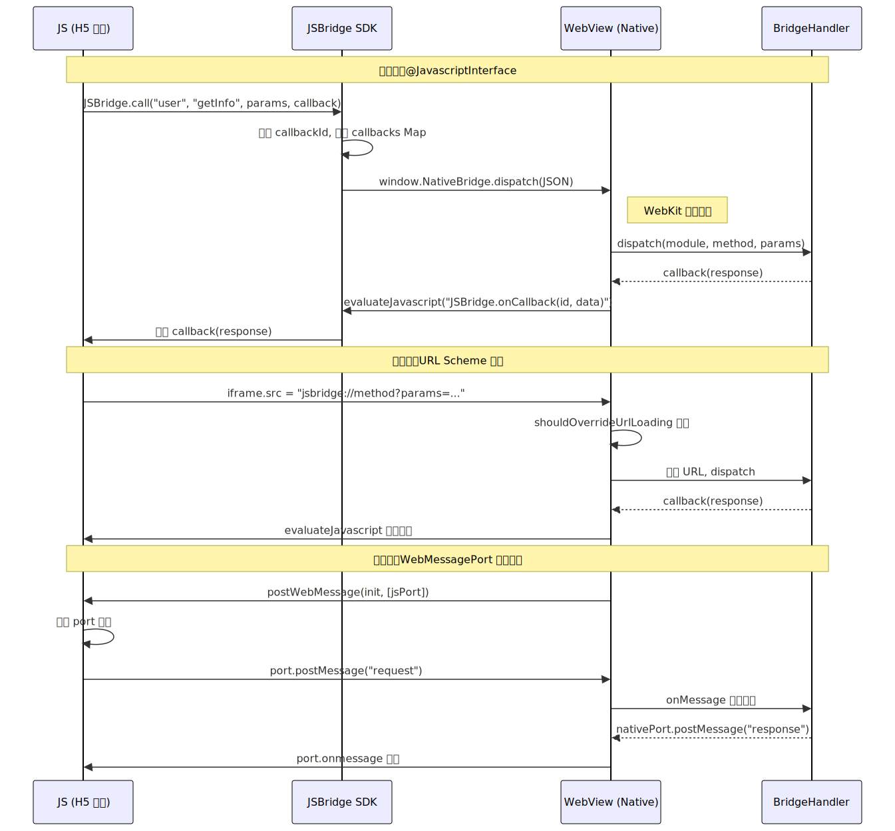

# WebView 与混合开发深度解析

> 基于 Android 14（API 34）及 Jetpack WebKit 1.15+ 分析。WebView 是 Android 中嵌入 Web 内容的核心组件，也是 Hybrid 架构的基石。理解 WebView 的生命周期、通信机制、性能优化和安全模型，是构建高质量混合应用的前提。

---

## 一、概述

### 1.1 WebView 在 Android 体系中的定位

WebView 本质上是一个**基于 Chromium 的浏览器内核组件**，以 View 的形式嵌入到 Android 应用中。它在 Android 生态中承担着关键角色：

- **Hybrid 开发基石**：让 Native 应用能加载和展示 Web 页面，实现"一套 H5 代码多端复用"
- **动态化载体**：H5 页面可远程更新，绕过应用市场审核，实现热更新
- **降本工具**：长尾页面用 H5 实现，核心体验用 Native 保障

### 1.2 WebView 内核演进

| 阶段 | 时间 | 内核 | 特点 |
|------|------|------|------|
| Android 4.3 及以前 | ~2013 | WebKit | 系统内置，不可单独更新，碎片化严重 |
| Android 4.4 | 2013 | Chromium (Blink) | 切换到 Chromium 内核，但仍绑定系统版本 |
| Android 5.0~6.x | 2014-2016 | Android System WebView | 独立为可通过 Play Store 更新的 APK |
| Android 7.0~9.0 | 2016-2019 | Chrome APK 提供 | WebView 由 Chrome 应用直接提供，减少重复安装 |
| Android 10+ | 2019+ | Trichrome 架构 | WebView 和 Chrome 共享底层库，独立更新 |

> **关键认知**：从 Android 5.0 起，WebView 可独立于系统升级，这大幅改善了碎片化问题。但不同设备上的 WebView 版本仍可能差异巨大，需要做好兼容性测试。

### 1.3 WebView vs Chrome Custom Tabs

| 维度 | WebView | Chrome Custom Tabs |
|------|---------|-------------------|
| 定制程度 | 完全可控（JS 注入、资源拦截、自定义 UI） | 有限（仅顶栏颜色、按钮、菜单项） |
| 性能 | 首次创建开销大，需自行优化 | 共享 Chrome 进程，预热后接近秒开 |
| Cookie/登录态 | 独立于浏览器，需自行管理 | 与 Chrome 共享，用户已登录的站点无需重新登录 |
| 适用场景 | 深度交互的 Hybrid 页面、需要 JSBridge 通信 | 纯浏览型场景（文章、支付页、OAuth 授权） |

---

## 二、WebView 基础

### 2.1 初始化与生命周期管理

#### 创建与 Context 选择

```kotlin
// 方式一：XML 布局（常见但有泄漏风险）
// <WebView android:id="@+id/webView" ... />

// 方式二：代码动态创建（推荐，可控制 Context）
val webView = WebView(MutableContextWrapper(applicationContext))
container.addView(webView)

// 绑定 Activity Context（需要弹窗等 UI 交互时）
(webView.context as MutableContextWrapper).baseContext = activity
```

> **为什么用 MutableContextWrapper？** 如果直接传 Activity Context，WebView 持有 Activity 引用会导致内存泄漏（WebView 内部有大量静态和长生命周期引用）。用 `MutableContextWrapper` 可以在 onDestroy 时将 Context 切回 ApplicationContext，打断引用链。

#### 正确的销毁流程

```kotlin
override fun onDestroy() {
    // 1. 从父容器移除（阻断 View 树引用）
    container.removeView(webView)
    // 2. 停止加载
    webView.stopLoading()
    // 3. 清理回调
    webView.webViewClient = WebViewClient()
    webView.webChromeClient = null
    // 4. 清空内容
    webView.loadUrl("about:blank")
    // 5. 释放资源
    webView.destroy()
    super.onDestroy()
}
```

#### 独立进程方案

在 `AndroidManifest.xml` 中为 WebView 所在的 Activity 指定独立进程：

```xml
<activity
    android:name=".WebActivity"
    android:process=":web" />
```

独立进程的优缺点：

| 优点 | 缺点 |
|------|------|
| WebView Crash 不影响主进程 | 进程启动有额外耗时（~200ms） |
| WebView 内存独立计算，主进程更稳定 | 数据通信需 IPC（Intent/AIDL/ContentProvider） |
| 进程销毁可释放全部 WebView 内存 | Cookie/缓存等需要跨进程同步 |

### 2.2 WebSettings 关键配置

```kotlin
webView.settings.apply {
    // === JS 相关 ===
    javaScriptEnabled = true                // 启用 JS（默认关闭）
    javaScriptCanOpenWindowsAutomatically = false  // 禁止 JS 自动打开窗口

    // === 缓存相关 ===
    cacheMode = WebSettings.LOAD_DEFAULT    // 缓存模式
    domStorageEnabled = true                // 启用 DOM Storage（localStorage/sessionStorage）
    databaseEnabled = true                  // 启用 Web SQL Database

    // === 渲染相关 ===
    useWideViewPort = true                  // 支持 viewport meta 标签
    loadWithOverviewMode = true             // 缩放至屏幕宽度
    setSupportZoom(true)                    // 支持缩放
    builtInZoomControls = true              // 内置缩放控件
    displayZoomControls = false             // 隐藏缩放按钮

    // === 安全相关 ===
    mixedContentMode = WebSettings.MIXED_CONTENT_NEVER_ALLOW  // HTTPS 页面不加载 HTTP 资源
    allowFileAccess = false                 // 禁止 file:// 访问（API 30+ 默认 false）
}
```

#### 五种缓存模式

| 模式 | 行为 | 适用场景 |
|------|------|---------|
| `LOAD_DEFAULT` | 遵循 HTTP 缓存头（Cache-Control/ETag/Last-Modified） | **默认推荐**，适合大多数场景 |
| `LOAD_CACHE_ELSE_NETWORK` | 有缓存就用缓存，无缓存才联网 | 弱网环境、对实时性要求不高 |
| `LOAD_NO_CACHE` | 不使用缓存，每次都从网络加载 | 需要最新内容的场景（如支付页） |
| `LOAD_CACHE_ONLY` | 仅使用缓存，无网络请求 | 离线模式 |
| ~~`LOAD_NORMAL`~~ | 已废弃（API 17），行为等同 `LOAD_DEFAULT` | 不要使用 |

#### 混合内容策略

HTTPS 页面中加载 HTTP 资源（图片、JS、CSS）时的策略：

| 模式 | 行为 | 安全性 |
|------|------|--------|
| `MIXED_CONTENT_NEVER_ALLOW` | 完全禁止混合内容 | 最安全（推荐） |
| `MIXED_CONTENT_ALWAYS_ALLOW` | 允许所有混合内容 | 不安全，仅调试用 |
| `MIXED_CONTENT_COMPATIBILITY_MODE` | 兼容模式，允许部分混合内容 | Android 5.0+ 默认值 |

### 2.3 WebViewClient vs WebChromeClient

WebView 的回调通过两个 Client 分别处理，职责划分清晰：

| 维度 | WebViewClient | WebChromeClient |
|------|---------------|-----------------|
| **职责** | 页面加载流程控制 | 浏览器 UI 行为控制 |
| **核心能力** | 页面导航拦截、资源请求拦截、错误处理、SSL 处理 | 进度回调、JS 弹窗、文件选择、全屏视频、权限请求 |
| **设置方式** | `webView.webViewClient = ...` | `webView.webChromeClient = ...` |
| **必须设置** | 是（否则链接会跳转到外部浏览器） | 按需（不需要相关功能可不设置） |
| **典型回调** | `shouldOverrideUrlLoading`、`shouldInterceptRequest`、`onPageStarted/Finished`、`onReceivedError` | `onProgressChanged`、`onJsAlert/Confirm/Prompt`、`onShowFileChooser`、`onPermissionRequest` |

> **关键认知**：如果不设置 `WebViewClient`，WebView 会将所有 URL 导航交给系统处理（即调起外部浏览器）。设置自定义 `WebViewClient` 后，导航会在 WebView 内部完成。

---

## 三、关键回调详解

### 3.1 WebViewClient 核心回调

#### shouldOverrideUrlLoading — 导航拦截

这是最重要也最容易误用的回调，用于在 WebView 发生 URL 导航时决定是否由 Native 接管。

**两个版本：**

```java
// API 1+（已在 API 24 标记废弃）
boolean shouldOverrideUrlLoading(WebView view, String url)

// API 24+（推荐）
boolean shouldOverrideUrlLoading(WebView view, WebResourceRequest request)
```

新版 `WebResourceRequest` 提供更丰富的信息：`getMethod()`、`getRequestHeaders()`、`isForMainFrame()`、`isRedirect()`、`hasGesture()`。

**返回值语义：**
- 返回 `true`：取消 WebView 的默认加载行为，由 Native 自行处理（如打开外部浏览器、路由到 Native 页面）
- 返回 `false`：让 WebView 继续加载该 URL

**何时被调用 / 不被调用：**

| 被调用的场景 | 不被调用的场景 |
|------------|--------------|
| 用户点击页面内链接 | Java 代码调用 `loadUrl()` / `loadData()` |
| JS 修改 `window.location` | POST 请求 |
| JS 创建 iframe 设置 src | 子资源加载（JS/CSS/图片） |
| 页面重定向（API 24+ 可通过 `isRedirect()` 区分） | `history.pushState()` / `history.replaceState()` |
| `window.open()`（未启用多窗口模式时） | 初始 `loadUrl()` 触发的首次加载 |

**典型业务场景：**

```kotlin
override fun shouldOverrideUrlLoading(view: WebView, request: WebResourceRequest): Boolean {
    val url = request.url
    return when {
        // 1. DeepLink 路由：拦截自定义 scheme，跳转到 Native 页面
        url.scheme == "myapp" -> {
            Router.navigate(url.toString())
            true
        }
        // 2. JSBridge URL Scheme 拦截
        url.scheme == "jsbridge" -> {
            handleBridgeCall(url)
            true
        }
        // 3. 外部链接：非本站域名，调起外部浏览器
        url.host != "m.myapp.com" -> {
            startActivity(Intent(Intent.ACTION_VIEW, url))
            true
        }
        // 4. 正常页面导航，交给 WebView 处理
        else -> false
    }
}
```

> **常见错误**：对所有 URL 返回 `true`，然后手动调用 `view.loadUrl(url)`。这会导致 `shouldOverrideUrlLoading` 不再被触发（因为 `loadUrl` 不会触发此回调），后续导航行为异常。

#### shouldInterceptRequest — 资源请求拦截

```java
// API 21+（推荐）
WebResourceResponse shouldInterceptRequest(WebView view, WebResourceRequest request)
```

**核心特征：**
- 在**非 UI 线程**调用（WebView 的网络线程），可以进行耗时操作
- 返回 `null` 则 WebView 正常联网加载；返回 `WebResourceResponse` 则使用自定义数据
- 拦截所有资源请求（HTML、JS、CSS、图片、字体等），不仅限于主帧

**六大业务场景：**

| 场景 | 实现思路 |
|------|---------|
| **离线包** | 拦截资源 URL，从本地 assets/文件系统返回对应资源 |
| **Header 注入** | 为所有请求统一添加 Token、UA 等自定义头 |
| **资源替换** | 将远程图片替换为本地内置图片（如 placeholder、品牌 logo） |
| **广告屏蔽** | 匹配广告域名规则，返回空响应 |
| **CORS 绕过** | 用 Native HTTP 客户端（OkHttp）代理请求，绕过浏览器同源策略 |
| **请求监控** | 记录所有资源请求的 URL、耗时，用于性能分析 |

```kotlin
override fun shouldInterceptRequest(view: WebView, request: WebResourceRequest): WebResourceResponse? {
    val url = request.url.toString()

    // 离线包：拦截特定域名的资源
    if (url.startsWith("https://static.myapp.com/")) {
        val localPath = mapToLocalPath(url)
        val inputStream = assets.open(localPath)
        return WebResourceResponse(
            getMimeType(url),   // "text/javascript", "text/css" 等
            "utf-8",
            inputStream
        )
    }
    return null  // 不拦截，走正常网络
}
```

#### onPageStarted / onPageFinished / onPageCommitVisible — 加载时序

三个回调反映页面加载的不同阶段：

```
onPageStarted → onPageCommitVisible → onPageFinished
   (开始加载)      (首帧可见)           (加载完成)
```

| 回调 | API | 时机 | 可靠性 | 典型用途 |
|------|-----|------|--------|---------|
| `onPageStarted` | 1 | 页面开始加载 | 重定向时可能多次触发 | 显示 Loading、记录开始时间 |
| `onPageCommitVisible` | 23 | 新页面内容首次可见 | 比 onPageFinished 更可靠表示"页面可看" | 隐藏 Loading、展示 WebView |
| `onPageFinished` | 1 | 主文档加载完成 | 不代表子资源加载完成 | 注入 JS、获取页面标题 |

> **关键认知**：`onPageFinished` 被调用时，页面的 JS/CSS/图片等子资源可能仍在加载中。如果需要判断"页面真正可见"，`onPageCommitVisible`（API 23+）是更好的选择。如果需要精确判断"所有资源加载完毕"，应该通过 JS 的 `window.onload` 事件配合 JSBridge 回调通知 Native。

#### onReceivedError / onReceivedHttpError — 错误处理

**API 23 是分水岭：**

```java
// API 1+（API 23 废弃）：所有资源的错误都回调
void onReceivedError(WebView view, int errorCode, String description, String failingUrl)

// API 23+（新版）：仅主帧错误才回调
void onReceivedError(WebView view, WebResourceRequest request, WebResourceError error)

// API 23+：HTTP 状态码 >= 400 时回调（主帧 + 子资源）
void onReceivedHttpError(WebView view, WebResourceRequest request, WebResourceResponse errorResponse)
```

**最佳实践：**

```kotlin
// 仅处理主帧错误，显示自定义错误页
override fun onReceivedError(view: WebView, request: WebResourceRequest, error: WebResourceError) {
    if (request.isForMainFrame) {
        showErrorPage(error.errorCode, error.description.toString())
    }
    // 子资源错误通常忽略（如某张图片 404 不影响整体体验）
}
```

#### onReceivedSslError — SSL 错误处理

```java
void onReceivedSslError(WebView view, SslErrorHandler handler, SslError error)
```

**安全规范（Google Play 强制要求）：**

```kotlin
override fun onReceivedSslError(view: WebView, handler: SslErrorHandler, error: SslError) {
    // 禁止盲信！以下写法会导致 Google Play 审核被拒
    // handler.proceed()  // WRONG!

    // 正确做法：弹窗让用户确认
    AlertDialog.Builder(view.context)
        .setTitle("证书错误")
        .setMessage("当前页面的安全证书存在问题，是否继续？")
        .setPositiveButton("继续") { _, _ -> handler.proceed() }
        .setNegativeButton("取消") { _, _ -> handler.cancel() }
        .setCancelable(false)
        .show()
}
```

> Google Play 在 2016 年起严查 `onReceivedSslError` 中直接调用 `handler.proceed()` 的行为，会发拒审通知。必须向用户展示 SSL 风险并由用户主动确认。

#### onRenderProcessGone — 渲染进程崩溃

```java
// API 26+
boolean onRenderProcessGone(WebView view, RenderProcessGoneDetail detail)
```

Android 8.0+ WebView 运行在独立的渲染进程中，该进程可能因 OOM 被系统杀死或自身 Crash。

```kotlin
override fun onRenderProcessGone(view: WebView, detail: RenderProcessGoneDetail): Boolean {
    if (detail.didCrash()) {
        // 渲染进程 Crash（SIGSEGV 等）
        Log.e("WebView", "Renderer crashed!")
    } else {
        // 被系统回收内存杀死
        Log.w("WebView", "Renderer killed by system (OOM)")
    }
    // 必须销毁当前 WebView 实例并重建
    container.removeView(view)
    view.destroy()
    recreateWebView()
    return true  // 返回 true 表示已处理；false 会抛出 RuntimeException
}
```

### 3.2 WebChromeClient 核心回调

#### onProgressChanged — 加载进度

```kotlin
override fun onProgressChanged(view: WebView, newProgress: Int) {
    // newProgress: 0~100
    progressBar.progress = newProgress
    if (newProgress == 100) progressBar.visibility = View.GONE
}
```

#### onJsAlert / onJsConfirm / onJsPrompt — JS 弹窗接管

Web 页面的 `window.alert()`、`window.confirm()`、`window.prompt()` 默认会弹出系统样式的对话框。可以重写这些回调来自定义弹窗 UI。

```kotlin
override fun onJsAlert(view: WebView, url: String, message: String, result: JsResult): Boolean {
    // 自定义弹窗替代系统 Alert
    AlertDialog.Builder(view.context)
        .setMessage(message)
        .setPositiveButton("确定") { _, _ -> result.confirm() }
        .setCancelable(false)
        .show()
    return true  // 返回 true 表示已接管处理
}
```

> **onJsPrompt 的特殊用途**：`window.prompt()` 可传递字符串参数并获取返回值，因此在早期 JSBridge 方案中被用作 JS→Native 的通信通道（详见第四章）。

#### onShowFileChooser — 文件选择

```kotlin
override fun onShowFileChooser(
    webView: WebView,
    filePathCallback: ValueCallback<Array<Uri>>,
    fileChooserParams: FileChooserParams
): Boolean {
    // 保存 callback 引用
    this.filePathCallback = filePathCallback

    // 使用 FileChooserParams 创建 Intent
    val intent = fileChooserParams.createIntent()
    startActivityForResult(intent, FILE_CHOOSER_REQUEST)
    return true
}
```

> **必须调用 callback**：如果返回 `true` 接管了文件选择，无论用户是否选择了文件，都**必须**调用 `filePathCallback.onReceiveValue()`（可传 `null`）。否则 WebView 的 `<input type="file">` 会永久失效，直到页面重新加载。

#### onPermissionRequest — Web 权限请求

当 Web 页面请求摄像头、麦克风等权限时触发（如 WebRTC 场景）。

```kotlin
override fun onPermissionRequest(request: PermissionRequest) {
    val resources = request.resources
    // 需要同时处理：
    // 1. Web 层权限：request.grant(resources) / request.deny()
    // 2. Android 运行时权限：ActivityCompat.requestPermissions()
    if (resources.contains(PermissionRequest.RESOURCE_VIDEO_CAPTURE)) {
        // 先检查 Android Camera 权限，授权后再 grant
        checkAndroidPermissionThenGrant(request)
    } else {
        request.deny()
    }
}
```

#### onShowCustomView / onHideCustomView — 全屏视频

HTML5 `<video>` 进入全屏时触发。需要将 `view` 添加到全屏容器中：

```kotlin
override fun onShowCustomView(view: View, callback: CustomViewCallback) {
    webView.visibility = View.GONE
    fullscreenContainer.addView(view)
    fullscreenContainer.visibility = View.VISIBLE
    this.customViewCallback = callback
}

override fun onHideCustomView() {
    fullscreenContainer.removeAllViews()
    fullscreenContainer.visibility = View.GONE
    webView.visibility = View.VISIBLE
    customViewCallback?.onCustomViewHidden()
}
```

---

## 四、JS Bridge 通信

JS Bridge（JavaScript Bridge）是 Native 与 Web 页面之间双向通信的桥梁，是 Hybrid 开发的核心基础设施。

### 4.1 六种通信方式全景对比

| 方式 | 方向 | API Level | 调用线程 | 有返回值 | 特点 | 适用场景 |
|------|------|-----------|---------|---------|------|---------|
| `evaluateJavascript()` | Native→JS | 19+ | UI 线程调用，异步回调 | JSON 字符串 | 推荐的 Native 调 JS 方式 | 调用 JS 函数、获取页面数据 |
| `loadUrl("javascript:...")` | Native→JS | 1+ | UI 线程 | 无 | 触发导航事件，会刷新页面状态 | 兼容低版本、无需返回值 |
| `@JavascriptInterface` | JS→Native | 17+ | WebKit 后台线程 | 同步返回 | 官方推荐 | JS 调用 Native 能力 |
| URL Scheme 拦截 | JS→Native | 1+ | UI 线程 | 无直接返回 | 通过 `shouldOverrideUrlLoading` | 兼容低版本、简单通知 |
| `WebMessagePort` | 双向 | 23+ | 可指定 Handler | 无（流式消息） | 持久通道，无需重复注入 | 高频双向通信 |
| `onJsPrompt` 拦截 | JS→Native | 1+ | UI 线程 | `result.confirm(data)` | Hack 方式，有同步返回值 | 早期框架、需要同步返回值 |

### 4.2 Native → JS 通信

#### evaluateJavascript()（推荐）

```kotlin
// API 19+，异步执行 JS 并获取返回值
webView.evaluateJavascript("document.title") { result ->
    // result 是 JSON 编码的字符串
    // 字符串值带引号：result = "\"My Page Title\""
    // 数字值：result = "42"
    // null/undefined：result = "null"
    Log.d("WebView", "Page title: $result")
}

// 调用 JS 函数
webView.evaluateJavascript("window.onNativeEvent('${jsonData}')") { result ->
    // 处理返回值
}
```

**注意事项：**
- 必须在 UI 线程调用
- 返回值通过 `ValueCallback` 异步回调，也在 UI 线程
- 返回值是 JSON 编码的字符串（字符串值带引号、数字直接数值、null/undefined 返回 `"null"`）
- 不会触发导航事件，不影响页面 URL

#### loadUrl("javascript:...")（兼容方案）

```kotlin
// API 1+ 可用，但无返回值
webView.loadUrl("javascript:alert('Hello from Native')")

// 调用 JS 函数
webView.loadUrl("javascript:window.onNativeEvent('${URLEncoder.encode(jsonData, "utf-8")}')")
```

**与 evaluateJavascript 的关键差异：**

| 维度 | `evaluateJavascript()` | `loadUrl("javascript:...")` |
|------|----------------------|---------------------------|
| 返回值 | 有（ValueCallback） | 无 |
| 导航副作用 | 无 | 会触发一次导航事件（影响 History） |
| URL 编码 | 不需要 | 必须对参数做 URL 编码 |
| 最低 API | 19 | 1 |
| 页面未加载完时 | 安全（不会替换内容） | 可能替换当前页面内容 |

### 4.3 JS → Native 通信

#### @JavascriptInterface（官方推荐）

```kotlin
// 1. 定义接口类
class NativeBridge {
    @JavascriptInterface
    fun showToast(message: String) {
        // 注意：此方法在 WebKit 线程调用，非 UI 线程！
        runOnUiThread { Toast.makeText(context, message, Toast.LENGTH_SHORT).show() }
    }

    @JavascriptInterface
    fun getUserInfo(): String {
        // 返回值会同步传给 JS
        return """{"name":"张三","age":28}"""
    }
}

// 2. 注入接口
webView.addJavascriptInterface(NativeBridge(), "NativeBridge")

// 3. JS 端调用
// window.NativeBridge.showToast("Hello!")
// var user = JSON.parse(window.NativeBridge.getUserInfo())
```

**核心注意事项：**
- **线程安全**：`@JavascriptInterface` 方法在 **WebKit 后台线程**执行，更新 UI 需要 `runOnUiThread`，访问共享数据需同步
- **安全性**：API 17 以下所有 public 方法都暴露给 JS（包括继承的 `getClass()`），存在严重的远程代码执行漏洞（详见第六章安全）
- **类型限制**：参数和返回值仅支持基本类型和 String，复杂对象需要 JSON 序列化

#### URL Scheme 拦截

通过 JS 修改 URL，Native 在 `shouldOverrideUrlLoading` 中拦截解析：

```javascript
// JS 端：通过 iframe 触发 URL 变化（不会导致页面跳转）
function callNative(method, params) {
    var iframe = document.createElement('iframe');
    iframe.style.display = 'none';
    iframe.src = 'jsbridge://' + method + '?params=' + encodeURIComponent(JSON.stringify(params));
    document.body.appendChild(iframe);
    setTimeout(function() { document.body.removeChild(iframe); }, 0);
}

callNative('showToast', { message: 'Hello!' });
```

```kotlin
// Native 端：在 shouldOverrideUrlLoading 中拦截
override fun shouldOverrideUrlLoading(view: WebView, request: WebResourceRequest): Boolean {
    if (request.url.scheme == "jsbridge") {
        val method = request.url.host
        val params = request.url.getQueryParameter("params")
        dispatchBridgeCall(method, params)
        return true
    }
    return false
}
```

**局限性**：
- 无法直接获取返回值（需要 Native 通过 `evaluateJavascript` 回调 JS）
- URL 长度有限制（约 2MB，但不同设备可能不同）
- 连续快速调用可能丢失消息（iframe src 的变更可能被合并）

#### WebMessagePort / WebMessage（双向持久通道）

API 23+ 提供了基于 HTML5 MessageChannel 的双向通信能力，适合高频消息场景：

```kotlin
// === Native 端 ===
// 1. 创建消息通道
val channel = webView.createWebMessageChannel()
val nativePort = channel[0]  // Native 持有
val jsPort = channel[1]      // 传给 JS

// 2. 设置 Native 端消息监听
nativePort.setWebMessageCallback(object : WebMessagePort.WebMessageCallback() {
    override fun onMessage(port: WebMessagePort, message: WebMessage) {
        Log.d("WebView", "收到 JS 消息: ${message.data}")
        // 回复消息
        nativePort.postMessage(WebMessage("Native received: ${message.data}"))
    }
})

// 3. 将 jsPort 传递给 JS（页面加载完成后）
webView.postWebMessage(
    WebMessage("init", arrayOf(jsPort)),
    Uri.parse("https://your-domain.com")  // 安全：指定目标 origin
)

// === JS 端 ===
// window.addEventListener("message", function(event) {
//     var port = event.ports[0];
//     port.onmessage = function(msg) {
//         console.log("收到 Native 消息: " + msg.data);
//     };
//     // 发送消息给 Native
//     port.postMessage("Hello from JS!");
// });
```

**优势**：
- 建立一次通道后可持续通信，无需每次注入脚本
- 双向通信，Native 和 JS 都可以主动发消息
- 安全性好，可指定 `targetOrigin` 限制消息接收方

**局限**：
- API 23+ 才可用
- 消息只支持字符串（复杂对象需 JSON 序列化）
- Port 只能转移一次

#### onJsPrompt 拦截（Hack 方式）

利用 `window.prompt()` 可传入字符串并同步获取返回值的特性：

```javascript
// JS 端
function callNative(method, params) {
    var request = JSON.stringify({ method: method, params: params });
    var response = window.prompt('jsbridge:' + request);  // 同步等待返回
    return response ? JSON.parse(response) : null;
}

var result = callNative('getUserInfo', {});
```

```kotlin
// Native 端
override fun onJsPrompt(
    view: WebView, url: String, message: String,
    defaultValue: String?, result: JsPromptResult
): Boolean {
    if (message.startsWith("jsbridge:")) {
        val request = JSONObject(message.removePrefix("jsbridge:"))
        val response = dispatchBridgeCall(request)
        result.confirm(response.toString())  // 返回值传给 JS
        return true
    }
    return false  // 非 Bridge 调用，走默认 prompt 弹窗
}
```

**特点**：唯一能同步返回数据给 JS 的方案。但 `window.prompt` 会阻塞 JS 线程，如果 Native 处理耗时较长会导致页面卡顿。

### 4.4 自建 JSBridge 协议设计

成熟的 JSBridge 需要解决三个核心问题：**消息格式标准化、异步回调管理、超时与异常处理**。

#### 消息格式

```json
{
    "callbackId": "cb_1712345678_1",
    "module": "user",
    "method": "getUserInfo",
    "params": { "includeAvatar": true }
}
```

```json
{
    "callbackId": "cb_1712345678_1",
    "code": 0,
    "data": { "name": "张三", "avatar": "https://..." },
    "message": "success"
}
```

#### 回调管理

```javascript
// JS 端 Bridge SDK
var JSBridge = {
    callbackId: 0,
    callbacks: {},

    call: function(module, method, params, callback) {
        var id = 'cb_' + Date.now() + '_' + (++this.callbackId);
        this.callbacks[id] = callback;

        // 设置超时
        setTimeout(function() {
            if (JSBridge.callbacks[id]) {
                JSBridge.callbacks[id]({ code: -1, message: 'timeout' });
                delete JSBridge.callbacks[id];
            }
        }, 10000);  // 10秒超时

        // 发送给 Native
        window.NativeBridge.dispatch(JSON.stringify({
            callbackId: id, module: module, method: method, params: params
        }));
    },

    // Native 调用此方法回传结果
    onCallback: function(callbackId, response) {
        var callback = this.callbacks[callbackId];
        if (callback) {
            callback(JSON.parse(response));
            delete this.callbacks[callbackId];
        }
    }
};
```

```kotlin
// Native 端
class BridgeDispatcher(private val webView: WebView) {
    private val handlers = mutableMapOf<String, BridgeHandler>()

    fun registerHandler(module: String, handler: BridgeHandler) {
        handlers[module] = handler
    }

    @JavascriptInterface
    fun dispatch(jsonString: String) {
        val request = JSONObject(jsonString)
        val callbackId = request.getString("callbackId")
        val module = request.getString("module")
        val method = request.getString("method")
        val params = request.getJSONObject("params")

        handlers[module]?.handle(method, params) { response ->
            // 在 UI 线程回调 JS
            webView.post {
                webView.evaluateJavascript(
                    "JSBridge.onCallback('$callbackId', '${response.toString()}')",
                    null
                )
            }
        }
    }
}
```



---

## 五、性能优化

WebView 的性能瓶颈主要集中在**初始化慢**（首次创建 WebView 耗时 300~1000ms）和**页面加载慢**（网络请求 + 渲染）两个阶段。优化策略按层次递进：

### 5.1 WebView 启动优化全景

从"提前做"到"做更多"，分为六个层次：

| 层次 | 策略 | API / 实现方式 | 节省耗时 | 说明 |
|------|------|---------------|---------|------|
| L0 | 提前触发初始化 | `WebViewCompat.startUpWebView()` (Jetpack Webkit 1.16+) | ~200ms | 后台线程完成可后台化的初始化工作 |
| L1 | 预热渲染进程 | `Profile.warmUpRendererProcess()` (Jetpack Webkit 1.15+) | ~300ms | 保持渲染进程存活，避免重新创建 |
| L2 | WebView 预创建与复用池 | 开发者自建（无官方 API） | ~500ms | 提前创建 WebView 实例，按需分配 |
| L3 | DNS/TCP/TLS 预连接 | `Profile.preconnect()` (Jetpack Webkit 1.15+) | ~200ms | 提前建立到目标域名的连接 |
| L4 | 预取页面响应 | `Profile.prefetchUrlAsync()` (Jetpack Webkit 1.13+) | ~300ms | 下载 HTML 但不渲染 |
| L5 | 预渲染 | `WebViewCompat.prerenderUrlAsync()` (Jetpack Webkit 1.13+) | ~1s+ | 完整加载+渲染，导航时瞬间展示 |

#### L0：startUpWebView — 提前初始化

```kotlin
// 在 Application.onCreate() 或合适时机调用
val config = WebViewStartUpConfig.Builder()
    .build()

WebViewCompat.startUpWebView(applicationContext, config) { result ->
    // 可获取初始化耗时分布（调试用）
    // result.uiThreadBlockingStartUpLocations
    // result.nonUiThreadBlockingStartUpLocations
}
```

#### L2：WebView 预创建与复用池

这是目前最广泛使用的优化手段（各大 App 标配）：

```kotlin
object WebViewPool {
    private val pool = LinkedList<WebView>()
    private const val MAX_POOL_SIZE = 3

    // 在 Application.onCreate 或 IdleHandler 中预创建
    fun preload(context: Context) {
        if (pool.size < MAX_POOL_SIZE) {
            val webView = WebView(MutableContextWrapper(context.applicationContext))
            configureWebView(webView)
            // 预加载空白页，触发内核初始化
            webView.loadUrl("about:blank")
            pool.add(webView)
        }
    }

    // 获取 WebView（绑定到 Activity）
    fun obtain(activity: Activity): WebView {
        val webView = if (pool.isNotEmpty()) {
            pool.removeFirst()
        } else {
            WebView(MutableContextWrapper(activity.applicationContext))
        }
        // 切换 Context 到 Activity（支持弹窗等 UI 交互）
        (webView.context as MutableContextWrapper).baseContext = activity
        return webView
    }

    // 回收 WebView
    fun recycle(webView: WebView) {
        // 重置状态
        webView.stopLoading()
        webView.loadUrl("about:blank")
        webView.clearHistory()
        webView.webViewClient = WebViewClient()
        webView.webChromeClient = null
        // 解绑 Activity Context
        (webView.context as MutableContextWrapper).baseContext =
            webView.context.applicationContext

        if (pool.size < MAX_POOL_SIZE) {
            pool.add(webView)
        } else {
            webView.destroy()
        }
    }
}
```

#### L5：prerenderUrlAsync — 预渲染

```kotlin
// 当可以预测用户即将访问的 URL 时
val cancellationSignal = CancellationSignal()

WebViewCompat.prerenderUrlAsync(
    webView,
    "https://m.myapp.com/next-page",
    cancellationSignal,
    ContextCompat.getMainExecutor(context),
    object : PrerenderOperationCallback {
        override fun onPrerenderStarted() { /* 预渲染开始 */ }
        override fun onError(throwable: Throwable) { /* 预渲染失败 */ }
    }
)

// 用户实际导航时，如果 URL 匹配预渲染的页面，则瞬间展示
webView.loadUrl("https://m.myapp.com/next-page")  // 命中预渲染缓存

// 不需要时取消
cancellationSignal.cancel()
```

### 5.2 离线包方案

离线包是将 H5 页面的静态资源（HTML/JS/CSS/图片）打包到本地，通过 `shouldInterceptRequest` 拦截网络请求并返回本地资源，从而消除网络延迟。

#### 整体架构

```
服务端                        客户端
┌─────────────┐              ┌──────────────────┐
│ 离线包管理平台 │              │ App 启动时/空闲时    │
│  - 全量包    │   下载/增量   │  ↓                 │
│  - 差量补丁  │ ──────────→ │ 离线包管理器         │
│  - 版本号    │              │  - 解压到本地目录     │
│  - 灰度规则  │              │  - 版本校验          │
└─────────────┘              │  - 签名验证          │
                             └───────┬──────────┘
                                     │
                             ┌───────▼──────────┐
                             │ shouldInterceptReq │
                             │  URL → 本地文件映射  │
                             │  命中 → 返回本地资源  │
                             │  未命中 → 走网络      │
                             └──────────────────┘
```

#### 核心实现

```kotlin
class OfflineInterceptor(private val offlineDir: File) : WebViewClient() {

    override fun shouldInterceptRequest(view: WebView, request: WebResourceRequest): WebResourceResponse? {
        val url = request.url.toString()

        // 匹配离线资源规则
        val localFile = mapToLocalFile(url)
        if (localFile != null && localFile.exists()) {
            return WebResourceResponse(
                getMimeType(localFile.name),
                "utf-8",
                200,
                "OK",
                mapOf("Access-Control-Allow-Origin" to "*"),
                FileInputStream(localFile)
            )
        }
        return null  // 不命中，走网络
    }

    private fun mapToLocalFile(url: String): File? {
        // 例：https://static.myapp.com/h5/v2/index.js → offlineDir/h5/v2/index.js
        val uri = Uri.parse(url)
        if (uri.host == "static.myapp.com") {
            return File(offlineDir, uri.path ?: return null)
        }
        return null
    }
}
```

#### 增量更新

| 策略 | 实现 | 优点 | 缺点 |
|------|------|------|------|
| 全量替换 | 下载完整新包覆盖旧包 | 实现简单 | 流量浪费 |
| BsDiff 差量 | 二进制差分（BsDiff/BsPatch） | 补丁体积小（通常 < 10%） | 需要 Native 库 |
| 文件级差量 | 只下载变更的文件 | 实现适中，粒度合理 | 需要文件清单对比 |

### 5.3 首屏加速：并行加载

传统加载是串行的：Native 初始化 → WebView 创建 → 发起网络请求 → 下载 HTML → 解析渲染。并行加载的核心思想是**让 Native 和 WebView 同时工作**：

```
传统串行：
Native 初始化 ──→ WebView 创建 ──→ 网络请求 ──→ 解析渲染
                                   ↑ 瓶颈

并行加载：
Native 初始化 ──→ WebView 创建 ──→ 注入预取数据 ──→ 渲染
                   ↕ 同时进行
              Native HTTP 预取 ──→ 数据就绪
```

```kotlin
// 1. 在页面跳转时，立即用 Native HTTP 客户端预取数据
val dataFuture = async(Dispatchers.IO) {
    okHttpClient.newCall(Request.Builder().url(apiUrl).build()).execute()
}

// 2. 同时创建/获取 WebView
val webView = WebViewPool.obtain(activity)

// 3. 加载 H5 模板（可以是本地缓存的空壳 HTML）
webView.loadUrl(templateUrl)

// 4. 数据就绪后注入到页面
dataFuture.await().let { response ->
    val jsonData = response.body?.string()
    webView.evaluateJavascript("window.onNativeDataReady($jsonData)", null)
}
```

### 5.4 Chrome Custom Tabs 三级预加载

Chrome Custom Tabs 提供了渐进式的预加载策略（适用于纯浏览场景）：

```kotlin
// 1. 绑定 Custom Tabs 服务
val connection = object : CustomTabsServiceConnection() {
    override fun onCustomTabsServiceConnected(name: ComponentName, client: CustomTabsClient) {
        // Level 1: 预热浏览器进程（~700ms）
        client.warmup(0)

        val session = client.newSession(null)

        // Level 2 + 3: mayLaunchUrl
        session?.mayLaunchUrl(
            Uri.parse("https://target.com"),  // 主 URL → 可能触发预渲染（Level 3，~1-3s）
            null,
            listOf(
                bundleOf("url" to Uri.parse("https://other1.com")),  // 备选 URL → 仅 DNS/TCP 预连接（Level 2，~200-400ms）
                bundleOf("url" to Uri.parse("https://other2.com"))
            )
        )
    }
    override fun onServiceDisconnected(name: ComponentName) {}
}

CustomTabsClient.bindCustomTabsService(context, "com.android.chrome", connection)
```

| 层级 | 操作 | 节省耗时 | 资源消耗 |
|------|------|---------|---------|
| Level 1 | `warmup(0)` — 初始化浏览器进程 | ~700ms | 低 |
| Level 2 | `mayLaunchUrl` 备选 URL — DNS/TCP/TLS 预连接 | ~200-400ms | 低 |
| Level 3 | `mayLaunchUrl` 主 URL — 完整页面预渲染 | ~1-3s | 高（浏览器可能拒绝） |

### 5.5 其他优化手段

| 优化项 | 实现方式 | 效果 |
|--------|---------|------|
| **模板预热** | 将 H5 壳页（骨架屏 HTML）内置 App，WebView 加载本地模板后注入动态数据 | 减少首次网络请求 |
| **共用 HTTP 栈** | WebView 通过 `shouldInterceptRequest` 代理到 OkHttp，复用 Native 连接池 | DNS/连接复用 |
| **图片懒加载** | H5 侧延迟加载非首屏图片，或 Native 拦截图片请求按需加载 | 减少首屏资源量 |
| **JS/CSS 内联** | 将关键 CSS/JS 内联到 HTML 中，减少子资源请求数 | 减少 RTT |
| **数据预取** | 用户进入列表页时，预取详情页数据缓存到 Native 侧 | 点击后直接注入 |

---

## 六、安全

### 6.1 addJavascriptInterface RCE 漏洞（API < 17）

**这是 Android WebView 历史上最严重的安全漏洞之一。**

在 API 17（Android 4.2）以前，`addJavascriptInterface` 会将注入对象的**所有 public 方法**暴露给 JS，包括继承自 `Object` 的 `getClass()` 方法。攻击者可以通过反射链执行任意命令：

```javascript
// 恶意 JS 代码（在 API < 17 的设备上可执行任意系统命令）
function execute(cmd) {
    return window.injectedObj
        .getClass()
        .forName("java.lang.Runtime")
        .getMethod("exec", [window.injectedObj.getClass().forName("java.lang.String")])
        .invoke(
            window.injectedObj.getClass().forName("java.lang.Runtime")
                .getMethod("getRuntime", null).invoke(null, null),
            [cmd]
        );
}
execute("cat /etc/passwd");
```

**修复方案：**
- API 17+：只有标注 `@JavascriptInterface` 的方法才对 JS 可见
- API < 17 兼容：不使用 `addJavascriptInterface`，改用 URL Scheme 拦截或 `onJsPrompt` 方案

### 6.2 SSL 错误处理规范

`onReceivedSslError` 中直接调用 `handler.proceed()` 会导致：
- 中间人攻击（MITM）风险：攻击者可伪造证书拦截所有通信
- Google Play 审核被拒：Google 从 2016 年起检测此行为

**正确做法：**

| 场景 | 处理方式 |
|------|---------|
| 生产环境 | 调用 `handler.cancel()`，展示错误页面 |
| 需要用户确认 | 弹窗提示风险，用户主动选择后才 `handler.proceed()` |
| 自签名证书（内网） | 实现 Certificate Pinning，仅信任特定证书 |
| 调试环境 | 可以 `proceed()`，但必须用 BuildConfig 控制，不可带到线上 |

### 6.3 file:// 协议访问控制

四个关键开关（Android 11+ 默认值更严格）：

| 配置 | 默认值 | 作用 | 建议 |
|------|--------|------|------|
| `setAllowFileAccess()` | API < 30: `true`; API 30+: `false` | 是否允许加载 `file://` URL | 关闭（用 WebViewAssetLoader 替代） |
| `setAllowFileAccessFromFileURLs()` | `false` (API 16+) | `file://` 页面能否读取其他 `file://` 文件 | 关闭 |
| `setAllowUniversalAccessFromFileURLs()` | `false` (API 16+) | `file://` 页面能否做跨域请求 | 关闭 |
| `setAllowContentAccess()` | `true` | 是否允许加载 `content://` URL | 按需关闭 |

**推荐替代方案 — WebViewAssetLoader：**

```kotlin
val assetLoader = WebViewAssetLoader.Builder()
    .addPathHandler("/assets/", WebViewAssetLoader.AssetsPathHandler(context))
    .addPathHandler("/res/", WebViewAssetLoader.ResourcesPathHandler(context))
    .build()

webView.webViewClient = object : WebViewClient() {
    override fun shouldInterceptRequest(view: WebView, request: WebResourceRequest): WebResourceResponse? {
        return assetLoader.shouldInterceptRequest(request.url)
    }
}

// 加载本地资源：使用 HTTPS scheme 而非 file://
webView.loadUrl("https://appassets.androidplatform.net/assets/index.html")
```

### 6.4 XSS 防护

| 攻击向量 | 防护措施 |
|---------|---------|
| H5 页面注入恶意 JS | 服务端对用户输入做 HTML Entity 编码 |
| `evaluateJavascript` 注入 | Native 传给 JS 的数据必须做 JSON 序列化（而非字符串拼接） |
| URL 参数注入 | 对 URL 参数做 `Uri.encode()`，不要直接拼 `loadUrl` |
| `@JavascriptInterface` 滥用 | 最小化暴露方法，参数做严格校验 |

```kotlin
// 错误：字符串拼接，可被注入
webView.evaluateJavascript("showData('${userInput}')", null)
// 如果 userInput = "'); alert('XSS'); //" → 执行恶意代码

// 正确：JSON 序列化
val safeJson = JSONObject().put("data", userInput).toString()
webView.evaluateJavascript("showData($safeJson)", null)
```

---

## 七、Hybrid 架构设计

### 7.1 容器化设计

成熟的 Hybrid 架构会将 WebView 封装为统一容器，提供标准化的能力：

```
┌─────────────────────────────────────────┐
│              Hybrid 容器                 │
├─────────────────────────────────────────┤
│  Native 导航栏（标题、返回、分享、更多）    │
├─────────────────────────────────────────┤
│                                         │
│            WebView 内容区                │
│                                         │
├─────────────────────────────────────────┤
│  JSBridge 层                            │
│  ├── 基础 API（导航/分享/登录/支付/...）   │
│  ├── 业务插件（扫码/地图/相册/...）        │
│  └── 安全层（鉴权/限流/白名单）            │
├─────────────────────────────────────────┤
│  底层能力                                │
│  ├── 离线包管理器                        │
│  ├── WebView 复用池                      │
│  ├── 性能监控（白屏检测/加载耗时/JS 错误）  │
│  └── 安全管控（URL 白名单/JS 接口鉴权）    │
└─────────────────────────────────────────┘
```

**插件机制设计：**

```kotlin
// JSBridge 插件接口
interface BridgePlugin {
    val moduleName: String
    fun handle(method: String, params: JSONObject, callback: (JSONObject) -> Unit)
}

// 扫码插件
class ScanPlugin : BridgePlugin {
    override val moduleName = "scan"
    override fun handle(method: String, params: JSONObject, callback: (JSONObject) -> Unit) {
        when (method) {
            "scanQRCode" -> launchScanner { result -> callback(result) }
        }
    }
}

// 容器注册插件
class HybridContainer {
    private val plugins = mutableMapOf<String, BridgePlugin>()

    fun registerPlugin(plugin: BridgePlugin) {
        plugins[plugin.moduleName] = plugin
    }

    fun dispatch(module: String, method: String, params: JSONObject, callback: (JSONObject) -> Unit) {
        plugins[module]?.handle(method, params, callback)
            ?: callback(JSONObject().put("code", -1).put("message", "Unknown module: $module"))
    }
}
```

### 7.2 Native 与 H5 职责划分策略

| 选 Native 的场景 | 选 H5 的场景 |
|-----------------|-------------|
| 首页/核心交互页面（流畅度要求高） | 营销活动页（频繁更新） |
| 复杂动画/手势交互 | 长尾/低频页面（详情页、帮助中心） |
| 离线功能（断网可用） | 需要快速上线/热修复的功能 |
| 需要深度使用设备能力（相机/传感器） | 跨平台共享的页面 |
| 导航栏/底栏/Tab 等框架级 UI | 表单型页面（注册/问卷） |

**常见混合策略：**
- **Native 框架 + H5 内容**：导航栏、底栏用 Native，中间内容区域加载 H5
- **核心链路 Native + 长尾 H5**：首页/下单/支付用 Native，运营页/帮助用 H5
- **渐进式**：新功能先 H5 快速上线，验证后用 Native 重写提升体验

### 7.3 热更新能力

H5 页面天然支持热更新（服务器更新即生效），但结合离线包时需要额外机制：

| 策略 | 实现 | 生效时机 |
|------|------|---------|
| 实时更新 | 每次打开页面检查离线包版本 | 下次打开生效 |
| 推送更新 | 服务端推送更新通知，App 后台下载新包 | 下载完成后生效 |
| 灰度控制 | 按用户 ID/设备/地区/版本分批下发 | 灰度范围内生效 |
| 强制更新 | 版本号不匹配时清除本地缓存，走网络加载 | 立即生效 |

---

## 八、内核与进阶

### 8.1 WebView 内核架构

现代 Android WebView 基于 Chromium 内核，采用多进程架构：

```
┌──────────────────────────────────────────────┐
│                    App 进程                    │
│  ┌──────────┐   ┌──────────────────────────┐ │
│  │ Activity  │   │ WebView (Java 层)         │ │
│  │           │   │  - WebViewClient          │ │
│  │           │   │  - WebChromeClient        │ │
│  │           │   │  - WebSettings            │ │
│  └──────────┘   └──────────┬───────────────┘ │
│                             │ IPC (AIDL)       │
└─────────────────────────────┼────────────────┘
                              │
┌─────────────────────────────▼────────────────┐
│            WebView 渲染进程（沙箱）              │
│  ┌──────────────────────────────────────────┐ │
│  │ Blink 渲染引擎                            │ │
│  │  - HTML Parser → DOM Tree                │ │
│  │  - CSS Parser → CSSOM                    │ │
│  │  - Layout → Paint → Compositing          │ │
│  ├──────────────────────────────────────────┤ │
│  │ V8 JavaScript 引擎                        │ │
│  ├──────────────────────────────────────────┤ │
│  │ 网络栈（Chromium Net）                     │ │
│  │  - HTTP/2 + QUIC                         │ │
│  │  - DNS over HTTPS                        │ │
│  └──────────────────────────────────────────┘ │
└──────────────────────────────────────────────┘
```

### 8.2 多进程架构的利与弊

**Android 8.0 (API 26) 起，WebView 默认运行在独立的沙箱渲染进程中**（不同于前面 2.1 节讨论的 App 层面的独立进程方案）。

| 优势 | 代价 |
|------|------|
| **Crash 隔离**：渲染进程崩溃不会导致 App 进程崩溃 | IPC 通信开销（每个 JS→Native 调用都是跨进程） |
| **安全沙箱**：渲染进程权限受限，即使被攻击也难以影响 App | 内存占用增加（额外进程开销约 30-50MB） |
| **OOM 保护**：系统内存不足时可优先回收渲染进程 | 进程启动有额外耗时 |

**渲染进程崩溃的处理**（已在 3.1 节详述）：重写 `onRenderProcessGone`，销毁当前 WebView 实例并重建。

### 8.3 内核版本检测与兼容

```kotlin
// 获取当前设备 WebView 内核版本
val packageInfo = WebView.getCurrentWebViewPackage()
Log.d("WebView", "Package: ${packageInfo?.packageName}")  // com.google.android.webview 或 com.android.chrome
Log.d("WebView", "Version: ${packageInfo?.versionName}")   // 如 "124.0.6367.82"

// 根据内核版本做功能降级
val majorVersion = packageInfo?.versionName?.split(".")?.firstOrNull()?.toIntOrNull() ?: 0
if (majorVersion >= 115) {
    // 使用较新的 API（如 WebMessagePort 的某些增强功能）
}
```

---

## 九、常见面试题与解答

### Q1：WebView 内存泄漏的原因和解决方案？

**A**：WebView 内部持有大量静态引用和长生命周期对象（如 Chromium 内核的 C++ 层引用），如果直接在 XML 中声明并传入 Activity Context，会导致 Activity 无法被 GC 回收。

**解决方案（三层递进）：**
1. **Context 替换**：用 `MutableContextWrapper` 包装 ApplicationContext 创建 WebView，需要弹窗时动态切换为 Activity Context，onDestroy 时切回
2. **正确销毁**：先从父容器 `removeView`，再 `stopLoading` → `loadUrl("about:blank")` → `destroy()`，打断所有引用链
3. **独立进程**：将 WebView 放在独立进程（`android:process=":web"`），退出页面时直接杀进程，释放全部内存

### Q2：evaluateJavascript 和 loadUrl("javascript:...") 有什么区别？

**A**：
- `evaluateJavascript`（API 19+）：异步执行，通过 `ValueCallback` 获取 JSON 编码的返回值，不触发导航事件，不影响页面 History，参数无需 URL 编码
- `loadUrl("javascript:...")`（API 1+）：无返回值，触发导航事件（影响 History），参数需 URL 编码，页面未加载完时可能替换页面内容

实际项目中优先使用 `evaluateJavascript`，仅在兼容 API < 19 时使用 `loadUrl` 方案。

### Q3：shouldOverrideUrlLoading 在哪些场景下不会被调用？

**A**：以下场景不会触发 `shouldOverrideUrlLoading`：
1. Java 代码调用 `loadUrl()` / `loadData()` / `postUrl()`
2. POST 请求（仅拦截 GET 类导航）
3. 子资源加载（JS/CSS/图片等）
4. `history.pushState()` / `history.replaceState()`（History API 操作）
5. 页面内的锚点跳转（`#hash` 变化）

会被调用的场景：用户点击链接、JS 修改 `window.location`、iframe src 变化、重定向（API 24+ 可通过 `isRedirect()` 区分）。

### Q4：JS 调用 Native 有哪些方式？各自的优缺点？

**A**：四种主要方式：

| 方式 | 优点 | 缺点 | 适用场景 |
|------|------|------|---------|
| `@JavascriptInterface` | 官方推荐、有同步返回值、实现简单 | WebKit 线程非 UI 线程、API 17 以下有 RCE 漏洞 | 标准 JSBridge |
| URL Scheme 拦截 | 全版本兼容、安全 | 无直接返回值、URL 长度限制、连续调用可能丢消息 | 简单通知、兼容低版本 |
| `WebMessagePort` | 双向持久通道、无需重复注入、性能好 | API 23+ 才可用、仅支持字符串 | 高频双向通信 |
| `onJsPrompt` 拦截 | 全版本兼容、有同步返回值 | Hack 方式、阻塞 JS 线程 | 早期框架、需要同步返回值 |

### Q5：WebView 的 shouldInterceptRequest 可以用来做什么？和 shouldOverrideUrlLoading 有什么区别？

**A**：
- `shouldInterceptRequest`：拦截**所有资源请求**（HTML/JS/CSS/图片/字体），在**非 UI 线程**调用，可返回自定义 `WebResourceResponse`。用途包括离线包、Header 注入、资源替换、广告屏蔽、CORS 绕过、请求监控
- `shouldOverrideUrlLoading`：仅拦截**导航级 URL 变更**（链接点击、JS location 修改），在 **UI 线程**调用，返回 boolean 决定是否取消导航。用途是路由拦截、DeepLink 跳转

**关键区别**：前者是"资源级"拦截，粒度细、频率高；后者是"页面级"导航拦截。

### Q6：如何设计一个完整的 JSBridge 协议？

**A**：核心三要素：
1. **消息格式**：统一 JSON 结构（`callbackId` + `module` + `method` + `params`），请求和响应分别定义 schema
2. **回调管理**：JS 端维护 `callbackId → callback` 的映射表，Native 处理完后通过 `evaluateJavascript` 回调，JS 端根据 `callbackId` 找到对应 callback 执行
3. **超时机制**：JS 端为每个请求设置超时定时器（如 10s），超时后执行 error callback 并清理映射

进阶考虑：模块化插件机制（按 module 路由到不同 Handler）、鉴权（某些 API 仅特定域名可调用）、限流（防止 JS 频繁调用导致 Native 过载）。

### Q7：WebView 性能优化的核心思路是什么？

**A**：两个维度（初始化优化 + 加载优化），核心思想是**将串行变并行、将网络变本地**：

**初始化优化**（减少 WebView 创建耗时）：
- WebView 预创建复用池（Application.onCreate 或 IdleHandler 中创建）
- Jetpack WebKit 的 `startUpWebView()` 提前触发后台初始化
- `warmUpRendererProcess()` 保持渲染进程存活

**加载优化**（减少页面加载耗时）：
- 离线包：通过 `shouldInterceptRequest` 拦截资源请求，返回本地缓存
- 并行加载：Native 和 H5 同时工作（Native 预取 API 数据 + WebView 加载模板），数据就绪后注入
- 预渲染：Jetpack WebKit `prerenderUrlAsync()` 或 Chrome Custom Tabs `mayLaunchUrl()`
- DNS/TCP 预连接：`Profile.preconnect()` 提前建立连接

### Q8：onReceivedSslError 为什么不能直接 proceed？正确的处理方式是什么？

**A**：直接 `handler.proceed()` 等于告诉 WebView "忽略 SSL 证书错误继续加载"，这会让应用面临中间人攻击风险——攻击者可以用伪造证书拦截所有 HTTPS 通信，窃取用户数据。

Google Play 从 2016 年起检测此行为，会向开发者发送安全警告邮件并可能拒审。

正确做法：
1. **默认调用 `handler.cancel()`**，展示自定义错误页面
2. 如果业务确实需要（如内网自签名证书），弹窗提示用户风险，由用户主动确认后才 `proceed()`
3. 内网场景推荐使用 Certificate Pinning（证书固定），仅信任特定证书指纹

### Q9：WebView 独立进程方案的利弊？与 Android 8.0+ 渲染进程的区别？

**A**：

**App 层独立进程**（`android:process=":web"`）：开发者主动将 WebView 所在 Activity 放到独立进程
- 优点：WebView Crash 不影响主进程、内存独立计算、杀进程可完全释放内存
- 缺点：进程启动额外耗时~200ms、数据通信需 IPC、Cookie/登录态需跨进程同步

**系统渲染进程**（Android 8.0+ 默认）：Chromium 内核的渲染进程自动与 App 进程分离
- 这是系统行为，开发者无需配置
- 提供安全沙箱和 Crash 隔离（`onRenderProcessGone` 回调）
- 两者可以叠加使用：App 层独立进程 + 系统渲染进程

### Q10：WebMessagePort 相比 @JavascriptInterface 有什么优势？什么场景下应该使用？

**A**：

| 维度 | WebMessagePort | @JavascriptInterface |
|------|---------------|---------------------|
| 方向 | 双向（Native 和 JS 都可以主动发消息） | 单向（JS 调 Native） |
| 建立方式 | 建立一次通道后持续通信 | 每次调用都是独立的方法调用 |
| 安全性 | 可指定 `targetOrigin` 限制消息接收方 | 所有页面都能调用注入的方法 |
| 线程 | 可通过 Handler 指定回调线程 | 固定在 WebKit 后台线程 |
| 数据格式 | 字符串消息 | 基本类型 + String |
| API 要求 | 23+ | 17+ |

**适用场景**：
- 高频通信（如实时数据推送、WebSocket 桥接）→ WebMessagePort
- 标准 RPC 调用（JS 调 Native 方法获取结果）→ @JavascriptInterface
- 需要 Native 主动推送消息给 JS → WebMessagePort（@JavascriptInterface 无此能力，需配合 evaluateJavascript）
