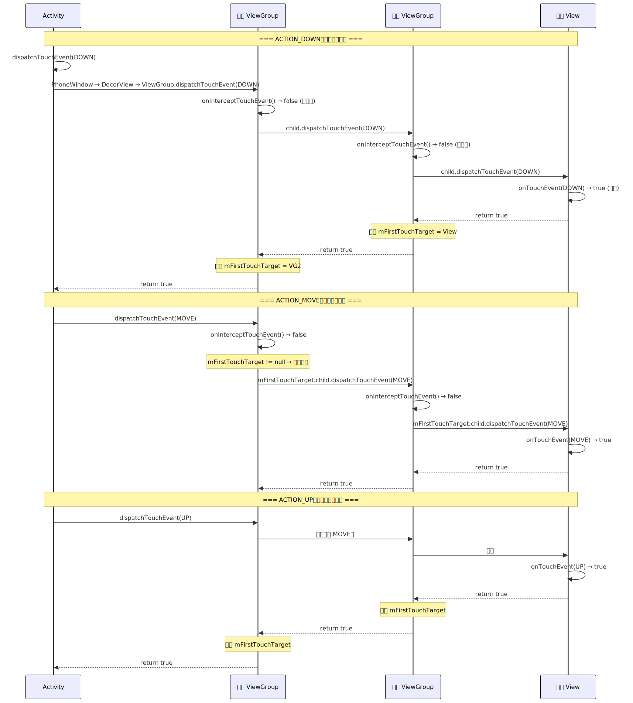
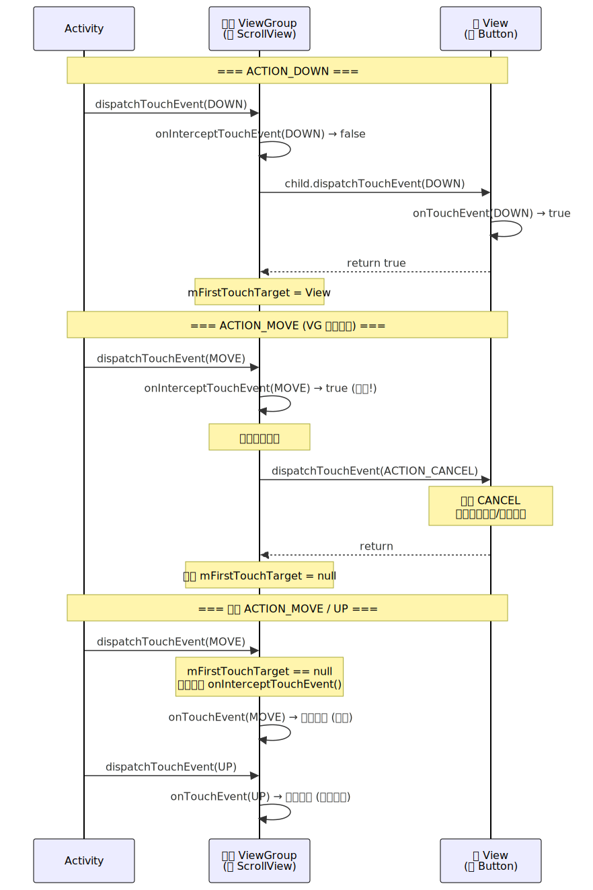

# Android 事件分发机制深度解析

> 基于 AOSP Android 13（android-13.0.0_r81）源码分析。事件分发机制是 Android UI 体系的核心之一，决定了触摸事件如何从硬件层传递到应用层，再在 View 树中找到最终的消费者。理解事件分发是解决滑动冲突、自定义触控交互的基础。

---

## 一、概述

### 1.1 事件分发要解决的问题

用户手指触摸屏幕后，系统面临一个核心问题：**屏幕上可能有多个重叠的 View，这个触摸事件应该交给谁处理？**

例如一个 ScrollView 嵌套 RecyclerView，用户在 RecyclerView 上滑动：
- 如果是垂直滑动，应该由 RecyclerView 处理
- 如果 RecyclerView 不处理，ScrollView 也可以处理
- 如果都不处理，最终由 Activity 兜底

事件分发机制就是这套**从外向内传递、从内向外回溯**的决策流程。

### 1.2 三个核心方法

事件分发围绕三个方法展开，它们构成了**责任链模式**：

| 方法 | 所属类 | 职责 |
|------|--------|------|
| `dispatchTouchEvent()` | Activity / ViewGroup / View | **分发**：决定事件交给谁处理 |
| `onInterceptTouchEvent()` | ViewGroup 独有 | **拦截**：父容器是否截断事件，不再向子 View 传递 |
| `onTouchEvent()` | Activity / ViewGroup / View | **消费**：真正处理触摸事件（点击、滑动等） |

### 1.3 事件序列

一次完整的触摸交互是一个**事件序列**，由多个 MotionEvent 组成：

```
ACTION_DOWN → ACTION_MOVE → ACTION_MOVE → ... → ACTION_UP
```

| 事件类型 | 含义 | 关键特征 |
|----------|------|---------|
| `ACTION_DOWN` | 手指按下 | 事件序列的起点，决定谁是消费者 |
| `ACTION_MOVE` | 手指移动 | 可能触发多次，构成滑动轨迹 |
| `ACTION_UP` | 手指抬起 | 事件序列的终点 |
| `ACTION_CANCEL` | 事件被取消 | 父容器中途拦截时，子 View 收到此事件 |

> **关键认知**：`ACTION_DOWN` 是最重要的事件。它决定了整个事件序列的消费者。一旦某个 View 在 `ACTION_DOWN` 时返回 `true`（消费），后续的 MOVE 和 UP 会直接传递给它，不再经历完整的分发流程。

---

## 二、事件从硬件到应用的传递

在进入 View 层的分发之前，事件需要先从硬件层传递到应用进程。

### 2.1 输入系统全链路

```
① 硬件层
   触摸屏产生中断 → Linux Input 子系统 → /dev/input/eventX

② Native 层（SystemServer 进程）
   InputReader（读取线程）
     → 从 EventHub 读取原始事件
     → 转换为 MotionEvent
     → 传递给 InputDispatcher

   InputDispatcher（分发线程）
     → 查找当前焦点窗口（通过 WMS 的窗口层级信息）
     → 通过 InputChannel（Socket pair）将事件发送到目标进程

③ Application 层（App 进程）
   ViewRootImpl.WindowInputEventReceiver
     → 从 InputChannel 读取事件
     → 进入 View 层的事件分发
```

### 2.2 从 ViewRootImpl 到 Activity

```java
// frameworks/base/core/java/android/view/ViewRootImpl.java
final class WindowInputEventReceiver extends InputEventReceiver {
    @Override
    public void onInputEvent(InputEvent event) {
        // 1. 接收来自 InputDispatcher 的事件
        enqueueInputEvent(event, this, 0, true);
    }
}

private void deliverInputEvent(QueuedInputEvent q) {
    // 2. 经过 InputStage 责任链处理
    // ViewPostImeInputStage 负责触摸事件
    stage.deliver(q);
}
```

```java
// ViewPostImeInputStage
private int processPointerEvent(QueuedInputEvent q) {
    MotionEvent event = (MotionEvent) q.mEvent;
    // 3. 调用 DecorView 的 dispatchTouchEvent
    boolean handled = mView.dispatchTouchEvent(event);
    return handled ? FINISH_HANDLED : FORWARD;
}
```

```java
// frameworks/base/core/java/com/android/internal/policy/DecorView.java
@Override
public boolean dispatchTouchEvent(MotionEvent ev) {
    // 4. DecorView 将事件交给 Activity 的 Window.Callback
    final Window.Callback cb = mWindow.getCallback(); // cb 就是 Activity
    return cb != null ? cb.dispatchTouchEvent(ev) : super.dispatchTouchEvent(ev);
}
```

> **关键认知**：事件的入口是 `ViewRootImpl`，但它先传给 `DecorView`，`DecorView` 再转交给 `Activity`。这看起来绕了一圈，但目的是让 `Activity` 有机会最先处理事件（优先级最高）或最后兜底处理（`Activity.onTouchEvent()`）。

---

## 三、Activity 层分发

```java
// frameworks/base/core/java/android/app/Activity.java
public boolean dispatchTouchEvent(MotionEvent ev) {
    if (ev.getAction() == MotionEvent.ACTION_DOWN) {
        // 1. 通知 Activity 用户开始交互（可用于取消屏保等）
        onUserInteraction();
    }

    // 2. 交给 Window（PhoneWindow）处理
    if (getWindow().superDispatchTouchEvent(ev)) {
        return true; // Window 内的 View 树消费了事件
    }

    // 3. 如果没有任何 View 消费，Activity 自己兜底处理
    return onTouchEvent(ev);
}
```

```java
// frameworks/base/core/java/com/android/internal/policy/PhoneWindow.java
@Override
public boolean superDispatchTouchEvent(MotionEvent event) {
    // 转发给 DecorView（FrameLayout 的子类）
    return mDecor.superDispatchTouchEvent(event);
}
```

```java
// DecorView.java
public boolean superDispatchTouchEvent(MotionEvent event) {
    // 调用 ViewGroup.dispatchTouchEvent()
    // 至此，进入 View 树的事件分发
    return super.dispatchTouchEvent(event);
}
```

**Activity 层的分发逻辑简洁明了：**

```
Activity.dispatchTouchEvent()
    │
    ├── Window.superDispatchTouchEvent() → View 树分发
    │   └── 返回 true → 事件被 View 消费，结束
    │
    └── 返回 false → Activity.onTouchEvent() 兜底处理
```

> **关键认知**：`Activity.onTouchEvent()` 是事件的最后防线。只有当整个 View 树都不消费事件时，才会走到这里。默认实现中，`Activity.onTouchEvent()` 几乎什么都不做（仅处理窗口边界外的点击关闭窗口的逻辑）。

---

## 四、ViewGroup 层分发（核心）

`ViewGroup.dispatchTouchEvent()` 是整个事件分发机制的核心，约 200 行代码承载了最复杂的逻辑。



### 4.1 源码逐段解析

```java
// frameworks/base/core/java/android/view/ViewGroup.java
@Override
public boolean dispatchTouchEvent(MotionEvent ev) {
    boolean handled = false;
    final int action = ev.getAction();
    final int actionMasked = action & MotionEvent.ACTION_MASK;

    // ============ 第一步：DOWN 时重置状态 ============
    if (actionMasked == MotionEvent.ACTION_DOWN) {
        // 新的事件序列开始，清除上一次的触摸目标
        cancelAndClearTouchTargets(ev);
        resetTouchState();
        // 此时 mFirstTouchTarget = null
    }

    // ============ 第二步：判断是否拦截 ============
    final boolean intercepted;
    if (actionMasked == MotionEvent.ACTION_DOWN || mFirstTouchTarget != null) {
        // 条件1: ACTION_DOWN（必须判断）
        // 条件2: 已有子 View 在消费事件（MOVE/UP 时需要再次确认是否拦截）
        final boolean disallowIntercept = (mGroupFlags & FLAG_DISALLOW_INTERCEPT) != 0;
        if (!disallowIntercept) {
            intercepted = onInterceptTouchEvent(ev);
        } else {
            intercepted = false; // 子 View 请求不拦截
        }
    } else {
        // 没有子 View 消费 DOWN 事件 → 后续 MOVE/UP 直接自己处理，不再调用 onInterceptTouchEvent
        intercepted = true;
    }
```

> **关键认知**：`onInterceptTouchEvent()` 不是每次都调用的。只有两种情况会调用：(1) `ACTION_DOWN` 时；(2) 已有子 View 在消费事件时（`mFirstTouchTarget != null`）。如果 DOWN 时没有子 View 消费，后续 MOVE/UP 直接由 ViewGroup 自己处理，不再询问是否拦截。

```java
    // ============ 第三步：DOWN 时寻找消费者 ============
    if (!canceled && !intercepted) {
        if (actionMasked == MotionEvent.ACTION_DOWN
                || (split && actionMasked == MotionEvent.ACTION_POINTER_DOWN)) {

            final int childrenCount = mChildrenCount;
            if (childrenCount != 0) {
                // 按倒序遍历子 View（后添加的/z-order 高的优先）
                final ArrayList<View> preorderedList = buildTouchDispatchChildList();
                for (int i = childrenCount - 1; i >= 0; i--) {
                    final View child = getAndVerifyPreorderedView(preorderedList, children, i);

                    // 命中测试：触摸点是否在子 View 区域内
                    if (!child.canReceivePointerEvents()
                            || !isTransformedTouchPointInView(x, y, child, null)) {
                        continue; // 不在区域内，跳过
                    }

                    // 将事件分发给命中的子 View
                    if (dispatchTransformedTouchEvent(ev, false, child, idBitsToAssign)) {
                        // 子 View 消费了事件（返回 true）
                        // 记录为 TouchTarget
                        newTouchTarget = addTouchTarget(child, idBitsToAssign);
                        // mFirstTouchTarget 指向该子 View
                        break; // 找到消费者，停止遍历
                    }
                }
            }
        }
    }
```

**`addTouchTarget()` -- 记录消费者：**

```java
private TouchTarget addTouchTarget(View child, int pointerIdBits) {
    TouchTarget target = TouchTarget.obtain(child, pointerIdBits);
    target.next = mFirstTouchTarget; // 链表头插法
    mFirstTouchTarget = target;
    return target;
}
```

> **关键认知**：`mFirstTouchTarget` 是一个链表，记录了消费事件的子 View。对于单点触摸，链表只有一个节点。对于多点触摸（多指操作），不同的 pointer 可以分发给不同的子 View，链表会有多个节点。

```java
    // ============ 第四步：分发事件 ============
    if (mFirstTouchTarget == null) {
        // 没有子 View 消费 → ViewGroup 自己处理
        // 调用 View.dispatchTouchEvent()（即自己的 onTouchEvent）
        handled = dispatchTransformedTouchEvent(ev, canceled, null, TouchTarget.ALL_POINTER_IDS);
    } else {
        // 有消费者 → 分发给记录的 TouchTarget
        TouchTarget target = mFirstTouchTarget;
        while (target != null) {
            final TouchTarget next = target.next;
            if (alreadyDispatchedToNewTouchTarget && target == newTouchTarget) {
                handled = true; // DOWN 已经分发过了
            } else {
                // 如果 ViewGroup 此时拦截了（intercepted = true）
                // 给子 View 发送 ACTION_CANCEL
                final boolean cancelChild = intercepted;
                if (dispatchTransformedTouchEvent(ev, cancelChild, target.child, target.pointerIdBits)) {
                    handled = true;
                }
                if (cancelChild) {
                    // 清除 TouchTarget
                    mFirstTouchTarget = next;
                }
            }
            target = next;
        }
    }

    return handled;
}
```

### 4.2 分发规则总结

| 场景 | ACTION_DOWN | 后续 MOVE/UP |
|------|-------------|-------------|
| **子 View 消费 DOWN** | 子 View 返回 true，记入 mFirstTouchTarget | 直接传给 mFirstTouchTarget，不再遍历 |
| **无子 View 消费 DOWN** | 所有子 View 返回 false，mFirstTouchTarget = null | ViewGroup 自己的 onTouchEvent 处理 |
| **ViewGroup 拦截 DOWN** | onInterceptTouchEvent 返回 true，不传给子 View | ViewGroup 自己处理 |
| **ViewGroup 中途拦截 MOVE** | -- | 给子 View 发 CANCEL，后续自己处理 |

---

## 五、View 层处理

当事件到达最终的 View（非 ViewGroup），进入 `View.dispatchTouchEvent()`：

```java
// frameworks/base/core/java/android/view/View.java
public boolean dispatchTouchEvent(MotionEvent event) {
    boolean result = false;

    // 1. 优先级最高：OnTouchListener
    ListenerInfo li = mListenerInfo;
    if (li != null && li.mOnTouchListener != null
            && (mViewFlags & ENABLED_MASK) == ENABLED
            && li.mOnTouchListener.onTouch(this, event)) {
        result = true; // OnTouchListener 消费了事件
    }

    // 2. OnTouchListener 未消费 → 调用 onTouchEvent
    if (!result && onTouchEvent(event)) {
        result = true;
    }

    return result;
}
```

> **关键认知**：`OnTouchListener.onTouch()` 的优先级高于 `onTouchEvent()`。如果 `onTouch()` 返回 `true`，`onTouchEvent()` 不会被调用。这意味着设置了 `OnTouchListener` 并返回 `true` 会屏蔽 `onClick` 等事件（因为 `onClick` 是在 `onTouchEvent` 中触发的）。

### 5.1 onTouchEvent 源码分析

```java
// frameworks/base/core/java/android/view/View.java
public boolean onTouchEvent(MotionEvent event) {
    final int action = event.getAction();

    // clickable 包括 CLICKABLE 和 LONG_CLICKABLE
    final boolean clickable = ((viewFlags & CLICKABLE) == CLICKABLE
            || (viewFlags & LONG_CLICKABLE) == LONG_CLICKABLE
            || (viewFlags & CONTEXT_CLICKABLE) == CONTEXT_CLICKABLE);

    // 即使 View 是 DISABLED，只要是 clickable 的，依然消费事件（只是不触发点击）
    if ((viewFlags & ENABLED_MASK) == DISABLED) {
        return clickable; // 注意：disabled 但 clickable 的 View 仍然消费事件！
    }

    // TouchDelegate: 扩大触摸区域的代理
    if (mTouchDelegate != null && mTouchDelegate.onTouchEvent(event)) {
        return true;
    }

    if (clickable || (viewFlags & TOOLTIP) == TOOLTIP) {
        switch (action) {
            case MotionEvent.ACTION_DOWN:
                // 1. 设置按压状态
                setPressed(true, x, y);
                // 2. 发送长按检测（500ms 延迟）
                checkForLongClick(ViewConfiguration.getLongPressTimeout(), x, y);
                break;

            case MotionEvent.ACTION_MOVE:
                // 3. 检查是否滑出 View 边界
                if (!pointInView(x, y, touchSlop)) {
                    removeLongPressCallback(); // 取消长按
                    setPressed(false);
                }
                break;

            case MotionEvent.ACTION_UP:
                // 4. 手指抬起 → 触发点击
                if (!mHasPerformedLongPress) {
                    removeLongPressCallback();
                    // 触发 OnClickListener
                    performClickInternal();
                }
                setPressed(false);
                break;

            case MotionEvent.ACTION_CANCEL:
                // 5. 取消：清除所有状态
                setPressed(false);
                removeLongPressCallback();
                break;
        }
        return true; // clickable 的 View 始终消费事件
    }

    return false; // 不 clickable → 不消费
}
```

### 5.2 事件处理优先级

```
OnTouchListener.onTouch()     ← 优先级 1（返回 true 则后续不执行）
    │ false
    ▼
onTouchEvent()                ← 优先级 2
    │ 内部触发:
    ├── OnLongClickListener   ← DOWN 后 500ms 触发
    └── OnClickListener       ← UP 时触发（如果没触发长按）
```

| 优先级 | 回调 | 触发条件 |
|--------|------|---------|
| 1 | `OnTouchListener.onTouch()` | 设置了监听且返回 true |
| 2 | `onTouchEvent()` | onTouch 未消费 |
| 3 | `OnLongClickListener.onLongClick()` | DOWN 后 500ms 未抬起且未滑出边界 |
| 4 | `OnClickListener.onClick()` | UP 时，且未触发长按 |

> **关键认知**：`DISABLED` 状态的 View，只要是 `clickable` 的（设置了 OnClickListener 会自动设置 CLICKABLE 标志），仍然会消费事件（`onTouchEvent` 返回 `true`），只是不触发点击回调。这意味着事件不会穿透到下层 View。

---

## 六、事件分发时序图

### 6.1 正常消费流程

一个完整的事件序列（DOWN → MOVE → UP）在嵌套 ViewGroup 中的分发过程：



**核心要点：**

- `ACTION_DOWN` 是"寻找消费者"的过程，需要逐级向下分发
- 找到消费者后，`ACTION_MOVE` 和 `ACTION_UP` 通过 `mFirstTouchTarget` 链直达消费者，不再遍历所有子 View
- `ACTION_UP` 处理完后，`mFirstTouchTarget` 被清除，等待下一次事件序列

### 6.2 中途拦截流程

当父 ViewGroup 在 MOVE 阶段决定拦截事件（典型场景：ScrollView 检测到垂直滑动距离超过 touchSlop）：



**关键变化：**

1. ViewGroup 在 MOVE 时 `onInterceptTouchEvent()` 返回 `true`
2. 子 View 收到 `ACTION_CANCEL`（不是 ACTION_UP），用于清理按压状态
3. `mFirstTouchTarget` 被清除
4. 后续 MOVE/UP 不再调用 `onInterceptTouchEvent()`，ViewGroup 直接在自己的 `onTouchEvent()` 中处理

---

## 七、滑动冲突解决

滑动冲突是事件分发最常见的实际问题。

### 7.1 常见冲突场景

| 场景 | 描述 | 典型例子 |
|------|------|---------|
| **同向冲突** | 父子 View 滑动方向相同 | ScrollView 嵌套 RecyclerView |
| **异向冲突** | 父子 View 滑动方向不同 | ViewPager 嵌套竖向 RecyclerView |
| **混合冲突** | 既有同向又有异向 | 复杂嵌套布局 |

### 7.2 外部拦截法（推荐）

在**父 ViewGroup** 的 `onInterceptTouchEvent()` 中做判断：

```java
// 父 ViewGroup 重写
@Override
public boolean onInterceptTouchEvent(MotionEvent ev) {
    boolean intercepted = false;
    int x = (int) ev.getX();
    int y = (int) ev.getY();

    switch (ev.getAction()) {
        case MotionEvent.ACTION_DOWN:
            intercepted = false; // DOWN 必须不拦截，否则子 View 收不到任何事件
            break;

        case MotionEvent.ACTION_MOVE:
            int deltaX = x - mLastX;
            int deltaY = y - mLastY;
            if (满足父容器需要的滑动条件) {
                // 例如：水平滑动距离 > 垂直滑动距离 → 父容器处理水平滑动
                intercepted = true;
            } else {
                intercepted = false;
            }
            break;

        case MotionEvent.ACTION_UP:
            intercepted = false; // UP 不拦截，让子 View 正常收到 UP 触发 onClick 等
            break;
    }
    mLastX = x;
    mLastY = y;
    return intercepted;
}
```

### 7.3 内部拦截法

在**子 View** 中通过 `requestDisallowInterceptTouchEvent()` 控制父容器的拦截行为：

```java
// 子 View 重写
@Override
public boolean dispatchTouchEvent(MotionEvent ev) {
    int x = (int) ev.getX();
    int y = (int) ev.getY();

    switch (ev.getAction()) {
        case MotionEvent.ACTION_DOWN:
            // 禁止父容器拦截（设置 FLAG_DISALLOW_INTERCEPT）
            getParent().requestDisallowInterceptTouchEvent(true);
            break;

        case MotionEvent.ACTION_MOVE:
            int deltaX = x - mLastX;
            int deltaY = y - mLastY;
            if (满足父容器需要的滑动条件) {
                // 允许父容器拦截
                getParent().requestDisallowInterceptTouchEvent(false);
            }
            break;
    }
    mLastX = x;
    mLastY = y;
    return super.dispatchTouchEvent(ev);
}
```

**配合父 ViewGroup：**

```java
// 父 ViewGroup：除 DOWN 外都拦截（默认行为）
@Override
public boolean onInterceptTouchEvent(MotionEvent ev) {
    if (ev.getAction() == MotionEvent.ACTION_DOWN) {
        return false; // DOWN 不拦截（FLAG_DISALLOW_INTERCEPT 对 DOWN 无效）
    }
    return true; // 其他事件默认拦截，子 View 通过 requestDisallowInterceptTouchEvent 控制
}
```

### 7.4 两种方案对比

| 维度 | 外部拦截法 | 内部拦截法 |
|------|-----------|-----------|
| **修改位置** | 父 ViewGroup | 子 View + 父 ViewGroup |
| **控制方** | 父容器决定是否拦截 | 子 View 决定是否让父容器拦截 |
| **复杂度** | 低 | 中（需要父子配合） |
| **适用场景** | 大多数场景 | 子 View 需要动态决定是否放权 |
| **推荐度** | 优先使用 | 特殊场景使用 |

> **最佳实践**：优先使用外部拦截法，逻辑集中在父 ViewGroup 中，代码更清晰。内部拦截法适用于子 View 的滑动状态会动态变化的场景（如子 View 滑到边界后需要让父容器接管滚动）。

### 7.5 NestedScrolling 机制

Android 5.0 引入了 `NestedScrollingParent` / `NestedScrollingChild` 接口，提供了更优雅的嵌套滑动协调方案：

```
传统方案：父容器"抢夺"事件（拦截）
  → 子 View 失去控制权，收到 CANCEL

NestedScrolling：子 View 主动"上报"滑动
  → 子 View 先问父容器要消费多少
  → 父容器消费一部分后，剩余的子 View 自己消费
  → 协作式，无拦截
```

| 接口 | 关键方法 | 说明 |
|------|---------|------|
| `NestedScrollingChild` | `startNestedScroll()` | 开始嵌套滑动 |
| | `dispatchNestedPreScroll()` | 滑动前先问父容器 |
| | `dispatchNestedScroll()` | 自己滑完后把剩余给父容器 |
| `NestedScrollingParent` | `onNestedPreScroll()` | 在子 View 滑动前优先消费 |
| | `onNestedScroll()` | 子 View 滑完后消费剩余 |

RecyclerView 默认实现了 `NestedScrollingChild`，`CoordinatorLayout` 实现了 `NestedScrollingParent`。这也是 `CoordinatorLayout` + `AppBarLayout` + `RecyclerView` 能实现联动折叠效果的基础。

---

## 八、多点触摸分发

Android 支持多点触摸（多指操作），事件分发需要处理多个 pointer 的分配。

### 8.1 MotionEvent 中的多指信息

```java
// 一个 MotionEvent 可以包含多个 pointer 的信息
int pointerCount = event.getPointerCount();    // 当前屏幕上的手指数
int pointerId = event.getPointerId(index);      // 每根手指的唯一 ID
float x = event.getX(index);                    // 指定手指的 x 坐标
```

| 事件类型 | 含义 |
|----------|------|
| `ACTION_DOWN` | 第一根手指按下 |
| `ACTION_POINTER_DOWN` | 后续手指按下（第 2、3 根...） |
| `ACTION_POINTER_UP` | 非最后一根手指抬起 |
| `ACTION_UP` | 最后一根手指抬起 |

### 8.2 事件拆分（Split Touch）

Android 3.0+ 默认开启事件拆分（`FLAG_SPLIT_MOTION_EVENTS`），允许不同的 pointer 分发给不同的子 View：

```
手指 1 按在 Button A 上 → ACTION_DOWN 分发给 Button A
手指 2 按在 Button B 上 → ACTION_POINTER_DOWN 拆分为 ACTION_DOWN 分发给 Button B
```

ViewGroup 的 `mFirstTouchTarget` 链表在多点触摸时会有多个节点，每个节点记录了该子 View 负责处理的 `pointerIdBits`。

---

## 九、常见面试题与解答

### Q1：描述一下 Android 事件分发的流程

**答**：事件从 Activity → ViewGroup → View 逐级分发，是一个典型的责任链模式。

1. **Activity.dispatchTouchEvent()**：先交给 PhoneWindow 处理，PhoneWindow 转给 DecorView，进入 View 树分发。如果 View 树没人消费，最终由 `Activity.onTouchEvent()` 兜底。
2. **ViewGroup.dispatchTouchEvent()**：先调用 `onInterceptTouchEvent()` 判断是否拦截。不拦截则倒序遍历子 View，通过命中测试找到触摸点所在的子 View，调用 `child.dispatchTouchEvent()` 分发。如果子 View 消费了（返回 true），记录为 `mFirstTouchTarget`。如果无人消费，ViewGroup 调用自己的 `onTouchEvent()`。
3. **View.dispatchTouchEvent()**：先检查 `OnTouchListener`，如果 `onTouch()` 返回 true 则消费。否则调用 `onTouchEvent()`，其中在 `ACTION_DOWN` 设置按压状态并发送长按检测，在 `ACTION_UP` 触发 `onClick()`。

ACTION_DOWN 决定消费者，后续 MOVE/UP 通过 mFirstTouchTarget 直达消费者。

---

### Q2：onInterceptTouchEvent 在什么情况下会被调用？

**答**：`onInterceptTouchEvent()` 并不是每次事件都会调用，只在两种情况下调用：

1. **ACTION_DOWN 时**：必须调用，用于决定是否拦截这个新的事件序列
2. **mFirstTouchTarget != null 时**：即已有子 View 在消费事件的情况下，MOVE/UP 仍会调用，让父容器有机会中途拦截

不调用的情况：
- 如果 DOWN 时没有子 View 消费（mFirstTouchTarget = null），后续 MOVE/UP 不再调用，直接由 ViewGroup 自己的 onTouchEvent 处理
- 如果子 View 调用了 `requestDisallowInterceptTouchEvent(true)` 设置了 `FLAG_DISALLOW_INTERCEPT` 标志，也不会调用（但对 DOWN 无效，DOWN 时该标志会被重置）

---

### Q3：为什么 View 的 OnTouchListener 优先级高于 onTouchEvent？onClick 是在哪里触发的？

**答**：在 `View.dispatchTouchEvent()` 中，先检查 `OnTouchListener.onTouch()`，如果返回 true 则不再调用 `onTouchEvent()`。这是设计上的考虑：外部设置的监听器（OnTouchListener）应该有能力完全接管 View 的触摸处理。

`onClick` 是在 `onTouchEvent()` 的 `ACTION_UP` 分支中，通过 `performClickInternal()` → `performClick()` → `mOnClickListener.onClick()` 触发的。因此，如果 `OnTouchListener.onTouch()` 返回 true，`onClick` 不会被触发。

优先级顺序：`onTouch()` > `onTouchEvent()` > `onLongClick()`（DOWN 后 500ms）> `onClick()`（UP 时）。

---

### Q4：一个 View 的 onTouchEvent 返回 false 会发生什么？

**答**：如果一个 View 在 `ACTION_DOWN` 的 `onTouchEvent()` 中返回 false（不消费），意味着它拒绝了这个事件序列。后续会发生：

1. 它的父 ViewGroup 的 `dispatchTouchEvent()` 中 `dispatchTransformedTouchEvent()` 返回 false
2. 不会被记录为 `mFirstTouchTarget`
3. 父 ViewGroup 继续遍历下一个命中的子 View
4. 如果所有子 View 都不消费，父 ViewGroup 自己调用 `onTouchEvent()`
5. 如果父 ViewGroup 也不消费，继续向上回传
6. 最终由 `Activity.onTouchEvent()` 兜底

**重要**：该 View 后续不会再收到这个事件序列的 MOVE 和 UP 事件。一旦在 DOWN 时拒绝，就彻底退出了这次事件分发。

---

### Q5：说一下 ACTION_CANCEL 的触发场景

**答**：`ACTION_CANCEL` 表示事件被异常中断，常见触发场景：

1. **父容器中途拦截**：子 View 正在消费事件序列（已处理 DOWN/MOVE），父 ViewGroup 在某次 MOVE 时 `onInterceptTouchEvent()` 返回 true，此时子 View 会收到 `ACTION_CANCEL` 而非 `ACTION_UP`
2. **窗口被遮挡**：如弹出 Dialog 或系统窗口覆盖了当前 View
3. **View 被移除**：正在处理事件的 View 从 ViewGroup 中被 remove

收到 `ACTION_CANCEL` 后，View 应该清理所有状态（取消按压效果、取消长按计时器等），表现行为与 ACTION_UP 类似但不触发 onClick。

---

### Q6：如何解决 ScrollView 嵌套 RecyclerView 的滑动冲突？

**答**：这是经典的同向滑动冲突。推荐三种方案：

**方案一（推荐）：使用 NestedScrollView 替代 ScrollView**

`NestedScrollView` 实现了 `NestedScrollingParent`，RecyclerView 实现了 `NestedScrollingChild`，它们通过 NestedScrolling 机制协作滑动，无需手动处理拦截。

**方案二：外部拦截法**

在自定义 ScrollView 的 `onInterceptTouchEvent()` 中，根据滑动方向和 RecyclerView 的滚动状态判断：
- RecyclerView 能继续滚动 → 不拦截
- RecyclerView 滚到顶部/底部 → 拦截，由 ScrollView 处理

**方案三：内部拦截法**

在 RecyclerView 的 `dispatchTouchEvent()` 中，通过 `requestDisallowInterceptTouchEvent()` 动态控制父容器的拦截行为：
- RecyclerView 还能滚动时禁止父容器拦截
- 滚到边界后允许父容器拦截

实际开发中，方案一是最优解，Android 官方组件已内置支持。

---

### Q7：requestDisallowInterceptTouchEvent 的作用和限制是什么？

**答**：`requestDisallowInterceptTouchEvent(true)` 设置父 ViewGroup 的 `FLAG_DISALLOW_INTERCEPT` 标志，禁止父容器调用 `onInterceptTouchEvent()`。

**核心限制**：对 `ACTION_DOWN` 无效。因为在 ViewGroup 的 `dispatchTouchEvent()` 中，每次收到 `ACTION_DOWN` 都会调用 `resetTouchState()` 清除该标志。这是合理的设计——每个新的事件序列开始时，父容器必须有机会决定是否拦截。

**典型用法**：子 View 在 `ACTION_DOWN` 时调用 `requestDisallowInterceptTouchEvent(true)`，父容器无法拦截 MOVE/UP。当子 View 判断需要交出控制权时，调用 `requestDisallowInterceptTouchEvent(false)` 允许父容器拦截。

---

### Q8：事件分发中的 mFirstTouchTarget 是什么？为什么是链表结构？

**答**：`mFirstTouchTarget` 是 ViewGroup 中用于记录事件消费者的**单链表**。每个 `TouchTarget` 节点包含：

- `child`：消费事件的子 View
- `pointerIdBits`：该子 View 负责处理的 pointer ID（手指 ID）
- `next`：指向下一个 TouchTarget

**为什么是链表**：为了支持多点触摸。单点触摸时链表只有一个节点。多点触摸时，手指 1 按在 View A，手指 2 按在 View B，此时链表有两个节点，分别记录两个消费者和各自负责的 pointer。

**作用**：MOVE/UP 事件不需要重新遍历子 View 做命中测试，直接通过 `mFirstTouchTarget` 链找到消费者分发，大幅提高性能。

---

### Q9：View.setEnabled(false) 和 View.setClickable(false) 对事件分发的影响有什么区别？

**答**：

- **setEnabled(false)**：View 变为 DISABLED 状态，但如果 View 是 clickable 的（设置了 OnClickListener），`onTouchEvent()` 仍然返回 `true`，**事件依然被消费**，只是不触发 onClick 回调。事件不会穿透到下层 View。

- **setClickable(false)**：View 变为不可点击，如果同时没有设置 long_clickable 和 context_clickable，`onTouchEvent()` 返回 `false`，**事件不被消费**，会回传给父 View 处理。

这是一个常见的面试陷阱：很多人认为 `setEnabled(false)` 后事件会穿透，实际上不会。要让事件穿透，应该使用 `setClickable(false)` 或直接不设置 OnClickListener。

---

## 十、总结

事件分发机制的核心是一个**三层递归的责任链**：

```
Activity.dispatchTouchEvent()
    │
    ├── PhoneWindow → DecorView
    │   └── ViewGroup.dispatchTouchEvent()       ← 核心决策层
    │       ├── onInterceptTouchEvent()          ← 是否拦截
    │       ├── child.dispatchTouchEvent()       ← 向下分发（递归）
    │       └── super.onTouchEvent()             ← 自己处理
    │           └── View.dispatchTouchEvent()
    │               ├── OnTouchListener.onTouch() ← 优先级 1
    │               └── onTouchEvent()            ← 优先级 2
    │                   ├── onLongClick()
    │                   └── onClick()
    │
    └── Activity.onTouchEvent()                  ← 最后兜底
```

四条核心规则：

1. **DOWN 决定消费者**：`ACTION_DOWN` 是事件序列的起点，通过它确定 `mFirstTouchTarget`，后续 MOVE/UP 直达消费者
2. **责任链回溯**：如果子 View 不消费，事件沿 View 树向上回传，最终由 Activity 兜底
3. **拦截即接管**：ViewGroup `onInterceptTouchEvent()` 返回 true 后，子 View 收到 CANCEL，后续事件由 ViewGroup 自己处理
4. **消费不可撤销**：一旦在 DOWN 时消费了事件，该 View 负责处理整个事件序列；一旦在 DOWN 时拒绝，后续不再收到任何事件
