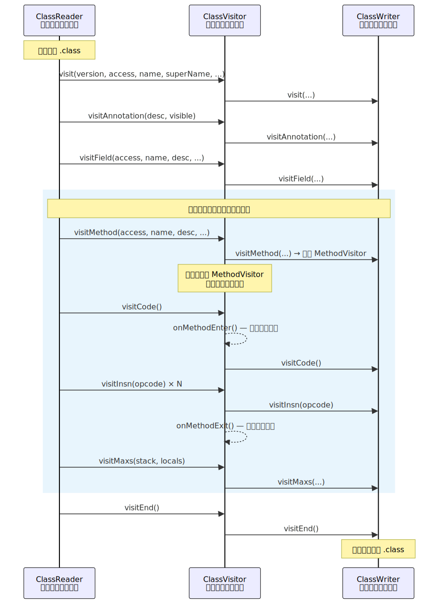

# ASM 字节码插桩

## 一、概述

### 1.1 什么是插桩

**插桩（Instrumentation）** 指在不修改业务源码的前提下，向已编译的字节码中注入额外代码，用于监控、调试、分析或控制程序行为。

"插"是插入代码，"桩"是监控探针——类似土木工程在关键位置埋设测量桩，在不改变建筑结构的情况下采集数据。

### 1.2 AOP 与插桩的关系

在 OOP 中，日志、耗时统计、权限检查等**横切关注点（Cross-cutting Concerns）** 散布在各个业务类中，导致代码重复且耦合。**AOP（面向切面编程）** 的思想就是将这些横切逻辑抽离为独立的"切面"，与业务代码解耦。

三者的关系：

```
AOP（面向切面编程）       ← 编程思想：解耦横切关注点
  └── 插桩（Instrumentation）  ← 实现手段：向字节码注入切面逻辑
        └── ASM               ← 具体工具：高性能字节码操作框架
```

Android 中实现 AOP 的技术对比：

| 方案 | 时机 | 原理 | 优缺点 |
|------|------|------|--------|
| **ASM** | 编译期（.class 阶段） | 直接操作字节码指令 | 性能最优、最灵活，但学习成本高 |
| **AspectJ** | 编译期 | 基于 ajc 编译器，语法级 AOP | 语法友好，但编译慢、侵入性强 |
| **Javassist** | 编译期 | 源码级 API 操作字节码 | 上手简单，但性能不如 ASM |
| **动态代理** | 运行时 | Java Proxy / CGLIB | 无需编译期处理，但有运行时开销且无法代理所有场景 |

### 1.3 ASM 在 Android 工具链中的位置

ASM 插桩发生在 **kotlinc/javac 编译产出 .class 之后、D8/R8 转换为 .dex 之前**：



> ASM 操作的是 **JVM 字节码（.class 文件）**，不是 Dex 字节码。这也是为什么理解 ASM 需要掌握 JVM 栈帧模型和指令集，而非 Dex 的寄存器模型。

---

## 二、JVM 字节码基础

> 本节从 .class 文件结构和 JVM 执行模型出发，为后续理解 ASM 如何操作字节码打基础。与 [ART 虚拟机原理](../底层原理与系统源码/ART虚拟机原理.md) 中的 Dex 字节码形成互补——那里讲的是寄存器模型，这里讲的是栈模型。

### 2.1 .class 文件结构

每个 Java/Kotlin 类编译后生成一个 `.class` 文件，遵循严格的二进制格式：

```
.class 文件结构:
┌──────────────────────────────────────────┐
│ Magic Number: 0xCAFEBABE                 │  标识这是一个 class 文件
├──────────────────────────────────────────┤
│ Version: minor + major                   │  class 文件版本（Java 8 = 52.0）
├──────────────────────────────────────────┤
│ Constant Pool                            │  常量池：所有字符串、类名、方法名、
│   cp_info[constant_pool_count]           │  字段描述符等的集中存储
├──────────────────────────────────────────┤
│ Access Flags                             │  类的访问标志（public/final/abstract 等）
├──────────────────────────────────────────┤
│ This Class / Super Class / Interfaces    │  类继承关系
├──────────────────────────────────────────┤
│ Fields[]                                 │  字段表：字段名、类型、访问标志
├──────────────────────────────────────────┤
│ Methods[]                                │  方法表：方法名、描述符、字节码指令
│   └── Code Attribute                     │    └── 方法体的实际字节码
│         ├── max_stack                    │         操作数栈最大深度
│         ├── max_locals                   │         局部变量表最大槽位数
│         └── bytecode[]                   │         字节码指令序列
├──────────────────────────────────────────┤
│ Attributes[]                             │  附加属性（源文件名、注解、行号表等）
└──────────────────────────────────────────┘
```

用 `javap` 可以直观查看：

```bash
# 查看字节码指令
javap -c MyClass.class

# 查看完整信息（含常量池、行号表等）
javap -v MyClass.class
```

### 2.2 类型描述符与方法描述符

JVM 用紧凑的**描述符（Descriptor）** 表示类型和方法签名，ASM 操作中会大量用到：

**基本类型描述符：**

| Java 类型 | 描述符 | Java 类型 | 描述符 |
|-----------|--------|-----------|--------|
| `int` | `I` | `boolean` | `Z` |
| `long` | `J` | `byte` | `B` |
| `float` | `F` | `char` | `C` |
| `double` | `D` | `short` | `S` |
| `void` | `V` | `int[]` | `[I` |
| `String` | `Ljava/lang/String;` | `Object[]` | `[Ljava/lang/Object;` |

**方法描述符：** `(参数描述符)返回值描述符`

```
void onCreate(Bundle b)          → (Landroid/os/Bundle;)V
long currentTimeMillis()         → ()J
String toString()                → ()Ljava/lang/String;
int indexOf(String s, int from)  → (Ljava/lang/String;I)I
```

> ASM 中所有类名使用 **内部名称（Internal Name）**：用 `/` 代替 `.`。如 `java/lang/String` 而非 `java.lang.String`。

### 2.3 栈帧模型

JVM 是基于栈的虚拟机。每个方法调用创建一个**栈帧（Stack Frame）**，包含两个核心区域：

```
栈帧结构:
┌─────────────────────────────────────┐
│ 局部变量表（Local Variable Table）    │  固定大小的数组，编译期确定
│   slot 0: this（实例方法）            │  每个 slot 4 字节
│   slot 1: 参数1                      │  long/double 占 2 个 slot
│   slot 2: 参数2                      │
│   slot 3: 局部变量1                   │
│   ...                               │
├─────────────────────────────────────┤
│ 操作数栈（Operand Stack）             │  LIFO 栈，最大深度编译期确定
│   所有运算都通过 push/pop 完成         │
└─────────────────────────────────────┘
```

**执行示例：`int c = a + b`**

假设 `a` 在 slot 1，`b` 在 slot 2：

```
指令            操作数栈（栈顶在右）       说明
────            ──────────────          ────
iload_1         [a]                     把 slot1 的值压栈
iload_2         [a, b]                  把 slot2 的值压栈
iadd            [a+b]                   弹出两个值相加，结果压栈
istore_3        []                      弹出栈顶存入 slot3（c）
```

**方法调用示例：`Log.d("TAG", message)`**

```
指令                                    操作数栈          说明
────                                    ──────          ────
ldc "TAG"                               ["TAG"]         从常量池加载字符串
aload_1                                 ["TAG", msg]    加载 message 引用
invokestatic Log.d:(Ljava/lang/        [int]           调用静态方法
  String;Ljava/lang/String;)I                           返回值 int 压栈
pop                                     []              丢弃返回值
```

> **关键认知**：ASM 插桩的本质就是在方法的字节码指令序列中，按照栈帧规则插入新的指令。你必须保证插入后操作数栈的平衡——压了多少就要弹多少，否则 JVM 校验会失败。

### 2.4 常用字节码指令速查

以下是 ASM 插桩中最常用的指令，按功能分类：

**加载与存储：**

| 指令 | 含义 | 操作数栈变化 |
|------|------|-------------|
| `iload n` | 加载 int 局部变量 slot n | → val |
| `lload n` | 加载 long 局部变量 slot n | → val（占2槽） |
| `aload n` | 加载引用类型局部变量 slot n | → ref |
| `istore n` | 存储 int 到 slot n | val → |
| `lstore n` | 存储 long 到 slot n | val → |
| `astore n` | 存储引用到 slot n | ref → |
| `ldc value` | 加载常量（int/float/String/Class） | → val |

**算术运算：**

| 指令 | 含义 | 操作数栈变化 |
|------|------|-------------|
| `iadd` | int 加法 | a, b → a+b |
| `lsub` | long 减法 | a, b → a-b |
| `i2l` | int 转 long | int → long |

**对象操作：**

| 指令 | 含义 | 操作数栈变化 |
|------|------|-------------|
| `new Type` | 创建对象（未初始化） | → ref |
| `dup` | 复制栈顶值 | val → val, val |
| `invokespecial` | 调用构造器/super/private 方法 | ref, args → (ret) |
| `invokevirtual` | 调用实例方法（虚分派） | ref, args → (ret) |
| `invokestatic` | 调用静态方法 | args → (ret) |
| `invokeinterface` | 调用接口方法 | ref, args → (ret) |
| `getstatic` | 获取静态字段 | → val |
| `getfield` | 获取实例字段 | ref → val |

**栈操作：**

| 指令 | 含义 | 操作数栈变化 |
|------|------|-------------|
| `pop` | 弹出栈顶 1 个 slot | val → |
| `pop2` | 弹出栈顶 2 个 slot（long/double） | val → |
| `dup` | 复制栈顶 | val → val, val |
| `swap` | 交换栈顶两个值 | a, b → b, a |

**控制流：**

| 指令 | 含义 |
|------|------|
| `ireturn` / `lreturn` / `areturn` | 返回基本类型/引用 |
| `return` | void 返回 |
| `athrow` | 抛出异常 |

---

## 三、ASM 框架原理

### 3.1 ASM 是什么

ASM 是一个轻量级、高性能的 **Java 字节码操作框架**（由法国 INRIA 研究院开发，ObjectWeb 项目），是 JVM 生态中使用最广泛的字节码工具。Spring、Gradle、Kotlin 编译器、Android AGP 内部都在使用 ASM。

核心优势：

- **性能**：事件驱动（Core API），无需将整个类加载到内存
- **轻量**：核心包仅 ~120KB
- **完整**：支持 Java 最新版本的全部字节码特性

### 3.2 两套 API

| 维度 | Core API（事件驱动） | Tree API（对象模型） |
|------|---------------------|---------------------|
| 工作方式 | 读取 .class 时触发事件回调（SAX 风格） | 将整个 .class 加载为内存中的对象树（DOM 风格） |
| 核心类 | ClassReader/ClassVisitor/ClassWriter | ClassNode/MethodNode/InsnList |
| 内存占用 | 低（边读边处理） | 高（整个类常驻内存） |
| 使用场景 | 简单修改（注入、替换） | 复杂分析（控制流图、数据流分析） |
| AGP 集成 | AsmClassVisitorFactory 基于此 | 需自行集成 |

> Android 开发中 **Core API 是主流**，因为 AGP 的 `AsmClassVisitorFactory` 天然基于访问者模式设计。后文以 Core API 为主。

### 3.3 Core API：访问者模式流水线

Core API 的核心是一条**事件流水线**，由四个角色组成：



**ClassReader** 解析 .class 文件的二进制数据，按顺序触发事件。**ClassVisitor** 接收这些事件，你可以重写方法来拦截和修改。**ClassWriter** 将事件流重新序列化为合法的 .class 字节码。

三者的串联方式：

```java
// 标准用法
ClassReader cr = new ClassReader(classBytes);       // 解析原始字节码
ClassWriter cw = new ClassWriter(cr, ClassWriter.COMPUTE_FRAMES);  // 生成器
MyClassVisitor cv = new MyClassVisitor(cw);         // 你的逻辑，委托给 cw

cr.accept(cv, 0);                                   // 启动流水线
byte[] modifiedClass = cw.toByteArray();            // 获取修改后的字节码
```

### 3.4 ClassVisitor 关键回调

```java
public abstract class ClassVisitor {
    // 类的基本信息（版本、访问标志、类名、父类、接口）
    void visit(int version, int access, String name, String signature,
               String superName, String[] interfaces);

    // 类上的注解
    AnnotationVisitor visitAnnotation(String descriptor, boolean visible);

    // 字段
    FieldVisitor visitField(int access, String name, String descriptor,
                            String signature, Object value);

    // 方法 — 返回 MethodVisitor 来处理方法内部
    MethodVisitor visitMethod(int access, String name, String descriptor,
                              String signature, String[] exceptions);

    // 类访问结束
    void visitEnd();
}
```

> **关键模式**：在 `visitMethod()` 中，你可以返回自定义的 `MethodVisitor` 来拦截和修改特定方法的字节码。不需要修改的方法，直接返回 `super.visitMethod()` 透传即可。

### 3.5 MethodVisitor 与 AdviceAdapter

`MethodVisitor` 逐条接收方法体中的字节码指令事件：

```java
public abstract class MethodVisitor {
    void visitCode();                    // 方法体开始
    void visitInsn(int opcode);          // 零操作数指令（return/athrow/iadd 等）
    void visitVarInsn(int opcode, int var);  // 局部变量指令（iload/astore 等）
    void visitMethodInsn(int opcode, String owner, String name, String desc, boolean itf);
    void visitFieldInsn(int opcode, String owner, String name, String desc);
    void visitLdcInsn(Object value);     // 常量加载（ldc）
    void visitTypeInsn(int opcode, String type);  // 类型指令（new/checkcast 等）
    void visitMaxs(int maxStack, int maxLocals);  // 栈和局部变量表的最大值
    void visitEnd();                     // 方法体结束
}
```

直接操作 `MethodVisitor` 来注入方法头尾代码比较繁琐（需要处理构造器中 `super()` 的特殊时序、各种 return 指令等）。ASM 提供了 **`AdviceAdapter`**（在 `asm-commons` 包中）作为便捷封装：

```java
// AdviceAdapter 核心：自动识别方法入口和出口
public abstract class AdviceAdapter extends GeneratorAdapter {

    // 方法入口（构造器中在 super()/this() 之后才触发，安全）
    protected void onMethodEnter() { }

    // 方法出口（每个 return/throw 之前都会触发）
    protected void onMethodExit(int opcode) { }
}
```

> `AdviceAdapter` 解决了两个难题：(1) 构造器中必须先调用 `super()` 才能使用 `this`，它会正确延迟 `onMethodEnter` 的触发时机；(2) 一个方法可能有多个 return 点（包括异常路径），它会在每个出口点都调用 `onMethodExit`。

### 3.6 ClassWriter 的 COMPUTE_FRAMES

创建 ClassWriter 时可以传入标志位：

| 标志 | 含义 |
|------|------|
| `0` | 不自动计算任何内容，你需要手动提供正确的 max_stack/max_locals 和 StackMapTable |
| `COMPUTE_MAXS` | 自动计算 max_stack 和 max_locals，但 StackMapTable 需要你自己写 |
| `COMPUTE_FRAMES` | 自动计算一切（max_stack、max_locals、StackMapTable），最省心但最慢 |

> **实际开发中几乎总是用 `COMPUTE_FRAMES`**。手动计算栈帧映射表极易出错，且 AGP 的 `FramesComputationMode` 也提供了类似的自动计算选项。

---

## 四、Android 集成：AsmClassVisitorFactory

> Transform API 的演进背景已在 [Gradle 构建流程与 APK 编译](Gradle构建流程与APK编译.md) 第六章概述，本节聚焦 AsmClassVisitorFactory 的接口细节和工程搭建。

### 4.1 AsmClassVisitorFactory 核心接口

AGP 7.0+ 提供的 `AsmClassVisitorFactory` 是对 ASM Core API 的封装，替代了已废弃的 Transform API：

```kotlin
// AGP 提供的抽象工厂接口
abstract class AsmClassVisitorFactory<ParametersT : InstrumentationParameters> {

    // 创建你的 ClassVisitor，串入 ASM 流水线
    // nextClassVisitor 就是流水线的下一个节点（通常是 ClassWriter）
    abstract fun createClassVisitor(
        classContext: ClassContext,
        nextClassVisitor: ClassVisitor
    ): ClassVisitor

    // 过滤器：决定哪些类需要被插桩
    // classData 包含类名、父类、接口列表、注解等元信息
    abstract fun isInstrumentable(classData: ClassData): Boolean
}
```

**ClassData 可用信息：**

```kotlin
interface ClassData {
    val className: String                    // 全限定名（com.example.MyActivity）
    val classAnnotations: List<String>       // 类上的注解
    val interfaces: List<String>             // 实现的接口
    val superClasses: List<String>           // 父类链（含间接父类）
}
```

**InstrumentationParameters** 用于从 Gradle DSL 向工厂传递配置：

```kotlin
// 定义参数接口
interface TimingParameters : InstrumentationParameters {
    @get:Input
    val logTag: Property<String>
}

// 工厂中获取参数
abstract class TimingClassVisitorFactory :
    AsmClassVisitorFactory<TimingParameters> {

    override fun createClassVisitor(
        classContext: ClassContext,
        nextClassVisitor: ClassVisitor
    ): ClassVisitor {
        val tag = parameters.get().logTag.get()  // 获取配置值
        return TimingClassVisitor(nextClassVisitor, tag)
    }
}
```

### 4.2 Plugin 注册与配置

在 Gradle Plugin 中注册 AsmClassVisitorFactory：

```kotlin
abstract class TimingPlugin : Plugin<Project> {
    override fun apply(project: Project) {
        // 注册 DSL 扩展（可选，用于用户配置）
        val extension = project.extensions.create("timing", TimingExtension::class.java)

        val androidComponents = project.extensions
            .getByType(AndroidComponentsExtension::class.java)

        androidComponents.onVariants { variant ->
            variant.instrumentation.transformClassesWith(
                TimingClassVisitorFactory::class.java,
                InstrumentationScope.PROJECT    // 作用范围
            ) { params ->
                // 将 DSL 配置传递给工厂参数
                params.logTag.set(extension.logTag)
            }

            // 栈帧计算模式
            variant.instrumentation.setAsmFramesComputationMode(
                FramesComputationMode.COMPUTE_FRAMES_FOR_INSTRUMENTED_METHODS
            )
        }
    }
}

// DSL 扩展类
open class TimingExtension {
    var logTag: String = "Timing"
}
```

**InstrumentationScope 作用范围：**

| 选项 | 含义 |
|------|------|
| `PROJECT` | 仅扫描当前模块的代码 |
| `ALL` | 扫描项目代码 + 所有依赖（包括三方库） |

**FramesComputationMode 帧计算模式：**

| 选项 | 含义 |
|------|------|
| `COPY_FRAMES` | 复制原始帧信息，不重算（适合不改变控制流的简单插桩） |
| `COMPUTE_FRAMES_FOR_INSTRUMENTED_METHODS` | 仅重算被修改方法的帧（推荐，兼顾正确性和性能） |
| `COMPUTE_FRAMES_FOR_INSTRUMENTED_CLASSES` | 重算被修改类的所有方法的帧 |
| `COMPUTE_FRAMES_FOR_ALL_CLASSES` | 重算所有类的帧（最安全但最慢） |

### 4.3 工程结构：Composite Build

推荐使用 **Composite Build**（而非 buildSrc）来组织插件代码，修改插件时不会触发主项目全量重编译：

```
project-root/
├── app/
│   └── build.gradle.kts           # 应用插件：id("timing-plugin")
├── build-logic/                    # 独立的构建逻辑项目
│   ├── settings.gradle.kts
│   ├── build.gradle.kts
│   └── src/main/
│       └── kotlin/
│           ├── TimingPlugin.kt
│           ├── TimingClassVisitorFactory.kt
│           ├── TimingClassVisitor.kt
│           ├── TimingMethodVisitor.kt
│           └── LogTime.kt          # 注解定义（也可以放在独立模块）
└── settings.gradle.kts             # includeBuild("build-logic")
```

**build-logic/build.gradle.kts：**

```kotlin
plugins {
    `kotlin-dsl`                     // 支持 Kotlin 编写 Gradle 插件
}

dependencies {
    // AGP API（提供 AsmClassVisitorFactory 等）
    implementation("com.android.tools.build:gradle-api:8.2.0")
    // ASM 核心库
    implementation("org.ow2.asm:asm:9.6")
    // ASM Commons（AdviceAdapter 等便捷类）
    implementation("org.ow2.asm:asm-commons:9.6")
}

gradlePlugin {
    plugins {
        register("timing-plugin") {
            id = "timing-plugin"
            implementationClass = "com.example.TimingPlugin"
        }
    }
}
```

**根目录 settings.gradle.kts：**

```kotlin
pluginManagement {
    includeBuild("build-logic")      // 挂载构建逻辑项目
}
```

**app/build.gradle.kts：**

```kotlin
plugins {
    id("com.android.application")
    id("timing-plugin")             // 应用自定义插件
}

timing {
    logTag = "LogTime"               // 配置日志 Tag
}
```

---

## 五、实战：方法耗时统计

### 5.1 目标效果

对标注了 `@LogTime` 注解的方法，自动注入耗时统计代码，无需修改业务源码：

```kotlin
// 业务代码（源码不做任何修改）
@LogTime
fun doHeavyWork() {
    Thread.sleep(100)
}

// 编译后实际执行的效果（ASM 自动注入）
fun doHeavyWork() {
    val startTime = System.currentTimeMillis()   // ← 注入
    Thread.sleep(100)
    val cost = System.currentTimeMillis() - startTime  // ← 注入
    Log.d("LogTime", "MainActivity.doHeavyWork execution time: ${cost}ms")  // ← 注入
}
```

### 5.2 定义注解

注解的 Retention 必须是 `BINARY`（保留到字节码但不保留到运行时），这样 ASM 在 .class 阶段能读到：

```kotlin
// 可以放在 app 模块或独立的 annotation 模块中
@Retention(AnnotationRetention.BINARY)   // 关键：保留到字节码阶段
@Target(AnnotationTarget.FUNCTION)
annotation class LogTime
```

> 如果用 `SOURCE`，注解在编译后就丢了，ASM 读不到；如果用 `RUNTIME`，注解会进入最终 APK 的 dex 中，略微增加包体积。`BINARY` 恰好满足"编译期可读、运行时不保留"的需求。

### 5.3 核心插桩逻辑：TimingMethodVisitor

这是整个插桩的核心——继承 `AdviceAdapter`，在方法入口和出口注入字节码：

```kotlin
class TimingMethodVisitor(
    methodVisitor: MethodVisitor,
    access: Int,
    name: String,
    descriptor: String,
    private val className: String,
    private val logTag: String
) : AdviceAdapter(Opcodes.ASM9, methodVisitor, access, name, descriptor) {

    private var startTimeSlot = -1  // 存储 startTime 的局部变量槽位

    override fun onMethodEnter() {
        // 注入: long startTime = System.currentTimeMillis();

        // ① 调用 System.currentTimeMillis()
        mv.visitMethodInsn(
            Opcodes.INVOKESTATIC,
            "java/lang/System",
            "currentTimeMillis",
            "()J",       // 返回 long
            false
        )
        // 操作数栈: [long_value]

        // ② 分配新的局部变量槽位，存储 startTime
        startTimeSlot = newLocal(Type.LONG_TYPE)
        mv.visitVarInsn(Opcodes.LSTORE, startTimeSlot)
        // 操作数栈: []（long 值已存入局部变量）
    }

    override fun onMethodExit(opcode: Int) {
        if (opcode == Opcodes.ATHROW) return  // 异常退出不统计

        // 注入: long cost = System.currentTimeMillis() - startTime;
        //       Log.d(tag, "ClassName.methodName execution time: {cost}ms");

        // ① 获取结束时间
        mv.visitMethodInsn(
            Opcodes.INVOKESTATIC,
            "java/lang/System",
            "currentTimeMillis",
            "()J",
            false
        )
        // 操作数栈: [endTime]

        // ② 计算耗时 = endTime - startTime
        mv.visitVarInsn(Opcodes.LLOAD, startTimeSlot)
        mv.visitInsn(Opcodes.LSUB)
        // 操作数栈: [cost]

        // ③ 存储 cost 到新的局部变量
        val costSlot = newLocal(Type.LONG_TYPE)
        mv.visitVarInsn(Opcodes.LSTORE, costSlot)
        // 操作数栈: []

        // ④ 构建日志字符串: new StringBuilder()
        mv.visitTypeInsn(Opcodes.NEW, "java/lang/StringBuilder")
        mv.visitInsn(Opcodes.DUP)
        mv.visitMethodInsn(
            Opcodes.INVOKESPECIAL,
            "java/lang/StringBuilder",
            "<init>",
            "()V",
            false
        )
        // 操作数栈: [sb]

        // ⑤ sb.append("ClassName.methodName execution time: ")
        mv.visitLdcInsn("$className.$name execution time: ")
        mv.visitMethodInsn(
            Opcodes.INVOKEVIRTUAL,
            "java/lang/StringBuilder",
            "append",
            "(Ljava/lang/String;)Ljava/lang/StringBuilder;",
            false
        )
        // 操作数栈: [sb]

        // ⑥ sb.append(cost)
        mv.visitVarInsn(Opcodes.LLOAD, costSlot)
        mv.visitMethodInsn(
            Opcodes.INVOKEVIRTUAL,
            "java/lang/StringBuilder",
            "append",
            "(J)Ljava/lang/StringBuilder;",
            false
        )

        // ⑦ sb.append("ms")
        mv.visitLdcInsn("ms")
        mv.visitMethodInsn(
            Opcodes.INVOKEVIRTUAL,
            "java/lang/StringBuilder",
            "append",
            "(Ljava/lang/String;)Ljava/lang/StringBuilder;",
            false
        )

        // ⑧ sb.toString()
        mv.visitMethodInsn(
            Opcodes.INVOKEVIRTUAL,
            "java/lang/StringBuilder",
            "toString",
            "()Ljava/lang/String;",
            false
        )
        // 操作数栈: [message_string]

        // ⑨ Log.d(tag, message)
        val messageSlot = newLocal(Type.getType(String::class.java))
        mv.visitVarInsn(Opcodes.ASTORE, messageSlot)

        mv.visitLdcInsn(logTag)
        mv.visitVarInsn(Opcodes.ALOAD, messageSlot)
        mv.visitMethodInsn(
            Opcodes.INVOKESTATIC,
            "android/util/Log",
            "d",
            "(Ljava/lang/String;Ljava/lang/String;)I",
            false
        )
        // 操作数栈: [int]（Log.d 返回 int）

        // ⑩ 丢弃 Log.d 的返回值，保持栈平衡
        mv.visitInsn(Opcodes.POP)
        // 操作数栈: []
    }
}
```

> **操作数栈平衡是铁律**。每一步注释中都标注了栈状态变化。`Log.d()` 返回 `int`，如果不 `POP` 掉，栈上会多出一个值，JVM 验证直接报错。

### 5.4 类级分发：TimingClassVisitor

在 `visitMethod()` 中检查方法是否标注了 `@LogTime`，是则用 `TimingMethodVisitor` 包裹：

```kotlin
class TimingClassVisitor(
    classVisitor: ClassVisitor,
    private val logTag: String
) : ClassVisitor(Opcodes.ASM9, classVisitor) {

    private var className = ""

    override fun visit(
        version: Int, access: Int, name: String, signature: String?,
        superName: String?, interfaces: Array<out String>?
    ) {
        className = name.replace("/", ".")  // 内部名称转为全限定名
        super.visit(version, access, name, signature, superName, interfaces)
    }

    override fun visitMethod(
        access: Int, name: String, descriptor: String,
        signature: String?, exceptions: Array<out String>?
    ): MethodVisitor {
        val mv = super.visitMethod(access, name, descriptor, signature, exceptions)

        // 返回一个"探测器"，先扫描注解再决定是否插桩
        return AnnotationCheckMethodVisitor(mv, access, name, descriptor, className, logTag)
    }
}

// 两阶段处理：先检查注解，再决定是否插桩
class AnnotationCheckMethodVisitor(
    methodVisitor: MethodVisitor,
    private val access: Int,
    private val name: String,
    private val descriptor: String,
    private val className: String,
    private val logTag: String
) : MethodVisitor(Opcodes.ASM9, methodVisitor) {

    private var hasLogTimeAnnotation = false

    override fun visitAnnotation(descriptor: String, visible: Boolean): AnnotationVisitor? {
        // @LogTime 的描述符格式
        if (descriptor == "Lcom/example/annotation/LogTime;") {
            hasLogTimeAnnotation = true
        }
        return super.visitAnnotation(descriptor, visible)
    }

    override fun visitCode() {
        if (hasLogTimeAnnotation) {
            // 有注解 → 替换为 TimingMethodVisitor
            val timingVisitor = TimingMethodVisitor(
                mv, access, name, descriptor, className, logTag
            )
            // 将后续所有事件委托给 TimingMethodVisitor
            mv = timingVisitor
            timingVisitor.visitCode()
        } else {
            super.visitCode()
        }
    }
}
```

### 5.5 工厂与 Plugin

```kotlin
// 工厂
abstract class TimingClassVisitorFactory :
    AsmClassVisitorFactory<TimingParameters> {

    override fun createClassVisitor(
        classContext: ClassContext,
        nextClassVisitor: ClassVisitor
    ): ClassVisitor {
        val tag = parameters.get().logTag.get()
        return TimingClassVisitor(nextClassVisitor, tag)
    }

    override fun isInstrumentable(classData: ClassData): Boolean {
        // 只扫描项目包下的类，排除 Android 框架和三方库
        return classData.className.startsWith("com.example")
    }
}

interface TimingParameters : InstrumentationParameters {
    @get:Input
    val logTag: Property<String>
}

// Plugin 入口（注册逻辑见 4.2 节，此处略）
```

### 5.6 完整调用链



---

## 六、常见插桩场景

方法耗时统计只是入门场景，ASM 在工业级项目中有更丰富的应用：

### 6.1 隐私合规检测

Android 应用上架需要合规审查，敏感 API（获取 IMEI、MAC 地址、位置等）必须在用户授权后才能调用。ASM 可以在编译期拦截这些调用：

```kotlin
// 在 visitMethodInsn 中拦截敏感 API
override fun visitMethodInsn(
    opcode: Int, owner: String, name: String, descriptor: String, isInterface: Boolean
) {
    // 检测 TelephonyManager.getDeviceId()（获取 IMEI）
    if (owner == "android/telephony/TelephonyManager" && name == "getDeviceId") {
        // 方案一：编译期直接报错（严格模式）
        throw IllegalStateException("禁止直接调用 getDeviceId，请使用 PrivacyHelper.getDeviceId()")

        // 方案二：替换为合规包装方法
        // super.visitMethodInsn(opcode, "com/example/PrivacyHelper", "safeGetDeviceId", ...)
    }
    super.visitMethodInsn(opcode, owner, name, descriptor, isInterface)
}
```

> 相比运行时 Hook（如 Xposed），编译期检测的优势是**零运行时开销**且**覆盖所有代码路径**（包括反射无法触及的内联代码）。

### 6.2 点击防抖

防止用户快速连击导致重复操作（如重复下单）。通过 ASM 为所有 `View.OnClickListener.onClick()` 注入时间戳检查：

```kotlin
// 在 onClick 方法入口注入
override fun onMethodEnter() {
    // 注入: if (System.currentTimeMillis() - lastClickTime < 500) return;
    //       lastClickTime = System.currentTimeMillis();

    // 通过静态字段存储上次点击时间
    mv.visitFieldInsn(Opcodes.GETSTATIC, className, "lastClickTime", "J")
    mv.visitMethodInsn(Opcodes.INVOKESTATIC, "java/lang/System", "currentTimeMillis", "()J", false)
    // ... 比较、条件跳转、return
}
```

### 6.3 线程使用检查

检测主线程中执行了耗时操作（如数据库读写、网络请求），或子线程中更新了 UI：

```
插桩策略:
  ① 标记"必须在主线程"的方法（如 View.setText）
  ② 标记"禁止在主线程"的方法（如 SQLiteDatabase.query）
  ③ 在这些方法调用前注入线程检查:
     if (Looper.myLooper() != Looper.getMainLooper()) throw ...
```

### 6.4 全埋点（自动化事件追踪）

无需手动埋点，自动采集用户行为数据（页面浏览、按钮点击、列表滚动等）：

| 埋点类型 | 插桩目标 | 注入内容 |
|---------|---------|---------|
| 页面浏览 | `Activity.onResume()` | 上报页面名称和进入时间 |
| 按钮点击 | `View.OnClickListener.onClick()` | 上报 View ID 和文本 |
| 列表曝光 | `RecyclerView.Adapter.onBindViewHolder()` | 上报列表项数据 |
| Fragment 可见 | `Fragment.onResume()` / `setUserVisibleHint()` | 上报 Fragment 可见状态 |

### 6.5 其他场景

- **日志增强**：自动为 Log 调用添加类名、方法名、行号
- **性能监控**：为关键路径（启动链路、页面渲染）注入 Trace.beginSection/endSection
- **异常捕获兜底**：为特定方法包裹 try-catch
- **依赖注入辅助**：Hilt 的编译期代码修改就基于 ASM

---

## 七、常见面试题与解答

### Q1：ASM 的 Core API 和 Tree API 有什么区别？各自适用什么场景？

**答：**

Core API 是事件驱动模型（类似 XML 的 SAX 解析），ClassReader 解析 .class 文件时逐个触发回调事件（visitMethod、visitInsn 等），ClassVisitor 在回调中做修改，ClassWriter 将事件流序列化为新的 .class。优点是内存占用低（边读边处理），缺点是只能顺序处理，无法随机访问。

Tree API 是对象模型（类似 XML 的 DOM 解析），将整个类加载为 ClassNode 对象树，所有方法、指令都以列表形式存在内存中，可以随机访问和修改。优点是操作直观，缺点是内存占用大。

**选型：**
- 简单的注入/替换（如方法前后插入代码）→ Core API（AGP 集成也基于此）
- 复杂的分析（如控制流图构建、数据流分析、指令重排序）→ Tree API

---

### Q2：Android 中 Transform API 和 AsmClassVisitorFactory 有什么区别？为什么 Transform API 被废弃？

**答：**

Transform API（AGP < 7.0）的问题：
1. **性能差**：每个 Transform 都会产出完整的中间文件（即使只修改了 1 个类），多个 Transform 串联时 I/O 开销巨大
2. **增量支持弱**：需要开发者自行实现增量逻辑，实际大多数实现是全量处理
3. **API 复杂**：需要处理 jar/directory 两种输入、管理输出路径等

AsmClassVisitorFactory（AGP 7.0+）的改进：
1. **AGP 统一调度**：多个 Factory 的 ClassVisitor 串成流水线，一次读取/写入完成所有修改
2. **原生增量**：AGP 自动追踪哪些类发生了变化，只重新处理变化的类
3. **API 简洁**：只需实现 `createClassVisitor` 和 `isInstrumentable`，不需要关心文件 I/O

---

### Q3：ASM 插桩时如何保证操作数栈的正确性？

**答：**

操作数栈平衡是 JVM 字节码的铁律。每条指令对栈的 push/pop 效果是固定的（在 JVM 规范中明确定义），插入的指令序列在执行完后，栈的状态必须与未插入时一致。

实际开发中的保障手段：
1. **注释每一步的栈状态**：在插入每条指令后标注操作数栈变化
2. **使用 `COMPUTE_FRAMES`**：让 ClassWriter 或 AGP 自动计算 max_stack 和 StackMapTable
3. **注意方法返回值**：如 `Log.d()` 返回 `int`，必须 `POP` 掉
4. **注意 long/double 占 2 个栈槽**：push 一个 long 等于 push 2 个 slot
5. **使用 AdviceAdapter**：它会正确处理构造器中 super() 的时序，避免在 super() 前访问 this

如果栈不平衡，JVM/ART 在类加载时的 bytecode verification 阶段就会抛出 `VerifyError`，应用直接崩溃。

---

### Q4：@LogTime 注解为什么用 BINARY retention 而不是 RUNTIME？

**答：**

三种 Retention 的作用：
- `SOURCE`：只存在于源码，编译后丢弃 → ASM 读不到（ASM 操作的是 .class）
- `BINARY`：保留到 .class 文件，但不会进入运行时 → ASM 能读到，且不增加最终 APK 体积
- `RUNTIME`：保留到运行时（进入 .dex） → ASM 能读到，但注解数据会存在于最终 APK 中

对于编译期插桩场景，`BINARY` 是最佳选择：既满足 ASM 读取需求，又不在运行时产生额外开销。只有需要通过反射在运行时读取注解时才需要 `RUNTIME`。

---

### Q5：Composite Build 相比 buildSrc 有什么优势？为什么推荐用它组织插件代码？

**答：**

`buildSrc` 的问题：它的任何修改（哪怕只改了一行）都会导致整个项目的构建缓存失效，触发全量重新配置。原因是 `buildSrc` 被视为 root project 的 classpath 依赖，classpath 变化意味着所有 build script 需要重新编译。

Composite Build（`includeBuild("build-logic")`）是独立的 Gradle 构建，有自己的缓存域。修改插件代码只会重新编译 build-logic 模块本身，不影响主项目的配置缓存。

此外，Composite Build 可以在多个项目间共享（不同 repo 通过 includeBuild 引入同一个 build-logic），buildSrc 只能在当前项目内使用。

---

### Q6：ASM 插桩发生在编译流程的哪个阶段？为什么选择这个时机？

**答：**

ASM 插桩发生在 **kotlinc/javac 编译 .class 之后、D8/R8 转为 .dex 之前**。

选择这个时机的原因：
1. **.class 是标准 JVM 字节码**：ASM 就是为 JVM 字节码设计的，生态成熟
2. **所有 JVM 语言统一**：无论源码是 Java 还是 Kotlin，编译后都是 .class，一套插桩逻辑通吃
3. **在 R8 优化之前**：确保插入的代码也能享受 R8 的混淆和优化
4. **不能更早**：源码阶段无法做字节码操作
5. **不能更晚**：.dex 阶段是寄存器架构，指令体系完全不同，ASM 不适用

---

### Q7：如果 ASM 插桩导致运行时崩溃（VerifyError），如何排查？

**答：**

排查步骤：
1. **看错误信息**：`VerifyError` 通常会指出哪个类的哪个方法校验失败
2. **用 javap 反编译**：`javap -c -v` 查看编译后的 .class（在 `build/intermediates/asm_instrumented_project_classes/` 下），检查栈帧是否平衡
3. **对比插桩前后**：同时 `javap` 原始 .class 和插桩后 .class，diff 查看注入了什么
4. **检查常见错误**：
   - 忘记 POP 方法返回值
   - long/double 只用了 1 个 slot
   - 构造器中在 super() 前访问了 this
   - 局部变量槽位冲突（应使用 `newLocal()` 而非硬编码 slot 号）
5. **简化复现**：写一个最小化的测试类，单独用 ASM API（不通过 AGP）进行插桩，用 `javap` 验证输出

---

### Q8：除了 ASM，还有哪些字节码操作方案？各自的优劣？

**答：**

| 方案 | 原理 | 优势 | 劣势 | 典型用户 |
|------|------|------|------|---------|
| **ASM** | 直接操作字节码指令 | 性能最优、功能完整 | 学习曲线陡峭 | AGP、Spring、Kotlin 编译器 |
| **Javassist** | 源码级 API（可以写 Java 代码字符串注入） | 上手极简 | 性能差、不适合大规模 | 热修复框架（HotFix） |
| **ByteBuddy** | 高层 DSL，底层基于 ASM | API 友好、类型安全 | 包体积大、Android 支持有限 | 后端 Java Agent |
| **AspectJ** | 编译器级 AOP | 语法强大（切点表达式） | 编译慢、维护成本高 | 早期 Android AOP 方案 |
| **R8/D8 自定义规则** | Dex 层面优化 | Google 官方、深度集成 | 非通用插桩方案 | ProGuard 规则、脱糖 |

Android 场景下 ASM 是事实标准，因为 AGP 原生支持、性能最优、生态最成熟。
