# Gradle 构建流程与 APK 编译

## 一、概述

Gradle 是 Android 项目的构建引擎，但大多数开发者对它的认知停留在"点一下 Build 就出 APK"的层面。理解 Gradle 的构建生命周期、Task 执行模型、AGP 的编译管线，是解决构建慢、依赖冲突、插件开发等工程化问题的基础。

> Gradle 的核心设计哲学：**约定优于配置（Convention over Configuration）+ 声明式构建脚本 + 有向无环图（DAG）任务调度**。它不是简单的脚本执行器，而是一个可编程的构建框架。

本文将从两个维度展开：
1. **Gradle 构建框架本身**：生命周期、Task 模型、DSL、插件机制、构建加速
2. **Android 编译管线（AGP）**：从源码到 APK 的完整流程

## 二、Gradle 构建生命周期

### 2.1 三阶段模型



每次执行 `./gradlew assembleDebug`，Gradle 都会经历严格的三个阶段：

**阶段一：初始化（Initialization）**

```
触发文件：settings.gradle(.kts)
核心任务：确定哪些项目参与本次构建（单项目 or 多项目）
关键对象：Settings 实例
```

```kotlin
// settings.gradle.kts
pluginManagement {
    repositories {
        google()
        mavenCentral()
        gradlePluginPortal()
    }
}

dependencyResolutionManagement {
    repositoriesMode.set(RepositoriesMode.FAIL_ON_PROJECT_REPOS)
    repositories {
        google()
        mavenCentral()
    }
}

rootProject.name = "MyApp"
include(":app")
include(":library:core")
include(":library:network")
// 每个 include 都注册一个 Project 实例
```

**阶段二：配置（Configuration）**

```
触发文件：每个项目的 build.gradle(.kts)
核心任务：执行所有项目的构建脚本，创建和配置 Task 对象，构建 Task DAG
关键对象：Project 实例
```

> 重要认知：**配置阶段会执行所有项目的 build.gradle，无论你请求的是哪个 Task**。这意味着 build.gradle 中的顶层代码每次构建都会执行。这是构建慢的常见原因之一。

```kotlin
// build.gradle.kts -- 配置阶段执行的代码
plugins {
    id("com.android.application")
    id("org.jetbrains.kotlin.android")
}

android {
    compileSdk = 34
    defaultConfig { ... }
    buildTypes { ... }
    // 这些都是在配置阶段执行的"声明"
}

dependencies {
    implementation("androidx.core:core-ktx:1.12.0")
    // 依赖声明也在配置阶段解析
}

// 错误示范：在配置阶段做耗时操作
val result = Runtime.getRuntime().exec("git rev-parse HEAD") // 每次构建都执行！
```

**阶段三：执行（Execution）**

```
核心任务：根据 Task DAG 的拓扑顺序，执行被请求的 Task 及其依赖 Task
关键机制：增量构建（仅执行输入变化的 Task）、并行执行（无依赖关系的 Task 可并行）
```

### 2.2 Task DAG（有向无环图）

Gradle 的核心调度模型是 **Task DAG**：所有 Task 通过 `dependsOn`、`mustRunAfter`、`finalizedBy` 等关系形成一张有向无环图，Gradle 按拓扑序执行。

```kotlin
// Task 依赖关系示例
tasks.register("compileJava") {
    dependsOn("generateSources")  // compileJava 依赖 generateSources
}

tasks.register("test") {
    dependsOn("compileJava")
    dependsOn("compileTestJava")
}

tasks.register("assemble") {
    dependsOn("test")
    finalizedBy("cleanup")  // assemble 完成后一定执行 cleanup
}
```

查看 Task DAG：

```bash
# 查看某个 Task 的依赖树
./gradlew app:assembleDebug --dry-run

# 以文本形式查看所有 Task 依赖
./gradlew app:dependencies --configuration debugRuntimeClasspath
```

### 2.3 生命周期回调

Gradle 提供了精确的生命周期钩子：

```kotlin
// settings.gradle.kts
gradle.settingsEvaluated {
    println("Settings 评估完成，已知参与构建的项目")
}

// build.gradle.kts (root)
gradle.projectsEvaluated {
    println("所有项目配置完成，Task DAG 已构建")
}

gradle.taskGraph.whenReady {
    println("Task 图已就绪，即将开始执行")
    println("包含 ${allTasks.size} 个 Task")
}
```

## 三、APK 编译管线

### 3.1 从源码到 APK 的完整流程



Android 的编译流程由 AGP（Android Gradle Plugin）驱动，核心步骤：

```
源码 / 资源
    │
    ├── ① AAPT2 编译资源
    │     ├── aapt2 compile：将单个资源文件编译为 .flat 二进制格式
    │     └── aapt2 link：合并所有 .flat，生成 R.java + resources.arsc + 处理后的 XML
    │
    ├── ② 注解处理
    │     ├── kapt / KSP：处理 @Room、@Hilt、@Parcelize 等注解
    │     └── 生成辅助源码（如 Dagger Component、Room DAO 实现）
    │
    ├── ③ Kotlin / Java 编译
    │     ├── kotlinc：编译 .kt 文件为 .class
    │     └── javac：编译 .java 文件（含 R.java、AIDL 生成代码）为 .class
    │
    ├── ④ 字节码转换
    │     ├── Transform API（已废弃）/ AsmClassVisitorFactory（AGP 7.0+）
    │     └── 字节码插桩、代码注入（如 Hilt 的字节码修改）
    │
    ├── ⑤ D8 / R8
    │     ├── D8：将 .class（Java 字节码）转为 .dex（Dalvik 字节码）
    │     └── R8：D8 + ProGuard 功能合一（脱糖 + 压缩 + 混淆 + 优化）
    │
    ├── ⑥ 打包
    │     └── 将 dex + resources.arsc + assets + native libs 打包为 APK
    │
    └── ⑦ 签名 & 对齐
          ├── apksigner：使用 v1/v2/v3/v4 签名方案
          └── zipalign：4 字节对齐，优化运行时内存映射
```

### 3.2 关键工具详解

**AAPT2（Android Asset Packaging Tool 2）：**

与 AAPT1 的关键区别：AAPT2 将编译（compile）和链接（link）拆分为两步，支持增量编译——只有修改过的资源文件需要重新 compile。

```bash
# 编译单个资源文件
aapt2 compile -o build/compiled/ res/layout/activity_main.xml

# 链接所有编译后的资源
aapt2 link -o output.apk \
    -I android.jar \            # Android SDK 平台包
    --manifest AndroidManifest.xml \
    -R build/compiled/*.flat    # 所有编译后的资源
    --java gen/                 # 输出 R.java 的目录
```

**D8 与 R8 的关系：**

| 工具 | 功能 | 使用场景 |
|------|------|---------|
| **D8** | Java 字节码 → Dalvik 字节码（dex），含脱糖 | debug 构建 |
| **R8** | D8 + 代码压缩 + 混淆 + 优化 | release 构建 |

R8 在 AGP 3.4+ 默认替代了 ProGuard，它将脱糖（desugaring）、dex 转换、压缩混淆合并为一个步骤，比 ProGuard + D8 分开执行更快且输出更小。

**脱糖（Desugaring）：**

```
将 Java 8+ 语言特性（Lambda、Stream、Optional、接口默认方法等）
转换为 Android 低版本可运行的等效字节码。

Java 8 Lambda:   list.forEach(item -> process(item))
脱糖后:          list.forEach(new Consumer() {
                     public void accept(Object item) { process(item); }
                 })
```

### 3.3 Build Variant（构建变体）

AGP 通过 **Build Type + Product Flavor** 组合生成构建变体：

```kotlin
android {
    buildTypes {
        debug { ... }
        release {
            isMinifyEnabled = true  // 启用 R8
            proguardFiles(getDefaultProguardFile("proguard-android-optimize.txt"), "proguard-rules.pro")
        }
    }

    flavorDimensions += "environment"
    productFlavors {
        create("dev") {
            dimension = "environment"
            applicationIdSuffix = ".dev"
        }
        create("prod") {
            dimension = "environment"
        }
    }
    // 生成的变体：devDebug, devRelease, prodDebug, prodRelease
}
```

每个变体对应一套独立的编译 Task（如 `compileDevDebugKotlin`、`mergeDevDebugResources`）。

## 四、Gradle DSL 体系

### 4.1 Groovy DSL vs Kotlin DSL

| 维度 | Groovy DSL (.gradle) | Kotlin DSL (.gradle.kts) |
|------|---------------------|-------------------------|
| 类型安全 | 无（动态类型） | 有（编译时检查） |
| IDE 支持 | 有限的补全 | 完整的补全、跳转、重构 |
| 学习成本 | 低（灵活但容易出错） | 中（需要了解 Kotlin 语法） |
| 编译速度 | 快（解释执行） | 首次较慢（需编译为 .class） |
| Google 推荐 | 逐步淘汰 | 官方推荐 |

```groovy
// Groovy DSL
android {
    compileSdkVersion 34
    defaultConfig {
        minSdkVersion 24  // 可以省略括号和等号
    }
}

dependencies {
    implementation 'androidx.core:core-ktx:1.12.0'  // 单引号字符串
}
```

```kotlin
// Kotlin DSL -- 等效写法
android {
    compileSdk = 34
    defaultConfig {
        minSdk = 24  // 必须用赋值语法
    }
}

dependencies {
    implementation("androidx.core:core-ktx:1.12.0")  // 函数调用语法
}
```

### 4.2 Version Catalog

Version Catalog（`libs.versions.toml`）是 Gradle 7.0+ 引入的统一依赖版本管理方案：

```toml
# gradle/libs.versions.toml
[versions]
kotlin = "1.9.22"
coroutines = "1.7.3"
compose-bom = "2024.01.00"
agp = "8.2.2"

[libraries]
kotlin-stdlib = { group = "org.jetbrains.kotlin", name = "kotlin-stdlib", version.ref = "kotlin" }
coroutines-core = { group = "org.jetbrains.kotlinx", name = "kotlinx-coroutines-core", version.ref = "coroutines" }
coroutines-android = { group = "org.jetbrains.kotlinx", name = "kotlinx-coroutines-android", version.ref = "coroutines" }
compose-bom = { group = "androidx.compose", name = "compose-bom", version.ref = "compose-bom" }

[bundles]
coroutines = ["coroutines-core", "coroutines-android"]

[plugins]
android-application = { id = "com.android.application", version.ref = "agp" }
kotlin-android = { id = "org.jetbrains.kotlin.android", version.ref = "kotlin" }
```

```kotlin
// build.gradle.kts -- 使用 Catalog
plugins {
    alias(libs.plugins.android.application)
    alias(libs.plugins.kotlin.android)
}

dependencies {
    implementation(libs.kotlin.stdlib)
    implementation(libs.bundles.coroutines)  // 一次引入多个库
    implementation(platform(libs.compose.bom))
}
```

> Version Catalog 的优势：统一管理版本号、IDE 自动补全、支持 bundle 分组、多模块共享、版本冲突可视化。

### 4.3 Convention Plugin

Convention Plugin 用于抽取多模块共享的构建逻辑，是 `buildSrc` 的升级替代方案：

```kotlin
// build-logic/convention/build.gradle.kts
plugins {
    `kotlin-dsl`
}

dependencies {
    compileOnly(libs.android.gradlePlugin)
    compileOnly(libs.kotlin.gradlePlugin)
}

// build-logic/convention/src/main/kotlin/AndroidLibraryConventionPlugin.kt
class AndroidLibraryConventionPlugin : Plugin<Project> {
    override fun apply(target: Project) {
        with(target) {
            with(pluginManager) {
                apply("com.android.library")
                apply("org.jetbrains.kotlin.android")
            }
            extensions.configure<LibraryExtension> {
                compileSdk = 34
                defaultConfig.minSdk = 24
                compileOptions {
                    sourceCompatibility = JavaVersion.VERSION_17
                    targetCompatibility = JavaVersion.VERSION_17
                }
            }
        }
    }
}
```

```kotlin
// 各模块使用
// library/core/build.gradle.kts
plugins {
    id("myapp.android.library")  // 一行搞定所有公共配置
}
```

**buildSrc vs Convention Plugin vs 独立插件：**

| 方案 | 适用场景 | 缓存特性 |
|------|---------|---------|
| **buildSrc** | 简单项目、快速实验 | 修改后**所有**模块的构建缓存失效 |
| **Convention Plugin (includeBuild)** | 中大型项目推荐 | 独立编译，不影响其他模块缓存 |
| **独立插件（发布到 Maven）** | 跨项目共享、团队级基础设施 | 完全独立，版本化管理 |

## 五、自定义 Plugin 与 Task

### 5.1 自定义 Task

```kotlin
// 自定义 Task：统计 APK 中的方法数
abstract class MethodCountTask : DefaultTask() {

    @get:InputFile       // 声明输入：Gradle 据此判断是否需要重新执行
    abstract val apkFile: RegularFileProperty

    @get:OutputFile      // 声明输出：增量构建的依据
    abstract val reportFile: RegularFileProperty

    @TaskAction
    fun count() {
        val apk = apkFile.get().asFile
        // ... 解析 APK 中的 dex 文件，统计方法数
        val count = analyzeDex(apk)
        reportFile.get().asFile.writeText("Total methods: $count")
        logger.lifecycle("Method count: $count")
    }
}

// 注册 Task
tasks.register<MethodCountTask>("countMethods") {
    apkFile.set(layout.buildDirectory.file("outputs/apk/debug/app-debug.apk"))
    reportFile.set(layout.buildDirectory.file("reports/method-count.txt"))
    dependsOn("assembleDebug")
}
```

### 5.2 增量构建原理

Gradle 增量构建的核心机制：

```
每个 Task 声明 @Input（输入）和 @Output（输出）
  │
  ├── 首次执行：记录输入输出的 hash 快照
  │
  └── 再次执行时：
      ├── 输入未变化 + 输出仍存在 → UP-TO-DATE（跳过执行）
      ├── 输入变化 → 重新执行
      └── 输出被删除 → 重新执行
```

> 这就是为什么自定义 Task 必须正确声明 `@Input` / `@Output` 注解——否则 Gradle 无法判断是否需要增量执行，要么每次都跑（浪费时间），要么该跑时没跑（产出过时）。

### 5.3 自定义 Plugin

```kotlin
// 完整的 Gradle Plugin 示例
class BuildTimerPlugin : Plugin<Project> {
    override fun apply(project: Project) {
        // 在配置阶段注册回调
        var buildStartTime = 0L

        project.gradle.taskGraph.whenReady {
            buildStartTime = System.currentTimeMillis()
        }

        project.gradle.buildFinished {
            val duration = System.currentTimeMillis() - buildStartTime
            project.logger.lifecycle("Build completed in ${duration}ms")
        }
    }
}
```

## 六、AGP Transform 与字节码插桩

### 6.1 Transform API 的演进

| AGP 版本 | 方案 | 状态 |
|---------|------|------|
| AGP < 7.0 | Transform API | 已废弃 |
| AGP 7.0+ | AsmClassVisitorFactory | 推荐 |
| AGP 8.0+ | Artifacts API + AsmClassVisitorFactory | 推荐 |

### 6.2 AsmClassVisitorFactory 示例

```kotlin
// 编译期自动为所有 Activity.onCreate 注入耗时统计
abstract class TimingClassVisitorFactory :
    AsmClassVisitorFactory<InstrumentationParameters.None> {

    override fun createClassVisitor(
        classContext: ClassContext,
        nextClassVisitor: ClassVisitor
    ): ClassVisitor {
        return TimingClassVisitor(nextClassVisitor)
    }

    // 过滤：只处理 Activity 子类
    override fun isInstrumentable(classData: ClassData): Boolean {
        return classData.superClasses.contains("android.app.Activity")
    }
}

class TimingClassVisitor(cv: ClassVisitor) : ClassVisitor(Opcodes.ASM9, cv) {
    override fun visitMethod(
        access: Int, name: String, descriptor: String,
        signature: String?, exceptions: Array<out String>?
    ): MethodVisitor {
        val mv = super.visitMethod(access, name, descriptor, signature, exceptions)
        if (name == "onCreate") {
            return OnCreateTimingMethodVisitor(mv)
            // 在方法入口插入 System.currentTimeMillis()
            // 在方法出口计算并打印耗时
        }
        return mv
    }
}

// 在 Plugin 中注册
abstract class TimingPlugin : Plugin<Project> {
    override fun apply(project: Project) {
        val androidComponents = project.extensions
            .getByType(AndroidComponentsExtension::class.java)
        androidComponents.onVariants { variant ->
            variant.instrumentation.transformClassesWith(
                TimingClassVisitorFactory::class.java,
                InstrumentationScope.ALL
            ) {}
        }
    }
}
```

### 6.3 KSP vs kapt

| 维度 | kapt | KSP |
|------|------|-----|
| 原理 | 生成 Java Stub → 交给 APT 处理 | 直接分析 Kotlin 符号，不生成 Stub |
| 速度 | 慢（需要额外的 Stub 生成阶段） | 快 2 倍以上 |
| Kotlin 支持 | 通过 Java Stub 间接支持，丢失部分 Kotlin 信息 | 原生支持 Kotlin 特性（密封类、扩展函数等） |
| 增量编译 | 支持有限 | 原生支持 |
| 适用框架 | Room、Dagger/Hilt、Moshi 等（正在迁移） | Room 2.5+、Moshi-kotlin 等已支持 |
| Google 态度 | 逐步淘汰 | 官方推荐 |

迁移方式：

```kotlin
// 从 kapt 迁移到 KSP
// Before:
plugins {
    id("org.jetbrains.kotlin.kapt")
}
dependencies {
    kapt("androidx.room:room-compiler:2.6.1")
}

// After:
plugins {
    id("com.google.devtools.ksp")
}
dependencies {
    ksp("androidx.room:room-compiler:2.6.1")
}
```

## 七、构建加速

### 7.1 构建加速全景

| 优化手段 | 作用阶段 | 效果 |
|---------|---------|------|
| **Configuration Cache** | 配置阶段 | 缓存配置阶段结果，跳过 build.gradle 执行 |
| **增量编译** | 执行阶段 | 只重新编译变化的文件 |
| **Build Cache** | 执行阶段 | 缓存 Task 输出，跨分支/机器复用 |
| **并行构建** | 执行阶段 | 无依赖关系的 Task/模块并行执行 |
| **守护进程（Daemon）** | 全局 | JVM 常驻内存，避免每次冷启动 |
| **kapt → KSP** | 编译阶段 | 注解处理速度提升 2x+ |

### 7.2 Configuration Cache

Configuration Cache 是 Gradle 7.0+ 引入的重大优化，缓存配置阶段的结果：

```properties
# gradle.properties
org.gradle.configuration-cache=true
org.gradle.configuration-cache.problems=warn
```

```
首次构建：
  初始化 → 配置（执行所有 build.gradle）→ 执行
  └── 将配置结果序列化到缓存

再次构建（build.gradle 未修改）：
  初始化 → [跳过配置，直接从缓存恢复] → 执行
```

> Configuration Cache 对配置阶段的代码有严格约束：不能引用 `Project` 对象、不能在 Task Action 中访问外部可变状态。这意味着很多旧的构建脚本写法需要适配。

### 7.3 Build Cache

```properties
# gradle.properties
org.gradle.caching=true

# 本地缓存（默认开启）
# 远程缓存（CI 场景）
```

```kotlin
// settings.gradle.kts -- 配置远程 Build Cache
buildCache {
    local {
        isEnabled = true
    }
    remote<HttpBuildCache> {
        url = uri("https://build-cache.mycompany.com/cache/")
        isPush = System.getenv("CI") != null  // 只有 CI 可以推送
    }
}
```

Build Cache 的工作原理：

```
Task 的缓存 Key = hash(Task 类型 + 所有 @Input 的值)
  │
  ├── 缓存命中 → 直接从缓存恢复 @Output，跳过执行
  └── 缓存未命中 → 正常执行，将 @Output 存入缓存
```

### 7.4 并行构建

```properties
# gradle.properties
org.gradle.parallel=true          # 多模块并行
org.gradle.workers.max=8          # 最大并行工作线程数
org.gradle.jvmargs=-Xmx4g        # Daemon JVM 堆内存
```

### 7.5 实战优化 Checklist

```
基础配置（立竿见影）：
  [x] 开启 Gradle Daemon（默认已开启）
  [x] 开启并行构建（org.gradle.parallel=true）
  [x] 配置足够的 JVM 内存（-Xmx4g -XX:+UseG1GC）
  [x] 开启 Build Cache（org.gradle.caching=true）

中级优化：
  [ ] 开启 Configuration Cache
  [ ] kapt 全部迁移到 KSP
  [ ] 合理拆分模块（利用并行构建）
  [ ] 避免在配置阶段做耗时操作

高级优化：
  [ ] 配置远程 Build Cache（CI 共享）
  [ ] 使用 Baseline Profile 加速应用启动
  [ ] 分析 Build Scan 定位瓶颈 Task
```

**Build Scan 分析：**

```bash
# 生成构建分析报告
./gradlew assembleDebug --scan
# 会生成一个 URL，打开可看到每个 Task 的耗时、缓存命中率、依赖下载等详细信息
```

## 八、依赖管理

### 8.1 依赖配置类型

| 配置 | 含义 | 编译时 | 运行时 | 传递性 |
|------|------|--------|--------|--------|
| `implementation` | 常规依赖 | 本模块可见 | 运行时可见 | **不传递**给依赖方 |
| `api` | 传递依赖 | 本模块 + 依赖方可见 | 运行时可见 | 传递给依赖方 |
| `compileOnly` | 仅编译 | 可见 | 不可见 | 不传递 |
| `runtimeOnly` | 仅运行时 | 不可见 | 可见 | 不传递 |
| `testImplementation` | 测试依赖 | 测试编译可见 | 测试运行可见 | 不传递 |

```kotlin
dependencies {
    // 核心区别：implementation vs api
    implementation(libs.retrofit)  // app 模块依赖 network 模块时看不到 Retrofit
    api(libs.okhttp)              // app 模块依赖 network 模块时可以直接使用 OkHttp
}
```

> 经验法则：**默认用 `implementation`，只在确实需要暴露给依赖方时才用 `api`**。`implementation` 不传递依赖意味着修改该依赖不会触发下游模块重新编译，显著加速增量构建。

### 8.2 依赖冲突解决机制

**Gradle 的默认策略：Highest Version Wins（最高版本胜出）**

当依赖图中同一个库出现多个版本时，Gradle 默认选择最高版本：

```
宿主 app:  implementation("com.squareup.okhttp3:okhttp:4.9.3")
SDK 传递:  okhttp:4.12.0（通过 sdk-core 的传递依赖引入）
解析结果:   okhttp:4.12.0（取最高版本）
```

多数情况下这没问题（同一大版本内向后兼容），但以下场景会出问题：

- **大版本不兼容**：SDK 依赖 OkHttp 5.x，宿主用 4.x，API 存在删改
- **隐式降级破坏**：选了高版本后，项目中其他模块用到了低版本独有的已移除 API
- **坐标变更**：同一功能换了 group/artifact（如 `support-v4` vs `androidx.core`），Gradle 视为不同库，不会自动仲裁，最终打入两份实现

**宿主侧的应急处理手段：**

```kotlin
// 方式1：强制指定版本
configurations.all {
    resolutionStrategy {
        force("com.google.guava:guava:32.1.3-android")
        // failOnVersionConflict()  // 严格模式：有冲突直接构建失败
    }
}

// 方式2：排除特定传递依赖
dependencies {
    implementation("com.example:sdk-core:1.0.0") {
        exclude(group = "com.squareup.okhttp3", module = "okhttp")
    }
}

// 方式3：全局排除某个库（慎用）
configurations.all {
    exclude(group = "com.android.support", module = "support-annotations")
}
```

**依赖替换规则（Dependency Substitution）：**

工作在 Gradle **依赖解析阶段**——在下载 artifact 之前，将匹配的坐标改写为目标坐标：

```kotlin
configurations.all {
    resolutionStrategy.dependencySubstitution {
        // 场景：旧库迁移到新坐标
        substitute(module("com.android.support:support-v4"))
            .using(module("androidx.legacy:legacy-support-v4:1.0.0"))

        // 场景：将远程依赖替换为本地模块（开发调试）
        substitute(module("com.example:sdk-core"))
            .using(project(":sdk-core"))
    }
}
```

> **注意**：依赖替换只改坐标，不改字节码。如果新旧库的包名、类名不同（如 `android.support.v4.app.Fragment` vs `androidx.fragment.app.Fragment`），替换后编译仍会报错。这种情况需要 Jetifier（见 8.4 节）。

### 8.3 SDK 开发的依赖管理策略

SDK 开发与应用开发的核心区别：SDK 的依赖会传递给宿主，必须最小化对宿主的"侵入性"。

**策略一：compileOnly — 公共库不打包，由宿主提供（首选方案）**

```kotlin
// SDK 的 build.gradle.kts
dependencies {
    // 编译时可见，但不写入 POM / 不传递给宿主
    compileOnly("com.squareup.okhttp3:okhttp:4.12.0")
    compileOnly("io.coil-kt:coil:2.5.0")

    // 只有 SDK 内部独有的、宿主不可能自带的库，才用 implementation
    implementation("com.sdk.internal:protocol:1.0.0")
}
```

原理：`compileOnly` 依赖不会写入发布的 POM/module 元数据文件，宿主的 Gradle 在解析依赖图时完全不知道 SDK 用了 OkHttp，自然不存在版本冲突。

代价：SDK 接入文档必须声明 "Required Dependencies"（最低版本要求），否则宿主运行时 `ClassNotFoundException`。

**策略二：BOM（Bill of Materials）— 统一版本建议**

当 SDK 是多库矩阵时，发布一个 BOM 供宿主统一管理版本：

```kotlin
// sdk-bom/build.gradle.kts
plugins {
    `java-platform`
}

dependencies {
    constraints {
        // 这里用 api 而非 implementation：
        // BOM 的存在目的就是让版本约束"传递"给所有消费者
        // 用 implementation 则约束不传递，间接依赖方拿不到版本建议
        api("com.your.sdk:sdk-core:1.2.0")
        api("com.your.sdk:sdk-network:1.2.0")
        api("com.squareup.okhttp3:okhttp:4.12.0")
    }
}
```

宿主使用：

```kotlin
dependencies {
    implementation(platform("com.your.sdk:sdk-bom:1.2.0"))
    implementation("com.your.sdk:sdk-core")  // 不写版本号，由 BOM 决定
}
```

> BOM 只是"版本建议"，如果宿主显式指定了更高版本，Gradle 仍会用宿主的版本（Highest Wins 优先于 BOM 约束）。

**策略三：Shadow / Relocate — 字节码级版本隔离（极端方案）**

当 SDK 必须绑定特定版本、且绝对不能被宿主覆盖时，用 Shadow 插件将依赖的包名重写后内嵌：

```kotlin
plugins {
    id("com.github.johnrengelman.shadow") version "8.1.1"
}

shadowJar {
    relocate("com.google.gson", "com.your.sdk.internal.gson")
}
```

**实现原理**（基于 ASM 字节码重写）：

```
Shadow relocate 处理流程:
  ① 读取 SDK 所有 .class 文件 + 被 relocate 的依赖 .class 文件
  ② 使用 ASM 遍历字节码，将所有对 com.google.gson.* 的引用
     （类引用、方法描述符、注解值、反射字符串常量等）
     重写为 com.your.sdk.internal.gson.*
  ③ 将 .class 文件移动到新的包目录结构下
  ④ 将重写后的类打包进 SDK 输出产物（JAR/AAR）
```

重写后，运行时 ClassLoader 中存在两个完全独立的类：

```
com.google.gson.Gson          ← 宿主自己引入的 (v2.8.9)
com.your.sdk.internal.gson.Gson ← SDK 内嵌的 (v2.10.1)
```

对 JVM/ART 而言，全限定名不同就是不同的类，各自独立加载、互不干扰。SDK 内部代码在编译时已被改写为引用 `com.your.sdk.internal.gson.Gson`，不存在"该用哪个"的问题。

代价：APK 中该库的字节码存在两份，包体积增大。且 Android 场景下资源合并（R 文件、Manifest）、ProGuard 规则等需要额外处理，工程复杂度高。

**策略对比：**

| 策略 | 适用场景 | 推荐度 |
|------|---------|--------|
| `compileOnly` + 文档声明最低版本 | 通用公共库（OkHttp/Gson/Glide 等） | 首选 |
| BOM 统一版本管理 | SDK 自身是多库矩阵 | 推荐 |
| 最小化传递依赖（`implementation` 代替 `api`） | 所有场景 | 必须做 |
| 宿主 `force` / `exclude` | 宿主侧应急处理 | 常用 |
| Shadow / Relocate | 必须绑定特定版本的极端场景 | 谨慎使用 |

### 8.4 Jetifier 与依赖迁移

当遇到**包名级别的不兼容**（如 `android.support.*` → `androidx.*`），坐标替换无法解决问题，因为字节码中的类引用仍然指向旧包名。Google 提供的解决方案是 **Jetifier**：

```properties
# gradle.properties
android.useAndroidX=true       # 项目自身使用 AndroidX
android.enableJetifier=true    # 自动转换第三方库中的 support 引用
```

**Jetifier 的工作原理**（字节码层面重写，区别于依赖替换的坐标层面改写）：

```
构建时处理流程:
  ① 下载第三方 AAR/JAR（内部 import 的是 android.support.v4.xxx）
  ② 解压产物
  ③ 使用 ASM 遍历所有 .class 文件，根据内置映射表
     将 android.support.* 包引用重写为对应的 androidx.* 包名
  ④ 同时处理 XML 资源中的 support 库引用
  ⑤ 重新打包为修改后的 AAR/JAR
  ⑥ Gradle 使用修改后的产物参与编译和打包
```

> 现在绝大多数库已原生支持 AndroidX，Jetifier 在新项目中建议**关闭**（`android.enableJetifier=false`），可以加速构建——Jetifier 对每个依赖都要做一次解压-扫描-重打包，开销不小。可用 `./gradlew checkJetifier` 或 [jetifier-standalone](https://developer.android.com/studio/command-line/jetifier) 工具检查是否还有依赖需要 Jetifier。

### 8.5 依赖排查实用命令

```bash
# 查看完整依赖树
./gradlew app:dependencies --configuration debugRuntimeClasspath

# 查看某个库为什么是这个版本（谁引入的、版本仲裁过程）
./gradlew app:dependencyInsight --dependency okhttp \
    --configuration debugRuntimeClasspath

# 输出示例：
# com.squareup.okhttp3:okhttp:4.12.0
#    variant "jvm-api" [...]
#    Selection reasons:
#      - By conflict resolution: between versions 4.12.0 and 4.9.3
#    com.squareup.okhttp3:okhttp:4.12.0
#       \--- com.your.sdk:sdk-network:1.0.0
#    com.squareup.okhttp3:okhttp:4.9.3 -> 4.12.0
#       \--- project :app

# 生成依赖关系的 HTML 报告
./gradlew app:htmlDependencyReport
```

## 九、常见面试题与解答

### Q1：Gradle 的三个构建阶段分别做什么？配置阶段为什么是性能瓶颈？

**A：** 初始化阶段执行 `settings.gradle`，确定参与构建的项目集合；配置阶段执行所有项目的 `build.gradle`，创建和配置 Task，构建 Task DAG；执行阶段按 DAG 拓扑序执行被请求的 Task。配置阶段是性能瓶颈的原因：**无论请求哪个 Task，所有项目的 `build.gradle` 都会被执行**。如果在 `build.gradle` 顶层写了耗时操作（如执行 shell 命令、读取大文件），每次构建都会被执行。Configuration Cache 通过缓存配置阶段的结果来解决这个问题。

### Q2：implementation 和 api 的区别是什么？对构建速度有什么影响？

**A：** `implementation` 依赖不向依赖方传递，`api` 依赖会传递。假设 A 依赖 B，B 用 `implementation` 依赖了 C：A 编译时看不到 C 的类。如果 B 改为 `api` 依赖 C：A 可以直接使用 C 的类。对构建速度的影响：使用 `implementation` 时，C 的修改只触发 B 重新编译；使用 `api` 时，C 的修改还会触发 A 重新编译。在大型多模块项目中，过度使用 `api` 会导致"修改一个底层库，全部模块重新编译"的雪崩效应。

### Q3：APK 的编译流程是什么？D8 和 R8 有什么区别？

**A：** 完整流程：AAPT2 编译资源（生成 R.java + resources.arsc）→ 注解处理（kapt/KSP）→ kotlinc/javac 编译源码为 .class → 字节码转换（ASM 插桩等）→ D8/R8 将 .class 转为 .dex → 打包为 APK → 签名 → zipalign 对齐。D8 只做脱糖（将 Java 8+ 特性转为低版本兼容字节码）和 dex 转换；R8 是 D8 的超集，额外包含代码压缩（tree shaking）、混淆（重命名）、优化（内联、常量折叠等），R8 在功能上替代了 ProGuard + D8 的组合，且性能更好。

### Q4：Gradle Build Cache 的工作原理是什么？什么情况下缓存会失效？

**A：** Build Cache 为每个 Task 计算一个缓存 Key，Key = hash(Task 类型 + 所有 @Input 的值 + Task 实现的 classpath)。执行 Task 前先查缓存：命中则直接恢复 @Output 文件，跳过执行；未命中则正常执行并将 @Output 存入缓存。缓存失效的场景：1）任何 @Input 变化（源码修改、依赖版本变更、配置参数变化）；2）Task 没有正确声明 @Input/@Output（Gradle 无法计算 Key）；3）Task 使用了不确定性输入（如时间戳、随机数）；4）Build Cache 被手动清理。远程 Build Cache 可以跨分支、跨开发者机器共享，特别适合 CI 环境。

### Q5：kapt 和 KSP 的区别是什么？为什么 KSP 更快？

**A：** kapt 的工作流程是：先为每个 Kotlin 文件生成一个 Java Stub（因为 APT 只能处理 Java），然后再调用 APT 处理注解。这个 Stub 生成阶段非常耗时，且 Stub 中丢失了 Kotlin 特有信息（密封类、扩展函数等）。KSP 直接分析 Kotlin 编译器的符号信息，完全跳过了 Stub 生成，因此速度提升 2 倍以上。此外 KSP 原生支持增量处理，只重新处理变化的文件。目前主流框架（Room、Moshi、Hilt）都已支持 KSP。

### Q6：什么是 Convention Plugin？它解决了什么问题？

**A：** Convention Plugin 是将多模块共享的构建配置（如 compileSdk、minSdk、Kotlin 版本、公共依赖等）抽取为独立的 Gradle Plugin，通过 `includeBuild` 引入。它解决了两个问题：1）消除多模块间的配置重复——以前需要在每个模块的 `build.gradle` 中重复写相同的配置；2）替代 `buildSrc`——buildSrc 的任何修改会导致所有模块的构建缓存失效，而 Convention Plugin 作为独立构建独立编译，不会影响其他模块的缓存。典型结构是在项目根目录创建 `build-logic/convention` 目录，定义各类 Convention Plugin。

### Q7：Configuration Cache 有什么限制？为什么有些项目开不了？

**A：** Configuration Cache 要求配置阶段的代码满足"可序列化"约束：1）Task Action 中不能引用 `Project` 对象（因为 Project 不可序列化）；2）不能在 Task Action 中读取系统属性或环境变量（需改为 Provider API 延迟读取）；3）不能在 Task 之间共享可变对象。很多老项目和第三方插件不满足这些约束，开启后会报错。解决方式：1）设置 `problems=warn` 先观察问题；2）逐步修改不兼容的代码；3）等待第三方插件更新适配。Configuration Cache 对中大型项目提速明显（可节省配置阶段的数秒到数十秒）。

### Q8：如何分析和优化一个慢的 Gradle 构建？

**A：** 系统化分析三步走：1）**Build Scan**——执行 `./gradlew assembleDebug --scan` 生成分析报告，查看每个 Task 的耗时排名、缓存命中率、依赖下载时间；2）**Profile 报告**——执行 `./gradlew assembleDebug --profile` 生成本地 HTML 报告；3）**分阶段分析**——配置阶段慢（Task 多、build.gradle 有耗时操作）→ 开启 Configuration Cache；执行阶段慢 → 找出耗时 Top 5 Task，检查是否可缓存、是否可并行；依赖下载慢 → 配置镜像仓库或本地缓存。常见优化点：kapt→KSP、开启 Build Cache、合理拆模块利用并行构建、避免不必要的 Task 执行。

### Q9：Transform API 被废弃了，现在如何做字节码插桩？

**A：** AGP 7.0+ 推荐使用 `AsmClassVisitorFactory`。与旧 Transform API 的关键区别：1）Transform API 需要处理整个 class 目录和 jar 文件，自己管理输入输出，容易出错且性能差；2）AsmClassVisitorFactory 由 AGP 管理输入输出，开发者只需实现 ClassVisitor 逻辑，AGP 负责增量处理和并行优化；3）通过 `isInstrumentable()` 方法声明过滤条件，AGP 只将匹配的类传给 Visitor，减少不必要的处理。注册方式通过 `AndroidComponentsExtension.onVariants { variant.instrumentation.transformClassesWith(...) }`。

### Q10：Android 项目如何做模块化？模块化对构建速度有什么影响？

**A：** 模块化的常见结构：app 壳模块 → feature 业务模块 → library 基础模块（网络、存储、工具等）。模块间通过接口（api 模块暴露接口，impl 模块提供实现）+ 依赖注入（Hilt）解耦。对构建速度的影响有正有负：正面——独立模块可以并行编译，`implementation` 依赖减少级联重编译，Build Cache 可以按模块粒度缓存；负面——模块数过多增加配置阶段耗时（每个模块都需执行 build.gradle），AAPT2 的资源合并变复杂。经验上，中等模块粒度（15-30 个模块）在并行构建收益和配置开销之间取得最佳平衡。

### Q11：开发 SDK 时，如何避免与宿主的依赖版本冲突？Shadow Relocate 的原理是什么？

**A：** SDK 依赖管理的核心原则是最小化对宿主的侵入。首选方案是对公共库（OkHttp、Gson 等）使用 `compileOnly`——编译时 SDK 能引用这些类，但不写入 POM 元数据，宿主解析依赖图时看不到 SDK 用了这些库，自然不冲突；代价是 SDK 文档必须声明最低依赖要求。如果 SDK 是多库矩阵，可以发布 BOM（`java-platform`），其中 `constraints` 用 `api` 而非 `implementation`，因为 BOM 的目的就是让版本约束传递给所有消费者。极端情况下（必须绑定特定版本），可用 Shadow 插件的 relocate 功能：它基于 ASM 字节码重写，将依赖的所有类引用（包名、方法描述符、注解值）改写为新的包路径（如 `com.google.gson` → `com.sdk.internal.gson`），并将重写后的类打入 SDK 产物。运行时 ClassLoader 中存在两个全限定名不同的独立类，互不干扰。代价是包体积增大（该库代码存在两份）。
