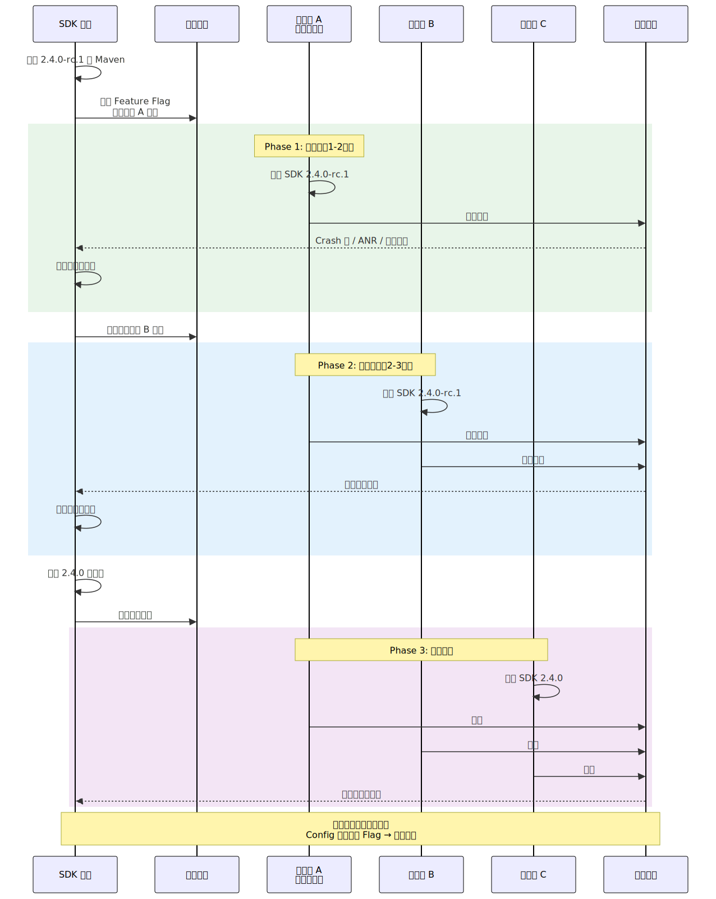

# SDK 多产品线变更管理

## 一、概述

SDK 中台化是大型组织的必然选择——将通用能力（埋点、网络、推送、登录等）抽象为 SDK，供多条产品线复用。但中台化带来的核心矛盾是：**产品线 A 的迭代需求，可能导致产品线 B、C 的线上故障。**

单产品线 SDK 的变更管理相对简单：改了就测，测了就发。但当同一套代码服务于 5 条、10 条甚至更多产品线时，每一次变更的**影响面呈指数级放大**——不同产品线的依赖版本不同、使用姿势不同、运行环境不同，任何一个不起眼的改动都可能在某条产品线上触发意料之外的问题。

本文聚焦 SDK 多产品线场景下的**三维管理模型**：

| 维度 | 核心问题 | 对应章节 |
|------|---------|---------|
| **评估** | 这次改动影响哪些产品线？影响程度多大？ | 第三章 |
| **控制** | 如何通过架构和流程降低变更风险？ | 第二、四章 |
| **验证** | 发布前如何确保不影响其他产品线？ | 第五章 |

> **前置知识**：本文是 [SDK 开发与发布](SDK开发与发布.md) 的专题。以下内容假定你已了解综述中的 API 设计原则（2.2 节：二进制兼容性）、多模块架构（4.4 节）、依赖隔离策略（4.8 节）。

---

## 二、多产品线复用的工程架构

架构是控制变更风险的**第一道防线**。如果架构上没有做隔离，后续的评估和验证再完善也只是亡羊补牢。

### 2.1 Core + Flavor 分层架构

**设计思路**：将 SDK 分为全产品线共用的 Core 层和各产品线特有的 Flavor 层，通过**依赖倒置**确保 Core 层对 Flavor 层零依赖。

```
sdk-core（全产品线共用）
  ├── 核心业务逻辑
  ├── 公开 API 接口定义
  └── 扩展点（策略接口）   ←── Flavor 层通过实现接口注入差异化行为

sdk-flavor-a（产品线 A 定制）
  ├── 实现 Core 的策略接口
  ├── 产品线 A 独有功能
  └── 产品线 A 专属配置
```

**策略接口 + 初始化注册**：

```kotlin
// sdk-core: 定义策略接口
interface EventStrategy {
    /** 事件上报前的预处理，不同产品线可注入不同逻辑 */
    fun preProcess(event: Event): Event
    /** 上报通道选择 */
    fun selectChannel(event: Event): ReportChannel
}

// sdk-core: 提供默认实现 + 注册入口
object SdkCore {
    private var eventStrategy: EventStrategy = DefaultEventStrategy()

    fun registerEventStrategy(strategy: EventStrategy) {
        eventStrategy = strategy
    }
}

// sdk-flavor-a: 产品线 A 的定制实现
class ProductAEventStrategy : EventStrategy {
    override fun preProcess(event: Event): Event {
        // 产品线 A 需要附加 sessionId
        return event.copy(extras = event.extras + ("sessionId" to SessionManager.id))
    }
    override fun selectChannel(event: Event) = ReportChannel.REALTIME
}
```

**什么逻辑放 Core、什么放 Flavor 的判断标准：**

| 判断维度 | 放 Core | 放 Flavor |
|---------|---------|----------|
| 通用性 | 所有产品线都需要 | 仅部分产品线需要 |
| 稳定性 | 半年以上不太会变 | 跟着产品线需求频繁迭代 |
| 变更频率 | 低频 | 高频 |

> Core 层的变更需要严格的影响评估（见第三章）；Flavor 层的变更只影响对应产品线，风险可控。

### 2.2 Feature Flag 与配置差异化

当差异化行为不值得抽成独立的 Flavor 模块时，用 Feature Flag 在运行时控制。

**编译时 Flag vs 运行时 Flag 选型**：

| 类型 | 实现方式 | 适用场景 | 优点 | 缺点 |
|------|---------|---------|------|------|
| 编译时 | `BuildConfig` 常量 / Gradle property | 产品线永久差异 | 零运行时开销，死代码可被 R8 移除 | 改 Flag 需重新发版 |
| 运行时 | 配置中心下发 / 初始化参数 | 灰度发布、A/B 测试、紧急关闭 | 无需发版即可切换 | 有运行时开销，需处理默认值 |

**FeatureGate 接口设计**：

```kotlin
interface FeatureGate {
    fun isEnabled(feature: Feature, productLine: String): Boolean
}

enum class Feature(val key: String, val defaultEnabled: Boolean) {
    NEW_SERIALIZER("new_serializer", false),
    REALTIME_REPORT("realtime_report", true),
    SESSION_TRACKING("session_tracking", false);
}

// 使用侧
if (featureGate.isEnabled(Feature.NEW_SERIALIZER, config.productLine)) {
    // 新序列化逻辑
} else {
    // 旧逻辑（兜底）
}
```

**Flag 生命周期管理**：Feature Flag 必须有过期清理机制，否则代码会被 `if/else` 淹没。建议在定义 Flag 时标注**预期移除版本**：

```kotlin
enum class Feature(
    val key: String,
    val defaultEnabled: Boolean,
    val removeAfterVersion: String  // 超过此版本必须清理
) {
    NEW_SERIALIZER("new_serializer", false, "2.5.0"),
    // ...
}
```

CI 中增加检查：当前版本号超过 `removeAfterVersion` 时，构建失败并提示清理。

### 2.3 模块依赖拓扑

下图展示了一个典型的多产品线 SDK 模块依赖关系：



**关键原则**：

- **Core 层对 Flavor 层零依赖**（依赖方向始终向下），Core 通过接口定义扩展点，Flavor 通过实现接口注入行为
- **产品线独有依赖隔离在 Flavor 模块**：产品线 A 需要的特殊依赖放在 `sdk-flavor-a` 的 `implementation` 中，不会传递给产品线 B、C
- **BOM 统一版本**：所有模块通过 `sdk-bom` 对齐版本号，避免产品线使用不一致的模块版本组合

---

## 三、变更影响评估

评估是变更管理的起点。目标是在代码合入前就回答清楚：**这次改动影响了哪些产品线？影响程度有多大？**

### 3.1 API 变更影响分析流水线



**第一步：Metalava API Diff**

每次 PR 自动对比 `api/current.txt` 的变化，检测公开 API 的增删改。

```yaml
# GitHub Actions 示例片段
- name: API Diff Check
  run: |
    # 生成当前分支的 API 签名
    ./gradlew sdk-api:metalavaGenerateSignature
    # 与 main 分支的签名对比
    diff api/current.txt api/released.txt > api_diff.txt || true
    if [ -s api_diff.txt ]; then
      echo "::warning::API 变更检测到，请查看 api_diff.txt"
      cat api_diff.txt >> $GITHUB_STEP_SUMMARY
    fi
```

**第二步：japicmp 二进制兼容性扫描**

```kotlin
// build.gradle.kts
plugins {
    id("me.champeau.jmh") // japicmp plugin
}

japicmp {
    oldClasspath.from(files("libs/sdk-core-2.3.0.aar"))  // 上一个 release
    newClasspath.from(tasks.named("bundleReleaseAar"))     // 当前构建
    onlyBinaryIncompatibleModified = true
    htmlOutputFile = file("$buildDir/reports/japicmp.html")
}
```

**第三步：@UsedBy 注解标注 + 自动影响矩阵**

在 SDK 的公开 API 上标注使用方，CI 读取注解自动生成影响范围：

```kotlin
@Target(AnnotationTarget.CLASS, AnnotationTarget.FUNCTION)
@Retention(AnnotationRetention.RUNTIME)
annotation class UsedBy(vararg val productLines: String)

// 使用
@UsedBy("app-main", "app-lite", "app-international")
fun reportEvent(event: Event) { ... }

@UsedBy("app-main")
fun reportEventWithSession(event: Event, sessionId: String) { ... }
```

CI 脚本扫描变更文件中的 `@UsedBy` 注解，自动生成影响矩阵报告：

```
┌──────────────────────────┬──────────┬──────────┬──────────────┐
│ 变更 API                  │ 主 App   │ 极速版    │ 国际版        │
├──────────────────────────┼──────────┼──────────┼──────────────┤
│ reportEvent()            │ 受影响    │ 受影响    │ 受影响        │
│ reportEventWithSession() │ 受影响    │ -        │ -            │
└──────────────────────────┴──────────┴──────────┴──────────────┘
```

### 3.2 行为变更的影响评估

**API 变更 vs 行为变更**：

| 对比维度 | API 变更 | 行为变更 |
|---------|---------|---------|
| 可检测性 | 编译时即可检测（编译报错 / Metalava Diff） | 编译时完全不可见 |
| 危险程度 | 中 — 至少能在编译阶段发现 | **高** — 只有运行时才暴露 |
| 典型案例 | 删除方法、修改参数类型 | 同样的输入，输出结果/时序/性能变了 |
| 检测手段 | Metalava / japicmp | 集成测试、契约测试、性能基线对比 |

**行为变更分类与评估 Checklist**：

| 变更类别 | 典型场景 | 评估要点 |
|---------|---------|---------|
| **功能行为** | 序列化格式变化、默认值变化、错误码含义变化 | 下游是否依赖了旧的输出格式？ |
| **性能行为** | 方法耗时增加、内存占用增长、网络请求频率变化 | 对各产品线的性能基线影响多大？ |
| **线程行为** | 回调线程从主线程改为 IO 线程 | 下游回调中是否有 UI 操作？ |
| **生命周期** | 初始化时机提前/延后、资源释放时机变化 | 是否影响宿主 App 的启动耗时？ |

> 行为变更的评估 Checklist（每次 PR 需回答）：
> 1. 本次变更是否改变了任何已有 API 的输出结果？
> 2. 是否改变了回调的触发线程或时序？
> 3. 是否影响了初始化/销毁的生命周期？
> 4. 是否改变了性能特征（耗时、内存、IO 频率）？
> 5. 对于以上任一"是"，列出受影响的产品线和应对方案。

### 3.3 依赖变更的传导分析

SDK 内部依赖升级（如 OkHttp 4.9 -> 4.12）看似是内部事务，但会通过 Gradle 依赖仲裁传导到宿主 App。

**逐产品线依赖检查**：

```bash
# 检查产品线 A 的 Sample 中 OkHttp 最终解析到哪个版本
./gradlew sample-a:dependencyInsight --dependency com.squareup.okhttp3:okhttp

# 对比升级前后的完整依赖树
./gradlew sample-a:dependencies --configuration runtimeClasspath > deps_new.txt
diff deps_baseline.txt deps_new.txt
```

**依赖兼容性矩阵**：维护一张各产品线关键依赖版本的矩阵表，在 SDK 升级内部依赖前先核对。

| 依赖 | SDK 当前 | SDK 升级后 | 主 App | 极速版 | 国际版 | 风险 |
|------|---------|-----------|--------|-------|--------|------|
| OkHttp | 4.9.3 | 4.12.0 | 4.11.0 | 4.9.3 | 4.12.0 | 极速版可能被强制升级 |
| Gson | 2.9.0 | 2.10.1 | 2.10.1 | 2.9.0 | 2.9.0 | 极速版/国际版被升级 |

### 3.4 变更影响分级与通知

按影响严重程度分为四级，对应不同的流程要求：

| 级别 | 定义 | 流程要求 | 示例 |
|------|------|---------|------|
| **P0** | 二进制不兼容 | 阻断合入 + Owner 审批 + 全产品线通知 | 删除公开方法、修改方法签名 |
| **P1** | 行为变更 | 强制 Code Review + 通知受影响产品线 | 回调线程变更、默认值修改 |
| **P2** | 性能影响 | Warning 标注 PR + 性能基线对比 | 方法耗时增加 20%+ |
| **P3** | 废弃通知 | 记录变更日志 + 下个大版本迁移提醒 | @Deprecated 新增 |

**自动通知机制**：CI 检测到 P0/P1 级变更后，自动在 PR 评论中 @相关产品线负责人，并创建关联 Issue。

---

## 四、变更风险控制

评估回答了"影响有多大"，控制解决的是"怎么把影响降到最小"。核心思路：**让变更的爆炸半径可控，让回退成本足够低。**

### 4.1 版本策略与分支模型

**统一版本 vs 独立版本**：

| 策略 | 做法 | 优点 | 缺点 |
|------|------|------|------|
| **统一版本（推荐）** | 所有产品线用同一个版本号（如 2.4.0），差异通过 Feature Flag 控制 | 版本矩阵简单，依赖关系清晰 | 某产品线的紧急需求可能被其他产品线拖慢 |
| 独立版本 | 不同产品线可以停留在不同版本（A 用 2.4.0、B 用 2.3.2） | 产品线间完全解耦 | 维护成本爆炸，bug 需要在多个版本线修复 |

> 绝大多数场景推荐统一版本。独立版本只适用于产品线间差异极大、几乎没有共用代码的情况——这时候应该反思是否还需要放在同一个 SDK 里。

**分支模型**：

```
main ─────●──────●──────●──────●──── 稳定分支（每个 ● = release tag）
            \          /
develop ─────●────●────●──────────── 开发分支
              \  /  \
feature/      ●●    ●────────────── 功能分支
product-a-session    \
                      ●──────────── feature/core-serializer-v2
```

**关键门禁**：
- `feature/*` -> `develop`：需通过 API Diff + 全产品线 Sample 构建
- `develop` -> `main`：需通过完整 CI Pipeline（第五章 5.2）+ 性能基线对比
- Core 层代码变更：必须有 SDK 架构 Owner 的 Code Review

### 4.2 接口版本化（API Versioning）

当产品线 A 的需求确实需要改变现有 API 行为时，**新增 V2 而非修改 V1**。V1 内部桥接到 V2 的默认行为，保证其他产品线不受影响。

```kotlin
// V1 保持不变，其他产品线无感知
@UsedBy("app-main", "app-lite", "app-international")
fun reportEvent(event: Event) {
    // 内部桥接到 V2，使用默认选项
    reportEventV2(event, ReportOptions.DEFAULT)
}

// V2 新增，产品线 A 迁移到这里
@UsedBy("app-main")
fun reportEventV2(event: Event, options: ReportOptions) {
    // 新的上报逻辑，支持更多配置
}

data class ReportOptions(
    val includeSessionId: Boolean = false,
    val channel: ReportChannel = ReportChannel.BATCH,
    val priority: Priority = Priority.NORMAL
) {
    companion object {
        val DEFAULT = ReportOptions()
    }
}
```

**何时用接口版本化 vs Feature Flag**：

| 场景 | 推荐方式 |
|------|---------|
| 新增可选能力，旧行为完全不变 | Feature Flag |
| 改变了已有 API 的语义/参数/返回值 | 接口版本化 |
| 临时灰度，最终全量统一 | Feature Flag（灰度结束后清理） |
| 永久共存两种行为模式 | 接口版本化 |

### 4.3 Feature Flag 门控发布

新功能默认关闭，按产品线逐步开放：

```kotlin
// sdk-core 中的门控逻辑
fun processEvent(event: Event): ProcessResult {
    val enrichedEvent = if (featureGate.isEnabled(
            Feature.SESSION_TRACKING, config.productLine
        )) {
        // 新逻辑：附加 session 信息
        event.withSessionInfo(sessionManager.currentSession)
    } else {
        // 旧逻辑：保持原样
        event
    }
    return eventProcessor.process(enrichedEvent)
}
```

**产品线级别的开关配置**（配置中心下发格式示例）：

```json
{
  "feature_flags": {
    "session_tracking": {
      "app-main": { "enabled": true, "rollout_percent": 100 },
      "app-lite": { "enabled": true, "rollout_percent": 20 },
      "app-international": { "enabled": false }
    }
  }
}
```

### 4.4 Breaking Change 协调流程

当无法通过接口版本化或 Feature Flag 避免破坏性变更时（例如底层架构重构），需要走正式的协调流程：

**协调时间线**：

```
Sprint N     : 需求评审 + 影响分析报告 → 发送给所有产品线
Sprint N+1   : 方案评审 + 各产品线确认迁移计划
Sprint N+2   : 实现 + @Deprecated 标注旧 API（编译 Warning）
Sprint N+3~4 : 迁移窗口期（各产品线适配新 API）
Sprint N+5   : @Deprecated(level = ERROR) → 编译报错
Sprint N+6   : 移除旧 API，发布新大版本
```

**迁移窗口期的硬性要求**：

- 最少给 **2 个 Sprint**（约 4 周）的适配时间
- 迁移期间 SDK 同时支持新旧两套 API
- 提供迁移指南文档 + 代码示例 + 自动化迁移脚本（如 IntelliJ Structural Search Replace）
- 每周同步各产品线的迁移进度

> 关于 `@Deprecated` 三阶段过渡策略的细节，参见综述 [SDK 开发与发布 - 2.2 节](SDK开发与发布.md)。

---

## 五、验证体系

控制降低了变更的风险，验证则是发布前的**最后一道关卡**：证明这次变更确实没有影响其他产品线。

### 5.1 兼容性验证矩阵

**三维矩阵**：Android 版本 x 宿主 App 版本 x 依赖组合。

| | Android 10 | Android 12 | Android 14 |
|--|-----------|-----------|-----------|
| **主 App（OkHttp 4.11）** | Sample 构建 + 集成测试 | 同左 | 同左 |
| **极速版（OkHttp 4.9）** | Sample 构建 + 集成测试 | 同左 | 同左 |
| **国际版（OkHttp 4.12）** | Sample 构建 + 集成测试 | 同左 | 同左 |

完整矩阵的组合数可能非常大。实际操作中采用 **Pairwise Testing**（两两组合覆盖）思想缩减测试用例：不要求覆盖所有 N 维组合，而是保证任意两个维度的所有组合至少出现一次。工具如 PICT (Microsoft) 可以自动生成最小测试集。

### 5.2 自动化集成验证流水线

这是验证体系的核心基础设施。



**Multi-Sample CI 架构**：为每个产品线维护一个 Sample App，CI 中自动构建并验证所有 Sample。

```kotlin
// settings.gradle.kts
// 每个产品线一个 sample module，模拟真实接入环境
include(":sample-main")       // 主 App 的接入方式
include(":sample-lite")       // 极速版的接入方式
include(":sample-international") // 国际版的接入方式
```

```kotlin
// build.gradle.kts - 自动发现并构建所有 sample 模块
tasks.register("buildAllSamples") {
    description = "构建所有产品线的 Sample App"
    dependsOn(
        subprojects
            .filter { it.name.startsWith("sample-") }
            .map { ":${it.name}:assembleRelease" }
    )
}

tasks.register("testAllSamples") {
    description = "运行所有产品线的集成测试"
    dependsOn(
        subprojects
            .filter { it.name.startsWith("sample-") }
            .map { ":${it.name}:connectedAndroidTest" }
    )
}
```

**契约测试（Contract Testing）**：

每个产品线定义自己使用 SDK 的"契约"——调用哪些 API、传什么参数、期望什么行为。CI 中自动验证契约是否被打破。

```kotlin
// sample-main/src/androidTest/.../ContractTest.kt
@RunWith(AndroidJUnit4::class)
class MainAppContractTest {

    @Test
    fun `reportEvent should batch by default`() {
        // 契约：主 App 调用 reportEvent，默认走批量通道
        val result = SdkCore.reportEvent(testEvent)
        assertThat(result.channel).isEqualTo(ReportChannel.BATCH)
    }

    @Test
    fun `init should complete within 50ms`() {
        // 契约：初始化不应超过 50ms（主 App 对冷启动敏感）
        val elapsed = measureTimeMillis { SdkCore.init(mainAppConfig) }
        assertThat(elapsed).isLessThan(50)
    }

    @Test
    fun `callback should be invoked on main thread`() {
        // 契约：事件上报回调必须在主线程
        val latch = CountDownLatch(1)
        var callbackThread: Thread? = null
        SdkCore.reportEvent(testEvent) { result ->
            callbackThread = Thread.currentThread()
            latch.countDown()
        }
        latch.await(5, TimeUnit.SECONDS)
        assertThat(callbackThread?.name).contains("main")
    }
}
```

> 契约测试的核心价值：它不是测 SDK 的内部逻辑，而是测**产品线对 SDK 行为的假设**是否仍然成立。当 SDK 变更打破了某个产品线的契约，即使编译能通过，契约测试也会失败。

### 5.3 灰度发布与分级验证



**分级策略**：

| 阶段 | 版本标识 | 范围 | 观察周期 | 晋级标准 |
|------|---------|------|---------|---------|
| alpha | 2.4.0-alpha.1 | SDK 团队内测 | 1-2 天 | 功能验证通过 |
| beta | 2.4.0-beta.1 | 金丝雀产品线（流量最小 / 最稳定） | 2-3 天 | Crash 率不升、核心指标不退化 |
| rc | 2.4.0-rc.1 | 全产品线灰度（按比例） | 3-5 天 | 全指标在基线范围内 |
| release | 2.4.0 | 全量 | 持续监控 | - |

**核心监控指标与阈值**：

| 指标 | 基线来源 | 告警阈值 | 回滚阈值 |
|------|---------|---------|---------|
| Crash 率 | 上一版本同期 | 上升 0.01% | 上升 0.05% |
| ANR 率 | 上一版本同期 | 上升 0.005% | 上升 0.02% |
| SDK 初始化耗时 P99 | 上一版本 P99 | 上升 20% | 上升 50% |
| API 成功率 | 上一版本同期 | 下降 0.1% | 下降 0.5% |

### 5.4 线上监控与快速回滚

**SDK 版本粒度的监控大盘**：按 SDK 版本号 x 产品线维度聚合 Crash、ANR、性能指标，做到精准归因。

**回滚策略对比**：

| 策略 | 时效 | 适用场景 | 操作 |
|------|------|---------|------|
| **Feature Flag 一键关闭** | 秒级 | 新功能导致的问题 | 配置中心关闭 Flag，新功能立即停用 |
| **hotfix 版本** | 小时级 | 核心逻辑 bug | 发布 2.4.1 修复版本，推送各产品线升级 |
| **版本回退** | 天级 | 严重架构问题 | 各产品线回退到 2.3.x，成本最高 |

> Feature Flag 的最大价值不在灰度发布，而在于**提供了秒级回滚能力**。这是 hotfix 版本无法比拟的优势。

---

## 六、实战案例

### 6.1 端到端案例：Event 新增 sessionId 字段

**背景**：产品线 A（主 App）需要在事件上报中附加 `sessionId` 字段用于会话归因。这会改变 `Event` 数据类的结构和序列化输出。SDK 当前被三条产品线接入。

**Step 1：影响评估**

CI 自动生成的影响报告：

```
变更文件: sdk-core/src/.../Event.kt, sdk-core/src/.../EventSerializer.kt
API 变更: Event 新增 sessionId: String? 字段（默认值 null，源码/二进制均兼容）
行为变更: 序列化输出新增 "session_id" 字段（当非 null 时）
影响分级: P1（行为变更 — 序列化格式变化）

影响矩阵:
  - 主 App: 需要此功能，直接受益
  - 极速版: 使用 Event 序列化结果做本地缓存 key → 缓存 key 会变，需评估
  - 国际版: 仅使用 reportEvent()，不解析序列化结果 → 低风险
```

**Step 2：方案设计**

- `Event` 新增 `sessionId: String? = null`，默认值 null 保证二进制兼容
- 用 Feature Flag `SESSION_TRACKING` 控制是否填充 sessionId
- 极速版的缓存 key 问题：通过 Flavor 层覆盖缓存 key 生成逻辑解决

**Step 3：开发与门控**

```kotlin
// sdk-core: Event 数据类
data class Event(
    val name: String,
    val params: Map<String, Any>,
    val sessionId: String? = null  // 新增，默认 null
)

// sdk-core: 上报逻辑中的门控
fun reportEvent(event: Event): ReportResult {
    val finalEvent = if (featureGate.isEnabled(
            Feature.SESSION_TRACKING, config.productLine
        )) {
        event.copy(sessionId = sessionManager.currentSessionId)
    } else {
        event  // sessionId 保持 null，序列化时不输出该字段
    }
    return doReport(finalEvent)
}
```

**Step 4：CI 验证**

- Metalava API Diff：通过（新增字段有默认值，源码兼容）
- japicmp：通过（二进制兼容）
- Sample 构建：三个产品线全部通过
- 契约测试：极速版的缓存 key 测试失败 → 在 Flavor 层修复缓存 key 生成逻辑后通过

**Step 5：灰度发布**

1. alpha：SDK 团队 Sample App 验证，1 天
2. beta：主 App 开启 Feature Flag，灰度 5%，观察 2 天 → Crash 率持平，会话归因数据正常
3. rc：主 App 全量开启，极速版/国际版保持 Flag 关闭，观察 3 天
4. release：发布 2.4.0 正式版

### 6.2 补充案例

**案例 B：OkHttp 版本跳跃（依赖传导）**

SDK 将 OkHttp 从 4.9.3 升级到 4.12.0。依赖兼容性矩阵显示极速版仍在用 4.9.3。Gradle 仲裁会将极速版强制升级到 4.12.0。处理方式：将 OkHttp 改为 `compileOnly` + 适配器模块（参见综述 4.8 节的适配器策略），让各产品线自行管理 OkHttp 版本。

**案例 C：序列化耗时增加（性能回退）**

新增 sessionId 字段后，序列化耗时从 2ms 增加到 3.5ms（P99）。CI 性能基线对比检测到 P2 级告警。排查发现 sessionId 的获取涉及一次 SharedPreferences 读取。优化：将 sessionId 缓存到内存，耗时回落到 2.1ms。

**案例 D：回调线程变更（线程行为）**

SDK 内部重构将事件上报改为协程实现，导致回调从主线程变为 `Dispatchers.IO` 线程。主 App 的契约测试 `callback should be invoked on main thread` 立即失败。修复：在回调分发处增加 `withContext(Dispatchers.Main)` 保持原有线程语义。

---

## 七、常见面试题与解答

### Q1：SDK 被多条产品线复用时，某个产品线需要迭代功能，如何评估对其他产品线的影响？

**A**：建立系统化的四层评估体系：

1. **API 层面**：用 Metalava 生成 API 签名 Diff，检测公开 API 的增删改；用 japicmp 扫描二进制兼容性。这一层可以完全自动化。
2. **行为层面**：逐一检查功能行为、性能行为、线程行为、生命周期行为是否发生变化。这一层需要 PR 作者填写行为变更 Checklist。
3. **依赖层面**：如果涉及内部依赖升级，用 `dependencyInsight` 逐产品线检查依赖仲裁结果，核对依赖兼容性矩阵。
4. **产品线映射**：通过 `@UsedBy` 注解或接入方注册表，自动生成影响矩阵，明确哪些产品线使用了被变更的 API。

最终输出影响分析报告，按 P0-P3 分级，P0/P1 自动通知产品线负责人。

### Q2：如何设计 SDK 架构使其支持多产品线差异化，同时保持核心代码统一？

**A**：采用 **Core + Flavor 分层架构**：

- `sdk-core` 包含所有产品线共用的核心逻辑，通过策略接口定义扩展点
- `sdk-flavor-X` 实现 Core 的策略接口，注入产品线特有行为
- 依赖方向严格向下：Core 不知道 Flavor 的存在，通过初始化时的接口注册实现解耦
- 轻量差异用 Feature Flag 控制，不值得建 Flavor 模块时使用运行时 Flag

关键判断标准：通用性高、变更频率低的逻辑放 Core；仅部分产品线需要、跟随产品线迭代的逻辑放 Flavor。

### Q3：什么是契约测试（Contract Testing）？在 SDK 多产品线场景下如何应用？

**A**：契约测试不是测 SDK 内部逻辑，而是测**产品线对 SDK 行为的假设**是否仍然成立。

每个产品线的 Sample App 中编写一组契约测试，表达"我使用 SDK 时依赖了哪些行为"。例如：主 App 的契约测试可能包含"回调必须在主线程"、"初始化不超过 50ms"、"reportEvent 默认走 BATCH 通道"。

SDK 的每次 PR 会自动触发所有产品线的契约测试。如果 SDK 的变更打破了某个产品线的契约（比如改了回调线程），即使编译能通过，契约测试也会立即失败，在合入前就暴露问题。

### Q4：SDK 的灰度发布策略应该如何设计？发现问题如何快速回滚？

**A**：采用四阶段分级发布：alpha（团队内测）-> beta（金丝雀产品线）-> rc（全产品线灰度）-> release（全量）。每个阶段设定明确的观察周期和晋级标准（Crash 率、ANR 率、性能指标等不退化）。

回滚有三种策略：
- **Feature Flag 一键关闭**（秒级）：新功能通过 Flag 门控，问题发生时关闭 Flag 即可恢复旧行为，无需发版
- **hotfix 版本**（小时级）：紧急修复核心 bug，发布补丁版本
- **版本回退**（天级）：最后手段，各产品线回退到上一个稳定版本

Feature Flag 是最核心的回滚手段，因此新功能应该默认通过 Flag 门控发布。

### Q5：API 变更和行为变更哪个更危险？为什么？分别如何检测？

**A**：**行为变更更危险。**

API 变更（删除方法、修改参数类型等）在编译时就会报错，或者被 Metalava/japicmp 等工具自动检测。开发者在集成时立即就能发现问题。

行为变更（同样的输入产生不同的输出/时序/性能）在编译时完全不可见，只有运行时才暴露。例如回调线程从主线程变为 IO 线程——API 签名没变，编译不报错，但下游在回调里操作 UI 就会崩溃。

检测手段：
- API 变更：Metalava API Diff + japicmp 二进制兼容性扫描（自动化，CI 中运行）
- 行为变更：契约测试（各产品线定义行为假设）+ 性能基线对比 + 行为变更 Checklist（PR 作者自检）

### Q6：Breaking Change 的发布协调流程应该怎么设计？

**A**：采用 **6 个 Sprint 的渐进式流程**：

1. Sprint N：需求评审 + 影响分析报告，发送给所有受影响产品线
2. Sprint N+1：方案评审 + 各产品线确认迁移计划
3. Sprint N+2：实现 + `@Deprecated` 标注旧 API（编译 Warning 阶段）
4. Sprint N+3~4：迁移窗口期，各产品线适配新 API。SDK 同时支持新旧两套 API
5. Sprint N+5：`@Deprecated(level = ERROR)`，强制编译报错
6. Sprint N+6：移除旧 API，发布新大版本

关键保障：迁移窗口期最少 2 个 Sprint；提供迁移指南 + 代码示例 + 自动化迁移脚本；每周同步各产品线迁移进度。

### Q7：如何设计 SDK 的自动化集成验证流水线，确保每次变更不影响所有已接入的产品线？

**A**：构建三阶段 CI Pipeline：

1. **Stage 1 静态分析**：并行执行 Metalava API Diff、japicmp 二进制兼容性扫描、Lint 代码检查。任一不通过则直接阻断。
2. **Stage 2 全产品线构建**：为每个产品线维护一个 Sample App（模拟真实接入环境），CI 自动构建所有 Sample。编译失败定位到具体产品线。
3. **Stage 3 集成验证**：运行各产品线的契约测试 + 核心集成测试 + 性能基线对比。

每个 Stage 设置 Gate，全部通过才允许合入。这确保了从 API 兼容性到运行时行为的完整覆盖，且全自动化无需人工干预。
