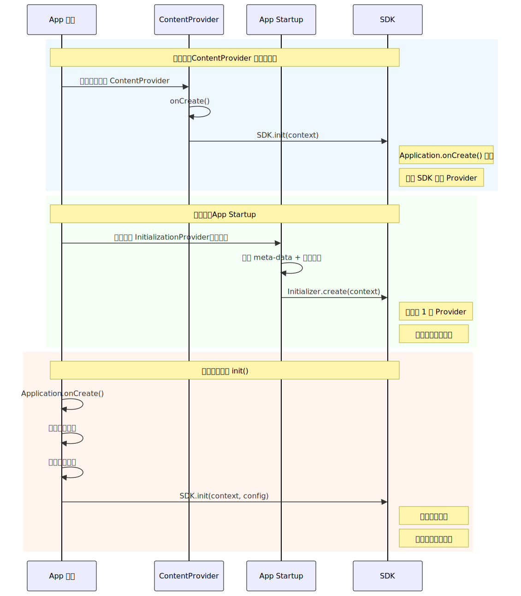

# SDK 开发与发布

## 一、概述

> SDK（Software Development Kit）本质上是**运行在别人进程里的代码**。这个定义决定了 SDK 开发与 App 开发在工程纪律上的根本差异——你无法控制宿主环境，但你的每一个 bug 都会变成宿主的 bug。

### App 开发 vs SDK 开发

| 维度 | App 开发 | SDK 开发 |
|------|---------|---------|
| 运行环境 | 自己掌控，可以预设依赖和配置 | 运行在未知的宿主 App 中，环境不可控 |
| API 变更 | 内部重构自由，不影响外部 | 每次公开 API 变更都可能破坏下游 |
| 依赖管理 | 自由选择依赖版本 | 依赖可能与宿主冲突，必须最小化 |
| 异常处理 | Crash 就是 Crash | SDK 的 Crash 变成宿主的 Crash，不可接受 |
| 体积敏感度 | 几 MB 的增量不敏感 | 每增加 100KB 都可能被宿主方拒绝接入 |
| 初始化 | 自己控制 Application 生命周期 | 不能假设宿主何时、是否调用初始化 |
| 混淆 | 全量混淆即可 | 公开 API 不能混淆，内部实现必须混淆 |

### SDK 开发三大核心纪律

**纪律一：最小侵入。** SDK 对宿主 App 的影响必须尽可能小——体积小、方法数少、不强制依赖、不占用主线程、不抢占系统资源。宿主接入你的 SDK，不应该需要修改自身架构。

**纪律二：向后兼容。** 每一次 SDK 版本升级，已有的公开 API 不能出现二进制不兼容变更。宿主方可能几个月甚至一年才升级一次你的 SDK，中间跨越多个版本的升级必须平滑。

**纪律三：隔离稳定。** SDK 内部的异常不能传播到宿主进程，SDK 的线程不能抢占宿主的 CPU 时间片，SDK 的资源不能与宿主冲突。SDK 必须像一个"沙盒"一样运行。

---

## 二、API 设计原则

### 2.1 最小暴露面（Minimal API Surface）

> 公开的每一个类、方法、字段，都是你对外的**契约**。契约越多，未来的维护成本越高，破坏兼容性的风险越大。

**原则：默认一切不公开，需要公开时再仔细评审。**

**Kotlin `internal` 关键字**

Kotlin 的 `internal` 修饰符将可见性限制在同一模块内，编译后会被 name mangling（名称混淆），其他模块无法正常调用：

```kotlin
// SDK 内部使用，不暴露给宿主
internal class NetworkEngine {
    internal fun execute(request: Request): Response { ... }
}

// 公开 API
class MySDK {
    fun sendEvent(event: Event) {
        // 内部使用 NetworkEngine，宿主不可见
        NetworkEngine().execute(event.toRequest())
    }
}
```

**`@RestrictTo` 注解**

对于 Java 代码或需要跨模块但不想对外暴露的场景，使用 AndroidX 的 `@RestrictTo`：

```java
@RestrictTo(RestrictTo.Scope.LIBRARY_GROUP)  // 仅同 group 的模块可见
public class InternalHelper {
    @RestrictTo(RestrictTo.Scope.LIBRARY)     // 仅当前模块可见
    public static void doSomething() { ... }
}
```

| Scope | 含义 | 典型场景 |
|-------|------|---------|
| `LIBRARY` | 仅当前模块可见 | 模块内部工具类 |
| `LIBRARY_GROUP` | 同 group 下所有模块可见 | SDK 多模块间共享 |
| `LIBRARY_GROUP_PREFIX` | 同 group 前缀的模块可见 | 大型 SDK 组织（如 `com.example.sdk.*`） |
| `TESTS` | 仅测试可见 | 测试辅助方法 |

**api / impl 模块分层**

对于中大型 SDK，推荐将公开接口与内部实现分离到不同模块：

```
my-sdk/
├── sdk-api/        ← 公开接口模块，只有接口/抽象类/数据类
│   └── com.example.sdk.api/
│       ├── MySDK.kt              (入口类)
│       ├── Config.kt             (配置数据类)
│       └── Callback.kt           (回调接口)
├── sdk-impl/       ← 内部实现模块，implementation 依赖，不传递给宿主
│   └── com.example.sdk.internal/
│       ├── NetworkEngine.kt
│       ├── CacheManager.kt
│       └── TaskScheduler.kt
└── sdk/            ← 聚合模块，宿主只依赖这一个
    └── build.gradle.kts
        api(project(":sdk-api"))
        implementation(project(":sdk-impl"))
```

宿主只能看到 `sdk-api` 中的类型，`sdk-impl` 的类不会出现在宿主的编译类路径中。

### 2.2 向后兼容与二进制兼容性

兼容性有三个层次，理解它们的区别是 SDK 开发者的基本功：

| 层次 | 定义 | 检测方式 |
|------|------|---------|
| **源码兼容** | 宿主代码不修改即可重新编译通过 | 编译测试 |
| **二进制兼容** | 宿主不重新编译，直接替换 SDK 新版 AAR 即可运行 | Metalava / japicmp |
| **行为兼容** | 相同输入产生相同输出，不改变语义 | 集成测试 / 回归测试 |

> 最容易忽视的是**二进制兼容**。源码看起来没问题，但宿主不重新编译的情况下，旧的 class 文件引用的方法签名可能已经变了。

**常见的二进制不兼容变更**

```kotlin
// v1.0 — 原始 API
fun init(context: Context)

// v1.1 — 新增参数并提供默认值
// 源码兼容：宿主的 init(context) 调用能编译通过
// 二进制不兼容！Kotlin 默认参数在字节码层面生成了不同的方法签名
fun init(context: Context, config: Config = Config.DEFAULT)
```

**安全的演进方式**：

```kotlin
// v1.0
fun init(context: Context)

// v1.1 — 重载而非默认参数
fun init(context: Context)  // 保留原方法
fun init(context: Context, config: Config)  // 新增重载

// 或者使用 @JvmOverloads（仅当你确认字节码签名稳定时）
@JvmOverloads
fun init(context: Context, config: Config = Config.DEFAULT)
```

**其他高危操作**：

| 变更类型 | 源码兼容 | 二进制兼容 | 说明 |
|---------|---------|-----------|------|
| 删除 public 方法 | 不兼容 | 不兼容 | 绝对禁止 |
| 修改方法返回类型 | 不兼容 | 不兼容 | 即使是子类型也不行 |
| 添加带默认值的参数（Kotlin） | 兼容 | **不兼容** | 字节码签名变化 |
| 将 class 改为 interface | 不兼容 | 不兼容 | 调用指令变化（invokevirtual → invokeinterface） |
| 将 open class 改为 final | 部分不兼容 | **不兼容** | 已有子类会报错 |
| 新增接口方法（无默认实现） | 不兼容 | 不兼容 | 已有实现类编译失败 |
| 新增接口方法（有默认实现） | 兼容 | 兼容 | Java 8+ / Kotlin 默认方法 |

**工具辅助**

- **Metalava**：Google 官方的 API 签名管理工具，生成 `api/current.txt`，CI 中比对变更检测不兼容修改
- **japicmp**：Java API Compatibility Checker，对比两个 JAR/AAR 的二进制兼容性，生成报告

**`@Deprecated` 过渡策略**

```kotlin
// v1.2 — 标记废弃，提供替代方案
@Deprecated(
    message = "Use init(context, config) instead",
    replaceWith = ReplaceWith("init(context, Config.DEFAULT)"),
    level = DeprecationLevel.WARNING  // WARNING → ERROR → HIDDEN 三阶段
)
fun init(context: Context) {
    init(context, Config.DEFAULT)  // 内部桥接到新 API
}
```

推荐的废弃节奏：
1. **v1.2**：`WARNING` — 编译警告，引导迁移
2. **v1.3**（至少一个版本后）：`ERROR` — 编译报错，强制迁移
3. **v2.0**（大版本）：`HIDDEN` 或直接移除

### 2.3 命名与包结构规范

**包名策略**：使用公司/组织域名反转 + SDK 名称，确保全局唯一：

```
com.example.analytics/          ← 公开 API
com.example.analytics.internal/ ← 内部实现（配合 @RestrictTo 或 internal）
```

**资源前缀**：在 `build.gradle.kts` 中配置 `resourcePrefix`，强制所有资源名以特定前缀开头，防止与宿主资源冲突：

```kotlin
android {
    resourcePrefix = "mysdk_"  // 所有资源必须以 mysdk_ 开头
}
// mysdk_bg_button.xml, mysdk_color_primary, @string/mysdk_error_message
```

> Lint 会检查不符合前缀的资源并报错，但 `resourcePrefix` 只作用于当前模块，不影响依赖的库。

---

## 三、初始化设计

### 3.1 三种初始化方式对比

SDK 初始化是宿主接入的第一步，选择合适的初始化方式直接影响接入体验和启动性能。



| 维度 | ContentProvider 自动初始化 | App Startup | 手动 init() |
|------|--------------------------|-------------|-------------|
| 接入侵入性 | 零代码（Manifest 合并自动注册） | 零代码（Manifest 合并） | 宿主需在 Application 中调用 |
| 初始化时机 | App 启动时自动执行 | App 启动时自动执行 | 宿主决定何时调用 |
| 可控性 | 低（宿主无法控制时机和顺序） | 中（可通过 Manifest 禁用自动初始化） | 高（宿主完全控制） |
| 启动性能 | 差（每个 SDK 一个 ContentProvider） | 较好（合并为一个 ContentProvider） | 最好（可延迟到首次使用） |
| 隐私合规 | 差（用户授权前就已初始化） | 差（同上，除非手动禁用） | 好（可在授权后初始化） |
| 依赖关系 | 无法声明依赖顺序 | 支持 DAG 依赖声明 | 宿主自行控制 |

> ContentProvider 自动初始化和 App Startup 的实现原理已在 [ContentProvider 深度解析 - 第六章](../Framework/ContentProvider深度解析.md#六contentprovider-在-sdk-初始化中的应用) 详述，包括 `InitializationProvider` 的合并机制和 `Initializer` 的拓扑排序原理。本节聚焦 SDK 设计者的**选型决策**。

**选型建议**：

- **轻量级工具 SDK**（日志、崩溃上报、性能监控）：倾向 App Startup 或 ContentProvider，因为这类 SDK 需要尽早生效，且通常不涉及隐私数据
- **业务功能 SDK**（广告、推送、数据分析）：**必须提供手动 init()**，隐私合规是硬性要求
- **最佳实践——双模式支持**：同时提供自动初始化和手动初始化，让宿主选择

```kotlin
// SDK 入口类 — 支持双模式
class MySDK private constructor() {
    companion object {
        @Volatile
        private var instance: MySDK? = null
        private var isInitialized = false

        /**
         * 手动初始化（推荐用于需要隐私合规的场景）
         * 必须在使用任何 SDK 功能前调用
         */
        @JvmStatic
        fun init(context: Context, config: Config = Config.DEFAULT) {
            if (isInitialized) return
            synchronized(this) {
                if (isInitialized) return
                instance = MySDK().apply { doInit(context.applicationContext, config) }
                isInitialized = true
            }
        }

        @JvmStatic
        fun getInstance(): MySDK {
            return instance ?: throw IllegalStateException(
                "MySDK is not initialized. Call MySDK.init(context) first."
            )
        }
    }
}

// App Startup 自动初始化（宿主可在 Manifest 中禁用）
internal class MySDKInitializer : Initializer<MySDK> {
    override fun create(context: Context): MySDK {
        MySDK.init(context)
        return MySDK.getInstance()
    }
    override fun dependencies(): List<Class<out Initializer<*>>> = emptyList()
}
```

宿主禁用自动初始化的方式：

```xml
<!-- 宿主 AndroidManifest.xml -->
<provider
    android:name="androidx.startup.InitializationProvider"
    android:authorities="${applicationId}.androidx-startup"
    tools:node="merge">
    <meta-data
        android:name="com.example.sdk.MySDKInitializer"
        tools:node="remove" />  <!-- 移除 SDK 的自动初始化 -->
</provider>
```

### 3.2 隐私合规场景下的初始化策略

国内个人信息保护法（PIPL）和欧盟 GDPR 都要求：**在用户同意隐私政策之前，不得收集任何个人信息**。这直接影响 SDK 的初始化设计。

**两阶段初始化模式**：

```
App 启动
  → 阶段一：SDK 预初始化（不涉及任何数据采集）
      - 读取配置、初始化内部数据结构
      - 注册生命周期监听（但不发送数据）
  → 用户同意隐私政策
  → 阶段二：SDK 正式激活（开始正常功能）
      - 生成设备标识、开始数据采集
      - 发送缓存的事件
```

```kotlin
class MySDK {
    companion object {
        // 阶段一：轻量预初始化，不触碰隐私数据
        fun preInit(context: Context) {
            // 初始化内部组件，但不采集任何数据
            InternalCache.init(context)
            EventQueue.init()  // 事件缓冲队列
        }

        // 阶段二：用户授权后正式启动
        fun activate(config: Config) {
            check(InternalCache.isReady) { "Call preInit() first" }
            DeviceIdManager.generate()  // 此时才生成设备标识
            EventQueue.flush()          // 发送缓存事件
            DataCollector.start()       // 开始数据采集
        }
    }
}
```

> 设计要点：阶段一绝不能调用 `Settings.Secure.getString(ANDROID_ID)`、`TelephonyManager.getDeviceId()` 等隐私 API。合规审查会扫描 SDK 的所有代码路径，确保未授权状态下这些 API 不可达。

---

## 四、依赖管理

> 依赖管理是 SDK 工程中**最容易踩坑、最难排查、对宿主伤害最大**的领域。App 开发者可以自由升降依赖版本，而 SDK 开发者的每一个依赖决策都会传导到所有下游宿主。
>
> 依赖冲突的底层解决机制（Highest Version Wins、force/exclude/substitution）和三大核心策略（compileOnly、BOM、Shadow Relocate）已在 [Gradle 构建流程与 APK 编译 - 8.2/8.3 节](Gradle构建流程与APK编译.md#82-依赖冲突解决机制) 详述。本章在此基础上，从 SDK 开发者视角系统梳理依赖设计的全景。

### 4.1 依赖配置类型选择

SDK 通过不同的依赖配置类型，控制依赖对宿主的可见性和传递行为：

```kotlin
// sdk/build.gradle.kts
dependencies {
    // api — 传递给宿主，宿主编译时可见
    api("com.example:sdk-api:1.0.0")

    // implementation — 不传递，宿主编译时不可见（但运行时在类路径中）
    implementation("com.squareup.okhttp3:okhttp:4.12.0")

    // compileOnly — 编译时参与，不打入 AAR，运行时由宿主提供
    compileOnly("androidx.core:core-ktx:1.9.0")

    // runtimeOnly — 编译时不可见，运行时打入（罕见，用于 SPI 等场景）
    runtimeOnly("com.example:sdk-impl-default:1.0.0")
}
```

**决策矩阵——SDK 依赖应该用哪种配置？**

| 场景 | 配置 | 理由 | 风险 |
|------|------|------|------|
| 依赖的类型出现在公开 API 的方法签名中 | `api` | 宿主需要编译时引用这些类型 | 版本变化直接影响宿主 |
| SDK 内部使用，类型不暴露给宿主 | `implementation` | 不污染宿主编译类路径 | 仍参与版本仲裁（Highest Wins），可能拉高宿主版本 |
| 宿主大概率已有的通用库（OkHttp/Gson/AndroidX） | `compileOnly` | 完全不参与宿主依赖图 | 宿主缺失时运行时 ClassNotFoundException |
| SDK 自身的内部模块间依赖 | `implementation` | 内部模块细节不暴露 | -- |
| 公开 API 模块（api/impl 分层中的 api 模块） | `api` | 宿主需要使用接口类型 | 接口变更需遵循兼容性规则 |

> **核心原则**：`compileOnly` > `implementation` > `api`，从左到右侵入性递增。能用 `compileOnly` 的绝不用 `implementation`。

### 4.2 `implementation` 的隐蔽陷阱

很多 SDK 开发者以为 `implementation` 不传递就安全了。实际上，**`implementation` 依赖虽然不传递编译可见性，但仍然会写入 POM 文件的 `<dependencies>` 节（scope=runtime），参与 Gradle 的版本仲裁。**

```
场景：SDK implementation 了 OkHttp 4.12.0
    SDK POM: <dependency>okhttp:4.12.0 scope=runtime</dependency>

宿主自己依赖了 OkHttp 4.9.3
    Gradle 版本仲裁: max(4.12.0, 4.9.3) = 4.12.0

结果：宿主被迫升级到 4.12.0，即使宿主从未同意这次升级
```

**真实案例**：

SDK 使用了 `implementation("com.google.protobuf:protobuf-javalite:3.25.0")`，宿主原本用 `3.21.0`。Gradle 仲裁后升到 `3.25.0`，但 protobuf 生成的代码在 `3.25.0` 中移除了某些已废弃的 API，导致宿主编译失败——而宿主开发者根本不知道是你的 SDK 引起的。

**应对**：

```kotlin
// 方案一：compileOnly + 文档声明（首选）
compileOnly("com.google.protobuf:protobuf-javalite:3.21.0")
// 接入文档：本 SDK 需要 protobuf-javalite >= 3.21.0

// 方案二：如果必须用 implementation，锁定版本范围
implementation("com.google.protobuf:protobuf-javalite") {
    version {
        // strictly: 强制版本不被拉高（即使宿主有更高版本）
        // require: 声明最低版本
        strictly("[3.21.0, 3.26.0)")  // 限定在 3.21 ~ 3.25 之间
    }
}
```

### 4.3 `compileOnly` 的防御式编程

`compileOnly` 最大的优势是完全不参与宿主依赖图，但代价是：如果宿主没有提供这个依赖，运行时会 `ClassNotFoundException` 或 `NoClassDefFoundError`。

**安全使用模式——运行时检测类是否存在**：

```kotlin
internal object OptionalDeps {
    val hasOkHttp: Boolean by lazy {
        try {
            Class.forName("okhttp3.OkHttpClient")
            true
        } catch (e: ClassNotFoundException) {
            false
        }
    }

    val hasGson: Boolean by lazy {
        try {
            Class.forName("com.google.gson.Gson")
            true
        } catch (e: ClassNotFoundException) {
            false
        }
    }
}

// 使用时根据可用性选择实现
internal fun createHttpClient(): HttpClient {
    return if (OptionalDeps.hasOkHttp) {
        OkHttpClientWrapper()  // 优先用 OkHttp
    } else {
        UrlConnectionClient()  // 兜底用 HttpURLConnection
    }
}
```

**适合 `compileOnly` 的典型依赖**：

| 依赖 | 理由 |
|------|------|
| `androidx.core:core-ktx` | 几乎所有 App 都有 |
| `androidx.fragment:fragment-ktx` | 绝大多数 App 都有 |
| `com.squareup.okhttp3:okhttp` | 主流 App 基本都集成 |
| `org.jetbrains.kotlinx:kotlinx-coroutines-android` | Kotlin 项目标配 |

**不适合 `compileOnly` 的**：SDK 内部独有的库（宿主不可能有的），必须用 `implementation` 或 Shadow Relocate。

### 4.4 多模块 SDK 的依赖架构

中大型 SDK 通常包含多个模块。模块间的依赖关系设计直接决定了宿主的接入灵活性：

```
my-sdk/
├── sdk-api/          ← 纯接口模块（零依赖）
├── sdk-core/         ← 核心实现（最小依赖）
├── sdk-okhttp/       ← OkHttp 适配层（compileOnly OkHttp）
├── sdk-gson/         ← Gson 适配层（compileOnly Gson）
└── sdk-bom/          ← BOM 版本管理
```

```kotlin
// sdk-core/build.gradle.kts
dependencies {
    api(project(":sdk-api"))           // 公开接口传递给宿主
    implementation(project(":sdk-impl")) // 内部实现不传递
}

// sdk-okhttp/build.gradle.kts（可选适配模块）
dependencies {
    implementation(project(":sdk-core"))
    compileOnly("com.squareup.okhttp3:okhttp:4.12.0")
}
```

**宿主按需选择**：

```kotlin
// 宿主 build.gradle.kts
dependencies {
    implementation(platform("com.example:sdk-bom:1.2.0"))
    implementation("com.example:sdk-core")     // 必选
    implementation("com.example:sdk-okhttp")   // 可选：用 OkHttp 作为网络层
    // 不引 sdk-gson → SDK 内部 fallback 到默认序列化
}
```

> BOM 的工作原理和配置方式见 [Gradle 构建流程与 APK 编译 - 8.3 节"策略二"](Gradle构建流程与APK编译.md#83-sdk-开发的依赖管理策略)。

### 4.5 依赖冲突的排查与预防

**排查工具**：

```bash
# 查看 SDK 的完整依赖树（含传递依赖和版本仲裁结果）
./gradlew :sdk-core:dependencies --configuration releaseRuntimeClasspath

# 查看某个依赖为什么是这个版本（谁拉进来的）
./gradlew :sdk-core:dependencyInsight \
    --dependency okhttp \
    --configuration releaseRuntimeClasspath

# 输出示例：
# com.squareup.okhttp3:okhttp:4.12.0
#    variant "releaseRuntimeElements"
#    Selection reasons:
#       - By conflict resolution: between versions 4.12.0 and 4.9.3
```

**CI 集成——依赖变化自动检测**：

在 CI 中对比 POM 文件的依赖变化，防止无意中引入新的传递依赖：

```bash
# 导出依赖列表（可纳入版本管理）
./gradlew :sdk-core:dependencies \
    --configuration releaseRuntimeClasspath \
    > dependencies-snapshot.txt

# CI 中 diff 检查
diff dependencies-snapshot.txt dependencies-snapshot-baseline.txt
```

**预防清单**：

| 实践 | 说明 |
|------|------|
| 默认 `compileOnly` | 通用库不打入 SDK |
| 禁止 `api` 传递第三方库 | SDK 的 `api` 只用于自己的模块间 |
| 版本范围约束 | `implementation` 的依赖使用 `strictly` 或 `require` 限定版本范围 |
| CI 依赖快照 | 每次发版前 diff 依赖树，发现异常及时处理 |
| Sample App 全量集成测试 | Sample App 模拟真实宿主环境，覆盖常见依赖组合 |
| 依赖数量红线 | 设定传递依赖数量上限（如 <=5），超过需评审 |

### 4.6 版本兼容策略

**避免强依赖特定版本 AndroidX**

SDK 如果 `implementation("androidx.core:core-ktx:1.12.0")`，Gradle 仲裁会把宿主的 `1.9.0` 拉高到 `1.12.0`。虽然 AndroidX 内部通常向后兼容，但版本跳跃过大仍可能导致微妙的行为变化。

最佳实践：

```kotlin
// 用最低支持版本编译，让宿主决定实际版本
compileOnly("androidx.core:core-ktx:1.9.0")
```

**compileSdk / minSdk / targetSdk 的 SDK 特殊考量**

| 属性 | App 视角 | SDK 视角 |
|------|---------|---------|
| `compileSdk` | 尽量用最新 | 用最新（获得最新 API 和 Lint 检查） |
| `minSdk` | 根据用户分布决定 | **尽量低**，扩大可接入的宿主范围 |
| `targetSdk` | 跟随 Google Play 要求 | SDK 不应设置（AAR 中的 `targetSdk` 会被忽略，由宿主决定） |

**运行时版本适配**：

```kotlin
@RequiresApi(Build.VERSION_CODES.O)
fun createNotificationChannel(context: Context) {
    val manager = context.getSystemService(NotificationManager::class.java)
    manager.createNotificationChannel(channel)
}

fun showNotification(context: Context) {
    if (Build.VERSION.SDK_INT >= Build.VERSION_CODES.O) {
        createNotificationChannel(context)
    }
    // 通用的通知逻辑...
}
```

### 4.7 Kotlin 标准库与协程的特殊处理

Kotlin 标准库（`kotlin-stdlib`）和协程库是 SDK 依赖管理中最微妙的部分，因为它们与 Kotlin 编译器版本强耦合。

**Kotlin 标准库**

AGP 会自动将 `kotlin-stdlib` 添加为依赖。SDK 不需要显式声明，但需要注意：

```kotlin
// 不要这样做！显式指定 kotlin-stdlib 版本可能与宿主的 Kotlin 版本冲突
// implementation("org.jetbrains.kotlin:kotlin-stdlib:1.9.0")

// 正确做法：让 Gradle 的 Kotlin 插件自动管理
// kotlin-stdlib 的版本由 kotlin plugin 版本决定
```

**协程库的版本对齐**

`kotlinx-coroutines` 与 `kotlin-stdlib` 有版本对应关系。SDK 使用协程时：

```kotlin
// 推荐：compileOnly，让宿主决定版本
compileOnly("org.jetbrains.kotlinx:kotlinx-coroutines-core:1.7.0")
compileOnly("org.jetbrains.kotlinx:kotlinx-coroutines-android:1.7.0")
```

如果 SDK 必须用 `implementation`（例如内部大量使用 Flow），需要用宽松的版本范围：

```kotlin
implementation("org.jetbrains.kotlinx:kotlinx-coroutines-core") {
    version { require("[1.7.0, )") }
}
```

> Kotlin 版本兼容性参考：Kotlin 1.8 编译的代码可以在 Kotlin 1.9 运行时环境运行（向后兼容），但反过来不行。SDK 应使用不高于主流宿主的 Kotlin 版本编译。

### 4.8 架构级依赖隔离策略

上面 4.1-4.7 讨论的都是 Gradle 配置层面的手段——选 `compileOnly` 还是 `implementation`、怎么限定版本范围。但真正成熟的 SDK，在**架构设计阶段**就会把依赖问题提前化解。核心思路是：**SDK 不直接依赖具体库，而是依赖抽象；具体实现由宿主注入或由 SDK 自动发现。**

#### 策略一：接口抽象 + 构建时注入

SDK 定义能力接口，宿主在初始化时注入实现。SDK 本身对第三方库零依赖。

```kotlin
// ---- SDK 公开接口（sdk-api 模块，零第三方依赖）----

/** SDK 需要的网络能力 */
interface SdkHttpClient {
    fun post(url: String, body: ByteArray, headers: Map<String, String>): HttpResponse
}

/** SDK 需要的序列化能力 */
interface SdkSerializer {
    fun <T> toJson(obj: T, type: Class<T>): String
    fun <T> fromJson(json: String, type: Class<T>): T
}

/** SDK 需要的日志能力 */
interface SdkLogger {
    fun debug(tag: String, message: String)
    fun error(tag: String, message: String, throwable: Throwable? = null)
}

// ---- SDK 初始化配置 ----
class SdkConfig private constructor(
    val httpClient: SdkHttpClient,
    val serializer: SdkSerializer,
    val logger: SdkLogger
) {
    class Builder {
        private var httpClient: SdkHttpClient? = null
        private var serializer: SdkSerializer? = null
        private var logger: SdkLogger? = null

        fun httpClient(client: SdkHttpClient) = apply { this.httpClient = client }
        fun serializer(serializer: SdkSerializer) = apply { this.serializer = serializer }
        fun logger(logger: SdkLogger) = apply { this.logger = logger }

        fun build() = SdkConfig(
            httpClient = httpClient ?: DefaultHttpClient(),   // 内置兜底
            serializer = serializer ?: DefaultSerializer(),
            logger = logger ?: DefaultLogger()
        )
    }
}
```

```kotlin
// ---- 宿主侧：用自己已有的库实现接口 ----
class OkHttpSdkClient(private val client: OkHttpClient) : SdkHttpClient {
    override fun post(url: String, body: ByteArray, headers: Map<String, String>): HttpResponse {
        val request = Request.Builder()
            .url(url)
            .post(body.toRequestBody("application/json".toMediaType()))
            .apply { headers.forEach { (k, v) -> addHeader(k, v) } }
            .build()
        val response = client.newCall(request).execute()
        return HttpResponse(response.code, response.body?.bytes() ?: byteArrayOf())
    }
}

// 初始化时注入
MySDK.init(context, SdkConfig.Builder()
    .httpClient(OkHttpSdkClient(existingOkHttpClient))  // 复用宿主已有实例
    .serializer(GsonSerializer(existingGson))
    .build()
)
```

**这种模式的价值**：

| 维度 | 效果 |
|------|------|
| 依赖冲突 | 彻底消除——SDK 不依赖任何网络/序列化/日志库 |
| 体积 | 最小——不引入任何第三方库的字节码 |
| 灵活性 | 宿主用 OkHttp 3/4/5、Retrofit、Ktor 都行，只要实现接口 |
| 资源复用 | 宿主可以传入已有的 OkHttpClient 实例，复用连接池 |

> Retrofit 的 `Converter.Factory`、`CallAdapter.Factory` 就是这个思路——Retrofit 本身不依赖 Gson/Moshi/Protobuf，由宿主选择注入。

#### 策略二：适配器模块模式

策略一要求宿主写适配代码。如果想降低宿主接入成本，SDK 可以预置适配器模块，宿主按需引入：

```
my-sdk/
├── sdk-core/           ← 核心（只依赖 sdk-api 接口，零第三方依赖）
├── sdk-api/            ← 接口定义（零依赖）
├── sdk-okhttp/         ← OkHttp 适配器（compileOnly OkHttp）
├── sdk-ktor/           ← Ktor 适配器（compileOnly Ktor）
├── sdk-gson/           ← Gson 适配器（compileOnly Gson）
├── sdk-moshi/          ← Moshi 适配器（compileOnly Moshi）
└── sdk-bom/
```

```kotlin
// sdk-okhttp/src/main/kotlin/OkHttpAdapter.kt
// 这个模块 compileOnly("com.squareup.okhttp3:okhttp")
class OkHttpAdapter(private val client: OkHttpClient = OkHttpClient()) : SdkHttpClient {
    override fun post(url: String, body: ByteArray, headers: Map<String, String>): HttpResponse {
        // ... OkHttp 实现
    }
}
```

```kotlin
// 宿主使用 — 选择自己技术栈对应的适配器即可
dependencies {
    implementation("com.example:sdk-core:1.0.0")
    implementation("com.example:sdk-okhttp:1.0.0")  // 用 OkHttp
    implementation("com.example:sdk-gson:1.0.0")     // 用 Gson
}

// 初始化 — 一行搞定，无需手写适配代码
MySDK.init(context, SdkConfig.Builder()
    .httpClient(OkHttpAdapter(myOkHttpClient))
    .serializer(GsonAdapter())
    .build()
)
```

> Moshi 的 `moshi-kotlin`、`moshi-adapters`，Coil 的 `coil-gif`、`coil-svg`，都是这种模式。

#### 策略三：SPI 自动发现

Java 的 `ServiceLoader` 机制可以让 SDK 在运行时自动发现类路径上的实现，实现"零配置"接入：

```kotlin
// sdk-api 中定义 SPI 接口
interface SdkHttpClientProvider {
    fun create(): SdkHttpClient
    fun priority(): Int  // 优先级，多个实现时取最高优先级的
}
```

```
// sdk-okhttp 模块的 META-INF/services 文件
// resources/META-INF/services/com.example.sdk.api.SdkHttpClientProvider
com.example.sdk.okhttp.OkHttpClientProvider
```

```kotlin
// SDK 内部 — 自动发现
internal object ServiceDiscovery {
    fun discoverHttpClient(): SdkHttpClient {
        val providers = ServiceLoader.load(SdkHttpClientProvider::class.java)
            .sortedByDescending { it.priority() }
        return providers.firstOrNull()?.create()
            ?: DefaultHttpClient()  // 无实现时用内置兜底
    }
}
```

宿主只需要引入 `sdk-okhttp` 依赖，SDK 启动时自动发现并使用 OkHttp 实现，无需任何初始化配置代码。

> SLF4J 的日志绑定（slf4j-logback、slf4j-log4j）、JDBC 驱动的自动注册，都是 SPI 的经典应用。

**SPI vs 手动注入的取舍**：

| 维度 | SPI 自动发现 | 手动注入（策略一） |
|------|-------------|-----------------|
| 接入成本 | 最低（引入依赖即生效） | 需要写初始化代码 |
| 可控性 | 低（宿主不清楚用了哪个实现） | 高（宿主明确选择） |
| 调试难度 | 较高（ServiceLoader 行为不透明） | 低 |
| Android 兼容性 | 需注意 ProGuard keep 规则 | 无特殊要求 |
| 推荐场景 | 日志、监控等非关键路径 | 网络、序列化等核心路径 |

#### 策略四：反射探测 + 动态桥接

SDK 在运行时检测宿主环境中有哪些库可用，自动选择最优实现，无需宿主任何配置：

```kotlin
internal object RuntimeBridge {

    val httpClient: SdkHttpClient by lazy { resolveHttpClient() }
    val serializer: SdkSerializer by lazy { resolveSerializer() }

    private fun resolveHttpClient(): SdkHttpClient {
        // 按优先级依次探测
        return when {
            isClassAvailable("okhttp3.OkHttpClient") -> {
                // 反射创建适配器，避免编译时依赖
                Class.forName("com.example.sdk.bridge.OkHttpBridge")
                    .getDeclaredConstructor()
                    .newInstance() as SdkHttpClient
            }
            isClassAvailable("io.ktor.client.HttpClient") -> {
                Class.forName("com.example.sdk.bridge.KtorBridge")
                    .getDeclaredConstructor()
                    .newInstance() as SdkHttpClient
            }
            else -> DefaultHttpClient()  // HttpURLConnection 兜底
        }
    }

    private fun resolveSerializer(): SdkSerializer {
        return when {
            isClassAvailable("com.google.gson.Gson") ->
                Class.forName("com.example.sdk.bridge.GsonBridge")
                    .getDeclaredConstructor().newInstance() as SdkSerializer
            isClassAvailable("com.squareup.moshi.Moshi") ->
                Class.forName("com.example.sdk.bridge.MoshiBridge")
                    .getDeclaredConstructor().newInstance() as SdkSerializer
            else -> DefaultSerializer()  // org.json 兜底
        }
    }

    private fun isClassAvailable(className: String): Boolean {
        return try {
            Class.forName(className)
            true
        } catch (e: ClassNotFoundException) {
            false
        }
    }
}
```

> 这种模式的 Bridge 类需要放在单独的模块或文件中，通过反射加载。这样 Bridge 类引用 OkHttp 时不会在 OkHttp 缺失的环境触发 `ClassNotFoundException`——因为 Bridge 类只在确认 OkHttp 存在后才加载。

**注意事项**：
- 反射调用要做好 ProGuard keep（`-keep class com.example.sdk.bridge.** { *; }`）
- 性能：`Class.forName` 有一定开销，必须用 `lazy` 缓存结果，只在首次调用时执行一次
- 不适合高频调用路径，适合初始化阶段的一次性决策

#### 策略五：回调/Lambda 替代库类型

当 SDK 只需要某个库的一小部分能力时，直接用 Kotlin Lambda 或标准类型替代，从根源消除依赖：

```kotlin
// 不好 — 公开 API 暴露了 OkHttp 的 Interceptor 类型
// 这迫使 SDK 必须 api("okhttp")
fun addInterceptor(interceptor: okhttp3.Interceptor)

// 好 — 用 Lambda 替代，SDK 对 OkHttp 零依赖
fun addRequestTransformer(transformer: (url: String, headers: Map<String, String>) -> Pair<String, Map<String, String>>)

// 不好 — 参数用了 Gson 的 JsonElement
fun setCustomData(data: JsonElement)

// 好 — 用标准类型
fun setCustomData(data: Map<String, Any?>)
// 或者用 String
fun setCustomData(json: String)
```

**更复杂的例子——图片加载**：

```kotlin
// SDK 需要加载图片，但不想依赖 Glide/Coil/Picasso 中的任何一个
interface ImageLoader {
    fun load(url: String, target: ImageView)
}

// 甚至可以更简化为 Lambda
class SdkConfig.Builder {
    fun imageLoader(loader: (url: String, target: ImageView) -> Unit)
}

// 宿主注入（一行 Lambda 搞定）
SdkConfig.Builder()
    .imageLoader { url, target -> Glide.with(target).load(url).into(target) }
    .build()
```

#### 策略六：内置轻量实现 + 可替换

SDK 自带一个基于 Android/JDK 标准 API 的最小实现，确保开箱即用；同时允许宿主替换为更强大的实现：

| 能力 | 内置实现（零依赖） | 宿主可替换为 |
|------|------------------|-------------|
| 网络请求 | `HttpURLConnection` | OkHttp / Ktor |
| JSON 序列化 | `org.json.JSONObject`（Android 内置） | Gson / Moshi / kotlinx.serialization |
| 图片加载 | `BitmapFactory` + `HttpURLConnection` | Glide / Coil |
| 日志 | `android.util.Log` | Timber / SLF4J |
| 持久化 | `SharedPreferences` | DataStore / MMKV |

```kotlin
// SDK 内部的默认实现
internal class DefaultHttpClient : SdkHttpClient {
    override fun post(url: String, body: ByteArray, headers: Map<String, String>): HttpResponse {
        val connection = URL(url).openConnection() as HttpURLConnection
        connection.requestMethod = "POST"
        connection.doOutput = true
        headers.forEach { (k, v) -> connection.setRequestProperty(k, v) }
        connection.outputStream.use { it.write(body) }
        val code = connection.responseCode
        val responseBody = connection.inputStream.use { it.readBytes() }
        return HttpResponse(code, responseBody)
    }
}

internal class DefaultSerializer : SdkSerializer {
    override fun <T> toJson(obj: T, type: Class<T>): String {
        // 基于 org.json 的简单实现（仅支持基本类型和 Map/List）
        return JSONObject(obj as Map<*, *>).toString()
    }
    // ...
}
```

> **设计要点**：内置实现不需要功能完备，只需满足 SDK 自身的最小需求。例如 SDK 只需要 POST JSON，那内置的 `HttpURLConnection` 实现只做这一件事就够了。

#### 各策略选型指南

| 策略 | 适用场景 | 宿主接入成本 | SDK 复杂度 |
|------|---------|-------------|-----------|
| 接口抽象 + 手动注入 | 核心能力（网络/序列化） | 中（需写注入代码） | 低 |
| 适配器模块 | 有明确的主流库选项 | 低（引入依赖即可） | 中（需维护多个模块） |
| SPI 自动发现 | 非关键路径（日志/监控） | 最低（零配置） | 中 |
| 反射动态桥接 | 可选增强能力 | 最低（零配置） | 高（反射维护成本） |
| Lambda 替代库类型 | 只需库的一小部分能力 | 低 | 低 |
| 内置轻量实现 | 所有需要兜底的能力 | 无（开箱即用） | 中 |

**实践中通常是组合使用**：

```
网络能力 = 内置 HttpURLConnection 兜底 + 接口抽象 + OkHttp/Ktor 适配器模块
序列化   = 内置 org.json 兜底 + 接口抽象 + Gson/Moshi 适配器模块
日志     = 内置 android.util.Log 兜底 + SPI 自动发现 Timber
图片     = Lambda 注入（宿主一行代码搞定）
```

---

## 五、构建与发布



### 5.1 AAR 打包机制

AAR（Android Archive）是 Android Library 的标准分发格式。理解其内部结构对解决资源冲突、混淆传递等问题至关重要。

**AAR 内部结构**（本质上是一个 ZIP 文件）：

```
my-sdk.aar
├── AndroidManifest.xml    ← Library 的 Manifest（合并到宿主）
├── classes.jar            ← 编译后的字节码
├── res/                   ← 资源文件（合并到宿主，可能冲突）
├── R.txt                  ← 资源 ID 符号表
├── public.txt             ← 声明哪些资源是公开的（可选）
├── proguard.txt           ← consumerProguardFiles（传递给宿主的混淆规则）
├── jni/                   ← So 文件（按 ABI 分目录）
│   ├── armeabi-v7a/
│   └── arm64-v8a/
├── assets/                ← Assets 文件
└── lint.jar               ← 自定义 Lint 规则（可选）
```

**资源合并规则**：当 SDK 资源与宿主资源同名时，**宿主优先**。这意味着：

- SDK 的 `@string/app_name` 会被宿主的同名资源覆盖——这通常是期望的行为
- 但如果 SDK 内部依赖特定资源值（如颜色、尺寸），被宿主覆盖可能导致 UI 异常
- 解决方案：所有 SDK 资源加前缀（`resourcePrefix`），从根源避免同名

**`consumerProguardFiles`——向宿主传递混淆规则**：

SDK 被混淆后，公开 API 的类名和方法名必须保留，否则宿主无法调用。这些 keep 规则需要随 AAR 传递给宿主的构建系统：

```kotlin
// sdk/build.gradle.kts
android {
    defaultConfig {
        // 这个文件会被打包到 AAR 的 proguard.txt
        // 宿主构建时会自动应用这些规则
        consumerProguardFiles("consumer-rules.pro")
    }
}
```

```proguard
# consumer-rules.pro — 随 AAR 传递给宿主
# 保留 SDK 公开 API
-keep class com.example.sdk.MySDK { *; }
-keep class com.example.sdk.Config { *; }
-keep interface com.example.sdk.Callback { *; }

# 保留需要反射访问的内部类
-keep class com.example.sdk.internal.ReflectionTarget { *; }

# SDK 内部使用的第三方库混淆规则
-dontwarn okhttp3.**
-keep class okhttp3.** { *; }
```

> `proguardFiles` 是 SDK 自身构建时使用的混淆规则，`consumerProguardFiles` 是传递给宿主的。这两个经常被混淆（双关），务必区分。

### 5.2 Maven 发布流程

**`maven-publish` 插件配置**：

```kotlin
// sdk/build.gradle.kts
plugins {
    id("com.android.library")
    id("maven-publish")
}

afterEvaluate {
    publishing {
        publications {
            create<MavenPublication>("release") {
                from(components["release"])

                groupId = "com.example"
                artifactId = "my-sdk"
                version = "1.2.0"

                pom {
                    name.set("My SDK")
                    description.set("A lightweight analytics SDK")
                    url.set("https://github.com/example/my-sdk")

                    licenses {
                        license {
                            name.set("Apache-2.0")
                            url.set("https://www.apache.org/licenses/LICENSE-2.0")
                        }
                    }

                    // 控制 POM 中的依赖传递
                    // implementation 依赖不会出现在 POM 中
                    // api 依赖会以 compile scope 出现
                }
            }
        }

        repositories {
            maven {
                name = "internal"
                url = uri("https://maven.example.com/releases")
                credentials {
                    username = project.findProperty("maven.user") as? String
                    password = project.findProperty("maven.password") as? String
                }
            }
        }
    }
}
```

**SNAPSHOT vs Release 的仓库策略**：

| 维度 | SNAPSHOT | Release |
|------|---------|---------|
| 版本号 | `1.2.0-SNAPSHOT`（可覆盖） | `1.2.0`（不可覆盖） |
| 用途 | 开发联调、CI 自动发布 | 正式版本、对外交付 |
| 缓存策略 | Gradle 默认 24h 缓存，可配置 `changing()` | 永久缓存 |
| 仓库 | 独立的 snapshots 仓库 | 独立的 releases 仓库 |

### 5.3 版本策略

**语义化版本（SemVer）**：`MAJOR.MINOR.PATCH`

| 版本位 | 何时递增 | 示例 |
|--------|---------|------|
| MAJOR | 有不兼容的 API 变更 | `1.x.x → 2.0.0` |
| MINOR | 新增功能，向后兼容 | `1.1.x → 1.2.0` |
| PATCH | Bug 修复，向后兼容 | `1.2.0 → 1.2.1` |

**预发布版本管理**：

```
1.2.0-alpha01  → 内部测试（API 可能变化）
1.2.0-beta01   → 功能冻结，修 Bug（API 基本稳定）
1.2.0-rc01     → 发布候选（仅修严重 Bug）
1.2.0          → 正式版
```

> Google 的 AndroidX 库采用这套约定。alpha 版本之间不承诺二进制兼容，beta 起承诺兼容。SDK 开发者可以参考这个节奏。

**CHANGELOG 规范（Keep a Changelog）**：

```markdown
## [1.2.0] - 2025-03-15
### Added
- 新增 `Config.Builder.setRetryPolicy()` 方法，支持自定义重试策略
### Changed
- `sendEvent()` 现在默认在后台线程执行（原为主线程）
### Deprecated
- `init(Context)` 已废弃，请使用 `init(Context, Config)`
### Fixed
- 修复在 Android 14 上 `ForegroundServiceStartNotAllowedException` 的崩溃
```

---

## 六、体积与兼容性

### 6.1 SDK 体积预算

SDK 体积是宿主方评估接入的关键指标之一。一个经验法则：**如果你的 SDK 超过 500KB，就需要给出合理的理由**。

**方法数控制**

Android 单个 DEX 文件有 65536 方法数上限。虽然宿主可以开启 multidex，但 SDK 贡献的方法数越多，越容易触发多 DEX 分包，增加宿主的启动耗时：

```bash
# 查看 SDK 的方法数
# 方式一：使用 dexcount 插件
# 在 sdk/build.gradle.kts 中添加
plugins { id("com.getkeepsafe.dexcount") }

# 方式二：直接分析 AAR
unzip my-sdk.aar -d /tmp/sdk && \
  dxdump /tmp/sdk/classes.jar | grep "method_ids_size"
```

**控制手段**：
- R8 开启完整优化（`minifyEnabled = true`），移除未使用代码
- 避免引入"大而全"的第三方库（如只用了 Gson 的序列化，考虑换 kotlinx.serialization 或手写解析）
- 使用 `@Keep` 精确保留而非 `-keep class **`

**资源精简**

```kotlin
android {
    buildTypes {
        release {
            // 移除未引用的资源
            isShrinkResources = true
            isMinifyEnabled = true
        }
    }
}
```

| 资源类型 | 优化建议 |
|---------|---------|
| 图片 | PNG → WebP（减 25-35%），简单图形用 VectorDrawable |
| 字符串 | 移除不需要的本地化资源 `resConfigs("zh", "en")` |
| 布局 | 复用布局，减少冗余 |

### 6.2 minSdk 策略

SDK 的 `minSdk` 决定了能接入多少宿主。设得太高会失去市场，设得太低维护成本高。

| minSdk | 覆盖设备占比（2024） | 关键 API 限制 |
|--------|-------------------|-------------|
| 21 (5.0) | ~99% | 无 ART profile、无 JobScheduler |
| 23 (6.0) | ~97% | 无运行时权限之前的版本可忽略 |
| 26 (8.0) | ~90% | 无 Notification Channel、隐式广播限制 |

**建议**：大多数 SDK 设 `minSdk = 21`，兼顾覆盖面。内部通过 `Build.VERSION.SDK_INT` 做运行时适配。

### 6.3 多 ABI 与 So 管理

如果 SDK 包含 Native 代码（JNI），So 文件通常是体积大头：

| 方案 | 做法 | 体积影响 |
|------|------|---------|
| 全量打包 | 包含所有 ABI（armeabi-v7a, arm64-v8a, x86, x86_64） | 最大 |
| 按需打包 | 只包含 arm64-v8a + armeabi-v7a | 减少约 50% |
| ABI Split | 宿主按设备架构打不同 APK | 最小，但需要宿主配合 |
| 动态下发 | So 不打入 AAR，运行时从 CDN 下载 | AAR 最小，但增加复杂度 |

```kotlin
// sdk/build.gradle.kts
android {
    defaultConfig {
        ndk {
            // 只打包主流 ABI
            abiFilters += listOf("armeabi-v7a", "arm64-v8a")
        }
    }
}
```

> 2024 年起，绝大多数设备都是 arm64-v8a。如果不需要兼容极老设备或模拟器，可以只打 arm64-v8a。

---

## 七、稳定性与隔离

### 7.1 Crash 隔离

> SDK 的第一条铁律：**永远不能因为 SDK 内部异常导致宿主 App 崩溃。**

**异常边界策略**

所有公开 API 的入口点都必须有 try-catch 兜底：

```kotlin
class MySDK {
    fun sendEvent(event: Event) {
        try {
            internalSendEvent(event)
        } catch (e: Exception) {
            // 1. 记录到 SDK 内部日志（不是宿主的日志）
            SdkLogger.error("sendEvent failed", e)
            // 2. 上报到 SDK 自己的监控系统
            SdkMonitor.reportError(e)
            // 3. 绝不抛出给宿主
        }
    }

    // 内部方法可以正常抛异常，由入口点兜底
    private fun internalSendEvent(event: Event) {
        val payload = event.serialize()  // 可能抛 SerializationException
        networkEngine.post(payload)       // 可能抛 IOException
    }
}
```

**注意事项**：
- 不要 catch `Error`（如 `OutOfMemoryError`），那是 JVM 级别的问题，SDK 无法恢复
- 回调宿主的 Callback 时同样需要防御：宿主的回调实现可能有 Bug

```kotlin
// 安全的回调执行
private fun notifyCallback(callback: Callback?, result: Result) {
    try {
        callback?.onResult(result)
    } catch (e: Exception) {
        SdkLogger.error("Host callback threw exception", e)
    }
}
```

**独立进程方案**

对于重型 SDK（如 WebView 容器、推送长连接），可以考虑在独立进程运行：

```xml
<service
    android:name=".internal.PushService"
    android:process=":sdk_push" />
```

优点：SDK 进程崩溃不影响宿主主进程。缺点：跨进程通信成本、内存占用翻倍、数据同步复杂。

### 7.2 线程管理

**原则：SDK 必须自管线程，不抢占宿主资源。**

```kotlin
internal object SdkExecutor {
    // SDK 专用线程池，命名方便宿主排查问题
    val io: ExecutorService = Executors.newFixedThreadPool(2) { runnable ->
        Thread(runnable, "MySDK-IO-${threadCount.incrementAndGet()}").apply {
            isDaemon = true  // 设为守护线程，不阻止宿主退出
            priority = Thread.NORM_PRIORITY - 1  // 略低于默认优先级
        }
    }

    val computation: ExecutorService = Executors.newSingleThreadExecutor { runnable ->
        Thread(runnable, "MySDK-Compute").apply { isDaemon = true }
    }

    private val threadCount = AtomicInteger(0)
}
```

**线程命名至关重要**——当宿主出现 ANR 或性能问题时，通过线程名可以快速定位是否是 SDK 导致的。

**协程场景下的隔离**：

```kotlin
internal object SdkScope {
    // SDK 独立的 CoroutineScope，不使用宿主的 Dispatchers.Main
    val scope = CoroutineScope(
        SupervisorJob() +
        Dispatchers.Default +
        CoroutineName("MySDK") +
        CoroutineExceptionHandler { _, throwable ->
            SdkLogger.error("Coroutine failed", throwable)
        }
    )

    fun destroy() {
        scope.cancel()
    }
}
```

> 不要使用 `GlobalScope`，也不要使用宿主的 `lifecycleScope` 或 `viewModelScope`。SDK 应该管理自己的生命周期。

**主线程约束**：SDK 的公开 API 应明确标注线程要求：

```kotlin
/** 可在任意线程调用，内部自动切换 */
@AnyThread
fun sendEvent(event: Event) { ... }

/** 必须在主线程调用 */
@MainThread
fun bindView(view: View) { ... }

/** 耗时操作，禁止在主线程调用 */
@WorkerThread
fun loadData(): Data { ... }
```

### 7.3 资源隔离

**`resourcePrefix` 强制前缀**（2.3 节已提及，此处强调实践）：

```kotlin
android {
    resourcePrefix = "mysdk_"
}
```

启用后，Lint 会检查所有资源名是否以 `mysdk_` 开头。但有几个注意点：

- `resourcePrefix` 只检查资源文件名和 values 资源的 name 属性，不检查 Java/Kotlin 代码中的字符串
- 间接引用的第三方库资源不受 `resourcePrefix` 约束
- 建议在 CI 中增加自定义检查，确保无遗漏

**资源 ID 冲突排查**：

当宿主报告资源异常时，检查是否存在同名资源被覆盖：

```bash
# 解压宿主 APK，搜索冲突资源
aapt2 dump resources app.apk | grep "mysdk_"
```

---

## 八、调试与文档

### 8.1 Sample App 设计

**两层 Sample 策略**：

| 类型 | 目标 | 内容 |
|------|------|------|
| **Quick Start Sample** | 让接入者 5 分钟跑通 | 最小依赖、一个 Activity、核心 API 调用 |
| **Full Sample** | 展示全部能力 | 完整功能演示、配置项展示、异常处理示例 |

```
my-sdk/
├── sdk/                    ← SDK 源码
├── sample-quickstart/      ← 最小示例
│   └── MainActivity.kt    （< 50 行）
├── sample-full/            ← 完整示例
│   ├── AnalyticsActivity.kt
│   ├── ConfigActivity.kt
│   └── DebugActivity.kt
└── build.gradle.kts
```

**Sample App 兼做集成测试**：在 CI 中构建 Sample App 并运行 UI 测试，确保 SDK 的 AAR 在真实集成环境下工作正常。

### 8.2 API 文档

**Dokka / KDoc 规范**：

```kotlin
/**
 * 初始化 SDK。必须在使用任何功能前调用。
 *
 * 支持两种模式：
 * - 自动初始化：通过 App Startup 在应用启动时自动完成
 * - 手动初始化：在用户同意隐私政策后调用此方法
 *
 * 重复调用是安全的，第二次调用会被忽略。
 *
 * @param context Application Context（内部会自动调用 applicationContext）
 * @param config SDK 配置，使用 [Config.Builder] 构建
 * @throws IllegalArgumentException 如果 config 中的 appKey 为空
 * @since 1.0.0
 * @see Config.Builder
 */
@JvmStatic
fun init(context: Context, config: Config = Config.DEFAULT) { ... }
```

关键点：
- 所有公开 API 必须有 KDoc
- 标注 `@since` 版本号，方便宿主了解 API 可用性
- 标注线程安全性（`Thread-safe` 或 `Must be called on main thread`）
- 使用 `@see` 关联相关 API

### 8.3 变更日志与迁移指南

**CHANGELOG**：每个版本的变更记录，格式参见 5.3 节的 Keep a Changelog 规范。

**大版本迁移指南**的核心原则：

1. **列出所有 Breaking Changes**，附上迁移代码示例
2. **提供自动化迁移工具**（如 ReplaceWith 注解让 IDE 一键替换）
3. **保留中间版本桥接**（v1 的废弃 API 在 v2 仍可用但标记 ERROR，v3 彻底移除）

```markdown
# 从 v1.x 迁移到 v2.0

## Breaking Changes

### 1. init() 方法签名变更
// v1.x
MySDK.init(context)

// v2.0 — 必须传入 Config
MySDK.init(context, Config.Builder().setAppKey("xxx").build())

### 2. Callback 接口重命名
// v1.x
interface EventCallback
// v2.0
interface OnEventListener  // 统一命名风格
```

---

## 九、常见面试题与解答

### Q1：SDK 开发与 App 开发最核心的区别是什么？

**答：** 核心区别在于**控制权的反转**——App 开发者掌控整个运行环境，而 SDK 运行在别人的进程里，环境不可控。这衍生出三个关键差异：

1. **API 即契约**：公开的每个方法都是对外承诺，不能随意修改，必须保证二进制兼容性
2. **异常不可外泄**：SDK 内部的 Bug 不能变成宿主的 Crash，必须在边界处兜底
3. **资源必须隔离**：依赖、线程、资源文件都可能与宿主冲突，必须最小化侵入

一句话总结：App 开发是"自己住自己的房子"，SDK 开发是"住在别人家里做客"。

---

### Q2：什么是二进制兼容性？举一个源码兼容但二进制不兼容的例子。

**答：** 二进制兼容性指宿主不重新编译，直接替换新版 SDK 的 AAR 后仍能正常运行。

经典例子——Kotlin 默认参数：

```kotlin
// v1.0
fun init(context: Context)

// v1.1 — 新增带默认值的参数
fun init(context: Context, config: Config = Config.DEFAULT)
```

从**源码角度**，宿主的 `init(context)` 调用在 v1.1 下可以编译通过（默认参数补全）。但从**字节码角度**，v1.0 编译出的调用指令是 `invokestatic init(Landroid/content/Context;)V`，而 v1.1 中该方法签名已变为 `init(Landroid/content/Context;Lcom/example/Config;)V`，旧的调用指令找不到匹配方法，抛出 `NoSuchMethodError`。

正确做法是保留原方法，新增重载。

---

### Q3：SDK 初始化应该用 ContentProvider 还是手动 init？怎么选？

**答：** 取决于 SDK 类型和合规要求：

- **工具型 SDK**（崩溃上报、性能监控）：适合用 App Startup 自动初始化，因为这类 SDK 需要尽早生效，且通常不涉及隐私数据采集
- **业务型 SDK**（广告、推送、用户分析）：**必须提供手动 init()**，因为隐私合规要求在用户同意前不能采集数据

最佳实践是**双模式支持**：默认通过 App Startup 自动初始化，但宿主可以在 Manifest 中 `tools:node="remove"` 禁用自动初始化，改为用户授权后手动调用 `SDK.init()`。这样兼顾了便捷性和合规性。

---

### Q4：`consumerProguardFiles` 和 `proguardFiles` 有什么区别？

**答：**

- `proguardFiles`：在 SDK **自身** 构建时使用的混淆规则（`build.gradle.kts` 的 `buildTypes` 中配置）
- `consumerProguardFiles`：打包进 AAR，在**宿主** 构建时自动应用的混淆规则

SDK 必须通过 `consumerProguardFiles` 传递 keep 规则，确保公开 API 类名和方法名在宿主混淆时不被移除。典型内容包括：keep SDK 的公开类和接口、keep 需要反射访问的内部类、keep 回调接口的方法签名。

---

### Q5：如何控制 SDK 的体积不影响宿主？

**答：** 从四个维度控制：

1. **代码体积**：开启 R8（`minifyEnabled = true`），移除未使用代码；避免引入大型第三方库
2. **资源体积**：使用 `shrinkResources`，PNG 转 WebP，简单图形用 VectorDrawable
3. **So 体积**：只打包 arm64-v8a（覆盖 95%+ 设备），不必要的 ABI 不打入
4. **方法数**：使用 dexcount 插件监控，避免引入方法数膨胀的库（如 Guava）

核心原则：**可以量化，就可以管理**。在 CI 中设置体积阈值，AAR 超过阈值自动告警。

---

### Q6：SDK 内部发生 Crash 应该如何处理？

**答：** SDK 绝不能因为内部异常导致宿主崩溃，需要多层防护：

1. **入口兜底**：所有公开 API 的入口点 try-catch 兜底，捕获后记录日志 + 上报到 SDK 监控系统
2. **回调防御**：执行宿主的 Callback 时也要 try-catch，因为宿主的实现可能有 Bug
3. **线程隔离**：SDK 的后台线程设置 `UncaughtExceptionHandler`，防止异常传播到宿主线程
4. **独立进程**（重型 SDK）：在独立进程运行，即使崩溃也只影响 SDK 进程

注意：不要 catch `Error`（如 `OutOfMemoryError`），那是 JVM 级别的问题，SDK 无法也不应该恢复。

---

### Q7：`api`、`implementation`、`compileOnly` 在 SDK 开发中如何选择？`implementation` 真的不传递吗？

**答：** 三者侵入性递增：`compileOnly` < `implementation` < `api`，SDK 应尽量用左边的。

- `compileOnly`：不写入 POM，不参与版本仲裁，最安全。适合宿主大概率已有的库（AndroidX、OkHttp、协程）。代价是宿主缺失时运行时 `ClassNotFoundException`，需要防御式编程（`Class.forName` 检测）
- `implementation`：**很多人以为不传递，实际上它会写入 POM 的 runtime scope，参与 Gradle 的 Highest Version Wins 仲裁**。这意味着你的 SDK 可能无声地把宿主的某个依赖拉到更高版本。需要用 `strictly` 或版本范围约束控制
- `api`：完全传递，宿主编译时可见。只在依赖类型出现于公开 API 签名中时才用

核心原则是"能用 compileOnly 的绝不用 implementation"。对于必须 `implementation` 的依赖，建议用 `version { strictly("[x.y.0, x.z.0)") }` 限定版本范围，防止意外拉高宿主版本。

---

### Q8：AAR 和 JAR 的区别是什么？AAR 内部包含什么？

**答：** JAR 只包含编译后的 `.class` 文件。AAR 是 Android 专用的库格式，除了 `classes.jar`（字节码）外还包含：

- `AndroidManifest.xml`：合并到宿主 Manifest
- `res/`：资源文件（合并到宿主，**宿主资源优先级更高**）
- `R.txt`：资源 ID 符号表
- `proguard.txt`：`consumerProguardFiles` 指定的混淆规则
- `jni/`：Native So 文件
- `assets/`：Assets 文件
- `public.txt`：声明公开资源（可选）
- `lint.jar`：自定义 Lint 规则（可选）

AAR 本质是一个 ZIP 文件，可以直接 `unzip` 查看内部结构。

---

### Q9：SDK 的线程管理策略应该怎么设计？

**答：** 核心原则是"自管线程，不抢资源"：

1. **自建线程池**：SDK 使用独立的线程池，不复用宿主的 `Dispatchers` 或线程池
2. **线程命名**：所有线程带 SDK 前缀（如 `MySDK-IO-1`），便于宿主通过 ANR trace 排查问题
3. **守护线程**：设 `isDaemon = true`，不阻止宿主正常退出
4. **低优先级**：线程优先级略低于默认值，避免抢占宿主 CPU
5. **主线程约束**：公开 API 用 `@MainThread` / `@WorkerThread` 注解标注线程要求

协程场景下，创建独立的 `CoroutineScope`（带 `SupervisorJob` + `CoroutineExceptionHandler`），不使用 `GlobalScope` 或宿主的 scope。

---

### Q10：如何设计一个符合隐私合规（GDPR/个保法）的 SDK 初始化流程？

**答：** 采用**两阶段初始化模式**：

**阶段一（App 启动时）——预初始化**：只做不涉及隐私数据的准备工作（初始化内部数据结构、注册生命周期监听、创建事件缓冲队列），绝不调用 `ANDROID_ID`、`getDeviceId()` 等隐私 API。

**阶段二（用户授权后）——正式激活**：生成设备标识、发送缓存事件、开始数据采集。

关键设计要点：
- 两个阶段之间的事件要**缓存而非丢弃**，授权后统一发送
- 预初始化阶段的代码路径必须经过合规审查，确保任何隐私 API 都是不可达的
- 提供 `preInit()` 和 `activate()` 两个独立方法，让宿主灵活控制时机
