# Glide 缓存机制深度解析

## 一、概述

Glide 是 Android 最流行的图片加载框架之一，其核心优势在于**完善的缓存机制**和**生命周期感知**能力。理解 Glide 的缓存设计，不仅能帮助优化图片加载性能，更能学习到优秀的缓存架构设计思想。

**核心要点：**

- **三级缓存**：ActiveResources → MemoryCache → DiskCache，逐级降速、逐级扩容
- **生命周期感知**：通过无 UI Fragment 监听页面生命周期，自动取消请求、回收资源
- **BitmapPool**：复用 Bitmap 内存，避免频繁分配和 GC 抖动
- **缓存策略**：根据场景选择合适的缓存策略（ALL / NONE / SOURCE / RESULT）

---

## 二、三级缓存架构

### 2.1 缓存层级设计



| 缓存层级 | 存储位置 | 数据结构 | 特点 |
|---------|---------|---------|------|
| **ActiveResources** | 内存 | WeakReference HashMap | 正在使用的资源，被 GC 时自动回收 |
| **MemoryCache** | 内存 | LruCache | 最近使用的资源，有容量限制 |
| **DiskCache** | 磁盘 | LruDiskCache | 持久化存储，容量大、速度慢 |

### 2.2 为什么是三级缓存？

**传统二级缓存（内存 + 磁盘）的问题**：

```java
// 场景：图片正在显示中，同一张图片在另一个地方请求加载
// 二级缓存的问题：
1. 从 MemoryCache 获取 → 需要从 LruCache 移除
2. 移除后，原显示位置的图片引用可能失效
3. 或者不移除 → 两处共享同一 Bitmap，一方回收会影响另一方
```

**Glide 的解决方案**：增加 ActiveResources 层

```
正在显示的图片 → ActiveResources（WeakReference）
不再显示但可能复用 → MemoryCache（LruCache）
需要持久化 → DiskCache
```

**工作流程**：

```
请求图片
    ↓
ActiveResources 查找（正在使用中）
    ├─ 命中 → 直接返回
    └─ 未命中
        ↓
    MemoryCache 查找（近期使用过）
        ├─ 命中 → 移到 ActiveResources，返回
        └─ 未命中
            ↓
        DiskCache 查找（磁盘缓存）
            ├─ 命中 → 加载到内存，放入 ActiveResources，返回
            └─ 未命中
                ↓
            从数据源加载（网络/文件）
                ↓
            存入 DiskCache → ActiveResources
```

---

## 三、核心源码分析

### 3.1 缓存查找流程

```java
// Engine.load() - 缓存查找入口
public <R> LoadStatus load(...) {
    // 1. 生成缓存 Key
    EngineKey key = keyFactory.buildKey(model, signature, width, height,
            transformations, resourceClass, transcodeClass, options);

    // 2. 从 ActiveResources 查找
    EngineResource<?> active = loadFromActiveResources(key, isMemoryCacheable);
    if (active != null) {
        cb.onResourceReady(active, DataSource.MEMORY_CACHE);
        return null;
    }

    // 3. 从 MemoryCache 查找
    EngineResource<?> cached = loadFromCache(key, isMemoryCacheable);
    if (cached != null) {
        cb.onResourceReady(cached, DataSource.MEMORY_CACHE);
        return null;
    }

    // 4. 从 DiskCache 或数据源加载（异步）
    return waitForExistingOrStartNewJob(...);
}
```

### 3.2 ActiveResources 实现

```java
// ActiveResources - 使用 WeakReference 存储正在使用的资源
final class ActiveResources {
    // 核心：WeakReference 的 Map
    private final Map<Key, ResourceWeakReference> activeEngineResources = new HashMap<>();
    private final ReferenceQueue<EngineResource<?>> resourceReferenceQueue = new ReferenceQueue<>();

    // 引用被 GC 时，放回 MemoryCache
    private final Runnable cleanReferenceQueueRunnable = () -> {
        while (!isShutdown) {
            Reference<?> ref = resourceReferenceQueue.remove();
            ResourceWeakReference resourceRef = (ResourceWeakReference) ref;
            Resource<?> resource = resourceRef.resource;
            if (resource != null) {
                // 资源被 GC，放回 MemoryCache
                cache.put(resourceRef.key, resource);
            }
        }
    };

    void activate(Key key, EngineResource<?> resource) {
        ResourceWeakReference ref = new ResourceWeakReference(key, resource, resourceReferenceQueue);
        activeEngineResources.put(key, ref);
    }

    EngineResource<?> get(Key key) {
        ResourceWeakReference ref = activeEngineResources.get(key);
        return ref != null ? ref.get() : null;
    }
}
```

> **关键设计**：ActiveResources 使用 WeakReference，当资源没有被强引用（如 ImageView 已销毁）时，会被 GC 回收。回收的资源通过 ReferenceQueue 监听，重新放回 MemoryCache。

### 3.3 MemoryCache 实现

```java
// LruResourceCache - 基于 LruCache 的内存缓存
public class LruResourceCache extends LruCache<Key, Resource<?>> implements MemoryCache {

    // 当前缓存大小
    private int currentSize;
    // 最大缓存大小（默认可用内存的 1/8）
    private final int maxSize;

    @Override
    protected void onItemEvicted(Key key, Resource<?> item) {
        // 被移除时通知监听器（可能是放到 ActiveResources）
        if (listener != null) {
            listener.onResourceEvicted(key, item);
        }
    }

    // 设置最大内存（可以动态调整）
    public void setSizeMultiplier(float multiplier) {
        synchronized (this) {
            int newMaxSize = Math.round(initialMaxSize * multiplier);
            maxSize = newMaxSize;
            trimToSize(newMaxSize);
        }
    }
}
```

### 3.4 DiskCache 实现

```java
// DiskLruCacheWrapper - 磁盘缓存
public class DiskLruCacheWrapper implements DiskCache {
    private final SafeKeyGenerator safeKeyGenerator;
    private final File directory;         // 缓存目录
    private final long maxSize;           // 最大大小（默认 250MB）
    private DiskLruCache diskLruCache;    // 实际的 LRU 实现

    @Override
    public void put(Key key, Writer writer) {
        String safeKey = safeKeyGenerator.getSafeKey(key);
        DiskLruCache cache = getDiskLruCache();

        // 获取 Editor，写入数据
        DiskLruCache.Editor editor = cache.edit(safeKey);
        OutputStream os = editor.newOutputStream(0);
        writer.write(os);
        editor.commit();  // 提交写入
    }

    @Override
    public File get(Key key) {
        String safeKey = safeKeyGenerator.getSafeKey(key);
        DiskLruCache.Snapshot snapshot = diskLruCache.get(safeKey);
        return snapshot != null ? snapshot.getFile(0) : null;
    }
}
```

**缓存目录**：

```java
// 默认缓存路径
// Internal: /data/data/<package>/image_manager_disk_cache
// External: <external-cache>/image_manager_disk_cache

Glide.get(context).clearDiskCache();  // 清除磁盘缓存
```

---

## 四、生命周期感知

### 4.1 设计动机

图片加载是异步操作，如果页面销毁时请求未完成，会浪费资源并可能导致内存泄漏或 NPE。Glide 通过**无 UI Fragment** 监听生命周期，自动管理请求。

### 4.2 实现原理



```java
// RequestManagerRetriever - 获取 RequestManager
public class RequestManagerRetriever {
    public RequestManager get(FragmentActivity activity) {
        if (Util.isOnBackgroundThread()) {
            return getApplicationManager();
        }
        // 在主线程，通过 FragmentManager 获取/创建 RequestManagerFragment
        FragmentManager fm = activity.getSupportFragmentManager();
        return supportFragmentGet(activity, fm);
    }

    private RequestManager supportFragmentGet(Context context, FragmentManager fm) {
        // 查找或创建无 UI Fragment
        RequestManagerFragment current = getRequestManagerFragment(fm);
        RequestManager requestManager = current.getRequestManager();
        if (requestManager == null) {
            requestManager = new RequestManager(glide, current.getLifecycle(), current.getRequestManagerTreeNode());
            current.setRequestManager(requestManager);
        }
        return requestManager;
    }
}
```

```java
// RequestManagerFragment - 无 UI Fragment，监听生命周期
public class RequestManagerFragment extends Fragment {
    private final Lifecycle lifecycle = new FragmentLifecycle();
    private RequestManager requestManager;

    @Override
    public void onStart() {
        super.onStart();
        lifecycle.onEvent(Lifecycle.Event.ON_START);  // 通知 RequestManager
    }

    @Override
    public void onStop() {
        super.onStop();
        lifecycle.onEvent(Lifecycle.Event.ON_STOP);
    }

    @Override
    public void onDestroy() {
        super.onDestroy();
        lifecycle.onEvent(Lifecycle.Event.ON_DESTROY);
        // 清理请求和资源
        requestManager.onDestroy();
    }
}
```

```java
// RequestManager - 根据生命周期管理请求
public class RequestManager implements LifecycleListener {
    private final RequestTracker requestTracker = new RequestTracker();

    @Override
    public void onStart() {
        // 恢复请求
        requestTracker.resumeRequests();
    }

    @Override
    public void onStop() {
        // 暂停请求（节省资源）
        requestTracker.pauseRequests();
    }

    @Override
    public void onDestroy() {
        // 清理所有请求和资源
        requestTracker.clearRequests();
        targetTracker.clear();
    }
}
```

### 4.3 生命周期行为

| 生命周期 | Glide 行为 |
|---------|-----------|
| `onStart()` | 恢复暂停的请求，开始加载 |
| `onStop()` | 暂停所有请求（节省电量和流量） |
| `onDestroy()` | 取消所有请求，清理 Target，回收资源 |

---

## 五、BitmapPool 复用机制

### 5.1 设计动机

加载图片时频繁创建 Bitmap 会：
- **内存抖动**：频繁 GC，导致卡顿
- **内存碎片**：连续内存不足导致 OOM

BitmapPool 通过**复用 Bitmap 内存**解决这些问题。

### 5.2 实现原理

```java
// LruBitmapPool - Bitmap 池
public class LruBitmapPool implements BitmapPool {
    private final LruCache<Integer, Bitmap> cache;  // Key: size, Value: Bitmap
    private final int maxSize;
    private int currentSize;

    @Override
    public Bitmap get(int width, int height, Bitmap.Config config) {
        int size = Util.getBitmapByteSize(width, height, config);
        Bitmap result = cache.get(size);
        if (result != null) {
            // 复用成功，重新设置尺寸
            result.reconfigure(width, height, config);
            currentSize -= size;
            return result;
        }
        // 没有合适的，创建新的
        return Bitmap.createBitmap(width, height, config);
    }

    @Override
    public void put(Bitmap bitmap) {
        if (bitmap == null || bitmap.isRecycled()) return;

        int size = bitmap.getAllocationByteCount();
        if (size > maxSize || currentSize + size > maxSize) {
            bitmap.recycle();  // 超过容量，直接回收
            return;
        }

        cache.put(size, bitmap);
        currentSize += size;
    }
}
```

### 5.3 Bitmap 复用条件

Android 4.4+ 支持 Bitmap 内存复用：

```java
// 复用条件
1. 复用的 Bitmap 必须是 mutable（可变的）
2. 新 Bitmap 的尺寸 <= 复用 Bitmap 的尺寸
3. 新 Bitmap 的 Config 与复用 Bitmap 兼容
4. Android 4.4 前：尺寸必须完全相等

// Glide 的优化：使用 inBitmap 参数
BitmapFactory.Options options = new BitmapFactory.Options();
options.inBitmap = reusableBitmap;  // 复用内存
options.inSampleSize = sampleSize;
BitmapFactory.decodeStream(is, null, options);
```

### 5.4 配置 BitmapPool 大小

```java
// 默认大小：可用内存的 1/8（与 MemoryCache 共享）
// 可通过 GlideBuilder 自定义

@GlideModule
public class MyGlideModule extends GlideModule {
    @Override
    public void applyOptions(Context context, GlideBuilder builder) {
        int memorySize = (int) (Runtime.getRuntime().maxMemory() / 8);
        builder.setBitmapPool(new LruBitmapPool(memorySize));
    }
}
```

---

## 六、缓存策略

### 6.1 四种缓存策略

```java
Glide.with(context)
    .load(url)
    .diskCacheStrategy(DiskCacheStrategy.ALL)      // 全部缓存
    // .diskCacheStrategy(DiskCacheStrategy.NONE)  // 不缓存
    // .diskCacheStrategy(DiskCacheStrategy.SOURCE) // 只缓存原图
    // .diskCacheStrategy(DiskCacheStrategy.RESULT) // 只缓存转换后图片
    .into(imageView);
```

| 策略 | 缓存原图 | 缓存转换后图片 | 使用场景 |
|------|---------|---------------|---------|
| `ALL` | 是 | 是 | 默认策略，适合大多数场景 |
| `NONE` | 否 | 否 | 需要每次刷新图片 |
| `SOURCE` | 是 | 否 | 只缓存原图，多次裁剪时节省流量 |
| `RESULT` | 否 | 是 | 缓存最终展示的图片（默认） |

### 6.2 缓存 Key 生成

```java
// EngineKey 包含多个因素
EngineKey key = new EngineKey(
    model,           // 图片 URL/Uri/File
    signature,       // 签名（版本号等）
    width,           // 目标宽度
    height,          // 目标高度
    transformations, // 转换（圆角、模糊等）
    resourceClass,   // 资源类型
    transcodeClass,  // 转码类型
    options          // 其他选项
);

// 只要任一因素变化，都会生成不同的 Key
// 例如：同一张图的不同尺寸会分别缓存
```

### 6.3 跳过缓存

```java
// 跳过内存缓存
Glide.with(context)
    .load(url)
    .skipMemoryCache(true)
    .into(imageView);

// 跳过磁盘缓存
Glide.with(context)
    .load(url)
    .diskCacheStrategy(DiskCacheStrategy.NONE)
    .into(imageView);

// 清除缓存
Glide.get(context).clearMemory();       // 清除内存缓存（主线程）
new Thread(() -> Glide.get(context).clearDiskCache()).start(); // 清除磁盘缓存（子线程）
```

---

## 七、与 Coil 对比

| 对比项 | Glide | Coil（Kotlin 推荐） |
|--------|-------|-------------------|
| 语言 | Java + Kotlin | 纯 Kotlin |
| 协程支持 | 有限 | 原生协程驱动 |
| 生命周期感知 | 无 UI Fragment | 生命周期感知 + 协程取消 |
| 内存占用 | 较大（BitmapPool） | 较小 |
| 包体积 | 较大（~500KB） | 较小（~200KB） |
| 功能丰富度 | 丰富（GIF、视频帧） | 基础功能 |

**选择建议**：
- **Java 项目 / 需要 GIF 支持**：使用 Glide
- **Kotlin 项目 / 追求包体积**：使用 Coil

---

## 八、常见面试题与解答

### Q1：Glide 的三级缓存是什么？为什么需要三级？

**答**：

**三级缓存**：
1. **ActiveResources**：存储正在使用的资源，使用 WeakReference
2. **MemoryCache**：存储近期使用的资源，使用 LruCache
3. **DiskCache**：持久化存储，使用 LruDiskCache

**为什么需要三级**：

二级缓存（内存 + 磁盘）存在问题：如果图片正在显示，从 MemoryCache 获取后需要移除，会影响原显示位置；不移除则共享引用，一方回收会影响另一方。

**ActiveResources 解决了这个问题**：正在使用的资源放在 ActiveResources（弱引用），不再使用时自动 GC 回收到 MemoryCache。实现了"正在使用"和"可能复用"的资源分离。

---

### Q2：Glide 如何实现生命周期感知？

**答**：

1. **无 UI Fragment**：每个 Activity/Fragment 关联一个 `RequestManagerFragment`（无 UI Fragment）
2. **RequestManager**：Fragment 持有 RequestManager，生命周期回调传递给它
3. **请求管理**：
   - `onStart()`：恢复请求
   - `onStop()`：暂停请求
   - `onDestroy()`：取消请求、清理资源

这样确保页面销毁时，图片加载请求自动取消，避免内存泄漏和资源浪费。

---

### Q3：Glide 的 BitmapPool 有什么作用？

**答**：

BitmapPool 复用 Bitmap 内存，解决：
1. **内存抖动**：避免频繁创建/销毁 Bitmap 导致的 GC
2. **内存碎片**：复用已有内存，减少连续内存不足导致的 OOM

**实现原理**：
- 加载图片时先从 Pool 获取可复用的 Bitmap
- 图片不再使用时，Bitmap 放入 Pool 而非回收
- 使用 `inBitmap` 参数实现内存复用

---

### Q4：Glide 的缓存 Key 由哪些因素决定？

**答**：

```java
EngineKey = f(model, signature, width, height, transformations, resourceClass, transcodeClass, options)
```

- **model**：图片 URL/Uri/File
- **signature**：签名（用于版本控制）
- **width/height**：目标尺寸
- **transformations**：转换（圆角、裁剪等）
- **resourceClass/transcodeClass**：资源/转码类型
- **options**：其他选项

任一因素变化都会生成不同的 Key，意味着同一图片的不同尺寸/转换结果会分别缓存。

---

### Q5：Glide 如何避免图片加载时的 OOM？

**答**：

1. **按需加载**：根据 ImageView 尺寸裁剪图片（`override(width, height)`）
2. **BitmapPool 复用**：减少内存分配
3. **自动降级**：内存不足时自动降低缓存大小
4. **生命周期感知**：页面销毁时自动释放资源
5. **低内存回调**：系统内存不足时主动清理缓存

```java
// 监听系统低内存
@Override
public void onLowMemory() {
    super.onLowMemory();
    Glide.get(this).clearMemory();
}

@Override
public void onTrimMemory(int level) {
    super.onTrimMemory(level);
    Glide.get(this).trimMemory(level);
}
```

---

### Q6：Glide 加载大图如何优化？

**答**：

```java
// 1. 指定目标尺寸，避免加载原图
Glide.with(context)
    .load(url)
    .override(targetWidth, targetHeight)
    .into(imageView);

// 2. 使用缩略图
Glide.with(context)
    .load(url)
    .thumbnail(0.1f)  // 先加载 10% 尺寸的缩略图
    .into(imageView);

// 3. 大图使用分块加载（BitmapRegionDecoder）
// Glide 本身不直接支持，需要自定义 ModelLoader

// 4. 监听加载进度
Glide.with(context)
    .load(url)
    .listener(new RequestListener<Drawable>() {
        @Override
        public boolean onResourceReady(...) {
            // 加载完成
            return false;
        }
    })
    .into(imageView);
```

---

### Q7：Glide 和 Picasso 有什么区别？

**答**：

| 对比项 | Glide | Picasso |
|--------|-------|---------|
| 内存缓存 | 三级缓存 | 二级缓存 |
| 生命周期感知 | 自动管理 | 无 |
| Bitmap 格式 | RGB_565（默认） | ARGB_8888 |
| GIF 支持 | 支持 | 不支持 |
| 包体积 | 较大 | 较小 |
| 加载速度 | 较快（缓存完善） | 一般 |

Glide 更适合生产环境，Picasso 更轻量适合简单场景。
