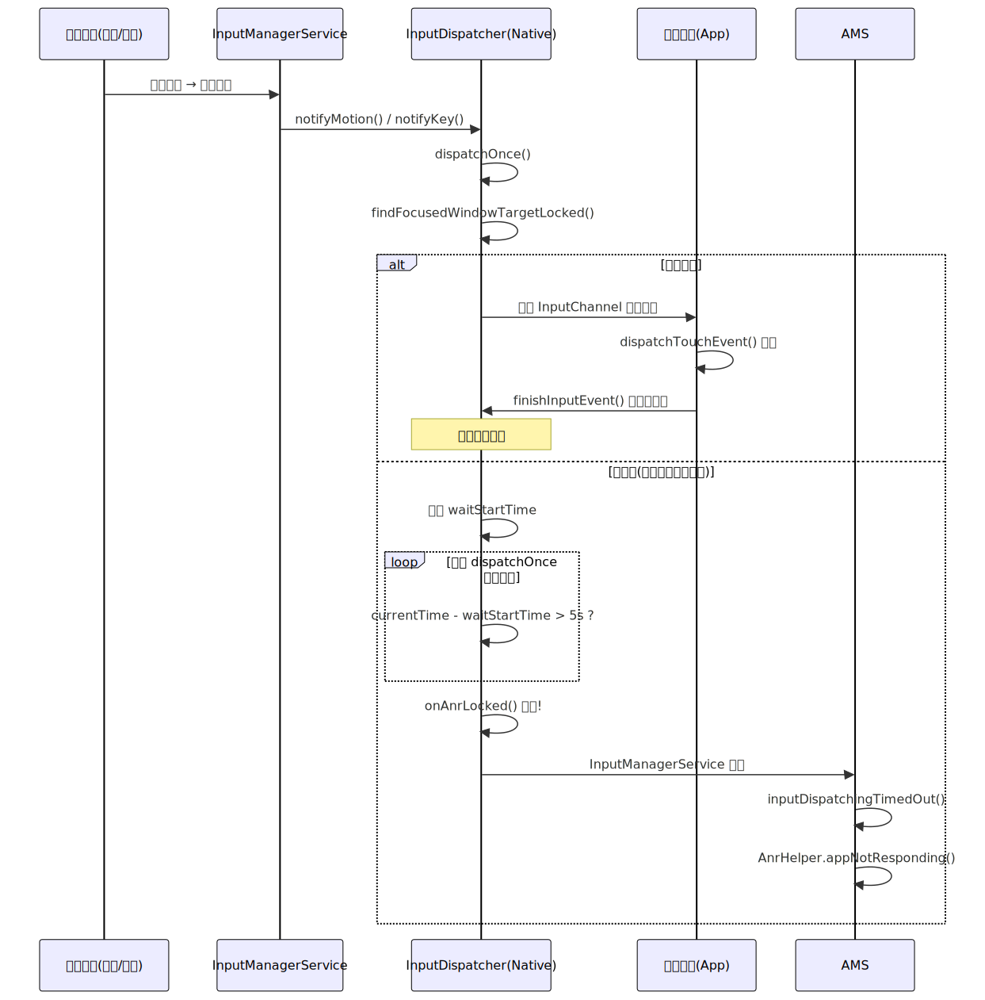
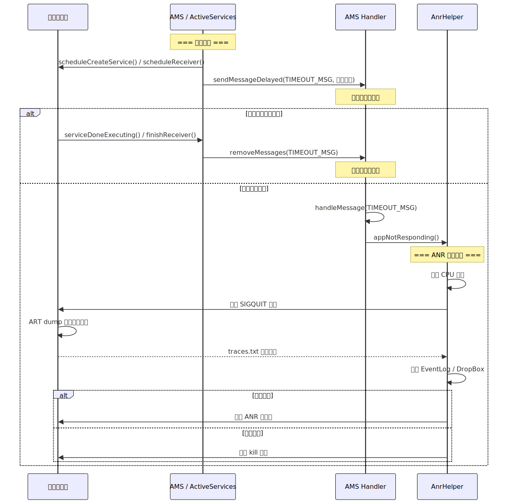

# ANR 原理与分析

## 一、概述

ANR（Application Not Responding）是 Android 系统用来保护用户体验的一种机制：当应用在规定时间内未能完成特定操作时，系统弹出"应用无响应"对话框，让用户选择等待或关闭应用。

ANR 与 Crash 的本质区别在于：**Crash 是程序异常导致进程终止，ANR 是程序"活着但太慢"导致系统主动干预**。对于资深工程师而言，ANR 问题往往比 Crash 更难排查，因为它通常不是单一代码错误，而是系统资源竞争、锁争用、IO 阻塞等多因素交织的结果。

> ANR 本质上是一个**超时监控机制**：系统在发起某类操作时埋下一颗"定时炸弹"，如果操作在规定时间内完成则拆弹，否则引爆。

## 二、ANR 触发场景与超时阈值

### 2.1 四大 ANR 类型

| ANR 类型 | 超时阈值 | 触发条件 |
|---------|---------|---------|
| **Input ANR** | 5 秒 | 用户输入事件（按键/触摸）在 5 秒内未被处理完毕 |
| **Broadcast ANR** | 前台 10 秒 / 后台 60 秒 | BroadcastReceiver 的 `onReceive()` 超时 |
| **Service ANR** | 前台 20 秒 / 后台 200 秒 | Service 的 `onCreate()`/`onStartCommand()`/`onBind()` 超时 |
| **ContentProvider ANR** | 10 秒 | ContentProvider 的 `publish` 超时（即 `onCreate()` 耗时） |

> 注意：这些阈值定义在 `ActivityManagerService` 中，不同 Android 版本可能微调。后台超时阈值远大于前台，因为后台操作对用户感知影响小。

### 2.2 容易混淆的一点

很多人以为"主线程卡了 5 秒就会 ANR"，这是不准确的。**ANR 的触发需要两个条件同时满足**：

1. 主线程确实在忙（被阻塞或在执行耗时操作）
2. 系统恰好在这段时间内向该应用派发了需要处理的事件

如果主线程卡了 10 秒，但这期间没有用户输入、没有广播、没有 Service 回调，那就**不会触发 ANR**（但会造成掉帧/卡顿）。

## 三、ANR 触发机制源码分析

### 3.1 Input ANR 触发流程

Input ANR 的监控不是在 Java 层，而是在 Native 层的 `InputDispatcher` 中实现。



**核心流程：**

```
InputDispatcher::dispatchOnce()
  └── dispatchMotionLocked() / dispatchKeyLocked()
      └── findFocusedWindowTargetLocked()
          ├── 目标窗口是否存在？
          ├── 窗口是否处于 paused 状态？
          └── 上一个事件是否已处理完？（checkWindowReadyForMoreInputLocked）
              └── 未处理完 → 记录等待开始时间
                  └── 超过 5s → onAnrLocked()
                      └── 回调到 Java 层 InputManagerService
                          └── AMS.inputDispatchingTimedOut()
```

**关键源码（InputDispatcher.cpp）：**

```cpp
// frameworks/native/services/inputflinger/dispatcher/InputDispatcher.cpp
int32_t InputDispatcher::findFocusedWindowTargetLocked(
        nsecs_t currentTime, const EventEntry& entry,
        std::vector<InputTarget>& inputTargets, nsecs_t* nextWakeupTime) {
    // ...
    // 检查窗口是否准备好接收事件
    std::string reason = checkWindowReadyForMoreInputLocked(
            currentTime, focusedWindowHandle, entry);
    if (!reason.empty()) {
        // 窗口未就绪，判断是否超时
        if (currentTime >= mInputTargetWaitTimeoutTime) {
            // 超时！触发 ANR
            onAnrLocked(connection);
            return INPUT_EVENT_INJECTION_PENDING;
        }
    }
}
```

> Input ANR 的关键在于 `InputDispatcher` 会持续检查事件派发状态。它并不是"发出后等 5 秒"的简单定时器，而是在事件循环中持续判断：如果某个事件一直无法投递到目标窗口（因为窗口正忙于处理上一个事件），累计等待超过 5 秒则触发 ANR。

### 3.2 Broadcast ANR 触发流程（埋弹-拆弹模型）

Broadcast ANR 采用的是经典的**定时炸弹模型**，在 `BroadcastQueue` 中实现。



**埋弹阶段：**

```java
// BroadcastQueue.java
final void processNextBroadcastLocked(boolean fromMsg, boolean skipOomAdj) {
    // ...
    // 埋弹：发送延迟消息作为超时检测
    long timeoutTime = r.receiverTime + mConstants.TIMEOUT;
    setBroadcastTimeoutLocked(timeoutTime);
    // ...
}

final void setBroadcastTimeoutLocked(long timeoutTime) {
    // 发送 BROADCAST_TIMEOUT_MSG 延迟消息
    mHandler.sendMessageAtTime(
        mHandler.obtainMessage(BROADCAST_TIMEOUT_MSG, this),
        timeoutTime);
}
```

**拆弹阶段（正常完成）：**

```java
// BroadcastQueue.java
public void performReceiveLocked(ProcessRecord app, IIntentReceiver receiver, ...) {
    // Receiver 正常处理完毕
    // ...
    cancelBroadcastTimeoutLocked();  // 拆弹：取消超时消息
}
```

**爆炸阶段（超时）：**

```java
// BroadcastQueue.java
final void broadcastTimeoutLocked(boolean killProcess) {
    // 定时炸弹引爆
    // ...
    if (app != null) {
        // 调用 AMS 处理 ANR
        mService.mAnrHelper.appNotResponding(app, "Broadcast of " + r.intent);
    }
}
```

### 3.3 Service ANR 触发流程

Service ANR 同样采用埋弹-拆弹模型，在 `ActiveServices` 中实现。

```java
// ActiveServices.java
private final void realStartServiceLocked(ServiceRecord r, ProcessRecord app, ...) {
    // 埋弹：发送超时消息
    bumpServiceExecutingLocked(r, "create");
    // ...
    // 通知应用进程创建 Service
    app.thread.scheduleCreateService(r, r.serviceInfo, ...);
}

private final void bumpServiceExecutingLocked(ServiceRecord r, String why) {
    long now = SystemClock.uptimeMillis();
    // 根据前台/后台设置不同超时
    long timeout = r.isForeground
        ? SERVICE_TIMEOUT          // 前台：20 秒
        : SERVICE_BACKGROUND_TIMEOUT;  // 后台：200 秒
    // 发送延迟消息
    mAm.mHandler.sendMessageAtTime(
        mAm.mHandler.obtainMessage(ActivityManagerService.SERVICE_TIMEOUT_MSG, ...),
        now + timeout);
}
```

**拆弹（Service 创建完成后）：**

```java
// ActivityThread.java -> handleCreateService()
//   → AMS.serviceDoneExecutingLocked()
//     → 取消超时消息
```

### 3.4 ContentProvider ANR 触发流程

ContentProvider 的超时监控发生在应用进程启动阶段：

```java
// AMS.java -> attachApplicationLocked()
// 如果进程包含 ContentProvider，则发送超时消息
if (providers != null) {
    // 埋弹
    Message msg = mHandler.obtainMessage(CONTENT_PROVIDER_PUBLISH_TIMEOUT_MSG);
    msg.obj = app;
    mHandler.sendMessageDelayed(msg,
        ContentResolver.CONTENT_PROVIDER_PUBLISH_TIMEOUT_MILLIS);  // 10 秒
}
```

## 四、ANR 处理流程

当 ANR 被触发后，系统会执行一系列处理操作，这个过程本身也可能耗时数秒。

### 4.1 整体处理流程

```
ANR 触发
  │
  ├── 1. 收集进程 CPU 使用信息
  │     └── ProcessCpuTracker.update()
  │
  ├── 2. dump 关键进程的堆栈到 /data/anr/traces.txt
  │     ├── 当前 ANR 进程
  │     ├── system_server
  │     ├── 其他关键进程（SurfaceFlinger、mediaserver 等）
  │     └── 通过 Signal 3 (SIGQUIT) 触发进程 dump
  │
  ├── 3. 输出 ANR 日志到 Event Log 和 Main Log
  │     └── "ANR in <package>, reason: ..."
  │
  ├── 4. 判断是否弹出 ANR 对话框
  │     ├── 后台 ANR 且非调试模式 → 直接 kill，不弹框
  │     └── 前台 ANR → 弹出对话框让用户选择
  │
  └── 5. 生成 DropBox 文件
        └── /data/system/dropbox/
```

### 4.2 关键源码：AppErrors.appNotResponding()

```java
// AppErrors.java (Android 11+, 早期版本在 AMS 中)
final void appNotResponding(ProcessRecord app, ...) {
    // 1. 首次 ANR 标记，避免重复处理
    synchronized (mService) {
        if (app.isNotResponding()) return;
        app.setNotResponding(true);
    }

    // 2. 收集 CPU 使用信息
    final ProcessCpuTracker processCpuTracker = new ProcessCpuTracker(true);
    processCpuTracker.update();
    // 等待一段时间后再次采样，获取 CPU 使用率差值
    Thread.sleep(500);
    processCpuTracker.update();

    // 3. dump 所有相关进程的堆栈
    // 核心方法：通过 /proc/<pid>/task 读取线程状态
    // 并发送 SIGQUIT 让 ART VM dump 堆栈到 traces.txt

    // 4. 写入 Event Log
    EventLog.writeEvent(EventLogTags.AM_ANR, app.userId, app.pid,
            app.processName, app.info.flags, annotation);

    // 5. 判断是否显示对话框
    if (isSilentAnr && !app.isDebugging()) {
        // 后台 ANR，静默 kill
        app.killLocked("bg anr", ...);
    } else {
        // 前台 ANR，显示对话框
        Message msg = Message.obtain();
        msg.what = ActivityManagerService.SHOW_NOT_RESPONDING_UI_MSG;
        mService.mUiHandler.sendMessage(msg);
    }
}
```

> Android 11+ 将 ANR 处理抽到了 `AnrHelper` 类中异步执行，避免 dump 堆栈时阻塞 `system_server` 的主线程。这是一个重要优化——因为 dump 多个进程的堆栈本身也很耗时（可达数秒）。

## 五、traces.txt 分析实战

`/data/anr/traces.txt` 是排查 ANR 最核心的信息来源。

### 5.1 traces.txt 结构解析

```
----- pid 12345 at 2024-01-15 10:30:45 -----
Cmd line: com.example.myapp
Build fingerprint: 'google/oriole/oriole:14/...'

DALVIK THREADS (25):
"main" prio=5 tid=1 Blocked            <-- 关键：主线程状态
  | group="main" sCount=1 dsCount=0 flags=1 obj=0x72a8e0f0 self=0xb4c00000
  | sysTid=12345 nice=-10 cgrp=default sched=0/0 handle=0xf3c7e4f8
  | state=S schedstat=( 8523401520 3241852410 15236 ) utm=652 stm=200 core=3 HZ=100
  | stack=0xff5bc000-0xff5be000 stackSize=8192KB
  | held mutexes=
  at com.example.myapp.DatabaseHelper.query(DatabaseHelper.java:125)
  - waiting to lock <0x0a5c0fd0> (a java.lang.Object) held by thread 15
  at com.example.myapp.MainActivity.onResume(MainActivity.java:87)
  at android.app.Instrumentation.callActivityOnResume(Instrumentation.java:1456)
  ...

"AsyncTask #3" prio=5 tid=15 Runnable   <-- 持锁线程
  | ...
  at com.example.myapp.DatabaseHelper.syncData(DatabaseHelper.java:230)
  - locked <0x0a5c0fd0> (a java.lang.Object)                <-- 持有锁
  at com.example.myapp.SyncWorker.doWork(SyncWorker.java:45)
  ...
```

### 5.2 关键字段含义

| 字段 | 含义 |
|------|------|
| `main` | 线程名，`main` 即主线程 |
| `tid=1` | 虚拟机内线程 ID |
| `sysTid=12345` | 对应 Linux 系统层面的线程 ID（与 `/proc` 下一致） |
| `Blocked` | **线程状态**，这是最关键的信息 |
| `waiting to lock <0x...>` | 正在等待获取某个锁 |
| `held by thread 15` | 锁被 tid=15 的线程持有 |
| `locked <0x...>` | 该线程持有这把锁 |
| `schedstat` | 调度统计（运行时间/等待时间/切换次数） |
| `utm/stm` | 用户态/内核态 CPU 时间（单位 jiffies） |

### 5.3 主线程常见状态与对应原因

| 线程状态 | 含义 | 常见原因 |
|---------|------|---------|
| **Blocked** | 等待获取锁 | 锁竞争，其他线程持锁做耗时操作 |
| **Waiting** | 调用了 `Object.wait()` | 等待条件通知，可能死锁 |
| **TimedWaiting** | 调用了 `Thread.sleep()` 或限时等待 | 主线程误用 sleep |
| **Runnable** | 正在执行 | 主线程在执行耗时计算 |
| **Native** | 在执行 Native 方法 | IO 操作（文件/网络/数据库）、Binder 调用 |
| **Suspended** | 被 GC 挂起 | 大量 GC 导致 Stop-The-World |

### 5.4 典型 ANR 堆栈模式

**模式一：主线程死锁**

```
"main" tid=1 Blocked
  - waiting to lock <0xA> held by thread 15

"Worker" tid=15 Blocked
  - waiting to lock <0xB> held by thread 1
```

两个线程互相等待对方持有的锁，经典死锁。

**模式二：主线程等待 Binder 调用返回**

```
"main" tid=1 Native
  at android.os.BinderProxy.transactNative(Native Method)
  at android.os.BinderProxy.transact(BinderProxy.java:540)
  at android.app.IActivityManager$Stub$Proxy.getRunningAppProcesses(...)
```

主线程发起同步 Binder 调用，对端进程（如 system_server）繁忙，导致长时间阻塞。

**模式三：主线程 IO 阻塞**

```
"main" tid=1 Native
  at java.io.FileInputStream.read(Native Method)
  at com.example.app.ConfigManager.loadConfig(ConfigManager.java:88)
  at com.example.app.MainActivity.onCreate(MainActivity.java:45)
```

主线程直接读取文件，遇到磁盘 IO 慢（特别是 flash 存储碎片化或低端设备）。

**模式四：大量 GC 导致暂停**

```
"main" tid=1 WaitingForGcToComplete
```

结合 logcat 中的 GC 日志（`Clamp target GC heap`、`Background concurrent copying GC`），如果短时间内出现大量 GC，说明内存压力大。

## 六、系统化 ANR 排查方法论

### 6.1 信息收集清单

排查 ANR 需要收集多维度信息，仅看 traces.txt 往往不够：

| 信息来源 | 获取方式 | 关键内容 |
|---------|---------|---------|
| traces.txt | `adb pull /data/anr/` | 主线程堆栈、锁信息 |
| logcat | `adb logcat -b events \| grep anr` | ANR 原因、CPU 使用率 |
| CPU info | ANR 日志中附带 | 各进程 CPU 占用、iowait |
| DropBox | `adb shell dumpsys dropbox --print` | 完整 ANR 报告 |
| Perfetto/Systrace | 提前抓取 trace | 精确到微秒的调度分析 |

### 6.2 三步定位法

**第一步：看 CPU 信息，判断大类**

ANR 日志中会附带触发时的 CPU 使用信息：

```
CPU usage from 0ms to 10281ms later:
  47% 1395/system_server: 25% user + 21% kernel / faults: 2512 minor
  15% 12345/com.example.app: 10% user + 5% kernel / faults: 856 minor
  ...
  30% TOTAL: 18% user + 8% kernel + 3% iowait + 0.5% softirq
```

判断规则：

| CPU 特征 | 大概率原因 |
|---------|----------|
| **应用自身 CPU 高**（>60%） | 主线程在做耗时计算（循环、排序、JSON 解析） |
| **system_server CPU 高** | 系统繁忙，Binder 调用排队 |
| **iowait 高**（>20%） | 磁盘 IO 阻塞（数据库、文件读写、SharedPreferences） |
| **总 CPU 很低**（<30%） | 锁等待、死锁、Binder 对端阻塞 |
| **某个其他进程 CPU 极高** | 其他应用抢占资源，系统整体负载高 |

**第二步：看 traces.txt，定位具体代码**

根据第一步缩小范围后，在 traces.txt 中查看主线程堆栈和状态（参见 5.3 节）。

**第三步：结合业务上下文，确认根因**

很多 ANR 是特定场景下才触发的，需结合以下信息：
- 用户操作路径（哪个页面、什么操作）
- 设备信息（低端机更容易触发）
- 网络环境（弱网导致同步网络调用超时）
- 时间点（后台回来、冷启动、大量数据同步时）

### 6.3 常见 ANR 根因与解决方案

| 根因 | 典型表现 | 解决方案 |
|------|---------|---------|
| **主线程 IO** | 堆栈中有 `FileInputStream`/`SQLiteDatabase`/`SharedPreferences` | 移到子线程；SP 换 MMKV/DataStore |
| **主线程网络请求** | 堆栈中有 `Socket`/`HttpURLConnection` | 严格使用异步网络库 |
| **主线程同步 Binder 调用** | 堆栈中有 `BinderProxy.transact` | 避免主线程调用 `getRunningAppProcesses()` 等系统 API |
| **锁竞争** | 主线程状态 Blocked，等待子线程释放锁 | 缩小同步块范围；用 `ReentrantReadWriteLock`；用无锁数据结构 |
| **死锁** | 两线程互相等待对方的锁 | 统一锁获取顺序；用 `tryLock` 带超时 |
| **大量对象创建导致 GC** | 频繁 GC 日志，主线程 Suspended | 对象池复用；避免循环内创建对象 |
| **BroadcastReceiver 耗时** | Broadcast ANR | `onReceive()` 中用 `goAsync()` + 转子线程 |
| **ContentProvider 初始化重** | ContentProvider ANR | 延迟初始化；用 App Startup 合并 |
| **系统资源紧张** | 总 CPU 很高 / iowait 高 | 非应用自身问题，需设备级优化 |

## 七、ANR 监控体系

### 7.1 线下监控

**Watchdog 方案（BlockCanary 原理）：**

```java
// 核心思路：在主线程 Looper 的消息处理前后打印日志
// Looper.java 中有这样的机制：
public static void loop() {
    for (;;) {
        Message msg = queue.next();
        // ① 消息处理前 → printer.println(">>>>> Dispatching to ...")
        final long start = SystemClock.uptimeMillis();
        msg.target.dispatchMessage(msg);
        final long end = SystemClock.uptimeMillis();
        // ② 消息处理后 → printer.println("<<<<< Finished to ...")
    }
}
```

通过设置 `Looper.getMainLooper().setMessageLogging(printer)` 自定义 Printer，在 `>>>>> Dispatching` 时启动一个定时任务（如 3 秒后 dump 堆栈），在 `<<<<< Finished` 时取消该任务。如果消息处理耗时超过阈值，定时任务触发，dump 出主线程当时的堆栈。

**StrictMode（严格模式）：**

```kotlin
if (BuildConfig.DEBUG) {
    StrictMode.setThreadPolicy(
        StrictMode.ThreadPolicy.Builder()
            .detectDiskReads()
            .detectDiskWrites()
            .detectNetwork()
            .penaltyLog()
            .build()
    )
}
```

### 7.2 线上监控

**方案一：基于 FileObserver 监听 /data/anr/**

```kotlin
class AnrFileObserver(path: String) : FileObserver(path, CREATE) {
    override fun onEvent(event: Int, path: String?) {
        if (path?.contains("traces") == true) {
            // 读取并上报 traces 文件
        }
    }
}
```

缺点：需要 root 权限或特殊权限，Android 高版本受限。

**方案二：ANR-WatchDog（独立看门狗线程）**

```kotlin
class ANRWatchDog : Thread("ANR-WatchDog") {
    private val mainHandler = Handler(Looper.getMainLooper())
    private val timeout = 5000L
    @Volatile
    private var tick = 0L

    override fun run() {
        while (!isInterrupted) {
            tick = 0
            // 在主线程 post 一个任务，修改 tick 值
            mainHandler.post { tick = SystemClock.uptimeMillis() }

            Thread.sleep(timeout)

            // 如果 tick 仍为 0，说明主线程在 timeout 时间内没有执行 post 的任务
            if (tick == 0L) {
                // 主线程可能被阻塞，dump 堆栈
                val stackTrace = Looper.getMainLooper().thread.stackTrace
                // 上报 ANR 信息
                reportAnr(stackTrace)
            }
        }
    }
}
```

**方案三：SIGQUIT 信号监听（字节跳动方案 / Raster）**

```
原理：
1. AMS 在触发 ANR 时，会向目标进程发送 SIGQUIT 信号让其 dump 堆栈
2. 应用可以通过 sigaction() 注册自己的 SIGQUIT 信号处理函数
3. 在信号处理函数中收集现场信息（堆栈、CPU、内存）并上报
4. 处理完后，交还给原始信号处理函数完成正常的 dump 流程
```

这是目前业界最精准的线上 ANR 监控方案，因为它能捕获到系统真正判定的 ANR 事件，不会漏报也不会误报。

### 7.3 三种监控方案对比

| 方案 | 准确性 | 侵入性 | 兼容性 | 适用场景 |
|------|--------|--------|--------|---------|
| Looper Printer | 中（只能检测消息处理卡顿，不等于 ANR） | 低 | 好 | 线下卡顿检测 |
| ANR-WatchDog | 中（有延迟和误报） | 低 | 好 | 线上轻量监控 |
| SIGQUIT 监听 | 高（精准捕获系统 ANR） | 中（Native 层实现） | 中（信号处理有限制） | 线上精准监控 |

## 八、ANR 预防最佳实践

### 8.1 主线程行为准则

```
主线程只做三件事：
1. UI 操作（measure/layout/draw、动画）
2. 事件分发（点击、手势）
3. 生命周期管理（Activity/Fragment/Service 回调中的轻量逻辑）

以下操作绝对不能在主线程执行：
- 文件 IO（包括 SharedPreferences.commit()）
- 数据库查询
- 网络请求
- 大量数据的 JSON/XML 解析
- 复杂计算（排序大数组、图片处理）
- 同步 Binder 调用（尤其是跨进程调用系统 API）
```

### 8.2 关键优化手段

**SharedPreferences → MMKV / DataStore：**

SP 的 `commit()` 是同步的，`apply()` 虽然异步，但在 `Activity.onPause()` 时会等待写入完成（`QueuedWork.waitToFinish()`），这是隐性的主线程阻塞源。

**BroadcastReceiver 异步化：**

```kotlin
override fun onReceive(context: Context, intent: Intent) {
    val pendingResult = goAsync()  // 获取异步句柄
    CoroutineScope(Dispatchers.IO).launch {
        try {
            // 执行耗时操作
            doHeavyWork()
        } finally {
            pendingResult.finish()  // 通知系统处理完成
        }
    }
}
```

**ContentProvider 延迟初始化：**

```kotlin
class MyProvider : ContentProvider() {
    override fun onCreate(): Boolean {
        // 不要在这里做重型初始化！
        // 使用 lazy 或者延迟到第一次 query/insert 时再初始化
        return true
    }
}
```

### 8.3 锁优化策略

```kotlin
// 错误：大范围加锁
synchronized(lock) {
    val data = readFromDisk()     // IO 操作持锁
    processData(data)             // 计算持锁
    updateUI(data)                // 更新 UI 持锁
}

// 正确：最小化同步块
val data = readFromDisk()         // IO 不持锁
val result = processData(data)    // 计算不持锁
synchronized(lock) {
    cache = result                // 只有共享变量操作才持锁
}
// 回主线程更新 UI
withContext(Dispatchers.Main) {
    updateUI(result)
}
```

## 九、常见面试题与解答

### Q1：ANR 的四种类型分别是什么？超时阈值各是多少？

**A：** Input ANR（5 秒）、Broadcast ANR（前台 10 秒/后台 60 秒）、Service ANR（前台 20 秒/后台 200 秒）、ContentProvider ANR（10 秒）。注意 Input ANR 的判断在 Native 层 InputDispatcher 中，而其他三种在 Java 层通过"埋弹-拆弹"消息机制实现。

### Q2：主线程卡顿 5 秒一定会 ANR 吗？

**A：** 不一定。ANR 触发需要同时满足两个条件：1）主线程被阻塞；2）系统在此期间需要向应用派发事件（如用户触摸、广播等）。如果主线程卡了 10 秒，但这段时间没有任何事件需要处理，就不会 ANR——但会造成明显的掉帧和卡顿。

### Q3：如何从 traces.txt 中判断 ANR 的原因？

**A：** 分三步：1）看主线程状态——Blocked 说明锁等待，Native 可能是 IO/Binder 阻塞，Runnable 说明耗时计算；2）看堆栈调用链——定位到具体代码行；3）看锁信息——`waiting to lock` 和 `held by thread` 可以定位锁持有者，检查是否有死锁。

### Q4：SharedPreferences 的 apply() 也可能导致 ANR，为什么？

**A：** `apply()` 本身是异步的，会把写磁盘操作提交到 `QueuedWork` 队列。但在 `Activity.onPause()`/`onStop()` 等生命周期方法中，`ActivityThread.handleStopActivity()` 会调用 `QueuedWork.waitToFinish()` 同步等待所有 pending 的 SP 写操作完成。如果此时累积了大量 apply 操作或磁盘 IO 慢，就会阻塞主线程导致 ANR。解决方案：改用 MMKV（基于 mmap，无此问题）或 DataStore。

### Q5：如何设计一个线上 ANR 监控方案？

**A：** 三种方案按精准度排序：1）**SIGQUIT 信号监听**——最精准，通过 Native 层 `sigaction()` 拦截系统发送的 SIGQUIT 信号，这个信号只在系统真正判定 ANR 时才发送；2）**ANR-WatchDog**——在子线程定期向主线程 post 消息，检测主线程是否响应，实现简单但存在延迟和误报；3）**Looper Printer**——监控每条消息的处理时长，更适合检测卡顿而非精确 ANR。推荐线上使用 SIGQUIT 方案作为主要监控手段。

### Q6：Input ANR 和 Service ANR 的监控机制有何本质区别？

**A：** 核心区别在于检测位置和机制：Input ANR 在 **Native 层 InputDispatcher** 中实现，采用的是事件循环中的持续检测——InputDispatcher 在每次 dispatchOnce() 时检查上一个事件是否被消费，累计等待超过 5 秒则触发；Service ANR 在 **Java 层 ActiveServices** 中实现，采用经典的"埋弹-拆弹"模型——发起 Service 操作时通过 Handler 发送延迟消息（定时炸弹），操作完成后取消消息（拆弹），超时未完成则消息触发（爆炸）。

### Q7：系统是如何 dump 应用堆栈的？为什么 traces.txt 中能看到所有线程的堆栈？

**A：** 当 ANR 触发时，`system_server` 通过 `Process.sendSignal(pid, Process.SIGNAL_QUIT)` 向目标进程发送 SIGQUIT（信号 3）。ART 虚拟机内部注册了 SIGQUIT 的信号处理函数，收到信号后会挂起所有线程，遍历每个线程的调用栈并格式化输出到 `/data/anr/traces.txt`。这也是 SIGQUIT 监听方案能精准捕获 ANR 的基础——信号是系统 ANR 流程的必经环节。

### Q8：如何优化 BroadcastReceiver 避免 ANR？

**A：** 1）`onReceive()` 中不做耗时操作，需要耗时逻辑时使用 `goAsync()` 获取 `PendingResult`，然后在子线程/协程中处理，处理完后调用 `pendingResult.finish()`；2）注意 `goAsync()` 也有时间限制（与 Broadcast 超时一致），不是无限期的；3）对于需要长时间后台处理的场景，应该在 `onReceive()` 中启动 `WorkManager` 任务，而非在 Receiver 中处理；4）避免注册过多全局广播，减少被不必要广播唤醒的次数。

### Q9：如何区分应用自身导致的 ANR 和系统环境导致的 ANR？

**A：** 看 ANR 日志中的 CPU 信息：1）如果应用自身 CPU 占用高（>50%），大概率是自身代码问题（死循环、耗时计算）；2）如果 iowait 高（>20%），可能是磁盘 IO 导致，但需进一步区分是应用自身 IO 还是系统整体 IO 瓶颈；3）如果总 CPU 很低（<30%）且主线程状态是 Blocked/Waiting，大概率是锁竞争或 Binder 等待；4）如果其他进程 CPU 极高或系统总负载很高（>90%），说明是系统资源紧张导致，非应用自身问题。可以通过对比正常时期和 ANR 时期的系统整体负载来判断。

### Q10：Android 11 之后 ANR 处理流程有什么优化？

**A：** Android 11 引入了 `AnrHelper` 类，将 ANR 的信息收集和 dump 操作从 AMS 主线程移到了独立的线程池中异步执行。因为 dump 多个进程堆栈本身可能耗时数秒，如果在 `system_server` 主线程执行，可能导致系统整体卡顿甚至 system_server 自身 Watchdog 超时。此外，Android 11+ 还优化了 traces.txt 的写入策略，使用 tombstoned 守护进程统一管理，支持保留多次 ANR 的 trace 文件（而非只保留最后一次），便于分析间歇性 ANR 问题。
