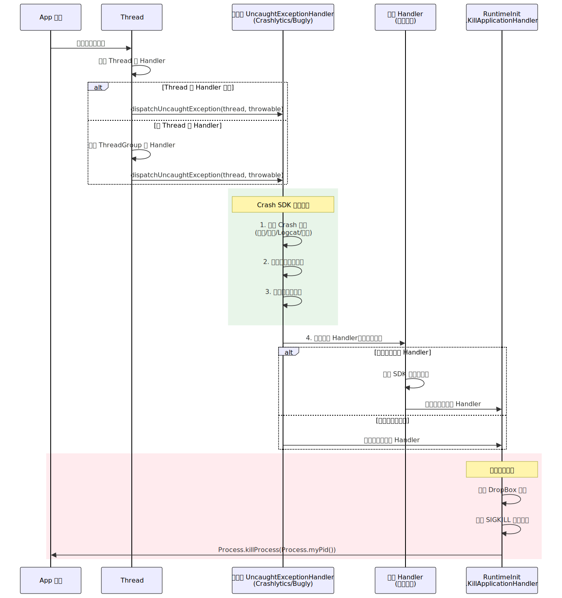

# Crash 治理与线上稳定性

## 一、概述

应用稳定性是用户体验的底线。一次 Crash 意味着用户正在进行的操作被强制中断——未保存的数据丢失、未完成的交易中止、未看完的内容消失。对于 SDK 而言，Crash 的后果更严重：一个 SDK 的崩溃会连带宿主 App 一起闪退，影响面从单个 App 扩大到所有接入方。

### 1.1 稳定性的度量维度

| 指标 | 定义 | 业界基准 | 说明 |
|------|------|---------|------|
| **Java/Kotlin Crash 率** | 发生 Java 层 Crash 的 UV / 日活 UV | < 0.1%（万分之十） | Google Play 的"Android vitals"红线是 1.09% |
| **Native Crash 率** | 发生 Native 层 Crash 的 UV / 日活 UV | < 0.05% | 通常低于 Java Crash，但定位难度更高 |
| **ANR 率** | 发生 ANR 的 UV / 日活 UV | < 0.47% | Google Play 红线，详见 [ANR 原理与分析](ANR原理与分析.md) |
| **综合 Crash-Free 率** | 未发生任何 Crash 的 UV / 日活 UV | > 99.9% | 头部 App 的目标线 |

> Crash 率有两种计量口径：**UV Crash 率**（去重到用户）和 **PV Crash 率**（按次数）。业界主流用 UV 口径，因为它更能反映用户的真实感知——一个用户一天 Crash 100 次和 1 次，体验上差异没那么大（第一次就卸载了）。

### 1.2 Crash 的分类全景

```
Crash
├── Java/Kotlin Crash
│   ├── 未捕获异常（UncaughtException）
│   │   ├── NullPointerException     ← 占比最高，通常 30-40%
│   │   ├── IllegalStateException    ← Fragment/Activity 状态异常
│   │   ├── ClassCastException
│   │   ├── OutOfMemoryError         ← 特殊：Error 而非 Exception
│   │   └── ...
│   └── 框架层 Crash（系统 Bug / ROM 兼容性）
│
├── Native Crash
│   ├── SIGSEGV（段错误 — 非法内存访问）  ← Native 中占比最高
│   ├── SIGABRT（主动调用 abort）
│   ├── SIGBUS（总线错误）
│   └── SIGFPE（浮点异常 / 除零）
│
└── ANR（Application Not Responding）
    └── 详见 [ANR 原理与分析](ANR原理与分析.md)
```

### 1.3 本文与 ANR 文档的关系

ANR 的触发机制、traces.txt 分析、线上监控方案已在 [ANR 原理与分析](ANR原理与分析.md) 中深入讲解，本文不再重复。本文聚焦于：

- **Java/Kotlin Crash 捕获机制**（第二章）
- **Native Crash 捕获机制**（第三章）
- **Crash 分类与治理流程**（第四章）
- **APM 与线上监控体系**（第五章）——这是 ANR 监控的上层框架，ANR 是其中一个子指标

两篇文档互补构成完整的稳定性知识体系。

---

## 二、Java/Kotlin Crash 捕获机制

### 2.1 UncaughtExceptionHandler 调用链

当一个线程抛出未捕获异常时，JVM 按以下优先级查找 Handler：

```
Thread.getUncaughtExceptionHandler()          ← 线程级
  ↓ (如果未设置，回退到)
ThreadGroup.uncaughtException()               ← 线程组级
  ↓ (如果未覆写，回退到)
Thread.getDefaultUncaughtExceptionHandler()   ← 全局默认级
```

**Android 系统的默认链路**：

Android 进程启动时，`RuntimeInit.commonInit()` 会设置全局默认 Handler：

```java
// frameworks/base/core/java/com/android/internal/os/RuntimeInit.java
protected static final void commonInit() {
    Thread.setDefaultUncaughtExceptionHandler(
        new KillApplicationHandler(loggingHandler));
}
```

`KillApplicationHandler` 的核心逻辑：

```java
// 简化后的关键流程
public void uncaughtException(Thread t, Throwable e) {
    // 1. 通知 AMS 记录 Crash 信息
    ActivityManager.getService().handleApplicationCrash(
        mApplicationObject, new ApplicationErrorReport.ParcelableCrashInfo(e));
    // 2. 写入 DropBoxManager（/data/system/dropbox/）
    // 3. 弹出 Crash 对话框（如果前台）
    // 4. 杀死进程
    Process.killProcess(Process.myPid());
    System.exit(10);
}
```

> 关键认知：`KillApplicationHandler` 最终一定会杀死进程。任何 Crash SDK 如果想在 Crash 发生时做采集、上报等操作，必须在系统默认 Handler **之前**插入自己的 Handler，处理完后再交给系统默认 Handler 执行终止逻辑。

### 2.2 自定义 Handler 的正确姿势



**核心原则：保存前任、链式调用。**

```java
public class CrashCollector implements Thread.UncaughtExceptionHandler {
    private Thread.UncaughtExceptionHandler previousHandler;

    public void install() {
        // 保存前任 Handler（可能是系统默认的，也可能是其他 SDK 设置的）
        previousHandler = Thread.getDefaultUncaughtExceptionHandler();
        // 把自己设置为新的全局 Handler
        Thread.setDefaultUncaughtExceptionHandler(this);
    }

    @Override
    public void uncaughtException(Thread t, Throwable e) {
        try {
            // === 自己的采集逻辑（必须尽快完成） ===
            String crashInfo = collectCrashInfo(t, e);
            saveCrashToFile(crashInfo);  // 持久化，下次启动上报
        } catch (Throwable collectError) {
            // 采集过程本身不能再抛异常
        } finally {
            // 必须调用前任 Handler，保证链式传递
            if (previousHandler != null) {
                previousHandler.uncaughtException(t, e);
            }
        }
    }
}
```

**多 SDK 共存时的 Handler 冲突**：

当 App 接入了 Crashlytics、Bugly、Sentry 等多个 Crash SDK 时，它们都会调用 `setDefaultUncaughtExceptionHandler`。最终的调用链取决于安装顺序：

```
最后安装的 SDK C → SDK B → SDK A → 系统 KillApplicationHandler
```

常见问题：

| 问题 | 原因 | 解决方案 |
|------|------|---------|
| 某个 SDK 的 Crash 数据丢失 | 被后安装的 SDK 覆盖，且后者未调用前任 | 确保所有 SDK 都正确保存并调用 previousHandler |
| Crash 后 App 不退出（挂起） | 某个 SDK 吞掉了异常，未传递给 KillApplicationHandler | Handler 的 finally 块必须调用前任 |
| 同一个 Crash 被上报多次 | 链上每个 SDK 都各自上报一份 | 预期行为，各平台去重即可 |

### 2.3 Crash SDK 的核心实现原理

以 Firebase Crashlytics 为代表，主流 Crash SDK 的内部流程：

**Crash 发生时（在 UncaughtExceptionHandler 内）**：

```
1. 采集 Crash 信息
   ├── 异常堆栈（Throwable.getStackTrace）
   ├── 所有线程堆栈（Thread.getAllStackTraces 或 /proc/self/task）
   ├── 设备信息（型号/OS 版本/CPU 架构/内存/磁盘）
   ├── App 信息（版本号/进程名/前后台状态）
   └── 自定义数据（用户 ID/页面路径/自定义 Key-Value）

2. 持久化到本地文件
   ├── 写文件方式：直接写（风险：Crash 时文件系统可能不稳定）
   └── mmap 方式：Crashlytics v2 / xCrash 使用（更可靠）

3. 调用前任 Handler → 进程退出
```

**下次启动时**：

```
1. 检测到未上报的 Crash 文件
2. 读取 + 解析
3. 符号化（如果是混淆后的堆栈，需要 mapping 文件）
4. 压缩 + 上报到后端
5. 上报成功后删除本地文件
```

> 为什么不在 Crash 发生时直接网络上报？因为 `uncaughtException` 回调执行在崩溃线程上，此时进程状态不稳定，发起网络请求极不可靠。写本地文件（尤其是 mmap）是最安全的持久化方式。

**mmap 持久化的优势**：

```
传统写文件：App 进程 → write() 系统调用 → 内核缓冲区 → 磁盘
  问题：write() 可能被中断，数据丢失

mmap 方式：App 进程 → 直接写内存映射区 → OS 异步刷盘
  优势：即使进程被 kill，已写入映射区的数据由 OS 保证落盘
```

### 2.4 特殊场景处理

**场景一：主线程 Crash 后的 Looper 续命**

正常情况下，主线程 Crash 意味着 `Looper.loop()` 中断，App 无法继续处理任何消息。但有一种"黑科技"（Cockroach 方案）可以让主线程"复活"：

```java
// 原理：在主线程 Looper 外层再套一层 try-catch + 无限循环
new Handler(Looper.getMainLooper()).post(() -> {
    while (true) {
        try {
            Looper.loop();  // 正常的消息循环
        } catch (Throwable e) {
            // 捕获主线程所有未捕获异常
            // 记录日志，但不终止进程
            // Looper.loop() 会在下一轮 while 中重新启动
        }
    }
});
```

> **慎用此方案**。虽然进程不会退出，但 Crash 发生时的状态可能已经不一致（比如 Activity 的 onCreate 中途崩溃，界面只渲染了一半）。继续运行可能导致更严重的数据错误。此方案仅适用于**非核心路径的容错**（如统计上报失败不应导致 App 崩溃），绝不应用于全局兜底。

**场景二：OOM Crash 的特殊性**

OOM 是 `java.lang.OutOfMemoryError`（Error 而非 Exception），但它仍然会被 `UncaughtExceptionHandler` 捕获。特殊之处在于：

- Crash 发生时，堆内存已经耗尽，**采集信息的代码本身可能因 OOM 而失败**
- 解决思路：**预分配缓冲区**——在 SDK 初始化时预先分配一块内存（如 256KB byte[]），OOM 发生时先释放这块预留内存，再执行采集逻辑

```java
// 预留内存，OOM 时释放
private volatile byte[] reservedMemory = new byte[256 * 1024];

@Override
public void uncaughtException(Thread t, Throwable e) {
    if (e instanceof OutOfMemoryError) {
        reservedMemory = null;  // 释放预留内存，为采集腾出空间
        // 使用极简采集逻辑（避免创建大对象）
        saveMinimalCrashInfo(t, e);
    } else {
        saveFullCrashInfo(t, e);
    }
    // ...
}
```

**场景三：Kotlin 协程异常与传统异常的区别**

Kotlin 协程的异常传播有独立的机制，不完全走 `UncaughtExceptionHandler`：

| 场景 | 异常传播路径 | UncaughtExceptionHandler 触发？ |
|------|------------|-------------------------------|
| `launch` 中未捕获异常 | 传播到父 Job → 取消所有子协程 → 最终到 CoroutineExceptionHandler 或 UEH | **是**（如果没有 CEH） |
| `async` 中未捕获异常 | 存储在 Deferred 中，`await()` 时抛出 | **取决于调用方是否捕获** |
| `supervisorScope` 中子协程异常 | 不传播到父协程 → 交给 CEH 或 UEH | **是**（如果没有 CEH） |

> 详细的协程异常处理机制参见 [Kotlin 协程原理 - 第六章](../Java与Kotlin基础/Kotlin协程原理.md)。这里的关键结论是：**CoroutineExceptionHandler 和 UncaughtExceptionHandler 是两个独立的异常处理通道**，Crash SDK 需要同时覆盖两者才能完整捕获。

---

## 三、Native Crash 捕获机制

Native Crash 的捕获比 Java 层复杂得多，因为它发生在 Linux 内核的信号机制层面，不受 JVM 异常体系的管控。

### 3.1 Linux 信号机制基础

当 Native 代码执行非法操作时（如访问空指针），CPU 触发硬件异常，内核将其转化为**信号**（Signal）发送给进程。

**与 Crash 相关的关键信号**：

| 信号 | 编号 | 含义 | 典型触发场景 |
|------|------|------|------------|
| **SIGSEGV** | 11 | 段错误（非法内存访问） | 空指针解引用、访问已释放内存、写只读内存 |
| **SIGABRT** | 6 | 进程主动终止 | `abort()` 调用、`assert` 失败、C++ 未捕获异常 |
| **SIGBUS** | 7 | 总线错误 | 未对齐内存访问、映射文件被截断 |
| **SIGFPE** | 8 | 浮点/算术异常 | 整数除零、浮点溢出 |
| **SIGILL** | 4 | 非法指令 | 执行了无效的 CPU 指令（通常是内存破坏导致 PC 跑飞） |

**sigaction 注册信号处理函数**：

```c
#include <signal.h>

// 定义信号处理函数
void crash_signal_handler(int sig, siginfo_t *info, void *context) {
    // sig:    信号编号（如 SIGSEGV = 11）
    // info:   信号附加信息（fault_addr 等）
    // context: ucontext_t，包含 Crash 瞬间的寄存器快照
}

// 注册
struct sigaction sa;
memset(&sa, 0, sizeof(sa));
sa.sa_sigaction = crash_signal_handler;
sa.sa_flags = SA_SIGINFO | SA_ONSTACK;  // SA_ONSTACK: 使用替代栈
sigfillset(&sa.sa_mask);                // 处理期间屏蔽其他信号

sigaction(SIGSEGV, &sa, &old_sa);  // 保存旧 handler，后续恢复
sigaction(SIGABRT, &sa, &old_sa);
sigaction(SIGBUS,  &sa, &old_sa);
sigaction(SIGFPE,  &sa, &old_sa);
```

**信号安全函数的限制**：

信号处理函数运行在被中断线程的上下文中，且可能打断任何正在执行的代码（包括 `malloc`、`printf` 等）。因此，只能调用 **async-signal-safe** 的函数：

```
允许调用：write(), open(), close(), mmap(), _exit(), sigaction()
不允许调用：malloc(), free(), printf(), syslog(), pthread_mutex_lock()
```

> 这是 Native Crash 采集中最大的工程挑战：你需要在不调用 `malloc` 的情况下完成栈回溯、信息采集和文件写入。解决方案是预分配内存缓冲区 + 直接使用 `write()` 系统调用。

### 3.2 Native Crash 捕获全流程



**替代信号栈（sigaltstack）**：

如果 Crash 的原因是栈溢出（`StackOverflowError` 的 Native 版），此时当前线程的栈空间已经耗尽，信号处理函数无法在原栈上执行。解决方案是预先分配一块独立的栈空间：

```c
// 预分配替代信号栈（通常在 SDK 初始化时）
stack_t ss;
ss.ss_sp = mmap(NULL, SIGSTKSZ, PROT_READ | PROT_WRITE,
                MAP_PRIVATE | MAP_ANONYMOUS, -1, 0);
ss.ss_size = SIGSTKSZ;  // 通常 8KB
ss.ss_flags = 0;
sigaltstack(&ss, NULL);

// sigaction 中设置 SA_ONSTACK 标志
sa.sa_flags = SA_SIGINFO | SA_ONSTACK;
```

**栈回溯（Stack Unwinding）**：

信号处理函数中拿到 `ucontext_t` 后，需要从 PC（程序计数器）开始逐帧回溯调用栈：

| 方案 | 原理 | 优点 | 缺点 |
|------|------|------|------|
| **libunwindstack**（AOSP） | 解析 `.eh_frame` / `.debug_frame` 段的 DWARF 信息 | 准确、支持 ARM/ARM64/x86 | 实现复杂 |
| **Frame Pointer** | 沿 FP 寄存器链表回溯 | 简单快速 | 编译时需 `-fno-omit-frame-pointer`，否则不可用 |
| **libbacktrace**（已废弃） | Android 旧版本使用 | - | Android 12 后被 libunwindstack 替代 |

### 3.3 堆栈符号化

Native Crash 的原始堆栈只有内存地址，需要转换为可读的函数名+行号：

**编译产物链路**：

```
源码(.c/.cpp) → 编译(.o) → 链接(.so with debug info, ~50MB)
                                    ↓
                            strip → .so(发布版, ~5MB) + .sym(符号表)
```

**本地符号化工具**：

```bash
# addr2line：地址 → 文件名:行号
# -e: 指定带符号信息的 so 文件
# -f: 同时显示函数名
# -C: C++ 符号 demangle
addr2line -e libapp.so -f -C 0x12345

# ndk-stack：直接解析 logcat 中的 tombstone 格式
adb logcat | ndk-stack -sym ./obj/local/arm64-v8a/
```

**Breakpad / Crashpad 方案**：

Google Breakpad 是业界最成熟的 Native Crash 捕获方案，也是 Chromium 项目使用的方案：

```
Breakpad 核心组件：
├── Client（客户端，集成到 App 中）
│   ├── ExceptionHandler: 注册信号处理，Crash 时生成 minidump
│   └── minidump: 二进制格式，包含线程/内存/模块信息，体积小
├── Symbol Dumper（符号提取工具）
│   └── dump_syms: 从 .so 提取符号，生成 .sym 文件
└── Processor（后端处理）
    └── minidump_stackwalk: 读取 minidump + .sym，生成可读堆栈
```

**符号表管理最佳实践**：

每次发版必须归档符号表，否则线上 Crash 无法符号化：

```
symbols/
├── v2.4.0/
│   ├── arm64-v8a/
│   │   ├── libapp.so.sym
│   │   └── libnative.so.sym
│   └── armeabi-v7a/
│       ├── libapp.so.sym
│       └── libnative.so.sym
├── v2.3.1/
│   └── ...
└── mapping/          # Java 层 ProGuard mapping
    ├── v2.4.0-mapping.txt
    └── v2.3.1-mapping.txt
```

### 3.4 tombstone 文件结构

Android 系统在 Native Crash 时会生成 tombstone 文件（`/data/tombstones/tombstone_XX`），其核心结构：

```
*** *** *** *** *** *** *** *** *** *** *** ***
Build fingerprint: 'google/raven/raven:14/...'
Revision: '0'
ABI: 'arm64'
Timestamp: 2024-01-15 10:23:45.678+0800
Process uptime: 125s

pid: 12345, tid: 12367, name: Thread-3  >>> com.example.app <<<
uid: 10156
signal 11 (SIGSEGV), code 1 (SEGV_MAPERR), fault addr 0x0
    x0  0000000000000000  x1  0000007b3c2a1e80  ...  ← 寄存器
    ...

backtrace:                                           ← 调用栈
    #00 pc 0000000000012345  /data/app/.../lib/arm64/libapp.so (NativeFunc+24)
    #01 pc 0000000000023456  /data/app/.../lib/arm64/libapp.so (CallerFunc+108)
    #02 pc 00000000000789ab  /apex/com.android.art/lib64/libart.so (...)

memory near x0:                                      ← 崩溃地址附近内存
    0000000000000000  ----------------  ← 空指针！

memory map (fault address falls at ...):             ← 内存映射
    ...
    7b3c200000-7b3c400000 r-xp  /data/app/.../lib/arm64/libapp.so
    ...
```

**关键字段解读**：

| 字段 | 含义 | 排查价值 |
|------|------|---------|
| `signal 11 (SIGSEGV), code 1 (SEGV_MAPERR)` | 信号类型和子类型 | SEGV_MAPERR = 访问未映射地址；SEGV_ACCERR = 权限不足 |
| `fault addr 0x0` | 崩溃时访问的内存地址 | 0x0 = 空指针；小地址 = 可能是结构体成员偏移 |
| `backtrace #00 pc` | 崩溃位置的 PC 偏移 | 用 addr2line 转换为源码行号 |
| `memory near` | 崩溃地址附近的内存内容 | 帮助判断是野指针还是空指针 |

### 3.5 Native Crash 与 Java 层的协作

**JNI 层异常导致 Java 层 Crash**：

JNI 函数中如果调用了 `ThrowNew` 或 `ExceptionClear` 不当，会在返回 Java 层时触发未处理异常：

```c
// JNI 中抛出 Java 异常
JNIEXPORT void JNICALL Java_com_example_Native_process(JNIEnv *env, ...) {
    // 如果这里发生错误
    if (error) {
        // 设置 pending exception，返回 Java 后会被抛出
        (*env)->ThrowNew(env,
            (*env)->FindClass(env, "java/lang/RuntimeException"),
            "Native processing failed");
        return;  // 必须立即返回！后续 JNI 调用会导致 crash
    }
}
```

**Native Crash 中获取 Java 堆栈**：

在信号处理函数中获取当前线程的 Java 堆栈有助于定位问题（知道是从哪个 Java 方法调用进 Native 的）。但这非常困难，因为需要访问 ART 内部数据结构：

```
方案一：预先在 JNI 入口处保存 Java 堆栈到 ThreadLocal
  优点：简单可靠
  缺点：性能开销，不是实时的

方案二：在信号处理函数中调用 ART 内部 API（如 DumpJavaStack）
  优点：实时准确
  缺点：不在 NDK 公开 API 中，版本兼容性差

方案三：使用 xCrash / Breakpad 等成熟方案（已处理兼容性）
  推荐
```

---

## 四、Crash 分类与治理流程

捕获只是第一步，真正的价值在于**系统化地治理**——把 Crash 率从 0.5% 降到 0.1%、再降到 0.05%，需要的不只是修 bug 的能力，而是一套可持续运转的流程。

### 4.1 Crash 分类体系

**按严重程度分级**：

| 级别 | 定义 | 响应要求 | 示例 |
|------|------|---------|------|
| **P0** | 影响核心功能或大面积 Crash | 15 分钟内响应，4 小时内修复/止血 | 启动 Crash（0% 可用）、支付流程崩溃 |
| **P1** | 影响次要功能，用户可绕过 | 1 小时内响应，24 小时内修复 | 设置页崩溃、分享功能异常 |
| **P2** | 边缘场景，影响范围小 | 下个版本修复 | 特定机型 + 特定操作组合触发 |
| **P3** | 极低频或非致命 | 排期修复 | 后台 Service 偶现异常 |

**按归因分类**（决定修复策略）：

| 归因 | 占比（参考值） | 修复策略 |
|------|-------------|---------|
| **自身代码 Bug** | 50-60% | 正常修复流程 |
| **第三方 SDK** | 15-25% | 升级 SDK 版本 / 联系供应商 / try-catch 隔离 |
| **系统 ROM 兼容性** | 10-20% | 机型适配 / 反射绕过 / 版本判断兜底 |
| **资源耗尽（OOM/FD/线程）** | 5-10% | 根因治理（内存泄漏/FD 泄漏） |

### 4.2 Crash 聚合与指纹提取

线上每天可能上报数十万条 Crash，必须通过**聚合**将同一个 Bug 触发的多条上报合并为一个 Issue：

**堆栈指纹（Fingerprint）提取算法**：

```
原始堆栈：
  at com.example.UserManager.getUser(UserManager.java:42)
  at com.example.ProfileActivity.onResume(ProfileActivity.java:87)
  at android.app.Activity.performResume(Activity.java:8100)
  ...

指纹提取规则：
  1. 过滤系统框架帧（android.app.* / java.lang.reflect.* 等）
  2. 取 Top N 个应用层帧（通常 N=3~5）
  3. 移除行号（同一方法不同行的 NPE 通常是同一个 Bug）
  4. 拼接为 hash

指纹 = hash("com.example.UserManager.getUser|com.example.ProfileActivity.onResume")
```

**聚合的陷阱**：

| 问题 | 说明 | 应对 |
|------|------|------|
| 混淆后类名相同 | 不同版本 mapping 不同，`a.b.c` 可能对应不同的类 | 指纹中必须包含版本号 |
| 同一位置多种根因 | 同一行 NPE 可能是不同字段为 null | 指纹中加入异常 message |
| Native Crash 地址偏移 | 不同编译产物 pc 偏移不同 | 先符号化再取指纹 |

### 4.3 Top Crash 治理流程

```
日常巡检（每日）
  │
  ├── Crash 平台自动聚合 + 排序（按影响 UV 降序）
  │
  ├── Top 10 问题自动分配 Owner（按模块/代码 blame）
  │
  ▼
分析定位
  │
  ├── 堆栈分析：直接可定位 → 修复
  │
  ├── 堆栈不完整 / 信息不足 → 追加采集（自定义 Key-Value、现场日志）
  │
  ├── 系统 ROM 问题 → 查 AOSP issue tracker / 厂商适配库
  │
  ▼
修复验证
  │
  ├── 本地复现 + 修复 → 单测覆盖
  │
  ├── 灰度发布 → 观察 Crash 率是否下降
  │
  ├── 确认修复 → 全量
  │
  ▼
复盘沉淀
  ├── 同类问题是否有其他隐患？（举一反三）
  ├── 是否需要加防御性代码 / Lint 规则？
  └── 更新 Crash 知识库（方便后续快速定位同类问题）
```

### 4.4 疑难 Crash 定位技巧

**技巧一：堆栈不完整时的排查思路**

| 现象 | 可能原因 | 解决 |
|------|---------|------|
| 堆栈只有 1-2 帧 | ProGuard 优化移除了帧信息 | 检查 `-keepattributes SourceFile,LineNumberTable` |
| 顶帧是系统方法 | 方法被 inline 优化 | 查看 R8 的 inline 规则，添加 `-dontoptimize` 对关键类排除 |
| 堆栈中出现 `Unknown Source` | mapping 文件版本不匹配 | 确认 Crash 版本与 mapping 版本一致 |
| Native 堆栈全是 `<unknown>` | so 被 strip 且未上传符号表 | 归档符号表到 Crash 平台 |

**技巧二：偶现 Crash（概率性线程安全问题）**

特征：同一位置低频触发（日均几十到几百次），堆栈看起来不应该出错。

排查思路：
1. 检查崩溃位置涉及的变量是否被多线程访问
2. 检查是否存在 check-then-act 竞态（先判断 != null 再使用，中间被另一线程置 null）
3. 检查集合操作是否有并发修改（`ConcurrentModificationException` 的变体）
4. 使用 ThreadSanitizer（Native）或 StrictMode（Java）辅助发现

```kotlin
// 典型的竞态 Crash
class UserManager {
    var currentUser: User? = null

    fun getUserName(): String {
        // 线程 A 执行到这里，检查不为 null
        if (currentUser != null) {
            // 线程 B 将 currentUser 置为 null
            return currentUser!!.name  // NPE！
        }
        return ""
    }

    // 修复：使用局部变量捕获
    fun getUserNameSafe(): String {
        val user = currentUser  // 局部变量不受其他线程影响
        return user?.name ?: ""
    }
}
```

**技巧三：系统 ROM 差异导致的 Crash**

厂商魔改 ROM 是 Android 碎片化的重灾区：

```
常见案例：
- 华为 EMUI：修改了 WindowManager 的内部实现，标准 API 行为不同
- 小米 MIUI：后台进程管理策略激进，Service 被杀后 restart 时序不同
- OPPO ColorOS：通知权限管理非标准，导致 Notification 相关 API 异常
- 三星 OneUI：WebView 内核版本与其他厂商不同步

排查手段：
1. Crash 平台按机型/ROM 版本交叉分析
2. 搜索 AOSP issue tracker（https://issuetracker.google.com）
3. 厂商开发者论坛 / 适配文档
4. 兜底方案：try-catch + 降级处理（确保不影响核心功能）
```

---

## 五、APM 与线上监控体系

Crash 治理不能只靠"出了问题再修"，需要一套**主动发现、实时告警、快速定位**的监控体系。APM（Application Performance Management）是这套体系的工程化载体。

### 5.1 APM 整体架构



**架构分为两大部分**：

- **客户端**：数据采集 → 本地聚合 → 上报
- **后端**：数据接收 → 处理（符号化/聚合/指纹） → 存储 → 可视化 → 告警

**采集 vs 性能开销的平衡**：

| 策略 | 适用场景 | 说明 |
|------|---------|------|
| **全量采集** | Crash、ANR | 每次都采集，不能丢失 |
| **采样采集** | 卡顿、网络耗时、内存 | 按比例采样（如 10%），降低性能开销 |
| **条件采集** | 大内存快照、详细 trace | 仅在异常触发时采集（如内存超阈值时 dump hprof） |

### 5.2 核心监控指标

| 维度 | 指标 | 采集方式 | 告警阈值（参考） |
|------|------|---------|---------------|
| **稳定性** | Java Crash 率 | UncaughtExceptionHandler | > 0.1% |
| | Native Crash 率 | sigaction | > 0.05% |
| | ANR 率 | SIGQUIT 监听 / ANR-WatchDog | > 0.47% |
| **启动** | TTID（首帧时间） | `reportFullyDrawn` / ContentProvider 时间戳 | P90 > 2s |
| | TTFD（完全可交互） | 自定义打点 | P90 > 3s |
| **流畅性** | 帧率 / Jank 率 | Choreographer.FrameCallback | Jank 率 > 5% |
| | 冻帧率（> 700ms） | 同上 | > 0.1% |
| **网络** | 请求成功率 | OkHttp EventListener | < 99% |
| | 耗时 P90 | 同上 | > 3s |
| **资源** | 内存水位 | Debug.getMemoryInfo | > 80% 可用上限 |
| | FD 数量 | /proc/self/fd | > 800（系统默认上限 1024） |
| | 线程数 | /proc/self/status | > 500 |

### 5.3 关键采集技术

**卡顿检测：两种主流方案**

| 方案 | 原理 | 优点 | 缺点 |
|------|------|------|------|
| **Looper Printer** | 设置 `Looper.setMessageLogging()`，计算每条消息的处理耗时 | 实现简单，可获取具体消息信息 | 有字符串拼接开销；只能检测消息粒度 |
| **Choreographer.FrameCallback** | 注册 `doFrame` 回调，计算两帧间隔 | 直接反映用户感知的帧率 | 无法获取卡顿时的堆栈 |

实际工程中通常**两者结合**：Choreographer 检测是否发生卡顿 → 卡顿时通过子线程 dump 主线程堆栈 → Looper Printer 辅助定位具体是哪条消息耗时过长。

```kotlin
// 卡顿检测核心逻辑（简化）
class JankMonitor {
    private val watchThread = HandlerThread("jank-monitor")
    private val watchHandler: Handler

    init {
        watchThread.start()
        watchHandler = Handler(watchThread.looper)
    }

    fun start() {
        Choreographer.getInstance().postFrameCallback(object : FrameCallback {
            private var lastFrameTimeNanos = 0L

            override fun doFrame(frameTimeNanos: Long) {
                if (lastFrameTimeNanos != 0L) {
                    val costMs = (frameTimeNanos - lastFrameTimeNanos) / 1_000_000
                    if (costMs > 16 * 3) {  // 掉帧超过 3 帧
                        // 通过子线程 dump 主线程堆栈
                        val stack = Looper.getMainLooper().thread.stackTrace
                        reportJank(costMs, stack)
                    }
                }
                lastFrameTimeNanos = frameTimeNanos
                // 注册下一帧回调
                Choreographer.getInstance().postFrameCallback(this)
            }
        })
    }
}
```

> 卡顿检测的详细原理（Choreographer、VSync 机制）参见 [Android 页面绘制](../UI与渲染/Android页面绘制.md)。

**网络监控：OkHttp EventListener**

```kotlin
class NetworkMonitor : EventListener() {
    private var callStartNanos = 0L
    private var dnsStartNanos = 0L
    private val metrics = NetworkMetrics()

    override fun callStart(call: Call) {
        callStartNanos = System.nanoTime()
    }

    override fun dnsStart(call: Call, domainName: String) {
        dnsStartNanos = System.nanoTime()
    }

    override fun dnsEnd(call: Call, domainName: String, inetAddressList: List<InetAddress>) {
        metrics.dnsMs = (System.nanoTime() - dnsStartNanos).nanosToMs()
    }

    override fun callEnd(call: Call) {
        metrics.totalMs = (System.nanoTime() - callStartNanos).nanosToMs()
        metrics.url = call.request().url.toString()
        metrics.statusCode = /* from response */
        MetricsCollector.report(metrics)
    }

    override fun callFailed(call: Call, ioe: IOException) {
        metrics.totalMs = (System.nanoTime() - callStartNanos).nanosToMs()
        metrics.error = ioe.javaClass.simpleName
        MetricsCollector.report(metrics)
    }
}
```

**内存监控**：

```kotlin
// 定时采样内存水位（如每 30 秒）
class MemoryMonitor {
    private val memInfo = Debug.MemoryInfo()

    fun sample(): MemorySnapshot {
        Debug.getMemoryInfo(memInfo)
        return MemorySnapshot(
            javaHeapKb = memInfo.dalvikPrivateDirty,
            nativeHeapKb = memInfo.nativePrivateDirty,
            totalPssKb = memInfo.totalPss,
            fdCount = File("/proc/self/fd").listFiles()?.size ?: -1,
            threadCount = Thread.activeCount()
        )
    }
}
```

### 5.4 告警与响应

**智能告警策略**：

| 告警类型 | 逻辑 | 适用场景 |
|---------|------|---------|
| **绝对阈值** | Crash 率 > 0.1% | 日常监控兜底 |
| **环比突增** | Crash 率较昨日同期上升 50%+ | 新版本发布后的异常检测 |
| **基线对比** | 新版本 vs 旧版本同时段对比 | 灰度阶段的精细化监控 |
| **趋势预测** | 连续 3 个小时 Crash 率持续上升 | 渐进式问题（如内存泄漏累积导致 OOM） |

**灰度阶段的加强告警**：

新版本灰度发布期间，需要特别监控新旧版本的指标对比：

```
灰度版本（5% 流量）   vs   线上稳定版本（95% 流量）
Crash 率: 0.08%             Crash 率: 0.05%
                            ↑ 新版本高出 60% → 触发告警
```

### 5.5 主流方案对比

| 方案 | 类型 | Crash 捕获 | APM 指标 | 优点 | 缺点 |
|------|------|-----------|---------|------|------|
| **Firebase Crashlytics** | SaaS | Java + Native | 基础（启动/网络） | 免费、Google 官方、与 Firebase 生态集成 | 国内网络不稳定、数据存境外 |
| **Sentry** | SaaS / 私有化 | Java + Native + ANR | 丰富（性能/事务） | 开源可私有化、功能全面 | 私有化部署成本高 |
| **Bugly（腾讯）** | SaaS | Java + Native + ANR | 卡顿 | 国内服务稳定、接入简单 | 功能迭代慢 |
| **自建 APM** | 私有化 | 自定义 | 完全可控 | 完全可定制、数据安全 | 开发维护成本极高 |

> 自建 APM 通常只有大厂（日活千万级以上）才值得投入。中小团队优先选择 Crashlytics + Sentry 组合，或使用 Bugly 作为国内替代。

---

## 六、SDK 场景的稳定性特殊考量

SDK 的稳定性治理与 App 有本质区别：**SDK 的 Crash 会连带宿主 App 一起崩溃**，影响面远大于自身。因此 SDK 开发者需要比 App 开发者更加严格地对待稳定性。

### 6.1 SDK Crash 隔离策略

> SDK Crash 隔离的基本原则和代码示例参见 [SDK 开发与发布 - 7.1 节](../工程化与DevOps/SDK开发与发布.md)。这里聚焦更深层的策略。

**三层隔离模型**：

| 层级 | 策略 | 适用场景 | 代价 |
|------|------|---------|------|
| **方法级** | 公开 API 入口 try-catch | 所有 SDK | 极低（仅包裹入口方法） |
| **线程级** | 独立线程池 + UncaughtExceptionHandler | 有后台任务的 SDK | 低（需维护独立线程池） |
| **进程级** | SDK 核心逻辑运行在独立进程 | WebView SDK、广告 SDK | 高（IPC 开销、内存占用翻倍） |

**方法级隔离的关键细节**：

```kotlin
// SDK 公开 API 的防御性包装
class AdSdk {
    fun loadAd(adSlot: AdSlot, callback: AdCallback) {
        try {
            loadAdInternal(adSlot, callback)
        } catch (e: Throwable) {
            // 1. 记录到 SDK 自己的 Crash 日志（不依赖宿主的 Crash SDK）
            SdkCrashReporter.record(e)
            // 2. 通过回调通知宿主，而非抛出异常
            callback.onError(AdError(AdError.INTERNAL_ERROR, "SDK internal error"))
            // 3. 绝不向上抛出！
        }
    }
}
```

> 注意：try-catch 只适用于同步代码路径。异步回调、协程、Handler 消息中的异常需要各自处理。

**线程级隔离**：

```kotlin
// SDK 自己的线程池，配备独立的异常处理
object SdkExecutor {
    val io: ExecutorService = ThreadPoolExecutor(
        2, 4, 60L, TimeUnit.SECONDS,
        LinkedBlockingQueue(128),
        ThreadFactory { runnable ->
            Thread(runnable, "sdk-io-${counter.incrementAndGet()}").apply {
                isDaemon = true
                // 线程级异常处理：记录但不崩溃
                uncaughtExceptionHandler = Thread.UncaughtExceptionHandler { t, e ->
                    SdkCrashReporter.record(e)
                    // 不调用系统默认 Handler，不终止进程
                }
            }
        }
    )
}
```

### 6.2 SDK 版本粒度的监控

宿主 App 的 Crash 看板通常按 App 版本聚合，但一个 App 版本可能内嵌多个不同版本的 SDK。要精确归因，需要按 **SDK 版本号**维度聚合：

**实现方式**：SDK 在初始化时向宿主的 Crash SDK 注册自定义 Key：

```kotlin
// SDK 初始化时注册版本信息
fun init(context: Context) {
    // 向 Firebase Crashlytics 注册
    FirebaseCrashlytics.getInstance()
        .setCustomKey("ad_sdk_version", BuildConfig.SDK_VERSION)

    // 或向 Sentry 注册
    Sentry.configureScope { scope ->
        scope.setTag("ad_sdk_version", BuildConfig.SDK_VERSION)
    }
}
```

这样在 Crash 看板上可以按 `ad_sdk_version` 筛选和聚合，快速判断某个 Crash 是否与 SDK 升级相关。

**SDK 升级前后的稳定性对比**：

灰度阶段的关键对比维度：

| 对比维度 | 观察指标 | 判断标准 |
|---------|---------|---------|
| 整体 Crash 率 | 灰度组 vs 对照组 | 灰度组不高于对照组 5% |
| SDK 归因 Crash | 堆栈中包含 SDK 包名的 Crash | 绝对数不增加 |
| 启动耗时 | TTID P90 | 不增加 100ms 以上 |
| 内存增量 | SDK 初始化后的内存增量 | 不增加 5MB 以上 |

### 6.3 宿主兼容性导致的 Crash

SDK 自身代码没有 Bug，但在特定宿主环境下崩溃——这是 SDK 开发最头疼的问题：

**依赖冲突引发的 NoSuchMethodError**：

```
场景：SDK 内部使用 OkHttp 4.12 的新 API，但宿主使用 OkHttp 4.9。
     Gradle 仲裁选择了宿主的 4.9，SDK 在运行时找不到新 API。

堆栈：
  java.lang.NoSuchMethodError: No virtual method newBuilder()
    at com.sdk.internal.NetworkClient.sendRequest(NetworkClient.kt:42)

防御：
  1. 避免使用 implementation 传递依赖（改用 compileOnly + 运行时检测）
  2. 对关键依赖做版本检测：
```

```kotlin
// 运行时检测 OkHttp 版本
private fun isOkHttpVersionCompatible(): Boolean {
    return try {
        val version = OkHttp::class.java.getDeclaredField("VERSION")
        val versionStr = version.get(null) as String
        // 检查是否 >= 4.10
        compareVersions(versionStr, "4.10.0") >= 0
    } catch (e: Throwable) {
        false  // 无法确定版本，走兜底逻辑
    }
}
```

**ProGuard 规则缺失导致的反射失败**：

SDK 通过 `consumerProguardFiles` 传递混淆规则，但如果宿主使用了激进的自定义混淆规则，可能覆盖 SDK 的保留声明：

```
// SDK 的 consumer-rules.pro（必须包含）
-keep class com.sdk.api.** { *; }                    # 公开 API
-keepclassmembers class * {
    @com.sdk.annotation.Keep *;                       # 反射使用的类
}
-keepattributes *Annotation*                          # 注解
-keepattributes InnerClasses                          # 内部类
-keepattributes EnclosingMethod
```

> 依赖冲突的系统化解决方案（compileOnly + 适配器、Shadow Relocate 等），参见 [SDK 开发与发布 - 4.8 节](../工程化与DevOps/SDK开发与发布.md)。

---

## 七、常见面试题与解答

### Q1：Java 层 Crash 的捕获原理是什么？多个 Crash SDK 共存时会有什么问题？

**A**：Java 层 Crash 的捕获依赖 `Thread.UncaughtExceptionHandler` 机制。当线程抛出未捕获异常时，JVM 按优先级查找 Handler：线程级 → 线程组级 → 全局默认级。Android 系统在 `RuntimeInit.commonInit()` 中设置了全局默认的 `KillApplicationHandler`，负责通知 AMS、写 DropBox、终止进程。

Crash SDK 通过 `Thread.setDefaultUncaughtExceptionHandler()` 插入自己的 Handler，核心是**保存前任 + 链式调用**：先保存当前的 Handler 引用，在自己的处理逻辑（采集信息、持久化到文件）完成后，将异常传递给前任 Handler，最终到达系统的 `KillApplicationHandler` 终止进程。

多 SDK 共存的问题：后安装的 SDK 会覆盖先安装的 Handler，形成链式调用链。如果某个 SDK **未正确保存和调用前任 Handler**，就会导致链断裂——前面的 SDK 收不到 Crash 通知（数据丢失），或者系统默认 Handler 无法执行（进程挂起不退出）。

### Q2：Native Crash 和 Java Crash 的捕获机制有什么本质区别？

**A**：本质区别在于运行层次不同：

- **Java Crash** 基于 JVM 的异常机制，通过 `UncaughtExceptionHandler` 捕获，运行在 Java 虚拟机层面，可以自由调用 Java API 采集信息。
- **Native Crash** 基于 Linux 内核的**信号机制**（Signal），通过 `sigaction` 注册信号处理函数，运行在操作系统层面。

Native Crash 的捕获难度远高于 Java 层，主要体现在三个约束：

1. **信号安全函数限制**：信号处理函数中只能调用 async-signal-safe 的函数，不能使用 `malloc`、`printf` 等常见函数
2. **栈溢出问题**：需要预先通过 `sigaltstack` 分配替代信号栈
3. **栈回溯复杂**：需要从 `ucontext_t` 中的寄存器状态出发，通过 DWARF 信息或 Frame Pointer 逐帧回溯

工程上通常采用 Google Breakpad / Crashpad 或爱奇艺 xCrash 等成熟方案，它们已经处理了上述复杂性。

### Q3：如何设计一个 Crash 的聚合方案？相同 Bug 触发的 Crash 如何合并为一个 Issue？

**A**：核心是**堆栈指纹（Fingerprint）提取**：

1. 取异常堆栈的 Top N 帧（通常 3-5 帧）
2. 过滤系统框架帧（`android.*`、`java.lang.reflect.*` 等），只保留应用层帧
3. 移除行号（同一方法不同行的 NPE 通常是同一个 Bug 的不同代码路径）
4. 将类名+方法名拼接后取 hash 作为指纹

需要注意的陷阱：混淆后的类名在不同版本 mapping 不同，指纹中必须包含 App 版本号；Native Crash 需要先符号化再提取指纹（否则不同编译产物的 PC 偏移不同）；同一位置可能有多种根因，可以在指纹中加入异常 message 做更细粒度的区分。

### Q4：你遇到过最棘手的 Crash 是什么类型？怎么排查的？

**A**（面试建议：准备一个真实案例，以下是常见的高质量答案方向）

**偶现的线程安全 Crash**是最棘手的类型：堆栈显示 NPE，但代码中明明有 null 判断。排查思路：

1. 确认崩溃位置涉及的变量是否被多线程访问（check-then-act 竞态）
2. 用局部变量捕获的方式修复（`val local = field; if (local != null) use(local)`）
3. 无法本地复现时，通过线上增加 Crash 现场的自定义信息（记录各线程状态、变量值等）来缩小范围
4. 对于 Native 层的线程安全问题，可使用 ThreadSanitizer 在测试阶段发现

### Q5：OOM Crash 与普通 Crash 在捕获和治理上有什么不同？

**A**：OOM 有两个特殊性：

1. **捕获层面**：OOM 发生时堆内存已耗尽，UncaughtExceptionHandler 中的采集代码本身可能再次 OOM。解决方案是**预分配缓冲区**——初始化时分配一块备用内存（如 256KB），OOM 触发时先释放这块内存，再执行极简采集逻辑。

2. **治理层面**：OOM 的堆栈只是"压死骆驼的最后一根稻草"，真正的根因通常不在崩溃堆栈上。治理 OOM 需要分析**内存分配链路**——谁占用了最多的内存？是 Bitmap？是缓存？还是内存泄漏累积？工具上需要配合 hprof dump + MAT/Shark 分析（参见 [内存泄漏与内存优化](内存泄漏与内存优化.md)），线上需要配合 KOOM 等方案在 OOM 前自动 dump。

### Q6：作为 SDK 开发者，如何确保 SDK 的 Crash 不影响宿主 App？

**A**：采用**三层隔离模型**：

- **方法级隔离**：所有公开 API 入口 try-catch，异常通过回调返回 error code 而非向上抛出
- **线程级隔离**：SDK 内部使用独立线程池，配置独立的 UncaughtExceptionHandler（记录但不传递给系统默认 Handler），避免 SDK 的后台线程异常杀死宿主进程
- **进程级隔离**：重型 SDK（如 WebView、广告渲染）运行在独立进程，通过 AIDL/Messenger 与宿主通信，Crash 时仅影响 SDK 进程

同时，SDK 需要有自己的 Crash 上报通道（不能依赖宿主的 Crashlytics），并在 Crash 看板上按 SDK 版本号聚合，实现精准归因。

### Q7：你了解 tombstone 文件吗？如何通过 tombstone 定位 Native Crash？

**A**：tombstone 是 Android 系统在 Native Crash 时自动生成的现场文件（`/data/tombstones/tombstone_XX`），包含四类关键信息：

1. **信号信息**：`signal 11 (SIGSEGV), code 1 (SEGV_MAPERR), fault addr 0x0`——信号类型、子类型和崩溃地址。`fault addr 0x0` 表示空指针，小地址（如 0x8）可能是结构体成员偏移（对空对象访问成员）
2. **寄存器快照**：Crash 瞬间所有寄存器的值，其中 PC 指向崩溃指令、LR 指向返回地址
3. **调用栈**：`backtrace` 段列出每一帧的 PC 偏移和所在 so 文件，用 `addr2line -e libxxx.so -f -C <pc>` 可以转换为源码行号
4. **内存映射**：`memory map` 段显示进程的内存布局，可以判断崩溃地址落在哪个 so / 哪个内存区域

定位流程：先看信号类型判断大方向 → 看 fault addr 判断是空指针还是野指针 → 用 addr2line 符号化 backtrace → 结合寄存器和 memory near 分析具体原因。

### Q8：APM 监控系统的核心架构是怎样的？采集与性能开销如何平衡？

**A**：APM 分为客户端和后端两部分：

**客户端**：数据采集层（Crash/卡顿/网络/内存/启动等采集器）→ 本地聚合层（去重/采样/批量打包）→ 上报层（压缩/加密/WiFi 优先/断点续传）

**后端**：数据接收（Kafka 队列）→ 处理层（符号化/指纹聚合）→ 存储（ES/ClickHouse）→ 可视化看板 → 告警引擎

平衡采集与性能开销的策略：
- **Crash/ANR 全量采集**——不能丢失，但发生频率本身很低
- **卡顿/网络/内存采样采集**——按比例（如 10%）采样，足够反映整体趋势
- **重型采集条件触发**——如 hprof dump 只在内存超阈值时执行，避免常态性能影响
- **上报时机控制**——非实时数据等 WiFi 环境批量上报，减少流量消耗
- **采集器独立线程/进程**——避免影响主线程性能

### Q9：如何设计 Crash 率的治理目标和看板？

**A**：目标设定参考业界标准：Java Crash 率 < 0.1%（UV 口径），Native Crash 率 < 0.05%，综合 Crash-Free 率 > 99.9%。

看板设计按五个维度聚合：
1. **版本维度**：快速定位是哪个版本引入的新 Crash
2. **机型/OS 维度**：发现兼容性问题（某厂商 ROM 特有）
3. **页面维度**：定位到具体功能模块
4. **时间维度**：发现趋势变化（新版本发布后的突增）
5. **SDK 版本维度**：对 SDK 相关 Crash 精准归因

治理流程：每日巡检 Top 10 Crash → 自动分配 Owner → 分析定位 → 修复 + 灰度验证 → 复盘沉淀。对于长期 Top Crash 设置专项治理，由技术负责人牵头推进。

### Q10：线上发现 Crash 率突增，你的排查和应急流程是怎样的？

**A**：分三步走：

**第一步：止血（分钟级）**
- 确认是否与新版本发布相关 → 如果是灰度阶段，暂停灰度推量
- 确认是否有 Feature Flag 可关闭 → 秒级回滚受影响的功能
- 如果是服务端配置下发导致 → 回滚配置

**第二步：定位（小时级）**
- 看 Crash 平台的聚合报告：Top Crash 的堆栈是什么？
- 按维度交叉分析：是全量还是特定版本/机型/OS？
- 如果是全量突增：检查是否有后端变更（API 返回格式变化、配置下发异常）
- 如果是特定版本：对比该版本的代码变更

**第三步：修复 + 复盘**
- 确认根因后 hotfix → 灰度验证 Crash 率回落 → 全量
- 复盘：为什么测试阶段没发现？是否需要增加自动化测试用例？是否需要新增监控告警规则？
