# 内存泄漏与内存优化

> Android 应用运行在资源受限的移动设备上，内存管理是性能优化的核心战场。本文系统梳理 Android 内存管理机制、常见泄漏场景与检测手段、Bitmap/Native 内存优化策略，以及 OOM 治理的工程实践。

---

## 一、Android 内存管理基础

### 1.1 进程内存模型

每个 Android 应用运行在独立的 Dalvik/ART 虚拟机进程中，拥有独立的内存空间：

| 内存区域 | 存储内容 | 特点 |
|---------|---------|------|
| **Java Heap** | Java/Kotlin 对象实例 | 受 `dalvik.vm.heapsize` 限制（通常 256~512MB），GC 管理 |
| **Native Heap** | Native 代码（C/C++）分配的内存 | 不受 Java Heap 限制，但受系统物理内存限制 |
| **代码段** | DEX 字节码、So 库的可执行代码 | mmap 映射，多进程共享（COW） |
| **栈** | 线程栈帧、局部变量 | 每个线程默认 1MB（主线程 8MB） |
| **Ashmem** | 匿名共享内存（如 Bitmap，Android 8.0+ 存储在此） | 可跨进程共享，系统内存不足时可回收不活跃的 |

### 1.2 Java Heap 分代回收

ART 虚拟机采用分代回收策略：

```
┌─────────────────────────────────────────────────┐
│                   Java Heap                      │
│  ┌───────────┐  ┌───────────┐  ┌──────────────┐ │
│  │  Young Gen │  │  Old Gen  │  │  Large Object│ │
│  │ (Eden +    │  │           │  │   Space      │ │
│  │  Survivor) │  │  存活久的  │  │  大对象直接   │ │
│  │  新分配对象 │  │  对象      │  │  分配到这里   │ │
│  └─────┬─────┘  └─────┬─────┘  └──────────────┘ │
│        │              │                          │
│   Minor GC        Major GC                       │
│   (频繁、快速)    (较少、但耗时)                    │
└─────────────────────────────────────────────────┘
```

**ART 的 GC 类型**：

| GC 类型 | 触发条件 | Stop-the-World | 说明 |
|---------|---------|:--------------:|------|
| **Concurrent Copying (CC)** | 默认 GC（Android 10+） | 极短暂 | 并发复制，支持 Region 粒度回收 |
| **Concurrent Mark Sweep (CMS)** | Android 5~9 默认 | 短暂（标记阶段） | 并发标记+清除 |
| **Sticky CMS** | Young Gen 回收 | 极短暂 | 只扫描上次 GC 后新分配的对象 |
| **Full GC / Compact** | 内存极度紧张 | **较长** | 全堆扫描+压缩，尽量避免 |

### 1.3 Low Memory Killer (LMK)

当系统物理内存不足时，Linux 内核的 LMK 机制根据进程优先级（oom_adj）杀死进程释放内存：

| oom_adj 范围 | 进程类型 | 被杀优先级 |
|-------------|---------|:---------:|
| 0 | 前台进程（正在交互的 Activity） | 最后被杀 |
| 100~200 | 可见进程（可见但未获焦点的 Activity） | 较低 |
| 200~300 | 服务进程（后台 Service） | 中等 |
| 700~900 | 缓存进程（完全后台，无活跃组件） | **最先被杀** |

> **关键认知**：Android 不鼓励开发者手动管理进程生命周期（如 `killProcess`）。系统通过 LMK 和 `onTrimMemory()` 回调来协调内存。App 应该在 `onTrimMemory(TRIM_MEMORY_UI_HIDDEN)` 时主动释放 UI 相关缓存。

### 1.4 内存指标

| 指标 | 含义 | 查看方式 |
|------|------|---------|
| **PSS** (Proportional Set Size) | 进程私有内存 + 按比例分摊的共享内存 | `adb shell dumpsys meminfo <pkg>` |
| **RSS** (Resident Set Size) | 进程占用的全部物理内存（含共享部分全额） | `adb shell cat /proc/<pid>/status` |
| **USS** (Unique Set Size) | 进程独占的物理内存（不含共享） | USS ≤ PSS ≤ RSS |
| **VSS** (Virtual Set Size) | 虚拟地址空间大小（含未分配的） | 通常远大于实际使用 |

```bash
# 查看应用内存使用详情
adb shell dumpsys meminfo com.example.app

# 关键输出字段：
#   Java Heap:    12345 kB    ← dalvik heap 使用量
#   Native Heap:  6789 kB     ← native 内存使用量
#   Graphics:     4567 kB     ← GPU 相关（纹理、FrameBuffer）
#   TOTAL PSS:    34567 kB    ← 总 PSS（最常用的衡量指标）
```

---

## 二、内存泄漏：场景、原因与修复

**内存泄漏的本质**：一个对象已经不再需要使用，但由于被 GC Root 直接或间接引用，导致 GC 无法回收它。在 Android 中，最严重的泄漏是 **Activity / Fragment 泄漏** — 它们持有整个 View 树和大量资源。

### 2.1 GC Root 与引用链

GC 判断对象是否可回收，基于 **GC Roots 可达性分析**。Java 中的 GC Root 包括：

| GC Root 类型 | 说明 |
|-------------|------|
| 线程栈帧中的局部变量 | 活跃线程的方法参数和局部变量 |
| 静态变量 | `Class` 对象的静态字段 |
| JNI 引用 | Native 代码持有的 Global Reference |
| 正在运行的线程对象 | `Thread` 实例本身 |
| 同步监视器持有的对象 | `synchronized` 锁定的对象 |

**泄漏 = 不应存在的 GC Root → 目标对象引用链**。修复泄漏的核心是**切断这条引用链**。

### 2.2 Handler 泄漏（最经典）

**泄漏场景**：

```kotlin
class MyActivity : AppCompatActivity() {
    // 非静态内部类隐式持有外部类（Activity）的引用
    private val handler = object : Handler(Looper.getMainLooper()) {
        override fun handleMessage(msg: Message) {
            // 这里可以访问 MyActivity 的成员 → 持有 Activity 引用
            updateUI()
        }
    }

    override fun onCreate(savedInstanceState: Bundle?) {
        super.onCreate(savedInstanceState)
        handler.sendMessageDelayed(Message.obtain(), 60_000) // 延迟 60 秒
    }
}
```

**引用链**：

```
GC Root: 主线程 MessageQueue
  → Message (延迟 60s 的消息)
    → Handler (Message.target)
      → MyActivity (Handler 是非静态内部类，隐式持有)
```

用户退出 Activity 后，如果 Message 还在队列中等待处理，Activity 就无法被回收，泄漏整整 60 秒。

**修复方案**：

```kotlin
class MyActivity : AppCompatActivity() {
    // 方案一：静态内部类 + 弱引用
    private class SafeHandler(activity: MyActivity) : Handler(Looper.getMainLooper()) {
        private val activityRef = WeakReference(activity)
        override fun handleMessage(msg: Message) {
            activityRef.get()?.updateUI()  // Activity 已销毁则不执行
        }
    }
    private val handler = SafeHandler(this)

    override fun onDestroy() {
        super.onDestroy()
        handler.removeCallbacksAndMessages(null) // 方案二：清空所有待处理消息
    }
}
```

> **最佳实践**：在 Kotlin 中，优先使用 `lifecycleScope.launch { delay(60_000); updateUI() }` 替代延迟消息，协程会自动跟随生命周期取消。

### 2.3 匿名内部类与 Lambda 泄漏

**泄漏场景**：匿名内部类（Java）和捕获了外部变量的 Lambda（Kotlin）都会隐式持有外部类引用。

```kotlin
class MyActivity : AppCompatActivity() {
    override fun onCreate(savedInstanceState: Bundle?) {
        super.onCreate(savedInstanceState)
        
        // 泄漏：Runnable 是匿名内部类，持有 Activity 引用
        thread {
            Thread.sleep(30_000)
            runOnUiThread { textView.text = "Done" }  // 30s 后 Activity 可能已销毁
        }

        // 泄漏：网络回调持有 Activity 引用
        apiClient.fetchData(object : Callback {
            override fun onSuccess(data: Data) {
                textView.text = data.toString()  // 回调时 Activity 可能已销毁
            }
        })
    }
}
```

**修复方案**：
- 使用 `lifecycleScope` 管理异步任务，Activity 销毁时自动取消
- 在 `onDestroy` 中取消注册回调或取消任务
- 对长生命周期对象的回调使用弱引用

### 2.4 静态引用泄漏

```kotlin
// 泄漏：静态变量持有 Activity 引用
object AppManager {
    var currentActivity: Activity? = null  // 静态引用 → Activity 无法回收
}

// 泄漏：单例持有 Activity Context
class DataManager private constructor(private val context: Context) {
    companion object {
        @Volatile
        private var instance: DataManager? = null
        fun getInstance(context: Context): DataManager {
            return instance ?: synchronized(this) {
                instance ?: DataManager(context).also { instance = it }
                // 如果传入 Activity context，Activity 将永远无法回收
            }
        }
    }
}
```

**修复方案**：
- 单例中使用 `context.applicationContext` 而非 Activity Context
- 避免静态变量持有 Activity/View/Fragment 引用
- 如果确实需要临时引用，使用 `WeakReference`

### 2.5 未反注册的监听器

```kotlin
class MyActivity : AppCompatActivity() {
    private val sensorListener = object : SensorEventListener { ... }
    
    override fun onResume() {
        super.onResume()
        sensorManager.registerListener(sensorListener, sensor, SENSOR_DELAY_NORMAL)
    }
    
    // 泄漏：忘记 unregister，SensorManager（系统服务）持有 Activity 引用
    // 修复：
    override fun onPause() {
        super.onPause()
        sensorManager.unregisterListener(sensorListener)
    }
}
```

**常见未反注册泄漏**：

| 场景 | 注册 | 反注册 |
|------|------|--------|
| BroadcastReceiver | `registerReceiver()` | `unregisterReceiver()` |
| ContentObserver | `registerContentObserver()` | `unregisterContentObserver()` |
| SensorManager | `registerListener()` | `unregisterListener()` |
| LocationManager | `requestLocationUpdates()` | `removeUpdates()` |
| OnSharedPreferenceChangeListener | `registerOnSharedPreferenceChangeListener()` | `unregisterOnSharedPreferenceChangeListener()` |

> **注意**：`SharedPreferences.registerOnSharedPreferenceChangeListener()` 内部使用 `WeakHashMap` 存储 listener。但如果 listener 是匿名内部类且没有其他强引用保持，它可能被意外 GC 回收导致 listener 失效。因此需要将 listener 保存为成员变量。这是一个"反向"问题 — 不是泄漏，而是过早回收。

### 2.6 WebView 泄漏

WebView 是 Android 中最臭名昭著的泄漏源之一，因为它内部持有大量 Native 资源，且与 Activity Context 强绑定。

**泄漏原因**：
- WebView 内部创建的 Native 对象通过 JNI 持有 Java 端引用
- Chromium 内核的线程和回调持有 WebView → Activity 引用链
- `addJavascriptInterface` 创建的桥接对象持有外部类引用

**修复方案**：

```kotlin
// 方案一：独立进程
// AndroidManifest.xml
// <activity android:name=".WebViewActivity" android:process=":web" />
// 优点：退出时进程直接杀死，彻底释放
// 缺点：跨进程通信复杂度增加

// 方案二：动态添加 + 手动销毁
class WebViewActivity : AppCompatActivity() {
    private var webView: WebView? = null
    
    override fun onCreate(savedInstanceState: Bundle?) {
        super.onCreate(savedInstanceState)
        // 用 ApplicationContext 创建 WebView（减轻 Activity 泄漏影响）
        webView = WebView(applicationContext).apply {
            layoutParams = ViewGroup.LayoutParams(MATCH_PARENT, MATCH_PARENT)
        }
        container.addView(webView)
    }
    
    override fun onDestroy() {
        webView?.let { wv ->
            (wv.parent as? ViewGroup)?.removeView(wv)  // 先从视图树移除
            wv.stopLoading()
            wv.settings.javaScriptEnabled = false
            wv.clearHistory()
            wv.removeAllViews()
            wv.destroy()                                // 手动销毁
        }
        webView = null
        super.onDestroy()
    }
}
```

### 2.7 集合泄漏与资源未关闭

**集合泄漏**：将对象添加到静态集合（如全局事件总线的 observer list）后忘记移除。

```kotlin
// 泄漏：全局列表持有 Activity
object EventBus {
    private val observers = mutableListOf<Observer>()
    fun register(observer: Observer) { observers.add(observer) }
    fun unregister(observer: Observer) { observers.remove(observer) }
    // 如果 Activity 作为 Observer 注册后忘记 unregister → 泄漏
}
```

**资源未关闭**：

| 资源类型 | 未关闭后果 | 修复 |
|---------|-----------|------|
| Cursor | 数据库连接泄漏、FD 泄漏 | `cursor.use {}` 或 `try-finally` |
| InputStream/OutputStream | FD 泄漏 | `stream.use {}` |
| TypedArray | Native 内存泄漏 | `typedArray.recycle()` |
| Bitmap（手动管理时） | 大块内存无法释放 | `bitmap.recycle()` (Android 8.0 前重要) |
| AnimatorSet | 动画持有 View → Activity | `animator.cancel()` in `onDestroy` |

---

## 三、LeakCanary 检测原理

LeakCanary 是 Android 最流行的内存泄漏检测工具，理解其原理有助于自建泄漏检测能力。

### 3.1 核心检测流程



### 3.2 LeakCanary 如何知道该监控谁

一个常见的误解是 LeakCanary 会"扫描堆内存找出所有该回收的对象"。实际上它**不做任何堆扫描**，而是**在对象生命周期结束的时机主动注册监控**——它只监控"已经告别了的对象"。

**注册监控的 Hook 机制：**

```kotlin
// LeakCanary 初始化时（AppWatcherInstaller，通过 ContentProvider 自动触发）
fun install(application: Application) {
    // 1. 全局监听 Activity 生命周期
    application.registerActivityLifecycleCallbacks(object : ActivityLifecycleCallbacks {
        override fun onActivityDestroyed(activity: Activity) {
            // Activity 走到 onDestroy → 它"应该"被回收了 → 注册监控
            objectWatcher.expectWeaklyReachable(activity, "${activity::class.java.name} received Activity#onDestroy()")
        }
        // 其他回调省略...
    })

    // 2. 通过 FragmentManager.registerFragmentLifecycleCallbacks 监听 Fragment
    // 3. 通过 ViewModel 的 onCleared 监听 ViewModel
    // 4. 通过 WindowManager 的 removeView 回调监听 RootView
    // 5. 通过 Service 的 onDestroy 监听 Service
}
```

> **关键认知**：LeakCanary 并非被动扫描内存，而是**主动在生命周期终点挂钩子**。它的监控对象列表是**确定的、有限的**（Activity/Fragment/ViewModel/Service/RootView），每一种都有对应的 Android 框架回调作为"触发时机"。这也意味着，如果你有自定义的生命周期对象需要检测泄漏，必须手动调用 `AppWatcher.objectWatcher.expectWeaklyReachable(myObject, "description")` 来注册。

### 3.3 WeakReference + ReferenceQueue 检测机制

注册监控后，LeakCanary 用 **WeakReference + ReferenceQueue** 来验证对象是否真的被 GC 回收了：

```kotlin
// 简化的核心逻辑
class ObjectWatcher {
    private val watchedObjects = mutableMapOf<String, KeyedWeakReference>()
    private val queue = ReferenceQueue<Any>()  // GC 回收时自动入队
    
    fun expectWeaklyReachable(watchedObject: Any, description: String) {
        val key = UUID.randomUUID().toString()
        val ref = KeyedWeakReference(watchedObject, key, queue)
        watchedObjects[key] = ref
        
        // 5 秒后检查
        mainHandler.postDelayed({
            // 先清理已入队的（已被 GC 回收的）
            removeWeaklyReachableObjects()
            
            if (watchedObjects.containsKey(key)) {
                // 手动触发 GC
                GcTrigger.Default.runGc()
                removeWeaklyReachableObjects()
                
                if (watchedObjects.containsKey(key)) {
                    // 仍然存在 → 泄漏！触发 heap dump
                    onObjectRetained(key)
                }
            }
        }, 5000)
    }
    
    private fun removeWeaklyReachableObjects() {
        var ref: KeyedWeakReference?
        do {
            ref = queue.poll() as? KeyedWeakReference
            if (ref != null) {
                watchedObjects.remove(ref.key)  // 对象已被回收，移除监控
            }
        } while (ref != null)
    }
}
```

> **为什么需要 ReferenceQueue？** 直接用 `WeakReference.get() == null` 也能判断对象是否被回收，但 ReferenceQueue 提供了**被动通知**机制 — 不需要轮询每一个 WeakReference，只需检查队列即可。这在监控大量对象时效率更高。

### 3.4 Shark 引擎分析

LeakCanary 2.0 使用自研的 **Shark** 库（替代了之前基于 Eclipse MAT 的 HAHA 库）解析 .hprof 文件：

1. **解析 Heap Dump**：读取 .hprof 二进制文件，构建对象图
2. **查找泄漏对象**：在对象图中定位 `KeyedWeakReference` 指向的对象
3. **搜索 GC Root 路径**：从泄漏对象反向 BFS，找到最短的 GC Root 引用路径
4. **归类泄漏**：按引用路径的"签名"（Signature）归类，相同路径的泄漏不重复报告

### 3.5 监控范围

LeakCanary 默认监控以下对象的销毁：

| 对象 | 监控时机 |
|------|---------|
| Activity | `Activity.onDestroy()` |
| Fragment | `Fragment.onDestroyView()` |
| Fragment View | Fragment view 被销毁时 |
| ViewModel | `ViewModel.onCleared()` |
| Service | `Service.onDestroy()` |
| RootView | Window 被移除时 |

---

## 四、内存分析工具

### 4.1 Android Studio Memory Profiler

Android Studio 内置的 Profiler 是日常开发最常用的内存分析工具：

**实时内存监控**：
- Java/Kotlin Heap 使用量（蓝色）
- Native 内存使用量（橙色）
- Graphics 内存（绿色）
- 可以观察 GC 事件（内存曲线的下降尖峰）

**Heap Dump 分析**：
1. 点击 "Dump Java heap" 按钮
2. 按包名/类名筛选对象
3. 查看对象的实例数量和 Shallow/Retained Size
4. 选中可疑对象，查看其 "References" 面板中的引用链

**Allocation Tracking**：
- 记录一段时间内的对象分配情况
- 按类名/方法/线程分组
- 适合排查**内存抖动**（频繁分配+GC）

| 指标 | 含义 |
|------|------|
| **Shallow Size** | 对象本身占用的内存（不含引用的其他对象） |
| **Retained Size** | GC 回收该对象后能释放的**总**内存（含它独占引用的所有对象） |

> 当 Retained Size 远大于 Shallow Size 时，说明该对象"霸占"了大量其他对象的回收机会 — 这通常就是泄漏源头。

### 4.2 MAT (Memory Analyzer Tool)

Eclipse MAT 是更专业的堆分析工具，适合分析复杂泄漏：

**核心功能**：
- **Dominator Tree**：按 Retained Heap 排序，快速找到"最大户"
- **Histogram**：按类统计实例数和内存占用
- **Leak Suspects Report**：自动分析可疑泄漏点
- **OQL (Object Query Language)**：类 SQL 语法查询堆中对象

```sql
-- 查找所有 Activity 实例
SELECT * FROM instanceof android.app.Activity

-- 查找持有超过 1MB retained size 的对象
SELECT * FROM OBJECTS WHERE @retainedHeapSize > 1048576
```

**使用流程**：
1. 从 Android Studio 导出 .hprof 文件
2. 转换格式：`hprof-conv input.hprof output.hprof`（Android 格式 → 标准 Java 格式）
3. 用 MAT 打开分析

### 4.3 命令行工具

```bash
# 查看应用详细内存使用
adb shell dumpsys meminfo com.example.app

# 查看所有应用内存排名
adb shell dumpsys meminfo --sort

# 查看某进程的 FD 使用数量（FD 泄漏排查）
adb shell ls -la /proc/<pid>/fd | wc -l
# Android 进程默认 FD 上限通常为 1024

# 触发 GC 后查看内存（减少噪音）
adb shell am force-gc com.example.app
adb shell dumpsys meminfo com.example.app
```

### 4.4 onTrimMemory 回调

系统通过 `onTrimMemory()` 通知 App 当前的内存压力等级，App 应据此主动释放资源：

| 等级 | 常量 | 含义 | 建议操作 |
|------|------|------|---------|
| 应用在前台 | `TRIM_MEMORY_RUNNING_MODERATE` | 系统内存稍低 | 释放不必要的缓存 |
| 应用在前台 | `TRIM_MEMORY_RUNNING_LOW` | 系统内存较低 | 积极释放缓存 |
| 应用在前台 | `TRIM_MEMORY_RUNNING_CRITICAL` | 系统内存极低 | 尽可能释放一切缓存 |
| 应用退到后台 | `TRIM_MEMORY_UI_HIDDEN` | UI 不可见 | 释放 UI 资源（Bitmap 缓存等） |
| 应用在后台 | `TRIM_MEMORY_BACKGROUND` | 系统 LRU 列表靠前 | 释放可恢复的资源 |
| 应用在后台 | `TRIM_MEMORY_MODERATE` | 系统 LRU 列表中间 | 更积极地释放 |
| 应用在后台 | `TRIM_MEMORY_COMPLETE` | 即将被杀 | 释放一切可释放的 |

```kotlin
class MyApp : Application() {
    override fun onTrimMemory(level: Int) {
        super.onTrimMemory(level)
        when {
            level >= TRIM_MEMORY_UI_HIDDEN -> {
                // App 退到后台，释放 UI 相关缓存
                ImageLoader.clearMemoryCache()
            }
            level >= TRIM_MEMORY_RUNNING_LOW -> {
                // 前台但系统内存低，释放非必要缓存
                DataCache.trimToSize(DataCache.maxSize() / 2)
            }
        }
    }
}
```

---

## 五、内存优化实战

### 5.1 Bitmap 优化

Bitmap 是 Android 应用中最大的内存消耗者。一张 4000x3000 的照片以 ARGB_8888 格式解码，占用 `4000 * 3000 * 4 = 48MB` 内存。

#### 采样率压缩（inSampleSize）

```kotlin
fun decodeSampledBitmap(res: Resources, resId: Int, reqWidth: Int, reqHeight: Int): Bitmap {
    val options = BitmapFactory.Options().apply {
        // 第一步：只读取尺寸信息，不分配内存
        inJustDecodeBounds = true
    }
    BitmapFactory.decodeResource(res, resId, options)
    
    // 第二步：计算合适的采样率
    options.inSampleSize = calculateInSampleSize(options, reqWidth, reqHeight)
    
    // 第三步：以采样率解码
    options.inJustDecodeBounds = false
    return BitmapFactory.decodeResource(res, resId, options)
}

fun calculateInSampleSize(options: BitmapFactory.Options, reqW: Int, reqH: Int): Int {
    val (height, width) = options.outHeight to options.outWidth
    var inSampleSize = 1
    if (height > reqH || width > reqW) {
        val halfH = height / 2
        val halfW = width / 2
        // inSampleSize 必须是 2 的幂次
        while (halfH / inSampleSize >= reqH && halfW / inSampleSize >= reqW) {
            inSampleSize *= 2
        }
    }
    return inSampleSize
}
```

> `inSampleSize = 4` 表示宽高各缩为 1/4，内存降为 1/16。

#### Bitmap 复用（inBitmap）

`inBitmap` 允许在解码新图片时复用已有 Bitmap 的内存，避免频繁分配和 GC：

```kotlin
val options = BitmapFactory.Options().apply {
    inMutable = true       // 结果 Bitmap 必须可变
    inBitmap = reuseBitmap // 复用已有 Bitmap 的内存空间
}
// Android 4.4+：inBitmap 的字节大小 >= 新 Bitmap 即可复用
// Android 4.4 以前：宽高和 config 必须完全一致
```

> Glide 内部维护了 `BitmapPool`，自动管理 inBitmap 复用，是最佳实践的参考实现。

#### 像素格式选择

| 格式 | 每像素字节 | 适用场景 |
|------|:---------:|---------|
| ARGB_8888 | 4 | 默认，需要透明度的高质量图片 |
| RGB_565 | 2 | 不需要透明度的图片（如照片），**内存减半** |
| HARDWARE | — | Android 8.0+，Bitmap 存储在 GPU 内存（不占 Java Heap） |

```kotlin
val options = BitmapFactory.Options().apply {
    inPreferredConfig = Bitmap.Config.RGB_565  // 不需要透明度时用这个
}
```

#### Hardware Bitmap（Android 8.0+）

**Hardware Bitmap** 将像素数据存储在 GPU 内存中，而非 Java Heap，显著降低 Java 堆压力：

- 优点：不占 Java Heap、渲染性能更好（无需 CPU→GPU 传输）
- 限制：不可变（只读）、无法直接 `getPixels()`、某些操作不支持（如 Canvas 绘制、RenderScript）

> Glide 默认在 Android 8.0+ 使用 Hardware Bitmap。

#### 大图局部加载（BitmapRegionDecoder）

对于超大图（如长截图、地图），整张加载会 OOM。`BitmapRegionDecoder` 支持只解码图片的指定区域：

```kotlin
val decoder = BitmapRegionDecoder.newInstance(inputStream, false)
val region = Rect(0, 0, 500, 500) // 只解码左上角 500x500 区域
val bitmap = decoder.decodeRegion(region, BitmapFactory.Options())
// 配合手势缩放+滑动，实现超大图浏览
decoder.recycle()
```

### 5.2 内存抖动优化

**内存抖动**：短时间内大量创建和销毁对象，导致频繁 GC。GC 虽然是并发的，但仍有短暂的 STW（Stop-the-World），大量 GC 累积会造成卡顿。

**定位**：Android Studio Profiler 中内存曲线呈"锯齿状"波动。

**常见场景与修复**：

| 场景 | 问题 | 修复 |
|------|------|------|
| RecyclerView.onBindViewHolder 中创建对象 | 每次滑动都新建 Formatter、Paint 等 | 缓存为成员变量或用对象池 |
| 自定义 View.onDraw() 中 new 对象 | 每帧都创建 Paint、Rect、Path | 提升为成员变量，在构造函数中初始化 |
| 字符串拼接循环 | `"a" + "b" + "c"` 编译器优化有限 | 使用 `StringBuilder` |
| 频繁创建临时数组/列表 | 每次调用都 `listOf()` / `arrayOf()` | 复用集合、使用数组池 |
| 日志/格式化 | `String.format()` 内部创建多个临时对象 | Release 版移除日志、缓存格式化结果 |

**对象池模式**：

```kotlin
// Android 提供的 Pools 工具类
class ExpensiveObject {
    companion object {
        private val pool = Pools.SynchronizedPool<ExpensiveObject>(10)
        
        fun obtain(): ExpensiveObject {
            return pool.acquire() ?: ExpensiveObject()
        }
    }
    
    fun recycle() {
        // 重置状态
        reset()
        pool.release(this)
    }
}
```

> `Message.obtain()` 就是对象池模式的典型应用 — 详见 [消息机制](../Framework/消息机制.md)。

### 5.3 缓存策略

#### LruCache

Android 提供的 `LruCache` 基于 `LinkedHashMap`（accessOrder=true）实现 LRU 淘汰策略：

```kotlin
// 以可用内存的 1/8 作为图片缓存上限
val maxMemory = Runtime.getRuntime().maxMemory() / 1024  // KB
val cacheSize = (maxMemory / 8).toInt()

val memoryCache = object : LruCache<String, Bitmap>(cacheSize) {
    override fun sizeOf(key: String, bitmap: Bitmap): Int {
        return bitmap.byteCount / 1024  // KB
    }
    
    override fun entryRemoved(evicted: Boolean, key: String,
                              oldValue: Bitmap, newValue: Bitmap?) {
        // 被淘汰的 Bitmap 可放入 inBitmap 复用池
        bitmapPool.put(oldValue)
    }
}
```

**缓存大小设计原则**：
- 太大 → 占用过多内存，挤压其他组件
- 太小 → 命中率低，频繁加载降低性能
- 一般取 `maxMemory` 的 1/8 ~ 1/4
- 响应 `onTrimMemory` 动态缩减

### 5.4 Native 内存管理

Android 8.0+ 的一个重要变化：**Bitmap 的像素数据从 Java Heap 迁移到 Native Heap**（通过 `hardware` 或 `nativePtr` 方式）。这意味着 Java Heap 的 OOM 减少了，但 Native 内存泄漏变得更难定位。

**Bitmap 内存位置变迁**：

| Android 版本 | Bitmap 像素存储位置 | 回收机制 |
|-------------|-------------------|---------|
| Android 2.3 以前 | Native Heap | 需手动 `recycle()` |
| Android 3.0 ~ 7.1 | Java Heap | GC 自动回收 |
| Android 8.0+ | Native Heap（再次回到） | NativeAllocationRegistry 触发 GC |

**NativeAllocationRegistry**（Android 8.0+）：

系统为 Native 内存注册了一个"虚拟大小"到 GC 系统中。当 Native 分配的内存（如 Bitmap 像素）达到阈值时，GC 会被触发来回收不再引用的 Java 端包装对象（如 `Bitmap对象`），进而释放对应的 Native 内存。

```
Java 端 Bitmap 对象被 GC 回收
  → 触发 Cleaner / Invoke native释放函数
    → 释放 Native 端的像素内存
```

---

## 六、OOM 治理

### 6.1 OOM 的分类

并非所有 OOM 都是 Java Heap 不足。常见的 OOM 类型：

| OOM 类型 | 报错信息（关键字） | 原因 |
|---------|-----------------|------|
| Java Heap 溢出 | `OutOfMemoryError: Failed to allocate` | Java 堆内存不足，最常见 |
| 线程创建失败 | `OutOfMemoryError: pthread_create failed` | 线程数过多或虚拟地址空间不足 |
| FD 泄漏 | `Too many open files` | 文件描述符用尽（默认上限约 1024） |
| Native 内存不足 | `mmap failed` / `OutOfMemoryError` | Native 堆或虚拟地址空间耗尽 |

### 6.2 Java Heap OOM 排查

**排查步骤**：

1. **确认 Heap 使用量**：`adb shell dumpsys meminfo <pkg>` 查看 Java Heap 是否接近上限
2. **Heap Dump 分析**：导出 .hprof，用 MAT 或 Profiler 分析
3. **Dominator Tree**：找到 Retained Heap 最大的对象
4. **引用链分析**：从大对象追溯 GC Root，判断是否泄漏
5. **修复并验证**：修复泄漏后确认内存下降

### 6.3 线程 OOM 排查

```bash
# 查看进程的线程数
adb shell cat /proc/<pid>/status | grep Threads

# 查看线程创建上限
adb shell cat /proc/sys/kernel/threads-max
```

**常见原因**：
- 线程池配置不合理（无上限的 `Executors.newCachedThreadPool()`）
- 重复创建 HandlerThread 未退出
- 每个请求新建线程而非复用线程池
- 32 位进程虚拟地址空间有限（约 3~4GB），每个线程栈占 1MB

**修复**：统一线程池管理，限制最大线程数，及时退出不需要的线程。

### 6.4 FD 泄漏排查

```bash
# 查看进程 FD 数量和 FD 上限
adb shell cat /proc/<pid>/limits | grep "Max open files"
adb shell ls /proc/<pid>/fd | wc -l

# 查看都在被什么占用
adb shell ls -la /proc/<pid>/fd
# 类型标识：socket:、pipe:、/dev/、文件路径
```

**常见原因**：Cursor 未 close、InputStream 未 close、Socket 未 close、HandlerThread 未 quit。

### 6.5 线上 OOM 监控方案

| 方案 | 思路 | 代表 |
|------|------|------|
| **KOOM**（快手） | 基于 LeakCanary 原理，优化为线上可用（低性能开销），用 COW fork 子进程做 heap dump 避免卡主线程 | 开源 |
| **Tailor**（字节） | Heap dump 裁剪，只保留泄漏相关对象链，大幅减少日志上传体积 | 内部 |
| **自建监控** | 定期采集 `Runtime.totalMemory()`/`freeMemory()`，超阈值报警 + dump | — |

**KOOM 的核心优化**：

```
传统 LeakCanary:                 KOOM 优化:
  Debug.dumpHprofData()            fork() 子进程（COW）
    → 主线程 STW 数秒                → 子进程中 dump（不影响主线程）
    → 影响用户体验                    → 主线程继续运行
    → 不适合线上                      → 适合线上
```

---

## 七、常见面试题与解答

### Q1：Android 中常见的内存泄漏有哪些？如何避免？

**答**：最常见的内存泄漏场景：

1. **Handler 泄漏**：非静态内部类的 Handler 隐式持有 Activity 引用，延迟消息在队列中等待时 Activity 无法回收。修复：静态内部类 + WeakReference，或在 `onDestroy` 中 `removeCallbacksAndMessages(null)`，或用 `lifecycleScope` 替代。

2. **匿名内部类/Lambda**：异步回调、网络请求回调持有 Activity/Fragment 引用。修复：使用 `lifecycleScope` 管理生命周期。

3. **静态引用**：单例持有 Activity Context（应使用 Application Context），或静态变量持有 View/Activity。

4. **未反注册监听器**：BroadcastReceiver、SensorManager、LocationManager 等系统服务的监听器未在对应生命周期回调中 unregister。

5. **WebView**：内部 Chromium 引擎持有大量 Native 资源。修复：独立进程或用 ApplicationContext 创建 + 手动 destroy。

6. **资源未关闭**：Cursor、Stream、TypedArray 未 close/recycle。

---

### Q2：LeakCanary 的检测原理是什么？

**答**：核心是 **WeakReference + ReferenceQueue** 机制：

1. 在 `Activity.onDestroy()` 时，为该 Activity 创建 `WeakReference` 并关联 `ReferenceQueue`
2. 等待 5 秒后检查 `ReferenceQueue` — 如果 WeakReference 出现在队列中，说明对象已被 GC 回收（未泄漏）
3. 如果未出现，手动触发 `Runtime.gc()`，再次检查
4. 仍未出现 → 判定为泄漏，触发 `Debug.dumpHprofData()` 获取堆快照
5. 用 Shark 引擎解析 .hprof 文件，反向 BFS 搜索从泄漏对象到 GC Root 的最短引用路径

LeakCanary 2.0 默认监控 Activity、Fragment、ViewModel、Service 和 RootView 的销毁。

---

### Q3：Bitmap 的内存在不同 Android 版本中存在哪里？如何优化 Bitmap 内存？

**答**：

**存储位置变迁**：
- Android 3.0 ~ 7.1：像素数据存储在 **Java Heap**，GC 自动管理
- Android 8.0+：像素数据回到 **Native Heap**，通过 NativeAllocationRegistry 通知 GC

**优化策略**：
- **采样率压缩**：`inSampleSize` 在解码时降低分辨率（内存与采样率平方反比）
- **像素格式**：不需要透明度的图片用 `RGB_565`（内存减半）
- **inBitmap 复用**：解码新图片时复用旧 Bitmap 的内存空间，避免频繁分配
- **Hardware Bitmap**：Android 8.0+，像素存在 GPU 内存中，不占 Java Heap
- **大图局部加载**：`BitmapRegionDecoder` 按需解码图片区域
- **LruCache 管理**：控制内存中 Bitmap 缓存总量，响应 `onTrimMemory` 动态缩减

---

### Q4：什么是内存抖动？如何定位和修复？

**答**：

内存抖动是指短时间内大量创建和回收临时对象，导致频繁 GC。表现为 Profiler 中内存曲线呈"锯齿状"快速波动。

**定位**：Android Studio Memory Profiler 的 Allocation Tracking 功能，可以看到哪些方法在高频分配对象。

**常见场景**：
- `onDraw()` 中 `new Paint()` / `new Rect()` — 应提升为成员变量
- 循环中字符串拼接 — 应使用 `StringBuilder`
- `onBindViewHolder()` 中每次创建 Formatter — 应缓存复用
- `String.format()` — 内部创建多个临时对象

**修复核心**：对象池模式（`Pools.SynchronizedPool`）+ 变量提升为类成员 + 避免热路径上的对象分配。

---

### Q5：OOM 一定是 Java Heap 不足吗？还有哪些原因？

**答**：不一定。常见的 OOM 类型：

1. **Java Heap 溢出**（最常见）：`Failed to allocate` — Java 堆内存不足
2. **线程创建失败**：`pthread_create failed` — 线程数超限或虚拟地址空间不足（32 位进程每个线程栈占 1MB，线程过多时地址空间耗尽）
3. **FD 泄漏**：`Too many open files` — 文件描述符用尽（上限约 1024），Cursor/Stream/Socket 未 close
4. **Native 内存不足**：`mmap failed` — Native 堆或虚拟地址空间耗尽

排查时需要分类诊断，不能一律按 Java 内存泄漏处理。

---

### Q6：onTrimMemory 的各级别分别代表什么？应该做什么？

**答**：

`onTrimMemory` 是系统通知 App 内存压力的回调，关键级别：

- **TRIM_MEMORY_UI_HIDDEN**（最重要）：App UI 退到后台，应释放 UI 相关缓存（如图片缓存），这是最常用的处理点
- **TRIM_MEMORY_RUNNING_LOW**：App 在前台但系统内存较低，应释放非必要缓存
- **TRIM_MEMORY_RUNNING_CRITICAL**：App 在前台系统即将杀后台进程，尽量释放
- **TRIM_MEMORY_COMPLETE**：App 在后台且即将被杀，释放一切可释放的资源

最佳实践是在 `Application.onTrimMemory()` 中根据级别调用图片库的 `clearMemoryCache()`、缩减数据缓存大小等。

---

### Q7：WeakReference、SoftReference、PhantomReference 有什么区别？

**答**：

| 引用类型 | GC 行为 | 用途 |
|---------|--------|------|
| **Strong** | GC 不回收 | 普通引用 |
| **Soft** | 内存即将不足时回收 | 内存敏感缓存（如图片缓存，但 LruCache 更可控） |
| **Weak** | 下次 GC 即回收 | 防止内存泄漏（如 Handler 对 Activity 的引用） |
| **Phantom** | 已被 GC 回收后入队 | 跟踪对象被 GC 回收的时机（很少直接使用） |

在 Android 中，`WeakReference` 最常用于防泄漏（如 LeakCanary、Handler 持有 Activity）。`SoftReference` 不推荐用于缓存（GC 行为不可控），应使用 `LruCache` 替代。

---

### Q8：如何在线上监控内存泄漏？

**答**：

线上内存监控的核心挑战是：`Debug.dumpHprofData()` 会导致主线程 STW（Stop-the-World）数秒，影响用户体验。

解决方案：
1. **KOOM（快手开源）**：在检测到泄漏后，`fork()` 子进程进行 heap dump。利用 COW（Copy-on-Write）机制，子进程的 dump 不影响主线程。
2. **内存水位监控**：定期采集 `Runtime.totalMemory()`、`freeMemory()`、线程数、FD 数，超阈值上报预警
3. **裁剪 hprof**：只保留泄漏对象的引用链路径（而非完整堆快照），大幅减小上传体积
4. **灰度采样**：不对所有用户开启 dump，而是按比例采样

---

### Q9：为什么不能在 onDraw() 中创建对象？

**答**：

`onDraw()` 在每一帧绘制时都会被调用（可能 60 次/秒）。如果在其中 `new Paint()` / `new Rect()` 等，每秒就会创建 60+ 个临时对象。这些对象很快变成垃圾，触发频繁 GC，导致：

1. **内存抖动**：GC 频率过高
2. **帧率下降**：虽然 ART 的 GC 是并发的，但仍有短暂 STW（标记阶段），累积起来导致掉帧
3. **堆碎片化**：频繁分配/回收导致堆空间碎片化

修复：将 Paint、Rect、Path 等对象提升为类的成员变量，在构造函数或 `init {}` 中初始化，`onDraw()` 中只使用不创建。

---

### Q10：Android 8.0 后 Bitmap 内存不在 Java Heap 了，会影响 OOM 吗？

**答**：

Android 8.0+ Bitmap 像素数据存储在 Native Heap，不再受 Java Heap 限制（`dalvik.vm.heapsize`）。这意味着：

1. 因 Bitmap 导致的 Java Heap OOM 大幅减少
2. 但 NativeAllocationRegistry 机制会将 Native 分配的 Bitmap 大小"虚拟计入" GC 决策 — 当 Native Bitmap 累积到一定量时，GC 会被触发来回收无引用的 Bitmap Java 对象，从而释放对应的 Native 内存
3. 如果 Bitmap 被泄漏（Java 端对象无法回收），Native 端的像素内存也无法释放 — 此时不会触发 Java OOM，但进程占用的物理内存持续增长，最终被 LMK 杀死

所以 Bitmap 泄漏的表现从"Java OOM Crash"变成了"进程被系统静默杀死"，更难被开发者发现，需要通过内存监控主动检测。
