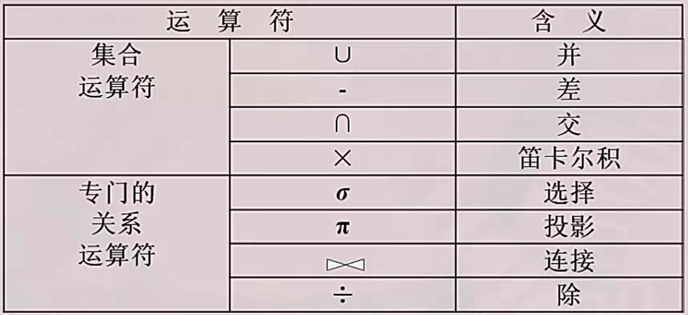

___
数据库概述——基础篇
===
参考资料：数据库系统概论（中国人民大学：王珊、杜小勇、陈红）MOOC   
2020.07.04  
符燚
***

<!-- TOC -->

- [1. 基础](#1-基础)
    - [1.1. 概念](#11-概念)
    - [1.2. 层次模型](#12-层次模型)
        - [1.2.1. 表示方法](#121-表示方法)
        - [1.2.2. 定义](#122-定义)
        - [1.2.3. 完整性约束条件](#123-完整性约束条件)
        - [1.2.4. 优点](#124-优点)
        - [1.2.5. 缺点](#125-缺点)
    - [1.3. 网状模型](#13-网状模型)
        - [1.3.1. 表示方法](#131-表示方法)
        - [1.3.2. 定义](#132-定义)
        - [1.3.3. 优点](#133-优点)
        - [1.3.4. 缺点](#134-缺点)
    - [1.4. 关系模型](#14-关系模型)
        - [1.4.1. 数据结构](#141-数据结构)
        - [1.4.2. 操作](#142-操作)
        - [1.4.3. 完整性约束条件](#143-完整性约束条件)
        - [1.4.4. 优点](#144-优点)
        - [1.4.5. 缺点](#145-缺点)
    - [1.5. 数据库系统的结构](#15-数据库系统的结构)
        - [1.5.1. 数据库系统模式](#151-数据库系统模式)
        - [1.5.2. 三级模式结构](#152-三级模式结构)
        - [1.5.3. 数据库的二级映像（mapping）功能与数据独立性](#153-数据库的二级映像mapping功能与数据独立性)
    - [1.6. 数据库系统的组成](#16-数据库系统的组成)
    - [1.7. 关系语言](#17-关系语言)
        - [1.7.1. 关系数据库语言分类](#171-关系数据库语言分类)
        - [1.7.2. 关系代数](#172-关系代数)
        - [1.7.3. 关系演算](#173-关系演算)
- [2. SQL](#2-sql)
    - [2.1. SQL的特点](#21-sql的特点)
        - [2.1.1. 综合统一](#211-综合统一)
        - [2.1.2. 高度非过程化](#212-高度非过程化)
        - [2.1.3. 面向集合的操作方式](#213-面向集合的操作方式)
        - [2.1.4. 以同一种语法结构提供多种使用方式](#214-以同一种语法结构提供多种使用方式)
    - [2.2. SQL的基本概念](#22-sql的基本概念)
        - [2.2.1. 基本表-模式](#221-基本表-模式)
        - [2.2.2. 存储文件-内模式](#222-存储文件-内模式)
        - [2.2.3. 视图-外模式](#223-视图-外模式)
        - [2.2.4. SQL的动词：](#224-sql的动词)
    - [2.3. 数据定义](#23-数据定义)

<!-- /TOC -->

# 1. 基础
## 1.1. 概念
* 数据（Data）：描述事物的符号记录
* 数据库（Database，DB）：长期储存在计算机内、有组织的、可共享的大量数据的集合。
    * 数据按一定的数据模型组织、描述和储存    
    * 可为各种用户共享、冗余度较小、易扩展  
    * 数据独立性较高  
* 数据库管理系统（DataBase Management System，DBMS）：科学的组织和存储数据、高效的获取和维护数据
* 数据库系统（DataBase System，DBS）
* 数据模型
    * 概念模型（信息模型）：按用户的观点对数据和信息建模，用于数据库设计
    * 逻辑模型：按计算机的观点对数据建模，用于DBMS实现。主要包括：网状模型、层次模型、关系模型、面向对象数据模型、对象关系数据模型、半结构化数据模型等
    * 物理模型：描述数据在系统内（磁盘上）的表示方法和存取方法
    * 数据模型的3个组成要素：数据模型的数据结构、数据操作和数据的完整性约束条件
## 1.2. 层次模型
* 用树形结构来表示各类实体以及实体间的联系 
* 属于格式化数据模型 
### 1.2.1. 表示方法
* 实体型：用记录类型描述，每个节点表示一个记录类型（实体）
* 属性：用字段描述，每个记录类型可包含若干个字段
* 联系：用节点之间的连线表示记录类型（实体）之间的一对多的父子联系
### 1.2.2. 定义
满足两个条件的基本层次联系的集合：  
* 有且只有一个结点没有双亲结点，这个节点被称为根节点
* 根以外的其他结点有且只有一个双亲节点
### 1.2.3. 完整性约束条件
* 无相应的双亲结点值就不能插入子女结点值
* 如果删除双亲结点值，则相应的子女结点值也被同时删除
* 更新操作时，应更新所有相应记录，以保证数据的一致性
### 1.2.4. 优点
* 层次模型的数据结构比较简单清晰
* 查询效率高，性能优于关系模型，不低于网状模型
* 层次数据模型提供了良好的完整性支持
### 1.2.5. 缺点
* 结点之间的多对多联系表示不自然
* 对插入和删除操作的限制多，应用程序的编写比较复杂
* 查询子女结点必须通过双亲节点
* 层次数据库的命令趋于程序化
## 1.3. 网状模型
* 采用网状结构来表示各类实体以及实体间的联系
* 属于格式化数据模型 
### 1.3.1. 表示方法
* 实体型：用记录类型描述，每个节点表示一个记录类型（实体）
* 属性：用字段描述，每个记录类型可包含若干个字段
* 联系：用节点之间的连线表示记录类型（实体）之间的多对多的父子联系
### 1.3.2. 定义
满足两个条件的基本层次联系的集合：  
* 允许一个以上的节点无双亲
* 一个节点可以有多于一个的双亲
### 1.3.3. 优点
* 能够更为直接地描述现实世界，如一个节点可以有多个双亲
* 具有良好的性能，存取效率高
### 1.3.4. 缺点
* 结构比较复杂，而且随着应用环境的扩大，数据库的结构就变得越来越复杂，不利于最终用户掌握
* DDL（数据定义语言）、DML（数据操纵语言）语言复杂，用户不容易使用
* 记录之间联系是通过存取路径实现的，应用程序必须选择存取路径，加重了程序员的负担
## 1.4. 关系模型
### 1.4.1. 数据结构
* 关系（Relation）：一个关系对应通常说的一张表
* 元组（Tuple）：表中的一行即为一个元组
* 属性（Attribute）：表中的一列即为一个属性，给每个属性起一个名称即为属性码
* 候选码：若关系中的某一属性组的值能唯一的标识一个元组，则称该属性组为候选码
* 主属性：候选码的诸属性称为主属性
* 全码：关系模式的所有属性组是这个关系模式的候选码
* 主码（Primary Key）：也称码键。表中的某个属性组，它可以唯一确定一个元组
* 域（Domain）：是一组具有相同数据类型的值的集合。属性的取值范围来自某个域
* 笛卡尔积：所有域的所有取值的任意组合，可以看作是关系的集合
* 分量：元组中的一个值
* 关系模式：对关系的描述
* 关系必须是规范化的，满足一定的规范条件。最基本的规范条件：关系的每一个分量必须是一个不可分的数据项，**不允许表中还有表**
### 1.4.2. 操作
* 数据操作是集合操作，操作对象和操作结果都是关系
* 存取路径对用户隐蔽，用户只需要指出”找什么“，不必详细描述说明”怎么找“  
提高了数据的独立性，提高了用户生产率
### 1.4.3. 完整性约束条件
* 关系模型确定的关系的两个不变性
    * 实体完整性：关系的主属性不能取空值
    * 参照完整性
        > 若属性（或属性组）F是基本关系R的外码，它与基本关系S的主码Ks相对应（基本关系R和S不一定是不同的关系），则对于R中的每个元组在F上的值必须为：  
        >* 或者取空值（F的每个属性值均为空值）
        >* 或者等于S中某个元组的主码值
* 用户定义的完整性
### 1.4.4. 优点
* 建立在严格的数学概念的基础上
* 概念单一
    * 实体对各类联系都用关系表示
    * 对数据的检索结果也是关系
* 关系模型的存取路径对用户透明
    * 具有更高的数据独立性，更好的安全保密性
    * 简化了程序员的工作和数据库开发建立的工作
### 1.4.5. 缺点
* 存取路径对用户透明，查询效率往往不如格式化数据模型
* 为提高性能，必须对用户的查询请求进行优化，增加了开发数据库管理系统的难度
## 1.5. 数据库系统的结构
* 从数据库应用开发人员角度看：数据库系统采用三级模式结构，是数据库系统内部的系统结构
* 从数据库最终用户角度看：  
数据库系统的结构有：单用户结构、主从式结构、分布式结构、客户—服务器、浏览器-应用服务器/数据库服务器
### 1.5.1. 数据库系统模式
* 模式（Schema）
    * 是对数据库逻辑结构和特征的描述
    * 是型的描述，不涉及具体值
    * 模式是相对稳定的
* 实例（Instance）
    * 数据库某一时刻的状态-模式的一个具体值
    * 同一模式可以有很多实例
    * 实例随数据库中的数据的更新而改变
### 1.5.2. 三级模式结构
* 外模式（External Schema）
    * 也称子模式或用户模式
        * 数据库用户使用的局部数据的逻辑结构和特征的描述
        * 数据库用户的数据视图，是与某一应用有关的数据的逻辑表示
    * 外模式与模式的关系
        * 外模式通常是模式的子集、一个模式可以有多个外模式   
        反映了不同的用户的应用需求、看待数据的方式、对数据保密的要求
        * 对模式中的某一数据，在不同的外模式中结构、类型、长度、保密级别等都可以不同
    * 一个外模式可以为多个应用系统所使用，一个应用程序只能使用一个外模式
    * 用途
        * 每个用户只能看见和访问所对应的外模式中的数据，简化用户视图
        * 保护数据库安全性的一个有力措施
* 模式（Schema）
    * 也称逻辑模式
        * 数据库中全体数据的逻辑结构和特征的描述
        * 所有用户的公共数据视图
    * 一般，某个应用的数据库有一个模式
    * 模式是数据库系统模式结构的中心
        * 与数据的物理存储细节和硬件环境无关
        * 与具体的应用程序、开发工具及高级程序设计语言无关
    * 定义模式
        * DDL定义数据的逻辑结构，以某种数据模型为基础。  
        数据记录由哪些数据项构成，数据项的名字、类型、取值范围等
        * 定义数据之间的联系
        * 定义与数据有关的安全性、完整性要求
* 内模式（Internal Schema）
    * 也称存储模式
    * 是数据物理结构和存储方式的描述
    * 是数据在数据库内部的表示方式
        * 记录的存储方式。如顺序存储、堆存储、hash方法存储等
        * 索引的组织方式。如B+树、Bitmap，hash
        * 数据是否压缩存储
        * 数据是否加密
        * 数据存储记录结构的规定-如定长/边长、记录是否可以跨页存放等        
    * 一个数据库只有一个内模式
### 1.5.3. 数据库的二级映像（mapping）功能与数据独立性
* 三个抽象层次的联系和转换
* **外模式/模式映像**
    * 对每一个外模式，有一个外模式/模式映像
    * 映像定义通常包含在各外模式的描述中
    * 保证数据的逻辑独立性
        * 当模式改变时，数据库管理员对外模式/模式映像做相应改变，使外模式保持不变
        * 应用程序是依据数据的外模式编写的，应用程序不必修改，保证了数据与程序的逻辑独立性，简称数据的逻辑独立性
* **内模式/模式映像**
    * 定义了数据全局逻辑结构与存储结构之间的对应关系
    * 数据库中内模式/模式映像是唯一的，该映像定义通常包含在模式描述中
    * 保证数据的物理独立性
        * 当数据的存储结构改变了（例如选用了另一种存储结构），数据库管理员修改模式/内模式映像，使模式保持不变
        * 模式不变，则应用程序不变。保证了数据与程序的物理独立性，简称数据的物理独立性
* 保证了应用程序的稳定性。除非应用需求本身发生变化，否则应用程序一般不需要修改
* 以程序为中心——发展为以数据为中心。具有了数据与程序之间的独立性，使得数据的定义和描述可以从应用程序中分离出去
* 数据的存取由数据库管理系统管理。简化了应用程序的编写、大大减少了应用程序的维护和修改
## 1.6. 数据库系统的组成
<div align="center">

</div>
## 1.7. 关系语言
### 1.7.1. 关系数据库语言分类
* 关系代数是一种抽象的查询语言，它用对关系的运算来表达查询
* 运算对象是关系，运算结果亦为关系
* 关系代数语言：用对关系的运算来表达查询要求
* 关系演算语言：用谓词来表达查询要求
    * 关系元组演算语言：谓词变元的基本对象是元组对象。代表：APLHA、QUEL
    * 域关系演算语言：谓词变元的基本对象是域变量。代表：QBE
* 具有关系代数和关系演算双重特点的语言。代表：SQL（Structured Query Language）
### 1.7.2. 关系代数
* 关系代数的运算符有两类：集合运算符和专门的关系运算符
* 关系代数运算符表：

    
* 并：两个关系都有n个属性，且相应的属性取自同一个域。结果仍为n目关系，由属于R或属于S的元组组成 
* 差：两个关系都有n个属性，且相应的属性取自同一个域。R-S 结果仍为n目关系，由属于R而不属于S的所有元素组成
* 交：两个关系都有n个属性，且相应的属性取自同一个域。结果仍为n目关系，由既属于R又属于S的元组组成
* 笛卡尔积：R是n目关系、k1个元组；S是m目关系、k2个元组。结果为（n+m）目，（k1*k2）个元组
* 选择(限制)：在关系R中选择满足给定条件的诸元组。选择条件F是一个逻辑表达式，取值为‘真’或‘假’。选择运算是从关系R中选取使逻辑条件F为真的元组，是从行的角度进行的选择
* 投影：从R中选择出若干属性列组成新的关系。投影操作主要从列的角度进行运算。投影之后不仅取消了原关系的某些列，而且还可能取消某些元组（避免重复行）
* 连接：从两个关系的笛卡尔积中选取属性间满足一定条件的元组  
    * 等值连接：从关系R和S的广义笛卡尔积中选取A、B属性值相等的那些元组
    * 自然连接：是一种特殊的等值连接。两个关系中进行比较的分量必须是相同的属性组，并且在结果中把重复的属性列去掉
    * 悬浮元组：两个关系R和S在做自然连接时，关系R中的某些元组有可能在S中不存在公共属性上值相等的元组，从而造成R中的这些元组在操作时被舍弃了，这些被舍弃的元组称为悬浮元组
    * 外连接：如果把悬浮元组也保存在结果中，而在其他属性上填空值（Null），就叫做外连接
        >左外连接：只保留左边关系R中的悬浮元组  
        >右边连接：只保留右边关系S中的悬浮元组
* 除运算：给定关系R（X，Y）和S（Y，Z），其中X，Y，Z为属性组，R中的Y与S中的Y出自相同的域集。R与S的除运算得到一个新的关系P(X)，P是R中满足条件：**元组在X上的分量值x的象集Yx 包含 S在Y上投影的集合**的元组在X属性列上的投影  
*象集：在关系R(X,Y)中，x在R中的象集表示R中属性组X上值为x的诸元组在Y上分量的集合*
### 1.7.3. 关系演算
* 元组关系演算语言ALPHA
    * `GET 工作空间名 (定额) (表达式1) [: 条件] [DOWN|UP 表达式2]`  
    * 表达式1：指定语句的操作对象  
    格式：关系名、关系名.属性名、元组变量.属性名、集函数[, ···]
    * 条件：结果元组应该满足的条件  
    格式：逻辑表达式
    * 表达式2：指定排序方式  
    格式：关系名.属性名、元组变量.属性名 [,···]
    ```ALPHA
    GET W (SC.Cno) 
    //查询所有被选修的课程号码
    GET W (Student.Sno,Student.Sage):Student.Sdept='IS'^Student.Sage<20 
    //查询信息系(IS)中年龄小于20岁的学生的学号和年龄
    GET W (Student.Sno,Student.Sage):Student.Sdept='CS' DOWN Student.Sage
    //查询计算机科学系(CS)学生的学号和年龄,结果按年龄降序排列
    GET W (1) (Student.Sno):Student.Sdept='IS' 
    //取出一个信息系学生的学号
    GET W (3) (Student.Sno,Student.Sage): Student.Sdept='IS' DOWN Student.Sage
    //查询信息系年龄最大的三个学生的学号及其年龄,结果按年龄降序排序
    ```
    * 以元组变量作为谓词变元的基本对象
        * 元组变量表示可以在某一关系范围内变化,也称范围变量。一个关系可以设多个元组变量
        * 用途:简化关系名:设一个较短名字的元组变量来代替较长的关系名;条件中使用量词时必须使用元组变量
        * 定义元组变量:`RANGE 关系名 变量名`  

        * 符号
        <math display="block" xmlns="http://www.w3.org/1998/Math/MathML"><mo>&#x2203;</mo></math>表示存在，示例中不好表示，用‘存在’表示 
    ```ALPHA
    RANGE SC X
    GET W (Student.Sname):
    存在X(S.Sno=Student.Sno^S.Cno='2')
    ```
    * ~~用量词检索~~
    * ~~用蕴含的检索~~
    * 聚集函数  
    COUNT：对元组计数；TOTAL：求总和；MAX：求最大值；MIN：求最小值；AVG：求平均值。用在表达式1里
* 域关系演算语言QBE
    * 基于屏幕表格的查询语言。以填写表格的方式构造查询
    * 聚集函数  
    CNT：对元组计数；SUM：求总和；MAX：求最大值；MIN：求最小值；AVG：求平均值。
    * 对查询结果排序：`AO.`：升序；`DO.`：降序；`AO(i).`：多列排序，i值越小，优先级越高。

# 2. SQL
* Structured Query Language——结构化查询语言，是关系数据库的标准语言
## 2.1. SQL的特点
### 2.1.1. 综合统一
* 集数据定义语言（DDL）、数据操作语言（DML）、数据控制语言（DCL）功能于一体
* 可以独立完成数据库生命周期的全部活动  
    * 定义和修改、删除关系模式，定义和删除视图，插入数据，建立数据库
    * 对数据库中的数据进行查询和更新
    * 数据库重构和维护
    * 数据库安全性、完整性控制，以及事务控制
    * 嵌入式SQL和动态SQL定义
### 2.1.2. 高度非过程化
* 非关系数据模型的数据操作语言“面向过程”，必须指定存取路径，而SQL无需了解存取路径。存取路径的选择以及SQL的操作过程由系统自动完成
### 2.1.3. 面向集合的操作方式
* 非关系数据模型采用面向记录的操作方式，操作对象是一条记录
* SQL采用集合操作方式，操作对象、查找结果可以是元组的集合。一次插入、删除、更新操作的对象可以是元组的集合
### 2.1.4. 以同一种语法结构提供多种使用方式
* SQL是独立的语言。能够独立的用于联机交互的使用方式
* SQL又是嵌入式语言。能够嵌入到高级语言（例如C、C++、Java）程序中，供程序员设计程序时使用  
## 2.2. SQL的基本概念
### 2.2.1. 基本表-模式
* 本身独立存在的表
* SQL中一个关系就对应一个基本表
* 一个（或多个）基本表对应一个存储文件
* 一个表可以带若干索引
### 2.2.2. 存储文件-内模式
* 逻辑结构组成了关系数据库的内模式
* 物理结构对用户是隐蔽的
### 2.2.3. 视图-外模式
* 从一个或几个基本表导出的表
* 数据库中只存放视图的定义而不存放视图对应的数据
* 视图是一个虚表
* 用户可以在视图上再定义视图
### 2.2.4. SQL的动词：
* 数据查询：SELECT(select)
* 数据定义：CREATE(create)、 DROP(drop)、 ALTER(alter)
* 数据操纵：INSERT(insert)、 UPDATE(update)、 DELETE(delete)
* 数据控制：GRANT(grant)、 REVOKE(revoke)
## 2.3. 数据定义
