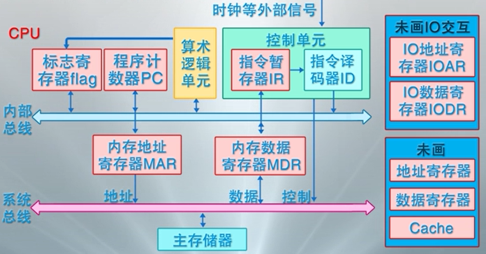
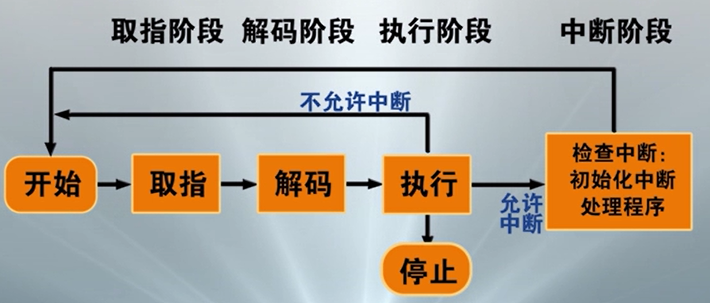
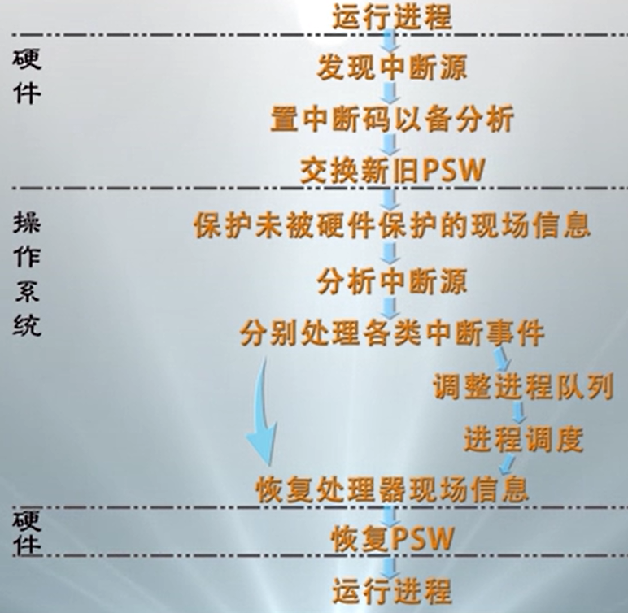
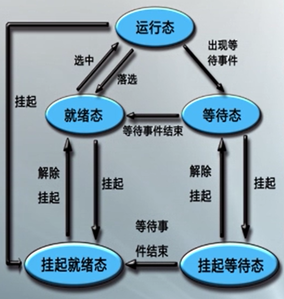
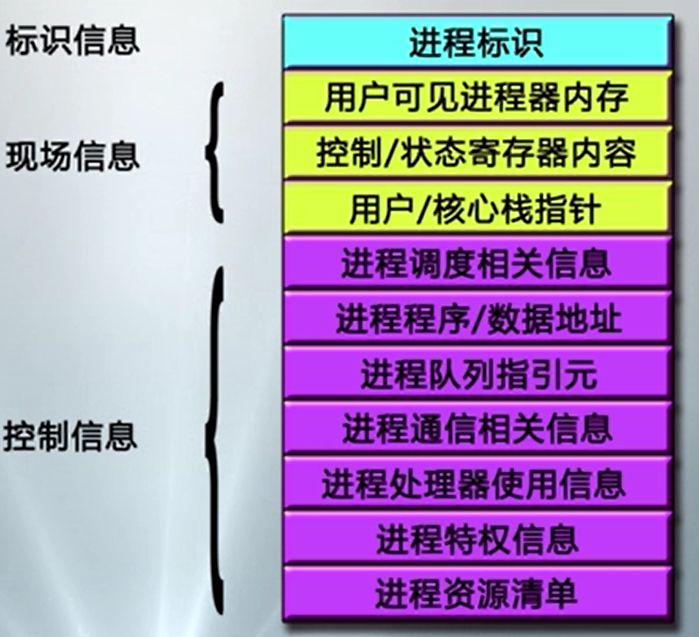
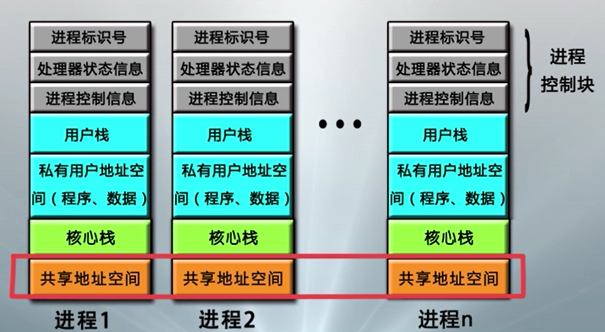
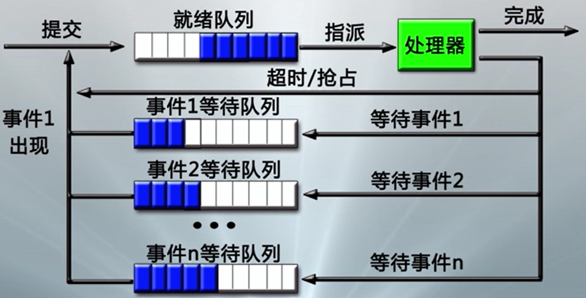

___
计算机操作系统概述
===
参考资料：计算机操作系统（南京大学：骆斌、葛季栋）MOOC   
2020.08.21  
符燚
***

<!-- TOC -->

- [1. 基础](#1-基础)
    - [1.1. 计算机硬件](#11-计算机硬件)
    - [1.2. 计算机软件](#12-计算机软件)
    - [1.3. 操作系统](#13-操作系统)
    - [1.4. 操作系统的资源](#14-操作系统的资源)
        - [1.4.1. 屏蔽资源使用的底层细节](#141-屏蔽资源使用的底层细节)
        - [1.4.2. 资源共享与分配](#142-资源共享与分配)
        - [1.4.3. 程序控制](#143-程序控制)
        - [1.4.4. 计算机系统操作方式](#144-计算机系统操作方式)
        - [1.4.5. 操作系统的程序接口](#145-操作系统的程序接口)
        - [1.4.6. 操作系统内核](#146-操作系统内核)
- [2. 处理器管理](#2-处理器管理)
    - [2.1. 处理器概述](#21-处理器概述)
        - [2.1.1. 处理器部件](#211-处理器部件)
        - [2.1.2. 指令](#212-指令)
        - [2.1.3. 处理器模式](#213-处理器模式)
    - [2.2. 中断](#22-中断)
        - [2.2.1. 定义](#221-定义)
        - [2.2.2. 中断源](#222-中断源)
        - [2.2.3. 中断系统](#223-中断系统)
        - [2.2.4. 多中断的响应与处理](#224-多中断的响应与处理)
    - [2.3. 进程](#23-进程)
        - [2.3.1. 定义](#231-定义)
        - [2.3.2. 进程状态](#232-进程状态)
        - [2.3.3. 进程的数据描述](#233-进程的数据描述)
        - [2.3.4. 进程管理](#234-进程管理)

<!-- /TOC -->

# 1. 基础
* 计算机系统组成：硬件子系统、软件子系统
## 1.1. 计算机硬件
* 冯诺依曼计算机模型——存储程序计算机
    >* 以运算单元为中心，控制流由指令流产生
    >* 采用存储程序原理，面向主存组织数据流
    >* 主存是按地址访问、线性编址的空间
    >* 指令由操作码和地址码组成
    >* 数据以二进制编码
* 总线：按照传输的信息种类，包括：一组控制线、一组数据线和一组地址线。按类别还可分为内部总线、系统总线和通信总线。
    >* 内部总线：用于CPU芯片内部连接各元件
    >* 系统总线：用于连接CPU、存储器和各种I/O模块等主要部件
    >* 通信总线：用于计算机系统之间的通信
* 中央处理器（CPU）：是计算机的运算核心（Core）和控制核心（Cintrol Unit），主要包括：
    >* 运算逻辑部件：一个或多个运算器
    >* 寄存器部件：包括通用寄存器、控制与状态寄存器、以及高速缓冲存储器（Cache）
    >* 控制部件：
    >>* 实现各部件间联系的数据、控制及状态的内部总线
    >>* 负责对指令译码、发出为完成每条指令所要执行操作的控制信号、实现数据传输等功能的部件
* 外围设备及其控制
    >* 设备类型：输入设备、输出设备、存储设备、机机通信设备
    >* 设备控制方式：
    >>* 轮询方式：CPU忙式控制，CPU执行内存数据交换
    >>* 中断方式：CPU启动外设，外设中断CPU，CPU执行内存数据交换
    >>* DMA方式：CPU启动DMA，DMA执行输入输出与内存数据交换，DMA中断CPU（Direct Memory Access，直接存储器访问）
## 1.2. 计算机软件
* 三大组成部分：系统软件、支撑软件、应用软件
* 系统软件：操作系统、实用程序、语言处理程序、数据库管理系统
    >* 操作系统实施对各种软硬件资源的管理控制
    >* 实用程序为方便用户所设，如文本编辑等
    >* 语言处理程序把用汇编语言/高级语言编写的程序，翻译成可执行的机器语言程序
* 支撑软件：有接口软件、工具软件、环境数据库、支持用户使用计算机的环境，提供开发工具。也可认为是系统软件的一部分
* 应用软件：使用户按其需要自行编写的专用程序  
## 1.3. 操作系统
* 操作系统（Operating System），简称OS
* 组成：进程调度子系统、进程通信子系统、内存管理子系统、设备管理子系统、文件管理子系统、网络通信子系统、作业控制子系统
* 类型
    > 从操作控制方式  
    >* 多道批处理操作系统，采用脱机控制方式
    >* 分时操作系统，采用交互控制方式
    >* 实时操作系统 
     
    > 从应用领域
    >* 服务器操作系统、并行操作系统
    >* 网络操作系统、分布式操作系统
    >* 个人机操作系统、手机操作系统
    >* 嵌入式操作系统、传感器操作系统
## 1.4. 操作系统的资源
* 处理器资源、内存资源、设备资源、信息资源管理、信号量资源
### 1.4.1. 屏蔽资源使用的底层细节
* 驱动程序：最底层的、直接控制和监视各类硬件（或文件）资源的部分
* 职责是隐藏底层硬件的具体细节、并向其他部分提供一个抽象的、通用的接口
### 1.4.2. 资源共享与分配
* 资源共享方式
    >* 独占使用方式
    >* 并发使用方式
* 资源分配策略
    >* 静态分配方式
    >* 动态分配方式
    >* 资源独占方式
### 1.4.3. 程序控制
* 多道程序同时计算。CPU速度与I/O速度不匹配的矛盾。只有让多道程序同时进入内存争抢CPU运行，才可以使得CPU和外围设备充分并行，从而提高计算机系统的使用效率
* 多道程序设计：指让多个程序同时进入计算机的主存储器进行计算
* 多道程序设计的特点
    >* CPU与外围设备充分并行
    >* 外围设备之间充分并行
    >* 发挥CPU的使用效率
    >* 提高单位时间的算题量
* 进程：为进入内存执行的程序建立的管理实体
* OS能管理与控制进程程序的执行
* OS协调管理各类资源在进程间的使用
    >* 处理器的管理与调度
    >* 主存储器的管理和调度
    >* 其他资源的管理和调度
### 1.4.4. 计算机系统操作方式
* OS规定了合理操作计算机的工作流程
* OS的操作接口——系统程序  
OS提供给用户的功能级接口，为用户提供的解决操作计算机和计算共性问题的所有服务的集合
* 作业，是用户在一次计算过程中或者事务处理过程中，要求计算机所作工作的集合。
* 作业是不同相接的顺序步组成，这些作业步之间总是相互在时间和所占空间方面关联的。
* OS的两类作业级接口：
    >* 脱机作业控制方式：作业控制语句
    >* 联机作业控制方式：操作控制命令
* 脱机作业控制方式：
    >* OS：提供作业说明语言
    >* 用户：编写作业说明书，确定作业加工步骤，并与程序数据一并提交
    >* 操作员：通过控制台输入**作业**
    >* OS：通过作业控制程序自动控制作业的执行
    >* 例如：批处理OS的作业控制方式：UNIX的Shell程序、DOS的bat文件
* 联机作业控制方式
    >* 计算机：提供终端（键盘/显示器）
    >* 用户：登录系统
    >* 用户：联机输入命令，直接控制**作业步**的执行
    >* 例如：分时OS的交互控制方式
* 命令解释程序：接受和执行一条用户提出的对作业的加工处理命令
* 当一个新的批作业被启动，或新的交互型用户登录进系统时，系统就自动的执行命令解释程序，负责读入控制卡或命令行，做出相应的解释，并予以执行
* 命令解释程序的分类
    >* 会话语言：可编程的命令解释程序
    >* 图形化的命令控制方式
    >* 多通道交互的命令控制方式
* 命令解释程序的处理过程
    >* OS启动命令解释程序，输出命令提示符，等待键盘中断/鼠标点击/多通道识别
    >* 每当用户输入一条命令（暂存在命令缓冲区），并按回车换行时，申请中断
    >* CPU响应后，将控制权交给命令解释程序，接着读入命令缓冲区内容，分析命令、接收参数，执行处理代码
* 前台命令和后台命令
    >* 前台命令执行结束后，再次输出命令提示符，等待下一条命令
    >* 后台命令处理启动后，即可接收下条命令
### 1.4.5. 操作系统的程序接口
* 操作系统的程序接口——系统调用
* 操作系统提供的完成某种特定功能的过程。为所有运行程序提供访问操作系统的接口
* 系统调用的实现机制
    >* 陷入处理机制：计算机系统中控制和实现系统调用的机制
    >* 陷入指令：也称访管指令，或异常中断指令，计算机系统为实现系统调用而引起处理器中断的指令
    >* 每个系统调用都事先规定了编号，并在约定寄存器中规定了传递给内部处理程序的参数
    >* 编写系统调用处理程序
    >* 设计一张系统调用入口地址表，每个入口地址指向一个系统调用的处理程序，并包含系统调用自带参数的个数
    >* 陷入处理机制需开辟现场保护区，以保存发生系统调用时的处理器现场
### 1.4.6. 操作系统内核
* 单内核：内核中各部件杂然混居的形态。如Unix/Linux，及Windows（自称采用混合内核的CS结构）
* 微内核：强调结构性部件与功能性部件的分离
* 混合内核：微内核和单内核的折中，较多组件在核心态中运行
* 外内核：尽可能减少内核的软件抽象化和传统微内核的消息传递机制，使得开发者专注于硬件的抽象化；部分嵌入式系统使用

# 2. 处理器管理
## 2.1. 处理器概述
### 2.1.1. 处理器部件
* 处理器部件

* 用户程序可见寄存器：可以使程序员减少访问主存储器的次数，提高指令执行的效率。所有程序可用，包括应用程序和系统程序
    * 数据寄存器：又称通用寄存器。AX、BX、CX、DX
    * 地址寄存器：索引（SI、DI）、栈指针（SP、BP）、段地址等寄存器（CS、DS、SS、ES）
* 控制与状态寄存器：用于控制处理器的操作。主要被具有特权的操作系统程序使用，以控制程序的执行
    * 程序计数器PC：存储将取指令的地址
    * 指令寄存器IR：存储最近使用的指令
    * 条件码CC：CPU为指令操作结果设置的位，标志正/负/零/溢出等结果
    * 标志位：中断位、中断允许位、中断屏蔽位、处理器模式位、内存保护位……
* 程序状态字PSW
    * 既是操作系统的概念，指记录当前程序运行状态的动态信息，通常包括
        * 程序计数器、指令寄存器、条件码
        * 中断字、中断允许/禁止、中断屏蔽、处理器模式、内存保护、调试控制
    * 也是计算机系统的寄存器，通常设置一组控制与状态寄存器，也可专设一个PSW寄存器
### 2.1.2. 指令
* 机器指令：是计算机系统执行的基本命令，是中央处理器执行的基本单位。由一个或多个字节组成，包括操作码字段、一个或多个操作数地址字段、以及一些表征机器状态的状态字以及特征码。指令完成各种算术逻辑运算、数据传输、控制流跳转特征码
* 机器指令执行过程
    * CPU根据PC取出指令，放入IR，并对指令译码，然后发出各种控制命令，执行微操作系列，从而完成一条指令的执行，设置CC位与PC值
    * 指令执行周期：取指+解码+执行
    * 一般通过指令流水线方式执行。把指令过程分解为若干子过程，每个子过程都可有效的在其专用功能段上与其他子过程重叠执行
* 特权指令与非特权指令：用户程序并非能够使用全部机器指令，哪些与计算机核心资源相关的特殊指令会被保护。如启动I/O指令、置PC指令
    * 特权指令：只能被操作系统内核使用的指令
    * 非特权指令：能够被所有程序使用的指令
    * 特权指令与非特权指令通过处理器模式位区分
### 2.1.3. 处理器模式
* 处理器模式：计算机通过设置处理器模式实现特权指令管理
    * 计算机一般设置0、1、2、3等四种运行模式：0操作系统内核，1系统调用，2共享库程序，3用户程序保护等保护级别
    * 0模式可以执行全部指令，3模式只能执行非特权指令，其它每种运行模式可以规定执行的指令子集
    * 一般来说，现代操作系统只使用0和3两种模式，对应于内核模式和用户模式
* 模式的切换
    * 包括“用户模式->内核模式”和“内核模式->用户模式”的转换
    * 中断、异常或系统异常等事件导致用户程序向OS内核切换，触发“用户模式->内核模式”
        * 程序运行时发生并响应中断
        * 程序运行时发生异常
        * 程序请求操作系统服务
    * OS内核处理完成后，调用中断返回指令（如Intel的iret）触发“内核模式->用户模式”
## 2.2. 中断
### 2.2.1. 定义
* 中断：指程序执行过程中，遇到急需处理的事件时，暂时中止CPU上现行程序的运行，转去执行相应的事件处理程序，待处理完成后再返回原程序被中断处或调度其它程序执行的过程
* **操作系统是“中断驱动的”**。即中断是激活操作系统的唯一方式。（广义上的中断）
* 狭义的中断：指来源于处理器之外的中断事件，即与当前运行指令无关的中断事件，如I/O中断、时钟中断、外部信号中断等
* 异常：指当前运行指令引起的中断事件（来源于CPU内部），如地址异常、算数异常、处理器硬件故障等
* 系统异常：指执行陷入指令而触发系统调用引起的中断事件，如请求设备、请求I/O、创建进程等。可以视为异常中的一类
### 2.2.2. 中断源
* 处理器硬件故障中断事件--异常
    * 由处理器、内存储器、总线等硬件故障引起
    * 处理原则：保护现场，停止设备，停止CPU，向操作员报告，等待人工干预。（电路中存在电容）
* 程序性中断事件：处理器执行机器指令引起的--异常
    * 除数为零、操作数溢出等算数异常。处理：简单处理，报告用户；也可以由用户编写中断续元程序处理
    * 非法指令、用户态使用特权指令、地址越界、非法存取等指令异常。处理：中止进程
    * 终止进程指令。处理：终止进程
    * 虚拟地址异常。处理：调整内存后重新加载执行指令。该异常比较特殊，该指令没有执行完，其它中断都是执行完当前指令，所以该种异常需要重新加载执行指令
* 自愿性中断事件--系统异常
    * 处理器执行陷入指令请求OS服务引起。在操作系统中，又称为系统调用
    * 如请求分配外设、请求I/O等
    * 处理流程：陷入OS，保护现场，根据功能号查入口地址，跳转具体处理程序
* I/O中断事件：来源于外围设备报告I/O状态的中断事件--狭义的中断事件
    * I/O完成：调整进程状态，释放等待进程等
    * I/O出错：等待人工干预
    * I/O异常：等待人工干预
* 外部中断事件：由外围设备发出的信号引起的中断事件
    * 时钟中断、间隔时钟中断：计时与时间片处理
    * 设备报道与结束中断：调整设备表
    * 键盘/鼠标信号中断：根据信号做出相应反应
    * 关机/重启动中断：写回文件，停止设备与CPU
### 2.2.3. 中断系统
* 中断系统是计算机系统中响应和处理中断的系统，包括硬件子系统和软件子系统两部分
* 中断响应由硬件子系统完成
* 中断处理由软件子系统完成
* 在指令执行周期最后增加一个微操作，以响应中断

* 中断装置
    * 计算机系统中发现并响应中断/异常的硬件装置
    * 由于中断源的多样性，硬件实现的中断装置有多种，分别处理不同类型的中断。因计算机而异，通常有：
        * 处理器外的中断：由中断控制器发现和响应
        * 处理器内的异常：由指令的控制逻辑和实现线路发现和响应，相应机制称为陷阱
        * 请求OS服务的系统异常：处理器执行陷入指令时直接触发，相应机制称为系统陷阱
    * 中断控制器：CPU中的一个控制部件，包括中断控制逻辑线路（形成中断的通路）和中断寄存器（记录是哪个中断）
        * 外部设备向其发出中断请求IRQ，在中断寄存器中设置已发生的中断
        * 指令处理结束前，会检查中断寄存器，若有不被屏蔽的中断产生，则改变处理器内操作的顺序，引出操作系统中的中断处理程序
    * 陷阱和系统陷阱：指令的逻辑实现线路的一部分
        * 执行指令出现异常后，会根据异常情况转向操作系统的异常处理程序
        * 出现虚拟地址异常后，需要重新执行指令，往往越过陷阱独立设置页面异常处理程序
        * 执行陷入指令后，越过陷阱处理，触发系统陷阱，激活系统调用处理程序
* 中断响应过程
    1. 发现中断源，提出中断请求
        * 发现中断寄存器中记录的中断
        * 决定这些中断是否被屏蔽
        * 当有多个要响应的中断源时，根据规定的优先级选择一个
    2. 中断当前程序的执行
        * 保存当前程序的PSW/PC到核心栈
    3. 转向操作系统的中断处理程序
* 中断的处理
    * 中断处理程序：操作系统处理中断事件的控制程序，主要任务是处理中断事件和恢复正常工作
        * 保护未被硬件保护的处理器状态
        * 通过分析被中断程序的PSW中断码字段，识别中断源
        * 分别处理发生的中断事件
        * 恢复正常的操作
    * 恢复正常操作
        * 对于某些中断，在处理完毕后，直接返回刚刚被中断的进程
        * 对于其它一些中断，要中断当前进程的运行，调整进程队列，启动进程调度，选择下一个执行的进程并恢复其执行。如输入输出
* 中断系统处理流程

### 2.2.4. 多中断的响应与处理
* 中断屏蔽：当计算机系统检测到中断时，中断装置通过中断屏蔽位决定是否响应已发生的中断，有选择的响应中断
* 中断优先级
    * 当计算机同时检测到多个中断时，中断装置响应中断的顺序
    * 有优先度的响应中断
    * 一种可能的处理次序：
        1. 处理机硬件故障中断事件
        2. 自愿性中断事件
        3. 程序性中断事件
        4. 时钟中断等外部中断事件
        5. 输入输出中断事件
        6. 重启动和关机中断事件
    * 不同类型的操作系统有不同的中断优先级
* 中断的嵌套处理
    * 当计算机响应中断后，在中断处理过程中，可以再响应其它中断
    * 操作系统是性能攸关程序，且中断响应处理有硬件要求，考虑系统效率和实现代价问题，中断的嵌套处理应限制在一定层数内，如3层
    * 中断的嵌套处理改变中断处理次序，先响应的有可能后处理
* 决定中断处理次序的因素
    * 中断屏蔽可以使中断装置不响应某些中断
    * 中断优先级决定了中断装置响应中断的次序
    * 中断的嵌套处理改变中断处理次序
## 2.3. 进程
### 2.3.1. 定义
* 操作系统必须全方位地管理计算机系统中运行的程序，因此，操作系统为正在运行的程序建立一个管理实体--进程
* 进程是一个具有一定独立功能的程序关于某个数据集合的一次运行活动。是操作系统进行资源分配和调度的一个独立单位
* 一个进程包括五个实体部分
    * （OS管理运行程序的）数据结构P
    * （运行程序的）内存代码C
    * （运行程序的）内存数据D
    * （运行程序的）通用寄存器信息R
    * （OS控制程序执行的）程序状态字信息PSW
* 进程举例--*程序和数据集均针对内存级*
    * 不同程序在不同数据集上运行：构成两个无关进程
    * 不同程序在相同数据集上运行：构成两个共享数据的交往进程
    * 相同代码在不同数据集上运行：构成两个共享代码的无关进程
* 进程可共享的代码称为**可再入程序**，如编辑器。可再入程序必须是纯代码的，不能带任何局部的数据区
* 在不同时段中针对（同一个外存数据文件）运行（同一个外存程序文件），意味着完全不同的（P、C、D、R、Psw），是两个完全不同的进程
### 2.3.2. 进程状态
* 进程状态
    * 运行态：进程占有处理器运行
    * 就绪态：进程具备运行条件，等待处理器运行
    * 等待态：进程由于等待资源、输入输出、信号等不具备运行条件
    >* 运行态->等待态  
    > 等待资源、I/O、信号
    >* 等待态->就绪态  
    > 资源满足、I/O结束、信号完成
    >* 就绪态->运行态  
    > 处理器空闲时间、选择更高优先权进程抢占
    >* 运行态->就绪态  
    > 运行时间片到、有更高优先级进程
* 进程挂起
    * OS无法预期进程的数目与资源需求，计算机系统在运行过程中可能出现资源不足的情况（表现为性能低和死锁）。
    * 剥夺某些进程的内存及其它资源，进入OS管理的对换区，不参加进程调度，待适当时候再调入内存、恢复资源、参与运行，这就是**进程挂起**
    * 挂起态与等待态有着本质区别，后者占有已申请到的资源处于等待，前者没有任何资源
* 进程状态转换
    
    * 一般选择等待态进程进入挂起等待态
    * 也可以选择就绪态进程进入挂起就绪态
    * 运行态进程还可以挂起自己
    * 等待事件结束后，挂起等待态进入挂起就绪态
    * 一般选择挂起就绪态进程予以恢复为就绪态
    * 只有在系统极其空闲的情况下，选择挂起等待态予以恢复为等待态
### 2.3.3. 进程的数据描述
* 进程控制块（Process Control Block）
    * 是OS用于记录和刻画进程状态及环境信息的数据结构
    * 借助PCB，OS可以全面管理进程的物理实体，刻画进程的执行现状，控制进程的执行
    * 进程控制块示意图
    
    * 标识信息：用于存放唯一标识该进程的信息
        * 系统分配的标识号
        * 系统分配的进程组标识号
        * 用户定义的进程名
        * 用户定义的进程组名
    * 现场信息：用于存放该进程运行时的处理器现场信息
        * 用户可见寄存器内容：数据寄存器、地址寄存器
        * 控制与状态寄存器内容：PC、IR、PSW
        * 栈指针内容：核心栈和用户栈指针
    * 控制信息：用于存放与管理、调度进程相关的信息
        * 调度相关信息：状态、等待事件/原因、优先级
        * 进程组成信息：代码/数据地址、外存映像地址
        * 队列指引元：进程队列指针、父子兄弟进程的指针
        * 通信相关信息：消息队列、信号量、锁
        * 进程特权信息：如内存访问权限、处理器特权等
        * 处理器使用信息：占用的处理器、时间片、处理器使用时间/已执行总时间、记账信息
        * 资源清单信息：如正占有的资源、已使用的资源
* 进程映像（Process Image）:某一时刻进程的内容及其执行状态集合
    * 进程控制块：保存进程的标识信息、状态信息和控制信息
    * 进程程序块：进程执行的程序空间
    * 进程数据块：进程处理的数据空间，包括数据、处理函数的用户栈和可修改的程序
    * 核心栈：进程在内核模式下运行时使用的堆栈，中断或系统过程使用
    * 进程映像是内存级的物理实体，又称为进程的内存映像
    * 进程的内存映像示意图
    
* 进程上下文（Process context）
    * 进程的执行需要环境支持，包括CPU现场和Cache中的执行信息，它们和内存映像共同构成了执行的上下文环境
    * OS中的进程物理实体和支持进程运行的环境合成进程上下文，包括
        * 用户级上下文：用户程序块/用户数据区/用户栈/用户共享内存
        * 寄存器上下文：PSW/栈指针/通用寄存器
        * 系统级上下文：PCB/内存区表/核心栈
    * 进程上下文刻画了进程的执行情况
### 2.3.4. 进程管理
* 关键的进程管理软件包括
    * 系统调用/中断/异常处理程序
    * 队列管理模块（管理进程控制块）
    * 进程控制程序（控制进程的状态转换）
    * 进程调度程序（独立进程居多）
    * 进程通信程序（多个程序包）
    * 终端登录与作业控制程序、性能监控程序、审计程序等外围程序
* 进程的队列模型

* 队列管理模块
    * 队列管理模块是操作系统实现进程管理的核心模块
    * 操作系统建立多个进程队列，包括就绪队列和等待队列
    * 按需组织为先进先出队列与优先级队列
    * 队列中的进程可以通过PCB中的队列指引元采用单/双向指引元或索引连接
    * 出队和入对的操作
    * 进程和资源调度围绕进程队列展开
* 进程的控制和管理
    * 进程创建：进程表加一项，申请PCB并初始化，生成标识，建立映像，分配资源，移入就绪队列
    * 进程撤销：从列表中移除，归还资源，撤销标识，回收PCB，移除进程表项
    * 进程阻塞：保存现场信息，修改PCB，移入等待队列，调度其它进程执行
    * 进程唤醒：等待队列中移出，修改PCB，移入就绪队列（该进程优先级高于进程触发抢占）
    * 进程挂起：修改状态并出入相关队列，收回内存等资源送至对换区
    * 进程激活：分配内存，修改状态并出入相关队列
    * 其它：如修改进程特权
* 原语与进程控制原语
    * 进程控制过程中涉及对OS核心数据结构（进程表/PCB池/队列/资源表）的修改，为防止与时间有关的错误，应使用原语
    * 原语是由若干条指令构成的完成某种特定功能的程序，执行上具有不可分割性
    * 原语的执行可以通过关中断实现
    * 进程控制使用的原语称为进程控制原语
    * 另一类常用原语是进程通信原语
* 进程切换：指从正在运行的进程中收回处理器，让待运行进程来占有处理器运行。实质上就是被中断运行进程与待运行进程的上下文切换，处理过程是：
    1. 保存被中断进程的上下文
    2. 转向进程调度
    3. 恢复待运行进程的上下文
    * 进程切换必须在操作系统内核模式下完成，这就需要模式切换
* 模式切换：又称为处理器状态切换，包括：
    * 用户模式到内核模式中断/异常/系统调用：中断用户进程执行而触发
    * 内核模式到用户模式OS执行中断返回指令：将控制权交还用户进程而触发
* 模式切换的基本工作
    * 中断装置完成正向模式切换
        1. 处理器模式转为内核模式
        2. 保存当前进程的PC/PSW值到核心栈
        3. 转向中断/异常/系统调用处理程序
    * 中断返回指令完成逆向模式切换
        1. 从待运行进程核心栈中弹出PSW/PC值
        2. 处理器模式转换为用户模式
    * 中断管理是由硬件完成的
* 进程切换的工作流程
    1. （中断/异常等触发）正向模式切换并压入PSW/PC
    2. 保存被中断进程的现场信息
    3. 处理具体中断/异常
    4. 把被中断进程的系统堆栈指针SP值保存到PCB
    5. 调整被中断进程的PCB信息，如进程状态
    6. 把被中断进程的PCB加入相关队列
    7. 选择下一个占用CPU运行的进程
    8. 修改被选中进程的PCB信息，如进程状态
    9. 设置被选中进程的地址空间，恢复存储管理信息
    10. 恢复被选中进程的SP值到处器寄存器SP
    11. 恢复被选中进程的现场信息进入处理器
    12. （中断返回指令触发）逆向模式转换并弹出PSW/PC
* 进程切换的发生时机
    * 进程切换一定发生在中断/异常/系统调用处理过程中，常见情况：
        * 阻塞式系统调用、虚拟地址异常导致被中断进程进入等待态
        * 时间片中断、I/O中断后发现更高优先级进程导致，被中断进程转入就绪态
        * 终止系统调用、不能继续执行的异常导致被中断进程进入终止态
    * 一些中断/异常不会引起进程状态转换，不会引起进程切换，只是在处理完成后把控制权交给被中断进程，如计时中断。处理流程是：
        1. （中断/异常触发）正向模式切换压入PSW/PC
        2. 保存被中断进程的现场信息
        3. 处理中断/异常
        4. 恢复被中断进程的现场信息
        5. （中断返回指令触发）逆向模式转换弹出PSW/PC