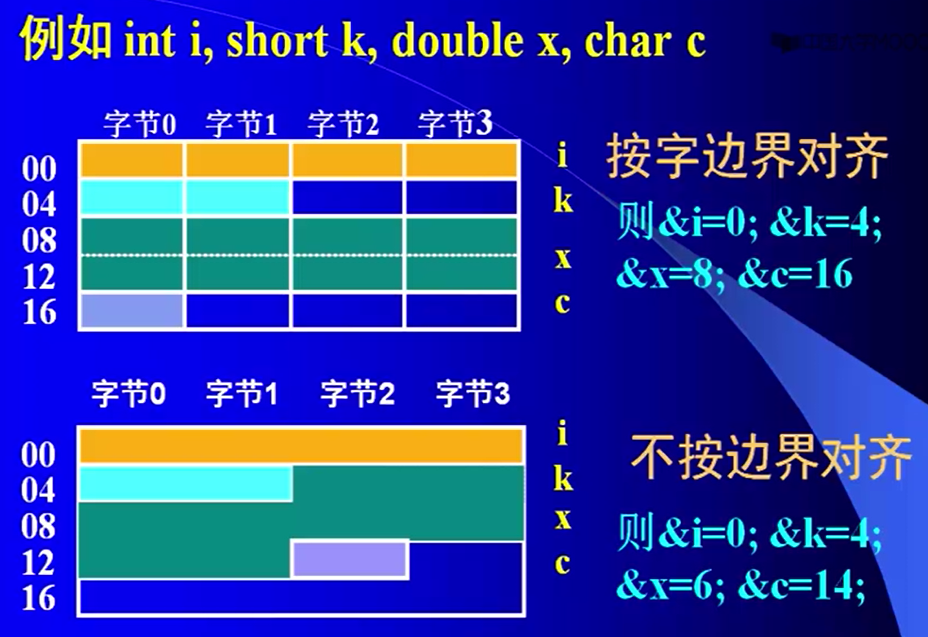

___
计算机组成原理知识点梳理
===
参考资料：计算机组成原理（电子科技大学）MOOC   
2020.09.26  
符燚
***

<!-- TOC -->

- [1. 概述](#1-概述)
    - [1.1. 层次结构](#11-层次结构)
    - [1.2. 性能指标](#12-性能指标)
    - [1.3. 浮点数](#13-浮点数)
    - [1.4. 字符表示](#14-字符表示)
    - [1.5. 数据处理与存储](#15-数据处理与存储)

<!-- /TOC -->

# 1. 概述
## 1.1. 层次结构
* 输入设备、输出设备、运算器、控制器、存储器
* CPU主要由运算器、控制器等部件组成
    * 运算器。功能：算数和逻辑运算。主要由ALU（算术逻辑单元）构成。ALU以全加器为核心
    * 控制器。指令信息、状态信息、时序信息
* 存储器：存储数据和数字化后的程序
* 输入/输出设备
* 总线：数据总线、地址总线、控制总线
* 接口
* 典型架构：南北桥架构、多处理器架构（紧密耦合型多机系统、松散耦合型多机系统）、集群式架构
## 1.2. 性能指标
* 基本字长：指一次数据操作的基本位数。影响计算的精度、指令的功能
* 运算的速度
    * 外频：系统时钟频率，一般不超过300MHz。之后一般会经过频率放大
    * CPU的主频=外频*倍频系数
    * IPS：每秒执行指令数
    * CPI：执行一条指令所需的时钟周期数
    * FLOPS：每秒执行浮点运算的次数
* 数据传输率
    * 带宽：单位时间的数据传输量  
    =（位宽*工作频率）/8    B/S
* 存储器的容量
    * 主（内存）存容量：可编址的存储单元个数（取决于地址码位数）* 存储单元的位宽（表明编址单位）。
    * 外存容量：指存储器能存储的最大数据量。与地址总线码的位数无关
## 1.3. 浮点数
* IEEE754格式为例
* 32位浮点数（单精度）  
    |S|E|M|
    |:---:|:---:|:---:|
    |31|30-23|22-0|
    * S=浮点数的符号位，0表示正数，1表示负数
    * E=阶码，8位，采用移码表示（偏移2^7-1=127），阶符隐含
    * M=尾数，23位，纯小数表示，其**真值=1+M**
* 64位长浮点数（双精度）
    |S|E|M|
    |:---:|:---:|:---:|
    |63|62-52|51-0|
    * E=阶码，11位，采用移码表示（偏移2^10-1），阶符隐含
    * M=尾数，52位，纯小数表示
* 补充
    * 为了确保浮点数表示的唯一性，约定0<=M<1；
    * E位为全0且M非全0：非规范浮点数（E偏移126），则其值为=(-1)^S * M * 2^(E-126)
    * E为全0且M为全0：表示浮点数0
    * 1<=E<=254：数是规范浮点数（E偏移127），则：其值为=(-1)^S * (1+M) * 2^(E-127)
    * E为全1（255）：M为全0，则其值为=正负无穷大；M为非全0，代码无效（NaN）
    > 关于规范浮点数和非规范浮点数。  
    [计算机处理非规范浮点数效率低的实验](http://cenalulu.github.io/linux/about-denormalized-float-number/)
    * 十进制数20.59375转换为IEEE754  
    对应的二进制：10100.10011  
    移动小数点为：1.010010011 * 2^4  
    符号位S=0，阶码E=4+127=131，尾数M=010010011  
    最后得到：
        |S|E|M|
        |---:|:---:|:---|
        |0|100,0001,1|010,0100,1100,0000,0000,0000|
## 1.4. 字符表示
* ASCII码：128个字符。  
存储：7b(代码宽度)+1b(奇偶校验位)
* 汉字码：输入码（拼音输入、五笔输入）、内码（GBK、GB2312-80）、字模码（宋体、黑体）
## 1.5. 数据处理与存储
* 逻辑移位：数码位置变化（没有符号位）
* 算数移位：符号位不变，数码位置变化
* 正数补码/原码移位规则
    * 数符不变：单符号位--符号位不变，双符号位--第一符号位不变
    * 空位补0（右移时第二符号位移至尾数最高位）
* 负数补码移位
    * 数码符号位不变：单符号位--符号位不变，双符号位--第一符号位不变
    * 左移空位补0
    * 右移空位补1
* 数位扩展与压缩
    * 符号扩展：直接把符号位（0/1）填充到扩展位
    * 0-扩展：高位均为0
    * 位数压缩：弃高位、留低位
* 数据存储（按字节编址）
    * 小端模式：小地址单元存储数据的低位（即尾端）
    * 大端模式：大地址单元存储数据的低位（即尾端）
* 数据字的对齐
    * 按边界对齐（假定存储字的宽度为32位，按字节编码，字节长32位）。  
    字地址：4的倍数（低两位为0）；半字地址：2的倍数（低位为0）；字节地址：任意
    * 不按边界对齐
      
    > 按边界对齐的访存次数更低（访存次数指访问字地址的次数 如上图分别是1+1+2+1=5次和1+1+3+1=6次）