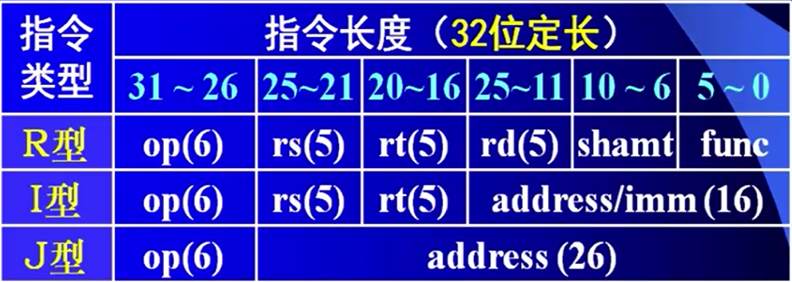
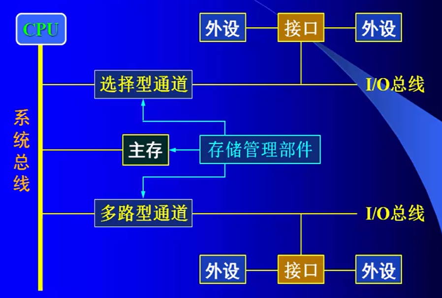
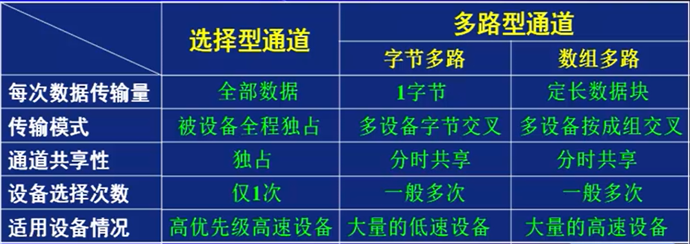
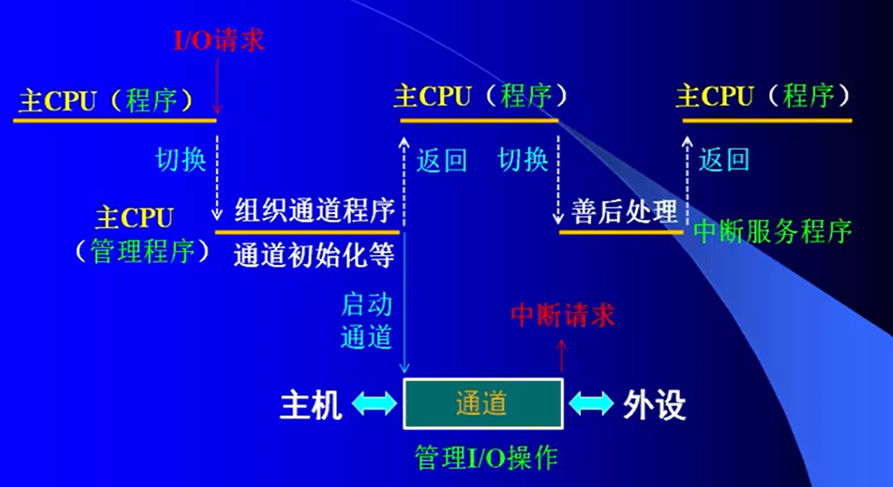

___
计算机组成原理知识点梳理
===
参考资料：计算机组成原理（电子科技大学）MOOC   
2020.09.26  
符燚
***

<!-- TOC -->

- [1. 概述](#1-概述)
    - [1.1. 层次结构](#11-层次结构)
    - [1.2. 性能指标](#12-性能指标)
    - [1.3. 浮点数](#13-浮点数)
    - [1.4. 字符表示](#14-字符表示)
    - [1.5. 数据处理与存储](#15-数据处理与存储)
    - [1.6. 基本运算](#16-基本运算)
        - [1.6.1. 补码](#161-补码)
        - [1.6.2. 溢出判断](#162-溢出判断)
        - [1.6.3. 使用补码移码原码进行整数浮点数的加减乘除，搁置了~](#163-使用补码移码原码进行整数浮点数的加减乘除搁置了)
    - [1.7. 数据校验](#17-数据校验)
        - [1.7.1. 奇偶校验](#171-奇偶校验)
        - [1.7.2. 汉明校验](#172-汉明校验)
        - [1.7.3. 循环冗余校验（CRC）](#173-循环冗余校验crc)
- [2. CPU子系统](#2-cpu子系统)
    - [2.1. 寄存器组（堆）](#21-寄存器组堆)
        - [2.1.1. 通用寄存器](#211-通用寄存器)
        - [2.1.2. 暂存器](#212-暂存器)
        - [2.1.3. 指令寄存器（IR）](#213-指令寄存器ir)
        - [2.1.4. 程序计数器（PC）](#214-程序计数器pc)
        - [2.1.5. 程序状态字寄存器（PSW）](#215-程序状态字寄存器psw)
        - [2.1.6. 地址寄存器（MAR）](#216-地址寄存器mar)
        - [2.1.7. 数据缓冲寄存器（MBR）](#217-数据缓冲寄存器mbr)
        - [2.1.8. 堆栈指针（SP）](#218-堆栈指针sp)
    - [2.2. 时序部件](#22-时序部件)
    - [2.3. CPU的工作原理](#23-cpu的工作原理)
        - [2.3.1. 主要功能](#231-主要功能)
        - [2.3.2. 执行指令的流程](#232-执行指令的流程)
        - [2.3.3. 部件的控制方式](#233-部件的控制方式)
    - [2.4. 外部连接与I/O控制任务](#24-外部连接与io控制任务)
        - [2.4.1. 外部连接任务](#241-外部连接任务)
        - [2.4.2. I/O控制模式](#242-io控制模式)
    - [2.5 指令系统](#25-指令系统)
        - [2.5.1. 指令集类型](#251-指令集类型)
        - [2.5.2. 指令格式](#252-指令格式)
        - [2.5.3. 指令的寻址方式](#253-指令的寻址方式)
        - [2.5.4. 指令的功能和类型](#254-指令的功能和类型)
    - [2.6 CPU的性能提升](#26-cpu的性能提升)
        - [2.6.1. 单周期CPU特性](#261-单周期cpu特性)
        - [2.6.2. 流水技术](#262-流水技术)
        - [2.6.3. SMT与超线程](#263-smt与超线程)
        - [2.6.4. 多核技术](#264-多核技术)
- [3. 存储子系统](#3-存储子系统)
    - [3.1. 层次结构](#31-层次结构)
    - [3.2. 物理存储器与虚拟存储器](#32-物理存储器与虚拟存储器)
    - [3.3. 存储器的分类](#33-存储器的分类)
        - [3.3.1. 存储介质的分类](#331-存储介质的分类)
        - [3.3.2 存取方式的分类](#332-存取方式的分类)
    - [3.4. 存储器的技术指标](#34-存储器的技术指标)
    - [3.5. 高性能存储器](#35-高性能存储器)
        - [3.5.1. 双端口存储器](#351-双端口存储器)
        - [3.5.2. 并行存储系统](#352-并行存储系统)
        - [3.5.3. 相联（联想）存储器](#353-相联联想存储器)
- [4. 总线与I/O子系统](#4-总线与io子系统)
    - [4.1. I/O接口的分类](#41-io接口的分类)
        - [4.1.1. 按数据的传送格式划分](#411-按数据的传送格式划分)
        - [4.1.2. 按时序控制方式划分](#412-按时序控制方式划分)
        - [4.1.3. 按I/O操作的控制方式](#413-按io操作的控制方式)
    - [4.2. 总线BUS](#42-总线bus)
        - [4.2.1. 总线的分类](#421-总线的分类)
        - [4.2.2. 总线的标准](#422-总线的标准)
        - [4.2.3. 总线设计要素](#423-总线设计要素)
        - [4.2.4. PCI总线](#424-pci总线)
    - [4.3. 直接程序传送方式与接口](#43-直接程序传送方式与接口)
    - [4.4. 中断方式与接口](#44-中断方式与接口)
        - [4.4.1. 中断](#441-中断)
        - [4.4.2. 中断系统的软硬件组织](#442-中断系统的软硬件组织)
        - [4.4.3. 中断方式的分类](#443-中断方式的分类)
        - [4.4.4. 中断请求优先级](#444-中断请求优先级)
        - [4.4.5. CPU对中断的响应](#445-cpu对中断的响应)
        - [4.4.6. 中断接口模型](#446-中断接口模型)
    - [4.5. DMA及其接口](#45-dma及其接口)
    - [4.6. IOP与PPU模式](#46-iop与ppu模式)

<!-- /TOC -->

# 1. 概述
## 1.1. 层次结构
* 输入设备、输出设备、运算器、控制器、存储器
* CPU主要由运算器、控制器等部件组成
    * 运算器。功能：算数和逻辑运算。主要由ALU（算术逻辑单元）构成。ALU以全加器为核心
    * 控制器。指令信息、状态信息、时序信息
* 存储器：存储数据和数字化后的程序
* 输入/输出设备
* 总线：数据总线、地址总线、控制总线
* 接口
* 典型架构：南北桥架构、多处理器架构（紧密耦合型多机系统、松散耦合型多机系统）、集群式架构
## 1.2. 性能指标
* 基本字长：指一次数据操作的基本位数。影响计算的精度、指令的功能
* 运算的速度
    * 外频：系统时钟频率，一般不超过300MHz。之后一般会经过频率放大
    * CPU的主频=外频*倍频系数
    * IPS：每秒执行指令数
    * CPI：执行一条指令所需的时钟周期数
    * FLOPS：每秒执行浮点运算的次数
* 数据传输率
    * 带宽：单位时间的数据传输量  
    =（位宽*工作频率）/8 B/S
* 存储器的容量
    * 主（内存）存容量：可编址的存储单元个数（取决于地址码位数）* 存储单元的位宽（表明编址单位）。
    * 外存容量：指存储器能存储的最大数据量。与地址总线码的位数无关
## 1.3. 浮点数
* IEEE754格式为例
* 32位浮点数（单精度）  
    |S|E|M|
    |:---:|:---:|:---:|
    |31|30-23|22-0|
    * S=浮点数的符号位，0表示正数，1表示负数
    * E=阶码，8位，采用移码表示（偏移2^7-1=127），阶符隐含
    * M=尾数，23位，纯小数表示，其**真值=1+M**
* 64位长浮点数（双精度）
    |S|E|M|
    |:---:|:---:|:---:|
    |63|62-52|51-0|
    * E=阶码，11位，采用移码表示（偏移2^10-1），阶符隐含
    * M=尾数，52位，纯小数表示
* 补充
    * 为了确保浮点数表示的唯一性，约定0<=M<1；
    * E位为全0且M非全0：非规范浮点数（E偏移126），则其值为=(-1)^S * M * 2^(E-126)
    * E为全0且M为全0：表示浮点数0
    * 1<=E<=254：数是规范浮点数（E偏移127），则：其值为=(-1)^S * (1+M) * 2^(E-127)
    * E为全1（255）：M为全0，则其值为=正负无穷大；M为非全0，代码无效（NaN）
    > 关于规范浮点数和非规范浮点数。  
    [计算机处理非规范浮点数效率低的实验](http://cenalulu.github.io/linux/about-denormalized-float-number/)
    * 十进制数20.59375转换为IEEE754  
    对应的二进制：10100.10011  
    移动小数点为：1.010010011 * 2^4  
    符号位S=0，阶码E=4+127=131，尾数M=010010011  
    最后得到：
        |S|E|M|
        |---:|:---:|:---|
        |0|100,0001,1|010,0100,1100,0000,0000,0000|
## 1.4. 字符表示
* ASCII码：128个字符。  
存储：7b(代码宽度)+1b(奇偶校验位)
* 汉字码：输入码（拼音输入、五笔输入）、内码（GBK、GB2312-80）、字模码（宋体、黑体）
## 1.5. 数据处理与存储
* 逻辑移位：数码位置变化（没有符号位）
* 算数移位：符号位不变，数码位置变化
* 正数补码/原码移位规则
    * 数符不变：单符号位--符号位不变，双符号位--第一符号位不变
    * 空位补0（右移时第二符号位移至尾数最高位）
* 负数补码移位
    * 数码符号位不变：单符号位--符号位不变，双符号位--第一符号位不变
    * 左移空位补0
    * 右移空位补1
* 数位扩展与压缩
    * 符号扩展：直接把符号位（0/1）填充到扩展位
    * 0-扩展：高位均为0
    * 位数压缩：弃高位、留低位
* 数据存储（按字节编址）
    * 小端模式：小地址单元存储数据的低位（即尾端）
    * 大端模式：大地址单元存储数据的低位（即尾端）
* 数据字的对齐
    * 按边界对齐（假定存储字的宽度为32位，按字节编码，字节长32位）。  
    字地址：4的倍数（低两位为0）；半字地址：2的倍数（低位为0）；字节地址：任意
    * 不按边界对齐
      
    > 按边界对齐的访存次数更低（访存次数指访问字地址的次数 如上图分别是1+1+2+1=5次和1+1+3+1=6次）
## 1.6. 基本运算
### 1.6.1. 补码
* X的补码=X+2^n。过程中以2^n为模，即除以2^n后取余
* (-Y)补也可表示为((Y补)变补)。变补：不论（Y补）是正还是负，连其符号位一起变反，末位加 1。(-Y)补也称Y补的机器负数
* (X+Y)补=X补+Y补
* (X-Y)补=X补+(-Y)补
* 补码和移码的关系：符号位相反、数值位相同
### 1.6.2. 溢出判断
* 结果的符号记为Sf，符号位的进位记为Cf，尾数最高位的进位记为C，加数A的符号记为Sa，加数B的符号记为Sb。*以!(Sf)表示Sf的非*
1. 溢出逻辑=(!Sa)(!Sb)Sf+SaSb(!Sf)
2. 溢出逻辑=Cf与C的异或
3. 溢出逻辑=Sf1与Sf2的异或（双符号位的情况：Sf1与Sf2表示结果中符号位的高位和低位）
* 溢出逻辑为1表示有溢出
### 1.6.3. 使用补码移码原码进行整数浮点数的加减乘除，搁置了~
## 1.7. 数据校验
### 1.7.1. 奇偶校验
* 增加一位校验位，使得1的个数是奇数或者偶数个
* 不能发现偶数位错误
* 无法定位错误
### 1.7.2. 汉明校验
* 是一种多重分组奇偶校验
* 能够检验是否出错，也能定位出错位
### 1.7.3. 循环冗余校验（CRC）
* 用待校验数据除以某个约定代码（生成多项式），能除尽则表明数据正确，否则通过循环移位校正出错位
* 生成多项式的最高位和最低位必须是1
* CRC码中任何一位出错，根据生成多项式得到的余数不全为0
* 不同位数发生错误，生成多项式得到的余数互不相同
* 余数继续做模2运算，应能使余数循环出现
* 生成多项式的例子：
    * CRC-4：10,011 ITU G.704
    * CRC-8：100,110,001 CCITT
    * CRC-16：10,001,000,000,100,001 CCITT
    * CRC-32：32、26、23、22、16、12、11、10、8、7、5、4、2、1、0位为1 IEEE
* CRC利用余数检错（仅一位出错时）
    * 余数为全0时，数据无措
    * 余数非全0时，数据有错，且余数与出错位存在一一对应关系。余数001对应最低位出错位
    * 相邻两个非0余数，对应的出错位也相邻
    * 任何一个非0余数，循环执行余数低位补0并重新计算余数，余数会循环出现，对应的出错位也在随之循环左移，循环周期T=2^n-1，n为余数的位数
* CRC纠错（仅一位出错时）
    * 始终将余数001作为出错位的定位依据
    * 每一步循环中，余数补0产生新的余数，数据需循环左移1位，以保持余数和出错位的对应关系。
    * 当余数001第一次出现时，将当前数据的最低位变反
    * 初始余数再次出现时，结束循环，刚好是T=2^n-1步
    * 无须定位出错位，仅通过一次码位变反和T次循环操作，即可纠正出错位
    * 一般不会试图纠正多位出错，代价太大
# 2. CPU子系统
* 主要部件有：时序系统、控制部件、缓存部件、寄存器（堆）、运算部件。通过数据/控制通路互连，实现信息交互
## 2.1. 寄存器组（堆）
* 存储各种用途的数据信息
* 一般用小容量的多端口存储器来构成寄存器组，其中一个存储单元为一个寄存器
### 2.1.1. 通用寄存器
* 多个
* 通用寄存器有全局唯一地址，可通过地址码访问，可在机器指令中直接使用
* 提供操作数、地址码、存放运算结果等
### 2.1.2. 暂存器
* 多个
* 内部专用，无需分配地址码，不能在机器指令中使用
* 用来暂存产生的临时数据，以备在后续操作中使用
### 2.1.3. 指令寄存器（IR）
* 只有一个
* 用于存放指令代码，从存储器（或者指令缓存）中读取到指令以后，就直接存入到指令寄存器
### 2.1.4. 程序计数器（PC）
* 仅一个
* 用来指明指令在存储器中存放位置，即存储单元的地址码
* 取指令结束后，PC保存的地址码自动修改，以指向下一条指令的存储单元，修改量取决于指令字长和存储器的编址单元
### 2.1.5. 程序状态字寄存器（PSW）
* 仅一个
* 记录现行程序的运行状态和程序的工作模式
* PSW——特征位
    * 也叫标志位，反映CPU的当前状态
    * 指令执行时，根据情况自动设置这些特征位，作为后续操作的判断依据，通常有5类
        |进位C|溢出V|零值Z|负值N|奇偶P|
        |:--:|:--:|:--:|:--:|:--:|
    * 自动设置这些标志位，具备该特征，就设置该标志位=1
* PSW——编程设定位
    * PSW中某些位或字段可通过程序来设定，以决定程序的调试、对中断的响应、程序的运行模式等
        |跟踪位T|允许中断I|程序优先级P|运行模式|
        |:--:|:--:|:--:|:--:|
    * 通过外部程序设定
### 2.1.6. 地址寄存器（MAR）
* 只有一个
* 读写存储器时，先要定位存储单元，因此设置MAR来存放目标单元的地址码。先将有效地址送入MAR，再启动后续的读写操作
### 2.1.7. 数据缓冲寄存器（MBR）
* 只有一个
* 过渡性的存放CPU和主存之间交换的数据
* 无论是从主存读取的数据，还是写入到主存的数据，都要经过MBR
### 2.1.8. 堆栈指针（SP）
* 仅一个
* 固定存放堆栈（存储器）的栈顶单元的地址码。根据这个地址码，去读写堆栈
## 2.2. 时序部件
* 低频震荡器->倍频逻辑->CPU时钟周期信号->机器周期信号->指令周期信号
* 指令周期包含若干（>=2）个机器周期。至少需要取指令和执行的阶段
* 机器周期至少包括1个时钟周期。如：取指令
## 2.3. CPU的工作原理
### 2.3.1. 主要功能
* 处理指令--控制指令的执行顺序
* 执行操作--产生控制信号控制部件工作
* 控制时间--控制各步操作的时序
* 数据运算--算数和逻辑运算
### 2.3.2. 执行指令的流程
* 读取指令--从存储器中读取
* 指令译码--通过控制器进行，产生控制信号
* 指令执行--寻址、取数、运算
* 后续工作--保存结果、响应外部请求等
### 2.3.3. 部件的控制方式
* 同步控制方式
    * 每步操作都向统一的外部时序信号对齐。都是靠外部时钟信号的驱动来实现协同
    * 各步操作之间无交互
* 异步控制方式
    * 各步操作都不需向统一的外部时序信号对齐
    * 各步操作之间通过交互应答来实现协同
## 2.4. 外部连接与I/O控制任务
### 2.4.1. 外部连接任务
* 单处理机系统：CPU通过前端总线与北桥芯片组连接
* 多处理机系统：高性能CPU中集中了主存、视频和PCI-E接口，CPU之间通过QPI、芯片组之间通过DMI总线相连
### 2.4.2. I/O控制模式
* 主机与外设之间进行数据输入/输出操作时，在不同的I/O控制模式下，CPU承担的任务各不相同
1. 程序传送模式：CPU直接执行I/O指令
2. 中断模式：CPU执行中断服务程序
3. DMA模式：CPU管理DMA控制器、善后处理（加密、解密、压缩等）
4. IOP和PPU模式：CPU组织I/O程序，管理IOP与PPU，以及善后处理
## 2.5 指令系统
* 指令（instruction）：计算机执行某类操作的信息的集合，是CPU工作的主要依据
* 指令集（instruction set）：处理器能执行的全体指令的集合（CISC、RISC）
    * 决定了计算机的硬件功能
    * 计算机中软硬件的分界面
* 指令字：用来表示指令的一组二进制代码
* 指令字长：指令中包含的二进制代码位数
* 机器字长：计算机能够直接处理的二进制数据的位数（=寄存器的宽度）
### 2.5.1. 指令集类型
* CISC
    * 复杂指令集计算（Complex Instruction Set Computing）
    * 早期的计算机部件昂贵、速度慢，为了扩展硬件功能，不得不将更多更复杂的指令加入到指令系统中，以提高计算机的处理能力
    * 特点
        * 指令数量多
        * 指令长度可以不固定，指令格式和寻址方式多样
        * 很多指令会涉及存储器的读写操作，指令周期长
        * 一般在通用处理器中使用
* RISC
    * 精简指令集计算（Reduced Instruction Set Computing）
    * 直接通过硬件方式，而不是扩充指令来实现复杂功能，指令规模逐渐缩小，指令进一步简化
    * 特点
        * 指令数量少
        * 指令长度固定，指令格式和寻址方式种类也少
        * 一般只有少量指令（如取数/存数）才会读写存储器，其余指令只涉及CPU内部寄存器，指令周期短
        * 一般只是在高端服务器CPU中使用
* CISC的不足
    * 2-8规律：CISC中的不同指令使用频率悬殊  
    简单指令（约占20%）约占80%的使用频率，复杂指令（约占80%）只占大约20%的使用频率
    * 不利于VLSI（超大规模集成电路）工艺：为实现大量的复杂指令，控制逻辑极不规整，给VLSI工艺造成很大困难
    * 主存技术的发展：一般通过保存在控制存储器中的微程序来实现复杂指令，70年代后期使用DRAM（动态随机存取存储器）做主存，使主存和控制存储器的速度相当，因此很多复杂指令不必再用微程序来实现，可以用简单指令构成的子程序实现等效功能
### 2.5.2. 指令格式
* 指令的基本格式
    |操作码|地址码A/操作数D|
    |:-:|:-:|
    |1个|1个或几个|
* 指令字长
    * 定长指令格式：规整、便于控制
    * 变长指令格式：合理利用存储空间、提高取指令的效率，如超长指令集
* 操作码结构
    * 定长操作码：各指令的位置、位数固定
    * 扩展操作码：该指令的位置、位数不固定，根据需要变化（设置扩展标志）
    * 复合型操作码：操作码分为几段，每段表示一种二级操作
* 地址结构
    * 指令中提供的地址：地址偏移量/立即数或者寄存器编号
    * 指令中提供地址的方式
        * 显式地址方式：指令中明确指明地址码（直接/间接给出）
        * 隐式地址方式：地址码隐含约定，不在指令中出现
        * 使用隐式地址，可以减少指令中的地址数量，从而简化地址结构
* 常见的地址结构类型
    * 四地址结构指令
        |操作码|操作数地址A1|操作数地址A2|结果地址A3|下一条指令地址A4|
        |:-:|:-:|:-:|:-:|:-:|
        * 功能：A1与A2进行操作码指定的操作后，结果放入A3，并用PC寄存器指示下条指令的地址A4
        * 在RISC中很少使用
        * 通常会使用隐含的方式使用下一条指令的地址码
    * 三地址结构指令
        |操作码|操作数地址A1|操作数地址A2|结果地址A3|
        |:-:|:-:|:-:|:-:|
        * 功能：A1与A2进行操作码指定的操作后，结果放入A3，PC寄存器自动修改为指向下一条指令
        * 如：`ADD rd,rs,rt`
    * 二地址结构指令
        |操作码|目的地址A1|源地址A2|
        |:-:|:-:|:-:|
        * 功能：A1与A2进行操作码指定的操作，结果放入A1，PC寄存器自动修改为指向下一条指令
        * 如`ADD R1,R0`
    * 一地址结构指令
        |操作码|源/目的地址A1|
        |:-:|:-:|
        * 双操作数：将A1中的地址和隐含的PC中保存的地址码拼接，结果放入PC。其中的PC地址是通过操作码隐含约定的
        * 单操作数：A1进行操作码指定的操作，结果放入A1。PC寄存器自动修改为指向下一条指令
    * 零地址结构指令
        |操作码|
        |:-:|
        1. 用于处理机的特殊控制（如HLT、NOP）
        2. 针对隐含约定的寄存器。如返回指令：`RST`，隐含操作是将堆栈栈顶单元中的地址送入PC，同时修改堆栈指针寄存器中保存的地址码,使堆栈指针寄存器中的地址码始终指向堆栈的栈顶单元
* 操作数类型
    * 地址码数据：寄存器编号或者存储器地址，无符号整数
    * 数值型数据：定点数、浮点数等，一般用补码表示
    * 字符型数据：通常表示为ASCII码/汉字内码表示
    * 逻辑型数据：常规二进制数据，不具备数值含义
* MIPS32架构的指令格式
    * RISC
    * 指令字长：32位
    * 寄存器数量：32个
    
    > R型(register format)：寄存器型  
    > I型(immediate format)：立即数型  
    > J型(jump format)：跳转型  
    > op：操作码
### 2.5.3. 指令的寻址方式
* 指形成操作数地址或寻找操作数的方式
* 立即寻址：指令中直接包含了操作数
    * 定长格式：`操作码+……+立即数`。数在指令中，其长度固定，位数少
    * 变长格式：`基本操作`  +  `立即数`。数在基本指令后，其长度可与指令等长
    * 常通过立即数来提供偏移量、常数、设置初值等
* 直接寻址：指令中直接给出操作数的地址码
    * 给出存储单元地址（数据在主存中）、或者给出寄存器编号（数据在寄存器中）
    * 主存直接寻址（绝对地址）
        * 定长格式：`操作码+……+有效地址`。有效地址位置有限，限制访存范围
        * 变长格式：`基本操作`  +  `有效地址`。有效地址的位数可等于指令字长，覆盖整个存储空间
    * 寄存器直接寻址
* 间接寻址：指令给出操作数的间接地址
    * 给出存储单元地址、或者给出寄存器编号，访问它们，得到其中地址码，根据地址码访问存储器，得到操作数。数据均在存储器中
    * 一般在CISC中使用，RISC中一般不用
    * 主存间接寻址：`操作码+间接地址`，间接地址是主存单元地址，主存单元中的是操作码的主存单元地址
    * 寄存器间接寻址：`操作码+寄存器号`。修改寄存器的内容比主存快，所以应用频率更高。寄存器可近似指针，可以指向不同的存储单元
    * 堆栈间接寻址：`操作码+堆栈指针SP`。
* 变址、基址寻址及其变化
    * 变址寻址：指令给出一个寄存器号和一个地址量，寄存器内容（偏移地址）和地址量之和为有效地址
    * 基址寻址：指令给出一个寄存器号和一个地址量，寄存器内容（基址地址）和地址量之和为有效地址（二维数组的读写）
    * 变址和基址的区别：有效地址=寄存器内容+指令中的立即数。变址寻址中，指令提供基准量，寄存器提供偏移量；基址寻址中，指令提供偏移量，寄存器提供基准量
    * 基址+变址：指令给出两个寄存器号和一个地址量，寄存器内容与地址量之和为有效地址（处理三维数组）
* PC相对寻址：指令给出偏移量，PC当前值与偏移量相加得到有效地址
    * PC指程序计数器，是隐含指定的
    * 可看作是一种特殊的基址寻址方式
    * 有效地址相对于PC浮动，编程方便
* 页面寻址（伪直接寻址）：指令给出位移量，PC的高位部分与位移量**拼接**，形成有效地址。
    * 给出的位移量即为低位地址
    * 寻址速度快，适用于组织程序模块，能够有效利用存储空间
* 指令中的存储方式的约定方式
    * 操作码可隐含说明不同寻址方式
    * 指令中可设置寻址方式字段。
### 2.5.4. 指令的功能和类型
* 设计指令时需要考虑
    * 按指令格式：单、双操作数指令等
    * 按操作数寻址方式：RR型（寄存器-寄存器）、RX型（寄存器-变址寄存器）……
    * 按指令功能：传送、访存、I/O、算术逻辑运算、程序控制、处理机控制等指令
* 数据传送类指令
    * 将源地址对应的存储单元中的数据放入目的地址对应的存储单元
    * 主要包括：取数指令、存数指令、数据传送（单字、成组）、数据交换和堆栈操作等
    * 主要用来实现寄存器之间、存储单元之间以及寄存器-存储器单元的数据传送
    * 设计传送指令需要考虑：规定传送范围、指明传送单位、设置寻址方式
* 输入输出(I/O)指令
    * 主机和外部设备之间信息的交互      
    * I/O指令对设备的适应性。如何使I/O指令实现对各种具体设备的控制？
        * I/O指令中留有扩展余地：指令中某些字段事先不定义，需要时再约定其含义，用于各种外设种类、数量不多的场合
        * 把设备抽象化、透明化处理：接口中设置控制/状态/数据寄存器
    * 主机对外设的寻址方式。寻找I/O接口中寄存器的方式，该类寄存器的编号，也称I/O端口的地址。如何为I/O端口分配地址？
        * 单独编制。I/O单元的地址系统和主存单元的地址系统是独立的
        * 统一编制。I/O单元的地址码和主存单元的地址码是不同的
    * I/O指令的设计思路
        * 设计专用的I/O指令（显式I/O指令）：针对端口自行单独编址，用I/O指令访问I/O端口。指令中说明I/O类型，并给出端口地址
        * 用传送指令替代I/O指令（隐式I/O指令）：针对端口和主存统一编址，用访存指令访问I/O端口，故不必再设计专用的I/O指令
        * 设计IOP进行I/O操作控制。IOP指专用I/O的控制器，CPU不亲自进行I/O控制。设计两级的I/O指令；1、CPU控制IOP（如启动、停止等）；2、IOP控制具体的I/O操作（如保存等）
* 算术/逻辑运算指令
    * 算数运算指令：设计时需要考虑操作数类型、符号、进制等，运算结束后设置CPU相应状态标志寄存器
    * 逻辑运算指令：常用来对码位的设置和条件判断等操作
* 程序控制类指令
    * 主要用于控制指令的执行流程
    * 转移指令：无条件转移（操作码+转移地址）、条件转移（操作码+转移地址+转移条件）、循环（转移条件为循环计数值）等
    * 转子指令和返回指令
        * 转子：即调用，操作码+子程序入口
        * 返回：操作码+返回地址（堆栈的顶单元中）
        * 同一条返回指令应能提供多个不同的返回地址（条件返回），一般用堆栈存放返回地址
    * 软中断指令：早期用于程序的调制，现在常常用于系统功能调用。常用INT n的指令形式出现在程序中（n表示不同的功能号）。
* 控制处理机的专用指令：如CPU状态字标志位的清除、修改、空操作指令NOP、暂停HLT、等待WAIT，总线锁定LOCK
* 面向操作系统的指令：提供给操作系统专用，如访问系统寄存器、检查保护属性、存储管理等
## 2.6 CPU的性能提升
### 2.6.1. 单周期CPU特性
* 指令周期与时钟周期等长，且宽度较大
* 处理器的CPI（执行一条指令所需的时钟周期数）=1
* 在指令周期中，各种硬件资源均被相应的功能操作独占，不能共享，硬件利用率低
* 所有指令无论其实际执行时间长短，均分配较长的时钟周期，时间浪费严重
### 2.6.2. 流水技术
* 把指令过程分解为若干子过程，每个子过程都可有效的在其专用功能段上与其他子过程重叠执行，这种技术称为流水技术
* 流水线的子过程称为流水线的“级”或“段”，子过程的数目称为流水线的“流水深度”
* 每个子过程由专用的功能段实现，各功能段的时间应基本相同，通常为1个时钟周期（1拍）
* 流水线需要经过一定的通过时间才能稳定（即无空闲时间段）
* 流水技术适用于大量相同指令的执行
* 按流水线的处理层级
    * 操作部件级流水：把功能部件（如浮点加）细分成若干子功能段（求阶差、对阶、尾数加、规格化）。多条指令中该操作的不同子操作可在这些子功能段上流水执行
    * 指令级流水：把一条指令的执行分为若干子过程（如FT/DT/ET），多条指令的不同过程可以流水执行
    * 处理机级流水：把复杂任务细分成若干子任务（指令组）。多个任务的不同子任务可以在不同处理机上流水执行
* 按流水线能完成的功能数量
    * 单功能流水线
    * 多功能流水线：多功能流水线按同一时间内可连续完成的功能数量不同，可分为：
        * 静态多功能流水线：同一时刻只能连接成一种固定功能
        * 动态多功能流水线：同一时刻能连接成多种不同功能（控制复杂，很少使用）
* 按处理的数据形态
    * 标量流水线
    * 向量流水线
* 按流水线内各段的连接模式
    * 线性流水线（前馈型）
    * 非线性流水线（存在反馈连接）
* 按流水线输入输出对应关系
    * 顺序流水线（先进先出）
    * 乱序流水线（无序、错序或异步）
* 流水线的性能指标
    * 吞吐率：单位时间内处理的任务数或数据量
    * 加速比：同一程序，不采用流水的执行时间与采用流水的执行时间的比值
    * 利用率：流水线中各部件的平均利用率，即一定时间内，部件实际工作时间与部件总时间的比值
* 超标量流水线
    * 标量流水线：在每个时钟周期只发射一条指令，并要求每个时钟周期只从流水线流出一条指令的结果
    * 超标量流水线：是指在每个时钟周期向流水线发射多条指令，并能从流水线流出多个结果
* 超流水线技术：把完成一条指令的流水线的各一级子过程进一步细分为若干二级子过程（=超流水的度、深度）
* 超标量超流水线处理技术：同时使用超流水线和超标量技术
### 2.6.3. SMT与超线程
* SMT（Simultaneous Multithreading）：同步多线程。使CPU能够执行分别来自多个线程的指令（一种硬件多线程技术）。
* 实现了在一颗CPU上同时硬件级的并行执行多个程序的指令，如一核二线程
### 2.6.4. 多核技术
* 多核处理器也称片上多处理器，主要特征是在一个处理器芯片上集成多个CPU内核
* 多核的必要性：通过提高单核CPU主频、IPS的手段已无潜力
* 多核的种类
    * 原生多核：各内核独立
    * 封装多核：各内核共享前端总线/不完全独立
# 3. 存储子系统
## 3.1. 层次结构
存储系统的层次结构：Cache、主存、外存
* 主存（内存）：主要存放CPU当前使用的指令和数据
    * 能随机访问，工作速度快，有足够的存储容量
    * 存储运行期指令/数据，确保CPU能快速读取
* 辅存（外存）：存储大量的后备程序和数据
    * 速度较慢，容量较大
    * 确保计算机具有足够大的存储容量，确保数据能够脱机保存
* 高速缓冲存储器（Cache）：存放CPU在当前一小段时间内多次使用的程序和数据，以缓解CPU和主存的速度差异
    * 速度非常快，容量非常小（集成在CPU中，需要考虑CPU的功耗和集成度。通常只有几M）
    * 强化CPU快速读取指令和数据的速度
* Cache与内存
    * 以数据块为单位整体操作
        * 直接映射：Cache分块不分组，主存既分块，也分组（每组的块数=Cache的块数）。主存的每一个数据块，只能映射到与其组内序号相同的Cache数据块位置
        * 全相联映射：Cache分块不分组，主存分块不分组。主存的任何一个块都可以映射到Cache的任何一个数据块位置上
        * 组相联映射：Cache既分块，也分组；主存既分块，也分组（组内块数=Cache组数）。主存数据块，映射到组序号与自己组内块序号相同的Cache分组，可占据Cache该分组中的任意数据块位置
    * 常用的替换算法
        * 最不经常使用（LFU-Least Frequently Used）：将一段时间内被访问次数最少的那块从Cache中置换出去
        * 近期最久未使用（LRU-Least Recently Used）：将近期内最久未被访问过的Cache块置换出去
        * 随机替换：随机确定将哪块从Cache中替换出去
    * Cache的写操作：当CPU发出写请求时，如果Cache命中，可以
        * Cache单元与主存单元同时写，使Cache和主存保持一致，称为通写
        * 只修改Cache单元，并用标志将该块加以注明，直到该块从Cache中替换出来时才一次性写入主存，称为回写
    * Cache的读操作
        * 旁路式读：CPU向Cache和主存同时发读命令和地址，Cache命中，则Cache回送数据并中断读主存命令；Cache未命中，则直接访问主存读取数据
        * 通过式读：CPU首先向Cache发读命令和地址，Cache命中，则从Cache中读取数据；Cache未命中，再将读命令和地址传给主存并读主存
* 内存和外存
    * 虚拟存储：在内存和外存之间，由操作系统存储管理模块及相关硬件（存储器管理部件）实现的一种存储映射技术。页式、段式、段页式
    * 访问主存时，使用实地址码（物理地址）。访问外存，如磁盘时，寻址方式通常需要盘号、圆柱面、磁头号、扇区号、字节序号。为了进行数据交换，操作系统通过对磁盘进行虚拟化得到虚拟存储器（通过虚地址码访问）（虚拟存储器存储近期需要交互的数据），虚拟存储器和主存就通过直接硬件进行虚实地址映射。
    * 逻辑上能提供比物理存储器更大的虚拟存储空间，相关地址称为虚拟地址或逻辑地址
    * 映射地址的基本方式：在两者之间，增加关联表
        * 内存、虚存都分成页：页表
        * 内存、虚存都分成段：段表
        * 内存、虚存都分成段，每段再分页：段页表
    * 页式虚拟存储管理：主存和外存统一分页后进行管理
        * 页表：记录虚地址页号与实地址页号的对应关系，即虚页面调入主存时被安排在主存的位置（实页号）。页表的每一行，称为页表项
        * 快表（TLB）：把活跃的页表项用高速存储器单独存储，访问速度更快，它是页表的子集
    * 段式虚拟存储器管理
        * 虚存中的程序分段（按照代码段、数据段和共享段等）进行管理
        * 为了将虚拟地址变换成主存实地址，操作系统创建1个段表
        * 每段在段表中都占有一登记项，内容包括：段号、段起点、段长、装入点等
    * 段页式虚拟存储管理
        * 每个程序按逻辑模块分段，每段再分页，页面大小与内存页面大小相同
        * 操作系统创建两张表：段表、页表
            * 虚地址格式：段号+页号+页内地址
            * 实地址格式：页号+页内地址
        * 经过两次查表才能完成地址转换，速度较慢
## 3.2. 物理存储器与虚拟存储器
* 物理存储器：物理形态上真实存在的存储器，简称为实存，其地址称为物理地址或实地址
* 虚拟存储器：虚拟存储器是一个逻辑模型，并非物理存在，基于物理存储器并靠硬件+操作系统的映射来实现。内存和外存之间由于不同的存储结构，就需要通过虚拟存储技术进行数据的交互。逻辑上能提供比物理存储器更大的虚拟存储空间，相关地址称为虚地址或逻辑地址
## 3.3. 存储器的分类
### 3.3.1. 存储介质的分类
* 半导体存储器
    * 静态存储器：利用双稳态触发器的两个稳定状态存储信息，信息易失
        * 主要包括：双极性、静态MOS
        * 依靠双稳态电路内部交叉反馈机制存储信息
        * 功耗较大、速度快，常用作Cache
    * 动态存储器：依靠电容上的电荷暂存信息
        * 主要包括：动态MOS型等
        * 依靠电容存储电荷的原理存储信息
        * 功耗较小、容量大、速度较快，常用作主存
* 磁表面存储器：利用磁层上不同方向的磁化区域表示信息，容量大，非破坏性读出，长期保存信息，速度慢，适合用于外存
* 光盘存储器：利用光斑的有无/晶相等变化表示信息，容量很大，非破坏性读出，长期保存信息，速度慢，适合用于外存
### 3.3.2 存取方式的分类
* 随机存取存储器（RAM，ROM）
    * 随机存取：按地址访问存储器中的任一单元，访问时间与存储单元的地址无关
    * RAM（随机存储器）：可读可写。如主存
    * ROM（只读存储器）：只读型。如微程序控制器中的控制存储器（CM）
        * 固化型：用户不能写入数据
        * PROM：用户可写入一次
        * EPROM：可多次编程（紫外线擦除）
        * EEPROM：可多次写入（电擦除）
    * 闪存（FLASH Memory）：电擦除，可多次写入。如U盘
    * 速度指标：频率-存取周期或读/写周期（ns）
* 顺序存取存储器（SAM）
    * 访问时读/写部件按顺序查找目标地址，访问时间与数据的存储位置有关。如磁带机、电影胶片。
    * 需要进行两步操作：定位操作；数据读/写操作
    * 速度指标：平均定位时间（ms）；数据传输率（b/s）
* 直接存取存储器（DAM）
    * 访问时读/写部件先粗定位一个小区域，再在该区域内顺序查找
    * 访问时间与数据的位置有关。例如：硬盘
    * 三步操作：定位（寻道）操作、等待（旋转）操作，读/写操作
    * 速度指标：平均定位（平均寻道）时间（ms），平均等待（平均旋转）时间（ms），数据传输率（b/s）
## 3.4. 存储器的技术指标
* 存取时间：从存储器收到读写命令，到存储器读出（写入）信息所需要的时间
* 存取周期：存储器做连续访问操作过程中一次完整的存取操作所需的总时间。存取周期=存取时间+恢复期
* 数据传输率：单位时间内存取信息的数据量，也叫带宽或频宽。数据传输率=存储器的位宽/存取周期（bps）
## 3.5. 高性能存储器
### 3.5.1. 双端口存储器
* 主存速度与CPU处理速度存在差异：低速主存无法为CPU提供快速服务。如需同时需要用访问2个主存单元时，更限制了CPU高速处理信息能力的发挥
* 双端口存储器：同一个存储器具有两组独立的读写控制线路，两个端口分别具有各自的地址线、数据线，可进行独立的存取操作
* 无冲突读写控制：当两个端口地址不同时，在两个端口上进行读写，不会发生冲突，可同时进行读写。
* 有冲突读写控制：当两个端口同时存取同一个存储单元时，会发生端口间的读写冲突。设置BUSY标志，采用仲裁逻辑，由芯片上的判断逻辑决定由哪个端口优先进行读写操作，而暂时关闭另一个被延迟的端口
### 3.5.2. 并行存储系统
* 单体多字并行存储器：只有一个存储体，但每一个编址单元都对应多个存储体。每次读取存储器都可以得到多个数据字，这多个数据字通过多路选择器输出。
* 多体交叉并行存储器
    * 顺序编制方式
        * 有多个容量相同的独立存储模块（分体号）
        * 模块中的存储单元，依次分配连续的地址码
        * 地址格式=分体号+体内地址
        * 顺序访问地址连续的存储单元时，只能单模块工作（模块串行），其他模块处于空闲状态
        * 某个模块发生故障时，一般也不会影响其他模块的正常工作，存储器容错性好
        * 通过增加存储分体的数量，来扩展存储器容量比较方便，存储器扩展性好
        * 模块之间是按照串行方式工作的，使存储器的带宽受到限制
    * 交叉编址方式
        * 有多个容量相同的独立存储模块（分体号）
        * 连续地址被依次分配到不同模块中的存储单元
        * 地址格式=体内地址+分体号
        * 特点：存取周期不变时，流水式并行访存能提高带宽
### 3.5.3. 相联（联想）存储器
* 根据存储单元中所存内容的一部分作为检索项（即关键字项），去检索存储器，并对存储器中与该检索项符合的存储单元内容进行读出或写入
* 根据存储的内容进行寻址
* 寻址字段叫做关键字
* 存储的内容：关键字+数据，其中关键字是地址，数据则是被读写的信息
* 联想存储器主要用于存放需要快速查找的内容。如：虚拟存储器中存放的段表、页表和快表等；在高速缓冲存储器中，相联存储器作为存放Cache的行地址之用
# 4. 总线与I/O子系统
* 总线（bus）：一种用来连接各功能部件并承担部分之间信息传送任务的信息公共通路。分为数据总线、地址总线、控制总线
* I/O接口：主机与外设的衔接部分，位于总线与外围设备之间。基本功能有：
    * 设备寻址：接收CPU送来的地址码，选择接口中的寄存器供CPU访问
    * 数据缓冲：实现主机与外设的速度匹配，缓冲深度与传送的数据量有关
    * 预处理功能：串并格式转换（串口）、数据通路宽度转换（并口）、高低电平转换
    * 控制逻辑功能：接收主机CPU的控制命令，保存状态信息，协助主机实现对I/O传送操作的控制
* 对接口中寄存器编址
    * 单独编址：为接口中的每个寄存器（I/O端口）分配独立的端口地址（可与主存地址重叠）。需设置标志区分访问的对象，如M/IO。用专用的I/O指令（显式I/O指令）实现I/O操作
    * 与主存统一编址：把接口中的寄存器（I/O端口）当成特殊的主存单元，并与其他主存单元统一编址。I/O端口地址将占据主存的部分地址空间。编址的基本原则：低端端口分配给主存单元，高端端口分配给I/O端口
## 4.1. I/O接口的分类
### 4.1.1. 按数据的传送格式划分
* 并行接口
    * 接口两侧均并行传输数据
    * 适用于设备本身并行工作，距主机较近的场合
* 串行接口
    * 接口和外围设备一侧串行传输
    * 适合用于设备本身串行工作，或距主机较远，或需减少传送线的情况
### 4.1.2. 按时序控制方式划分
* 同步接口：接口与系统总线的信息传送采用同步方式控制（时钟信号触发）
* 异步接口：接口与系统总线的信息传送采用异步方式控制（信息的交互）
### 4.1.3. 按I/O操作的控制方式
* PIO接口（Programed I/O，程控方式）：需要CPU执行操作程序执行输入输出的操作控制
* 中断接口（可采用查询方式）：主机通过执行中断服务程序执行输入输出控制
* DMA接口（可插入中断做DMA善后处理）：直接存储器操作
* IOP/PPU接口（专用处理器/机方式）
## 4.2. 总线BUS
* 一种用来连接各功能部件并承担部件之间信息传送任务的公共信息通道
* 总线的特性
    * 物理特性：几何尺寸、形状、引脚数、排列等
    * 功能特性：规定信号线的功能
    * 电气特性：信号电平、电平范围
    * 时间特性：何时有效、持续时间、时序约定
* 单总线结构：是部件之间信息交互的唯一通路。竞争激烈、响应慢。现在的系统很少使用这种单总线结构
* 多总线结构：有多组总线，分摊负载，传输效率高。现在的系统，普遍使用多总线结构
* 周期
    * 时钟周期：CPU一步操作（1次内部数据通路传送）时间
    * 总线周期：经过总线的一次数据传送（访存）时间，通常包含若干时钟周期
    * 工作周期：指令周期中一个操作阶段。可包括多个总线周期
### 4.2.1. 总线的分类
* 按功能分类：内总线（芯片内）、局部总线（板卡内）、系统总线（计算机内）、外总线（多机集群）
* 按数据传送格式分：并行总线、串行总线
* 按时序控制方式分：同步总线、异步总线
### 4.2.2. 总线的标准
* 为何要制定总线标准
    * 为了使不同部件都连接到总线上，并与之交互通信，就必须制定公共的技术规范
    * 便于灵活的组成计算机系统
    * 采用总线技术的好处
        * 技术工程角度：简化硬件设计、易于扩充
        * 从用户的角度：具有“易获得性”
        * 从厂商的角度：易于批量生产、降低成本
* 总线标准包括
    * 机械结构规范：约定模块尺寸、形状、引脚数及位置等
    * 功能规范；约定引脚的名称和功能、相互作用时应准寻的协议及工作过程等
    * 电气规范：约定引脚工作时的有效电平、转换时间、负载能力、额定值和最大值等
* 常见的总线标准
    * QPI：常用于多机系统中，用来连接两个CPU，在两个CPU之间进行数据的通信
    * DMI：用来连接CPU和芯片组之间的通信也称直接媒体接口
    * PCI、ISA、EISA、SCSI、USB等
### 4.2.3. 总线设计要素
* 总线宽度（总线各功能组中的信号线的数量，32或64）和频率（每秒数据传输的次数，33M、66M、133M）
* 带宽：BW=总线频率 * 总线位宽 * 工作模式 * 通道数 * 编码方式/8  （Bps）
* 总线周期与操作过程
    * 总线周期：通过总线完成一次完整数据传输的时间
    * 主设备：申请并掌握总线权限的设备
    * 从设备：与主设备对应的设备
    * 总线操作的基本步骤
        * 主设备申请总线，仲裁器裁决并批准
        * 主设备掌握总线，启动总线周期，初始化
        * 从设备响应，主从设备之间数据传输
        * 主设备释放总线，结束总线周期
* 总线上的数据传输模式
    * 单周期模式：传输特点：申请一次，只分配一个总线周期，只传输一次数据
    * 突发模式：申请一次，分配多个总线周期，可传输多个数据字
* 总线的时序和控制
    * 同步总线
        * 由统一的时序信号控制总线上的传送操作
        * 在固定时钟周期内完成传送，由同步脉冲定时打入
    * 异步总线
        * 无固定的时钟周期划分
        * 总线周期的长短由传送的实际需要决定
        * 以异步应答方式控制总线传送操作
    * 扩展的同步总线
        * 以时钟周期为时序基础，允许总线周期中时钟数可变
        * 同步中引入了异步应答思想
* 仲裁方式
    * 当多个主设备提出总线控制请求时，一般采用优先级或公平策略进行仲裁
    * 按照总线仲裁电路的位置不同，仲裁方式分为
        * 集中式仲裁：每个模块有两条线连到中央请求器。一条是送往仲裁器的总线请求（BR）信号线，一条是仲裁器送出的总线授权（BG）信号线。
        > 常用的三种仲裁方式
        >* 链式查询：总线授权信号被依次串行的传送到所连接的外围设备上进行比较。离总线控制器的逻辑距离决定，越近优先级越高
        >* 计数器定时查询：当查询计数器计数值与发出请求的设备编号一致时，终止查询，该设备获得总线控制权。优先级灵活，计数器初值、设备编号可通过程序设定，优先次序可用程序控制
        >* 独立请求查询：各设备均通过专用请求信号线与仲裁器相连，且通过独立的授权信号线接收总线批准信息
        * 分布（散）式仲裁：设备需要控制总线时，发请求信号，并监听其它请求信号，各设备能辨别自己的优先级，以及能否在下一周期控制总线
        >* 缺点：信号线复杂
        >* 优点：防止总线时间浪费
### 4.2.4. PCI总线
* 外围组件互连（PCI，Peripheral Component Interconnect）
* 一种高性能32/64位同步总线，地址信号和数据信号复用，可扩展至64位
* PCI总线可以在主板上和其它总线（如ISA，USB等）相连（桥接器，芯片组等），以适应高、低速外围设备
* PCI总线的信号组成
    * 必备信号
        * 系统信号
        * 地址和数据信号
        * 接口控制信号
        * 仲裁信号
        * 错误报告信号
    * 可选信号
        * 中断请求信号
        * 高速缓存支持信号
        * 64位总线扩展信号
        * JTAG边界扫描信号
* PCI总线的仲裁：采用独立请求的集中式总线仲裁
## 4.3. 直接程序传送方式与接口
* 主CPU执行I/O程序实现主-外的数据I/O
* 需要专用的I/O程序
* 主机CPU执行I/O程序，不断查询外设状态，进而控制具体的数据I/O过程（主机<-->外设）
* 数据I/O过程中主CPU无法执行其它计算任务，对其它外设的请求响应慢
* 主CPU完全束缚于简单的数据I/O控制，利用率低
* 优点：硬件开销小
* 缺点：实时处理能力差，并行程度低
* 应用场景：I/O效率要求不高，数据量少，如外设的诊断或调试
## 4.4. 中断方式与接口
### 4.4.1. 中断
* 中断：当程序运行过程中，如果发生某种随机事态，CPU暂停当前程序（被中断），转而执行该事态对应的服务程序，结束后再恢复原程序的执行。程序切换+随机性
* 实质
    * 中断的实质就是程序切换
    * 方法：保存断点，保护现场；回复现场，返回断点
    * 时间：**一条指令结束时切换**。保证程序的完整性
* 特点：随机性
    * 随机发生的事态（按键、故障）
    * 有意调用，随机请求与处理的事态（调用打印机）
    * 随机插入的事态（软中断指令插入程序任何位置）
* 中断与子程序切换的区别
    * 子程序的执行是由程序员事先安排，而中断服务程序的执行则是由随机中断事件触发
    * 子程序的执行受主程序或上层程序控制，而中断服务程序一般与被中断的现行程序无关
    * 一般不存在同时调用多个子程序，但可能发生多个外设同时向CPU发出中断服务请求的情况
* 中断的典型应用
    * 管理中低速I/O操作，实现主-外并行工作
    * 以软中断方式来处理系统调用，如读写磁盘
    * 故障处理
    * 实时处理：对各事件已足够快的速度进行处理，并在允许的时间尺度内做出反应
    * 人机对话
    * 多机通信
* 中断向量：中断服务程序的入口地址+状态字PSW
* 中断向量表：用来存放中断向量的表（一段存储区）
* 向量地址：用来访问向量表的地址（也叫中断指针）
### 4.4.2. 中断系统的软硬件组织
* 软件：中断服务程序、中断向量表
* 硬件
    * 接口；请求、屏蔽、传递、判优等逻辑
    * CPU：对中断请求的响应逻辑
* 组织中断
    1. 列出系统中的各种中断请求。如外部中断源（通信中断、硬盘、打印机等）、内部中断源（掉电、溢出等）
    2. 为各中断源编制中断服务程序
    3. 将中断服务程序的入口地址写入中断向量表
### 4.4.3. 中断方式的分类
* 硬件中断与软中断
    * 硬中断：由硬件请求信号引发的中断。如按下键盘
    * 软中断：由软件触发的中断
* 内中断与外中断
    * 内中断：中断源来自主机内部
    * 外中断：中断源来自主机外部
* 强迫中断与自愿中断
    * 强迫中断：由故障和外部源引起，非程序中的安排
    * 自愿中断：自中断或软中断，在程序中有意安排的
* 可屏蔽中断与非屏蔽中断
    * 可屏蔽中断：可以通过屏蔽子屏蔽该类请求，关中断时不响应该类请求
    * 非屏蔽中断：该类请求与屏蔽字无关，请求的响应与开/关中断无关
* 向量中断与非向量中断
    * 向量中断：由硬件方式来确定服务程序入口地址
    * 非向量中断：由软件查询确定服务程序入口地址
### 4.4.4. 中断请求优先级
* 中断源优先级顺序的安排：故障>DMA>外部设备引起的中断。基本原则：高速操作优先于低速操作，输入优先于输出
* CPU当前程序与外设请求的判优
    * 先查询CPU的允许中断标志（PAW字段）
    * 再分析当前程序的优先级（PSW字段）
    * 如果现行程序的优先级小于外设请求优先级，响应；若大于等于外设请求优先级，不响应
* 多个中断请求之间的判优
    * 软件判优
        * 由程序查询顺序确定优先级
        * 可灵活修改优先级
    * 硬件判优
        * 例如：通过中断控制器判优
### 4.4.5. CPU对中断的响应
* 响应条件
    * 有未被屏蔽中断请求到达
    * CPU处于开中断模式
    * 中断源的优先级比当前程序的优先级更高
    * CPU刚执行完一条指令（非停机指令）
* 形成中断服务程序的入口地址
    * 非向量中断（通过程序）：将所有中断源的中断服务程序入口地址组织在公共查询程序中，CPU响应时执行此查询程序，确定中断源对应的服务程序地址
    * 向量中断（通过硬件）：将所有中断源的中断服务程序入口地址（中断向量）组织在中断向量表中；CPU响应时由硬件产生向量地址，据此查询中断向量表确定服务程序入口地址
* 在响应过程、保存现场、恢复现场（如PSW寄存器）等关键阶段，应关中断响应以防止被打扰，因为中断可能会使其出错。在操作完成后再打开中断
### 4.4.6. 中断接口模型
* 组成（寄存器级）
    * 寄存器选择：对接口中的寄存器寻址
    * 命令字寄存器：接收CPU发向外设的命令字，转换为相应操作命令送外设
    * 状态字寄存器：反映设备和接口的各种运行状态，用代码表示状态
    * 数据缓冲器：传送数据，实现缓冲
    * 控制逻辑：请求信号产生逻辑、电平转换逻辑、串并转换逻辑（串口）、扩展中断源数量
    * 公用中断控制器：接收外设请求、屏蔽、判优、送出公共请求；接收CPU的中断批准，送出中断号（中断类型码/中断源的编号）
* 工作过程（外中断）
    1. 初始化：设置工作方式，送屏蔽字，分配中断类型码
    2. 发启动命令（送命令字），启动设备
    3. 设备就绪，申请中断
    4. 中断控制器汇集各请求，经屏蔽、判优，形成中断号，向CPU发出INT（中断请求信号）
    5. CPU响应，发批准INTA
    6. 中断控制器收到INTA，发送中断号
    7. CPU执行中断隐指令（关中断，保护现场等）操作，准备执行服务程序
## 4.5. DMA及其接口
* DMA（Direct Memory Access）：直接依靠硬件系统来控制主存与外设之间的数据传送，传送期间无需CPU干预，传送结束后通常用中断方式通知CPU（相较于中断方式：中断方式需要执行程序，而DMA直接依靠硬件）
* 特点
    * 响应随机请求
    * 一般不影响CPU程序的执行，仅占用总线，**无程序切换**
    * 大批量数据的简单传送
* 应用
    * 主存与高速I/O设备之间的简单数据传送
    * 大批量数据采集系统
    * 动态存储器（DRAM）的自动刷新
* DMA的数据传送模式
    * 单字传送：DMA请求获得批准后，CPU分配一个总线周期用于字或字节的传送，再重新分配下一个总线周期的控制权（周期挪用/窃取）
    * 成组连续传送方式：DMA被批准后，连续占用多个总线周期，成组连续批量地传送，结束后将总线的控制权交回给CPU
* DMA方式应明确：传送方向、设备寻址信息、主存缓冲区首地址、传送的数据量等
* DMA初始化工作
    1. 向接口送出I/O设备的寻址信息
    2. 向DMA控制器送出控制字，如传送方向
    3. 向DMA控制器送出主存缓冲区首地址
    4. 向DMA控制器送出传送的数据量
* DMA控制器功能
    * 接收初始化信息（地址、传送方向、主存首地址、交换量）
    * 接收外设DMA请求、判优、向CPU申请总线--传送前
    * 接管总线控制权，发出寻址，读写命令--I/O期间
* 接口功能
    * 接收初始化信息（外设寻址信息）
    * 向DMA控制器发请求--传送前，外设准备好
    * 通过总线进行数据I/O
## 4.6. IOP与PPU模式
* IOP（I/O Processor），即输入输出处理器
* PPU（Peripheral Processor Unit），外围处理单元
* 技术背景
    * 高性能计算机系统中，要求能支持多种不同速度的设备，以适应多种I/O吞吐率
    * 普通DMA控制器，只能支持少量同类设备，灵活性不高，不能满足要求
    * 把主机CPU从繁杂的I/O控制中解放出来
* 基本思路：在主机CPU外，再增设专用的I/O处理单元
    * 受主机CPU控制
    * 可独立执行程序（指令），以控制更复杂的I/O操作
    * 较好的对多种设备的适应性
    * 可与主机CPU并行工作
* 通道：一种典型的IOP模式
    
    * 选择型通道（单路）：可同时连接多个外设，但每次只能选择1个设备工作，该设备的I/O操作完成后，再切换设备
    * 多路型通道
        * 字节多路型
            * 可连接多路外设，每个通路仅连接一个外设
            * 每次只能选择1路设备进行I/O操作
            * 每次只传输1个字节，重新选择通路（外设）
        * 数组多路型
            * 可连接多路外设，每个通路仅连接一个外设
            * 每次只能选择1路设备进行I/O操作
            * 每次连接传输多个字节（即定长数据块）后，重新选择通路（外设）
        * 通道的特性对比    
        
        * 通道的执行流程
        
* IOP的特点
    * 能执行简单的通道程序（通道指令）
    * 一般位于主机之外，逻辑上仍属于主机系统的一部分
* PPU的特点
    * 有独立的指令系统，指令丰富，功能比IOP更强大
    * 能执行算数/逻辑运算、读写主存、管理I/O操作等
    * 独立于主机系统，可以是个完整的计算机系统