___
计算机网络知识点梳理
===
参考资料：计算机网络（哈尔滨工业大学：李全龙、聂兰顺）MOOC   
2020.04.17  
符燚
***

<!-- TOC -->

- [1. 基础](#1-基础)
    - [1.1. 计算机网络结构](#11-计算机网络结构)
    - [1.2. 应用模型：](#12-应用模型)
        - [1.2.1. 客户/服务器应用模型](#121-客户服务器应用模型)
        - [1.2.2. 对等应用模型（P2P）](#122-对等应用模型p2p)
    - [1.3. 交换设备与交换网络](#13-交换设备与交换网络)
    - [1.4. 多路复用技术](#14-多路复用技术)
    - [1.5. 性能](#15-性能)
        - [1.5.1. 速率](#151-速率)
        - [1.5.2. 带宽](#152-带宽)
        - [1.5.3. 时延](#153-时延)
        - [1.5.4. 时延带宽积](#154-时延带宽积)
        - [1.5.5. 丢包](#155-丢包)
        - [1.5.6. 吞吐量(率)](#156-吞吐量率)
    - [1.6. 计算机网络的体系结构](#16-计算机网络的体系结构)
    - [1.7. 协议](#17-协议)
    - [1.8. OSI-RM](#18-osi-rm)
        - [1.8.1. 物理层](#181-物理层)
        - [1.8.2. 数据链路层](#182-数据链路层)
        - [1.8.3. 网络层](#183-网络层)
        - [1.8.4. 传输层](#184-传输层)
        - [1.8.5. 会话层](#185-会话层)
        - [1.8.6. 表示层](#186-表示层)
        - [1.8.7. 应用层](#187-应用层)
    - [1.9. TCP/IP参考模型](#19-tcpip参考模型)
        - [1.10. 五层参考模型](#110-五层参考模型)
- [2.应用层](#2应用层)
    - [2.1. 网络应用的体系结构](#21-网络应用的体系结构)
    - [2.2. 网络应用的通信](#22-网络应用的通信)
    - [2.3. Web应用](#23-web应用)
    - [2.4. Email应用](#24-email应用)
    - [2.5. DNS应用](#25-dns应用)
    - [2.6. P2P应用](#26-p2p应用)
    - [2.7. Socket编程](#27-socket编程)
        - [2.7.1. 套接字API中定义的地址结构](#271-套接字api中定义的地址结构)
        - [2.7.2. Socket API函数](#272-socket-api函数)
- [3.传输层](#3传输层)
    - [3.1. 多路复用/分用](#31-多路复用分用)
        - [3.1.1. 分用](#311-分用)
        - [3.1.2. 复用](#312-复用)
    - [3.2. UDP协议](#32-udp协议)
    - [3.3. 可靠数据传输](#33-可靠数据传输)
        - [3.3.1. Rdt 2.0](#331-rdt-20)
        - [3.3.2. Rdt 2.1](#332-rdt-21)
        - [3.3.3. Rdt 2.2](#333-rdt-22)
        - [3.3.4. Rdt 3.0](#334-rdt-30)
        - [3.3.4. 流水线机制（滑动窗口协议）](#334-流水线机制滑动窗口协议)
            - [3.3.4.1. GBN](#3341-gbn)
            - [3.3.4.2. SR](#3342-sr)
    - [3.4. TCP协议](#34-tcp协议)
        - [3.4.1. TCP段结构](#341-tcp段结构)
        - [3.4.2. 可靠数据传输](#342-可靠数据传输)
        - [3.4.3. TCP流量控制](#343-tcp流量控制)
        - [3.4.4. TCP连接管理](#344-tcp连接管理)
    - [3.5. 拥塞控制](#35-拥塞控制)
        - [3.5.1. 拥塞的代价](#351-拥塞的代价)
        - [3.5.2. 控制方式](#352-控制方式)
        - [3.5.3. TCP拥塞控制](#353-tcp拥塞控制)
        - [3.5.4. 公平性](#354-公平性)
    - [4. 网络层](#4-网络层)
    - [4.1. IPv4](#41-ipv4)
        - [4.1.1. IP数据报格式](#411-ip数据报格式)
        - [4.1.2. IP分片](#412-ip分片)
        - [4.1.3. IP编址](#413-ip编址)
        - [4.1.4. 子网划分](#414-子网划分)
    - [4.2. CIDR](#42-cidr)
    - [4.3. DHCP](#43-dhcp)
    - [4.4. NAT](#44-nat)
    - [4.5. ICMP](#45-icmp)
    - [4.6. IPv6](#46-ipv6)

<!-- /TOC -->


# 1. 基础

## 1.1. 计算机网络结构
网络边缘(主机、网络应用)、接入网络(有线或无线通信链路)、网络核心(路由器网络。关键功能：路由加转发)  
## 1.2. 应用模型：
### 1.2.1. 客户/服务器应用模型
客户发送请求，接收服务器响应。主动发起通信的为客户端。所有的服务都在客户和服务器之间进行。
### 1.2.2. 对等应用模型（P2P）
可以没有专用服务器，没有客户/服务器的区分。通信在对等的实体之间直接进行
## 1.3. 交换设备与交换网络   
电路交换、报文交换、分组交换。  
* 报文交换：多个路由节点间串行，相对较慢；路由器缓存需求大
* 分组交换：多个路由节点间并行，相对较快；路由器缓存需求小；统计多路复用，相比于电路交换，可以允许更多用户同时使用网络，适用于突发数据传输网络；可能产生拥塞现象（分组延迟或丢失）
* 电路交换：资源占用
## 1.4. 多路复用技术
频分、时分、波分、码分、统计多路复用
## 1.5. 性能
### 1.5.1. 速率
单位时间（秒）传输信息（比特）量  
b/s(bps)、kb/s、Mb/s……  
这里的k=10^3、M=10^6……
### 1.5.2. 带宽
网络中的带宽通常指数字信道所能传送的“最高数据率”，单位为b/s（bps）
### 1.5.3. 时延
* 节点处理延迟：差错检测、确定输出链路
* 排队延迟：等待输出链路可用，取决于路由器的拥塞程度
* 传输延迟：分组长度、链路带宽
* 传播延迟；物理链路长度、信号传播速度
### 1.5.4. 时延带宽积
时延带宽积=**传播**延迟*带宽  
意义：这个链路上能容纳多少个比特  
又称为以比特为单位的链路长度  
### 1.5.5. 丢包
路由器的可用缓存满了，到达的分组被丢弃（丢包）。可由前序节点或源重发（或不重发）  
丢包率=丢包数/已发分组总数
### 1.5.6. 吞吐量(率)
发送端与接收端之间传送数据速率（b/s）  
* 即时吞吐量：给定时刻的速率
* 平均吞吐量：一段时间的平均速率  
端到端的吞吐量取决于链路中最小的带宽
## 1.6. 计算机网络的体系结构  
计算机网络的体系结构是从功能上描述计算机网络结构，而不是从物理上。  
计算机网络体系结构是一个分层结构。 
## 1.7. 协议  
* 协议的的三要素：语法、语义、时序  
* 协议是控制两个对等实体进行通信的规则的集合，协议是“水平的”
## 1.8. OSI-RM
目的是支持异构网络系统的互联互通，理论成功

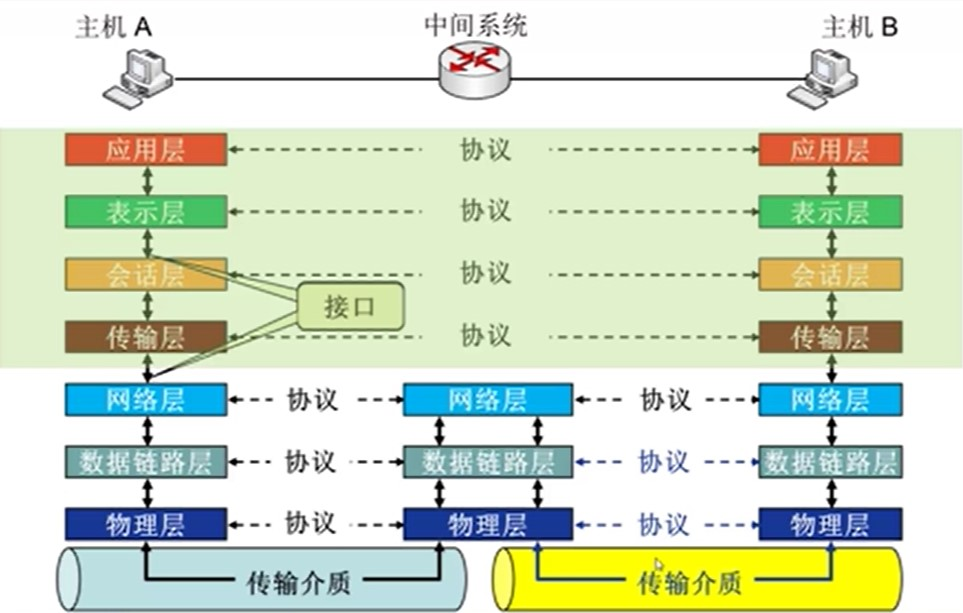
* 7+3模型：端系统7层，中间系统3层   
* 七层：物理层、数据链路层、网络层、传输层、会话层、表示层、应用层  
* 四类原语：请求、指示、响应、确认
> + 请求(Request): 由服务用户发往服务提供者，请求它完成某项工作，用于高层向低层请求某种业务。  
> + 指示(Indication): 用于提供业务的层向高层报告一个与特定业务相关的动作，由服务提供者发往服务用户，指示发生了某些事件  
> + 响应(Response): 用于应答，表示来自高层的指示原语已收到，由服务用户发往服务提供者，对前面发生的指示的响应  
> + 确认(Confirmation): 用于提供业务的层证实某个动作已经完成，由服务提供者发往服务用户，对前面发生的请求的证实 
* 控制信息：每层增加控制信息  
在头部(数据链路层头尾都有)增加构造协议数据单元(PDU)
> + 地址  
> + 差错检测编码  
> + 协议控制：优先级、服务质量、安全控制等  
### 1.8.1. 物理层
* 接口特性：机械特性、电气特性、功能特性、规程特性  
* 比特编码
* 数据率（传输速率）
* 比特同步：时钟同步
* 传输模式：单工、半双工、双工
### 1.8.2. 数据链路层
负责结点-结点数据传输，以帧为单位  
* **物理**寻址(不能跨越网络)
* 差错控制
* 流量控制：匹配发送方与接收方的发送速度与接受速度，避免淹没接收端  
* 接入(访问)控制：决定哪个设备具有链路(物理介质)的控制使用权  
### 1.8.3. 网络层
负责源主机到目的主机数据分组交付
* **逻辑**寻址：全局唯一逻辑地址，确保数据分组被送到目的主机，如IP地址
* 路由：路由器互联网络；路径选择
* 分组转发
### 1.8.4. 传输层
负责源-目的(端-端)(**进程间**)完整报文传输  
* 报文的分段与重组
* SAP寻址：确保将完整报文提交给正确进程，如端口号
* 端到端的连接控制：端到端连接的建立、维护和清除。这是一种逻辑链接
* 端到端的流量控制：匹配数据的发送、接受速度问题  
* 差错控制：从端系统的角度引入差错控制、纠正机制等
### 1.8.5. 会话层
* 对话控制：建立、维护、拆除
* 同步：在数据流中插入“同步点”
* 最“薄”的一层
### 1.8.6. 表示层
处理两个系统间交换信息的语法和语义问题
* 数据表示转化：转换为主机独立的编码
* 加密/解密
* 压缩/解压缩
### 1.8.7. 应用层
支持用户通过用户代理(如浏览器)或网络接口使用网络(或服务)  
典型的应用层服务：文件传输(FTP)、电子邮件(SMTP)、Web(HTTP)  
## 1.9. TCP/IP参考模型
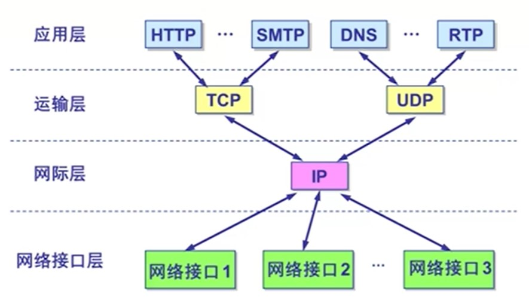  
* IP可为各式各样的应用程序提供服务(Everything over IP)
* IP可应用到各式各样的网络上(IP over Everything)
* 网络接口层要求：只要能封装IP分组，将IP分组从一点传输到另一点就可，无其他限制  

### 1.10. 五层参考模型
* 物理层：比特传输
* 数据链路层：相邻网络元素(主机、交换机、路由器等)的数据传输  
以太网、802.11(WiFi)、PPP
* 网络层：源主机到目的主机的数据分组路由与转发  
IP协议、路由协议等
* 传输层：进程-进程的数据传输  
TCP、UDP
* 应用层：支持各种网络应用  
FTP、SMTP、HTTP  
>综合OSI与TCP/IP的优点：结构清晰与易用性  

# 2.应用层

## 2.1. 网络应用的体系结构
**1. 客户机/服务器结构（Client-Server,C/S）**
> 服务器  
> * 7*24小时提供服务  
> * 永久性访问地址/域名
> * 利用大量服务器实现可扩展性

> 客户机
> * 与服务器通信，使用服务区提供的服务
> * 间歇性接入网络
> * 可能使用动态的IP地址
> * 不会与其他客户机直接通信  

**2. 点对点结构（Peer-to-Peer,P2P）**
> * 没有永远在线的服务器  
> * 任意端系统/节点之间可以直接通讯  
> * 节点间歇性接入网络  
> * 节点可能改变IP地址  
* 优点：高度可伸缩
* 缺点：难于管理

**3. 混合结构（Hybrid）**
## 2.2. 网络应用的通信
* 进程间通信利用socket(套接字)发送/接受消息实现。传输基础设施向进程提供API  

* 寻址进程：
> * IP地址：寻址主机
> * 端口号/Port number：为主机上每个需要通信的进程分配一个端口号
> * 进程的标识符：IP地址+端口号  
* 网络应用遵循应用层协议
> * 公开协议：以允许互操作；协议由RFC定义，由IETF维护。如HTTP等
> * 私有协议：多数P2P文件共享应用
* 应用层协议的内容
> * 消息的类型(type)：请求消息、响应消息
> * 消息的语法格式：消息中有哪些字段、每个字段如何描述
> * 字段的语义：字段中信息的含义
> * 规则：进程何时发送/响应消息
* 网络应用对传输服务的需求
> * 数据丢失/可靠性
> * 时间/延迟
> * 带宽
* TCP
> * 面向连接：客户机/服务器进程间需要建立连接  
> * 可靠的传输
> * 流量控制：发送方不会发送速度过快，超过接收方的处理能力
> * 拥塞控制：当网络负载过重时能够限制发送方的发送速度
> * 不提供时间/延迟保障
> * 不提供最小带宽保障
* UDP
> * 无连接
> * 不可靠的数据传输
> * 不提供可靠性保障、流量控制、拥塞控制、延迟保障、带宽保障

## 2.3. Web应用
对象的寻址：URL(统一资源定位器)  
'Scheme://host:port/path'(协议+主机地址+端口号+路径)

**HTTP(超文本传输协议)**
* C/S架构
* 使用TCP传输服务
* 无状态：服务器不维护任何有关客户端过去所发送请求的信息
* HTTP连接的两种类型
    * 非持久性连接  
    每个TCP连接最多允许传输一个对象，HTTP 1.0版本使用
    * 持久性连接  
    每个TCP允许传输多个对象，HTTP 1.1版本默认使用  
       * *无流水的持久性连接*：客户端只有在收到前一个响应后才发送新的请求
       * *带有流水机制的持久性连接(HTTP 1.1版本默认选项)*：客户端只要遇到一个引用对象就尽快发出请求
* HTTP协议的两类消息
    * 请求消息  
      * ASCII：人直接可读的
        > request line: method URL version  
        >
        > header lines：`//头部行`
        >>Host   
        >>User-agent  
        >>Connection  
        >>Accept-language  
        >>Entity Body  

        >例如：  
        >GET /somedir/page.html HTTP/1.1  
        >Host: www.someschool.edu  
        >User-agent: Mozilla/4.0  
        >Connection: close `//连接是否断开 `  
        >Accept-language: fr `//需要的语言`   

      * 上传输入的方法  
        > **GET**：获取网页。如果需要上传少量消息，可以放在URL字段里  
        > **POST**：把网页需要填写的数据放在消息体Entity Body里。  
        > **HEAD**：请Server不要将所请求的消息放在响应消息里  
        > **PUT**：将消息体中的文件上传到URL字段所指定的路径  
        > **DELETE**：删除URL字段所指定的文件  

    * 响应消息  
      * ASCII：人直接可读的
        >例如：  
        > status line : HTTP/1.1 200 OK  
        `//状态行//200 Ok是返回状态响应码`  
        >
        > header lines
        >> Connection： close   
        >> Date： Thu， 06 Aug 1998 12:00:15 GMT   
        >>`//生成时间`   
        >> Server： Apache/1.3.0 (Unix)  
        >> Last-Modified： Mon，22 Jun 1998 …...  
        >>`//修改时间`  
        >> Content-Length： 6821  
        >> Content-Type： text/html  
        > 
        > data data data data data ...  
    
      * 响应状态码  
        > 200 OK  
        > 301 Moved Permanently  
        > 400 Bad Request  
        > 404 Not Found  
        > 505 HTTP Version Not Supported  
* Cookie技术
    * 某些网站为了辨别用户身份、进行session跟踪而储存在用户本地终端上的数据（通常经过加密）
    * 组件  
        * HTTP响应消息的cookie头部行
        * HTTP请求消息的cookie头部行
        * 保存在客户端主机上的cookie文件，由浏览器管理
        * Web服务器端的后台数据库

**Web缓存/代理服务器技术**
* 在不访问服务器的前提下满足客户端的HTTP请求
* 性能优化的技术  
    * 缩短客户请求的响应时间
    * 减少机构/组织的流量
    * 在大范围内（Internet）实现有效的内容分发
* HTTP中的条件性GET方法(解决缓存的Web对象是否与远端服务器一致的问题)
    >目标：如果缓存有最新的版本，则不需要发送请求对象  
    >缓存：在HTTP请求消息中声明所持有版本的日期  
    > `If-modified-since:<data>`  
    >服务器：如果缓存的版本是最新的，则响应消息中不包含对象  
    > `HTTP/1.0 304 Not Modified`

## 2.4. Email应用
* SMTP协议：Email消息的传输/交换协议
    * 使用TCP进行Email消息的可靠传输  
    * 端口25
    * 传输过程：握手、消息的传输、关闭  
    * 命令/响应交互模式
        * 命令：ASCII文本
        * 响应：状态代码和语句
    * Email消息只能包含7位ASCII码  
    * 使用持久性连接  
* MIME：多媒体邮件扩展
    * 通过在邮件头部增加额外的行以声明MIME的内容格式
    ```
    Form: alice@crepes.fr
    To: bob@hamburger.edu
    Subject: Picture of yummy crepe.
    MIME-Version: 1.0
    Content-Transfer-Encoding: base64
    Content-Type: image/jpeg

    base64 encoded data …………
    ………………………………………………………………
    …………base64 encoded data
    ```
* 邮件访问协议：从服务器获取邮件
    * POP：认证/授权（客户端<-->服务器）和下载（POP3是无状态的协议）
        * 认证过程
            >客户端命令  
            > * User：声明用户名  
            > * Pass：声明密码  

            >服务器响应
            > * +OK
            > * -ERR
        * 事务阶段  
            > * List；列出消息数量
            > * Retr：用编号获取消息
            > * Dele：删除消息
            > * Quit：退出
    * IMAP：更多功能、更加复杂、能够操纵服务器上存储的消息    
        * 所有消息统一保存在一个地方：服务器
        * 允许用户利用文件夹组织消息
        * 支持跨会话的用户状态（IMAP是有状态的协议）
            > * 文件夹的名字
            > * 文件夹与消息ID之间的映射等

    * HTTP：163，QQ Mail等

## 2.5. DNS应用
* 域名解析系统：Internet上主机/路由器的识别问题
    * 多层命名服务器构成的分布式数据库
        > 为什么不使用集中式的DNS
        > * 单点失败问题
        > * 流量问题
        > * 距离问题
        > * 维护性问题
        
        > 分布式层次式
        > * Root DNS Servers `//根域名服务器`
        > * com DNS servers、org DNS servers、 edu……………… `//顶级域名服务器`
        > * yahoo.com DNS servers、pbs.org DNS servers、poly.edu……………… `//权威域名服务器`

        > 本地域名解析服务器
        > * 不严格属于层级体系
        > * 每个ISP(网络服务提供商)有一个本地域名服务器
        > * 当主机进行DNS查询时，查询被发送到本地域名服务器

    * 应用层协议：完成名字的解析
    * Internet核心功能
* DNS服务
    * 域名向IP地址的翻译
    * 主机别名
    * 邮件服务器别名
    * 均衡负载
* DNS查询
    * 迭代查询：被查询服务器返回域名解析服务器的名字，本地域名解析服务器迭代查询每级域名服务器，之后将结果给主机。本地域名服务器发送域名请求消息多次
    * 递归查询：将域名解析的任务交给所联系的服务器，被联系主机又联系下一个域名服务器，查询后原路返回给主机本地域名服务器发送域名请求消息一次
* DNS记录缓存和更新
    * 只要域名解析服务器获得域名——IP映射，即缓存这一映射
        > * 一段时间后，缓存条目失效（删除）
        > * 本地域名服务器一般会缓存顶级域名服务器的映射（因此根域名服务器不经常被访问）
    * 记录的更新/通知机制
* DNS记录和消息格式
    * 资源记录格式：（name,value,type,ttl）  `//ttl指有效时间`
    * 类型
        > * Type=A  
            > Name：主机域名  
            > Value：IP地址
        > * Type=NS  
            > Name：域（edu.cn）  
            > Value：该域权威域名解析服务器的主机域名
        > * Type=CNAME  
            > Name：某一真实域名的别名  
            > Value：真实域名
        > * Type=MX  
            > Value是与name相对应的邮件服务器
* DNS协议与消息
    * 查询和回复
    * 消息格式相同
* 占用53号端口，同时支持TCP和UDP协议

## 2.6. P2P应用
* 搜索信息
    * P2P系统的索引：信息到节点位置（IP地址+端口号）的映射
        > 集中式索引：   
        > 节点加入时，通知中央服务器：IP地址、内容

        > 洪泛式查询：  
        > * 完全分布式架构  
        > * 每个节点对它共享的文件进行索引，且只对它共享的文件进行索引  
        > * 覆盖网络：  
            > 节点和节点间如果有TCP连接，那么构成一条边(边是虚拟链路；节点一般邻居少于10个)   
            > 所有的活动节点和边构成覆盖网络  
            >```
            >* 查询消息通过已有的TCP连接发送消息  
            >* 节点转发查询消息  
            >* 如果查询命中，则利用反向路径发回查询节点   
            >```   

        >层次式覆盖网络：  
        > * 介于集中式索引和洪泛式查询之间的方法
        > * 每个节点或者是一个超级节点，或者被分配一个超级节点  
            > 节点和超级节点间维持TCP连接  
            > 某些超级节点对之间维持TCP连接    
* 文件分发：如BitTorrent

## 2.7. Socket编程
* 应用编程接口（API）：就是应用进程的控制权和操作系统的控制权进行转换的一个系统调用接口
* 标识通信端口（对外）：IP地址+端口号 
* 端口号有16bit  
* 操作系统/进程管理套接字（对内）：套接字描述符
* 当应用程序创建套接字时，操作系统分配一个数据结构存储套接字相关信息，返回套接字描述符
### 2.7.1. 套接字API中定义的地址结构
```c
    struct sockaddr_in
    {
        u_char sin_len;//地址长度
        u_char sin_family;//地址族（TCP/IP：AF_INET）
        u_short sin_port;//端口号
        struct in_addr sin_addr;//IP地址
        char sin_zero[8];//未用（置0）
    }
```
使用TCP/IP协议簇的网络应用程序声明端点地址变量时，使用结构`sockaddr_in`
### 2.7.2. Socket API函数
* 以WinSock为例：
* **`WSAStartup`**：初始化Windows Sockets API  
    ```c
    int WSAStartup(WORD wVersionRequested,LPWSADATA IpWSAData)
    ```  
    * 使用Socket的应用程序在使用Socket之前必须首先调用`WSAStartup`函数
    * 第一个参数指明程序请求使用的WinSock版本，其中高位字节指明副版本、低位字节指明主版本。十六进制整数
        > 如0x102表示2.1版
    * 第二个参数返回实际的WinSock的版本信息，一个指向WSADATA结构的指针
    ```c
    wVersionRequested=MAKEWORD(2,1);
    err=WSAStartup(wVersionRequested,&wsaData);
    ```
* **`WSACleanup`**：释放所使用的Windows Sockets DLL
    ```c
    int WSACleanup (void);
    ```
    * 应用程序在完成对请求的Socket库的使用，最后要调用`WSACleanup`函数
    * 解除与Socket库的绑定，释放Socket库所占用的系统资源
* **`socket`**：创建套接字
    ```c
    sd=socket(protofamily,type,proto);
    ```
    * 操作系统返回套接字描述符（sd）
    * 第一个参数（协议族）： `protofamily=PF_INET` (TCP/IP)
    * 第二个参数（套接字类型）：`type=SOCK_STREAM,SOCK_DGRAM or SOCK_RAM` (TCP/IP)   
    `//SOCK_STREAM是流式套接字（面向TCP）；SOCK_DGRAM是数据报套接字（面向UDP）；SOCK_RAM是原始套接字（直接面向网络层）`
    * 第三个参数（协议号）：0为默认
    ```c
    struct protoent *p;
    p=getprotobyname("tcp");
    SOCKET sd=socket(PE_INET,SOCK_STREAM,p->p_proto);
    ```
* **`Closesocket`**
    ```c
    int closesocket(SOCKET sd);
    ```
    * 关闭一个描述符为sd的套接字
    * 在Windpws中是`closesocket()`，在Unix中是`close()`
    * 如果多个进程共享一个套接字，调用closesocket将套接字引用计数减1，减至0才关闭
    * 一个进程中的多线程对一个套接字的使用无计数（即该进程中一个线程调用closesocket将一个套接字关闭，该进程中的其他线程也将不能访问该套接字）
    * 返回值：  
    0：成功；  
    SOCKET-ERROR：失败
* **`bind`**：绑定套接字的本地端点地址
    ```c
    int bind(sd,localaddr,addrlen);
    ```
    * 参数：
        > 套接字描述符（sd）  
        > 端点地址（localaddr），结构是`sockaddr-in`
    * 客户端程序一般不必调用`bind`函数
    * 当服务器同时连接多个网络时，绑定端口地址不设一个具体的值，设为地址通配符：`INADDR_ANY`
* **`listen`**：置服务器端的流套接字处于监听状态
    ```c
    int listen(sd,queuesize);
    ```
    * 仅服务器端调用
    * 仅用于面向连接的流套接字
    * 设置连接请求队列大小（queuesize）
    * 返回值：  
    0：成功；  
    SOCKET-ERROR：失败
* **`connect`**
    ```c
    connect(sd,saddr,saddrlen);
    ```
    * 客户程序调用，使客户套接字（sd）与特定计算机的特定端口（saddr）的套接字（服务）进行连接
    * 仅用于客户端
    * 可用于TCP客户端（建立TCP连接）也可用于UDP客户端（指定服务器端点地址）
* **`accept`**
    ```c
    newsock=accept(sd,caddr,caddrlen);
    ```
    * 服务程序调用accept函数从处于监听状态的流套接字sd的客户连接请求队列中取出排在最前的一个客户请求，并且创建一个新的套接字来与客户套接字创建连接通道
    * 仅用于TCP套接字
    * 仅用于服务器
    * 利用新创建的套接字（newsock）与客户通信
* **`send`**：发送数据
    ```c
    send(sd,*buf,len,flags);
    ```
    * 用于TCP套接字（客户与服务器）或调用了`connect`函数的UDP客户端套接字
* **`sendto`**：发送数据报
    ```c
    sendto(sd,*buf,len,flags,destaddr,addrlen);
    ```
    * 用于UDP服务器端套接字与未调用`connect`函数的UDP客户端套接字
* **`recv`**：接收数据
    ```c
    recv(sd,*buffer,len,flags);
    ```
    * 从TCP连接的另一端接收数据，或者从调用了`connect`函数的UDP客户端套接字接收服务器发来的数据
* **`recvfrom`**：接收数据报
    ```c
    recvfrom(sd,*buf,len,flags,senderaddr,saddrlen);
    ```
    * 用于从UDP服务器端套接字与未调用`connect`函数的UDP客户端套接字接收对端数据
* **`setsockopt`**
    ```c
    int setsockopt(int sd,int level,int optname,*optval,int optlen);
    ```
    * 用来设置套接字sd的选项参数
* **`getsockopt`**
    ```c
    int setsockopt(int sd,int level,int optname,*optval,socklen_t *optlen);
    ```
    * 用于获取任意类型、任意状态套接口的选项当前值，并把结果存入optval
* **网络字节顺序与本地字节顺序的转换**  
    * `htons`：本地字节顺序->网络字节顺序（16bit）  
    * `ntohs`：网络字节顺序->本地字节顺序（16bit）  
    * `htonl`：本地字节顺序->网络字节顺序（32bit）  
    * `ntohl`：网络字节顺序->本地字节顺序（32bit） 
* **Socket API 调用基本流程** （WinSock、TCP）  
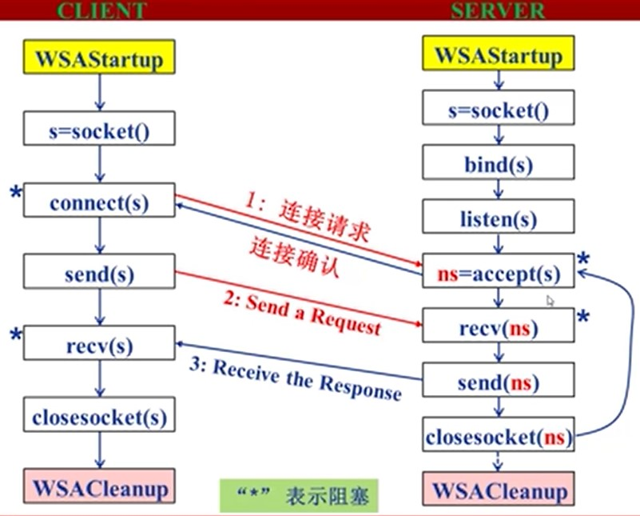  
* **解析服务器地址**
    * 客户端可能使用域名或IP地址标识服务器，而IP协议需要使用32位二进制IP地址，需要将域名或IP地址转换为32位IP地址
    * 函数`inet_addr()`实现点分十进制IP地址到32位IP地址转换
    * 函数`gethostbyname()`实现域名到32位IP地址转换
* **解析服务器（熟知）端口号**
    * `getservbyname()`：将服务名（如HTTP）转换为熟知端口号
* **解析协议号**
    * `getprotobyname()`:将协议名（如：TCP）转换为协议号（如：6）

# 3.传输层
传输层协议为运行在不同主机上的**进程**提供了一种逻辑通信机制
## 3.1. 多路复用/分用 
### 3.1.1. 分用
* 接收端进行多路分用：传输层依据头部信息将收到的报文段（Segment）交给正确的Socket，即进程  
* 主机接受数据报（datagram):
    > 数据报包括：  
    > * 每个数据报携带源IP地址、目的IP地址  
    > * 每个数据报携带一个传输层的段（Segment）  
    > * 每个段携带源端口号和目的端口号  

    主机收到Segment之后，传输层协议提取IP地址和端口号信息，将Segment导向相应的Socket
* 无连接分用
    > UDP的Socket用二元组（目的IP地址、目的端口号）标识
    * 利用端口号创建Socket
    * 主机接收UDP段后：检查段中的目的端口号，将UDP段导向绑定在该端口号的Socket
    * 来自不同源IP地址和/或源端口号的IP数据包被导向同一个Socket
* 面向连接的分用
    > TCP的Socket用四元组（源IP地址、源端口号，目的IP地址、目的端口号）标识
    * 接收端利用所有的四个值将Segment导向合适的Socket
    * 服务器可能同时支持多个TCP Socket
    * Web服务器为每个客户端开不同的Socket
### 3.1.2. 复用
* 发送端进行多路复用：从多个Socket接收数据，为每块数据封装上头部信息，生成报文段，交给网络层
## 3.2. UDP协议
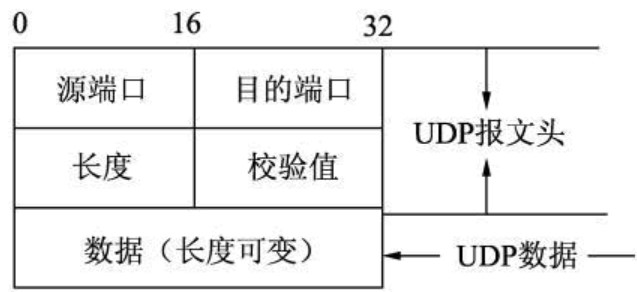
* User Datagram Protocal（RFC 768）-用户数据报协议
* 基于IP协议：提供复用/分用，简单的错误校验（UDP校验和）
* “Best effort”服务-尽力而为，可能丢失、非按序到达
* 无连接：UDP发送方与接收方不需要握手，每个UDP段的处理独立于其他段
* 优势：
    > 无需建立连接（减少延迟）  
    > 实现简单：无需建立连接状态  
    > 头部开销小  
    > 没有拥塞控制：应用可更好的控制发送时间与速率  
* 用途：常用于流媒体应用-容忍丢失、速率敏感
* 如何实现可靠传输：在应用层增加可靠性机制、应用特定的错误恢复机制
* UDP校验和（checksum）：检测UDP段在传输中是否发生错误（如位翻转）
    * 发送方
    > * 将段的内容视为16-bit整数  
    > * 校验和计算：计算所有整数的和，进位加在和的后面，将得到的值按位求反，得到校验和（*如有进位，相当于再把进位单独视为一个数，与和相加*）  
    > * 发送发将校验和放入校验和字段  
    * 接受方
    > * 计算所收到段的校验和  
    > * 将其与校验和字段进行比较  
        > 不相等：检测出错误
        > 相等：没有检测出错误（但可能有错误）
## 3.3. 可靠数据传输
 * 不错、不丢、不乱
 > 可靠数据传输协议（Rdt）——停-等协议  
 > 确认机制（Acknowledgements,ACK）:接收方显式的告知发送方分组已正确接收  
 > NAK：接收方显式的告知发送方分组有错误。发送方收到NAK后，重传分组  
### 3.3.1. Rdt 2.0
发送方状态机：   
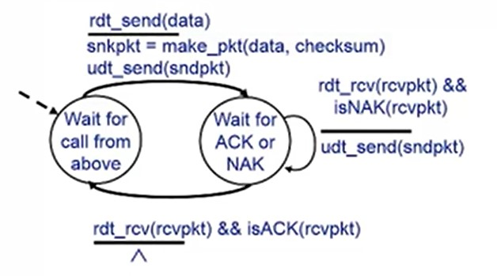
* 等待上层应用调用。上层调用后，数据加入校验和，调用udt_send发送；   
* 等待接收方确认，收到反馈的消息。如果是NAK，重发数据，继续等待接收方确认。如果是ACK，回到上一个状态，等待上层应用调用  

接收方状态机：   
<div align="center">

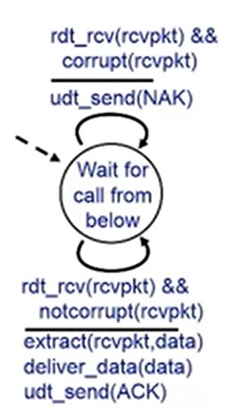</div>
* 接收数据并检查，如有错误，发送NAK。如没有错误，提取数据，向上层交付，并发送ACK。
* 总是在等待下层呼叫
### 3.3.2. Rdt 2.1
* 为应对ACK、NAK破坏，为ACK、NAK信息增加了校验和，如果发送发收到坏的ACK、NAK信息，也会重传（不能确认是ACK，还是NAK了）
* 为应对重复分组，为每个分组增加序列号（两个序列号0、1就够用了）   
接收方判断是否重复，若信息重复，仍发送ACK信号
### 3.3.3. Rdt 2.2
* 与Rdt 2.1 功能相同，但是只使用ACK
* 接收方在ACK中显式加入最后一个被正确接收的分组的序列号
### 3.3.4. Rdt 3.0
* 信道既可能发生错误，又可能丢失分组
* 发送发等待合理的时间，如果没有收到ACK，重传（需要定时器）
* 能正常工作，但性能很差
### 3.3.4. 流水线机制（滑动窗口协议）
* Rdt性能不足
* 允许发送方在收到ACK之前连续发送多个分组
    > 需要更大的序列号范围  
    > 需要发送方和/或接收方需要更大的存储空间以缓存分组
#### 3.3.4.1. GBN
* Go-Back-N协议
* 采用累计确认的机制，当收到序列号为N的ACK消息，代表N之前（包含N）都已经被正确接收了（可能受到重复ACK）
* 设置了计时器。若超时，发送方将会重传序列号大于等于N，但还未收到ACK的所有分组。
* 对于接收方而言，没有缓存，只需记住唯一的序列号，所以对于乱序到达的分组，直接丢弃
#### 3.3.4.2. SR
* Selective Repeat协议（选择性重复）
* 接收方对每个分组单独进行确认（设置缓存机制，缓存乱序到达的分组）
* 发送方只重传那些没有收到ACK的分组，为每个分组单独设置计数器。
* 序列号的个数应该大于发送发与接受方窗口长度之和
## 3.4. TCP协议
* 点对点的通信
* 可靠、按序的字节流
* 流水线机制：基于拥塞控制和流量控制机制动态设置窗口尺寸
* 发送方、接收方缓存
* 全双工：同一连接中能够传输双向数据流
* 面向连接
    > 通信双方在发送数据之前必须建立连接  
    > 连接状态只在连接的两端中维护，在沿途节点中并不维护状态  
    > TCP连接包括：两台主机上的缓存、连接状态变量、socket等
### 3.4.1. TCP段结构
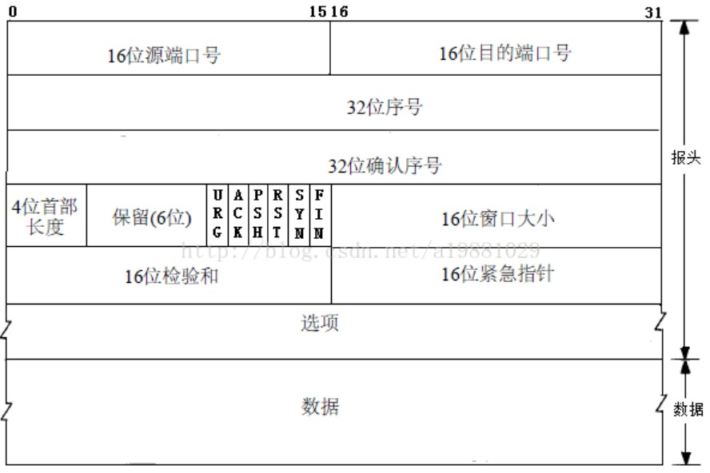
* 源端口、目的端口号
* 序列号（Seq）：指的是segment中第一个**字节**的编号，而不是segment的编号。建立TCP连接时，双方随机选择序列号
* ACKs（ACK的序列号）：希望接收的下一个字节的序列号。累计确认，该序列号之前的所有字节均已被正确接收
* 对于乱序到达的Segment，TCP规范中没有规定，由TCP的实现者做出决策
### 3.4.2. 可靠数据传输
* 定时器时间的设置：参考测量从段发送到接收到ACK的时间。
* 超时，只重传引起超时的Segment（接近SR）
* 使用一个定时器（接近GBN）
* 使用累计确认机制（接近GBN）：回复的ACK序列号代表着下一次想要收到的报文段
* **快速重传**机制：在TCP中，如果发生超时时间，超时时间间隔会加倍，导致丢失分组要等待很长时间。所以可以通过重复ACK检测分组丢失（如果某个分组丢失，其后面的分组到达后均会回传一个丢失分组的ACK。如果发送方收到对同一数据的3个ACK，则假定该数据之后的段已经丢失），在定时器超时之前即进行重传。
### 3.4.3. TCP流量控制
* 发送方传输数据若过多过快，接收方的缓存溢出，淹没接收方
* 接收方通过在Segment的头部字段将缓存区域的大小告诉发送方，发送方限制自己已发送但还未收到ACK的数据不超过接收方的缓存大小
### 3.4.4. TCP连接管理
***建立连接***：
1. 客户机向服务器发送SYN报文段 （SYN是TCP报文段里一个特殊的标志位）
    * SYN=1，表示想要建立连接  
    * 传递客户机初始的序列号（一般随机）  
    * 不携带数据  
2. 服务器收到SYN，如果想要建立连接，答复SYNACK报文段
    * 服务器会分配缓存
    * 选择自己的初始的序列号告知客户端
    * 回复ACK，表示自己受到请求
    * SYN仍为1
3. 客户机收到SYNACK后，会答复一个ACK报文段，SYN标志位置0，表示客户机收到了服务器同意建立连接的报文段，可以包含数据  
* 服务器会在第二步分配资源，会保留一段时间，在确认不会收到ACK后再释放
* 可能的网络攻击，大量客户机请求建立TCP连接，但不回复ACK  

***连接拆除***：
* 客户机、服务器均可发起请求，但多数是客户机发起请求
1. 客户机向服务器发送FIN控制段（FIN也是TCP报文段里的标志位）
2. 服务器收到FIN后，回复ACK，关闭连接，发送FIN
3. 客户机收到FIN，回复ACK（进入等待，如果收到FIN，会重新发送ACK）
4. 服务器收到ACK，连接关闭
## 3.5. 拥塞控制
* 太多发送主机发送了太多数据或者发送速度过快，以至于网络无法处理（分组丢失、分组延迟过大）
### 3.5.1. 拥塞的代价
1. 时延
2. 拥塞造成更多的丢失和定时器超时，造成资源的浪费  
对于吞吐率曲线来说：进入网络的数据量会小于经网络输出的数据
3. 对于多跳网络来说，当分组丢掉时，任何用于该分组的上游传输能力被浪费掉了  
对于吞吐率曲线来说：当进入网络的数据量越来越大时，经过网络的输出数据会先增大后减小，直至网络的资源均被浪费掉了，几乎没有输出的数据
### 3.5.2. 控制方式
1. 端到端拥塞控制  
    * 网络层不需要显式的提供支持
    * 端系统通过观察丢失、时延等网络行为判断是否发生了拥塞
    * TCP采用这种方式
2. 网络辅助的拥塞控制
    * 路由器向发送方显式的反馈网络拥塞信息
    * 简单的拥塞控制指令（1bit）：SNA、DECbit、TCP/IP ECN、ATM
    * 指示发送方应该采取何种速率
### 3.5.3. TCP拥塞控制
* 发送者通过控制最后一个发送的段与最后一个收到ACK的段的数量的差来控制网络中的段的数量
* 感知拥塞：当出现超时或3个重复的ACK信号时，意味着发生了拥塞

调整方式：
1. 加性增-乘性减：AIMD
    * 逐渐增加发射速率，谨慎探测可用带宽，直到发生丢失
    * 每个发送与接收到对应ACK的时间中，增加一个段
    * 发生丢失后，将每个发送与接收到对应ACK的时间中段的数量减半
    * 像一个锯齿图
2. 慢启动：SS
    * TCP建立时，在每个发送与接收到对应ACK的时间中，只有一个段。可用带宽远远高于初始速率
    * 当连接开始时，指数型增长
    * 每收到一个ACK，段的数量加1（1，2，4，8，……）
    * 初始速率慢，但是快速攀升

一般而言：设置一个Threshold变量，其值为发生loss事件前发送与接收到对应ACK的时间中段的数量的1/2。段的数量从1开始指数增，到达Threshold值时，进行线性增。当出现超时事件，重置Threshold变量，而段的数量又从1开始增；当出现3个重复的ACKs时，段的数量减为一半，即新的Threshold变量值，然后线性增长。（超时比3个重复ACKs代表的拥塞更严重）  

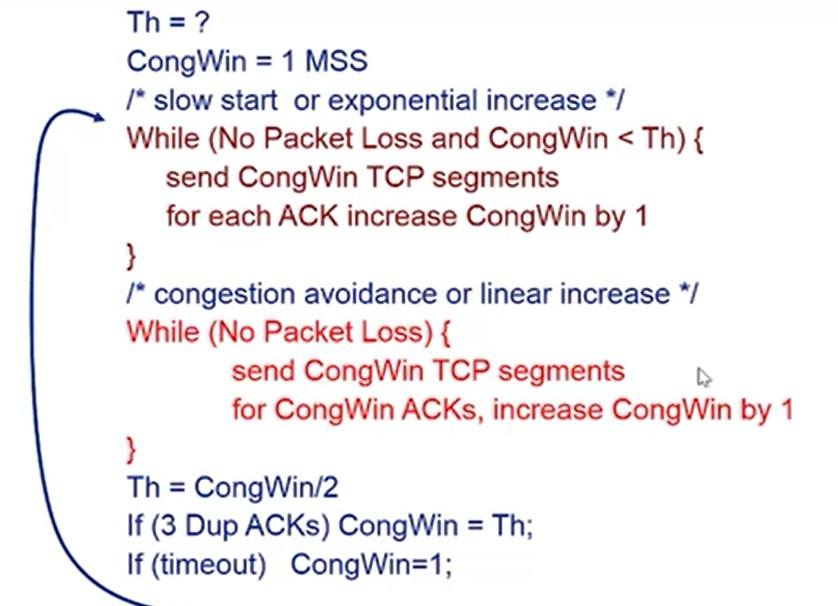
### 3.5.4. 公平性
* 两个TCP连接占用的网络资源会趋于公平（当发生拥塞时，占用资源高的连接减少的段也更多，所以会趋于公平）
* UDP会占用网络资源，拥塞时不进行控制，但TCP会进行控制，所以对于UDP与TCP共用网络时，对TCP连接不友好
* 当一个用户建立多个TCP连接时，会对其他用户不公平

## 4. 网络层
* 发送主机：将数据段封装在数据报中
* 接收主机：向传输层交付数据段
* 每个主机和路由器都运行网络层协议
* 路由器检验所有穿越它的IP数据报的头部域——决策如何处理IP数据报
* 转发：将分组从路由器的输入端口转移到合适的输出端口（转发表确定在本路由器如何转发分组）
* 路由：确定分组从源到目的经过的路径（路由算法/协议确定通过网络的端到端路径，记录到转发表中）
* 连接建立：数据分组传输之前两端主机首先建立虚拟/逻辑连接。网络层连接两个主机之间（路径上的路由器等网络设备参与其中）；传输层连接两个应用进程之间（对中间网络设备透明）
* 无连接服务：不事先为系列分组的传输确定传输路径；每个分组独立确定传输路径；不同分组可能传输路径不同。如数据报网络
* 连接服务：首先为系列分组的传输确定从源到目的经过的路径（建立连接）；然后沿该路径传输系列分组；系列分组传输路径相同；传输结束后拆除连接。如虚电路网络
    >虚电路连接  
    >* 每个分组携带虚电路标识（VC ID），而不是目的主机地址。每段链路建立虚电路的能力不同，所以VC ID也不会一样，所以沿路每段链路一个编号，利用转发表记录经过的每条虚电路。（也就是说，同一条VC，在每段链路上的VC ID通常不同）；路由器转发分组时依据转发表改写/替换虚电路号。
    >* 虚电路经过的每个网络设备（如路由器），维护每条经过它的虚电路连接状态
    >* 预分配资源--可预期服务性能
## 4.1. IPv4
### 4.1.1. IP数据报格式
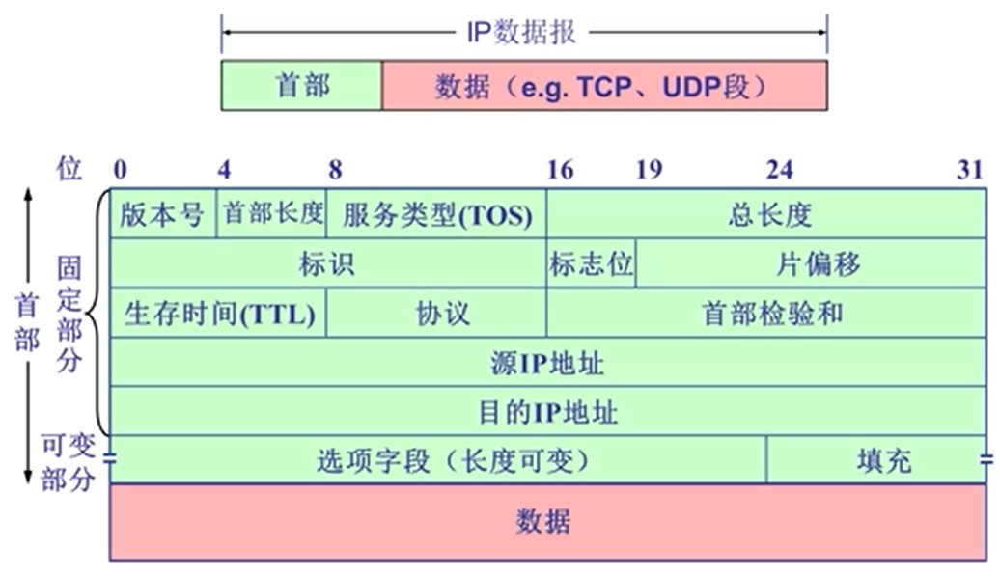
* IP数据报=首部+数据（如TCP、UDP段）
* 首部=固定部分+可变部分
* 固定部分（共20个字节）
    > **版本号**（4bit）：IP协议的版本号，此为4。IPv6对应6  
    > **首部长度**（4bit）：IP分组首部长度。以四字节为单位。例如：没有可变部分的话，首部有20个字节，此时首部长度这个标志位为5。  
    > **服务类型**（TOS）（8bit）：指示期望获得哪种类型的服务。只有在网络提供区分服务时使用。一般情况下不使用  
    > **总长度**（16bit）：IP分组的总字节数（首部+数据）。最大的IP分组的总长度：65535字节。可以封装的数据最大是65515字节  
    > **标识**（16bit）：标识一个IP分组。IP协议利用一个计数器，每产生一个IP分组，计数器加一，作为该IP分组的标识  
    > **标志位**（3bit）   
        >* 第一个bit保留；  
        >* 第二个bit为DF（Don't Fragment）,为1，禁止分片，为0，允许分片；  
        >* 第三个bit为MF（More Fragment），为1，非最后一片，为0，最后一片（或未分片）    
    >
    > **片偏移**（13bit）：一个IP分组分片封装原IP分组数据 *（不包含首部字段）* 的相对偏移量。片偏移字段以8字节为单位   
    > **生存时间**（TTL）（8bit）：IP分组在网络中可以通过的路由器数（或跳步数）。路由器转发一次分组，TTL减1。如果TTL=0，路由器则丢弃该IP分组（通常会向源主机发送ICMP报文）  
    > **协议**（8bit）：指示IP分组封装的是哪个协议的数据包（如：TCP-6或UDP-17）  
    > **首部校验和**（16bit）：实现对IP分组首部的差错检测。计算检验和时，该字段置全0。采用反码算数运算求和，和的反码作为首部校验和字段。由于转发过程中，如TTL等数据会变化，所以每次转发要重新计算（逐跳计算、逐跳校验）  
    > **源IP地址**（32bit）：标识发送分组的源主机/路由器（网络接口）的IP地址  
    > **目的IP地址**（32bit）：标识接收分组的目的主机/路由器（网络接口）的IP地址   
* 可变部分
    > 选项字段（长度可变）：范围在0-40字节之间。携带安全、源选路径（发送数据报时，在源主机就确定的路径）、时间戳和路由信息等记录。实际上很少被使用  
    > 填充（长度可变）：范围在0-3字节之间。目的是补齐整个首部，符合32位对齐，即保证首部长度是4字节的倍数 
### 4.1.2. IP分片
* 最大传输单元（MTU）：网络链路存在MTU--链路层数据帧可封装数据的上限。不同链路的MTU不同
* 大的IP分组向较小MTU链路转发时，**可以**被分片。如果数据报不让分片，会被丢掉（通常会向源主机发送ICMP报文）
* 一个IP分组分为多片IP分组，IP分片到达**目的主机**后进行“重组”。路由器只管分，不管装
* 涉及的IP首部相关字段：总长度、标识、标志位和片偏移
* 分片时每个分片的标识复制原IP分组的标识
* 通常分片时，除最后一个分片，其他分片均分为MTU允许的最大分片（由于片偏移字段以8字节为单位计数，所以如果MTU-头部字段的差不是8字节的倍数，那么应该取小于差的最大的8的倍数的值）
### 4.1.3. IP编址
* 接口：主机/路由器与物理链路的连接。通常路由器有多个接口，主机只有一个
* IP地址与每个接口关联
* IP地址=网络号(高比特位)+主机号(低比特位)
* IP子网：IP地址具有相同网络号的设备接口；不跨越路由器（第三及以上层网络设备）可以彼此物理联通的接口
* ”有类“编址
    >* 1/2；0.0.0.0~127.255.255.255；A类地址  
    > 二进制表示中，首位为0  
    > 网络号占用8bit，主机号占用24bit。可以编址的网络空间为2^7
    >* 1/4；128.0.0.0~191.255.255.255；B类地址  
    > 二进制表示中，首位为10  
    > 网络号占用16bit，主机号占用16bit。可以编址的网络空间为2^14
    >* 12.5%；192.0.0.0~223.255.255.255；C类地址  
    > 二进制表示中，首位为110  
    > 网络号占用24bit，主机号占用8bit。可以编址的网络空间为2^21
    >* 6.25%；224.0.0.0~239.255.255.255；D类地址  
    > 二进制表示中，首位为1110  
    > 一种组播地址。标识一组主机，理论上可以分布在互联网中的每一个地方。只能作为目的地址。
    >* 6.25%；240.0.0.0~255.255.255.255；E类地址  
    > 二进制表示中，首位为1111  
    > 保留
* 特殊的IP地址
    >* **网络号与主机号均全0**：可以作为IP分组源地址，不可作为IP分组的目的地址。在本网范围内表示主机;在路由表中用于表示默认路由（相当于表示整个INternet网络）  
    >* **网络号全0，主机号为特定值**：不可以做为源地址，可以作为目的地址。表示本网内某个特定主机  
    >* **网络号全1，主机号全1**：不可以做为源地址，可以作为目的地址。本网的广播地址（路由器不转发）（发送广播分组的主机所在的IP子网内）  
    >* **网络号为特定值，主机号全0**：不可以做为源地址，也不可以作为目的地址。网络地址，表示一个网络
    >* **网络号为特定值，主机号全1**：不可以做为源地址，可以作为目的地址。直接广播地址，对特定网络上的所有主机进行广播
    >* **网络号为127，主机号为非全0、非全1的任何数**：可以做为源地址，也可以作为目的地址。用于本地软件环回测试，称为环回地址
* 私有IP地址：只用于内部网络，在公网无效
    >* A类：网络号为10的1个块  
    >* B类：网络号为172.16~172.31，共16块  
    >* C类：192.168.0~192.168.255，共256块  
### 4.1.4. 子网划分
* 借助主机号中的高比特位划分，即：IP地址=网络号(高比特位)+子网号(原网络主机号部分比特)+主机号(低比特位)
* 子网掩码
    > 也是32位  
    > 也是点分十进制  
    > 网络号、子网号全取1；主机号全取0
* A网的默认子网掩码为：255.0.0.0  
B网的默认子网掩码为：255.255.0.0  
C网的默认子网掩码为：255.255.255.0    
对于某一个特定的主机，其子网掩码为255.255.255.255  
* 准确确定子网大小：子网地址+子网掩码
* 将IP分组的目的IP地址与子网掩码按位与运算，提取子网地址。和路由器的转发表对比，看是否属于某个子网
* 对子网进行划分后，特殊IP地址的判断类似原地址，此时的网络号指网络号+子网号，主机号指划分后的主机号(低比特位)。所以会增加特殊IP地址数，会有一定的地址浪费。
## 4.2. CIDR
* 无类域间路由（Classless InterDomain Routing）：消除传统的A类、B类、C类地址界限。将网络号和子网号统称为网络前缀（Prefix），可以任意长度
* 融合了子网地址和子网掩码，方便子网划分
* 无类地址格式：a.b.c.d/x。x为网络前缀的长度，单位为bit，即表示占了多少个字节
* 提高IPv4地址空间分配效率
* 提高路由效率（将多个子网聚合为一个较大的子网/构造超网）。对几个较小的子网实现**路由聚合**。
* 路由聚合理想条件下：各个子网IP地址连续，且为2的幂次
* 路由聚合场景：如对于外网来说，路由器只需要将内网聚合成一个网络，具体在内网中如何路由，由内网的路由器控制，简化了路由表。
* 可能出现“网络黑洞”（*符合一个路由聚合条件的子网信息，但应该发送到另一个网络，使得信息无法被正确的网络接收。属于IP地址分配的问题*），采用最长前缀匹配优先原则，选用更具体的路由
## 4.3. DHCP
* 主机获得IP地址的方式：
    >* “硬编码”——静态配置  
    >* 动态主机配置协议——DHCP（Dynamic Host Configuration Protocol）
* 从服务器动态获取IP地址、子网掩码、默认网关地址、DNS服务器名称和IP地址
* “即插即用”；允许地址重用；支持在用地址续租；支持移动用户加入网络
* 新到主机（DHCP客户）需要本网IP地址过程
    >* 主机广播“DHCP discover”（发现报文）  
    >* DHCP服务器利用“DHCP offer”（提供报文）进行响应  
    >* 主机请求IP地址“DHCP request”（请求报文）  
    >* DHCP服务器分配IP地址“DHCP ack”（确认报文）  
    > 这四步均通过广播发送，即目的地址IP为全1
* DHCP服务器是67号端口，客户是68号端口
* DHCP协议在应用层实现。请求报文封装在UDP数据报中
## 4.4. NAT
* 网络地址转换
* 本地网络内通信的IP数据报的源与目的IP地址均在子网内，利用私有IP地址。所有离开本地网络去往Internet的数据报的源IP地址不能使用私有IP地址，要转换为相同的NAT IP地址以及不同的端口号（NAT IP地址即公网IP地址）
* 动机
    >* 只能/需从ISP申请一个IP地址，如IPv4地址耗尽
    >* 本地网络设备IP地址的变更，无需通告外界网络
    >* 变更ISP时，无需修改内部网络设备IP地址
    >* 内部网络设备对外界网络不可见，即不可直接寻址（安全）
* 实现
    >替换(出)  
    >* 利用（NAT IP地址，新端口号）替换每个外出IP数据报的（源IP地址，源端口号）  
    >
    >记录  
    >* 将每对（NAT IP地址，新端口号）与（源IP地址，源端口号）的替换信息存储在NAT转换表中
    >
    >替换(入)   
    >* 根据NAT转换表，利用（源IP地址，源端口号）替换每个进入内网IP数据报的（目的IP地址，目的端口号），即（NAT IP地址，新端口号）
* 端口号16bit，空间为0~65535。可以同时处理6万多个并行连接
* 争议
    >* NAT一般在路由器中实现。路由器是第三层的设备，应该只处理第3层功能。但是NAT要求处理第四层数据段的内容（端口号）
    >* 违背端到端的通信原则（端口号是传输层的，传输层是端到端的通信。NAT需要修改端口号。）。端到端通信的应用开发者必须考虑到NAT的存在，例如P2P
    >* 地址短缺问题应由IPv6来解决
* NAT穿透问题：客户不能利用私有IP直接访问服务器，服务器对外唯一可见的地址是公网IP
    >* 解决方案一：静态配置NAT，将特定端口的连接请求转发给服务器
    >* 解决方案二：利用UPnP（Universal Plug and Play）互联网网关设备协议（IGD—Internet Gateway Device）自动配置。内部的服务器可以自动的学习到NAT网络中公共IP地址；在NAT转发表中，增删端口映射
    >* 解决方案三：中继。NAT内部的客户事先与中继服务器建立连接，外部客户也与中继服务器建立连接，中继服务器桥接两个连接的分组。如Skype
## 4.5. ICMP
* 互联网控制报文协议（ICMP）（Internet Control Message Protocol）
* 功能：支持主机或路由器：差错（异常）报告；网络探询。通过发送报文实现
* 两类ICMP报文
    > 差错报告报文（5种）  
    >* 目的不可达
    >* 源抑制：当路由器发现自身缓存已满，导致后续到达的数据报被丢弃。希望源主机收到源抑制报文后，降低发送IP数据报的速率
    >* 超时/超期：如TTL超时/超期
    >* 参数问题：当路由器发现数据报的某些域或字段的参数有问题时
    >* 重定向：路由器认为到达该目的网络的数据报不该由自己转发时，让源主机将到达该目的主机的数据报由另外的网关发送出去
    >
    > 网络探询报文（2组）
    >* 回声请求与应答报文：主机探测到达某一个网络是否通畅。应用如：Ping工具
    >* 时间戳请求与应答报文   
    > 
    >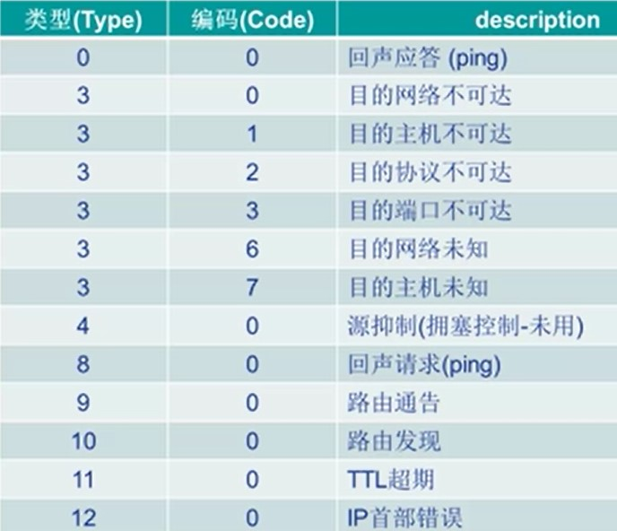
* 几种不发送ICMP差错报告报文的特殊情况
    >* 对ICMP差错报告报文不再发送ICMP差错控制报文
    >* 除第一个IP数据报分片外，对所有后续分片均不发送ICMP差错报告报文
    >* 对所有多播IP数据报均不发送ICMP差错报告报文
    >* 对具有特殊地址（如127.0.0.0 或0.0.0.0）的IP数据报不发送ICMP差错报告报文
* 几种ICMP报文已不再使用
    >* 信息请求与应答报文
    >* 子网掩码请求与应答报文
    >* 路由器询问和通告报文
* ICMP报文格式：ICMP报文封装到IP数据报中传输  
    > 头部(8字节)
        >* 类型(8bit)
        >* 代码(8bit)
        >* 校验和(16bit)：对整个ICMP报文进行校验计算
        >* 还有4个字节取决于ICMP报文的类型  
    >
    > 数据部分：长度取决于类型  
    
    >报文数据封装
        >1. 出差错的IP数据报：IP数据报首部+IP数据报的数据字段
        >2. ICMP差错报告报文：ICMP的前8字节+出差错的IP数据报首部+出差错的IP数据报的数据字段的前8字节  
        >（选择出差错的IP数据报的数据字段的前8字节？当使用UDP时，前8个字节就是UDP数据段的头；当使用TCP时，虽然TCP数据段的头为20个字节，但是前8个字节包含了源端口号、目的端口号等信息）
        >3. 装入ICMP报文的IP数据报：首部+ICMP差错报告报文
* ICMP应用举例：Traceroute。利用初始化TTL=1，依次对TTL+1，探测源主机到目的主机需要经过那些路由器及IP地址。  
（经过下一个路由器，会返回TTL=0的ICMP报文，携带该路由器及IP地址信息）  
（目的端口号为不可能使用的端口号，如3万以上的。所以当到达目的主机时，返回的ICMP报文为目的端口号不可用）  
（数据报传输特性，所以路由路径可能会变）
## 4.6. IPv6
* 动机
    >* 32为IPv4地址空间分配殆尽
    >* 改进首部格式。快速处理/转发数据报；支持QoS
* IPv6数据报格式
    >* 固定长度的40字节基本首部；  
    不允许分片（如果需要分片，由源主机分）
    >* 固定首部和数据之间有扩展首部（又称选项）（可以为0，也可以多个。主要定义了6个），路由器基本不需处理    

    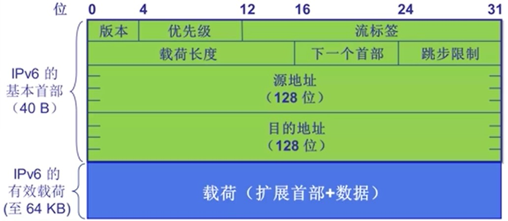
    >* 优先级（4bit）：标识数据报的优先级
    >* 流标签（8bit）：标识同一个“流”中的数据报。（流：从一个特定的主机出发，到达特定目的的一系列数据报，这一系列的数据报的流标签是相同的）
    >* 载荷长度（扩展首部+数据的长度）（16bit）：最大64KB
    >* 下一个首部：标识下一个选项的扩展首部或上层协议首部（如TCP首部）  
    （每一个扩展首部也有下一个首部的字段，…，最后一个扩展首部指向上一层协议的首部）
    >* 跳步限制——TTL
* 与IPv4的不同
    >* 校验和：彻底移除，以减少每跳处理时间
    >* 选项：允许，但是从基本选项首部移除，定义多个选项首部，通过“下一个首部”字段指示
    >* ICMPv6：新版ICMP  
        > 附加报文类型。如“Packet Too Big”    
        > 多播组管理功能：将IPv4中的IGMP协议集成进来了
* IPv6地址表现形式
    >* 一般形式：一共8组16bit的，由冒号“:”分割的16进制表现形式
    >* 压缩形式：连续多组均为0，用双冒号“::”表示（双冒号不能在同一个IP地址中连续两次使用）
    >* IPv4—嵌入形式：前80bit固定为0，接下来16bit为1，余下的32bit用标准IPv4表示
    >* 地址前缀：类似IPv4中的CIDR，无类域间路由。IP地址+‘/’+前缀（IPv6不再使用掩码）
    >* URLs：在URL中可能会出现歧义，所以会用中括号`[]`将IP地址括起来,后面再加冒号，再加端口号。如：`http://[3FFE::1:800:200C:417A]:8000`
* IPv6基本地址类型
    >* 单播：一对一通信
    >* 多播：一对多通信
    >* 任意波：一对一组之一（最近一个）通信
* IPv4到IPv6过度（共存阶段）——隧道：IPv6数据报作为IPv4数据报的载荷进行封装，穿越IPv4网络  
（应用场景：IPv6传输的数据经过只支持IPv4的路由器）  
（与只支持IPv4的路由器连接的边缘路由器必须是双协议的）


